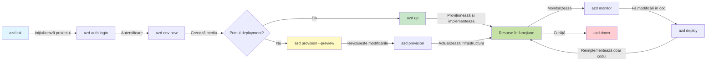
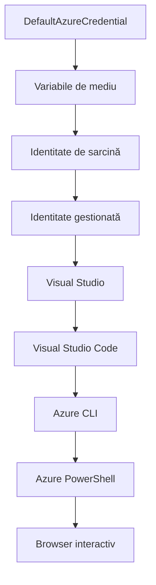

<!--
CO_OP_TRANSLATOR_METADATA:
{
  "original_hash": "e855e899d2705754fe85b04190edd0f0",
  "translation_date": "2025-11-23T17:00:40+00:00",
  "source_file": "docs/getting-started/azd-basics.md",
  "language_code": "ro"
}
-->
# AZD Bazele - Înțelegerea Azure Developer CLI

# AZD Bazele - Concepte de bază și fundamente

**Navigare capitol:**
- **📚 Acasă Curs**: [AZD Pentru Începători](../../README.md)
- **📖 Capitol curent**: Capitolul 1 - Fundamente & Start Rapid
- **⬅️ Precedent**: [Prezentare Curs](../../README.md#-chapter-1-foundation--quick-start)
- **➡️ Următor**: [Instalare & Configurare](installation.md)
- **🚀 Capitol Următor**: [Capitolul 2: Dezvoltare AI-First](../microsoft-foundry/microsoft-foundry-integration.md)

## Introducere

Această lecție te introduce în Azure Developer CLI (azd), un instrument puternic de linie de comandă care accelerează tranziția de la dezvoltarea locală la implementarea în Azure. Vei învăța conceptele fundamentale, caracteristicile de bază și vei înțelege cum azd simplifică implementarea aplicațiilor cloud-native.

## Obiective de învățare

Până la sfârșitul acestei lecții, vei:
- Înțelege ce este Azure Developer CLI și scopul său principal
- Învăța conceptele de bază despre șabloane, medii și servicii
- Explora caracteristicile cheie, inclusiv dezvoltarea bazată pe șabloane și Infrastructure as Code
- Înțelege structura proiectului azd și fluxul de lucru
- Fi pregătit să instalezi și să configurezi azd pentru mediul tău de dezvoltare

## Rezultate de învățare

După finalizarea acestei lecții, vei putea:
- Explica rolul azd în fluxurile de lucru moderne de dezvoltare cloud
- Identifica componentele structurii unui proiect azd
- Descrie cum funcționează împreună șabloanele, mediile și serviciile
- Înțelege beneficiile Infrastructure as Code cu azd
- Recunoaște diferite comenzi azd și scopurile lor

## Ce este Azure Developer CLI (azd)?

Azure Developer CLI (azd) este un instrument de linie de comandă conceput pentru a accelera tranziția de la dezvoltarea locală la implementarea în Azure. Simplifică procesul de construire, implementare și gestionare a aplicațiilor cloud-native pe Azure.

### 🎯 De ce să folosești AZD? O comparație din lumea reală

Să comparăm implementarea unei aplicații web simple cu o bază de date:

#### ❌ FĂRĂ AZD: Implementare manuală în Azure (30+ minute)

```bash
# Pasul 1: Creează grupul de resurse
az group create --name myapp-rg --location eastus

# Pasul 2: Creează planul de servicii pentru aplicație
az appservice plan create --name myapp-plan \
  --resource-group myapp-rg \
  --sku B1 --is-linux

# Pasul 3: Creează aplicația web
az webapp create --name myapp-web-unique123 \
  --resource-group myapp-rg \
  --plan myapp-plan \
  --runtime "NODE:18-lts"

# Pasul 4: Creează contul Cosmos DB (10-15 minute)
az cosmosdb create --name myapp-cosmos-unique123 \
  --resource-group myapp-rg \
  --kind MongoDB

# Pasul 5: Creează baza de date
az cosmosdb mongodb database create \
  --account-name myapp-cosmos-unique123 \
  --resource-group myapp-rg \
  --name tododb

# Pasul 6: Creează colecția
az cosmosdb mongodb collection create \
  --account-name myapp-cosmos-unique123 \
  --resource-group myapp-rg \
  --database-name tododb \
  --name todos

# Pasul 7: Obține șirul de conexiune
CONN_STR=$(az cosmosdb keys list \
  --name myapp-cosmos-unique123 \
  --resource-group myapp-rg \
  --type connection-strings \
  --query "connectionStrings[0].connectionString" -o tsv)

# Pasul 8: Configurează setările aplicației
az webapp config appsettings set \
  --name myapp-web-unique123 \
  --resource-group myapp-rg \
  --settings MONGODB_URI="$CONN_STR"

# Pasul 9: Activează jurnalizarea
az webapp log config --name myapp-web-unique123 \
  --resource-group myapp-rg \
  --application-logging filesystem \
  --detailed-error-messages true

# Pasul 10: Configurează Application Insights
az monitor app-insights component create \
  --app myapp-insights \
  --location eastus \
  --resource-group myapp-rg

# Pasul 11: Leagă App Insights de aplicația web
INSTRUMENTATION_KEY=$(az monitor app-insights component show \
  --app myapp-insights \
  --resource-group myapp-rg \
  --query "instrumentationKey" -o tsv)

az webapp config appsettings set \
  --name myapp-web-unique123 \
  --resource-group myapp-rg \
  --settings APPINSIGHTS_INSTRUMENTATIONKEY="$INSTRUMENTATION_KEY"

# Pasul 12: Construiește aplicația local
npm install
npm run build

# Pasul 13: Creează pachetul de implementare
zip -r app.zip . -x "*.git*" "node_modules/*"

# Pasul 14: Implementează aplicația
az webapp deployment source config-zip \
  --resource-group myapp-rg \
  --name myapp-web-unique123 \
  --src app.zip

# Pasul 15: Așteaptă și roagă-te să funcționeze 🙏
# (Nu există validare automată, este necesară testarea manuală)
```

**Probleme:**
- ❌ 15+ comenzi de reținut și executat în ordine
- ❌ 30-45 minute de muncă manuală
- ❌ Ușor de făcut greșeli (erori de tastare, parametri greșiți)
- ❌ Șiruri de conexiune expuse în istoricul terminalului
- ❌ Fără rollback automat în caz de eșec
- ❌ Greu de replicat pentru membrii echipei
- ❌ Diferit de fiecare dată (nereproductibil)

#### ✅ CU AZD: Implementare automată (5 comenzi, 10-15 minute)

```bash
# Pasul 1: Inițializați din șablon
azd init --template todo-nodejs-mongo

# Pasul 2: Autentificați-vă
azd auth login

# Pasul 3: Creați mediul
azd env new dev

# Pasul 4: Previzualizați modificările (opțional, dar recomandat)
azd provision --preview

# Pasul 5: Implementați totul
azd up

# ✨ Gata! Totul este implementat, configurat și monitorizat
```

**Beneficii:**
- ✅ **5 comenzi** vs. 15+ pași manuali
- ✅ **10-15 minute** timp total (mai ales așteptând Azure)
- ✅ **Zero erori** - automatizat și testat
- ✅ **Secrete gestionate în siguranță** prin Key Vault
- ✅ **Rollback automat** în caz de eșec
- ✅ **Complet reproductibil** - același rezultat de fiecare dată
- ✅ **Pregătit pentru echipă** - oricine poate implementa cu aceleași comenzi
- ✅ **Infrastructure as Code** - șabloane Bicep controlate prin versiuni
- ✅ **Monitorizare integrată** - Application Insights configurat automat

### 📊 Reducerea timpului și erorilor

| Metrică | Implementare manuală | Implementare AZD | Îmbunătățire |
|:--------|:---------------------|:-----------------|:-------------|
| **Comenzi** | 15+ | 5 | 67% mai puține |
| **Timp** | 30-45 min | 10-15 min | 60% mai rapid |
| **Rata de erori** | ~40% | <5% | Reducere de 88% |
| **Consistență** | Scăzută (manual) | 100% (automatizat) | Perfectă |
| **Onboarding echipă** | 2-4 ore | 30 minute | 75% mai rapid |
| **Timp de rollback** | 30+ min (manual) | 2 min (automatizat) | 93% mai rapid |

## Concepte de bază

### Șabloane
Șabloanele sunt fundația azd. Ele conțin:
- **Codul aplicației** - Codul sursă și dependențele tale
- **Definiții de infrastructură** - Resurse Azure definite în Bicep sau Terraform
- **Fișiere de configurare** - Setări și variabile de mediu
- **Scripturi de implementare** - Fluxuri de lucru automate pentru implementare

### Medii
Mediile reprezintă diferite ținte de implementare:
- **Dezvoltare** - Pentru testare și dezvoltare
- **Staging** - Mediu pre-producție
- **Producție** - Mediu de producție live

Fiecare mediu își menține propriile:
- Grupuri de resurse Azure
- Setări de configurare
- Stare de implementare

### Servicii
Serviciile sunt blocurile de construcție ale aplicației tale:
- **Frontend** - Aplicații web, SPAs
- **Backend** - API-uri, microservicii
- **Bază de date** - Soluții de stocare a datelor
- **Stocare** - Stocare de fișiere și blob-uri

## Caracteristici cheie

### 1. Dezvoltare bazată pe șabloane
```bash
# Răsfoiți șabloanele disponibile
azd template list

# Inițializați dintr-un șablon
azd init --template <template-name>
```

### 2. Infrastructure as Code
- **Bicep** - Limbaj specific domeniului Azure
- **Terraform** - Instrument multi-cloud pentru infrastructură
- **ARM Templates** - Șabloane Azure Resource Manager

### 3. Fluxuri de lucru integrate
```bash
# Finalizați fluxul de lucru pentru implementare
azd up            # Provizionare + Implementare, aceasta este automată pentru prima configurare

# 🧪 NOU: Previzualizați modificările infrastructurii înainte de implementare (SIGUR)
azd provision --preview    # Simulați implementarea infrastructurii fără a face modificări

azd provision     # Creați resurse Azure dacă actualizați infrastructura, utilizați aceasta
azd deploy        # Implementați codul aplicației sau reimplementați codul aplicației după actualizare
azd down          # Curățați resursele
```

#### 🛡️ Planificare sigură a infrastructurii cu Preview
Comanda `azd provision --preview` este revoluționară pentru implementări sigure:
- **Analiză dry-run** - Arată ce va fi creat, modificat sau șters
- **Zero risc** - Nu se fac modificări reale în mediul Azure
- **Colaborare în echipă** - Distribuie rezultatele preview înainte de implementare
- **Estimare costuri** - Înțelege costurile resurselor înainte de angajament

```bash
# Exemplu de flux de lucru pentru previzualizare
azd provision --preview           # Vezi ce se va schimba
# Revizuiește rezultatul, discută cu echipa
azd provision                     # Aplică schimbările cu încredere
```

### 📊 Vizualizare: Flux de lucru AZD


**Explicație flux de lucru:**
1. **Init** - Începe cu un șablon sau proiect nou
2. **Auth** - Autentifică-te cu Azure
3. **Mediu** - Creează un mediu de implementare izolat
4. **Preview** - 🆕 Previzualizează întotdeauna modificările infrastructurii mai întâi (practică sigură)
5. **Provision** - Creează/actualizează resursele Azure
6. **Deploy** - Trimite codul aplicației tale
7. **Monitor** - Observă performanța aplicației
8. **Iterate** - Fă modificări și redeployează codul
9. **Cleanup** - Elimină resursele când ai terminat

### 4. Gestionarea mediilor
```bash
# Creați și gestionați medii
azd env new <environment-name>
azd env select <environment-name>
azd env list
```

## 📁 Structura proiectului

O structură tipică de proiect azd:
```
my-app/
├── .azd/                    # azd configuration
│   └── config.json
├── .azure/                  # Azure deployment artifacts
├── .devcontainer/          # Development container config
├── .github/workflows/      # GitHub Actions
├── .vscode/               # VS Code settings
├── infra/                 # Infrastructure code
│   ├── main.bicep        # Main infrastructure template
│   ├── main.parameters.json
│   └── modules/          # Reusable modules
├── src/                  # Application source code
│   ├── api/             # Backend services
│   └── web/             # Frontend application
├── azure.yaml           # azd project configuration
└── README.md
```

## 🔧 Fișiere de configurare

### azure.yaml
Fișierul principal de configurare al proiectului:
```yaml
name: my-awesome-app
metadata:
  template: my-template@1.0.0

services:
  web:
    project: ./src/web
    language: js
    host: appservice
  api:
    project: ./src/api
    language: js
    host: appservice

hooks:
  preprovision:
    shell: pwsh
    run: echo "Preparing to provision..."
```

### .azure/config.json
Configurare specifică mediului:
```json
{
  "version": 1,
  "defaultEnvironment": "dev",
  "environments": {
    "dev": {
      "subscriptionId": "your-subscription-id",
      "location": "eastus"
    }
  }
}
```

## 🎪 Fluxuri de lucru comune cu exerciții practice

> **💡 Sfat de învățare:** Urmează aceste exerciții în ordine pentru a-ți dezvolta progresiv abilitățile AZD.

### 🎯 Exercițiul 1: Inițializează primul tău proiect

**Obiectiv:** Creează un proiect AZD și explorează structura acestuia

**Pași:**
```bash
# Utilizați un șablon dovedit
azd init --template todo-nodejs-mongo

# Explorați fișierele generate
ls -la  # Vizualizați toate fișierele, inclusiv cele ascunse

# Fișiere cheie create:
# - azure.yaml (configurația principală)
# - infra/ (codul infrastructurii)
# - src/ (codul aplicației)
```

**✅ Succes:** Ai directoarele azure.yaml, infra/ și src/

---

### 🎯 Exercițiul 2: Implementare în Azure

**Obiectiv:** Finalizează implementarea de la început până la sfârșit

**Pași:**
```bash
# 1. Autentificare
az login && azd auth login

# 2. Creează mediu
azd env new dev
azd env set AZURE_LOCATION eastus

# 3. Previzualizează modificările (RECOMANDAT)
azd provision --preview

# 4. Distribuie totul
azd up

# 5. Verifică distribuirea
azd show    # Vizualizează URL-ul aplicației
```

**Timp estimat:** 10-15 minute  
**✅ Succes:** URL-ul aplicației se deschide în browser

---

### 🎯 Exercițiul 3: Multiple medii

**Obiectiv:** Implementare în dev și staging

**Pași:**
```bash
# Deja avem dev, creează staging
azd env new staging
azd env set AZURE_LOCATION westus2
azd up

# Comută între ele
azd env list
azd env select dev
```

**✅ Succes:** Două grupuri de resurse separate în Azure Portal

---

### 🛡️ Resetare completă: `azd down --force --purge`

Când ai nevoie de o resetare completă:

```bash
azd down --force --purge
```

**Ce face:**
- `--force`: Fără solicitări de confirmare
- `--purge`: Șterge tot starea locală și resursele Azure

**Folosește când:**
- Implementarea a eșuat pe parcurs
- Schimbi proiecte
- Ai nevoie de un început proaspăt

---

## 🎪 Referință flux de lucru original

### Începerea unui proiect nou
```bash
# Metoda 1: Utilizați șablonul existent
azd init --template todo-nodejs-mongo

# Metoda 2: Începeți de la zero
azd init

# Metoda 3: Utilizați directorul curent
azd init .
```

### Ciclu de dezvoltare
```bash
# Configurați mediul de dezvoltare
azd auth login
azd env new dev
azd env select dev

# Implementați totul
azd up

# Faceți modificări și reimplementați
azd deploy

# Curățați după ce ați terminat
azd down --force --purge # comanda din Azure Developer CLI este un **reset complet** pentru mediul dvs.—utilă în special atunci când depanați implementări eșuate, curățați resursele orfane sau vă pregătiți pentru o reimplementare nouă.
```

## Înțelegerea `azd down --force --purge`
Comanda `azd down --force --purge` este o modalitate puternică de a elimina complet mediul azd și toate resursele asociate. Iată o defalcare a ceea ce face fiecare flag:
```
--force
```
- Sare peste solicitările de confirmare.
- Util pentru automatizare sau scripting unde inputul manual nu este fezabil.
- Asigură că procesul de eliminare continuă fără întreruperi, chiar dacă CLI detectează inconsistențe.

```
--purge
```
Șterge **toate metadatele asociate**, inclusiv:
Starea mediului
Folderul local `.azure`
Informații despre implementare în cache
Previne ca azd să "își amintească" implementările anterioare, ceea ce poate cauza probleme precum grupuri de resurse nepotrivite sau referințe de registru vechi.


### De ce să folosești ambele?
Când te-ai blocat cu `azd up` din cauza stării persistente sau implementărilor parțiale, această combinație asigură un **început curat**.

Este deosebit de util după ștergeri manuale de resurse în portalul Azure sau când schimbi șabloane, medii sau convenții de denumire a grupurilor de resurse.


### Gestionarea mai multor medii
```bash
# Creează mediu de testare
azd env new staging
azd env select staging
azd up

# Revino la dezvoltare
azd env select dev

# Compară mediile
azd env list
```

## 🔐 Autentificare și acreditive

Înțelegerea autentificării este crucială pentru implementările azd de succes. Azure folosește mai multe metode de autentificare, iar azd utilizează același lanț de acreditive folosit de alte instrumente Azure.

### Autentificare Azure CLI (`az login`)

Înainte de a folosi azd, trebuie să te autentifici cu Azure. Cea mai comună metodă este utilizarea Azure CLI:

```bash
# Autentificare interactivă (deschide browserul)
az login

# Autentificare cu un tenant specific
az login --tenant <tenant-id>

# Autentificare cu principalul de serviciu
az login --service-principal -u <app-id> -p <password> --tenant <tenant-id>

# Verifică starea curentă a autentificării
az account show

# Listează abonamentele disponibile
az account list --output table

# Setează abonamentul implicit
az account set --subscription <subscription-id>
```

### Flux de autentificare
1. **Login interactiv**: Deschide browserul implicit pentru autentificare
2. **Flux cod dispozitiv**: Pentru medii fără acces la browser
3. **Service Principal**: Pentru scenarii de automatizare și CI/CD
4. **Managed Identity**: Pentru aplicații găzduite pe Azure

### Lanțul DefaultAzureCredential

`DefaultAzureCredential` este un tip de acreditiv care oferă o experiență simplificată de autentificare prin încercarea automată a mai multor surse de acreditive într-o ordine specifică:

#### Ordinea lanțului de acreditive

#### 1. Variabile de mediu
```bash
# Setează variabilele de mediu pentru principalul serviciu
export AZURE_CLIENT_ID="<app-id>"
export AZURE_CLIENT_SECRET="<password>"
export AZURE_TENANT_ID="<tenant-id>"
```

#### 2. Workload Identity (Kubernetes/GitHub Actions)
Utilizat automat în:
- Azure Kubernetes Service (AKS) cu Workload Identity
- GitHub Actions cu OIDC federation
- Alte scenarii de identitate federată

#### 3. Managed Identity
Pentru resurse Azure precum:
- Mașini virtuale
- App Service
- Azure Functions
- Container Instances

```bash
# Verificați dacă rulează pe resursa Azure cu identitate gestionată
az account show --query "user.type" --output tsv
# Returnează: "servicePrincipal" dacă se utilizează identitatea gestionată
```

#### 4. Integrare cu instrumente de dezvoltare
- **Visual Studio**: Utilizează automat contul conectat
- **VS Code**: Utilizează acreditivele extensiei Azure Account
- **Azure CLI**: Utilizează acreditivele `az login` (cel mai comun pentru dezvoltarea locală)

### Configurarea autentificării AZD

```bash
# Metoda 1: Utilizați Azure CLI (Recomandat pentru dezvoltare)
az login
azd auth login  # Utilizează acreditările existente Azure CLI

# Metoda 2: Autentificare directă azd
azd auth login --use-device-code  # Pentru medii fără interfață grafică

# Metoda 3: Verificați statusul autentificării
azd auth login --check-status

# Metoda 4: Deconectați-vă și reautentificați-vă
azd auth logout
azd auth login
```

### Cele mai bune practici de autentificare

#### Pentru dezvoltare locală
```bash
# 1. Autentificare cu Azure CLI
az login

# 2. Verificați abonamentul corect
az account show
az account set --subscription "Your Subscription Name"

# 3. Utilizați azd cu acreditările existente
azd auth login
```

#### Pentru pipeline-uri CI/CD
```yaml
# GitHub Actions example
- name: Azure Login
  uses: azure/login@v1
  with:
    creds: ${{ secrets.AZURE_CREDENTIALS }}

- name: Deploy with azd
  run: |
    azd auth login --client-id ${{ secrets.AZURE_CLIENT_ID }} \
                    --client-secret ${{ secrets.AZURE_CLIENT_SECRET }} \
                    --tenant-id ${{ secrets.AZURE_TENANT_ID }}
    azd up --no-prompt
```

#### Pentru medii de producție
- Folosește **Managed Identity** când rulezi pe resurse Azure
- Folosește **Service Principal** pentru scenarii de automatizare
- Evită stocarea acreditivelor în cod sau fișiere de configurare
- Folosește **Azure Key Vault** pentru configurări sensibile

### Probleme comune de autentificare și soluții

#### Problemă: "Nu s-a găsit nicio subscripție"
```bash
# Soluție: Setează abonamentul implicit
az account list --output table
az account set --subscription "<subscription-id>"
azd env set AZURE_SUBSCRIPTION_ID "<subscription-id>"
```

#### Problemă: "Permisiuni insuficiente"
```bash
# Soluție: Verificați și atribuiți rolurile necesare
az role assignment list --assignee $(az account show --query user.name --output tsv)

# Roluri comune necesare:
# - Contributor (pentru gestionarea resurselor)
# - User Access Administrator (pentru atribuirea rolurilor)
```

#### Problemă: "Token expirat"
```bash
# Soluție: Re-autentificare
az logout
az login
azd auth logout
azd auth login
```

### Autentificare în diferite scenarii

#### Dezvoltare locală
```bash
# Cont de dezvoltare personală
az login
azd auth login
```

#### Dezvoltare în echipă
```bash
# Utilizați un chiriaș specific pentru organizație
az login --tenant contoso.onmicrosoft.com
azd auth login
```

#### Scenarii multi-tenant
```bash
# Comută între chiriași
az login --tenant tenant1.onmicrosoft.com
# Distribuie la chiriașul 1
azd up

az login --tenant tenant2.onmicrosoft.com  
# Distribuie la chiriașul 2
azd up
```

### Considerații de securitate

1. **Stocarea acreditivelor**: Nu stoca niciodată acreditivele în codul sursă
2. **Limitarea domeniului**: Folosește principiul privilegiului minim pentru service principals
3. **Rotirea token-urilor**: Rotește regulat secretele service principal
4. **Trail de audit**: Monitorizează activitățile de autentificare și implementare
5. **Securitatea rețelei**: Folosește endpoint-uri private când este posibil

### Depanarea autentificării

```bash
# Depanare probleme de autentificare
azd auth login --check-status
az account show
az account get-access-token

# Comenzi de diagnostic comune
whoami                          # Contextul utilizatorului curent
az ad signed-in-user show      # Detalii utilizator Azure AD
az group list                  # Testați accesul la resurse
```

## Înțelegerea `azd down --force --purge`

### Descoperire
```bash
azd template list              # Răsfoiți șabloane
azd template show <template>   # Detalii șablon
azd init --help               # Opțiuni de inițializare
```

### Gestionarea proiectelor
```bash
azd show                     # Prezentare generală a proiectului
azd env show                 # Mediul curent
azd config list             # Setări de configurare
```

### Monitorizare
```bash
azd monitor                  # Deschide portalul Azure
azd pipeline config          # Configurează CI/CD
azd logs                     # Vizualizează jurnalele aplicației
```

## Cele mai bune practici

### 1. Folosește nume semnificative
```bash
# Bun
azd env new production-east
azd init --template web-app-secure

# Evită
azd env new env1
azd init --template template1
```

### 2. Profită de șabloane
- Începe cu șabloane existente
- Personalizează pentru nevoile tale
- Creează șabloane reutilizabile pentru organizația ta

### 3. Izolarea mediilor
- Folosește medii separate pentru dev/staging/prod
- Nu implementa direct în producție de pe mașina locală
- Folosește pipeline-uri CI/CD pentru implementări în producție

### 4. Gestionarea configurației
- Folosește variabile de mediu pentru date sensibile
- Păstrează configurația în controlul versiunilor
- Documentează setările specifice mediului

## Progresul învățării

### Începător (Săptămâna 1-2)
1. Instalează azd și autentifică-te
2. Implementează un șablon simplu
3. Înțelege structura proiectului
4. Învață comenzile de bază (up, down, deploy)

### Intermediar (Săptămâna 3-4)
1. Personalizează șabloanele
2. Gestionează mai multe medii
3. Înțelege codul infrastructurii
4. Configurează pipeline-uri CI/CD

### Avansat (Săptămâna 5+)
1. Creează șabloane personalizate
2. Modele avansate de infrastructură
3. Implementări multi-regiune
4. Configurații de nivel enterprise

## Pași următori

**📖 Continuă învățarea din Capitolul 1:**
- [Instalare și Configurare](installation.md) - Instalează și configurează azd
- [Primul Tău Proiect](first-project.md) - Tutorial practic complet
- [Ghid de Configurare](configuration.md) - Opțiuni avansate de configurare

**🎯 Pregătit pentru Capitolul Următor?**
- [Capitolul 2: Dezvoltare AI-First](../microsoft-foundry/microsoft-foundry-integration.md) - Începe să construiești aplicații AI

## Resurse Suplimentare

- [Prezentare Generală Azure Developer CLI](https://learn.microsoft.com/en-us/azure/developer/azure-developer-cli/)
- [Galerie de Șabloane](https://azure.github.io/awesome-azd/)
- [Exemple Comunitare](https://github.com/Azure-Samples)

---

## 🙋 Întrebări Frecvente

### Întrebări Generale

**Î: Care este diferența dintre AZD și Azure CLI?**

R: Azure CLI (`az`) este pentru gestionarea resurselor individuale Azure. AZD (`azd`) este pentru gestionarea aplicațiilor complete:

```bash
# Azure CLI - Gestionarea resurselor la nivel scăzut
az webapp create --name myapp --resource-group rg
az sql server create --name myserver --resource-group rg
# ...sunt necesare multe alte comenzi

# AZD - Gestionarea la nivel de aplicație
azd up  # Desfășoară întreaga aplicație cu toate resursele
```

**Gândește-te astfel:**
- `az` = Operarea pe cărămizi Lego individuale
- `azd` = Lucrul cu seturi complete de Lego

---

**Î: Trebuie să știu Bicep sau Terraform pentru a folosi AZD?**

R: Nu! Începe cu șabloane:
```bash
# Utilizați șablonul existent - nu este necesară cunoașterea IaC
azd init --template todo-nodejs-mongo
azd up
```

Poți învăța Bicep mai târziu pentru a personaliza infrastructura. Șabloanele oferă exemple funcționale din care să înveți.

---

**Î: Cât costă rularea șabloanelor AZD?**

R: Costurile variază în funcție de șablon. Majoritatea șabloanelor de dezvoltare costă între $50-150/lună:

```bash
# Previzualizați costurile înainte de implementare
azd provision --preview

# Curățați întotdeauna când nu utilizați
azd down --force --purge  # Elimină toate resursele
```

**Sfat util:** Folosește nivelurile gratuite unde sunt disponibile:
- App Service: Nivel F1 (Gratuit)
- Azure OpenAI: 50.000 de tokenuri/lună gratuit
- Cosmos DB: Nivel gratuit de 1000 RU/s

---

**Î: Pot folosi AZD cu resurse Azure existente?**

R: Da, dar este mai simplu să începi de la zero. AZD funcționează cel mai bine când gestionează întregul ciclu de viață. Pentru resurse existente:

```bash
# Opțiunea 1: Importați resurse existente (avansat)
azd init
# Apoi modificați infra/ pentru a face referire la resursele existente

# Opțiunea 2: Începeți de la zero (recomandat)
azd init --template matching-your-stack
azd up  # Creează un mediu nou
```

---

**Î: Cum îmi pot partaja proiectul cu colegii de echipă?**

R: Comite proiectul AZD în Git (dar NU și folderul .azure):

```bash
# Deja în .gitignore în mod implicit
.azure/        # Conține secrete și date de mediu
*.env          # Variabile de mediu

# Membrii echipei atunci:
git clone <your-repo>
azd auth login
azd env new <their-name>-dev
azd up
```

Toată lumea primește infrastructură identică din aceleași șabloane.

---

### Întrebări de Depanare

**Î: "azd up" a eșuat pe parcurs. Ce fac?**

R: Verifică eroarea, remediază și încearcă din nou:

```bash
# Vizualizați jurnalele detaliate
azd show

# Remedieri comune:

# 1. Dacă cota este depășită:
azd env set AZURE_LOCATION "westus2"  # Încercați o regiune diferită

# 2. Dacă există conflict de nume de resurse:
azd down --force --purge  # Începeți de la zero
azd up  # Reîncercați

# 3. Dacă autentificarea a expirat:
az login
azd auth login
azd up
```

**Cea mai frecventă problemă:** Selectarea greșită a abonamentului Azure
```bash
az account list --output table
az account set --subscription "<correct-subscription>"
```

---

**Î: Cum pot implementa doar modificările de cod fără reprovizionare?**

R: Folosește `azd deploy` în loc de `azd up`:

```bash
azd up          # Prima dată: provizionare + implementare (lent)

# Faceți modificări în cod...

azd deploy      # Următoarele dăți: doar implementare (rapid)
```

Comparație de viteză:
- `azd up`: 10-15 minute (proviționează infrastructura)
- `azd deploy`: 2-5 minute (doar cod)

---

**Î: Pot personaliza șabloanele de infrastructură?**

R: Da! Editează fișierele Bicep din `infra/`:

```bash
# După azd init
cd infra/
code main.bicep  # Editează în VS Code

# Previzualizează modificările
azd provision --preview

# Aplică modificările
azd provision
```

**Sfat:** Începe cu modificări mici - schimbă mai întâi SKUs:
```bicep
// infra/main.bicep
sku: {
  name: 'B1'  // Change to 'P1V2' for production
}
```

---

**Î: Cum șterg tot ce a creat AZD?**

R: O singură comandă elimină toate resursele:

```bash
azd down --force --purge

# Acest lucru șterge:
# - Toate resursele Azure
# - Grupul de resurse
# - Starea mediului local
# - Datele de implementare memorate în cache
```

**Rulează întotdeauna acest lucru când:**
- Ai terminat testarea unui șablon
- Treci la un alt proiect
- Vrei să începi de la zero

**Economii de costuri:** Ștergerea resurselor neutilizate = $0 taxe

---

**Î: Ce fac dacă am șters accidental resursele în portalul Azure?**

R: Starea AZD poate deveni nesincronizată. Abordare de la zero:

```bash
# 1. Elimină starea locală
azd down --force --purge

# 2. Începe de la zero
azd up

# Alternativă: Lasă AZD să detecteze și să repare
azd provision  # Va crea resursele lipsă
```

---

### Întrebări Avansate

**Î: Pot folosi AZD în pipeline-uri CI/CD?**

R: Da! Exemplu GitHub Actions:

```yaml
# .github/workflows/deploy.yml
name: Deploy with AZD

on:
  push:
    branches: [main]

jobs:
  deploy:
    runs-on: ubuntu-latest
    steps:
      - uses: actions/checkout@v2
      
      - name: Install azd
        run: curl -fsSL https://aka.ms/install-azd.sh | bash
      
      - name: Azure Login
        run: |
          azd auth login \
            --client-id ${{ secrets.AZURE_CLIENT_ID }} \
            --client-secret ${{ secrets.AZURE_CLIENT_SECRET }} \
            --tenant-id ${{ secrets.AZURE_TENANT_ID }}
      
      - name: Deploy
        run: azd up --no-prompt
```

---

**Î: Cum gestionez secretele și datele sensibile?**

R: AZD se integrează automat cu Azure Key Vault:

```bash
# Secretele sunt stocate în Key Vault, nu în cod
azd env set DATABASE_PASSWORD "$(openssl rand -base64 32)"

# AZD automat:
# 1. Creează Key Vault
# 2. Stochează secretul
# 3. Oferă acces aplicației prin Managed Identity
# 4. Injectează în timpul execuției
```

**Nu comite niciodată:**
- Folderul `.azure/` (conține date de mediu)
- Fișiere `.env` (secrete locale)
- Stringuri de conexiune

---

**Î: Pot implementa în mai multe regiuni?**

R: Da, creează un mediu pentru fiecare regiune:

```bash
# Mediul Est SUA
azd env new prod-eastus
azd env set AZURE_LOCATION eastus
azd up

# Mediul Vest Europa
azd env new prod-westeurope
azd env set AZURE_LOCATION westeurope
azd up

# Fiecare mediu este independent
azd env list
```

Pentru aplicații adevărate multi-regiune, personalizează șabloanele Bicep pentru a implementa simultan în mai multe regiuni.

---

**Î: Unde pot obține ajutor dacă mă blochez?**

1. **Documentație AZD:** https://learn.microsoft.com/azure/developer/azure-developer-cli/
2. **Probleme GitHub:** https://github.com/Azure/azure-dev/issues
3. **Discord:** [Azure Discord](https://discord.gg/microsoft-azure) - canalul #azure-developer-cli
4. **Stack Overflow:** Tag `azure-developer-cli`
5. **Acest Curs:** [Ghid de Depanare](../troubleshooting/common-issues.md)

**Sfat util:** Înainte de a întreba, rulează:
```bash
azd show       # Afișează starea curentă
azd version    # Afișează versiunea ta
```
Include aceste informații în întrebarea ta pentru ajutor mai rapid.

---

## 🎓 Ce Urmează?

Acum înțelegi fundamentele AZD. Alege-ți drumul:

### 🎯 Pentru Începători:
1. **Următorul Pas:** [Instalare și Configurare](installation.md) - Instalează AZD pe dispozitivul tău
2. **Apoi:** [Primul Tău Proiect](first-project.md) - Implementează prima ta aplicație
3. **Exersează:** Completează toate cele 3 exerciții din această lecție

### 🚀 Pentru Dezvoltatori AI:
1. **Sari la:** [Capitolul 2: Dezvoltare AI-First](../microsoft-foundry/microsoft-foundry-integration.md)
2. **Implementează:** Începe cu `azd init --template get-started-with-ai-chat`
3. **Învață:** Construiește în timp ce implementezi

### 🏗️ Pentru Dezvoltatori Experimentați:
1. **Revizuiește:** [Ghid de Configurare](configuration.md) - Setări avansate
2. **Explorează:** [Infrastructură ca și Cod](../deployment/provisioning.md) - Detalii despre Bicep
3. **Construiește:** Creează șabloane personalizate pentru stack-ul tău

---

**Navigare Capitol:**
- **📚 Acasă Curs**: [AZD Pentru Începători](../../README.md)
- **📖 Capitol Curent**: Capitolul 1 - Fundamente și Start Rapid  
- **⬅️ Anterior**: [Prezentare Generală a Cursului](../../README.md#-chapter-1-foundation--quick-start)
- **➡️ Următorul**: [Instalare și Configurare](installation.md)
- **🚀 Capitolul Următor**: [Capitolul 2: Dezvoltare AI-First](../microsoft-foundry/microsoft-foundry-integration.md)

---

<!-- CO-OP TRANSLATOR DISCLAIMER START -->
**Declinare de responsabilitate**:  
Acest document a fost tradus folosind serviciul de traducere AI [Co-op Translator](https://github.com/Azure/co-op-translator). Deși ne străduim să asigurăm acuratețea, vă rugăm să fiți conștienți că traducerile automate pot conține erori sau inexactități. Documentul original în limba sa natală ar trebui considerat sursa autoritară. Pentru informații critice, se recomandă traducerea profesională realizată de un specialist uman. Nu ne asumăm responsabilitatea pentru eventualele neînțelegeri sau interpretări greșite care pot apărea din utilizarea acestei traduceri.
<!-- CO-OP TRANSLATOR DISCLAIMER END -->