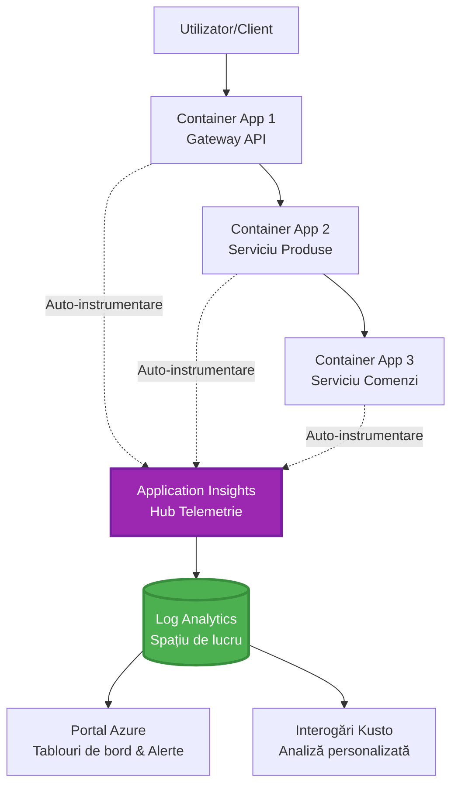
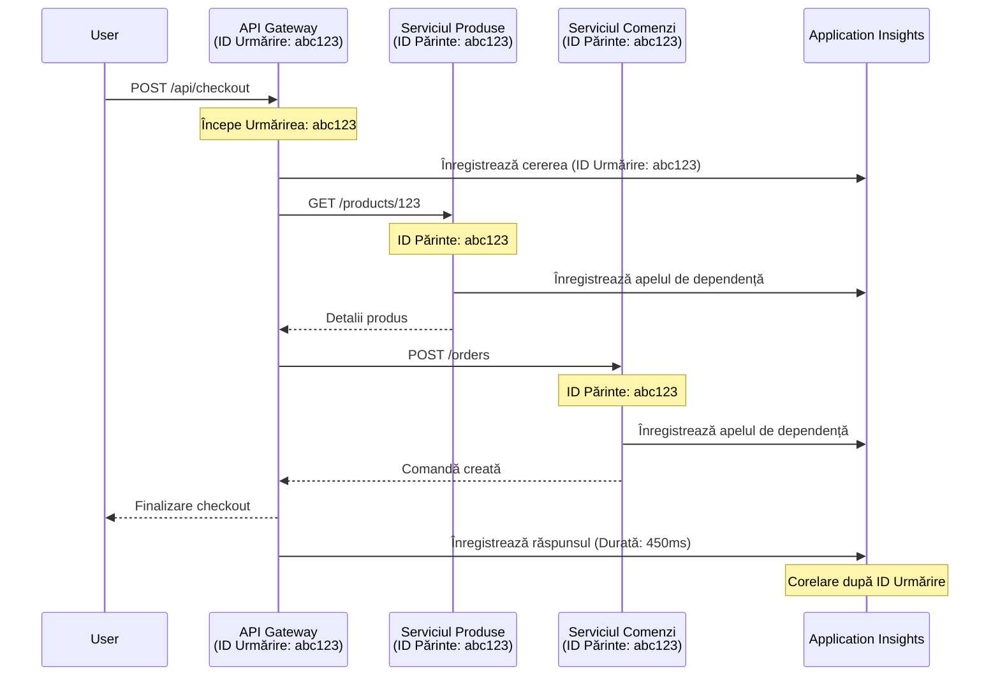

# Integrarea Application Insights cu AZD

⏱️ **Timp Estimat**: 40-50 minute | 💰 **Impact Cost**: ~5-15$/lună | ⭐ **Complexitate**: Intermediar

**📚 Parcurs de Învățare:**
- ← Anterior: [Verificări Preliminare](preflight-checks.md) - Validare înainte de implementare
- 🎯 **Ești Aici**: Integrarea Application Insights (Monitorizare, telemetrie, depanare)
- → Următor: [Ghid de Implementare](../deployment/deployment-guide.md) - Implementare în Azure
- 🏠 [Pagina Principală a Cursului](../../README.md)

---

## Ce Vei Învăța

Finalizând această lecție, vei:
- Integra **Application Insights** automat în proiectele AZD
- Configura **tracing distribuit** pentru microservicii
- Implementa **telemetrie personalizată** (metrice, evenimente, dependențe)
- Configura **metrice live** pentru monitorizare în timp real
- Crea **alerte și dashboard-uri** din implementările AZD
- Depana problemele de producție cu **interogări de telemetrie**
- Optimiza **costurile și strategiile de sampling**
- Monitoriza aplicații **AI/LLM** (token-uri, latență, costuri)

## De ce Contează Application Insights cu AZD

### Provocarea: Observabilitate în Producție

**Fără Application Insights:**
```
❌ No visibility into production behavior
❌ Manual log aggregation across services
❌ Reactive debugging (wait for customer complaints)
❌ No performance metrics
❌ Cannot trace requests across services
❌ Unknown failure rates and bottlenecks
```

**Cu Application Insights + AZD:**
```
✅ Automatic telemetry collection
✅ Centralized logs from all services
✅ Proactive issue detection
✅ End-to-end request tracing
✅ Performance metrics and insights
✅ Real-time dashboards
✅ AZD provisions everything automatically
```

**Analogie**: Application Insights este ca o "cutie neagră" pentru înregistrarea zborurilor + un panou de control pentru aplicația ta. Vezi tot ce se întâmplă în timp real și poți reconstitui orice incident.

---

## Prezentare Generală a Arhitecturii

### Application Insights în Arhitectura AZD


### Ce Este Monitorizat Automat

| Tip Telemetrie | Ce Capturează | Caz de Utilizare |
|----------------|---------------|------------------|
| **Requests** | Cereri HTTP, coduri de stare, durată | Monitorizarea performanței API-ului |
| **Dependencies** | Apeluri externe (DB, API-uri, stocare) | Identificarea blocajelor |
| **Exceptions** | Erori necontrolate cu stack trace-uri | Depanarea eșecurilor |
| **Custom Events** | Evenimente de business (înregistrare, achiziție) | Analitice și funnel-uri |
| **Metrics** | Contoare de performanță, metrice personalizate | Planificarea capacității |
| **Traces** | Mesaje de log cu severitate | Depanare și audit |
| **Availability** | Teste de uptime și timp de răspuns | Monitorizarea SLA-urilor |

---

## Cerințe Prealabile

### Instrumente Necesare

```bash
# Verificați Azure Developer CLI
azd version
# ✅ Așteptat: versiunea azd 1.0.0 sau mai mare

# Verificați Azure CLI
az --version
# ✅ Așteptat: azure-cli 2.50.0 sau mai mare
```

### Cerințe Azure

- Abonament Azure activ
- Permisiuni pentru a crea:
  - Resurse Application Insights
  - Spații de lucru Log Analytics
  - Container Apps
  - Grupuri de resurse

### Cunoștințe Prealabile

Ar trebui să fi completat:
- [Bazele AZD](../getting-started/azd-basics.md) - Concepte de bază AZD
- [Configurare](../getting-started/configuration.md) - Configurarea mediului
- [Primul Proiect](../getting-started/first-project.md) - Implementare de bază

---

## Lecția 1: Application Insights Automat cu AZD

### Cum Provoacă AZD Application Insights

AZD creează și configurează automat Application Insights când implementezi. Să vedem cum funcționează.

### Structura Proiectului

```
monitored-app/
├── azure.yaml                     # AZD configuration
├── infra/
│   ├── main.bicep                # Main infrastructure
│   ├── core/
│   │   └── monitoring.bicep      # Application Insights + Log Analytics
│   └── app/
│       └── api.bicep             # Container App with monitoring
└── src/
    ├── app.py                    # Application with telemetry
    ├── requirements.txt
    └── Dockerfile
```

---

### Pasul 1: Configurare AZD (azure.yaml)

**Fișier: `azure.yaml`**

```yaml
name: monitored-app
metadata:
  template: monitored-app@1.0.0

services:
  api:
    project: ./src
    language: python
    host: containerapp

# AZD automatically provisions monitoring!
```

**Atât!** AZD va crea Application Insights în mod implicit. Nu este nevoie de configurări suplimentare pentru monitorizare de bază.

---

### Pasul 2: Infrastructura de Monitorizare (Bicep)

**Fișier: `infra/core/monitoring.bicep`**

```bicep
param logAnalyticsName string
param applicationInsightsName string
param location string = resourceGroup().location
param tags object = {}

// Log Analytics Workspace (required for Application Insights)
resource logAnalytics 'Microsoft.OperationalInsights/workspaces@2022-10-01' = {
  name: logAnalyticsName
  location: location
  tags: tags
  properties: {
    sku: {
      name: 'PerGB2018'  // Pay-as-you-go pricing
    }
    retentionInDays: 30  // Keep logs for 30 days
    features: {
      enableLogAccessUsingOnlyResourcePermissions: true
    }
  }
}

// Application Insights
resource applicationInsights 'Microsoft.Insights/components@2020-02-02' = {
  name: applicationInsightsName
  location: location
  tags: tags
  kind: 'web'
  properties: {
    Application_Type: 'web'
    WorkspaceResourceId: logAnalytics.id
    IngestionMode: 'LogAnalytics'
    publicNetworkAccessForIngestion: 'Enabled'
    publicNetworkAccessForQuery: 'Enabled'
  }
}

// Outputs for Container Apps
output logAnalyticsWorkspaceId string = logAnalytics.id
output logAnalyticsWorkspaceName string = logAnalytics.name
output applicationInsightsConnectionString string = applicationInsights.properties.ConnectionString
output applicationInsightsInstrumentationKey string = applicationInsights.properties.InstrumentationKey
output applicationInsightsName string = applicationInsights.name
```

---

### Pasul 3: Conectarea Container App la Application Insights

**Fișier: `infra/app/api.bicep`**

```bicep
param name string
param location string
param tags object = {}
param containerAppsEnvironmentName string
param applicationInsightsConnectionString string

resource containerApp 'Microsoft.App/containerApps@2023-05-01' = {
  name: name
  location: location
  tags: tags
  properties: {
    configuration: {
      ingress: {
        external: true
        targetPort: 8000
      }
      secrets: [
        {
          name: 'appinsights-connection-string'
          value: applicationInsightsConnectionString
        }
      ]
    }
    template: {
      containers: [
        {
          name: 'api'
          image: 'myregistry.azurecr.io/api:latest'
          resources: {
            cpu: json('0.5')
            memory: '1Gi'
          }
          env: [
            {
              name: 'APPLICATIONINSIGHTS_CONNECTION_STRING'
              secretRef: 'appinsights-connection-string'
            }
            {
              name: 'APPLICATIONINSIGHTS_ENABLED'
              value: 'true'
            }
          ]
        }
      ]
    }
  }
}

output uri string = 'https://${containerApp.properties.configuration.ingress.fqdn}'
```

---

### Pasul 4: Codul Aplicației cu Telemetrie

**Fișier: `src/app.py`**

```python
from flask import Flask, request, jsonify
from opencensus.ext.azure.log_exporter import AzureLogHandler
from opencensus.ext.azure.trace_exporter import AzureExporter
from opencensus.ext.flask.flask_middleware import FlaskMiddleware
from opencensus.trace.samplers import ProbabilitySampler
import logging
import os

app = Flask(__name__)

# Obține șirul de conexiune Application Insights
connection_string = os.environ.get('APPLICATIONINSIGHTS_CONNECTION_STRING')

if connection_string:
    # Configurează trasarea distribuită
    middleware = FlaskMiddleware(
        app,
        exporter=AzureExporter(connection_string=connection_string),
        sampler=ProbabilitySampler(rate=1.0)  # Eșantionare 100% pentru dezvoltare
    )
    
    # Configurează jurnalizarea
    logger = logging.getLogger(__name__)
    logger.addHandler(AzureLogHandler(connection_string=connection_string))
    logger.setLevel(logging.INFO)
    
    print("✅ Application Insights enabled")
else:
    logger = logging.getLogger(__name__)
    logger.setLevel(logging.INFO)
    print("⚠️ Application Insights not configured")

@app.route('/health')
def health():
    logger.info('Health check endpoint called')
    return jsonify({'status': 'healthy', 'monitoring': 'enabled'})

@app.route('/api/products')
def get_products():
    logger.info('Fetching products')
    
    # Simulează apelul bazei de date (urmărit automat ca dependență)
    products = [
        {'id': 1, 'name': 'Laptop', 'price': 999.99},
        {'id': 2, 'name': 'Mouse', 'price': 29.99},
        {'id': 3, 'name': 'Keyboard', 'price': 79.99}
    ]
    
    logger.info(f'Returned {len(products)} products')
    return jsonify(products)

@app.route('/api/error-test')
def error_test():
    """Test error tracking"""
    logger.error('Testing error tracking')
    try:
        raise ValueError('This is a test exception')
    except Exception as e:
        logger.exception('Exception occurred in error-test endpoint')
        return jsonify({'error': str(e)}), 500

@app.route('/api/slow')
def slow_endpoint():
    """Test performance tracking"""
    import time
    logger.info('Slow endpoint called')
    time.sleep(3)  # Simulează operațiunea lentă
    logger.warning('Endpoint took 3 seconds to respond')
    return jsonify({'message': 'Slow operation completed'})

if __name__ == '__main__':
    app.run(host='0.0.0.0', port=8000)
```

**Fișier: `src/requirements.txt`**

```txt
Flask==3.0.0
opencensus-ext-azure==1.1.13
opencensus-ext-flask==0.8.1
gunicorn==21.2.0
```

---

### Pasul 5: Implementare și Verificare

```bash
# Inițializează AZD
azd init

# Implementare (provisionează automat Application Insights)
azd up

# Obține URL-ul aplicației
APP_URL=$(azd env get-values | grep API_URL | cut -d '=' -f2 | tr -d '"')

# Generează telemetrie
curl $APP_URL/health
curl $APP_URL/api/products
curl $APP_URL/api/error-test
curl $APP_URL/api/slow
```

**✅ Rezultat așteptat:**
```json
{
  "status": "healthy",
  "monitoring": "enabled"
}
```

---

### Pasul 6: Vizualizarea Telemetriei în Portalul Azure

```bash
# Obține detalii despre Application Insights
azd env get-values | grep APPLICATIONINSIGHTS

# Deschide în Azure Portal
az monitor app-insights component show \
  --app $(azd env get-values | grep APPLICATIONINSIGHTS_NAME | cut -d '=' -f2 | tr -d '"') \
  --resource-group $(azd env get-values | grep AZURE_RESOURCE_GROUP | cut -d '=' -f2 | tr -d '"') \
  --query "appId" -o tsv
```

**Navighează la Portalul Azure → Application Insights → Transaction Search**

Ar trebui să vezi:
- ✅ Cereri HTTP cu coduri de stare
- ✅ Durata cererilor (3+ secunde pentru `/api/slow`)
- ✅ Detalii despre excepții de la `/api/error-test`
- ✅ Mesaje de log personalizate

---

## Lecția 2: Telemetrie și Evenimente Personalizate

### Urmărirea Evenimentelor de Business

Să adăugăm telemetrie personalizată pentru evenimente critice de business.

**Fișier: `src/telemetry.py`**

```python
from opencensus.ext.azure import metrics_exporter
from opencensus.stats import aggregation as aggregation_module
from opencensus.stats import measure as measure_module
from opencensus.stats import stats as stats_module
from opencensus.stats import view as view_module
from opencensus.tags import tag_map as tag_map_module
from opencensus.ext.azure.log_exporter import AzureLogHandler
from opencensus.ext.azure.trace_exporter import AzureExporter
from opencensus.trace import tracer as tracer_module
import logging
import os

class TelemetryClient:
    """Custom telemetry client for Application Insights"""
    
    def __init__(self, connection_string=None):
        self.connection_string = connection_string or os.environ.get('APPLICATIONINSIGHTS_CONNECTION_STRING')
        
        if not self.connection_string:
            print("⚠️ Application Insights connection string not found")
            return
        
        # Configurare logger
        self.logger = logging.getLogger(__name__)
        self.logger.addHandler(AzureLogHandler(connection_string=self.connection_string))
        self.logger.setLevel(logging.INFO)
        
        # Configurare exportator de metrici
        self.stats = stats_module.stats
        self.view_manager = self.stats.view_manager
        self.stats_recorder = self.stats.stats_recorder
        
        exporter = metrics_exporter.new_metrics_exporter(
            connection_string=self.connection_string
        )
        self.view_manager.register_exporter(exporter)
        
        # Configurare tracer
        self.tracer = tracer_module.Tracer(
            exporter=AzureExporter(connection_string=self.connection_string)
        )
        
        print("✅ Custom telemetry client initialized")
    
    def track_event(self, event_name: str, properties: dict = None):
        """Track custom business event"""
        properties = properties or {}
        self.logger.info(
            f"CustomEvent: {event_name}",
            extra={
                'custom_dimensions': {
                    'event_name': event_name,
                    **properties
                }
            }
        )
    
    def track_metric(self, metric_name: str, value: float, properties: dict = None):
        """Track custom metric"""
        properties = properties or {}
        self.logger.info(
            f"CustomMetric: {metric_name} = {value}",
            extra={
                'custom_dimensions': {
                    'metric_name': metric_name,
                    'value': value,
                    **properties
                }
            }
        )
    
    def track_dependency(self, name: str, dependency_type: str, duration: float, success: bool):
        """Track external dependency call"""
        with self.tracer.span(name=name) as span:
            span.add_attribute('dependency.type', dependency_type)
            span.add_attribute('duration', duration)
            span.add_attribute('success', success)

# Client global de telemetrie
telemetry = TelemetryClient()
```

### Actualizarea Aplicației cu Evenimente Personalizate

**Fișier: `src/app.py` (îmbunătățit)**

```python
from flask import Flask, request, jsonify
from telemetry import telemetry
import time
import random

app = Flask(__name__)

@app.route('/api/purchase', methods=['POST'])
def purchase():
    """Track purchase event with custom telemetry"""
    data = request.json
    product_id = data.get('product_id')
    quantity = data.get('quantity', 1)
    price = data.get('price', 0)
    
    # Urmărește evenimentul de afaceri
    telemetry.track_event('Purchase', {
        'product_id': product_id,
        'quantity': quantity,
        'total_amount': price * quantity,
        'user_id': request.headers.get('X-User-Id', 'anonymous')
    })
    
    # Urmărește metrica de venituri
    telemetry.track_metric('Revenue', price * quantity, {
        'product_id': product_id,
        'currency': 'USD'
    })
    
    return jsonify({
        'order_id': f'ORD-{random.randint(1000, 9999)}',
        'status': 'confirmed',
        'total': price * quantity
    })

@app.route('/api/search')
def search():
    """Track search queries"""
    query = request.args.get('q', '')
    
    start_time = time.time()
    
    # Simulează căutarea (ar fi o interogare reală a bazei de date)
    results = [{'id': 1, 'name': f'Result for {query}'}]
    
    duration = (time.time() - start_time) * 1000  # Convertește în ms
    
    # Urmărește evenimentul de căutare
    telemetry.track_event('Search', {
        'query': query,
        'results_count': len(results),
        'duration_ms': duration
    })
    
    # Urmărește metrica de performanță a căutării
    telemetry.track_metric('SearchDuration', duration, {
        'query_length': len(query)
    })
    
    return jsonify({'results': results, 'count': len(results)})

@app.route('/api/external-call')
def external_call():
    """Track external API dependency"""
    import requests
    
    start_time = time.time()
    success = True
    
    try:
        # Simulează apelul API extern
        response = requests.get('https://api.example.com/data', timeout=5)
        result = response.json()
    except Exception as e:
        success = False
        result = {'error': str(e)}
    
    duration = (time.time() - start_time) * 1000
    
    # Urmărește dependența
    telemetry.track_dependency(
        name='ExternalAPI',
        dependency_type='HTTP',
        duration=duration,
        success=success
    )
    
    return jsonify(result)

if __name__ == '__main__':
    app.run(host='0.0.0.0', port=8000)
```

### Testarea Telemetriei Personalizate

```bash
# Urmărește evenimentul de achiziție
curl -X POST $APP_URL/api/purchase \
  -H "Content-Type: application/json" \
  -H "X-User-Id: user123" \
  -d '{"product_id": 1, "quantity": 2, "price": 29.99}'

# Urmărește evenimentul de căutare
curl "$APP_URL/api/search?q=laptop"

# Urmărește dependența externă
curl $APP_URL/api/external-call
```

**Vizualizare în Portalul Azure:**

Navighează la Application Insights → Logs, apoi rulează:

```kusto
// View purchase events
traces
| where customDimensions.event_name == "Purchase"
| project 
    timestamp,
    product_id = tostring(customDimensions.product_id),
    total_amount = todouble(customDimensions.total_amount),
    user_id = tostring(customDimensions.user_id)
| order by timestamp desc

// View revenue metrics
traces
| where customDimensions.metric_name == "Revenue"
| summarize TotalRevenue = sum(todouble(customDimensions.value)) by bin(timestamp, 1h)
| render timechart

// View search performance
traces
| where customDimensions.event_name == "Search"
| summarize 
    AvgDuration = avg(todouble(customDimensions.duration_ms)),
    SearchCount = count()
  by bin(timestamp, 5m)
| render timechart
```

---

## Lecția 3: Tracing Distribuit pentru Microservicii

### Activarea Tracing-ului între Servicii

Pentru microservicii, Application Insights corelează automat cererile între servicii.

**Fișier: `infra/main.bicep`**

```bicep
targetScope = 'subscription'

param environmentName string
param location string = 'eastus'

var tags = { 'azd-env-name': environmentName }

resource rg 'Microsoft.Resources/resourceGroups@2021-04-01' = {
  name: 'rg-${environmentName}'
  location: location
  tags: tags
}

// Monitoring (shared by all services)
module monitoring './core/monitoring.bicep' = {
  name: 'monitoring'
  scope: rg
  params: {
    logAnalyticsName: 'log-${environmentName}'
    applicationInsightsName: 'appi-${environmentName}'
    location: location
    tags: tags
  }
}

// API Gateway
module apiGateway './app/api-gateway.bicep' = {
  name: 'api-gateway'
  scope: rg
  params: {
    name: 'ca-gateway-${environmentName}'
    location: location
    tags: union(tags, { 'azd-service-name': 'gateway' })
    applicationInsightsConnectionString: monitoring.outputs.applicationInsightsConnectionString
  }
}

// Product Service
module productService './app/product-service.bicep' = {
  name: 'product-service'
  scope: rg
  params: {
    name: 'ca-products-${environmentName}'
    location: location
    tags: union(tags, { 'azd-service-name': 'products' })
    applicationInsightsConnectionString: monitoring.outputs.applicationInsightsConnectionString
  }
}

// Order Service
module orderService './app/order-service.bicep' = {
  name: 'order-service'
  scope: rg
  params: {
    name: 'ca-orders-${environmentName}'
    location: location
    tags: union(tags, { 'azd-service-name': 'orders' })
    applicationInsightsConnectionString: monitoring.outputs.applicationInsightsConnectionString
  }
}

output APPLICATIONINSIGHTS_CONNECTION_STRING string = monitoring.outputs.applicationInsightsConnectionString
output GATEWAY_URL string = apiGateway.outputs.uri
```

### Vizualizarea Tranzacțiilor End-to-End


**Interogare trace end-to-end:**

```kusto
// Find complete request flow
let traceId = "abc123...";  // Get from response header
dependencies
| union requests
| where operation_Id == traceId
| project 
    timestamp,
    type = itemType,
    name,
    duration,
    success,
    cloud_RoleName
| order by timestamp asc
```

---

## Lecția 4: Metrice Live și Monitorizare în Timp Real

### Activarea Fluxului de Metrice Live

Metricele Live oferă telemetrie în timp real cu o latență de <1 secundă.

**Accesare Metrice Live:**

```bash
# Obțineți resursa Application Insights
APPI_NAME=$(azd env get-values | grep APPLICATIONINSIGHTS_NAME | cut -d '=' -f2 | tr -d '"')

# Obțineți grupul de resurse
RG_NAME=$(azd env get-values | grep AZURE_RESOURCE_GROUP | cut -d '=' -f2 | tr -d '"')

echo "Navigate to: Azure Portal → Resource Groups → $RG_NAME → $APPI_NAME → Live Metrics"
```

**Ce vezi în timp real:**
- ✅ Rata cererilor primite (cereri/sec)
- ✅ Apeluri de dependență externe
- ✅ Număr de excepții
- ✅ Utilizarea CPU și memoriei
- ✅ Număr de servere active
- ✅ Telemetrie eșantionată

### Generarea de Trafic pentru Testare

```bash
# Generează sarcină pentru a vedea metricile live
for i in {1..100}; do
  curl $APP_URL/api/products &
  curl $APP_URL/api/search?q=test$i &
done

# Urmărește metricile live în Azure Portal
# Ar trebui să vezi o creștere a ratei cererilor
```

---

## Exerciții Practice

### Exercițiul 1: Configurarea Alertelor ⭐⭐ (Mediu)

**Obiectiv**: Creează alerte pentru rate mari de erori și răspunsuri lente.

**Pași:**

1. **Creează alertă pentru rata de erori:**

```bash
# Obține ID-ul resursei Application Insights
APPI_ID=$(az monitor app-insights component show \
  --app $APPI_NAME \
  --resource-group $RG_NAME \
  --query "id" -o tsv)

# Creează alertă de metrică pentru cereri eșuate
az monitor metrics alert create \
  --name "High-Error-Rate" \
  --resource-group $RG_NAME \
  --scopes $APPI_ID \
  --condition "count requests/failed > 10" \
  --window-size 5m \
  --evaluation-frequency 1m \
  --description "Alert when error rate exceeds 10 per 5 minutes"
```

2. **Creează alertă pentru răspunsuri lente:**

```bash
az monitor metrics alert create \
  --name "Slow-Responses" \
  --resource-group $RG_NAME \
  --scopes $APPI_ID \
  --condition "avg requests/duration > 3000" \
  --window-size 5m \
  --evaluation-frequency 1m \
  --description "Alert when average response time exceeds 3 seconds"
```

3. **Creează alertă prin Bicep (preferat pentru AZD):**

**Fișier: `infra/core/alerts.bicep`**

```bicep
param applicationInsightsId string
param actionGroupId string = ''
param location string = resourceGroup().location

// High error rate alert
resource errorRateAlert 'Microsoft.Insights/metricAlerts@2018-03-01' = {
  name: 'high-error-rate'
  location: 'global'
  properties: {
    description: 'Alert when error rate exceeds threshold'
    severity: 2
    enabled: true
    scopes: [
      applicationInsightsId
    ]
    evaluationFrequency: 'PT1M'
    windowSize: 'PT5M'
    criteria: {
      'odata.type': 'Microsoft.Azure.Monitor.SingleResourceMultipleMetricCriteria'
      allOf: [
        {
          name: 'Error rate'
          metricName: 'requests/failed'
          operator: 'GreaterThan'
          threshold: 10
          timeAggregation: 'Count'
        }
      ]
    }
    actions: actionGroupId != '' ? [
      {
        actionGroupId: actionGroupId
      }
    ] : []
  }
}

// Slow response alert
resource slowResponseAlert 'Microsoft.Insights/metricAlerts@2018-03-01' = {
  name: 'slow-responses'
  location: 'global'
  properties: {
    description: 'Alert when response time is too high'
    severity: 3
    enabled: true
    scopes: [
      applicationInsightsId
    ]
    evaluationFrequency: 'PT1M'
    windowSize: 'PT5M'
    criteria: {
      'odata.type': 'Microsoft.Azure.Monitor.SingleResourceMultipleMetricCriteria'
      allOf: [
        {
          name: 'Response duration'
          metricName: 'requests/duration'
          operator: 'GreaterThan'
          threshold: 3000
          timeAggregation: 'Average'
        }
      ]
    }
  }
}

output errorAlertId string = errorRateAlert.id
output slowResponseAlertId string = slowResponseAlert.id
```

4. **Testează alertele:**

```bash
# Generează erori
for i in {1..20}; do
  curl $APP_URL/api/error-test
done

# Generează răspunsuri lente
for i in {1..10}; do
  curl $APP_URL/api/slow
done

# Verifică starea alertei (așteaptă 5-10 minute)
az monitor metrics alert list \
  --resource-group $RG_NAME \
  --query "[].{Name:name, Enabled:enabled, State:properties.enabled}" \
  --output table
```

**✅ Criterii de Succes:**
- ✅ Alertele create cu succes
- ✅ Alertele se declanșează când pragurile sunt depășite
- ✅ Poți vizualiza istoricul alertelor în Portalul Azure
- ✅ Integrat cu implementarea AZD

**Timp**: 20-25 minute

---

### Exercițiul 2: Crearea unui Dashboard Personalizat ⭐⭐ (Mediu)

**Obiectiv**: Construiește un dashboard care afișează metricele cheie ale aplicației.

**Pași:**

1. **Creează dashboard prin Portalul Azure:**

Navighează la: Portalul Azure → Dashboards → New Dashboard

2. **Adaugă tile-uri pentru metricele cheie:**

- Număr de cereri (ultimele 24 de ore)
- Timp mediu de răspuns
- Rata de erori
- Top 5 cele mai lente operațiuni
- Distribuția geografică a utilizatorilor

3. **Creează dashboard prin Bicep:**

**Fișier: `infra/core/dashboard.bicep`**

```bicep
param dashboardName string
param applicationInsightsId string
param location string = resourceGroup().location

resource dashboard 'Microsoft.Portal/dashboards@2020-09-01-preview' = {
  name: dashboardName
  location: location
  properties: {
    lenses: [
      {
        order: 0
        parts: [
          // Request count
          {
            position: { x: 0, y: 0, rowSpan: 4, colSpan: 6 }
            metadata: {
              type: 'Extension/Microsoft_OperationsManagementSuite_Workspace/PartType/LogsDashboardPart'
              inputs: [
                {
                  name: 'resourceId'
                  value: applicationInsightsId
                }
                {
                  name: 'query'
                  value: '''
                    requests
                    | summarize RequestCount = count() by bin(timestamp, 1h)
                    | render timechart
                  '''
                }
              ]
            }
          }
          // Error rate
          {
            position: { x: 6, y: 0, rowSpan: 4, colSpan: 6 }
            metadata: {
              type: 'Extension/Microsoft_OperationsManagementSuite_Workspace/PartType/LogsDashboardPart'
              inputs: [
                {
                  name: 'resourceId'
                  value: applicationInsightsId
                }
                {
                  name: 'query'
                  value: '''
                    requests
                    | summarize 
                        Total = count(),
                        Failed = countif(success == false)
                    | extend ErrorRate = (Failed * 100.0) / Total
                    | project ErrorRate
                  '''
                }
              ]
            }
          }
        ]
      }
    ]
  }
}

output dashboardId string = dashboard.id
```

4. **Implementează dashboard-ul:**

```bash
# Adăugați în main.bicep
module dashboard './core/dashboard.bicep' = {
  name: 'dashboard'
  scope: rg
  params: {
    dashboardName: 'dashboard-${environmentName}'
    applicationInsightsId: monitoring.outputs.applicationInsightsId
    location: location
  }
}

# Implementați
azd up
```

**✅ Criterii de Succes:**
- ✅ Dashboard-ul afișează metricele cheie
- ✅ Poate fi fixat pe pagina principală a Portalului Azure
- ✅ Se actualizează în timp real
- ✅ Implementabil prin AZD

**Timp**: 25-30 minute

---

### Exercițiul 3: Monitorizarea Aplicațiilor AI/LLM ⭐⭐⭐ (Avansat)

**Obiectiv**: Urmărește utilizarea Azure OpenAI (token-uri, costuri, latență).

**Pași:**

1. **Creează un wrapper pentru monitorizarea AI:**

**Fișier: `src/ai_telemetry.py`**

```python
from telemetry import telemetry
from openai import AzureOpenAI
import time

class MonitoredAzureOpenAI:
    """Azure OpenAI client with automatic telemetry"""
    
    def __init__(self, api_key, endpoint, api_version="2024-02-01"):
        self.client = AzureOpenAI(
            api_key=api_key,
            api_version=api_version,
            azure_endpoint=endpoint
        )
    
    def chat_completion(self, model: str, messages: list, **kwargs):
        """Track chat completion with telemetry"""
        start_time = time.time()
        
        try:
            # Apelați Azure OpenAI
            response = self.client.chat.completions.create(
                model=model,
                messages=messages,
                **kwargs
            )
            
            duration = (time.time() - start_time) * 1000  # ms
            
            # Extrageți utilizarea
            usage = response.usage
            prompt_tokens = usage.prompt_tokens
            completion_tokens = usage.completion_tokens
            total_tokens = usage.total_tokens
            
            # Calculați costul (preț GPT-4)
            prompt_cost = (prompt_tokens / 1000) * 0.03  # $0.03 per 1K tokeni
            completion_cost = (completion_tokens / 1000) * 0.06  # $0.06 per 1K tokeni
            total_cost = prompt_cost + completion_cost
            
            # Urmăriți eveniment personalizat
            telemetry.track_event('OpenAI_Request', {
                'model': model,
                'prompt_tokens': prompt_tokens,
                'completion_tokens': completion_tokens,
                'total_tokens': total_tokens,
                'duration_ms': duration,
                'cost_usd': total_cost,
                'success': True
            })
            
            # Urmăriți metrici
            telemetry.track_metric('OpenAI_Tokens', total_tokens, {
                'model': model,
                'type': 'total'
            })
            
            telemetry.track_metric('OpenAI_Cost', total_cost, {
                'model': model,
                'currency': 'USD'
            })
            
            telemetry.track_metric('OpenAI_Duration', duration, {
                'model': model
            })
            
            return response
            
        except Exception as e:
            duration = (time.time() - start_time) * 1000
            
            telemetry.track_event('OpenAI_Request', {
                'model': model,
                'duration_ms': duration,
                'success': False,
                'error': str(e)
            })
            
            raise
```

2. **Folosește clientul monitorizat:**

```python
from flask import Flask, request, jsonify
from ai_telemetry import MonitoredAzureOpenAI
import os

app = Flask(__name__)

# Inițializează clientul OpenAI monitorizat
openai_client = MonitoredAzureOpenAI(
    api_key=os.environ['AZURE_OPENAI_API_KEY'],
    endpoint=os.environ['AZURE_OPENAI_ENDPOINT']
)

@app.route('/api/chat', methods=['POST'])
def chat():
    data = request.json
    user_message = data.get('message')
    
    # Apel cu monitorizare automată
    response = openai_client.chat_completion(
        model='gpt-4',
        messages=[
            {'role': 'user', 'content': user_message}
        ]
    )
    
    return jsonify({
        'response': response.choices[0].message.content,
        'tokens': response.usage.total_tokens
    })
```

3. **Interoghează metricele AI:**

```kusto
// Total AI spend over time
traces
| where customDimensions.event_name == "OpenAI_Request"
| where customDimensions.success == "True"
| summarize TotalCost = sum(todouble(customDimensions.cost_usd)) by bin(timestamp, 1h)
| render timechart

// Token usage by model
traces
| where customDimensions.event_name == "OpenAI_Request"
| summarize 
    TotalTokens = sum(toint(customDimensions.total_tokens)),
    RequestCount = count()
  by Model = tostring(customDimensions.model)

// Average latency
traces
| where customDimensions.event_name == "OpenAI_Request"
| summarize AvgDuration = avg(todouble(customDimensions.duration_ms))
| project AvgDurationSeconds = AvgDuration / 1000

// Cost per request
traces
| where customDimensions.event_name == "OpenAI_Request"
| extend Cost = todouble(customDimensions.cost_usd)
| summarize 
    TotalCost = sum(Cost),
    RequestCount = count(),
    AvgCostPerRequest = avg(Cost)
```

**✅ Criterii de Succes:**
- ✅ Fiecare apel OpenAI este urmărit automat
- ✅ Utilizarea token-urilor și costurile sunt vizibile
- ✅ Latența este monitorizată
- ✅ Poți seta alerte de buget

**Timp**: 35-45 minute

---

## Optimizarea Costurilor

### Strategii de Sampling

Controlează costurile prin eșantionarea telemetriei:

```python
from opencensus.trace.samplers import ProbabilitySampler

# Dezvoltare: eșantionare 100%
sampler = ProbabilitySampler(rate=1.0)

# Producție: eșantionare 10% (reduce costurile cu 90%)
sampler = ProbabilitySampler(rate=0.1)

# Eșantionare adaptivă (se ajustează automat)
from opencensus.trace.samplers import AdaptiveSampler
sampler = AdaptiveSampler()
```

**În Bicep:**

```bicep
resource applicationInsights 'Microsoft.Insights/components@2020-02-02' = {
  name: applicationInsightsName
  properties: {
    SamplingPercentage: 10  // 10% sampling
  }
}
```

### Retenția Datelor

```bicep
resource logAnalytics 'Microsoft.OperationalInsights/workspaces@2022-10-01' = {
  name: logAnalyticsName
  properties: {
    retentionInDays: 30  // Minimum (cheapest)
    // Options: 30, 31, 60, 90, 120, 180, 270, 365, 550, 730
  }
}
```

### Estimări de Cost Lunar

| Volum de Date | Retenție | Cost Lunar |
|---------------|----------|------------|
| 1 GB/lună | 30 zile | ~2-5$ |
| 5 GB/lună | 30 zile | ~10-15$ |
| 10 GB/lună | 90 zile | ~25-40$ |
| 50 GB/lună | 90 zile | ~100-150$ |

**Nivel gratuit**: 5 GB/lună incluse

---

## Verificare a Cunoștințelor

### 1. Integrare de Bază ✓

Testează-ți înțelegerea:

- [ ] **Î1**: Cum configurează AZD Application Insights?
  - **R**: Automat prin template-uri Bicep în `infra/core/monitoring.bicep`

- [ ] **Î2**: Ce variabilă de mediu activează Application Insights?
  - **R**: `APPLICATIONINSIGHTS_CONNECTION_STRING`

- [ ] **Î3**: Care sunt cele trei tipuri principale de telemetrie?
  - **R**: Requests (apeluri HTTP), Dependencies (apeluri externe), Exceptions (erori)

**Verificare Practică:**
```bash
# Verificați dacă Application Insights este configurat
azd env get-values | grep APPLICATIONINSIGHTS

# Verificați dacă telemetria funcționează
az monitor app-insights metrics show \
  --app $APPI_NAME \
  --resource-group $RG_NAME \
  --metric "requests/count"
```

---

### 2. Telemetrie Personalizată ✓

Testează-ți înțelegerea:

- [ ] **Î1**: Cum urmărești evenimentele de business personalizate?
  - **R**: Folosește logger-ul cu `custom_dimensions` sau `TelemetryClient.track_event()`

- [ ] **Î2**: Care este diferența dintre evenimente și metrice?
  - **R**: Evenimentele sunt apariții discrete, metricele sunt măsurători numerice

- [ ] **Î3**: Cum corelezi telemetria între servicii?
  - **R**: Application Insights folosește automat `operation_Id` pentru corelare

**Verificare Practică:**
```kusto
// Verify custom events
traces
| where customDimensions.event_name != ""
| summarize count() by tostring(customDimensions.event_name)
```

---

### 3. Monitorizare în Producție ✓

Testează-ți înțelegerea:

- [ ] **Î1**: Ce este sampling-ul și de ce este utilizat?
  - **R**: Sampling-ul reduce volumul de date (și costurile) capturând doar un procentaj din telemetrie

- [ ] **Î2**: Cum configurezi alertele?
  - **R**: Folosește alerte de metrice în Bicep sau Portalul Azure bazate pe metricele Application Insights

- [ ] **Î3**: Care este diferența dintre Log Analytics și Application Insights?
  - **R**: Application Insights stochează datele în Log Analytics workspace; App Insights oferă vizualizări specifice aplicației

**Verificare Practică:**
```bash
# Verificați configurația de eșantionare
az monitor app-insights component show \
  --app $APPI_NAME \
  --resource-group $RG_NAME \
  --query "properties.SamplingPercentage"
```

---

## Cele Mai Bune Practici

### ✅ FĂ:

1. **Folosește ID-uri de corelare**
   ```python
   logger.info('Processing order', extra={
       'custom_dimensions': {
           'order_id': order_id,
           'user_id': user_id
       }
   })
   ```

2. **Configurează alerte pentru metrice critice**
   ```bicep
   // Error rate, slow responses, availability
   ```

3. **Folosește logare structurată**
   ```python
   # ✅ BUN: Structurat
   logger.info('User signup', extra={'custom_dimensions': {'user_id': 123}})
   
   # ❌ RĂU: Nestructurat
   logger.info(f'User 123 signed up')
   ```

4. **Monitorizează dependențele**
   ```python
   # Urmărește automat apelurile la baza de date, cererile HTTP, etc.
   ```

5. **Folosește Metrice Live în timpul implementărilor**

### ❌ NU FĂ:

1. **Nu loga date sensibile**
   ```python
   # ❌ RĂU
   logger.info(f'Login: {username}:{password}')
   
   # ✅ BUN
   logger.info('Login attempt', extra={'custom_dimensions': {'username': username}})
   ```

2. **Nu folosi sampling 100% în producție**
   ```python
   # ❌ Scump
   sampler = ProbabilitySampler(rate=1.0)
   
   # ✅ Rentabil
   sampler = ProbabilitySampler(rate=0.1)
   ```

3. **Nu ignora cozi de mesaje neprocesate**

4. **Nu uita să setezi limitele de retenție a datelor**

---

## Depanare

### Problemă: Nu apare telemetria

**Diagnostic:**
```bash
# Verificați dacă șirul de conexiune este setat
azd env get-values | grep APPLICATIONINSIGHTS

# Verificați jurnalele aplicației
azd logs api --tail 50
```

**Soluție:**
```bash
# Verificați șirul de conexiune în Container App
az containerapp show \
  --name $APP_NAME \
  --resource-group $RG_NAME \
  --query "properties.template.containers[0].env" \
  | grep -i applicationinsights
```

---

### Problemă: Costuri ridicate

**Diagnostic:**
```bash
# Verificați ingestia datelor
az monitor app-insights metrics show \
  --app $APPI_NAME \
  --resource-group $RG_NAME \
  --metric "availabilityResults/count"
```

**Soluție:**
- Reduce rata de sampling
- Scade perioada de retenție
- Elimină logarea detaliată

---

## Află Mai Multe

### Documentație Oficială
- [Prezentare Generală Application Insights](https://learn.microsoft.com/azure/azure-monitor/app/app-insights-overview)
- [Application Insights pentru Python](https://learn.microsoft.com/azure/azure-monitor/app/opencensus-python)
- [Kusto Query Language](https://learn.microsoft.com/azure/data-explorer/kusto/query/)
- [Monitorizare AZD](https://learn.microsoft.com/azure/developer/azure-developer-cli/monitor-your-app)

### Următorii Pași în Acest Curs
- ← Anterior: [Verificări Preliminare](preflight-checks.md)
- → Următor: [Ghid de Implementare](../deployment/deployment-guide.md)
- 🏠 [Pagina Principală a Cursului](../../README.md)

### Exemple Asemănătoare
- [Exemplu Azure OpenAI](../../../../examples/azure-openai-chat) - Telemetrie AI
- [Exemplu Microservicii](../../../../examples/microservices) - Tracing distribuit

---

## Rezumat

**Ai învățat:**
- ✅ Provizionarea automată a Application Insights cu AZD
- ✅ Telemetrie personalizată (evenimente, metrice, dependențe)
- ✅ Tracing distribuit între microservicii
- ✅ Metrice live și monitorizare în timp real
- ✅ Alerte și dashboard-uri
- ✅ Monitorizarea aplicațiilor AI/LLM
- ✅ Strategii de optimizare a costurilor

**Aspecte cheie:**
1. **AZD configurează monitorizarea automat** - Fără configurare manuală
2. **Folosiți logare structurată** - Facilitează interogările
3. **Urmăriți evenimentele de afaceri** - Nu doar metrici tehnice
4. **Monitorizați costurile AI** - Urmăriți tokenii și cheltuielile
5. **Configurați alerte** - Fiți proactivi, nu reactivi
6. **Optimizați costurile** - Folosiți sampling și limite de retenție

**Pași următori:**
1. Finalizați exercițiile practice
2. Adăugați Application Insights la proiectele AZD
3. Creați dashboard-uri personalizate pentru echipa voastră
4. Aflați mai multe din [Ghidul de implementare](../deployment/deployment-guide.md)

---

<!-- CO-OP TRANSLATOR DISCLAIMER START -->
**Declinare de responsabilitate**:  
Acest document a fost tradus folosind serviciul de traducere AI [Co-op Translator](https://github.com/Azure/co-op-translator). Deși ne străduim să asigurăm acuratețea, vă rugăm să fiți conștienți că traducerile automate pot conține erori sau inexactități. Documentul original în limba sa maternă ar trebui considerat sursa autoritară. Pentru informații critice, se recomandă traducerea profesională realizată de oameni. Nu ne asumăm responsabilitatea pentru eventualele neînțelegeri sau interpretări greșite care pot apărea din utilizarea acestei traduceri.
<!-- CO-OP TRANSLATOR DISCLAIMER END -->