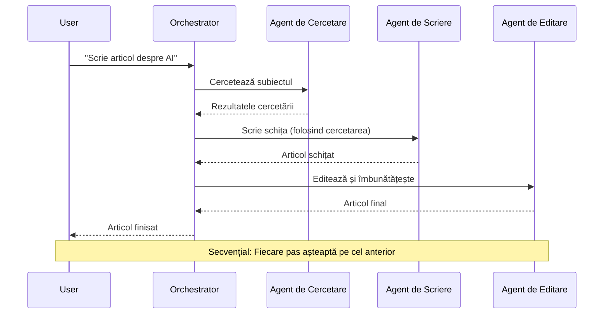
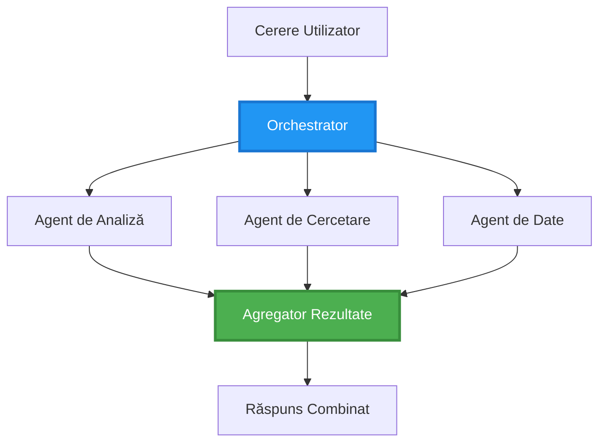
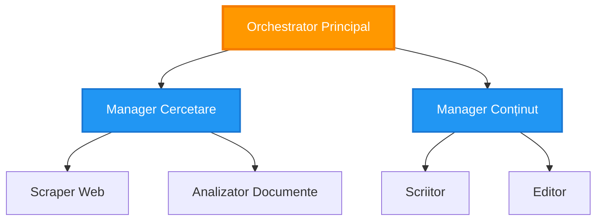
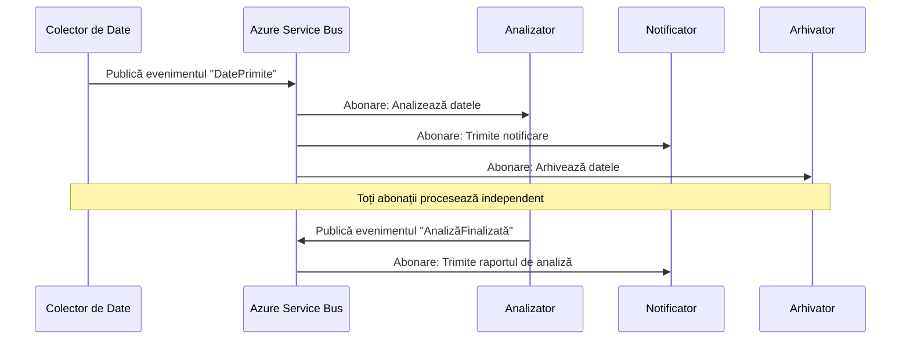
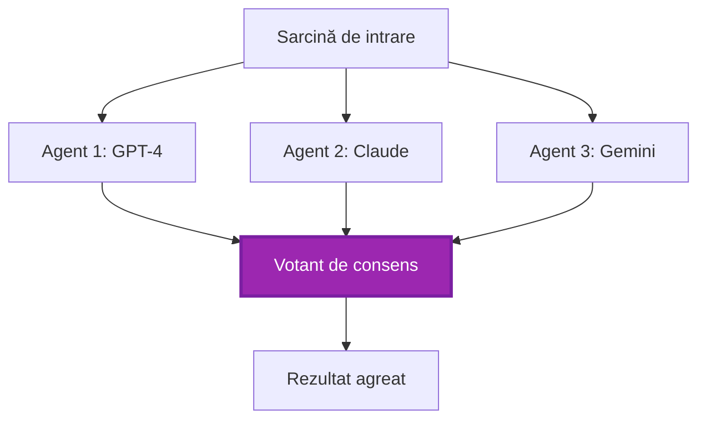
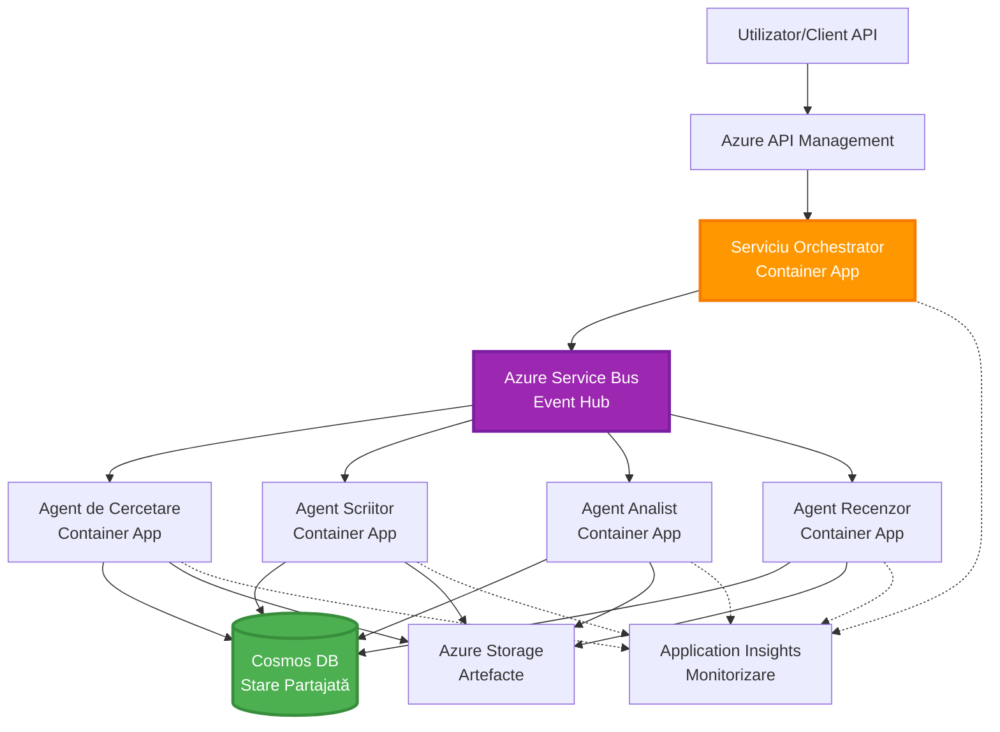

# Modele de Coordonare Multi-Agent

⏱️ **Timp Estimat**: 60-75 minute | 💰 **Cost Estimat**: ~$100-300/lună | ⭐ **Complexitate**: Avansată

**📚 Parcurs de Învățare:**
- ← Anterior: [Planificarea Capacității](capacity-planning.md) - Strategii de dimensionare și scalare a resurselor
- 🎯 **Ești Aici**: Modele de Coordonare Multi-Agent (Orchestrare, comunicare, gestionarea stării)
- → Următor: [Selecția SKU](sku-selection.md) - Alegerea serviciilor Azure potrivite
- 🏠 [Pagina Cursului](../../README.md)

---

## Ce Vei Învăța

După finalizarea acestei lecții, vei:
- Înțelege **modelele de arhitectură multi-agent** și când să le folosești
- Implementa **modele de orchestrare** (centralizată, descentralizată, ierarhică)
- Proiecta strategii de **comunicare între agenți** (sincronă, asincronă, bazată pe evenimente)
- Gestiona **starea partajată** între agenți distribuiți
- Implementa **sisteme multi-agent** pe Azure cu AZD
- Aplica **modele de coordonare** pentru scenarii AI din lumea reală
- Monitoriza și depana sisteme distribuite de agenți

## De Ce Este Importantă Coordonarea Multi-Agent

### Evoluția: De la Agent Unic la Sistem Multi-Agent

**Agent Unic (Simplu):**
```
User → Agent → Response
```
- ✅ Ușor de înțeles și implementat
- ✅ Rapid pentru sarcini simple
- ❌ Limitat de capacitățile unui singur model
- ❌ Nu poate paraleliza sarcini complexe
- ❌ Fără specializare

**Sistem Multi-Agent (Avansat):**
```
           ┌─────────────┐
           │ Orchestrator│
           └──────┬──────┘
        ┌─────────┼─────────┐
        │         │         │
    ┌───▼──┐  ┌──▼───┐  ┌──▼────┐
    │Agent1│  │Agent2│  │Agent3 │
    │(Plan)│  │(Code)│  │(Review)│
    └──────┘  └──────┘  └───────┘
```
- ✅ Agenți specializați pentru sarcini specifice
- ✅ Execuție paralelă pentru viteză
- ✅ Modular și ușor de întreținut
- ✅ Mai bun pentru fluxuri de lucru complexe
- ⚠️ Necesită logică de coordonare

**Analogie**: Un agent unic este ca o persoană care face toate sarcinile. Un sistem multi-agent este ca o echipă în care fiecare membru are abilități specializate (cercetător, programator, evaluator, scriitor) și lucrează împreună.

---

## Modele de Coordonare de Bază

### Modelul 1: Coordonare Secvențială (Lanț de Responsabilitate)

**Când să folosești**: Sarcinile trebuie să fie finalizate într-o ordine specifică, fiecare agent construind pe rezultatul anterior.


**Beneficii:**
- ✅ Flux de date clar
- ✅ Ușor de depanat
- ✅ Ordine de execuție previzibilă

**Limitări:**
- ❌ Mai lent (fără paralelism)
- ❌ O eroare blochează întregul lanț
- ❌ Nu poate gestiona sarcini interdependente

**Exemple de Utilizare:**
- Flux de creare de conținut (cercetare → scriere → editare → publicare)
- Generare de cod (planificare → implementare → testare → implementare)
- Generare de rapoarte (colectare de date → analiză → vizualizare → rezumat)

---

### Modelul 2: Coordonare Paralelă (Fan-Out/Fan-In)

**Când să folosești**: Sarcinile independente pot fi executate simultan, rezultatele fiind combinate la final.


**Beneficii:**
- ✅ Rapid (execuție paralelă)
- ✅ Tolerant la erori (rezultate parțiale acceptabile)
- ✅ Scalabil orizontal

**Limitări:**
- ⚠️ Rezultatele pot ajunge în ordine aleatorie
- ⚠️ Necesită logică de agregare
- ⚠️ Gestionarea stării este complexă

**Exemple de Utilizare:**
- Colectare de date din surse multiple (API-uri + baze de date + web scraping)
- Analiză competitivă (mai multe modele generează soluții, cea mai bună este selectată)
- Servicii de traducere (traducere simultană în mai multe limbi)

---

### Modelul 3: Coordonare Ierarhică (Manager-Muncitor)

**Când să folosești**: Fluxuri de lucru complexe cu sub-sarcini, necesită delegare.


**Beneficii:**
- ✅ Gestionează fluxuri de lucru complexe
- ✅ Modular și ușor de întreținut
- ✅ Limite clare de responsabilitate

**Limitări:**
- ⚠️ Arhitectură mai complexă
- ⚠️ Latență mai mare (mai multe straturi de coordonare)
- ⚠️ Necesită orchestrare sofisticată

**Exemple de Utilizare:**
- Procesare de documente în întreprinderi (clasificare → rutare → procesare → arhivare)
- Fluxuri de date multi-etapă (ingestie → curățare → transformare → analiză → raportare)
- Fluxuri de lucru complexe de automatizare (planificare → alocare de resurse → execuție → monitorizare)

---

### Modelul 4: Coordonare Bazată pe Evenimente (Publicare-Abonare)

**Când să folosești**: Agenții trebuie să reacționeze la evenimente, se dorește o cuplare slabă.


**Beneficii:**
- ✅ Cuplare slabă între agenți
- ✅ Ușor de adăugat noi agenți (doar abonare)
- ✅ Procesare asincronă
- ✅ Rezilient (persistența mesajelor)

**Limitări:**
- ⚠️ Consistență eventuală
- ⚠️ Depanare complexă
- ⚠️ Provocări legate de ordonarea mesajelor

**Exemple de Utilizare:**
- Sisteme de monitorizare în timp real (alerte, tablouri de bord, jurnale)
- Notificări multi-canal (email, SMS, push, Slack)
- Fluxuri de procesare a datelor (mai mulți consumatori ai acelorași date)

---

### Modelul 5: Coordonare Bazată pe Consens (Votare/Quorum)

**Când să folosești**: Este necesar acordul mai multor agenți înainte de a continua.


**Beneficii:**
- ✅ Precizie mai mare (mai multe opinii)
- ✅ Tolerant la erori (eșecuri ale minorității acceptabile)
- ✅ Asigurarea calității integrată

**Limitări:**
- ❌ Costisitor (apeluri multiple la modele)
- ❌ Mai lent (așteptarea tuturor agenților)
- ⚠️ Necesită rezolvarea conflictelor

**Exemple de Utilizare:**
- Moderarea conținutului (mai multe modele revizuiesc conținutul)
- Revizuirea codului (mai mulți analizatori/linteri)
- Diagnostic medical (mai multe modele AI, validare de către experți)

---

## Prezentare Generală a Arhitecturii

### Sistem Multi-Agent Complet pe Azure


**Componente Cheie:**

| Componentă | Scop | Serviciu Azure |
|------------|------|----------------|
| **API Gateway** | Punct de intrare, limitare rate, autentificare | API Management |
| **Orchestrator** | Coordonează fluxurile de lucru ale agenților | Container Apps |
| **Coada de Mesaje** | Comunicare asincronă | Service Bus / Event Hubs |
| **Agenți** | Lucrători AI specializați | Container Apps / Functions |
| **Stocare Stare** | Stare partajată, urmărirea sarcinilor | Cosmos DB |
| **Stocare Artefacte** | Documente, rezultate, jurnale | Blob Storage |
| **Monitorizare** | Urmărire distribuită, jurnale | Application Insights |

---

## Cerințe Prealabile

### Instrumente Necesare

```bash
# Verificați Azure Developer CLI
azd version
# ✅ Așteptat: versiunea azd 1.0.0 sau mai mare

# Verificați Azure CLI
az --version
# ✅ Așteptat: azure-cli 2.50.0 sau mai mare

# Verificați Docker (pentru testare locală)
docker --version
# ✅ Așteptat: versiunea Docker 20.10 sau mai mare
```

### Cerințe Azure

- Abonament Azure activ
- Permisiuni pentru a crea:
  - Container Apps
  - Spații de nume Service Bus
  - Conturi Cosmos DB
  - Conturi de stocare
  - Application Insights

### Cunoștințe Prealabile

Ar trebui să fi finalizat:
- [Managementul Configurației](../getting-started/configuration.md)
- [Autentificare și Securitate](../getting-started/authsecurity.md)
- [Exemplu Microservicii](../../../../examples/microservices)

---

## Ghid de Implementare

### Structura Proiectului

```
multi-agent-system/
├── azure.yaml                    # AZD configuration
├── infra/
│   ├── main.bicep               # Main infrastructure
│   ├── core/
│   │   ├── servicebus.bicep     # Message queue
│   │   ├── cosmos.bicep         # State store
│   │   ├── storage.bicep        # Artifact storage
│   │   └── monitoring.bicep     # Application Insights
│   └── app/
│       ├── orchestrator.bicep   # Orchestrator service
│       └── agent.bicep          # Agent template
└── src/
    ├── orchestrator/            # Orchestration logic
    │   ├── app.py
    │   ├── workflows.py
    │   └── Dockerfile
    ├── agents/
    │   ├── research/            # Research agent
    │   ├── writer/              # Writer agent
    │   ├── analyst/             # Analyst agent
    │   └── reviewer/            # Reviewer agent
    └── shared/
        ├── state_manager.py     # Shared state logic
        └── message_handler.py   # Message handling
```

---

## Lecția 1: Modelul de Coordonare Secvențială

### Implementare: Flux de Creare de Conținut

Să construim un flux secvențial: Cercetare → Scriere → Editare → Publicare

### 1. Configurare AZD

**Fișier: `azure.yaml`**

```yaml
name: content-pipeline
metadata:
  template: multi-agent-sequential@1.0.0

services:
  orchestrator:
    project: ./src/orchestrator
    language: python
    host: containerapp
  
  research-agent:
    project: ./src/agents/research
    language: python
    host: containerapp
  
  writer-agent:
    project: ./src/agents/writer
    language: python
    host: containerapp
  
  editor-agent:
    project: ./src/agents/editor
    language: python
    host: containerapp
```

### 2. Infrastructură: Service Bus pentru Coordonare

**Fișier: `infra/core/servicebus.bicep`**

```bicep
param name string
param location string
param tags object = {}

resource serviceBusNamespace 'Microsoft.ServiceBus/namespaces@2022-10-01-preview' = {
  name: name
  location: location
  tags: tags
  sku: {
    name: 'Standard'
    tier: 'Standard'
  }
  properties: {
    minimumTlsVersion: '1.2'
  }
}

// Queue for orchestrator → research agent
resource researchQueue 'Microsoft.ServiceBus/namespaces/queues@2022-10-01-preview' = {
  parent: serviceBusNamespace
  name: 'research-tasks'
  properties: {
    maxDeliveryCount: 3
    lockDuration: 'PT5M'
    deadLetteringOnMessageExpiration: true
  }
}

// Queue for research agent → writer agent
resource writerQueue 'Microsoft.ServiceBus/namespaces/queues@2022-10-01-preview' = {
  parent: serviceBusNamespace
  name: 'writer-tasks'
  properties: {
    maxDeliveryCount: 3
    lockDuration: 'PT5M'
  }
}

// Queue for writer agent → editor agent
resource editorQueue 'Microsoft.ServiceBus/namespaces/queues@2022-10-01-preview' = {
  parent: serviceBusNamespace
  name: 'editor-tasks'
  properties: {
    maxDeliveryCount: 3
    lockDuration: 'PT5M'
  }
}

output namespace string = serviceBusNamespace.name
output connectionString string = listKeys('${serviceBusNamespace.id}/AuthorizationRules/RootManageSharedAccessKey', serviceBusNamespace.apiVersion).primaryConnectionString
```

### 3. Manager de Stare Partajată

**Fișier: `src/shared/state_manager.py`**

```python
from azure.cosmos import CosmosClient, PartitionKey
from datetime import datetime
import os

class StateManager:
    """Manages shared state across agents using Cosmos DB"""
    
    def __init__(self):
        endpoint = os.environ['COSMOS_ENDPOINT']
        key = os.environ['COSMOS_KEY']
        
        self.client = CosmosClient(endpoint, key)
        self.database = self.client.get_database_client('agent-state')
        self.container = self.database.get_container_client('tasks')
    
    def create_task(self, task_id: str, task_type: str, input_data: dict):
        """Create a new task"""
        task = {
            'id': task_id,
            'type': task_type,
            'status': 'pending',
            'input': input_data,
            'created_at': datetime.utcnow().isoformat(),
            'steps': []
        }
        self.container.create_item(task)
        return task
    
    def update_task_step(self, task_id: str, step_name: str, result: dict):
        """Update task with completed step"""
        task = self.container.read_item(task_id, partition_key=task_id)
        
        task['steps'].append({
            'name': step_name,
            'completed_at': datetime.utcnow().isoformat(),
            'result': result
        })
        
        self.container.replace_item(task_id, task)
        return task
    
    def complete_task(self, task_id: str, final_result: dict):
        """Mark task as complete"""
        task = self.container.read_item(task_id, partition_key=task_id)
        task['status'] = 'completed'
        task['result'] = final_result
        task['completed_at'] = datetime.utcnow().isoformat()
        self.container.replace_item(task_id, task)
        return task
    
    def get_task(self, task_id: str):
        """Retrieve task state"""
        return self.container.read_item(task_id, partition_key=task_id)
```

### 4. Serviciu Orchestrator

**Fișier: `src/orchestrator/app.py`**

```python
from flask import Flask, request, jsonify
from azure.servicebus import ServiceBusClient, ServiceBusMessage
import json
import uuid
import os
from shared.state_manager import StateManager

app = Flask(__name__)
state_manager = StateManager()

# Conexiune Service Bus
servicebus_connection_str = os.environ['SERVICEBUS_CONNECTION_STRING']
servicebus_client = ServiceBusClient.from_connection_string(servicebus_connection_str)

@app.route('/health', methods=['GET'])
def health():
    return jsonify({'status': 'healthy', 'service': 'orchestrator'})

@app.route('/create-content', methods=['POST'])
def create_content():
    """
    Sequential workflow: Research → Write → Edit → Publish
    """
    data = request.json
    topic = data.get('topic')
    
    if not topic:
        return jsonify({'error': 'Topic required'}), 400
    
    # Creează sarcină în magazinul de stare
    task_id = str(uuid.uuid4())
    task = state_manager.create_task(
        task_id=task_id,
        task_type='content_creation',
        input_data={'topic': topic}
    )
    
    # Trimite mesaj agentului de cercetare (primul pas)
    sender = servicebus_client.get_queue_sender('research-tasks')
    message = ServiceBusMessage(
        body=json.dumps({
            'task_id': task_id,
            'topic': topic,
            'next_queue': 'writer-tasks'  # Unde să trimită rezultatele
        }),
        content_type='application/json'
    )
    
    with sender:
        sender.send_messages(message)
    
    return jsonify({
        'task_id': task_id,
        'status': 'started',
        'workflow': 'sequential',
        'steps': ['research', 'write', 'edit', 'publish'],
        'message': 'Content creation pipeline initiated'
    }), 202

@app.route('/task/<task_id>', methods=['GET'])
def get_task_status(task_id):
    """Check task status"""
    try:
        task = state_manager.get_task(task_id)
        return jsonify(task)
    except Exception as e:
        return jsonify({'error': str(e)}), 404

if __name__ == '__main__':
    app.run(host='0.0.0.0', port=8080)
```

### 5. Agent de Cercetare

**Fișier: `src/agents/research/app.py`**

```python
from azure.servicebus import ServiceBusClient, ServiceBusMessage
from openai import AzureOpenAI
import json
import os
import time
from shared.state_manager import StateManager

# Inițializați clienții
state_manager = StateManager()
servicebus_client = ServiceBusClient.from_connection_string(
    os.environ['SERVICEBUS_CONNECTION_STRING']
)

openai_client = AzureOpenAI(
    api_key=os.environ['AZURE_OPENAI_API_KEY'],
    api_version="2024-02-01",
    azure_endpoint=os.environ['AZURE_OPENAI_ENDPOINT']
)

def process_research_task(message_data):
    """Process research request and pass to writer"""
    task_id = message_data['task_id']
    topic = message_data['topic']
    next_queue = message_data['next_queue']
    
    print(f"🔬 Researching: {topic}")
    
    # Apelați Azure OpenAI pentru cercetare
    response = openai_client.chat.completions.create(
        model="gpt-4",
        messages=[
            {"role": "system", "content": "You are a research assistant. Provide comprehensive research on the given topic."},
            {"role": "user", "content": f"Research this topic thoroughly: {topic}"}
        ],
        max_tokens=1500
    )
    
    research_results = response.choices[0].message.content
    
    # Actualizați starea
    state_manager.update_task_step(
        task_id=task_id,
        step_name='research',
        result={'research': research_results}
    )
    
    # Trimiteți la următorul agent (scriitor)
    sender = servicebus_client.get_queue_sender(next_queue)
    message = ServiceBusMessage(
        body=json.dumps({
            'task_id': task_id,
            'topic': topic,
            'research': research_results,
            'next_queue': 'editor-tasks'
        }),
        content_type='application/json'
    )
    
    with sender:
        sender.send_messages(message)
    
    print(f"✅ Research complete for task {task_id}")

def main():
    """Listen to research queue"""
    receiver = servicebus_client.get_queue_receiver('research-tasks')
    
    print("🔬 Research Agent started, listening for tasks...")
    
    with receiver:
        while True:
            messages = receiver.receive_messages(max_wait_time=5)
            for message in messages:
                try:
                    message_data = json.loads(str(message))
                    process_research_task(message_data)
                    receiver.complete_message(message)
                except Exception as e:
                    print(f"❌ Error processing message: {e}")
                    receiver.abandon_message(message)

if __name__ == '__main__':
    main()
```

### 6. Agent Scriitor

**Fișier: `src/agents/writer/app.py`**

```python
from azure.servicebus import ServiceBusClient, ServiceBusMessage
from openai import AzureOpenAI
import json
import os
from shared.state_manager import StateManager

state_manager = StateManager()
servicebus_client = ServiceBusClient.from_connection_string(
    os.environ['SERVICEBUS_CONNECTION_STRING']
)

openai_client = AzureOpenAI(
    api_key=os.environ['AZURE_OPENAI_API_KEY'],
    api_version="2024-02-01",
    azure_endpoint=os.environ['AZURE_OPENAI_ENDPOINT']
)

def process_writing_task(message_data):
    """Write article based on research"""
    task_id = message_data['task_id']
    topic = message_data['topic']
    research = message_data['research']
    next_queue = message_data['next_queue']
    
    print(f"✍️ Writing article: {topic}")
    
    # Apelați Azure OpenAI pentru a scrie articolul
    response = openai_client.chat.completions.create(
        model="gpt-4",
        messages=[
            {"role": "system", "content": "You are a professional writer. Write engaging, well-structured articles."},
            {"role": "user", "content": f"Based on this research:\n\n{research}\n\nWrite a comprehensive article about: {topic}"}
        ],
        max_tokens=2000
    )
    
    article_draft = response.choices[0].message.content
    
    # Actualizați starea
    state_manager.update_task_step(
        task_id=task_id,
        step_name='writing',
        result={'draft': article_draft}
    )
    
    # Trimiteți editorului
    sender = servicebus_client.get_queue_sender(next_queue)
    message = ServiceBusMessage(
        body=json.dumps({
            'task_id': task_id,
            'topic': topic,
            'draft': article_draft
        }),
        content_type='application/json'
    )
    
    with sender:
        sender.send_messages(message)
    
    print(f"✅ Article draft complete for task {task_id}")

def main():
    """Listen to writer queue"""
    receiver = servicebus_client.get_queue_receiver('writer-tasks')
    
    print("✍️ Writer Agent started, listening for tasks...")
    
    with receiver:
        while True:
            messages = receiver.receive_messages(max_wait_time=5)
            for message in messages:
                try:
                    message_data = json.loads(str(message))
                    process_writing_task(message_data)
                    receiver.complete_message(message)
                except Exception as e:
                    print(f"❌ Error: {e}")
                    receiver.abandon_message(message)

if __name__ == '__main__':
    main()
```

### 7. Agent Editor

**Fișier: `src/agents/editor/app.py`**

```python
from azure.servicebus import ServiceBusClient
from openai import AzureOpenAI
import json
import os
from shared.state_manager import StateManager

state_manager = StateManager()
servicebus_client = ServiceBusClient.from_connection_string(
    os.environ['SERVICEBUS_CONNECTION_STRING']
)

openai_client = AzureOpenAI(
    api_key=os.environ['AZURE_OPENAI_API_KEY'],
    api_version="2024-02-01",
    azure_endpoint=os.environ['AZURE_OPENAI_ENDPOINT']
)

def process_editing_task(message_data):
    """Edit and finalize article"""
    task_id = message_data['task_id']
    topic = message_data['topic']
    draft = message_data['draft']
    
    print(f"📝 Editing article: {topic}")
    
    # Apelați Azure OpenAI pentru editare
    response = openai_client.chat.completions.create(
        model="gpt-4",
        messages=[
            {"role": "system", "content": "You are an expert editor. Improve grammar, clarity, and structure."},
            {"role": "user", "content": f"Edit and improve this article:\n\n{draft}"}
        ],
        max_tokens=2000
    )
    
    final_article = response.choices[0].message.content
    
    # Marcați sarcina ca finalizată
    state_manager.complete_task(
        task_id=task_id,
        final_result={
            'topic': topic,
            'final_article': final_article,
            'word_count': len(final_article.split())
        }
    )
    
    print(f"✅ Article finalized for task {task_id}")

def main():
    """Listen to editor queue"""
    receiver = servicebus_client.get_queue_receiver('editor-tasks')
    
    print("📝 Editor Agent started, listening for tasks...")
    
    with receiver:
        while True:
            messages = receiver.receive_messages(max_wait_time=5)
            for message in messages:
                try:
                    message_data = json.loads(str(message))
                    process_editing_task(message_data)
                    receiver.complete_message(message)
                except Exception as e:
                    print(f"❌ Error: {e}")
                    receiver.abandon_message(message)

if __name__ == '__main__':
    main()
```

### 8. Implementare și Testare

```bash
# Inițializează și implementează
azd init
azd up

# Obține URL-ul orchestratorului
ORCHESTRATOR_URL=$(azd env get-values | grep ORCHESTRATOR_URL | cut -d '=' -f2 | tr -d '"')

# Creează conținut
curl -X POST $ORCHESTRATOR_URL/create-content \
  -H "Content-Type: application/json" \
  -d '{"topic": "The Future of AI in Healthcare"}'
```

**✅ Rezultat așteptat:**
```json
{
  "task_id": "a1b2c3d4-e5f6-7890-abcd-ef1234567890",
  "status": "started",
  "workflow": "sequential",
  "steps": ["research", "write", "edit", "publish"],
  "message": "Content creation pipeline initiated"
}
```

**Verifică progresul sarcinii:**
```bash
TASK_ID="a1b2c3d4-e5f6-7890-abcd-ef1234567890"
curl $ORCHESTRATOR_URL/task/$TASK_ID
```

**✅ Rezultat așteptat (finalizat):**
```json
{
  "id": "a1b2c3d4-e5f6-7890-abcd-ef1234567890",
  "type": "content_creation",
  "status": "completed",
  "steps": [
    {
      "name": "research",
      "completed_at": "2025-11-19T10:30:00Z",
      "result": {"research": "..."}
    },
    {
      "name": "writing",
      "completed_at": "2025-11-19T10:32:00Z",
      "result": {"draft": "..."}
    }
  ],
  "result": {
    "topic": "The Future of AI in Healthcare",
    "final_article": "...",
    "word_count": 1500
  }
}
```

---

## Lecția 2: Modelul de Coordonare Paralelă

### Implementare: Agregator de Cercetare Multi-Sursă

Să construim un sistem paralel care colectează informații din surse multiple simultan.

### Orchestrator Paralel

**Fișier: `src/orchestrator/parallel_workflow.py`**

```python
from flask import Flask, request, jsonify
from azure.servicebus import ServiceBusClient, ServiceBusMessage
import json
import uuid
import os
from shared.state_manager import StateManager

app = Flask(__name__)
state_manager = StateManager()

servicebus_client = ServiceBusClient.from_connection_string(
    os.environ['SERVICEBUS_CONNECTION_STRING']
)

@app.route('/research-parallel', methods=['POST'])
def research_parallel():
    """
    Parallel workflow: Multiple agents work simultaneously
    """
    data = request.json
    query = data.get('query')
    
    task_id = str(uuid.uuid4())
    task = state_manager.create_task(
        task_id=task_id,
        task_type='parallel_research',
        input_data={
            'query': query,
            'agents': ['web', 'academic', 'news', 'social']
        }
    )
    
    # Difuzare: Trimite simultan tuturor agenților
    agents = [
        ('web-research-queue', 'web'),
        ('academic-research-queue', 'academic'),
        ('news-research-queue', 'news'),
        ('social-research-queue', 'social')
    ]
    
    for queue_name, agent_type in agents:
        sender = servicebus_client.get_queue_sender(queue_name)
        message = ServiceBusMessage(
            body=json.dumps({
                'task_id': task_id,
                'query': query,
                'agent_type': agent_type,
                'result_queue': 'aggregation-queue'
            }),
            content_type='application/json'
        )
        
        with sender:
            sender.send_messages(message)
    
    return jsonify({
        'task_id': task_id,
        'status': 'started',
        'workflow': 'parallel',
        'agents_dispatched': 4,
        'message': 'Parallel research initiated'
    }), 202

if __name__ == '__main__':
    app.run(host='0.0.0.0', port=8080)
```

### Logica de Agregare

**Fișier: `src/agents/aggregator/app.py`**

```python
from azure.servicebus import ServiceBusClient
import json
import os
from collections import defaultdict
from shared.state_manager import StateManager

state_manager = StateManager()
servicebus_client = ServiceBusClient.from_connection_string(
    os.environ['SERVICEBUS_CONNECTION_STRING']
)

# Urmăriți rezultatele pe sarcină
task_results = defaultdict(list)
expected_agents = 4  # web, academic, știri, social

def process_result(message_data):
    """Aggregate results from parallel agents"""
    task_id = message_data['task_id']
    agent_type = message_data['agent_type']
    result = message_data['result']
    
    # Stocați rezultatul
    task_results[task_id].append({
        'agent': agent_type,
        'data': result
    })
    
    print(f"📊 Received result from {agent_type} agent ({len(task_results[task_id])}/{expected_agents})")
    
    # Verificați dacă toți agenții au finalizat (fan-in)
    if len(task_results[task_id]) == expected_agents:
        print(f"✅ All agents completed for task {task_id}. Aggregating...")
        
        # Combinați rezultatele
        aggregated = {
            'query': message_data['query'],
            'sources': task_results[task_id],
            'summary': generate_summary(task_results[task_id])
        }
        
        # Marcați complet
        state_manager.complete_task(task_id, aggregated)
        
        # Curățați
        del task_results[task_id]
        
        print(f"✅ Aggregation complete for task {task_id}")

def generate_summary(results):
    """Generate summary from all sources"""
    summaries = [r['data'].get('summary', '') for r in results]
    return '\n\n'.join(summaries)

def main():
    """Listen to aggregation queue"""
    receiver = servicebus_client.get_queue_receiver('aggregation-queue')
    
    print("📊 Aggregator started, listening for results...")
    
    with receiver:
        while True:
            messages = receiver.receive_messages(max_wait_time=5)
            for message in messages:
                try:
                    message_data = json.loads(str(message))
                    process_result(message_data)
                    receiver.complete_message(message)
                except Exception as e:
                    print(f"❌ Error: {e}")
                    receiver.abandon_message(message)

if __name__ == '__main__':
    main()
```

**Beneficii ale Modelului Paralel:**
- ⚡ **De 4 ori mai rapid** (agenții rulează simultan)
- 🔄 **Tolerant la erori** (rezultate parțiale acceptabile)
- 📈 **Scalabil** (adaugă mai mulți agenți ușor)

---

## Exerciții Practice

### Exercițiul 1: Adaugă Gestionarea Timeout-ului ⭐⭐ (Mediu)

**Obiectiv**: Implementarea logicii de timeout astfel încât agregatorul să nu aștepte la nesfârșit agenții lenți.

**Pași**:

1. **Adaugă urmărirea timeout-ului la agregator:**

```python
from datetime import datetime, timedelta

task_timeouts = {}  # task_id -> timpul de expirare

def process_result(message_data):
    task_id = message_data['task_id']
    
    # Setează timeout pe primul rezultat
    if task_id not in task_timeouts:
        task_timeouts[task_id] = datetime.utcnow() + timedelta(seconds=30)
    
    task_results[task_id].append({
        'agent': message_data['agent_type'],
        'data': message_data['result']
    })
    
    # Verifică dacă este complet SAU a expirat
    if len(task_results[task_id]) == expected_agents or \
       datetime.utcnow() > task_timeouts[task_id]:
        
        print(f"📊 Aggregating with {len(task_results[task_id])}/{expected_agents} results")
        
        aggregated = {
            'query': message_data['query'],
            'sources': task_results[task_id],
            'completed_agents': len(task_results[task_id]),
            'timed_out': len(task_results[task_id]) < expected_agents
        }
        
        state_manager.complete_task(task_id, aggregated)
        
        # Curățare
        del task_results[task_id]
        del task_timeouts[task_id]
```

2. **Testează cu întârzieri artificiale:**

```python
# Într-un agent, adăugați întârziere pentru a simula procesarea lentă
import time
time.sleep(35)  # Depășește limita de timp de 30 de secunde
```

3. **Implementare și verificare:**

```bash
azd deploy aggregator

# Trimite sarcina
curl -X POST $ORCHESTRATOR_URL/research-parallel \
  -H "Content-Type: application/json" \
  -d '{"query": "AI safety research"}'

# Verifică rezultatele după 30 de secunde
curl $ORCHESTRATOR_URL/task/$TASK_ID
```

**✅ Criterii de succes:**
- ✅ Sarcina se finalizează după 30 de secunde chiar dacă agenții nu sunt compleți
- ✅ Răspunsul indică rezultate parțiale (`"timed_out": true`)
- ✅ Rezultatele disponibile sunt returnate (3 din 4 agenți)

**Timp**: 20-25 minute

---

### Exercițiul 2: Implementare Logică de Retry ⭐⭐⭐ (Avansat)

**Obiectiv**: Retry automat pentru sarcinile agenților eșuate înainte de a renunța.

**Pași**:

1. **Adaugă urmărirea retry-ului la orchestrator:**

```python
from dataclasses import dataclass
from typing import Dict

@dataclass
class RetryConfig:
    max_retries: int = 3
    backoff_seconds: int = 5

retry_counts: Dict[str, int] = {}  # message_id -> număr_reîncercări

def send_with_retry(queue_name: str, message_data: dict, retry_config: RetryConfig):
    """Send message with retry metadata"""
    message_id = message_data.get('message_id', str(uuid.uuid4()))
    message_data['message_id'] = message_id
    message_data['retry_count'] = retry_counts.get(message_id, 0)
    message_data['max_retries'] = retry_config.max_retries
    
    sender = servicebus_client.get_queue_sender(queue_name)
    message = ServiceBusMessage(
        body=json.dumps(message_data),
        content_type='application/json',
        message_id=message_id
    )
    
    with sender:
        sender.send_messages(message)
```

2. **Adaugă handler de retry la agenți:**

```python
def process_with_retry(message, receiver, process_func):
    """Process message with automatic retry on failure"""
    try:
        message_data = json.loads(str(message))
        
        # Procesează mesajul
        process_func(message_data)
        
        # Succes - complet
        receiver.complete_message(message)
        
    except Exception as e:
        message_id = message.message_id
        retry_count = message_data.get('retry_count', 0)
        max_retries = message_data.get('max_retries', 3)
        
        if retry_count < max_retries:
            # Reîncercare: abandonează și reintrodu în coadă cu număr incrementat
            print(f"⚠️ Retry {retry_count + 1}/{max_retries} for message {message_id}")
            
            message_data['retry_count'] = retry_count + 1
            
            # Trimite înapoi în aceeași coadă cu întârziere
            time.sleep(5 * (retry_count + 1))  # Retragere exponențială
            send_with_retry(queue_name, message_data, RetryConfig())
            
            receiver.complete_message(message)  # Elimină originalul
        else:
            # Număr maxim de reîncercări depășit - mută în coada de mesaje eșuate
            print(f"❌ Max retries exceeded for message {message_id}")
            receiver.dead_letter_message(
                message,
                reason="MaxRetriesExceeded",
                error_description=str(e)
            )
```

3. **Monitorizează coada de mesaje eșuate:**

```python
def monitor_dead_letters():
    """Check dead letter queue for failed messages"""
    receiver = servicebus_client.get_queue_receiver(
        'research-queue',
        sub_queue='deadletter'
    )
    
    with receiver:
        messages = receiver.receive_messages(max_wait_time=5)
        for message in messages:
            print(f"☠️ Dead letter: {message.message_id}")
            print(f"Reason: {message.dead_letter_reason}")
            print(f"Description: {message.dead_letter_error_description}")
```

**✅ Criterii de succes:**
- ✅ Sarcinile eșuate se retry automat (până la 3 ori)
- ✅ Backoff exponențial între retry-uri (5s, 10s, 15s)
- ✅ După retry maxim, mesajele ajung în coada de mesaje eșuate
- ✅ Coada de mesaje eșuate poate fi monitorizată și reluată

**Timp**: 30-40 minute

---

### Exercițiul 3: Implementare Circuit Breaker ⭐⭐⭐ (Avansat)

**Obiectiv**: Prevenirea eșecurilor în cascadă prin oprirea cererilor către agenții care eșuează.

**Pași**:

1. **Creează clasa circuit breaker:**

```python
from enum import Enum
from datetime import datetime, timedelta

class CircuitState(Enum):
    CLOSED = "closed"      # Funcționare normală
    OPEN = "open"          # Eșec, respinge cererile
    HALF_OPEN = "half_open"  # Testare dacă s-a recuperat

class CircuitBreaker:
    def __init__(self, failure_threshold=5, timeout_seconds=60):
        self.failure_threshold = failure_threshold
        self.timeout_seconds = timeout_seconds
        self.failure_count = 0
        self.last_failure_time = None
        self.state = CircuitState.CLOSED
    
    def call(self, func):
        """Execute function with circuit breaker protection"""
        if self.state == CircuitState.OPEN:
            # Verifică dacă a expirat timpul de așteptare
            if datetime.utcnow() - self.last_failure_time > timedelta(seconds=self.timeout_seconds):
                self.state = CircuitState.HALF_OPEN
                print("🔄 Circuit breaker: HALF_OPEN (testing)")
            else:
                raise Exception(f"Circuit breaker OPEN for agent. Try again in {self.timeout_seconds}s")
        
        try:
            result = func()
            
            # Succes
            if self.state == CircuitState.HALF_OPEN:
                self.state = CircuitState.CLOSED
                self.failure_count = 0
                print("✅ Circuit breaker: CLOSED (recovered)")
            
            return result
            
        except Exception as e:
            self.failure_count += 1
            self.last_failure_time = datetime.utcnow()
            
            if self.failure_count >= self.failure_threshold:
                self.state = CircuitState.OPEN
                print(f"🔴 Circuit breaker: OPEN (too many failures)")
            
            raise e
```

2. **Aplică la apelurile agenților:**

```python
# În orchestrator
agent_circuits = {
    'web': CircuitBreaker(failure_threshold=5, timeout_seconds=60),
    'academic': CircuitBreaker(failure_threshold=5, timeout_seconds=60),
    'news': CircuitBreaker(failure_threshold=5, timeout_seconds=60),
    'social': CircuitBreaker(failure_threshold=5, timeout_seconds=60)
}

def send_to_agent(agent_type, message_data):
    """Send with circuit breaker protection"""
    circuit = agent_circuits[agent_type]
    
    try:
        circuit.call(lambda: send_message(agent_type, message_data))
    except Exception as e:
        print(f"⚠️ Skipping {agent_type} agent: {e}")
        # Continuă cu alți agenți
```

3. **Testează circuit breaker:**

```bash
# Simulați eșecuri repetate (opriți un agent)
az containerapp stop --name web-research-agent --resource-group rg-agents

# Trimiteți mai multe cereri
for i in {1..10}; do
  curl -X POST $ORCHESTRATOR_URL/research-parallel \
    -H "Content-Type: application/json" \
    -d '{"query": "test query '$i'"}'
  sleep 2
done

# Verificați jurnalele - ar trebui să vedeți circuitul deschis după 5 eșecuri
azd logs orchestrator --tail 50
```

**✅ Criterii de succes:**
- ✅ După 5 eșecuri, circuitul se deschide (respinge cererile)
- ✅ După 60 de secunde, circuitul trece la jumătate deschis (testează recuperarea)
- ✅ Alți agenți continuă să funcționeze normal
- ✅ Circuitul se închide automat când agentul se recuperează

**Timp**: 40-50 minute

---

## Monitorizare și Depanare

### Urmărire Distribuită cu Application Insights

**Fișier: `src/shared/tracing.py`**

```python
from opencensus.ext.azure.log_exporter import AzureLogHandler
from opencensus.ext.azure.trace_exporter import AzureExporter
from opencensus.trace import config_integration
from opencensus.trace.tracer import Tracer
from opencensus.trace.samplers import AlwaysOnSampler
import logging
import os

# Configurați trasarea
config_integration.trace_integrations(['requests', 'logging'])

connection_string = os.environ.get('APPLICATIONINSIGHTS_CONNECTION_STRING')

# Creați tracer
tracer = Tracer(
    exporter=AzureExporter(connection_string=connection_string),
    sampler=AlwaysOnSampler()
)

# Configurați jurnalizarea
logger = logging.getLogger(__name__)
logger.addHandler(AzureLogHandler(connection_string=connection_string))
logger.setLevel(logging.INFO)

def trace_agent_call(agent_name, task_id, operation):
    """Trace agent operations"""
    with tracer.span(name=f'{agent_name}.{operation}') as span:
        span.add_attribute('agent', agent_name)
        span.add_attribute('task_id', task_id)
        span.add_attribute('operation', operation)
        
        try:
            result = operation()
            span.add_attribute('status', 'success')
            return result
        except Exception as e:
            span.add_attribute('status', 'error')
            span.add_attribute('error', str(e))
            raise
```

### Interogări Application Insights

**Urmărește fluxurile de lucru multi-agent:**

```kusto
// Trace complete workflow for a task
traces
| where customDimensions.task_id == "a1b2c3d4-..."
| project timestamp, message, customDimensions.agent, customDimensions.operation
| order by timestamp asc
```

**Comparație performanță agenți:**

```kusto
// Compare agent execution times
dependencies
| where name contains "agent"
| summarize 
    avg_duration = avg(duration),
    p95_duration = percentile(duration, 95),
    count = count()
  by agent = tostring(customDimensions.agent)
| order by avg_duration desc
```

**Analiza eșecurilor:**

```kusto
// Find which agents fail most
exceptions
| where customDimensions.agent != ""
| summarize 
    failure_count = count(),
    unique_errors = dcount(outerMessage)
  by agent = tostring(customDimensions.agent)
| order by failure_count desc
```

---

## Analiza Costurilor

### Costuri Sistem Multi-Agent (Estimări Lunare)

| Componentă | Configurație | Cost |
|------------|--------------|------|
| **Orchestrator** | 1 Container App (1 vCPU, 2GB) | $30-50 |
| **4 Agenți** | 4 Container Apps (0.5 vCPU, 1GB fiecare) | $60-120 |
| **Service Bus** | Tier standard, 10M mesaje | $10-20 |
| **Cosmos DB** | Serverless, 5GB stocare, 1M RUs | $25-50 |
| **Blob Storage** | 10GB stocare, 100K operațiuni | $5-10 |
| **Application Insights** | 5GB ingestie | $10-15 |
| **Azure OpenAI** | GPT-4, 10M token-uri | $100-300 |
| **Total** | | **$240-565/lună** |

### Strategii de Optimizare a Costurilor

1. **Folosește serverless unde este posibil:**
   ```bicep
   // Cosmos DB serverless (no minimum cost)
   properties: {
     databaseAccountOfferType: 'Standard'
     capabilities: [{ name: 'EnableServerless' }]
   }
   ```

2. **Scalează agenții la zero când sunt inactivi:**
   ```bicep
   scale: {
     minReplicas: 0  // Scale to zero when no messages
     maxReplicas: 10
   }
   ```

3. **Folosește batching pentru Service Bus:**
   ```python
   # Trimite mesaje în loturi (mai ieftin)
   sender.send_messages([message1, message2, message3])
   ```

4. **Cachează rezultatele utilizate frecvent:**
   ```python
   # Utilizați Azure Cache pentru Redis
   if cache.exists(query_hash):
       return cache.get(query_hash)
   ```

---

## Cele Mai Bune Practici

### ✅ FĂ:

1. **Folosește operațiuni idempotente**
   ```python
   # Agentul poate procesa în siguranță același mesaj de mai multe ori
   def process_task(task_id):
       if state_manager.task_exists(task_id):
           print(f"Task {task_id} already processed, skipping")
           return
       # Procesează sarcina...
   ```

2. **Implementează logare cuprinzătoare**
   ```python
   logger.info(f"Agent: {agent_name}, Task: {task_id}, Action: {action}")
   ```

3. **Folosește ID-uri de corelare**
   ```python
   # Transmite task_id prin întregul flux de lucru
   message_data = {
       'task_id': task_id,  # ID de corelare
       'timestamp': datetime.utcnow().isoformat()
   }
   ```

4. **Setează TTL (time-to-live) pentru mesaje**
   ```bicep
   properties: {
     defaultMessageTimeToLive: 'PT1H'  // 1 hour max
   }
   ```

5. **Monitorizează coada de mesaje eșuate**
   ```python
   # Monitorizarea regulată a mesajelor eșuate
   monitor_dead_letters()
   ```

### ❌ NU FĂ:

1. **Nu crea dependențe circulare**
   ```python
   # ❌ RĂU: Agent A → Agent B → Agent A (buclă infinită)
   # ✅ BUN: Definește un graf aciclic orientat (DAG) clar
   ```

2. **Nu bloca firele agenților**
   ```python
   # ❌ RĂU: Așteptare sincronă
   while not task_complete:
       time.sleep(1)
   
   # ✅ BUN: Utilizați callback-uri pentru coada de mesaje
   ```

3. **Nu ignora eșecurile parțiale**
   ```python
   # ❌ RĂU: Eșuează întregul flux de lucru dacă un agent eșuează
   # ✅ BUN: Returnează rezultate parțiale cu indicatori de eroare
   ```

4. **Nu folosi retry-uri infinite**
   ```python
   # ❌ RĂU: reîncercare continuă
   # ✅ BUN: max_retries = 3, apoi scrisoare moartă
   ```

---
## Ghid de depanare

### Problemă: Mesaje blocate în coadă

**Simptome:**
- Mesajele se acumulează în coadă
- Agenții nu procesează
- Starea sarcinii rămâne „în așteptare”

**Diagnostic:**
```bash
# Verificați adâncimea cozii
az servicebus queue show \
  --namespace-name mybus \
  --name research-tasks \
  --query "countDetails"

# Verificați sănătatea agentului
azd logs research-agent --tail 50
```

**Soluții:**

1. **Creșteți numărul de replici ale agenților:**
   ```bash
   az containerapp update \
     --name research-agent \
     --min-replicas 3 \
     --max-replicas 10
   ```

2. **Verificați coada de mesaje moarte:**
   ```bash
   az servicebus queue show \
     --namespace-name mybus \
     --name research-tasks \
     --query "countDetails.deadLetterMessageCount"
   ```

---

### Problemă: Timeout al sarcinii/nu se finalizează niciodată

**Simptome:**
- Starea sarcinii rămâne „în_progres”
- Unii agenți finalizează, alții nu
- Fără mesaje de eroare

**Diagnostic:**
```bash
# Verificați starea sarcinii
curl $ORCHESTRATOR_URL/task/$TASK_ID

# Verificați Application Insights
# Rulați interogarea: traces | where customDimensions.task_id == "..."
```

**Soluții:**

1. **Implementați un timeout în agregator (Exercițiul 1)**

2. **Verificați erorile agenților:**
   ```bash
   azd logs --follow | grep "ERROR\|FAIL"
   ```

3. **Asigurați-vă că toți agenții rulează:**
   ```bash
   az containerapp list \
     --resource-group rg-agents \
     --query "[].{name:name, status:properties.runningStatus}"
   ```

---

## Aflați mai multe

### Documentație oficială
- [Azure Service Bus](https://learn.microsoft.com/azure/service-bus-messaging/service-bus-messaging-overview)
- [Cosmos DB](https://learn.microsoft.com/azure/cosmos-db/introduction)
- [Container Apps DAPR](https://learn.microsoft.com/azure/container-apps/dapr-overview)
- [Modele de design multi-agent](https://learn.microsoft.com/azure/architecture/guide/ai/multi-agent-systems)

### Următorii pași în acest curs
- ← Anterior: [Planificarea capacității](capacity-planning.md)
- → Următor: [Selecția SKU](sku-selection.md)
- 🏠 [Pagina principală a cursului](../../README.md)

### Exemple conexe
- [Exemplu Microservicii](../../../../examples/microservices) - Modele de comunicare între servicii
- [Exemplu Azure OpenAI](../../../../examples/azure-openai-chat) - Integrare AI

---

## Rezumat

**Ați învățat:**
- ✅ Cinci modele de coordonare (secvențial, paralel, ierarhic, bazat pe evenimente, consens)
- ✅ Arhitectura multi-agent pe Azure (Service Bus, Cosmos DB, Container Apps)
- ✅ Gestionarea stării între agenți distribuiți
- ✅ Gestionarea timeout-urilor, retry-urilor și circuit breaker-elor
- ✅ Monitorizarea și depanarea sistemelor distribuite
- ✅ Strategii de optimizare a costurilor

**Aspecte cheie:**
1. **Alegeți modelul potrivit** - Secvențial pentru fluxuri de lucru ordonate, paralel pentru viteză, bazat pe evenimente pentru flexibilitate
2. **Gestionați starea cu atenție** - Utilizați Cosmos DB sau un sistem similar pentru starea partajată
3. **Gestionați erorile cu grație** - Timeout-uri, retry-uri, circuit breaker-e, cozi de mesaje moarte
4. **Monitorizați totul** - Tracing-ul distribuit este esențial pentru depanare
5. **Optimizați costurile** - Scale to zero, utilizați serverless, implementați caching

**Următorii pași:**
1. Finalizați exercițiile practice
2. Construiți un sistem multi-agent pentru cazul dvs. de utilizare
3. Studiați [Selecția SKU](sku-selection.md) pentru a optimiza performanța și costurile

---

<!-- CO-OP TRANSLATOR DISCLAIMER START -->
**Declinare de responsabilitate**:  
Acest document a fost tradus folosind serviciul de traducere AI [Co-op Translator](https://github.com/Azure/co-op-translator). Deși ne străduim să asigurăm acuratețea, vă rugăm să fiți conștienți că traducerile automate pot conține erori sau inexactități. Documentul original în limba sa maternă ar trebui considerat sursa autoritară. Pentru informații critice, se recomandă traducerea profesională realizată de oameni. Nu ne asumăm responsabilitatea pentru eventualele neînțelegeri sau interpretări greșite care pot apărea din utilizarea acestei traduceri.
<!-- CO-OP TRANSLATOR DISCLAIMER END -->