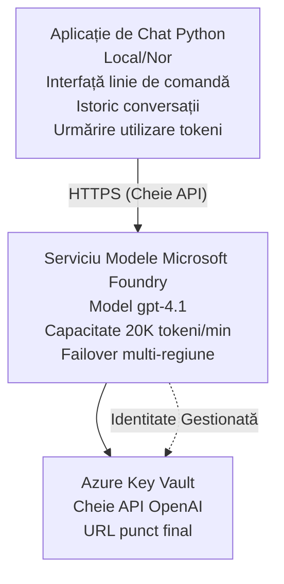

# Microsoft Foundry Models Chat Application

**Cale de învățare:** Intermediar ⭐⭐ | **Timp:** 35-45 minute | **Cost:** 50-200 USD/lună

O aplicație completă de chat Microsoft Foundry Models implementată folosind Azure Developer CLI (azd). Acest exemplu demonstrează implementarea gpt-4.1, accesul securizat la API și o interfață simplă de chat.

## 🎯 Ce vei învăța

- Implementarea serviciului Microsoft Foundry Models cu modelul gpt-4.1  
- Securizarea cheilor API OpenAI cu Key Vault  
- Construirea unei interfețe simple de chat cu Python  
- Monitorizarea utilizării token-urilor și a costurilor  
- Implementarea limitării ratei și gestionarea erorilor  

## 📦 Ce include

✅ **Serviciul Microsoft Foundry Models** - implementare model gpt-4.1  
✅ **Aplicația de chat Python** - interfață simplă în linie de comandă  
✅ **Integrare Key Vault** - stocare securizată a cheilor API  
✅ **Șabloane ARM** - infrastructură completă ca și cod  
✅ **Monitorizarea costurilor** - urmărirea utilizării token-urilor  
✅ **Limitarea ratei** - prevenirea epuizării cotei  

## Arhitectură



## Cerințe preliminare

### Necesare

- **Azure Developer CLI (azd)** - [Ghid de instalare](https://learn.microsoft.com/azure/developer/azure-developer-cli/install-azd)  
- **Abonament Azure** cu acces OpenAI - [Solicită acces](https://aka.ms/oai/access)  
- **Python 3.9+** - [Instalează Python](https://www.python.org/downloads/)  

### Verificarea cerințelor preliminare

```bash
# Verifică versiunea azd (este necesar 1.5.0 sau mai mare)
azd version

# Verifică autentificarea Azure
azd auth login

# Verifică versiunea Python
python --version  # sau python3 --version

# Verifică accesul OpenAI (verifică în Portalul Azure)
az cognitiveservices account list-skus \
  --kind OpenAI \
  --location eastus
```

> **⚠️ Important:** Microsoft Foundry Models necesită aprobare pentru aplicație. Dacă nu ai aplicat, vizitează [aka.ms/oai/access](https://aka.ms/oai/access). Aprobare durează de obicei 1-2 zile lucrătoare.

## ⏱️ Timp estimat de implementare

| Fază | Durată | Ce se întâmplă |
|-------|----------|--------------|
| Verificare cerințe preliminare | 2-3 minute | Verifică disponibilitatea cotei OpenAI |
| Implementare infrastructură | 8-12 minute | Creare OpenAI, Key Vault, implementare model |
| Configurare aplicație | 2-3 minute | Configurare mediu și dependențe |
| **Total** | **12-18 minute** | Pregătit pentru chat cu gpt-4.1 |

**Notă:** Prima implementare OpenAI poate dura mai mult datorită provizionării modelului.

## Pornire rapidă

```bash
# Navighează la exemplu
cd examples/azure-openai-chat

# Inițializează mediul
azd env new myopenai

# Desfășoară totul (infrastructură + configurare)
azd up
# Vei fi întrebat să:
# 1. Selectezi abonamentul Azure
# 2. Alegi locația cu disponibilitate OpenAI (de ex., eastus, eastus2, westus)
# 3. Aștepți 12-18 minute pentru desfășurare

# Instalează dependențele Python
pip install -r requirements.txt

# Începe conversația!
python chat.py
```

**Rezultat așteptat:**  
```
🤖 Microsoft Foundry Models Chat Application
Connected to: gpt-4.1 (eastus)
Type your message (or 'quit' to exit)

You: Hello! Tell me about Microsoft Foundry Models.
Assistant: Microsoft Foundry Models Service provides REST API access to OpenAI's powerful language models including gpt-4.1, GPT-3.5-Turbo, and Embeddings...

[Tokens used: 145 | Estimated cost: $0.0044]
```

## ✅ Verificare implementare

### Pasul 1: Verifică resursele Azure

```bash
# Vizualizați resursele implementate
azd show

# Ieșirea așteptată arată:
# - Serviciul OpenAI: (numele resursei)
# - Key Vault: (numele resursei)
# - Implementare: gpt-4.1
# - Locație: eastus (sau regiunea selectată)
```

### Pasul 2: Testează API-ul OpenAI

```bash
# Obține endpoint-ul și cheia OpenAI
OPENAI_ENDPOINT=$(azd env get-value AZURE_OPENAI_ENDPOINT)
OPENAI_KEY=$(azd env get-value AZURE_OPENAI_API_KEY)

# Testează apelul API
curl "$OPENAI_ENDPOINT/openai/deployments/gpt-4.1/chat/completions?api-version=2024-08-01-preview" \
  -H "Content-Type: application/json" \
  -H "api-key: $OPENAI_KEY" \
  -d '{
    "messages": [{"role": "user", "content": "Say hello!"}],
    "max_tokens": 50
  }'
```

**Răspuns așteptat:**  
```json
{
  "choices": [
    {
      "message": {
        "role": "assistant",
        "content": "Hello! How can I assist you today?"
      }
    }
  ],
  "usage": {
    "prompt_tokens": 8,
    "completion_tokens": 9,
    "total_tokens": 17
  }
}
```

### Pasul 3: Verifică accesul la Key Vault

```bash
# Listează secretele din Key Vault
KV_NAME=$(azd env get-value AZURE_KEY_VAULT_NAME)

az keyvault secret list \
  --vault-name $KV_NAME \
  --query "[].name" \
  --output table
```

**Secreții așteptați:**  
- `openai-api-key`  
- `openai-endpoint`  

**Criterii de succes:**  
- ✅ Serviciul OpenAI implementat cu gpt-4.1  
- ✅ Apelul API returnează completare validă  
- ✅ Secreții stocați în Key Vault  
- ✅ Monitorizarea utilizării token-urilor funcționează  

## Structura proiectului

```
azure-openai-chat/
├── README.md                   ✅ This guide
├── azure.yaml                  ✅ AZD configuration
├── infra/                      ✅ Infrastructure as Code
│   ├── main.bicep             ✅ Main Bicep template
│   ├── main.parameters.json   ✅ Parameters
│   └── openai.bicep           ✅ OpenAI resource definition
├── src/                        ✅ Application code
│   ├── chat.py                ✅ Chat interface
│   ├── config.py              ✅ Configuration loader
│   └── requirements.txt       ✅ Python dependencies
└── .gitignore                  ✅ Git ignore rules
```

## Caracteristici ale aplicației

### Interfață de chat (`chat.py`)

Aplicația de chat include:

- **Istoric conversații** - Păstrează contextul pe durata mesajelor  
- **Numărare token-uri** - Urmărește utilizarea și estimează costurile  
- **Gestionarea erorilor** - Tratarea elegantă a limitărilor de rată și erorilor API  
- **Estimare costuri** - Calcul în timp real a costului per mesaj  
- **Suport streaming** - Răspunsuri în flux opțional  

### Comenzi

În timpul chat-ului poți folosi:  
- `quit` sau `exit` - Încheie sesiunea  
- `clear` - Șterge istoricul conversației  
- `tokens` - Arată totalul token-urilor utilizate  
- `cost` - Arată costul total estimat  

### Configurare (`config.py`)

Încarcă configurația din variabile de mediu:  
```python
AZURE_OPENAI_ENDPOINT  # Din Key Vault
AZURE_OPENAI_API_KEY   # Din Key Vault
AZURE_OPENAI_MODEL     # Implicit: gpt-4.1
AZURE_OPENAI_MAX_TOKENS # Implicit: 800
```

## Exemple de utilizare

### Chat de bază

```bash
python chat.py
```

### Chat cu model personalizat

```bash
export AZURE_OPENAI_MODEL=gpt-35-turbo
python chat.py
```

### Chat cu streaming

```bash
python chat.py --stream
```

### Exemplu de conversație

```
You: Explain Microsoft Foundry Models Service in 3 sentences.
Assistant: Microsoft Foundry Models Service is Microsoft Azure's cloud platform offering 
that provides access to OpenAI's powerful language models. It enables developers 
to integrate capabilities like gpt-4.1 into their applications with enterprise-grade 
security and compliance. The service includes features for content filtering, 
abuse monitoring, and responsible AI practices.

[Tokens used: 89 | Estimated cost: $0.0027]

You: What models are available?
Assistant: Microsoft Foundry Models Service offers several model families including gpt-4.1 
(most capable), GPT-3.5-Turbo (faster and cost-effective), and Embeddings models 
for vector search. Each model has different capabilities, pricing, and token limits.

[Tokens used: 67 | Estimated cost: $0.0020]

Total session: 156 tokens | $0.0047
```

## Gestionarea costurilor

### Preț token-uri (gpt-4.1)

| Model | Input (per 1K token-uri) | Output (per 1K token-uri) |
|-------|--------------------------|---------------------------|
| gpt-4.1 | 0,03 USD | 0,06 USD |
| GPT-3.5-Turbo | 0,0015 USD | 0,002 USD |

### Costuri lunare estimate

Pe baza modelelor de utilizare:

| Nivel de utilizare | Mesaje/zi | Token-uri/zi | Cost lunar |
|--------------------|------------|--------------|------------|
| **Ușor** | 20 mesaje | 3.000 token-uri | 3-5 USD |
| **Moderată** | 100 mesaje | 15.000 token-uri | 15-25 USD |
| **Intensiv** | 500 mesaje | 75.000 token-uri | 75-125 USD |

**Cost de bază infrastructură:** 1-2 USD/lună (Key Vault + calcul minim)

### Sfaturi pentru optimizarea costurilor

```bash
# 1. Folosește GPT-3.5-Turbo pentru sarcini mai simple (de 20 ori mai ieftin)
export AZURE_OPENAI_MODEL=gpt-35-turbo

# 2. Redu numărul maxim de tokeni pentru răspunsuri mai scurte
export AZURE_OPENAI_MAX_TOKENS=400

# 3. Monitorizează utilizarea tokenilor
python chat.py --show-tokens

# 4. Configurează alerte de buget
az consumption budget create \
  --budget-name "openai-budget" \
  --amount 50 \
  --time-grain Monthly
```

## Monitorizare

### Vizualizează utilizarea token-urilor

```bash
# În Azure Portal:
# Resursă OpenAI → Metrice → Selectați „Token Transaction”

# Sau prin Azure CLI:
az monitor metrics list \
  --resource $(azd env get-value AZURE_OPENAI_RESOURCE_ID) \
  --metric "TokenTransaction" \
  --start-time $(date -u -d '1 hour ago' '+%Y-%m-%dT%H:%M:%S') \
  --interval PT1M
```

### Vizualizează jurnalele API

```bash
# Flux de jurnale de diagnosticare
az monitor diagnostic-settings create \
  --resource $(azd env get-value AZURE_OPENAI_RESOURCE_ID) \
  --name openai-logs \
  --logs '[{"category": "Audit", "enabled": true}]' \
  --workspace $(azd env get-value LOG_ANALYTICS_WORKSPACE_ID)

# Jurnale de interogare
az monitor log-analytics query \
  --workspace $(azd env get-value LOG_ANALYTICS_WORKSPACE_ID) \
  --analytics-query "AzureDiagnostics | where Category == 'Audit' | top 10 by TimeGenerated"
```

## Depanare

### Problemă: Eroare "Access Denied"

**Simptome:** 403 Forbidden la apelul API

**Soluții:**  
```bash
# 1. Verifică dacă accesul OpenAI este aprobat
az cognitiveservices account show \
  --name $(azd env get-value AZURE_OPENAI_NAME) \
  --resource-group $(azd env get-value AZURE_RESOURCE_GROUP)

# 2. Verifică dacă cheia API este corectă
azd env get-value AZURE_OPENAI_API_KEY

# 3. Verifică formatul URL-ului endpoint
azd env get-value AZURE_OPENAI_ENDPOINT
# Ar trebui să fie: https://[name].openai.azure.com/
```

### Problemă: "Rate Limit Exceeded"

**Simptome:** 429 Too Many Requests

**Soluții:**  
```bash
# 1. Verifică cota curentă
az cognitiveservices account deployment show \
  --name $(azd env get-value AZURE_OPENAI_NAME) \
  --resource-group $(azd env get-value AZURE_RESOURCE_GROUP) \
  --deployment-name gpt-4.1

# 2. Solicită creșterea cotei (dacă este necesar)
# Accesează Azure Portal → Resursa OpenAI → Cote → Solicita creșterea

# 3. Implementează logica de reîncercare (deja în chat.py)
# Aplicația reîncearcă automat cu reîncercări exponentiale
```

### Problemă: "Model Not Found"

**Simptome:** Eroare 404 pentru implementare

**Soluții:**  
```bash
# 1. Listează implementările disponibile
az cognitiveservices account deployment list \
  --name $(azd env get-value AZURE_OPENAI_NAME) \
  --resource-group $(azd env get-value AZURE_RESOURCE_GROUP)

# 2. Verifică numele modelului în mediu
echo $AZURE_OPENAI_MODEL

# 3. Actualizează cu numele corect al implementării
export AZURE_OPENAI_MODEL=gpt-4.1  # sau gpt-35-turbo
```

### Problemă: Latență mare

**Simptome:** Timp de răspuns lent (>5 secunde)

**Soluții:**  
```bash
# 1. Verifică latența regională
# Desfășoară în regiunea cea mai apropiată de utilizatori

# 2. Reduce max_tokens pentru răspunsuri mai rapide
export AZURE_OPENAI_MAX_TOKENS=400

# 3. Folosește streaming pentru o experiență utilizator mai bună
python chat.py --stream
```

## Cele mai bune practici de securitate

### 1. Protejează cheile API

```bash
# Nu salva niciodată cheile în controlul sursei
# Folosește Key Vault (configurat deja)

# Rotește cheile regulat
az cognitiveservices account keys regenerate \
  --name $(azd env get-value AZURE_OPENAI_NAME) \
  --resource-group $(azd env get-value AZURE_RESOURCE_GROUP) \
  --key-name key1
```

### 2. Implementează filtrarea conținutului

```python
# Microsoft Foundry Models include filtrare încorporată a conținutului
# Configurați în Portalul Azure:
# Resursă OpenAI → Filtre de conținut → Creează filtru personalizat

# Categorii: Ură, Sexual, Violent, Auto-vătămare
# Niveluri: Filtrare scăzută, medie, înaltă
```

### 3. Folosește identitate gestionată (producție)

```bash
# Pentru implementările în producție, folosiți identitatea gestionată
# în loc de cheile API (necesită găzduirea aplicației pe Azure)

# Actualizați infra/openai.bicep pentru a include:
# identity: { type: 'SystemAssigned' }
```

## Dezvoltare

### Rulează local

```bash
# Instalează dependențele
pip install -r src/requirements.txt

# Setează variabilele de mediu
export AZURE_OPENAI_ENDPOINT="https://[name].openai.azure.com/"
export AZURE_OPENAI_API_KEY="your-api-key"
export AZURE_OPENAI_MODEL="gpt-4.1"

# Rulează aplicația
python src/chat.py
```

### Rulează teste

```bash
# Instalează dependențele pentru teste
pip install pytest pytest-cov

# Rulează testele
pytest tests/ -v

# Cu acoperire
pytest tests/ --cov=src --cov-report=html
```

### Actualizează implementarea modelului

```bash
# Distribuie o versiune diferită a modelului
az cognitiveservices account deployment create \
  --name $(azd env get-value AZURE_OPENAI_NAME) \
  --resource-group $(azd env get-value AZURE_RESOURCE_GROUP) \
  --deployment-name gpt-35-turbo \
  --model-name gpt-35-turbo \
  --model-version "0613" \
  --model-format OpenAI \
  --sku-capacity 20 \
  --sku-name "Standard"
```

## Curățare

```bash
# Șterge toate resursele Azure
azd down --force --purge

# Aceasta elimină:
# - Serviciul OpenAI
# - Key Vault (cu ștergere soft de 90 de zile)
# - Grupul de resurse
# - Toate implementările și configurațiile
```

## Pașii următori

### Extinde acest exemplu

1. **Adaugă interfață web** - Construiește frontend React/Vue  
   ```bash
   # Adaugă serviciul frontend în azure.yaml
   # Deplasează la Azure Static Web Apps
   ```

2. **Implementează RAG** - Adaugă căutare documente cu Azure AI Search  
   ```python
   # Integrează Azure AI Search
   # Încarcă documente și creează un index vectorial
   ```

3. **Adaugă apelare de funcții** - Permite utilizarea uneltelor  
   ```python
   # Definește funcții în chat.py
   # Permite gpt-4.1 să apeleze API-uri externe
   ```

4. **Suport multi-model** - Implementează multiple modele  
   ```bash
   # Adaugă modelele gpt-35-turbo, embeddings
   # Implementează logica de rutare a modelului
   ```

### Exemple conexe

- **[Retail Multi-Agent](../retail-scenario.md)** - Arhitectură multi-agent avansată  
- **[Aplicație bază de date](../../../../examples/database-app)** - Adaugă stocare persistentă  
- **[Container Apps](../../../../examples/container-app)** - Implementare ca serviciu containerizat  

### Resurse de învățare

- 📚 [AZD For Beginners Course](../../README.md) - Curs principal  
- 📚 [Documentația Microsoft Foundry Models](https://learn.microsoft.com/azure/ai-services/openai/) - Documentație oficială  
- 📚 [Referință API OpenAI](https://platform.openai.com/docs/api-reference) - Detalii API  
- 📚 [Inteligență Artificială responsabilă](https://www.microsoft.com/ai/responsible-ai) - Cele mai bune practici  

## Resurse suplimentare

### Documentație
- **[Serviciul Microsoft Foundry Models](https://learn.microsoft.com/azure/ai-services/openai/)** - Ghid complet  
- **[Modele gpt-4.1](https://learn.microsoft.com/azure/ai-services/openai/concepts/models)** - Capacitățile modelelor  
- **[Filtrarea conținutului](https://learn.microsoft.com/azure/ai-services/openai/concepts/content-filter)** - Măsuri de siguranță  
- **[Azure Developer CLI](https://learn.microsoft.com/azure/developer/azure-developer-cli/)** - Referință azd  

### Tutoriale
- **[OpenAI Quickstart](https://learn.microsoft.com/azure/ai-services/openai/quickstart)** - Prima implementare  
- **[Chat Completions](https://learn.microsoft.com/azure/ai-services/openai/how-to/chatgpt)** - Construirea aplicațiilor de chat  
- **[Function Calling](https://learn.microsoft.com/azure/ai-services/openai/how-to/function-calling)** - Funcționalități avansate  

### Unelte
- **[Microsoft Foundry Models Studio](https://oai.azure.com/)** - Platformă web de testare  
- **[Ghid de prompt engineering](https://platform.openai.com/docs/guides/prompt-engineering)** - Scrierea prompturilor mai bune  
- **[Calculator token-uri](https://platform.openai.com/tokenizer)** - Estimare utilizare token-uri  

### Comunitate
- **[Discord Azure AI](https://discord.gg/azure)** - Ajutor din comunitate  
- **[GitHub Discussions](https://github.com/Azure-Samples/openai/discussions)** - Forum de întrebări și răspunsuri  
- **[Blog Azure](https://azure.microsoft.com/blog/tag/azure-openai-service/)** - Ultimele noutăți  

---

**🎉 Succes!** Ai implementat Microsoft Foundry Models și ai construit o aplicație de chat funcțională. Începe să explorezi capabilitățile gpt-4.1 și experimentează cu diferite prompturi și cazuri de utilizare.

**Ai întrebări?** [Deschide un issue](https://github.com/microsoft/AZD-for-beginners/issues) sau consultă [FAQ](../../resources/faq.md)

**Avertisment costuri:** Nu uita să rulezi `azd down` când termini testarea pentru a evita taxe în curs (~50-100 USD/lună pentru utilizare activă).

---

<!-- CO-OP TRANSLATOR DISCLAIMER START -->
**Declinare a responsabilității**:
Acest document a fost tradus folosind serviciul de traducere AI [Co-op Translator](https://github.com/Azure/co-op-translator). În timp ce ne străduim pentru acuratețe, vă rugăm să rețineți că traducerile automate pot conține erori sau inexactități. Documentul original în limba sa nativă trebuie considerat sursa autorizată. Pentru informații critice, se recomandă traducerea profesională realizată de un om. Nu ne asumăm responsabilitatea pentru eventualele neînțelegeri sau interpretări greșite care decurg din utilizarea acestei traduceri.
<!-- CO-OP TRANSLATOR DISCLAIMER END -->