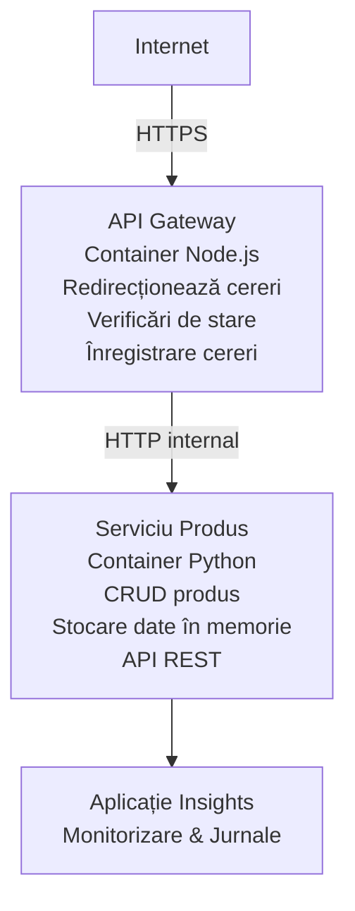

# Arhitectura Microserviciilor - Exemplu Container App

⏱️ **Timp estimat**: 25-35 minute | 💰 **Cost estimat**: ~50-100 USD/lună | ⭐ **Complexitate**: Avansat

O arhitectură microservicii **simplificată, dar funcțională**, implementată în Azure Container Apps folosind AZD CLI. Acest exemplu demonstrează comunicarea între servicii, orchestrarea containerelor și monitorizarea cu o configurație practică de 2 servicii.

> **📚 Abordare de învățare**: Acest exemplu începe cu o arhitectură minimală cu 2 servicii (API Gateway + Backend Service) pe care o poți implementa și studia efectiv. După ce stăpânești această bază, oferim îndrumări pentru extinderea către un ecosistem complet de microservicii.

## Ce Vei Învăța

După finalizarea acestui exemplu, vei:
- Implementa mai multe containere în Azure Container Apps
- Implementa comunicarea între servicii prin rețea internă
- Configura scalarea și probe de stare bazate pe mediu
- Monitoriza aplicațiile distribuite cu Application Insights
- Înțelege modele de implementare și bune practici în microservicii
- Învăța expansiunea progresivă de la arhitecturi simple la complexe

## Arhitectura

### Faza 1: Ce Construim (Inclus în acest Exemplu)


**De ce să începem simplu?**
- ✅ Implementare și înțelegere rapidă (25-35 minute)
- ✅ Învățarea pattern-urilor esențiale de microservicii fără complexitate
- ✅ Cod funcțional pe care poți să-l modifici și experimentezi
- ✅ Cost redus pentru învățare (~50-100 USD/lună vs 300-1400 USD/lună)
- ✅ Construiește încredere înainte de a adăuga baze de date și cozi de mesaje

**Analogie**: Gândește-te la asta ca la învățatul condusului. Începi într-o parcare goală (2 servicii), stăpânești elementele de bază, apoi treci la traficul din oraș (5+ servicii cu baze de date).

### Faza 2: Extindere Viitoare (Arhitectură de Referință)

După ce stăpânești arhitectura cu 2 servicii, poți extinde către:

```
Full Architecture (Not Included - For Reference)
├── API Gateway (✅ Included)
├── Product Service (✅ Included)
├── Order Service (🔜 Add next)
├── User Service (🔜 Add next)
├── Notification Service (🔜 Add last)
├── Azure Service Bus (🔜 For async communication)
├── Cosmos DB (🔜 For product persistence)
├── Azure SQL (🔜 For order management)
└── Azure Storage (🔜 For file storage)
```

Vezi secțiunea „Ghid de Extindere” la final pentru instrucțiuni pas cu pas.

## Caracteristici Incluse

✅ **Descoperire Servicii**: Descoperire automată bazată pe DNS între containere  
✅ **Echilibrare a Sarcinii**: Echilibrare încorporată între replici  
✅ **Scalare Automată**: Scalare independentă per serviciu bazată pe cereri HTTP  
✅ **Monitorizare Sănătate**: Probe de liveness și readiness pentru ambele servicii  
✅ **Logare Distribuită**: Logare centralizată cu Application Insights  
✅ **Rețea Internă**: Comunicare securizată între servicii  
✅ **Orchestrare Container**: Implementare și scalare automată  
✅ **Actualizări Fără Downtime**: Actualizări rolling cu managementul versiunilor  

## Cerințe Prealabile

### Instrumente Necesare

Înainte de a începe, verifică dacă ai instalat următoarele unelte:

1. **[Azure Developer CLI (azd)](https://learn.microsoft.com/azure/developer/azure-developer-cli/install-azd)** (versiunea 1.0.0 sau mai nouă)
   ```bash
   azd version
   # Ieșire așteptată: versiunea azd 1.0.0 sau mai mare
   ```

2. **[Azure CLI](https://learn.microsoft.com/cli/azure/install-azure-cli)** (versiunea 2.50.0 sau mai nouă)
   ```bash
   az --version
   # Ieșire așteptată: azure-cli 2.50.0 sau o versiune mai recentă
   ```

3. **[Docker](https://www.docker.com/get-started)** (pentru dezvoltare/testare locală - opțional)
   ```bash
   docker --version
   # Ieșire așteptată: versiunea Docker 20.10 sau mai recentă
   ```

### Cerințe Azure

- Un **abonament Azure** activ ([creează un cont gratuit](https://azure.microsoft.com/free/))
- Permisiuni pentru crearea resurselor în abonamentul tău
- Rolul **Contributor** la nivel de abonament sau grup de resurse

### Cunoștințe Prealabile

Acesta este un exemplu de nivel **avansat**. Ar trebui să ai:
- Finalizat [exemplul simplu Flask API](../../../../../examples/container-app/simple-flask-api) 
- Înțelegere de bază a arhitecturii microserviciilor
- Familiaritate cu API-urile REST și HTTP
- Înțelegerea conceptelor de containere

**Ești nou cu Container Apps?** Începe mai întâi cu [exemplul simplu Flask API](../../../../../examples/container-app/simple-flask-api) pentru a învăța elementele de bază.

## Pornire Rapidă (Pas cu Pas)

### Pasul 1: Clonează și Navighează

```bash
git clone https://github.com/microsoft/AZD-for-beginners.git
cd AZD-for-beginners/examples/container-app/microservices
```

**✓ Verificare Succes**: Asigură-te că vezi `azure.yaml`:
```bash
ls
# Așteptat: README.md, azure.yaml, infra/, src/
```

### Pasul 2: Autentificare cu Azure

```bash
azd auth login
```

Aceasta va deschide browserul pentru autentificare Azure. Conectează-te cu datele tale.

**✓ Verificare Succes**: Ar trebui să vezi:
```
Logged in to Azure.
```

### Pasul 3: Inițializează Mediul

```bash
azd init
```

**Prompturile pe care le vei vedea**:
- **Numele mediului**: Introdu un nume scurt (ex: `microservices-dev`)
- **Abonament Azure**: Selectează abonamentul tău
- **Locație Azure**: Alege o regiune (ex: `eastus`, `westeurope`)

**✓ Verificare Succes**: Ar trebui să vezi:
```
SUCCESS: New project initialized!
```

### Pasul 4: Implementare Infrastructură și Servicii

```bash
azd up
```

**Ce se întâmplă** (durată 8-12 minute):
1. Creează mediul Container Apps
2. Creează Application Insights pentru monitorizare
3. Construiește containerul API Gateway (Node.js)
4. Construiește containerul Product Service (Python)
5. Implementarea ambelor containere în Azure
6. Configurează rețelistica și probele de sănătate
7. Setează monitorizarea și logarea

**✓ Verificare Succes**: Ar trebui să vezi:
```
SUCCESS: Your application was deployed to Azure in X minutes Y seconds.
Endpoint: https://api-gateway-<unique-id>.azurecontainerapps.io
```

**⏱️ Timp**: 8-12 minute

### Pasul 5: Testează Implementarea

```bash
# Obțineți punctul de acces al gateway-ului
GATEWAY_URL=$(azd env get-values | grep API_GATEWAY_URL | cut -d '=' -f2 | tr -d '"')

# Testați sănătatea API Gateway
curl $GATEWAY_URL/health

# Ieșire așteptată:
# {"status":"healthy","service":"api-gateway","timestamp":"2025-11-19T10:30:00Z"}
```

**Testează serviciul de produse prin gateway**:
```bash
# Lista produse
curl $GATEWAY_URL/api/products

# Ieșire așteptată:
# [
#   {"id":1,"name":"Laptop","price":999.99,"stock":50},
#   {"id":2,"name":"Mouse","price":29.99,"stock":200},
#   {"id":3,"name":"Keyboard","price":79.99,"stock":150}
# ]
```

**✓ Verificare Succes**: Ambele endpoint-uri returnează date JSON fără erori.

---

**🎉 Felicitări!** Ai implementat o arhitectură microservicii în Azure!

## Structura Proiectului

Toate fișierele de implementare sunt incluse — acesta este un exemplu complet funcțional:

```
microservices/
│
├── README.md                         # This file
├── azure.yaml                        # AZD configuration
├── .gitignore                        # Git ignore patterns
│
├── infra/                           # Infrastructure as Code (Bicep)
│   ├── main.bicep                   # Main orchestration
│   ├── abbreviations.json           # Naming conventions
│   ├── core/                        # Shared infrastructure
│   │   ├── container-apps-environment.bicep  # Container environment + registry
│   │   └── monitor.bicep            # Application Insights + Log Analytics
│   └── app/                         # Service definitions
│       ├── api-gateway.bicep        # API Gateway container app
│       └── product-service.bicep    # Product Service container app
│
└── src/                             # Application source code
    ├── api-gateway/                 # Node.js API Gateway
    │   ├── app.js                   # Express server with routing
    │   ├── package.json             # Node dependencies
    │   └── Dockerfile               # Container definition
    └── product-service/             # Python Product Service
        ├── main.py                  # Flask API with product data
        ├── requirements.txt         # Python dependencies
        └── Dockerfile               # Container definition
```

**Ce face fiecare componentă:**

**Infrastructură (infra/)**:
- `main.bicep`: Orchestrarea tuturor resurselor Azure și dependențele lor
- `core/container-apps-environment.bicep`: Creează mediul Container Apps și Azure Container Registry
- `core/monitor.bicep`: Configurează Application Insights pentru logare distribuită
- `app/*.bicep`: Definiții individuale de container app cu scalare și probe de sănătate

**API Gateway (src/api-gateway/)**:
- Serviciu public care direcționează cererile către backend
- Implementare logare, gestionare erori, și redirecționare cereri
- Demonstrează comunicarea HTTP între servicii

**Product Service (src/product-service/)**:
- Serviciu intern cu catalog produse (în memorie pentru simplitate)
- API REST cu probe de sănătate
- Exemplu de pattern microserviciu backend

## Prezentare Servicii

### API Gateway (Node.js/Express)

**Port**: 8080  
**Acces**: Public (ingress extern)  
**Scop**: Direcționează cererile către backend corespunzător  

**Endpoint-uri**:
- `GET /` - Informații serviciu
- `GET /health` - Endpoint de sănătate
- `GET /api/products` - Redirecționează către product service (listare)
- `GET /api/products/:id` - Redirecționează către product service (detaliu produs)

**Caracteristici cheie**:
- Routing cereri cu axios
- Logare centralizată
- Gestionare erori și timeout
- Descoperire servicii prin variabile de mediu
- Integrare Application Insights

**Exemplu de cod** (`src/api-gateway/app.js`):
```javascript
// Comunicare internă a serviciului
app.get('/api/products', async (req, res) => {
  const response = await axios.get(`${PRODUCT_SERVICE_URL}/products`);
  res.json(response.data);
});
```

### Product Service (Python/Flask)

**Port**: 8000  
**Acces**: Intern doar (fără ingress extern)  
**Scop**: Gestionează catalogul produselor în memorie  

**Endpoint-uri**:
- `GET /` - Informații serviciu
- `GET /health` - Endpoint de sănătate
- `GET /products` - Listare produse
- `GET /products/<id>` - Detaliu produs după ID

**Caracteristici cheie**:
- API RESTful cu Flask
- Magazin produse în memorie (simplu, fără DB)
- Monitorizare sănătate cu probe
- Logare structurată
- Integrare Application Insights

**Model de date**:
```python
{
  "id": 1,
  "name": "Laptop",
  "description": "High-performance laptop",
  "price": 999.99,
  "stock": 50
}
```

**De ce doar intern?**
Serviciul de produse nu este expus public. Toate cererile trec prin API Gateway, care oferă:
- Securitate: punct de acces controlat
- Flexibilitate: posibilitatea de a schimba backend fără impact client
- Monitorizare: logare centralizată a cererilor

## Înțelegerea Comunicării între Servicii

### Cum comunică serviciile între ele

În acest exemplu, API Gateway comunică cu Product Service prin **apeluri HTTP interne**:

```javascript
// API Gateway (src/api-gateway/app.js)
const PRODUCT_SERVICE_URL = process.env.PRODUCT_SERVICE_URL;

// Efectuează o cerere HTTP internă
const response = await axios.get(`${PRODUCT_SERVICE_URL}/products`);
```

**Puncte cheie**:

1. **Descoperire bazată pe DNS**: Container Apps oferă DNS intern automat  
   - FQDN Product Service: `product-service.internal.<environment>.azurecontainerapps.io`  
   - Simplificat ca: `http://product-service` (rezolvat de Container Apps)

2. **Fără expunere publică**: Product Service are `external: false` în Bicep  
   - Accesibil doar în mediul Container Apps  
   - Nu este accesibil din internet

3. **Variabile de mediu**: URL-urile serviciilor sunt injectate la implementare  
   - Bicep transmite FQDN-ul intern către gateway  
   - Fără URL-uri hardcodate în codul aplicației

**Analogie**: Gândește-te ca la camerele dintr-un birou. API Gateway este recepția (publică), iar Product Service este o cameră internă. Vizitatorii trebuie să treacă prin recepție ca să ajungă în orice birou.

## Opțiuni de Implementare

### Implementare Completă (Recomandată)

```bash
# Implementați infrastructura și ambele servicii
azd up
```

Aceasta implementează:
1. Mediul Container Apps
2. Application Insights
3. Container Registry
4. Container API Gateway
5. Container Product Service

**Timp**: 8-12 minute

### Implementare Serviciu Individual

```bash
# Implementați un singur serviciu (după prima rulare azd up)
azd deploy api-gateway

# Sau implementați serviciul de produs
azd deploy product-service
```

**Caz de utilizare**: Când ai modificat codul în unul dintre servicii și vrei să-l redeploiezi doar pe acel serviciu.

### Actualizare Configurație

```bash
# Schimbați parametrii de scalare
azd env set GATEWAY_MAX_REPLICAS 30

# Redeploy cu noua configurație
azd up
```

## Configurare

### Configurare Scalare

Ambele servicii sunt configurate cu scalare automată bazată pe HTTP în fișierele Bicep:

**API Gateway**:
- Replica minimă: 2 (mereu cel puțin 2 pentru disponibilitate)
- Replica maximă: 20
- Trigger scalare: 50 cereri concurente per replică

**Product Service**:
- Replica minimă: 1 (poate scala până la zero dacă este nevoie)
- Replica maximă: 10
- Trigger scalare: 100 cereri concurente per replică

**Personalizează scalarea** (în `infra/app/*.bicep`):
```bicep
scale: {
  minReplicas: 1
  maxReplicas: 10
  rules: [
    {
      name: 'http-scale-rule'
      http: {
        metadata: {
          concurrentRequests: '100'  // Adjust this
        }
      }
    }
  ]
}
```

### Alocare Resurse

**API Gateway**:
- CPU: 1.0 vCPU
- Memorie: 2 GiB
- Motiv: Gestionează toate cererile externe

**Product Service**:
- CPU: 0.5 vCPU
- Memorie: 1 GiB
- Motiv: Operațiuni ușoare în memorie

### Probe de Sănătate

Ambele servicii includ probe de liveness și readiness:

```bicep
probes: [
  {
    type: 'Liveness'
    httpGet: {
      path: '/health'
      port: 8080
    }
    initialDelaySeconds: 10
    periodSeconds: 30
  }
  {
    type: 'Readiness'
    httpGet: {
      path: '/health'
      port: 8080
    }
    initialDelaySeconds: 5
    periodSeconds: 10
  }
]
```

**Ce înseamnă asta**:
- **Liveness**: Dacă probele eșuează, Container Apps repornește containerul
- **Readiness**: Dacă nu e pregătit, Container Apps nu trimite trafic spre replica respectivă


## Monitorizare și Observabilitate

### Vezi Jurnalele Serviciilor

```bash
# Vizualizați jurnalele folosind azd monitor
azd monitor --logs

# Sau folosiți Azure CLI pentru Container Apps specifice:
# Transmiteți jurnale din API Gateway
az containerapp logs show --name api-gateway --resource-group $RG_NAME --follow

# Vizualizați jurnalele recente ale serviciului de produse
az containerapp logs show --name product-service --resource-group $RG_NAME --tail 100
```

**Output așteptat**:
```
[api-gateway] API Gateway listening on port 8080
[api-gateway] Product Service URL: http://product-service
[api-gateway] GET /api/products 200 - 45ms
[product-service] Retrieved 5 products
```

### Interogări Application Insights

Accesează Application Insights în Azure Portal, apoi rulează aceste interogări:

**Găsește cererile lente**:
```kusto
requests
| where timestamp > ago(1h)
| where duration > 1000  // Requests taking >1 second
| summarize count() by name, cloud_RoleName
| order by count_ desc
```

**Urmărește apelurile servicii-servicii**:
```kusto
dependencies
| where timestamp > ago(1h)
| where type == "Http"
| project timestamp, name, target, duration, success
| order by timestamp desc
```

**Rata erorilor pe serviciu**:
```kusto
exceptions
| where timestamp > ago(24h)
| summarize errorCount = count() by cloud_RoleName, type
| order by errorCount desc
```

**Volumul cererilor în timp**:
```kusto
requests
| where timestamp > ago(1h)
| summarize requestCount = count() by bin(timestamp, 5m), cloud_RoleName
| render timechart
```

### Accesează Dashboard-ul de Monitorizare

```bash
# Obține detalii despre Application Insights
azd env get-values | grep APPLICATIONINSIGHTS

# Deschide monitorizarea în Portalul Azure
az monitor app-insights component show \
  --app $(azd env get-values | grep APPLICATIONINSIGHTS_CONNECTION_STRING | cut -d '=' -f2) \
  --resource-group $(azd env get-values | grep AZURE_RESOURCE_GROUP | cut -d '=' -f2) \
  --query "appId" -o tsv
```

### Metrici Live

1. Navighează la Application Insights în Azure Portal  
2. Click pe „Live Metrics”  
3. Vezi cererile, eșecurile și performanța în timp real  
4. Testează rulând: `curl $(azd env get-values | grep API_GATEWAY_URL | cut -d '=' -f2 | tr -d '"')/api/products`

## Exerciții Practice

[Notă: Vezi exercițiile complete de mai sus în secțiunea "Practical Exercises" pentru instrucțiuni detaliate pas cu pas, inclusiv verificarea implementării, modificarea datelor, teste de autoscalare, gestionarea erorilor și adăugarea unui al treilea serviciu.]

## Analiză Costuri

### Costuri Lunare Estimate (Pentru Acest Exemplu cu 2 Servicii)

| Resursă | Configurație | Cost Estimat |
|----------|--------------|--------------|
| API Gateway | 2-20 replici, 1 vCPU, 2GB RAM | 30-150 USD |
| Product Service | 1-10 replici, 0.5 vCPU, 1GB RAM | 15-75 USD |
| Container Registry | Nivel basic | 5 USD |
| Application Insights | 1-2 GB/lună | 5-10 USD |
| Log Analytics | 1 GB/lună | 3 USD |
| **Total** |  | **58-243 USD/lună** |

**Distribuție costuri pe utilizare**:
- **Trafic redus** (testare/învățare): ~60 USD/lună  
- **Trafic moderat** (producție mică): ~120 USD/lună  
- **Trafic ridicat** (perioade aglomerate): ~240 USD/lună  

### Sfaturi pentru Optimizarea Costurilor

1. **Scalează la Zero pentru Dezvoltare**:
   ```bicep
   scale: {
     minReplicas: 0  // Save $30-40/month when not in use
     maxReplicas: 10
   }
   ```

2. **Folosește Planul de Consum pentru Cosmos DB** (când îl adaugi):
   - Plătești doar pentru ceea ce folosești  
   - Fără taxă minimă

3. **Setează Sampling în Application Insights**:
   ```javascript
   appInsights.defaultClient.config.samplingPercentage = 50; // Eșantionați 50% din cereri
   ```

4. **Curăță Resursele când nu sunt necesare**:
   ```bash
   azd down
   ```

### Opțiuni pentru Nivel Gratuit

Pentru învățare/testare, ia în considerare:
- Folosește creditele gratuite Azure (primele 30 de zile)
- Menține un număr minim de replici
- Șterge după testare (fără costuri continue)

---

## Curățare

Pentru a evita costurile continue, șterge toate resursele:

```bash
azd down --force --purge
```

**Prompt de Confirmare**:
```
? Total resources to delete: 6, are you sure you want to continue? (y/N)
```

Tastează `y` pentru a confirma.

**Ce Se Șterge**:
- Container Apps Environment
- Ambele Container Apps (gateway & serviciu produs)
- Container Registry
- Application Insights
- Log Analytics Workspace
- Resource Group

**✓ Verifică Curățarea**:
```bash
az group list --query "[?starts_with(name,'rg-microservices')]" --output table
```

Ar trebui să returneze gol.

---

## Ghid de Extindere: De la 2 la 5+ Servicii

Odată ce ai stăpânit această arhitectură cu 2 servicii, iată cum să extinzi:

### Faza 1: Adaugă Persistență Bază de Date (Următorul Pas)

**Adaugă Cosmos DB pentru Serviciul Produs**:

1. Creează `infra/core/cosmos.bicep`:
   ```bicep
   resource cosmosAccount 'Microsoft.DocumentDB/databaseAccounts@2023-04-15' = {
     name: name
     location: location
     kind: 'GlobalDocumentDB'
     properties: {
       databaseAccountOfferType: 'Standard'
       locations: [{ locationName: location, failoverPriority: 0 }]
     }
   }
   ```

2. Actualizează serviciul produs să folosească Cosmos DB în loc de date în memorie

3. Cost estimat suplimentar: ~25$/lună (serverless)

### Faza 2: Adaugă Al Treilea Serviciu (Management Comenzi)

**Creează Serviciul Comenzi**:

1. Folder nou: `src/order-service/` (Python/Node.js/C#)
2. Bicep nou: `infra/app/order-service.bicep`
3. Actualizează API Gateway să ruteze `/api/orders`
4. Adaugă Azure SQL Database pentru persistența comenzilor

**Arhitectura devine**:
```
API Gateway → Product Service (Cosmos DB)
           → Order Service (Azure SQL)
```

### Faza 3: Adaugă Comunicare Async (Service Bus)

**Implementează Arhitectură Orientată pe Evenimente**:

1. Adaugă Azure Service Bus: `infra/core/servicebus.bicep`
2. Serviciul Produs publică evenimente "ProductCreated"
3. Serviciul Comenzi se abonează la evenimentele produsului
4. Adaugă Serviciul de Notificări pentru procesarea evenimentelor

**Model**: Cerere/Răspuns (HTTP) + Orientat pe Evenimente (Service Bus)

### Faza 4: Adaugă Autentificarea Utilizatorului

**Implementează Serviciul Utilizator**:

1. Creează `src/user-service/` (Go/Node.js)
2. Adaugă Azure AD B2C sau autentificare JWT personalizată
3. API Gateway validează token-urile
4. Serviciile verifică permisiunile utilizatorilor

### Faza 5: Pregătirea pentru Producție

**Adaugă Aceste Componente**:
- Azure Front Door (echilibrare globală a traficului)
- Azure Key Vault (gestionare secrete)
- Azure Monitor Workbooks (dashboard-uri personalizate)
- Pipeline CI/CD (GitHub Actions)
- Deploy-uri Blue-Green
- Managed Identity pentru toate serviciile

**Cost Arhitectură Completă pentru Producție**: ~300-1,400$/lună

---

## Află Mai Multe

### Documentație Relevantă
- [Documentație Azure Container Apps](https://learn.microsoft.com/azure/container-apps/)
- [Ghid Arhitectură Microservicii](https://learn.microsoft.com/azure/architecture/guide/architecture-styles/microservices)
- [Application Insights pentru Tracing Distribuit](https://learn.microsoft.com/azure/azure-monitor/app/distributed-tracing)
- [Documentație Azure Developer CLI](https://learn.microsoft.com/azure/developer/azure-developer-cli/)

### Următorii Pași în Acest Curs
- ← Anterior: [API Simplu Flask](../../../../../examples/container-app/simple-flask-api) - exemplu pentru începători cu un singur container
- → Următor: [Ghid Integrare AI](../../../../../examples/docs/ai-foundry) - Adaugă capabilități AI
- 🏠 [Pagina Principală a Cursului](../../README.md)

### Comparativ: Când să Folosești Ce

**Aplicație Single Container** (exemplu API simplu Flask):
- ✅ Aplicații simple
- ✅ Arhitectură monolitică
- ✅ Deploy rapid
- ❌ Scalabilitate limitată
- **Cost**: ~15-50$/lună

**Microservicii** (Acest exemplu):
- ✅ Aplicații complexe
- ✅ Scalare independentă per serviciu
- ✅ Autonomie echipe (servicii diferite, echipe diferite)
- ❌ Mai complex de gestionat
- **Cost**: ~60-250$/lună

**Kubernetes (AKS)**:
- ✅ Control și flexibilitate maximă
- ✅ Portabilitate multi-cloud
- ✅ Networking avansat
- ❌ Necesită expertiză Kubernetes
- **Cost**: minim ~150-500$/lună

**Recomandare**: Începe cu Container Apps (acest exemplu), treci la AKS doar dacă ai nevoie de facilități specifice Kubernetes.

---

## Întrebări Frecvente

**Î: De ce doar 2 servicii în loc de 5+?**  
R: Progresație educațională. Stăpânește elementele fundamentale (comunicare servicii, monitorizare, scalare) cu un exemplu simplu înainte de a adăuga complexitate. Modelele învățate aici se aplică arhitecturilor cu 100 de servicii.

**Î: Pot adăuga singur mai multe servicii?**  
R: Absolut! Urmează ghidul de extindere de mai sus. Fiecare serviciu nou urmează același model: creezi folderul src, creezi fișierul Bicep, actualizezi azure.yaml, deploy.

**Î: Este pregătit pentru producție?**  
R: Este o bază solidă. Pentru producție, adaugă: identitate gestionată, Key Vault, baze de date persistente, pipeline CI/CD, alerte de monitorizare și strategie de backup.

**Î: De ce nu folosesc Dapr sau alt service mesh?**  
R: Păstrează-l simplu pentru învățare. Odată ce înțelegi networkingul nativ al Container Apps, poți adăuga Dapr pentru scenarii avansate.

**Î: Cum fac debugging local?**  
R: Rulează serviciile local cu Docker:
```bash
cd src/api-gateway
docker build -t local-gateway .
docker run -p 8080:8080 -e PRODUCT_SERVICE_URL=http://localhost:8000 local-gateway
```

**Î: Pot folosi limbaje de programare diferite?**  
R: Da! Acest exemplu arată Node.js (gateway) + Python (serviciul produs). Poți combina orice limbaje care rulează în containere.

**Î: Ce fac dacă nu am credite Azure?**  
R: Folosește nivelul gratuit Azure (primele 30 de zile cu conturi noi) sau deployează pentru perioade scurte de testare și șterge imediat.

---

> **🎓 Rezumat Cale de Învățare**: Ai învățat să deployezi o arhitectură multi-serviciu cu scalare automată, networking intern, monitorizare centralizată și modele pregătite pentru producție. Această bază te pregătește pentru sisteme distribuite complexe și arhitecturi enterprise microservicii.

**📚 Navigare Curs:**
- ← Anterior: [API Simplu Flask](../../../../../examples/container-app/simple-flask-api)
- → Următor: [Exemplu Integrare Bază de Date](../../../../../examples/database-app)
- 🏠 [Pagina Principală Curs](../../../README.md)
- 📖 [Best Practices Container Apps](../../../docs/chapter-04-infrastructure/deployment-guide.md)

---

<!-- CO-OP TRANSLATOR DISCLAIMER START -->
**Declinare a responsabilității**:  
Acest document a fost tradus utilizând serviciul de traducere AI [Co-op Translator](https://github.com/Azure/co-op-translator). Deși ne străduim pentru acuratețe, vă rugăm să rețineți că traducerile automate pot conține erori sau inexactități. Documentul original în limba sa nativă trebuie considerat sursa autoritară. Pentru informații critice, se recomandă traducerea profesională realizată de un specialist uman. Nu ne asumăm responsabilitatea pentru eventualele neînțelegeri sau interpretări greșite care decurg din utilizarea acestei traduceri.
<!-- CO-OP TRANSLATOR DISCLAIMER END -->