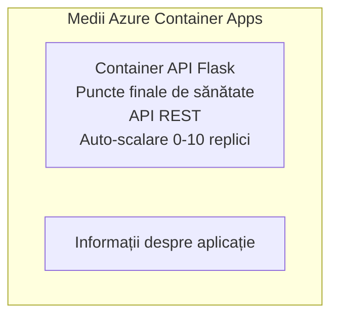

# Exemplu API Flask simplu - Aplicație Container

**Cale de învățare:** Începător ⭐ | **Timp:** 25-35 minute | **Cost:** 0-15$/lună

Un API REST Python Flask complet și funcțional, implementat pe Azure Container Apps folosind Azure Developer CLI (azd). Acest exemplu demonstrează implementarea containerului, scalarea automată și elementele de bază pentru monitorizare.

## 🎯 Ce vei învăța

- Cum să implementezi o aplicație Python containerizată pe Azure  
- Configurarea scalării automate cu scale-to-zero  
- Implementarea probelor de sănătate și a verificărilor de pregătire  
- Monitorizarea jurnalelor și metricilor aplicației  
- Utilizarea Azure Developer CLI pentru implementare rapidă  

## 📦 Ce este inclus

✅ **Aplicație Flask** - API REST complet cu operațiuni CRUD (`src/app.py`)  
✅ **Dockerfile** - Configurare container gata pentru producție  
✅ **Infrastructură Bicep** - Mediu Container Apps și implementarea API-ului  
✅ **Configurare AZD** - Setare implementare cu o singură comandă  
✅ **Probe de sănătate** - Verificări liveness și readiness configurate  
✅ **Scalare automată** - 0-10 replici bazate pe trafic HTTP  

## Arhitectură



## Cerințe Prealabile

### Necesare
- **Azure Developer CLI (azd)** - [Ghid de instalare](https://learn.microsoft.com/azure/developer/azure-developer-cli/install-azd)  
- **Abonament Azure** - [Cont gratuit](https://azure.microsoft.com/free/)  
- **Docker Desktop** - [Instalează Docker](https://www.docker.com/products/docker-desktop/) (pentru testare locală)  

### Verifică cerințele

```bash
# Verifică versiunea azd (este nevoie de 1.5.0 sau mai mare)
azd version

# Verifică autentificarea Azure
azd auth login

# Verifică Docker (opțional, pentru testări locale)
docker --version
```

## ⏱️ Cronologia implementării

| Fază | Durată | Ce se întâmplă |
|-------|----------|--------------||
| Configurare mediu | 30 secunde | Creare mediu azd |
| Construire container | 2-3 minute | Construire Docker aplicație Flask |
| Provisionare infrastructură | 3-5 minute | Creare Container Apps, registry, monitorizare |
| Implementare aplicație | 2-3 minute | Push imagine și implementare pe Container Apps |
| **Total** | **8-12 minute** | Implementare completă gata de utilizare |

## Pornire rapidă

```bash
# Navigați la exemplu
cd examples/container-app/simple-flask-api

# Inițializează mediul (alege un nume unic)
azd env new myflaskapi

# Deplasează totul (infrastructură + aplicație)
azd up
# Veți fi solicitat să:
# 1. Selectați abonamentul Azure
# 2. Alegeți locația (ex., eastus2)
# 3. Așteptați 8-12 minute pentru implementare

# Obțineți punctul final API
azd env get-values

# Testați API-ul
curl $(azd env get-value API_ENDPOINT)/health
```

**Output așteptat:**  
```json
{
  "status": "healthy",
  "timestamp": "2025-11-19T10:30:00Z",
  "service": "simple-flask-api",
  "version": "1.0.0"
}
```

## ✅ Verifică implementarea

### Pasul 1: Verifică statusul implementării

```bash
# Vizualizează serviciile implementate
azd show

# Ieșirea așteptată arată:
# - Serviciu: api
# - Endpoint: https://ca-api-[env].xxx.azurecontainerapps.io
# - Stare: În funcțiune
```

### Pasul 2: Testează endpoint-urile API

```bash
# Obține endpoint-ul API
API_URL=$(azd env get-value API_ENDPOINT)

# Testează sănătatea
curl $API_URL/health

# Testează endpoint-ul rădăcină
curl $API_URL/

# Creează un element
curl -X POST $API_URL/api/items \
  -H "Content-Type: application/json" \
  -d '{"name": "Test Item", "description": "My first item"}'

# Obține toate elementele
curl $API_URL/api/items
```

**Criterii de succes:**  
- ✅ Endpoint de sănătate returnează HTTP 200  
- ✅ Endpoint-ul root afișează informații despre API  
- ✅ POST creează un element și returnează HTTP 201  
- ✅ GET returnează elementele create  

### Pasul 3: Vezi jurnalele

```bash
# Flux de jurnale live folosind azd monitor
azd monitor --logs

# Sau folosește Azure CLI:
az containerapp logs show --name api --resource-group $RG_NAME --follow

# Ar trebui să vezi:
# - Mesaje de pornire Gunicorn
# - Jurnale de cereri HTTP
# - Jurnale de informații despre aplicație
```

## Structura proiectului

```
simple-flask-api/
├── azure.yaml              # AZD configuration
├── infra/
│   ├── main.bicep         # Main infrastructure
│   ├── main.parameters.json
│   └── app/
│       ├── container-env.bicep
│       └── api.bicep
└── src/
    ├── app.py             # Flask application
    ├── requirements.txt
    └── Dockerfile
```

## Endpoint-uri API

| Endpoint | Metodă | Descriere |
|----------|--------|-------------|
| `/health` | GET | Verificare sănătate |
| `/api/items` | GET | Listează toate elementele |
| `/api/items` | POST | Creează un element nou |
| `/api/items/{id}` | GET | Obține element specific |
| `/api/items/{id}` | PUT | Actualizează elementul |
| `/api/items/{id}` | DELETE | Șterge elementul |

## Configurare

### Variabile de mediu

```bash
# Setează configurația personalizată
azd env set PORT 8000
azd env set LOG_LEVEL info
azd env set MAX_REPLICAS 20
```

### Configurarea scalării

API-ul se scalează automat bazat pe traficul HTTP:  
- **Replici minime**: 0 (scalează la zero când este inactiv)  
- **Replici maxime**: 10  
- **Cereri concurente pe replică:** 50  

## Dezvoltare

### Rulează local

```bash
# Instalează dependențele
cd src
pip install -r requirements.txt

# Rulează aplicația
python app.py

# Testează local
curl http://localhost:8000/health
```

### Construiește și testează containerul

```bash
# Construiește imaginea Docker
docker build -t flask-api:local ./src

# Rulează containerul local
docker run -p 8000:8000 flask-api:local

# Testează containerul
curl http://localhost:8000/health
```

## Implementare

### Implementare completă

```bash
# Implementați infrastructura și aplicația
azd up
```

### Implementare doar cod

```bash
# Distribuie doar codul aplicației (infrastructura neschimbată)
azd deploy api
```

### Actualizează configurația

```bash
# Actualizează variabilele de mediu
azd env set API_KEY "new-api-key"

# Redeploy cu configurație nouă
azd deploy api
```

## Monitorizare

### Vezi jurnalele

```bash
# Transmite în direct jurnalele folosind azd monitor
azd monitor --logs

# Sau folosește Azure CLI pentru Container Apps:
az containerapp logs show --name api --resource-group $RG_NAME --follow

# Vizualizează ultimele 100 de linii
az containerapp logs show --name api --resource-group $RG_NAME --tail 100
```

### Monitorizează metricile

```bash
# Deschideți panoul de control Azure Monitor
azd monitor --overview

# Vizualizați metrici specifice
az monitor metrics list \
  --resource $(azd show --output json | jq -r '.services.api.resourceId') \
  --metric "Requests,ResponseTime"
```

## Testare

### Verificare sănătate

```bash
curl $(azd show --output json | jq -r '.services.api.endpoint')/health
```

Răspuns așteptat:  
```json
{
  "status": "healthy",
  "timestamp": "2025-11-19T10:30:00Z"
}
```

### Creează element

```bash
curl -X POST $(azd show --output json | jq -r '.services.api.endpoint')/api/items \
  -H "Content-Type: application/json" \
  -d '{"name": "Test Item", "description": "A test item"}'
```

### Obține toate elementele

```bash
curl $(azd show --output json | jq -r '.services.api.endpoint')/api/items
```

## Optimizarea costurilor

Această implementare folosește scale-to-zero, așadar plătești doar când API-ul procesează cereri:  

- **Cost în repaus**: ~0$/lună (scalează la zero)  
- **Cost activ**: ~0.000024$/secundă per replică  
- **Cost lunar estimat** (utilizare ușoară): 5-15$  

### Reducerea costurilor suplimentar

```bash
# Reduce maximul replicilor pentru dezvoltare
azd env set MAX_REPLICAS 3

# Folosește un timp de inactivitate mai scurt
azd env set SCALE_TO_ZERO_TIMEOUT 300  # 5 minute
```

## Depanare

### Containerul nu pornește

```bash
# Verifică jurnalele containerului folosind Azure CLI
az containerapp logs show --name api --resource-group $RG_NAME --tail 100

# Verifică local construirea imaginilor Docker
docker build -t test ./src
```

### API-ul nu este accesibil

```bash
# Verificați dacă ingress este extern
az containerapp show --name api --resource-group rg-simple-flask-api \
  --query properties.configuration.ingress.external
```

### Timp de răspuns crescut

```bash
# Verificați utilizarea CPU/Memoriei
az monitor metrics list \
  --resource $(azd show --output json | jq -r '.services.api.resourceId') \
  --metric "CPUPercentage,MemoryPercentage"

# Creșteți resursele dacă este necesar
az containerapp update --name api --resource-group rg-simple-flask-api \
  --cpu 1.0 --memory 2Gi
```

## Curățare

```bash
# Șterge toate resursele
azd down --force --purge
```

## Pași următori

### Extinde acest exemplu

1. **Adaugă Bază de date** - Integrează Azure Cosmos DB sau SQL Database  
   ```bash
   # Adaugă modulul Cosmos DB la infra/main.bicep
   # Actualizează app.py cu conexiunea la baza de date
   ```

2. **Adaugă autentificare** - Implementează Microsoft Entra ID sau chei API  
   ```python
   # Adaugă middleware pentru autentificare în app.py
   from functools import wraps
   ```

3. **Configurează CI/CD** - Workflow GitHub Actions  
   ```yaml
   # Create .github/workflows/deploy.yml
   name: Deploy to Azure
   on: [push]
   ```

4. **Adaugă Identitate Gestionată** - Acces securizat la servicii Azure  
   ```bicep
   # Update infra/app/api.bicep
   identity: { type: 'SystemAssigned' }
   ```

### Exemple similare

- **[Database App](../../../../../examples/database-app)** - Exemplu complet cu SQL Database  
- **[Microservices](../../../../../examples/container-app/microservices)** - Arhitectură multi-serviciu  
- **[Container Apps Master Guide](../README.md)** - Toate pattern-urile pentru containere  

### Resurse de învățare

- 📚 [Curs AZD pentru începători](../../../README.md) - Pagina principală curs  
- 📚 [Pattern-uri Container Apps](../README.md) - Mai multe pattern-uri de implementare  
- 📚 [Galeria de template-uri AZD](https://azure.github.io/awesome-azd/) - Template-uri comunitare  

## Resurse suplimentare

### Documentație  
- **[Documentația Flask](https://flask.palletsprojects.com/)** - Ghid Flask framework  
- **[Azure Container Apps](https://learn.microsoft.com/azure/container-apps/)** - Documentație oficială Azure  
- **[Azure Developer CLI](https://learn.microsoft.com/azure/developer/azure-developer-cli/)** - Referință comenzi azd  

### Tutoriale  
- **[Container Apps Quickstart](https://learn.microsoft.com/azure/container-apps/quickstart-portal)** - Implementarea primei aplicații  
- **[Python pe Azure](https://learn.microsoft.com/azure/developer/python/)** - Ghid dezvoltare Python  
- **[Limba Bicep](https://learn.microsoft.com/azure/azure-resource-manager/bicep/)** - Infrastructură ca și cod  

### Unelte  
- **[Azure Portal](https://portal.azure.com)** - Gestionare vizuală a resurselor  
- **[Extensia VS Code Azure](https://marketplace.visualstudio.com/items?itemName=ms-azuretools.vscode-azurecontainerapps)** - Integrare IDE  

---

**🎉 Felicitări!** Ai implementat un API Flask gata pentru producție pe Azure Container Apps cu scalare automată și monitorizare.

**Ai întrebări?** [Deschide un issue](https://github.com/microsoft/AZD-for-beginners/issues) sau consultă [Întrebări frecvente](../../../resources/faq.md)

---

<!-- CO-OP TRANSLATOR DISCLAIMER START -->
**Declinare a responsabilității**:
Acest document a fost tradus folosind serviciul de traducere AI [Co-op Translator](https://github.com/Azure/co-op-translator). În timp ce ne străduim pentru acuratețe, vă rugăm să rețineți că traducerile automate pot conține erori sau inexactități. Documentul original în limba sa nativă trebuie considerat sursa autorizată. Pentru informații critice, se recomandă traducerea profesională realizată de un om. Nu ne asumăm responsabilitatea pentru eventualele neînțelegeri sau interpretări greșite care decurg din utilizarea acestei traduceri.
<!-- CO-OP TRANSLATOR DISCLAIMER END -->