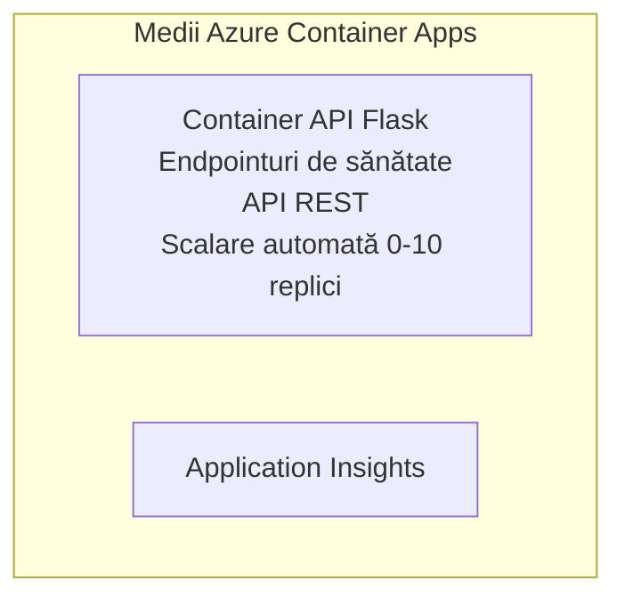

# Exemplu simplu de API Flask - Aplicație Container

**Parcours de învățare:** Începător ⭐ | **Durată:** 25-35 minute | **Cost:** 0-15$/lună

Un API REST Python Flask complet funcțional, implementat în Azure Container Apps folosind Azure Developer CLI (azd). Acest exemplu demonstrează implementarea containerului, auto-scalarea și elementele de bază ale monitorizării.

## 🎯 Ce vei învăța

- Implementarea unei aplicații Python containerizate în Azure  
- Configurarea auto-scalării cu scale-to-zero  
- Implementarea sondajelor de sănătate și a verificărilor de disponibilitate  
- Monitorizarea jurnalelor și a metricilor aplicației  
- Utilizarea Azure Developer CLI pentru implementare rapidă

## 📦 Ce este inclus

✅ **Aplicație Flask** - API REST complet cu operațiuni CRUD (`src/app.py`)  
✅ **Dockerfile** - Configurație container pregătită pentru producție  
✅ **Infrastructură Bicep** - Mediu Container Apps și implementare API  
✅ **Configurație AZD** - Setare implementare cu o singură comandă  
✅ **Sondaje de sănătate** - Verificări de liveness și readiness configurate  
✅ **Auto-scalare** - 0-10 replici în funcție de încărcarea HTTP  

## Arhitectură


## Cerințe preliminare

### Necesare  
- **Azure Developer CLI (azd)** - [Ghid instalare](https://learn.microsoft.com/azure/developer/azure-developer-cli/install-azd)  
- **Abonament Azure** - [Cont gratuit](https://azure.microsoft.com/free/)  
- **Docker Desktop** - [Instalează Docker](https://www.docker.com/products/docker-desktop/) (pentru testare locală)

### Verificarea cerințelor preliminare

```bash
# Verificați versiunea azd (este nevoie de 1.5.0 sau mai nouă)
azd version

# Verificați autentificarea Azure
azd auth login

# Verificați Docker (opțional, pentru testare locală)
docker --version
```

## ⏱️ Cronologia implementării

| Fază | Durată | Ce se întâmplă |
|-------|----------|--------------||
| Configurare mediu | 30 secunde | Creare mediu azd |
| Construire container | 2-3 minute | Docker build aplicație Flask |
| Provo care infrastructură | 3-5 minute | Creare Container Apps, registru, monitorizare |
| Implementare aplicație | 2-3 minute | Push imagine și implementare în Container Apps |
| **Total** | **8-12 minute** | Implementare completă gata |

## Pornire rapidă

```bash
# Navighează la exemplu
cd examples/container-app/simple-flask-api

# Inițializează mediul (alege un nume unic)
azd env new myflaskapi

# Desfășoară totul (infrastructură + aplicație)
azd up
# Vei fi solicitat să:
# 1. Selectezi abonamentul Azure
# 2. Alegi locația (de ex., eastus2)
# 3. Aștepți 8-12 minute pentru desfășurare

# Obține punctul tău final API
azd env get-values

# Testează API-ul
curl $(azd env get-value API_ENDPOINT)/health
```

**Rezultat așteptat:**  
```json
{
  "status": "healthy",
  "timestamp": "2025-11-19T10:30:00Z",
  "service": "simple-flask-api",
  "version": "1.0.0"
}
```

## ✅ Verifică implementarea

### Pasul 1: Verifică starea implementării

```bash
# Vizualizați serviciile implementate
azd show

# Ieșirea așteptată arată:
# - Serviciu: api
# - Endpoint: https://ca-api-[env].xxx.azurecontainerapps.io
# - Stare: În execuție
```

### Pasul 2: Testează endpoint-urile API

```bash
# Obține endpoint-ul API
API_URL=$(azd env get-value API_ENDPOINT)

# Testează starea de sănătate
curl $API_URL/health

# Testează endpoint-ul principal
curl $API_URL/

# Creează un element
curl -X POST $API_URL/api/items \
  -H "Content-Type: application/json" \
  -d '{"name": "Test Item", "description": "My first item"}'

# Obține toate elementele
curl $API_URL/api/items
```

**Criterii de succes:**  
- ✅ Endpoint-ul health returnează HTTP 200  
- ✅ Endpoint-ul root afișează informații despre API  
- ✅ POST creează un element și returnează HTTP 201  
- ✅ GET returnează elementele create

### Pasul 3: Vezi jurnalele

```bash
# Transmite în direct jurnalele folosind azd monitor
azd monitor --logs

# Sau utilizează Azure CLI:
az containerapp logs show --name api --resource-group $RG_NAME --follow

# Ar trebui să vezi:
# - Mesaje de pornire Gunicorn
# - Jurnalele cererilor HTTP
# - Jurnalele de informații ale aplicației
```

## Structura proiectului

```
simple-flask-api/
├── azure.yaml              # AZD configuration
├── infra/
│   ├── main.bicep         # Main infrastructure
│   ├── main.parameters.json
│   └── app/
│       ├── container-env.bicep
│       └── api.bicep
└── src/
    ├── app.py             # Flask application
    ├── requirements.txt
    └── Dockerfile
```

## Endpoint-uri API

| Endpoint | Metodă | Descriere |
|----------|--------|-------------|
| `/health` | GET | Verificare stare sănătate |
| `/api/items` | GET | Listează toate elementele |
| `/api/items` | POST | Creează un element nou |
| `/api/items/{id}` | GET | Obține un element specific |
| `/api/items/{id}` | PUT | Actualizează elementul |
| `/api/items/{id}` | DELETE | Șterge elementul |

## Configurație

### Variabile de mediu

```bash
# Setează configurația personalizată
azd env set PORT 8000
azd env set LOG_LEVEL info
azd env set MAX_REPLICAS 20
```

### Configurație scalare

API-ul scalează automat în funcție de traficul HTTP:  
- **Replici minime**: 0 (scalează la zero când este inactiv)  
- **Replici maxime**: 10  
- **Cereri simultane per replică**: 50  

## Dezvoltare

### Rulează local

```bash
# Instalează dependențele
cd src
pip install -r requirements.txt

# Rulează aplicația
python app.py

# Testează local
curl http://localhost:8000/health
```

### Construiește și testează containerul

```bash
# Construiește imaginea Docker
docker build -t flask-api:local ./src

# Rulează containerul local
docker run -p 8000:8000 flask-api:local

# Testează containerul
curl http://localhost:8000/health
```

## Implementare

### Implementare completă

```bash
# Implementați infrastructura și aplicația
azd up
```

### Implementare doar cod

```bash
# Implementați doar codul aplicației (infrastructura neschimbată)
azd deploy api
```

### Actualizează configurația

```bash
# Actualizează variabilele de mediu
azd env set API_KEY "new-api-key"

# Redeploy cu noua configurație
azd deploy api
```

## Monitorizare

### Vezi jurnalele

```bash
# Transmite în direct jurnalele utilizând azd monitor
azd monitor --logs

# Sau folosește Azure CLI pentru Container Apps:
az containerapp logs show --name api --resource-group $RG_NAME --follow

# Vezi ultimele 100 de linii
az containerapp logs show --name api --resource-group $RG_NAME --tail 100
```

### Monitorizează metricile

```bash
# Deschideți panoul de bord Azure Monitor
azd monitor --overview

# Vizualizați metrici specifice
az monitor metrics list \
  --resource $(azd show --output json | jq -r '.services.api.resourceId') \
  --metric "Requests,ResponseTime"
```

## Testare

### Verificare stare

```bash
curl $(azd show --output json | jq -r '.services.api.endpoint')/health
```

Răspuns așteptat:  
```json
{
  "status": "healthy",
  "timestamp": "2025-11-19T10:30:00Z"
}
```

### Creează element

```bash
curl -X POST $(azd show --output json | jq -r '.services.api.endpoint')/api/items \
  -H "Content-Type: application/json" \
  -d '{"name": "Test Item", "description": "A test item"}'
```

### Obține toate elementele

```bash
curl $(azd show --output json | jq -r '.services.api.endpoint')/api/items
```

## Optimizare costuri

Această implementare folosește scale-to-zero, astfel plătești doar când API-ul procesează cereri:

- **Cost inactiv**: ~0$/lună (scalează la zero)  
- **Cost activ**: ~0.000024$/secundă per replică  
- **Cost lunar estimat** (utilizare redusă): 5-15$

### Reducerea suplimentară a costurilor

```bash
# Reduceți numărul maxim de replici pentru dezvoltare
azd env set MAX_REPLICAS 3

# Folosiți un timp mai scurt de inactivitate
azd env set SCALE_TO_ZERO_TIMEOUT 300  # 5 minute
```

## Depanare

### Containerul nu pornește

```bash
# Verificați jurnalele containerului folosind Azure CLI
az containerapp logs show --name api --resource-group $RG_NAME --tail 100

# Verificați construirea imaginilor Docker local
docker build -t test ./src
```

### API nu este accesibil

```bash
# Verifică dacă intrarea este externă
az containerapp show --name api --resource-group rg-simple-flask-api \
  --query properties.configuration.ingress.external
```

### Timpuri mari de răspuns

```bash
# Verifică utilizarea CPU/Memorie
az monitor metrics list \
  --resource $(azd show --output json | jq -r '.services.api.resourceId') \
  --metric "CPUPercentage,MemoryPercentage"

# Mărește resursele dacă este nevoie
az containerapp update --name api --resource-group rg-simple-flask-api \
  --cpu 1.0 --memory 2Gi
```

## Curățare

```bash
# Șterge toate resursele
azd down --force --purge
```

## Pașii următori

### Extinde acest exemplu

1. **Adaugă bază de date** - Integrează Azure Cosmos DB sau SQL Database  
   ```bash
   # Adaugă modulul Cosmos DB în infra/main.bicep
   # Actualizează app.py cu conexiunea la baza de date
   ```

2. **Adaugă autentificare** - Implementează Azure AD sau chei API  
   ```python
   # Adaugă middleware de autentificare în app.py
   from functools import wraps
   ```

3. **Configurează CI/CD** - Workflow GitHub Actions  
   ```yaml
   # Create .github/workflows/deploy.yml
   name: Deploy to Azure
   on: [push]
   ```

4. **Adaugă identitate gestionată** - Acces securizat la serviciile Azure  
   ```bicep
   # Update infra/app/api.bicep
   identity: { type: 'SystemAssigned' }
   ```

### Exemple conexe

- **[Aplicație Bază de Date](../../../../../examples/database-app)** - Exemplu complet cu SQL Database  
- **[Microservicii](../../../../../examples/container-app/microservices)** - Arhitectură multi-serviciu  
- **[Ghid complet Container Apps](../README.md)** - Toate tiparele de containere

### Resurse de învățare

- 📚 [Curs AZD pentru începători](../../../README.md) - Pagina principală curs  
- 📚 [Tipare Container Apps](../README.md) - Mai multe tipare de implementare  
- 📚 [Galerie șabloane AZD](https://azure.github.io/awesome-azd/) - Șabloane comunitare

## Resurse suplimentare

### Documentație  
- **[Documentație Flask](https://flask.palletsprojects.com/)** - Ghid framework Flask  
- **[Azure Container Apps](https://learn.microsoft.com/azure/container-apps/)** - Documentație oficială Azure  
- **[Azure Developer CLI](https://learn.microsoft.com/azure/developer/azure-developer-cli/)** - Referință comenzi azd

### Tutoriale  
- **[Primii pași Container Apps](https://learn.microsoft.com/azure/container-apps/quickstart-portal)** - Primele implementări  
- **[Python pe Azure](https://learn.microsoft.com/azure/developer/python/)** - Ghid dezvoltare Python  
- **[Limbaj Bicep](https://learn.microsoft.com/azure/azure-resource-manager/bicep/)** - Infrastructură ca cod

### Unelte  
- **[Portal Azure](https://portal.azure.com)** - Gestionare resurse vizuală  
- **[Extensie VS Code Azure](https://marketplace.visualstudio.com/items?itemName=ms-azuretools.vscode-azurecontainerapps)** - Integrare IDE

---

**🎉 Felicitări!** Ai implementat un API Flask pregătit pentru producție în Azure Container Apps cu auto-scalare și monitorizare.

**Întrebări?** [Deschide un tichet](https://github.com/microsoft/AZD-for-beginners/issues) sau consultă [FAQ](../../../resources/faq.md)

---

<!-- CO-OP TRANSLATOR DISCLAIMER START -->
**Declinare a responsabilității**:  
Acest document a fost tradus folosind serviciul de traducere AI [Co-op Translator](https://github.com/Azure/co-op-translator). Deși ne străduim pentru acuratețe, vă rugăm să fiți conștienți că traducerile automate pot conține erori sau inexactități. Documentul original în limba sa nativă trebuie considerat sursa autoritară. Pentru informații critice, se recomandă traducerea profesională realizată de un om. Nu ne asumăm răspunderea pentru orice neînțelegeri sau interpretări greșite ce decurg din utilizarea acestei traduceri.
<!-- CO-OP TRANSLATOR DISCLAIMER END -->