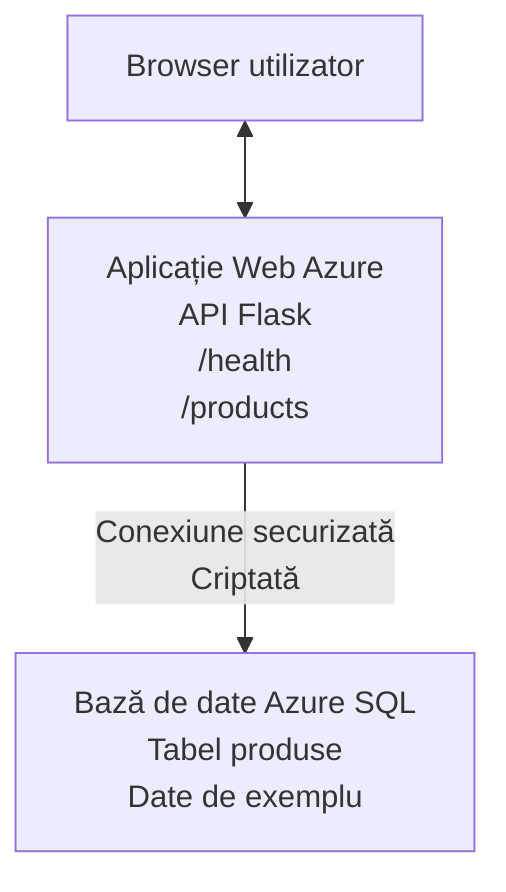

# Deploying a Microsoft SQL Database and Web App with AZD

⏱️ **Estimated Time**: 20-30 minutes | 💰 **Estimated Cost**: ~$15-25/month | ⭐ **Complexity**: Intermediate

This **complete, working example** demonstrates how to use the [Azure Developer CLI (azd)](https://learn.microsoft.com/azure/developer/azure-developer-cli/) to deploy a Python Flask web application with a Microsoft SQL Database to Azure. All code is included and tested—no external dependencies required.

## What You'll Learn

By completing this example, you will:
- Deploy a multi-tier application (web app + database) using infrastructure-as-code
- Configure secure database connections without hardcoding secrets
- Monitor application health with Application Insights
- Manage Azure resources efficiently with AZD CLI
- Follow Azure best practices for security, cost optimization, and observability

## Scenario Overview
- **Web App**: Python Flask REST API with database connectivity
- **Database**: Azure SQL Database with sample data
- **Infrastructure**: Provisioned using Bicep (modular, reusable templates)
- **Deployment**: Fully automated with `azd` commands
- **Monitoring**: Application Insights for logs and telemetry

## Prerequisites

### Required Tools

Before starting, verify you have these tools installed:

1. **[Azure CLI](https://learn.microsoft.com/cli/azure/install-azure-cli)** (version 2.50.0 or higher)
   ```sh
   az --version
   # Rezultatul așteptat: azure-cli 2.50.0 sau mai recent
   ```

2. **[Azure Developer CLI (azd)](https://learn.microsoft.com/azure/developer/azure-developer-cli/install-azd)** (version 1.0.0 or higher)
   ```sh
   azd version
   # Ieșire așteptată: azd versiunea 1.0.0 sau mai mare
   ```

3. **[Python 3.8+](https://www.python.org/downloads/)** (for local development)
   ```sh
   python --version
   # Rezultatul așteptat: Python 3.8 sau o versiune mai recentă
   ```

4. **[Docker](https://www.docker.com/get-started)** (optional, for local containerized development)
   ```sh
   docker --version
   # Ieșire așteptată: versiunea Docker 20.10 sau mai nouă
   ```

### Azure Requirements

- An active **Azure subscription** ([create a free account](https://azure.microsoft.com/free/))
- Permissions to create resources in your subscription
- **Owner** or **Contributor** role on the subscription or resource group

### Knowledge Prerequisites

This is an **intermediate-level** example. You should be familiar with:
- Basic command-line operations
- Fundamental cloud concepts (resources, resource groups)
- Basic understanding of web applications and databases

**New to AZD?** Start with the [Getting Started guide](../../docs/chapter-01-foundation/azd-basics.md) first.

## Architecture

This example deploys a two-tier architecture with a web application and SQL database:


**Resource Deployment:**
- **Resource Group**: Container for all resources
- **App Service Plan**: Linux-based hosting (B1 tier for cost efficiency)
- **Web App**: Python 3.11 runtime with Flask application
- **SQL Server**: Managed database server with TLS 1.2 minimum
- **SQL Database**: Basic tier (2GB, suitable for development/testing)
- **Application Insights**: Monitoring and logging
- **Log Analytics Workspace**: Centralized log storage

**Analogy**: Think of this like a restaurant (web app) with a walk-in freezer (database). Customers order from the menu (API endpoints), and the kitchen (Flask app) retrieves ingredients (data) from the freezer. The restaurant manager (Application Insights) tracks everything that happens.

## Folder Structure

All files are included in this example—no external dependencies required:

```
examples/database-app/
│
├── README.md                    # This file
├── azure.yaml                   # AZD configuration file
├── .env.sample                  # Sample environment variables
├── .gitignore                   # Git ignore patterns
│
├── infra/                       # Infrastructure as Code (Bicep)
│   ├── main.bicep              # Main orchestration template
│   ├── abbreviations.json      # Azure naming conventions
│   └── resources/              # Modular resource templates
│       ├── sql-server.bicep    # SQL Server configuration
│       ├── sql-database.bicep  # Database configuration
│       ├── app-service-plan.bicep  # Hosting plan
│       ├── app-insights.bicep  # Monitoring setup
│       └── web-app.bicep       # Web application
│
└── src/
    └── web/                    # Application source code
        ├── app.py              # Flask REST API
        ├── requirements.txt    # Python dependencies
        └── Dockerfile          # Container definition
```

**What Each File Does:**
- **azure.yaml**: Tells AZD what to deploy and where
- **infra/main.bicep**: Orchestrates all Azure resources
- **infra/resources/*.bicep**: Individual resource definitions (modular for reuse)
- **src/web/app.py**: Flask application with database logic
- **requirements.txt**: Python package dependencies
- **Dockerfile**: Containerization instructions for deployment

## Quickstart (Step-by-Step)

### Step 1: Clone and Navigate

```sh
git clone https://github.com/microsoft/AZD-for-beginners.git
cd AZD-for-beginners/examples/database-app
```

**✓ Success Check**: Verify you see `azure.yaml` and `infra/` folder:
```sh
ls
# Se așteaptă: README.md, azure.yaml, infra/, src/
```

### Step 2: Authenticate with Azure

```sh
azd auth login
```

This opens your browser for Azure authentication. Sign in with your Azure credentials.

**✓ Success Check**: You should see:
```
Logged in to Azure.
```

### Step 3: Initialize the Environment

```sh
azd init
```

**What happens**: AZD creates a local configuration for your deployment.

**Prompts you'll see**:
- **Environment name**: Enter a short name (e.g., `dev`, `myapp`)
- **Azure subscription**: Select your subscription from the list
- **Azure location**: Choose a region (e.g., `eastus`, `westeurope`)

**✓ Success Check**: You should see:
```
SUCCESS: New project initialized!
```

### Step 4: Provision Azure Resources

```sh
azd provision
```

**What happens**: AZD deploys all infrastructure (takes 5-8 minutes):
1. Creates resource group
2. Creates SQL Server and Database
3. Creates App Service Plan
4. Creates Web App
5. Creates Application Insights
6. Configures networking and security

**You'll be prompted for**:
- **SQL admin username**: Enter a username (e.g., `sqladmin`)
- **SQL admin password**: Enter a strong password (save this!)

**✓ Success Check**: You should see:
```
SUCCESS: Your application was provisioned in Azure in X minutes Y seconds.
You can view the resources created under the resource group rg-<env-name> in Azure Portal:
https://portal.azure.com/#@/resource/subscriptions/.../resourceGroups/rg-<env-name>
```

**⏱️ Time**: 5-8 minutes

### Step 5: Deploy the Application

```sh
azd deploy
```

**What happens**: AZD builds and deploys your Flask application:
1. Packages the Python application
2. Builds the Docker container
3. Pushes to Azure Web App
4. Initializes the database with sample data
5. Starts the application

**✓ Success Check**: You should see:
```
SUCCESS: Your application was deployed to Azure in X minutes Y seconds.
You can view the resources created under the resource group rg-<env-name> in Azure Portal:
https://portal.azure.com/#@/resource/subscriptions/.../resourceGroups/rg-<env-name>
```

**⏱️ Time**: 3-5 minutes

### Step 6: Browse the Application

```sh
azd browse
```

This opens your deployed web app in the browser at `https://app-<unique-id>.azurewebsites.net`

**✓ Success Check**: You should see JSON output:
```json
{
  "message": "Welcome to the Database App API",
  "endpoints": {
    "/": "This help message",
    "/health": "Health check endpoint",
    "/products": "List all products",
    "/products/<id>": "Get product by ID"
  }
}
```

### Step 7: Test the API Endpoints

**Health Check** (verify database connection):
```sh
curl https://app-<your-id>.azurewebsites.net/health
```

**Expected Response**:
```json
{
  "status": "healthy",
  "database": "connected"
}
```

**List Products** (sample data):
```sh
curl https://app-<your-id>.azurewebsites.net/products
```

**Expected Response**:
```json
[
  {
    "id": 1,
    "name": "Laptop",
    "description": "High-performance laptop",
    "price": 1299.99,
    "created_at": "2025-11-19T10:30:00"
  },
  ...
]
```

**Get Single Product**:
```sh
curl https://app-<your-id>.azurewebsites.net/products/1
```

**✓ Success Check**: All endpoints return JSON data without errors.

---

**🎉 Congratulations!** You've successfully deployed a web application with a database to Azure using AZD.

## Configuration Deep-Dive

### Environment Variables

Secrets are managed securely via Azure App Service configuration—**never hardcoded in source code**.

**Configured Automatically by AZD**:
- `SQL_CONNECTION_STRING`: Database connection with encrypted credentials
- `APPLICATIONINSIGHTS_CONNECTION_STRING`: Monitoring telemetry endpoint
- `SCM_DO_BUILD_DURING_DEPLOYMENT`: Enables automatic dependency installation

**Where Secrets Are Stored**:
1. During `azd provision`, you provide SQL credentials via secure prompts
2. AZD stores these in your local `.azure/<env-name>/.env` file (git-ignored)
3. AZD injects them into Azure App Service configuration (encrypted at rest)
4. Application reads them via `os.getenv()` at runtime

### Local Development

For local testing, create a `.env` file from the sample:

```sh
cp .env.sample .env
# Editează .env cu conexiunea ta la baza de date locală
```

**Local Development Workflow**:
```sh
# Instalează dependențele
cd src/web
pip install -r requirements.txt

# Configurează variabilele de mediu
export SQL_CONNECTION_STRING="your-local-connection-string"

# Rulează aplicația
python app.py
```

**Test locally**:
```sh
curl http://localhost:8000/health
# Așteptat: {"status": "sănătos", "database": "conectată"}
```

### Infrastructure as Code

All Azure resources are defined in **Bicep templates** (`infra/` folder):

- **Modular Design**: Each resource type has its own file for reusability
- **Parameterized**: Customize SKUs, regions, naming conventions
- **Best Practices**: Follows Azure naming standards and security defaults
- **Version Controlled**: Infrastructure changes are tracked in Git

**Customization Example**:
To change the database tier, edit `infra/resources/sql-database.bicep`:
```bicep
sku: {
  name: 'Standard'  // Changed from 'Basic'
  tier: 'Standard'
  capacity: 10
}
```

## Security Best Practices

This example follows Azure security best practices:

### 1. **No Secrets in Source Code**
- ✅ Credentials stored in Azure App Service configuration (encrypted)
- ✅ `.env` files excluded from Git via `.gitignore`
- ✅ Secrets passed via secure parameters during provisioning

### 2. **Encrypted Connections**
- ✅ TLS 1.2 minimum for SQL Server
- ✅ HTTPS-only enforced for Web App
- ✅ Database connections use encrypted channels

### 3. **Network Security**
- ✅ SQL Server firewall configured to allow Azure services only
- ✅ Public network access restricted (can be further locked down with Private Endpoints)
- ✅ FTPS disabled on Web App

### 4. **Authentication & Authorization**
- ⚠️ **Current**: SQL authentication (username/password)
- ✅ **Production Recommendation**: Use Azure Managed Identity for passwordless authentication

**To Upgrade to Managed Identity** (for production):
1. Enable managed identity on Web App
2. Grant identity SQL permissions
3. Update connection string to use managed identity
4. Remove password-based authentication

### 5. **Auditing & Compliance**
- ✅ Application Insights logs all requests and errors
- ✅ SQL Database auditing enabled (can be configured for compliance)
- ✅ All resources tagged for governance

**Security Checklist Before Production**:
- [ ] Enable Azure Defender for SQL
- [ ] Configure Private Endpoints for SQL Database
- [ ] Enable Web Application Firewall (WAF)
- [ ] Implement Azure Key Vault for secret rotation
- [ ] Configure Azure AD authentication
- [ ] Enable diagnostic logging for all resources

## Cost Optimization

**Estimated Monthly Costs** (as of November 2025):

| Resource | SKU/Tier | Estimated Cost |
|----------|----------|----------------|
| App Service Plan | B1 (Basic) | ~$13/month |
| SQL Database | Basic (2GB) | ~$5/month |
| Application Insights | Pay-as-you-go | ~$2/month (low traffic) |
| **Total** | | **~$20/month** |

**💡 Cost-Saving Tips**:

1. **Use Free Tier for Learning**:
   - App Service: F1 tier (free, limited hours)
   - SQL Database: Use Azure SQL Database serverless
   - Application Insights: 5GB/month free ingestion

2. **Stop Resources When Not in Use**:
   ```sh
   # Oprește aplicația web (baza de date continuă să fie facturată)
   az webapp stop --name <app-name> --resource-group <rg-name>
   
   # Repornește când este necesar
   az webapp start --name <app-name> --resource-group <rg-name>
   ```

3. **Delete Everything After Testing**:
   ```sh
   azd down
   ```
   This removes ALL resources and stops charges.

4. **Development vs. Production SKUs**:
   - **Development**: Basic tier (used in this example)
   - **Production**: Standard/Premium tier with redundancy

**Cost Monitoring**:
- View costs in [Azure Cost Management](https://portal.azure.com/#view/Microsoft_Azure_CostManagement)
- Set up cost alerts to avoid surprises
- Tag all resources with `azd-env-name` for tracking

**Free Tier Alternative**:
For learning purposes, you can modify `infra/resources/app-service-plan.bicep`:
```bicep
sku: {
  name: 'F1'  // Free tier
  tier: 'Free'
}
```
**Notă**: Free tier has limitations (60 min/day CPU, no always-on).

## Monitoring & Observability

### Application Insights Integration

This example includes **Application Insights** for comprehensive monitoring:

**What's Monitored**:
- ✅ HTTP requests (latency, status codes, endpoints)
- ✅ Application errors and exceptions
- ✅ Custom logging from Flask app
- ✅ Database connection health
- ✅ Performance metrics (CPU, memory)

**Access Application Insights**:
1. Open [Azure Portal](https://portal.azure.com)
2. Navigate to your resource group (`rg-<env-name>`)
3. Click on Application Insights resource (`appi-<unique-id>`)

**Useful Queries** (Application Insights → Logs):

**View All Requests**:
```kusto
requests
| where timestamp > ago(1h)
| order by timestamp desc
| project timestamp, name, url, resultCode, duration
```

**Find Errors**:
```kusto
exceptions
| where timestamp > ago(24h)
| order by timestamp desc
| project timestamp, type, outerMessage, operation_Name
```

**Check Health Endpoint**:
```kusto
requests
| where name contains "health"
| summarize count() by resultCode, bin(timestamp, 1h)
```

### SQL Database Auditing

**SQL Database auditing is enabled** to track:
- Database access patterns
- Failed login attempts
- Schema changes
- Data access (for compliance)

**Access Audit Logs**:
1. Azure Portal → SQL Database → Auditing
2. View logs in Log Analytics workspace

### Real-Time Monitoring

**View Live Metrics**:
1. Application Insights → Live Metrics
2. See requests, failures, and performance in real-time

**Set Up Alerts**:
Create alerts for critical events:
- HTTP 500 errors > 5 in 5 minutes
- Database connection failures
- High response times (>2 seconds)

**Example Alert Creation**:
```sh
az monitor metrics alert create \
  --name "High-Response-Time" \
  --resource-group <rg-name> \
  --scopes <app-insights-resource-id> \
  --condition "avg requests/duration > 2000" \
  --description "Alert when response time exceeds 2 seconds"
```

## Troubleshooting
### Probleme comune și soluții

#### 1. `azd provision` eșuează cu "Locație indisponibilă"

**Simptom**:
```
Error: The subscription is not registered for the resource type 'components' in the location 'centralus'.
```

**Soluție**:
Alegeți o regiune Azure diferită sau înregistrați furnizorul de resurse:
```sh
az provider register --namespace Microsoft.Insights
```

#### 2. Conexiunea SQL eșuează în timpul implementării

**Simptom**:
```
pyodbc.OperationalError: ('08001', '[08001] [Microsoft][ODBC Driver 18 for SQL Server]TCP Provider...')
```

**Soluție**:
- Verificați dacă firewall-ul serverului SQL permite serviciilor Azure (configurat automat)
- Verificați dacă parola administratorului SQL a fost introdusă corect în timpul `azd provision`
- Asigurați-vă că SQL Server este complet provisionat (poate dura 2-3 minute)

**Verificați conexiunea**:
```sh
# Din portalul Azure, navigați la SQL Database → Editor interogări
# Încercați să vă conectați cu datele de autentificare.
```

#### 3. Aplicația web afișează "Eroare aplicație"

**Simptom**:
Browserul afișează o pagină de eroare generică.

**Soluție**:
Verificați jurnalele aplicației:
```sh
# Vizualizați jurnalele recente
az webapp log tail --name <app-name> --resource-group <rg-name>
```

**Cauze comune**:
- Variabile de mediu lipsă (verificați App Service → Configurare)
- Instalarea pachetelor Python a eșuat (verificați jurnalele de implementare)
- Eroare la inițializarea bazei de date (verificați conectivitatea SQL)

#### 4. `azd deploy` eșuează cu "Eroare de compilare"

**Simptom**:
```
Error: Failed to build project
```

**Soluție**:
- Asigurați-vă că `requirements.txt` nu conține erori de sintaxă
- Verificați că Python 3.11 este specificat în `infra/resources/web-app.bicep`
- Verificați că Dockerfile are imaginea de bază corectă

**Depanați local**:
```sh
cd src/web
docker build -t test-app .
docker run -p 8000:8000 test-app
```

#### 5. "Unauthorized" When Running AZD Commands

**Simptom**:
```
ERROR: (Unauthorized) The client '<id>' with object id '<id>' does not have authorization
```

**Soluție**:
Reautentificați-vă cu Azure:
```sh
# Necesar pentru fluxurile de lucru AZD
azd auth login

# Opțional dacă utilizați și comenzile Azure CLI direct
az login
```

Verificați că aveți permisiunile corecte (rol Contributor) pe abonament.

#### 6. Costuri mari pentru baza de date

**Simptom**:
Factură Azure neașteptată.

**Soluție**:
- Verificați dacă ați uitat să rulați `azd down` după testare
- Verificați că SQL Database folosește nivelul Basic (nu Premium)
- Revizuiți costurile în Azure Cost Management
- Configurați alerte de cost

### Obținerea ajutorului

**Vizualizați toate variabilele de mediu AZD**:
```sh
azd env get-values
```

**Verificați starea implementării**:
```sh
az webapp show --name <app-name> --resource-group <rg-name> --query state
```

**Accesați jurnalele aplicației**:
```sh
az webapp log download --name <app-name> --resource-group <rg-name> --log-file app-logs.zip
```

**Aveți nevoie de mai mult ajutor?**
- [Ghid de depanare AZD](../../docs/chapter-07-troubleshooting/common-issues.md)
- [Depanare Azure App Service](https://learn.microsoft.com/azure/app-service/troubleshoot-diagnostic-logs)
- [Depanare Azure SQL](https://learn.microsoft.com/azure/azure-sql/database/troubleshoot-common-errors-issues)

## Exerciții practice

### Exercițiul 1: Verificați implementarea (Începător)

**Obiectiv**: Confirmați că toate resursele sunt implementate și aplicația funcționează.

**Pași**:
1. Listați toate resursele din grupul dvs. de resurse:
   ```sh
   az resource list --resource-group rg-<env-name> --output table
   ```
   **Așteptat**: 6-7 resurse (Web App, SQL Server, SQL Database, App Service Plan, Application Insights, Log Analytics)

2. Testați toate endpoint-urile API:
   ```sh
   curl https://app-<your-id>.azurewebsites.net/
   curl https://app-<your-id>.azurewebsites.net/health
   curl https://app-<your-id>.azurewebsites.net/products
   curl https://app-<your-id>.azurewebsites.net/products/1
   ```
   **Așteptat**: Toate returnează JSON valid fără erori

3. Verificați Application Insights:
   - Navigați la Application Insights în Azure Portal
   - Mergeți la "Live Metrics"
   - Reîmprospătați browserul pe aplicația web
   **Așteptat**: Veți vedea cereri care apar în timp real

**Criterii de succes**: Toate cele 6-7 resurse există, toate endpoint-urile returnează date, Live Metrics arată activitate.

---

### Exercițiul 2: Adăugați un nou endpoint API (Intermediar)

**Obiectiv**: Extindeți aplicația Flask cu un nou endpoint.

**Cod de pornire**: Endpoint-urile curente în `src/web/app.py`

**Pași**:
1. Editați `src/web/app.py` și adăugați un nou endpoint după funcția `get_product()`:
   ```python
   @app.route('/products/search/<keyword>')
   def search_products(keyword):
       """Search products by name or description."""
       try:
           conn = get_db_connection()
           cursor = conn.cursor()
           cursor.execute(
               "SELECT id, name, description, price, created_at FROM products WHERE name LIKE ? OR description LIKE ?",
               (f'%{keyword}%', f'%{keyword}%')
           )
           
           products = []
           for row in cursor.fetchall():
               products.append({
                   'id': row[0],
                   'name': row[1],
                   'description': row[2],
                   'price': float(row[3]) if row[3] else None,
                   'created_at': row[4].isoformat() if row[4] else None
               })
           
           cursor.close()
           conn.close()
           
           logger.info(f"Search for '{keyword}' returned {len(products)} results")
           return jsonify(products), 200
           
       except Exception as e:
           logger.error(f"Error searching products: {str(e)}")
           return jsonify({'error': str(e)}), 500
   ```

2. Implementați aplicația actualizată:
   ```sh
   azd deploy
   ```

3. Testați noul endpoint:
   ```sh
   curl https://app-<your-id>.azurewebsites.net/products/search/laptop
   ```
   **Așteptat**: Returnează produse care corespund criteriului "laptop"

**Criterii de succes**: Noul endpoint funcționează, returnează rezultate filtrate, apare în jurnalele Application Insights.

---

### Exercițiul 3: Adăugați monitorizare și alerte (Avansat)

**Obiectiv**: Configurați monitorizare proactivă cu alerte.

**Pași**:
1. Creați o alertă pentru erori HTTP 500:
   ```sh
   # Obține ID-ul resursei Application Insights
   AI_ID=$(az monitor app-insights component show \
     --app appi-<your-id> \
     --resource-group rg-<env-name> \
     --query id -o tsv)
   
   # Creează alertă
   az monitor metrics alert create \
     --name "High-Error-Rate" \
     --resource-group rg-<env-name> \
     --scopes $AI_ID \
     --condition "count requests/failed > 5" \
     --window-size 5m \
     --evaluation-frequency 1m \
     --description "Alert when >5 failed requests in 5 minutes"
   ```

2. Declanșați alerta cauzând erori:
   ```sh
   # Solicitați un produs inexistent
   for i in {1..10}; do curl https://app-<your-id>.azurewebsites.net/products/999; done
   ```

3. Verificați dacă alerta a fost declanșată:
   - Azure Portal → Alerts → Alert Rules
   - Verificați e-mailul (dacă este configurat)

**Criterii de succes**: Regula de alertă este creată, se declanșează la erori, notificările sunt primite.

---

### Exercițiul 4: Modificări ale schemei bazei de date (Avansat)

**Obiectiv**: Adăugați un tabel nou și modificați aplicația pentru a-l folosi.

**Pași**:
1. Conectați-vă la SQL Database prin Query Editor din Azure Portal

2. Creați un nou tabel `categories`:
   ```sql
   CREATE TABLE categories (
       id INT PRIMARY KEY IDENTITY(1,1),
       name NVARCHAR(50) NOT NULL,
       description NVARCHAR(200)
   );
   
   INSERT INTO categories (name, description) VALUES
   ('Electronics', 'Electronic devices and accessories'),
   ('Office Supplies', 'Office equipment and supplies');
   
   -- Add category to products table
   ALTER TABLE products ADD category_id INT;
   UPDATE products SET category_id = 1; -- Set all to Electronics
   ```

3. Actualizați `src/web/app.py` pentru a include informații despre categorie în răspunsuri

4. Implementați și testați

**Criterii de succes**: Noul tabel există, produsele afișează informații despre categorie, aplicația funcționează în continuare.

---

### Exercițiul 5: Implementați caching (Expert)

**Obiectiv**: Adăugați Azure Redis Cache pentru a îmbunătăți performanța.

**Pași**:
1. Adăugați Redis Cache în `infra/main.bicep`
2. Actualizați `src/web/app.py` pentru a face cache la interogările de produse
3. Măsurați îmbunătățirea performanței cu Application Insights
4. Comparați timpii de răspuns înainte/după caching

**Criterii de succes**: Redis este implementat, caching-ul funcționează, timpii de răspuns se îmbunătățesc cu >50%.

**Sfat**: Începeți cu [documentația Azure Cache for Redis](https://learn.microsoft.com/azure/azure-cache-for-redis/).

---

## Curățare

Pentru a evita costuri continue, ștergeți toate resursele când ați terminat:

```sh
azd down
```

**Prompt de confirmare**:
```
? Total resources to delete: 7, are you sure you want to continue? (y/N)
```

Tastați `y` pentru a confirma.

**✓ Verificare de succes**: 
- Toate resursele sunt șterse din Azure Portal
- Nicio taxă în curs
- Folderul local `.azure/<env-name>` poate fi șters

**Alternativă** (păstrați infrastructura, ștergeți datele):
```sh
# Șterge doar grupul de resurse (păstrează configurația AZD)
az group delete --name rg-<env-name> --yes
```
## Aflați mai multe

### Documentație asociată
- [Documentația Azure Developer CLI](https://learn.microsoft.com/azure/developer/azure-developer-cli/)
- [Documentația Azure SQL Database](https://learn.microsoft.com/azure/azure-sql/database/)
- [Documentația Azure App Service](https://learn.microsoft.com/azure/app-service/)
- [Documentația Application Insights](https://learn.microsoft.com/azure/azure-monitor/app/app-insights-overview)
- [Referință limbaj Bicep](https://learn.microsoft.com/azure/azure-resource-manager/bicep/)

### Pașii următori în acest curs
- **[Exemplu Container Apps](../../../../examples/container-app)**: Implementați microservicii cu Azure Container Apps
- **[Ghid de integrare AI](../../../../docs/ai-foundry)**: Adăugați capabilități AI aplicației dvs.
- **[Practici recomandate pentru implementare](../../docs/chapter-04-infrastructure/deployment-guide.md)**: Modele pentru implementare în producție

### Subiecte avansate
- **Identitate gestionată**: Eliminați parolele și folosiți autentificarea Azure AD
- **Endpoints private**: Securizați conexiunile la baza de date în cadrul unei rețele virtuale
- **Integrare CI/CD**: Automatizați implementările cu GitHub Actions sau Azure DevOps
- **Medii multiple**: Configurați medii de dezvoltare, staging și producție
- **Migrații de bază de date**: Utilizați Alembic sau Entity Framework pentru versionarea schemei

### Comparație cu alte abordări

**AZD vs. ARM Templates**:
- ✅ AZD: Abstracție la nivel înalt, comenzi mai simple
- ⚠️ ARM: Mai detaliat, control granular

**AZD vs. Terraform**:
- ✅ AZD: Nativ pentru Azure, integrat cu serviciile Azure
- ⚠️ Terraform: Suport multi-cloud, ecosistem mai mare

**AZD vs. Azure Portal**:
- ✅ AZD: Repetabil, controlat prin versiuni, automatizabil
- ⚠️ Portal: Click-uri manuale, dificil de reprodus

Gândiți-vă la AZD ca la Docker Compose pentru Azure—configurare simplificată pentru implementări complexe.

---

## Întrebări frecvente

**Q: Pot folosi un limbaj de programare diferit?**  
A: Da! Înlocuiți `src/web/` cu Node.js, C#, Go sau orice limbaj. Actualizați `azure.yaml` și Bicep în consecință.

**Q: Cum adaug mai multe baze de date?**  
A: Adăugați un alt modul SQL Database în `infra/main.bicep` sau folosiți PostgreSQL/MySQL din serviciile Azure Database.

**Q: Pot folosi asta în producție?**  
A: Aceasta este un punct de plecare. Pentru producție, adăugați: identitate gestionată, endpoint-uri private, redundanță, strategie de backup, WAF și monitorizare îmbunătățită.

**Q: Ce se întâmplă dacă vreau să folosesc containere în loc de implementare prin cod?**  
A: Consultați [Exemplu Container Apps](../../../../examples/container-app) care folosește containere Docker pe tot parcursul.

**Q: Cum mă conectez la baza de date de pe mașina locală?**  
A: Adăugați IP-ul dvs. în firewall-ul SQL Server:
```sh
az sql server firewall-rule create \
  --resource-group rg-<env-name> \
  --server sql-<unique-id> \
  --name AllowMyIP \
  --start-ip-address <your-ip> \
  --end-ip-address <your-ip>
```

**Q: Pot folosi o bază de date existentă în loc să creez una nouă?**  
A: Da, modificați `infra/main.bicep` pentru a face referire la un SQL Server existent și actualizați parametrii șirului de conexiune.

> **Notă:** Acest exemplu demonstrează bune practici pentru implementarea unei aplicații web cu o bază de date folosind AZD. Include cod funcțional, documentație cuprinzătoare și exerciții practice pentru consolidarea învățării. Pentru implementările în producție, revizuiți cerințele de securitate, scalare, conformitate și cost specifice organizației dvs.

**📚 Navigare curs:**
- ← Anterior: [Exemplu Container Apps](../../../../examples/container-app)
- → Următor: [Ghid de integrare AI](../../../../docs/ai-foundry)
- 🏠 [Pagina principală a cursului](../../README.md)

---

<!-- CO-OP TRANSLATOR DISCLAIMER START -->
**Declinare de responsabilitate**:
Acest document a fost tradus folosind serviciul de traducere AI [Co-op Translator](https://github.com/Azure/co-op-translator). Deși ne străduim pentru acuratețe, vă rugăm să rețineți că traducerile automate pot conține erori sau inexactități. Documentul original în limba sa nativă trebuie considerat sursa autorizată. Pentru informații critice, se recomandă o traducere profesională realizată de un traducător uman. Nu ne asumăm răspunderea pentru eventualele neînțelegeri sau interpretări greșite care decurg din utilizarea acestei traduceri.
<!-- CO-OP TRANSLATOR DISCLAIMER END -->