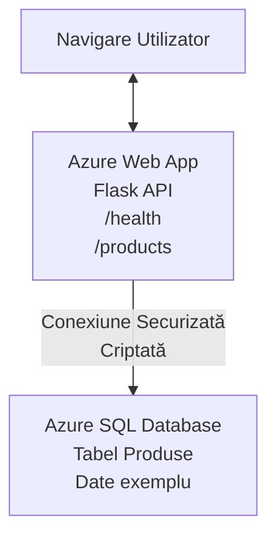

# Implementarea unei baze de date Microsoft SQL și a unei aplicații web cu AZD

⏱️ **Timp estimat**: 20-30 minute | 💰 **Cost estimat**: ~15-25$/lună | ⭐ **Complexitate**: Intermediar

Acest **exemplu complet și funcțional** demonstrează cum să folosești [Azure Developer CLI (azd)](https://learn.microsoft.com/azure/developer/azure-developer-cli/) pentru a implementa o aplicație web Python Flask cu o bază de date Microsoft SQL în Azure. Tot codul este inclus și testat—nu sunt necesare dependențe externe.

## Ce vei învăța

Finalizând acest exemplu, vei:
- Implementa o aplicație multi-strat (aplicație web + bază de date) folosind infrastructură ca cod
- Configura conexiuni securizate către baza de date fără a hardcoda secrete
- Monitoriza sănătatea aplicației cu Application Insights
- Gestiona eficient resursele Azure cu CLI AZD
- Urma bune practici Azure pentru securitate, optimizarea costurilor și observabilitate

## Prezentarea scenariului
- **Aplicație web**: API REST Python Flask cu conectivitate la baza de date
- **Bază de date**: Azure SQL Database cu date de exemplu
- **Infrastructură**: Provisionată folosind Bicep (șabloane modulare, reutilizabile)
- **Implementare**: Complet automatizată cu comenzi `azd`
- **Monitorizare**: Application Insights pentru jurnale și telemetrie

## Cerințe prealabile

### Unelte necesare

Înainte de a începe, asigură-te că ai instalat următoarele unelte:

1. **[Azure CLI](https://learn.microsoft.com/cli/azure/install-azure-cli)** (versiunea 2.50.0 sau mai nouă)
   ```sh
   az --version
   # Ieșire așteptată: azure-cli 2.50.0 sau o versiune superioară
   ```

2. **[Azure Developer CLI (azd)](https://learn.microsoft.com/azure/developer/azure-developer-cli/install-azd)** (versiunea 1.0.0 sau mai nouă)
   ```sh
   azd version
   # Ieșire așteptată: versiunea azd 1.0.0 sau mai nouă
   ```

3. **[Python 3.8+](https://www.python.org/downloads/)** (pentru dezvoltare locală)
   ```sh
   python --version
   # Ieșire așteptată: Python 3.8 sau o versiune superioară
   ```

4. **[Docker](https://www.docker.com/get-started)** (opțional, pentru dezvoltare locală containerizată)
   ```sh
   docker --version
   # Ieșire așteptată: versiunea Docker 20.10 sau mai mare
   ```

### Cerințe Azure

- Un **abonament Azure** activ ([creează un cont gratuit](https://azure.microsoft.com/free/))
- Permisiuni pentru a crea resurse în abonament
- Rol **Owner** sau **Contributor** pe abonament sau grup de resurse

### Cunoștințe prealabile

Acesta este un exemplu de nivel **intermediar**. Ar trebui să fii familiarizat cu:
- Operațiuni de bază în linie de comandă
- Concepte fundamentale cloud (resurse, grupuri de resurse)
- Noțiuni de bază despre aplicații web și baze de date

**Ești nou în AZD?** Începe cu [Ghidul de început](../../docs/chapter-01-foundation/azd-basics.md).

## Arhitectură

Acest exemplu implementează o arhitectură în două straturi cu o aplicație web și o bază de date SQL:


**Implementarea resurselor:**
- **Grup de resurse**: Container pentru toate resursele
- **Plan App Service**: Hosting bazat pe Linux (nivelul B1 pentru eficiență cost)
- **Aplicație web**: runtime Python 3.11 cu aplicație Flask
- **SQL Server**: server de baze de date gestionat cu TLS 1.2 minimum
- **SQL Database**: nivel Basic (2GB, potrivit pentru dezvoltare/testare)
- **Application Insights**: monitorizare și înregistrare
- **Log Analytics Workspace**: stocare centralizată a jurnalelor

**Analogie**: Gândește-te la asta ca la un restaurant (aplicație web) cu un congelator walk-in (bază de date). Clienții comandă de pe meniu (endpoint-uri API), iar bucătăria (aplicația Flask) ia ingredientele (datele) din congelator. Managerul restaurantului (Application Insights) urmărește tot ce se întâmplă.

## Structura dosarelor

Toate fișierele sunt incluse în acest exemplu—nu sunt necesare dependențe externe:

```
examples/database-app/
│
├── README.md                    # This file
├── azure.yaml                   # AZD configuration file
├── .env.sample                  # Sample environment variables
├── .gitignore                   # Git ignore patterns
│
├── infra/                       # Infrastructure as Code (Bicep)
│   ├── main.bicep              # Main orchestration template
│   ├── abbreviations.json      # Azure naming conventions
│   └── resources/              # Modular resource templates
│       ├── sql-server.bicep    # SQL Server configuration
│       ├── sql-database.bicep  # Database configuration
│       ├── app-service-plan.bicep  # Hosting plan
│       ├── app-insights.bicep  # Monitoring setup
│       └── web-app.bicep       # Web application
│
└── src/
    └── web/                    # Application source code
        ├── app.py              # Flask REST API
        ├── requirements.txt    # Python dependencies
        └── Dockerfile          # Container definition
```

**Ce face fiecare fișier:**
- **azure.yaml**: Informează AZD ce să implementeze și unde
- **infra/main.bicep**: Orchestrarea tuturor resurselor Azure
- **infra/resources/*.bicep**: Definiții individuale ale resurselor (modulare pentru reutilizare)
- **src/web/app.py**: Aplicația Flask cu logica bazei de date
- **requirements.txt**: Dependențe pachete Python
- **Dockerfile**: Instrucțiuni pentru containerizare în implementare

## Începerea rapidă (pas cu pas)

### Pasul 1: Clonare și navigare

```sh
git clone https://github.com/microsoft/AZD-for-beginners.git
cd AZD-for-beginners/examples/database-app
```

**✓ Verificare succes**: Asigură-te că vezi `azure.yaml` și dosarul `infra/`:
```sh
ls
# Așteptat: README.md, azure.yaml, infra/, src/
```

### Pasul 2: Autentificare în Azure

```sh
azd auth login
```

Aceasta va deschide browserul pentru autentificare Azure. Conectează-te cu acreditările tale Azure.

**✓ Verificare succes**: Ar trebui să vezi:
```
Logged in to Azure.
```

### Pasul 3: Inițializează mediul

```sh
azd init
```

**Ce se întâmplă**: AZD creează o configurație locală pentru implementare.

**Prompturi afișate**:
- **Numele mediului**: Introdu un nume scurt (ex. `dev`, `myapp`)
- **Abonamentul Azure**: Selectează abonamentul din listă
- **Locația Azure**: Alege o regiune (ex. `eastus`, `westeurope`)

**✓ Verificare succes**: Ar trebui să vezi:
```
SUCCESS: New project initialized!
```

### Pasul 4: Provisionare resurse Azure

```sh
azd provision
```

**Ce se întâmplă**: AZD implementează întreaga infrastructură (5-8 minute):
1. Creează grupul de resurse
2. Creează SQL Server și baza de date
3. Creează Plan App Service
4. Creează aplicația web
5. Creează Application Insights
6. Configurează rețeaua și securitatea

**Îți va cere**:
- **Numele de utilizator admin SQL**: Introdu un nume de utilizator (ex. `sqladmin`)
- **Parola admin SQL**: Introdu o parolă puternică (salveaz-o!)

**✓ Verificare succes**: Ar trebui să vezi:
```
SUCCESS: Your application was provisioned in Azure in X minutes Y seconds.
You can view the resources created under the resource group rg-<env-name> in Azure Portal:
https://portal.azure.com/#@/resource/subscriptions/.../resourceGroups/rg-<env-name>
```

**⏱️ Timp**: 5-8 minute

### Pasul 5: Implementarea aplicației

```sh
azd deploy
```

**Ce se întâmplă**: AZD construiește și implementează aplicația ta Flask:
1. Ambalează aplicația Python
2. Construiește containerul Docker
3. Trimite pe Azure Web App
4. Inițializează baza de date cu date de exemplu
5. Pornește aplicația

**✓ Verificare succes**: Ar trebui să vezi:
```
SUCCESS: Your application was deployed to Azure in X minutes Y seconds.
You can view the resources created under the resource group rg-<env-name> in Azure Portal:
https://portal.azure.com/#@/resource/subscriptions/.../resourceGroups/rg-<env-name>
```

**⏱️ Timp**: 3-5 minute

### Pasul 6: Navighează la aplicație

```sh
azd browse
```

Aceasta deschide aplicația web implementată în browser la `https://app-<unique-id>.azurewebsites.net`

**✓ Verificare succes**: Ar trebui să vezi ieșire JSON:
```json
{
  "message": "Welcome to the Database App API",
  "endpoints": {
    "/": "This help message",
    "/health": "Health check endpoint",
    "/products": "List all products",
    "/products/<id>": "Get product by ID"
  }
}
```

### Pasul 7: Testează endpoint-urile API

**Verificare stare (health check)** (verifică conexiunea la baza de date):
```sh
curl https://app-<your-id>.azurewebsites.net/health
```

**Răspuns așteptat**:
```json
{
  "status": "healthy",
  "database": "connected"
}
```

**Listare produse** (date de exemplu):
```sh
curl https://app-<your-id>.azurewebsites.net/products
```

**Răspuns așteptat**:
```json
[
  {
    "id": 1,
    "name": "Laptop",
    "description": "High-performance laptop",
    "price": 1299.99,
    "created_at": "2025-11-19T10:30:00"
  },
  ...
]
```

**Obține un singur produs**:
```sh
curl https://app-<your-id>.azurewebsites.net/products/1
```

**✓ Verificare succes**: Toate endpoint-urile returnează date JSON fără erori.

---

**🎉 Felicitări!** Ai implementat cu succes o aplicație web cu o bază de date în Azure folosind AZD.

## Detalii de configurare

### Variabile de mediu

Secretele sunt gestionate securizat prin configurația Azure App Service—**niciodată hardcodate în codul sursă**.

**Configurate automat de AZD**:
- `SQL_CONNECTION_STRING`: Conexiune bază de date cu credențiale criptate
- `APPLICATIONINSIGHTS_CONNECTION_STRING`: Endpoint de telemetrie pentru monitorizare
- `SCM_DO_BUILD_DURING_DEPLOYMENT`: Permite instalarea automată a dependențelor

**Unde sunt stocate secretele**:
1. În timpul `azd provision`, oferi credențiale SQL via prompturi securizate
2. AZD le stochează în fișierul local `.azure/<env-name>/.env` (ignorată de git)
3. AZD le injectează în configurația Azure App Service (criptate la repaus)
4. Aplicația le citește prin `os.getenv()` la runtime

### Dezvoltare locală

Pentru testare locală, creează un fișier `.env` din exemplul:

```sh
cp .env.sample .env
# Editează .env cu conexiunea la baza ta de date locală
```

**Flux dezvoltare locală**:
```sh
# Instalează dependențele
cd src/web
pip install -r requirements.txt

# Setează variabilele de mediu
export SQL_CONNECTION_STRING="your-local-connection-string"

# Rulează aplicația
python app.py
```

**Testare locală**:
```sh
curl http://localhost:8000/health
# Așteptat: {"status": "sănătos", "baza_de_date": "conectată"}
```

### Infrastructură ca Cod

Toate resursele Azure sunt definite în **șabloane Bicep** (`infra/`):

- **Design modular**: Fiecare tip resursă are fișier separat pentru reutilizare
- **Parametrizat**: Poți personaliza SKU-uri, regiuni, convenții de denumire
- **Bune practici**: Urmează standardele de denumire și securitate Azure
- **Versionare**: Schimbările infrastructurii sunt urmărite în Git

**Exemplu personalizare**:
Pentru a schimba nivelul bazei de date, editează `infra/resources/sql-database.bicep`:
```bicep
sku: {
  name: 'Standard'  // Changed from 'Basic'
  tier: 'Standard'
  capacity: 10
}
```

## Bune practici de securitate

Acest exemplu urmează bune practici Azure pentru securitate:

### 1. **Niciun secret în codul sursă**
- ✅ Credențiale stocate în configurația Azure App Service (criptate)
- ✅ Fișiere `.env` excluse în `.gitignore`
- ✅ Secrete transmise prin parametri securizați la provisioning

### 2. **Conexiuni criptate**
- ✅ TLS 1.2 minimum pe SQL Server
- ✅ Forțare HTTPS pe aplicația web
- ✅ Conexiuni bază de date folosesc canale criptate

### 3. **Securitate rețea**
- ✅ Firewall SQL server configurat pentru servicii Azure doar
- ✅ Acces public restricționat (se poate securiza suplimentar cu Private Endpoints)
- ✅ FTPS dezactivat pe aplicația web

### 4. **Autentificare & autorizare**
- ⚠️ **Curent**: Autentificare SQL (username/parolă)
- ✅ **Recomandare producție**: Folosește identitate gestionată Azure pentru autentificare fără parolă

**Pentru upgrade la identitate gestionată** (producție):
1. Activează identitatea gestionată pe aplicația web
2. Acordă permisiuni identității în SQL
3. Actualizează șirul de conexiune să folosească identitatea gestionată
4. Elimină autentificarea pe bază de parolă

### 5. **Auditare & conformitate**
- ✅ Application Insights înregistrează toate solicitările și erorile
- ✅ Auditare activată pe SQL Database (configurabil pentru conformitate)
- ✅ Toate resursele etichetate pentru guvernanță

**Checklist securitate înainte de producție**:
- [ ] Activează Azure Defender pentru SQL
- [ ] Configurează Private Endpoints pentru SQL Database
- [ ] Activează Web Application Firewall (WAF)
- [ ] Implementează Azure Key Vault pentru rotația secretelor
- [ ] Configurează autentificare Azure AD
- [ ] Activează logging diagnostic pentru toate resursele

## Optimizarea costurilor

**Costuri estimate lunar** (noiembrie 2025):

| Resursă | SKU/Nivel | Cost estimat |
|---------|-----------|--------------|
| Plan App Service | B1 (Basic) | ~13$/lună |
| SQL Database | Basic (2GB) | ~5$/lună |
| Application Insights | Pay-as-you-go | ~2$/lună (trafic scăzut) |
| **Total** | | **~20$/lună** |

**💡 Sfaturi reducere costuri**:

1. **Folosește nivel gratuit pentru învățare**:
   - App Service: nivel F1 (gratuit, ore limitate)
   - SQL Database: folosește Azure SQL Database serverless
   - Application Insights: 5GB/lună ingestie gratuită

2. **Oprește resursele când nu sunt folosite**:
   ```sh
   # Stop the web app (database still charges)
   az webapp stop --name <app-name> --resource-group <rg-name>
   
   # Restart when needed
   az webapp start --name <app-name> --resource-group <rg-name>
   ```

3. **Șterge tot după testare**:
   ```sh
   azd down
   ```
   Aceasta șterge TOATE resursele și oprește taxele.

4. **SKU-uri dezvoltare vs. producție**:
   - **Dezvoltare**: nivel Basic (folosit în acest exemplu)
   - **Producție**: nivel Standard/Premium cu redundanță

**Monitorizare costuri**:
- Vezi costurile în [Azure Cost Management](https://portal.azure.com/#view/Microsoft_Azure_CostManagement)
- Configurează alerte de cost pentru a evita surprize
- Etichetează toate resursele cu `azd-env-name` pentru urmărire

**Alternativa nivel gratuit**:
Pentru scopuri de învățare, poți modifica `infra/resources/app-service-plan.bicep`:
```bicep
sku: {
  name: 'F1'  // Free tier
  tier: 'Free'
}
```
**Notă**: Nivelul gratuit are limitări (60 min/zi CPU, fără always-on).

## Monitorizare & Observabilitate

### Integrare Application Insights

Acest exemplu include **Application Insights** pentru monitorizare completă:

**Ce se monitorizează**:
- ✅ Solicitări HTTP (latență, coduri status, endpoint-uri)
- ✅ Erori și excepții în aplicație
- ✅ Logging personalizat din aplicația Flask
- ✅ Sănătatea conexiunii la baza de date
- ✅ Metrici de performanță (CPU, memorie)

**Accesează Application Insights**:
1. Deschide [Azure Portal](https://portal.azure.com)
2. Navighează la grupul tău de resurse (`rg-<env-name>`)
3. Click pe resursa Application Insights (`appi-<unique-id>`)

**Interogări utile** (Application Insights → Logs):

**Vezi toate solicitările**:
```kusto
requests
| where timestamp > ago(1h)
| order by timestamp desc
| project timestamp, name, url, resultCode, duration
```

**Găsește erorile**:
```kusto
exceptions
| where timestamp > ago(24h)
| order by timestamp desc
| project timestamp, type, outerMessage, operation_Name
```

**Verifică endpoint-ul de sănătate**:
```kusto
requests
| where name contains "health"
| summarize count() by resultCode, bin(timestamp, 1h)
```

### Auditare SQL Database

**Auditarea SQL Database este activată** pentru a urmări:
- Modele de acces la baza de date
- Încercări eșuate de logare
- Modificări ale schemei
- Accesul la date (pentru conformitate)

**Accesează jurnalele de audit**:
1. Azure Portal → SQL Database → Auditare
2. Vezi jurnalele în Log Analytics workspace

### Monitorizare în timp real

**Vezi metrici live**:
1. Application Insights → Live Metrics
2. Urmărește solicitări, erori și performanță în timp real

**Configurează alerte**:
Creează alerte pentru evenimente critice:
- Erori HTTP 500 > 5 în 5 minute
- Eșecuri de conexiune la baza de date
- Timpuri de răspuns mari (>2 sec)

**Exemplu creare alertă**:
```sh
az monitor metrics alert create \
  --name "High-Response-Time" \
  --resource-group <rg-name> \
  --scopes <app-insights-resource-id> \
  --condition "avg requests/duration > 2000" \
  --description "Alert when response time exceeds 2 seconds"
```

## Rezolvarea problemelor
### Probleme Comune și Soluții

#### 1. `azd provision` eșuează cu mesajul "Location not available"

**Simptom**:  
```
Error: The subscription is not registered for the resource type 'components' in the location 'centralus'.
```
  
**Soluție**:  
Alege o regiune Azure diferită sau înregistrează furnizorul de resurse:  
```sh
az provider register --namespace Microsoft.Insights
```
  
#### 2. Conexiunea SQL eșuează în timpul implementării

**Simptom**:  
```
pyodbc.OperationalError: ('08001', '[08001] [Microsoft][ODBC Driver 18 for SQL Server]TCP Provider...')
```
  
**Soluție**:  
- Verifică dacă firewall-ul SQL Server permite serviciilor Azure (configurat automat)  
- Verifică dacă parola de administrator SQL a fost introdusă corect în timpul `azd provision`  
- Asigură-te că SQL Server este complet provisionat (poate dura 2-3 minute)

**Verifică conexiunea**:  
```sh
# Din portalul Azure, accesați SQL Database → Editor interogări
# Încercați să vă conectați cu acreditările dvs.
```
  
#### 3. Web App afișează "Application Error"

**Simptom**:  
Browserul afișează o pagină generică de eroare.

**Soluție**:  
Verifică jurnalele aplicației:  
```sh
# Vizualizați jurnalele recente
az webapp log tail --name <app-name> --resource-group <rg-name>
```
  
**Cauze frecvente**:  
- Variabile de mediu lipsă (verifică App Service → Configurare)  
- Instalarea pachetului Python a eșuat (verifică jurnalele de implementare)  
- Eroare la inițializarea bazei de date (verifică conectivitatea la SQL)

#### 4. `azd deploy` eșuează cu mesajul "Build Error"

**Simptom**:  
```
Error: Failed to build project
```
  
**Soluție**:  
- Asigură-te că `requirements.txt` nu conține erori de sintaxă  
- Verifică că Python 3.11 este specificat în `infra/resources/web-app.bicep`  
- Verifică dacă Dockerfile are imaginea de bază corectă

**Debug local**:  
```sh
cd src/web
docker build -t test-app .
docker run -p 8000:8000 test-app
```
  
#### 5. "Unauthorized" la rularea comenzilor AZD

**Simptom**:  
```
ERROR: (Unauthorized) The client '<id>' with object id '<id>' does not have authorization
```
  
**Soluție**:  
Reautentifică-te în Azure:  
```sh
azd auth login
az login
```
  
Verifică dacă ai permisiunile corecte (rol Contributor) pe abonament.

#### 6. Costuri mari pentru baza de date

**Simptom**:  
Factură neașteptată Azure.

**Soluție**:  
- Verifică dacă ai uitat să rulezi `azd down` după testare  
- Verifică dacă SQL Database folosește nivelul Basic (nu Premium)  
- Revizuiește costurile în Azure Cost Management  
- Configurează alerte de costuri

### Obținerea Ajutorului

**Vezi toate variabilele de mediu AZD**:  
```sh
azd env get-values
```
  
**Verifică statusul implementării**:  
```sh
az webapp show --name <app-name> --resource-group <rg-name> --query state
```
  
**Accesează jurnalele aplicației**:  
```sh
az webapp log download --name <app-name> --resource-group <rg-name> --log-file app-logs.zip
```
  
**Ai nevoie de mai mult ajutor?**  
- [Ghid de depanare AZD](../../docs/chapter-07-troubleshooting/common-issues.md)  
- [Depanare Azure App Service](https://learn.microsoft.com/azure/app-service/troubleshoot-diagnostic-logs)  
- [Depanare Azure SQL](https://learn.microsoft.com/azure/azure-sql/database/troubleshoot-common-errors-issues)

## Exerciții practice

### Exercițiul 1: Verifică implementarea ta (Începători)

**Scop**: Confirmă că toate resursele sunt implementate și aplicația funcționează.

**Pași**:  
1. Listează toate resursele din grupul tău de resurse:  
   ```sh
   az resource list --resource-group rg-<env-name> --output table
   ```
   **Așteptat**: 6-7 resurse (Web App, SQL Server, SQL Database, App Service Plan, Application Insights, Log Analytics)

2. Testează toate endpoint-urile API:  
   ```sh
   curl https://app-<your-id>.azurewebsites.net/
   curl https://app-<your-id>.azurewebsites.net/health
   curl https://app-<your-id>.azurewebsites.net/products
   curl https://app-<your-id>.azurewebsites.net/products/1
   ```
   **Așteptat**: Toate returnează JSON valid fără erori

3. Verifică Application Insights:  
   - Mergi în Application Insights în Azure Portal  
   - Accesează "Live Metrics"  
   - Reîncarcă browserul pe web app  
   **Așteptat**: Vezi cereri afișate în timp real

**Criterii de succes**: Toate cele 6-7 resurse există, toate endpoint-urile returnează date, Live Metrics afișează activitate.

---

### Exercițiul 2: Adaugă un nou endpoint API (Intermediar)

**Scop**: Extinde aplicația Flask cu un nou endpoint.

**Cod de început**: Endpoint-urile curente în `src/web/app.py`

**Pași**:  
1. Editează `src/web/app.py` și adaugă un nou endpoint după funcția `get_product()`:  
   ```python
   @app.route('/products/search/<keyword>')
   def search_products(keyword):
       """Search products by name or description."""
       try:
           conn = get_db_connection()
           cursor = conn.cursor()
           cursor.execute(
               "SELECT id, name, description, price, created_at FROM products WHERE name LIKE ? OR description LIKE ?",
               (f'%{keyword}%', f'%{keyword}%')
           )
           
           products = []
           for row in cursor.fetchall():
               products.append({
                   'id': row[0],
                   'name': row[1],
                   'description': row[2],
                   'price': float(row[3]) if row[3] else None,
                   'created_at': row[4].isoformat() if row[4] else None
               })
           
           cursor.close()
           conn.close()
           
           logger.info(f"Search for '{keyword}' returned {len(products)} results")
           return jsonify(products), 200
           
       except Exception as e:
           logger.error(f"Error searching products: {str(e)}")
           return jsonify({'error': str(e)}), 500
   ```
  
2. Publică aplicația actualizată:  
   ```sh
   azd deploy
   ```
  
3. Testează noul endpoint:  
   ```sh
   curl https://app-<your-id>.azurewebsites.net/products/search/laptop
   ```
   **Așteptat**: Returnează produse care corespund "laptop"

**Criterii de succes**: Noul endpoint funcționează, returnează rezultate filtrate, apare în jurnalele Application Insights.

---

### Exercițiul 3: Adaugă monitorizare și alerte (Avansat)

**Scop**: Configurează monitorizare proactivă cu alerte.

**Pași**:  
1. Creează o alertă pentru erorile HTTP 500:  
   ```sh
   # Obțineți ID-ul resursei Application Insights
   AI_ID=$(az monitor app-insights component show \
     --app appi-<your-id> \
     --resource-group rg-<env-name> \
     --query id -o tsv)
   
   # Creați o alertă
   az monitor metrics alert create \
     --name "High-Error-Rate" \
     --resource-group rg-<env-name> \
     --scopes $AI_ID \
     --condition "count requests/failed > 5" \
     --window-size 5m \
     --evaluation-frequency 1m \
     --description "Alert when >5 failed requests in 5 minutes"
   ```
  
2. Declanșează alerta provocând erori:  
   ```sh
   # Solicitați un produs inexistent
   for i in {1..10}; do curl https://app-<your-id>.azurewebsites.net/products/999; done
   ```
  
3. Verifică dacă alerta a fost declanșată:  
   - Azure Portal → Alerts → Alert Rules  
   - Verifică emailul (dacă este configurat)

**Criterii de succes**: Regula de alertă este creată, declanșează la erori, notificările sunt primite.

---

### Exercițiul 4: Modificări în schema bazei de date (Avansat)

**Scop**: Adaugă un tabel nou și modifică aplicația să-l folosească.

**Pași**:  
1. Conectează-te la SQL Database prin Editorul de interogări din Azure Portal

2. Creează un nou tabel `categories`:  
   ```sql
   CREATE TABLE categories (
       id INT PRIMARY KEY IDENTITY(1,1),
       name NVARCHAR(50) NOT NULL,
       description NVARCHAR(200)
   );
   
   INSERT INTO categories (name, description) VALUES
   ('Electronics', 'Electronic devices and accessories'),
   ('Office Supplies', 'Office equipment and supplies');
   
   -- Add category to products table
   ALTER TABLE products ADD category_id INT;
   UPDATE products SET category_id = 1; -- Set all to Electronics
   ```
  
3. Actualizează `src/web/app.py` pentru a include informații despre categorie în răspunsuri

4. Publică și testează

**Criterii de succes**: Tabelul nou există, produsele afișează informații despre categorie, aplicația funcționează în continuare.

---

### Exercițiul 5: Implementează caching (Expert)

**Scop**: Adaugă Azure Redis Cache pentru a îmbunătăți performanța.

**Pași**:  
1. Adaugă Redis Cache în `infra/main.bicep`  
2. Actualizează `src/web/app.py` pentru a cache-ui interogările produselor  
3. Măsoară îmbunătățirea performanței cu Application Insights  
4. Compară timpii de răspuns înainte și după caching

**Criterii de succes**: Redis este implementat, caching funcționează, timpii de răspuns se îmbunătățesc cu >50%.

**Sugestie**: Începe cu [documentația Azure Cache for Redis](https://learn.microsoft.com/azure/azure-cache-for-redis/).

---

## Curățare

Pentru a evita costurile continue, șterge toate resursele după terminare:  

```sh
azd down
```
  
**Prompt de confirmare**:  
```
? Total resources to delete: 7, are you sure you want to continue? (y/N)
```
  
Tastează `y` pentru confirmare.

**✓ Verificare succes**:  
- Toate resursele sunt șterse din Azure Portal  
- Nu există costuri continue  
- Dosarul local `.azure/<env-name>` poate fi șters

**Alternativ** (păstrează infrastructura, șterge datele):  
```sh
# Șterge doar grupul de resurse (păstrează configurația AZD)
az group delete --name rg-<env-name> --yes
```
## Afla Mai Mult

### Documentație Relaționată
- [Documentația Azure Developer CLI](https://learn.microsoft.com/azure/developer/azure-developer-cli/)  
- [Documentația Azure SQL Database](https://learn.microsoft.com/azure/azure-sql/database/)  
- [Documentația Azure App Service](https://learn.microsoft.com/azure/app-service/)  
- [Documentația Application Insights](https://learn.microsoft.com/azure/azure-monitor/app/app-insights-overview)  
- [Referință limbaj Bicep](https://learn.microsoft.com/azure/azure-resource-manager/bicep/)

### Pașii Următori în Acest Curs
- **[Exemplu Container Apps](../../../../examples/container-app)**: Implementare microservicii cu Azure Container Apps  
- **[Ghid Integrare AI](../../../../docs/ai-foundry)**: Adaugă capabilități AI aplicației tale  
- **[Bune practici pentru implementare](../../docs/chapter-04-infrastructure/deployment-guide.md)**: Modele de implementare în producție

### Subiecte Avansate
- **Identitate gestionată**: Elimină parolele și folosește autentificarea Azure AD  
- **Endpoint-uri Private**: Securizează conexiunile bazei de date în rețea virtuală  
- **Integrare CI/CD**: Automatizează implementările cu GitHub Actions sau Azure DevOps  
- **Mediu Multi-ENV**: Configurează medii dev, staging și producție  
- **Migrații baze de date**: Folosește Alembic sau Entity Framework pentru versionarea schemei

### Comparație cu Alte Abordări

**AZD vs. ARM Templates**:  
- ✅ AZD: abstractizare la nivel înalt, comenzi mai simple  
- ⚠️ ARM: mai detaliat, control granular

**AZD vs. Terraform**:  
- ✅ AZD: nativ Azure, integrat cu serviciile Azure  
- ⚠️ Terraform: suport multi-cloud, ecosistem mai larg

**AZD vs. Azure Portal**:  
- ✅ AZD: repetabil, control versiuni, automatizabil  
- ⚠️ Portal: clicuri manuale, dificil de reprodus

**Gândește-te la AZD ca**: Docker Compose pentru Azure — configurare simplificată pentru implementări complexe.

---

## Întrebări Frecvente

**Î: Pot folosi un alt limbaj de programare?**  
R: Da! Înlocuiește `src/web/` cu Node.js, C#, Go sau orice limbaj. Actualizează `azure.yaml` și Bicep corespunzător.

**Î: Cum adaug mai multe baze de date?**  
R: Adaugă un alt modul SQL Database în `infra/main.bicep` sau folosește PostgreSQL/MySQL din serviciile Azure Database.

**Î: Pot folosi asta în producție?**  
R: Acesta este un punct de plecare. Pentru producție, adaugă: identitate gestionată, endpoint-uri private, redundanță, strategie backup, WAF și monitorizare avansată.

**Î: Ce fac dacă vreau să folosesc containere în loc de implementare cod?**  
R: Vezi [Exemplul Container Apps](../../../../examples/container-app) care folosește containere Docker peste tot.

**Î: Cum mă conectez la baza de date de pe mașina locală?**  
R: Adaugă IP-ul tău în firewall-ul SQL Server:  
```sh
az sql server firewall-rule create \
  --resource-group rg-<env-name> \
  --server sql-<unique-id> \
  --name AllowMyIP \
  --start-ip-address <your-ip> \
  --end-ip-address <your-ip>
```
  
**Î: Pot să folosesc o bază de date existentă în loc să creez una nouă?**  
R: Da, modifică `infra/main.bicep` să facă referire la un SQL Server existent și actualizează parametrii conexiunii.

---

> **Notă:** Acest exemplu demonstrează bune practici pentru implementarea unei aplicații web cu o bază de date folosind AZD. Include cod funcțional, documentație completă și exerciții practice pentru consolidarea învățării. Pentru implementările în producție, revizuiește cerințele de securitate, scalare, conformitate și cost specifice organizației tale.

**📚 Navigare curs:**  
- ← Anterior: [Exemplu Container Apps](../../../../examples/container-app)  
- → Următor: [Ghid Integrare AI](../../../../docs/ai-foundry)  
- 🏠 [Pagina principală a cursului](../../README.md)

---

<!-- CO-OP TRANSLATOR DISCLAIMER START -->
**Declinare a responsabilității**:  
Acest document a fost tradus folosind serviciul de traducere AI [Co-op Translator](https://github.com/Azure/co-op-translator). Deși ne străduim pentru acuratețe, vă rugăm să rețineți că traducerile automate pot conține erori sau inexactități. Documentul original în limba sa nativă trebuie considerat sursa autoritară. Pentru informații critice, se recomandă traducerea profesională realizată de un specialist uman. Nu ne asumăm responsabilitatea pentru eventualele neînțelegeri sau interpretări greșite care pot apărea din utilizarea acestei traduceri.
<!-- CO-OP TRANSLATOR DISCLAIMER END -->