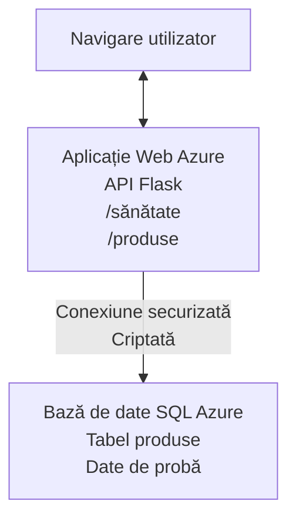

# Implementarea unei baze de date Microsoft SQL și a unei aplicații web cu AZD

⏱️ **Timp estimat**: 20-30 minute | 💰 **Cost estimat**: ~15-25 USD/lună | ⭐ **Complexitate**: Intermediar

Acest **exemplu complet, funcțional** demonstrează cum să folosiți [Azure Developer CLI (azd)](https://learn.microsoft.com/azure/developer/azure-developer-cli/) pentru a implementa o aplicație web Python Flask cu o bază de date Microsoft SQL în Azure. Tot codul este inclus și testat—fără dependențe externe necesare.

## Ce vei învăța

Prin finalizarea acestui exemplu, vei:
- Implementa o aplicație multi-strat (aplicație web + bază de date) folosind infrastructură ca cod
- Configura conexiuni securizate către baza de date fără a introduce secrete direct în cod
- Monitoriza starea aplicației cu Application Insights
- Gestiona eficient resursele Azure cu AZD CLI
- Urma bune practici Azure pentru securitate, optimizare costuri și observabilitate

## Prezentare scenariu
- **Aplicație web**: API REST Python Flask cu conectivitate către baza de date
- **Bază de date**: Azure SQL Database cu date de probă
- **Infrastructură**: Provisionată folosind Bicep (șabloane modulare, reutilizabile)
- **Implementare**: Complet automatizată prin comenzi `azd`
- **Monitorizare**: Application Insights pentru jurnale și telemetrie

## Cerințe prealabile

### Unelte necesare

Înainte de a începe, asigură-te că ai instalate următoarele unelte:

1. **[Azure CLI](https://learn.microsoft.com/cli/azure/install-azure-cli)** (versiunea 2.50.0 sau mai nouă)
   ```sh
   az --version
   # Rezultat așteptat: azure-cli 2.50.0 sau versiune superioară
   ```

2. **[Azure Developer CLI (azd)](https://learn.microsoft.com/azure/developer/azure-developer-cli/install-azd)** (versiunea 1.0.0 sau mai nouă)
   ```sh
   azd version
   # Ieșire așteptată: versiunea azd 1.0.0 sau mai mare
   ```

3. **[Python 3.8+](https://www.python.org/downloads/)** (pentru dezvoltare locală)
   ```sh
   python --version
   # Ieșire așteptată: Python 3.8 sau mai nou
   ```

4. **[Docker](https://www.docker.com/get-started)** (opțional, pentru dezvoltare locală containerizată)
   ```sh
   docker --version
   # Rezultat așteptat: versiunea Docker 20.10 sau mai nouă
   ```

### Cerințe Azure

- Un **abonament Azure** activ ([creează un cont gratuit](https://azure.microsoft.com/free/))
- Permisiuni pentru a crea resurse în abonamentul tău
- Rolul **Owner** sau **Contributor** pe abonament sau grupul de resurse

### Cunoștințe prealabile

Acesta este un exemplu de nivel intermediar. Ar trebui să cunoști:
- Operațiuni de bază în linia de comandă
- Noțiuni fundamentale despre cloud (resurse, grupuri de resurse)
- Înțelegere de bază a aplicațiilor web și baze de date

**Ești nou în AZD?** Începe cu [Ghidul de început](../../docs/chapter-01-foundation/azd-basics.md).

## Arhitectură

Acest exemplu implementează o arhitectură în două niveluri cu o aplicație web și o bază de date SQL:



**Implementarea resurselor:**
- **Grup de resurse**: Container pentru toate resursele
- **App Service Plan**: Găzduire pe Linux (nivel B1 pentru eficiență de cost)
- **Aplicație Web**: Runtime Python 3.11 cu aplicație Flask
- **SQL Server**: Server de bază de date gestionat cu TLS 1.2 minim
- **SQL Database**: Nivel Basic (2GB, potrivit pentru dezvoltare/testare)
- **Application Insights**: Monitorizare și jurnalizare
- **Log Analytics Workspace**: Stocare centralizată de jurnale

**Analogie**: Gândește-te la asta ca la un restaurant (aplicație web) cu o congelator la rece (bază de date). Clienții comandă de pe meniu (endpoint-uri API), iar bucătăria (aplicația Flask) ia ingredientele (datele) din congelator. Managerul restaurantului (Application Insights) urmărește tot ce se întâmplă.

## Structura folderelor

Toate fișierele sunt incluse în acest exemplu—nu sunt necesare dependențe externe:

```
examples/database-app/
│
├── README.md                    # This file
├── azure.yaml                   # AZD configuration file
├── .env.sample                  # Sample environment variables
├── .gitignore                   # Git ignore patterns
│
├── infra/                       # Infrastructure as Code (Bicep)
│   ├── main.bicep              # Main orchestration template
│   ├── abbreviations.json      # Azure naming conventions
│   └── resources/              # Modular resource templates
│       ├── sql-server.bicep    # SQL Server configuration
│       ├── sql-database.bicep  # Database configuration
│       ├── app-service-plan.bicep  # Hosting plan
│       ├── app-insights.bicep  # Monitoring setup
│       └── web-app.bicep       # Web application
│
└── src/
    └── web/                    # Application source code
        ├── app.py              # Flask REST API
        ├── requirements.txt    # Python dependencies
        └── Dockerfile          # Container definition
```

**Ce face fiecare fișier:**
- **azure.yaml**: Spune AZD ce să implementeze și unde
- **infra/main.bicep**: Orchestrarea tuturor resurselor Azure
- **infra/resources/*.bicep**: Definiții individuale ale resurselor (modular pentru reutilizare)
- **src/web/app.py**: Aplicația Flask cu logica bazei de date
- **requirements.txt**: Dependențe Python
- **Dockerfile**: Instrucțiuni de containerizare pentru implementare

## Pornire rapidă (pas cu pas)

### Pasul 1: Clonează și navighează

```sh
git clone https://github.com/microsoft/AZD-for-beginners.git
cd AZD-for-beginners/examples/database-app
```

**✓ Verificare succes**: Confirmă că vezi `azure.yaml` și folderul `infra/`:
```sh
ls
# Așteptat: README.md, azure.yaml, infra/, src/
```

### Pasul 2: Autentificare în Azure

```sh
azd auth login
```

Acest pas deschide browserul pentru autentificare Azure. Conectează-te cu acreditările tale Azure.

**✓ Verificare succes**: Ar trebui să vezi:
```
Logged in to Azure.
```

### Pasul 3: Inițializează mediul

```sh
azd init
```

**Ce se întâmplă**: AZD creează o configurație locală pentru implementare.

**Întrebări pe care le vei vedea**:
- **Numele mediului**: Introdu un nume scurt (ex., `dev`, `myapp`)
- **Abonamentul Azure**: Selectează abonamentul din listă
- **Regiunea Azure**: Alege o regiune (ex., `eastus`, `westeurope`)

**✓ Verificare succes**: Ar trebui să vezi:
```
SUCCESS: New project initialized!
```

### Pasul 4: Provisionează resursele Azure

```sh
azd provision
```

**Ce se întâmplă**: AZD implementează toată infrastructura (5-8 minute):
1. Creează grupul de resurse
2. Creează SQL Server și baza de date
3. Creează App Service Plan
4. Creează aplicația Web
5. Creează Application Insights
6. Configurează rețelistica și securitatea

**Se vor cere**:
- **Nume utilizator admin SQL**: Introdu un nume (ex., `sqladmin`)
- **Parolă admin SQL**: Introdu o parolă puternică (păstreaz-o!)

**✓ Verificare succes**: Ar trebui să vezi:
```
SUCCESS: Your application was provisioned in Azure in X minutes Y seconds.
You can view the resources created under the resource group rg-<env-name> in Azure Portal:
https://portal.azure.com/#@/resource/subscriptions/.../resourceGroups/rg-<env-name>
```

**⏱️ Timp**: 5-8 minute

### Pasul 5: Implementează aplicația

```sh
azd deploy
```

**Ce se întâmplă**: AZD construiește și implementează aplicația ta Flask:
1. Împachetează aplicația Python
2. Construiește containerul Docker
3. Împinge containerul în Azure Web App
4. Inițializează baza de date cu date de probă
5. Pornește aplicația

**✓ Verificare succes**: Ar trebui să vezi:
```
SUCCESS: Your application was deployed to Azure in X minutes Y seconds.
You can view the resources created under the resource group rg-<env-name> in Azure Portal:
https://portal.azure.com/#@/resource/subscriptions/.../resourceGroups/rg-<env-name>
```

**⏱️ Timp**: 3-5 minute

### Pasul 6: Accesează aplicația

```sh
azd browse
```

Se deschide aplicația ta web implementată în browser la `https://app-<unique-id>.azurewebsites.net`

**✓ Verificare succes**: Vei vedea un rezultat JSON:
```json
{
  "message": "Welcome to the Database App API",
  "endpoints": {
    "/": "This help message",
    "/health": "Health check endpoint",
    "/products": "List all products",
    "/products/<id>": "Get product by ID"
  }
}
```

### Pasul 7: Testează endpoint-urile API

**Verificare stare** (verifică conexiunea la baza de date):
```sh
curl https://app-<your-id>.azurewebsites.net/health
```

**Răspuns așteptat**:
```json
{
  "status": "healthy",
  "database": "connected"
}
```

**Lista produse** (date de probă):
```sh
curl https://app-<your-id>.azurewebsites.net/products
```

**Răspuns așteptat**:
```json
[
  {
    "id": 1,
    "name": "Laptop",
    "description": "High-performance laptop",
    "price": 1299.99,
    "created_at": "2025-11-19T10:30:00"
  },
  ...
]
```

**Obține un produs individual**:
```sh
curl https://app-<your-id>.azurewebsites.net/products/1
```

**✓ Verificare succes**: Toate endpoint-urile returnează date JSON fără erori.

---

**🎉 Felicitări!** Ai implementat cu succes o aplicație web cu bază de date în Azure folosind AZD.

## Detalii despre configurare

### Variabile de mediu

Secretele sunt gestionate securizat prin configurarea Azure App Service—**niciodată hardcodate în codul sursă**.

**Configurează automat de AZD**:
- `SQL_CONNECTION_STRING`: Conexiune la baza de date cu credențiale criptate
- `APPLICATIONINSIGHTS_CONNECTION_STRING`: Endpoint telemetrie monitorizare
- `SCM_DO_BUILD_DURING_DEPLOYMENT`: Permite instalarea automată a dependențelor

**Unde se stochează secretele**:
1. În timpul `azd provision`, introduci credențialele SQL prin prompturi securizate
2. AZD le salvează local în fișierul `.azure/<env-name>/.env` (ignorată de Git)
3. AZD le injectează în configurația App Service Azure (criptate la repaus)
4. Aplicația le citește prin `os.getenv()` la runtime

### Dezvoltare locală

Pentru testare locală, creează un fișier `.env` din cel de probă:

```sh
cp .env.sample .env
# Editează .env cu conexiunea la baza ta de date locală
```

**Flux de lucru dezvoltare locală**:
```sh
# Instalează dependențele
cd src/web
pip install -r requirements.txt

# Configurează variabilele de mediu
export SQL_CONNECTION_STRING="your-local-connection-string"

# Rulează aplicația
python app.py
```

**Testează local**:
```sh
curl http://localhost:8000/health
# Așteptat: {"status": "sănătos", "bază de date": "conectată"}
```

### Infrastructură ca cod

Toate resursele Azure sunt definite în **șabloane Bicep** (`infra/` folder):

- **Design modular**: Fiecare tip de resursă are propriul fișier pentru reutilizare
- **Parametrizat**: Personalizează SKU-uri, regiuni, convenții de denumire
- **Bune practici**: Urmează standardele de denumire și securitate Azure
- **Control versiuni**: Modificările infrastructurii sunt urmărite în Git

**Exemplu de personalizare**:
Pentru a schimba nivelul bazei de date, editează `infra/resources/sql-database.bicep`:
```bicep
sku: {
  name: 'Standard'  // Changed from 'Basic'
  tier: 'Standard'
  capacity: 10
}
```

## Bune practici de securitate

Acest exemplu urmează bune practici Azure privind securitatea:

### 1. **Fără secrete în codul sursă**
- ✅ Credențiale stocate în configurația Azure App Service (criptat)
- ✅ Fișiere `.env` excluse din Git prin `.gitignore`
- ✅ Secrete transmise prin parametri securizați la provisionare

### 2. **Conexiuni criptate**
- ✅ TLS 1.2 minim pentru SQL Server
- ✅ HTTPS obligatoriu pentru aplicația web
- ✅ Conexiuni către baza de date prin canale criptate

### 3. **Securitatea rețelei**
- ✅ Firewall SQL Server configurat să permită doar servicii Azure
- ✅ Acces public restricționat (poate fi blocat suplimentar cu Private Endpoints)
- ✅ FTPS dezactivat pe App Service

### 4. **Autentificare și autorizare**
- ⚠️ **Curent**: autentificare SQL (utilizator/parolă)
- ✅ **Recomandare producție**: folosește Azure Managed Identity pentru autentificare fără parolă

**Pentru upgrade la Managed Identity** (în producție):
1. Activează identitate gestionată pe Web App
2. Acordă permisiuni SQL identității
3. Actualizează connection string să folosească identitate gestionată
4. Elimină autentificarea bazată pe parolă

### 5. **Audit și conformitate**
- ✅ Application Insights înregistrează toate cererile și erorile
- ✅ Audit SQL Database activat (configurabil pentru conformitate)
- ✅ Toate resursele sunt etichetate pentru guvernanță

**Lista verificare securitate înainte de producție**:
- [ ] Activează Azure Defender pentru SQL
- [ ] Configurează Private Endpoints pentru SQL Database
- [ ] Activează Web Application Firewall (WAF)
- [ ] Implementează Azure Key Vault pentru rotația secretelor
- [ ] Configurează autentificarea Microsoft Entra ID
- [ ] Activează jurnalizarea diagnostic pentru toate resursele

## Optimizarea costurilor

**Costuri lunare estimate** (noiembrie 2025):

| Resursă | SKU/Nivel | Cost estimat |
|----------|----------|--------------|
| App Service Plan | B1 (Basic) | ~13 USD/lună |
| SQL Database | Basic (2GB) | ~5 USD/lună |
| Application Insights | Pay-as-you-go | ~2 USD/lună (trafic mic) |
| **Total** | | **~20 USD/lună** |

**💡 Sfaturi pentru reducerea costurilor**:

1. **Folosește nivelul gratuit pentru învățare**:
   - App Service: nivel F1 (gratuit, ore limitate)
   - SQL Database: folosește Azure SQL Database serverless
   - Application Insights: 5GB/lună ingestie gratuită

2. **Oprește resursele când nu le folosești**:
   ```sh
   # Opriți aplicația web (baza de date încă percepe costuri)
   az webapp stop --name <app-name> --resource-group <rg-name>
   
   # Repornire la nevoie
   az webapp start --name <app-name> --resource-group <rg-name>
   ```

3. **Șterge tot după testare**:
   ```sh
   azd down
   ```
   Aceasta elimină TOATE resursele și oprește taxele.

4. **SKU-uri dezvoltare vs. producție**:
   - **Dezvoltare**: nivel Basic (folosit în acest exemplu)
   - **Producție**: nivel Standard/Premium cu redundanță

**Monitorizarea costurilor**:
- Vezi costurile în [Azure Cost Management](https://portal.azure.com/#view/Microsoft_Azure_CostManagement)
- Configurează alerte de cost pentru a evita surprizele
- Etichetează toate resursele cu `azd-env-name` pentru urmărire

**Alternativă nivel gratuit**:
Pentru învățare, poți modifica `infra/resources/app-service-plan.bicep`:
```bicep
sku: {
  name: 'F1'  // Free tier
  tier: 'Free'
}
```
**Notă**: nivelul gratuit are limitări (CPU 60 min/zi, fără always-on).

## Monitorizare și observabilitate

### Integrare Application Insights

Acest exemplu include **Application Insights** pentru monitorizare completă:

**Ce se monitorizează**:
- ✅ Cereri HTTP (latenta, coduri status, endpointuri)
- ✅ Erori și excepții aplicație
- ✅ Jurnalizare custom din aplicația Flask
- ✅ Starea conexiunii bazei de date
- ✅ Metrice de performanță (CPU, memorie)

**Acces Application Insights**:
1. Deschide [Portal Azure](https://portal.azure.com)
2. Navighează la grupul tău de resurse (`rg-<env-name>`)
3. Dă click pe resursa Application Insights (`appi-<unique-id>`)

**Interogări utile** (Application Insights → Logs):

**Vezi toate cererile**:
```kusto
requests
| where timestamp > ago(1h)
| order by timestamp desc
| project timestamp, name, url, resultCode, duration
```

**Localizează erorile**:
```kusto
exceptions
| where timestamp > ago(24h)
| order by timestamp desc
| project timestamp, type, outerMessage, operation_Name
```

**Verifică endpoint-ul de stare**:
```kusto
requests
| where name contains "health"
| summarize count() by resultCode, bin(timestamp, 1h)
```

### Audit baza de date SQL

**Auditul bazei de date SQL este activat** pentru a monitoriza:
- Modele de acces în baza de date
- Tentative eșuate de autentificare
- Modificări schema
- Accesul la date (pentru conformitate)

**Accesează jurnalele de audit**:
1. Portal Azure → SQL Database → Auditing
2. Vizualizează jurnalele în Log Analytics workspace

### Monitorizare în timp real

**Vezi metrice live**:
1. Application Insights → Live Metrics
2. Vezi cereri, erori și performanță în timp real

**Configurează alerte**:
Crează alerte pentru evenimente critice:
- Erori HTTP 500 > 5 în 5 minute
- Probleme conexiune baza de date
- Timp de răspuns ridicat (>2 secunde)

**Exemplu creare alertă**:
```sh
az monitor metrics alert create \
  --name "High-Response-Time" \
  --resource-group <rg-name> \
  --scopes <app-insights-resource-id> \
  --condition "avg requests/duration > 2000" \
  --description "Alert when response time exceeds 2 seconds"
```

## Depanare
### Probleme comune și soluții

#### 1. `azd provision` eșuează cu mesajul "Location not available"

**Simptom**:  
```
Error: The subscription is not registered for the resource type 'components' in the location 'centralus'.
```
  
**Soluție**:  
Alege o regiune Azure diferită sau înregistrează furnizorul de resurse:  
```sh
az provider register --namespace Microsoft.Insights
```
  
#### 2. Conexiunea SQL eșuează în timpul implementării

**Simptom**:  
```
pyodbc.OperationalError: ('08001', '[08001] [Microsoft][ODBC Driver 18 for SQL Server]TCP Provider...')
```
  
**Soluție**:  
- Verifică dacă firewall-ul SQL Server permite serviciile Azure (configurat automat)  
- Verifică dacă parola administratorului SQL a fost introdusă corect în timpul `azd provision`  
- Asigură-te că SQL Server este complet provisionat (poate dura 2-3 minute)  

**Verifică conexiunea**:  
```sh
# Din portalul Azure, accesați SQL Database → Editor interogări
# Încercați să vă conectați cu acreditările dvs.
```
  
#### 3. Web App afișează "Application Error"

**Simptom**:  
Browser-ul afișează o pagină generică de eroare.

**Soluție**:  
Verifică jurnalele aplicației:  
```sh
# Vizualizează jurnalele recente
az webapp log tail --name <app-name> --resource-group <rg-name>
```
  
**Cauze comune**:  
- Variabile de mediu lipsă (verifică App Service → Configuration)  
- Instalarea pachetelor Python a eșuat (verifică jurnalele de implementare)  
- Eroare la inițializarea bazei de date (verifică conectivitatea SQL)  

#### 4. `azd deploy` eșuează cu "Build Error"

**Simptom**:  
```
Error: Failed to build project
```
  
**Soluție**:  
- Asigură-te că `requirements.txt` nu conține erori de sintaxă  
- Verifică că Python 3.11 este specificat în `infra/resources/web-app.bicep`  
- Verifică dacă Dockerfile utilizează imaginea de bază corectă  

**Debug local**:  
```sh
cd src/web
docker build -t test-app .
docker run -p 8000:8000 test-app
```
  
#### 5. "Unauthorized" la rularea comenzilor AZD

**Simptom**:  
```
ERROR: (Unauthorized) The client '<id>' with object id '<id>' does not have authorization
```
  
**Soluție**:  
Reautentifică-te în Azure:  
```sh
# Necesar pentru fluxurile de lucru AZD
azd auth login

# Opțional dacă utilizați și comenzile Azure CLI direct
az login
```
  
Verifică dacă ai permisiunile corecte (rol Contributor) pe abonament.

#### 6. Costuri mari pentru baza de date

**Simptom**:  
Factură Azure neașteptată.

**Soluție**:  
- Verifică dacă ai uitat să rulezi `azd down` după testare  
- Confirmă că baza de date SQL folosește nivelul Basic (nu Premium)  
- Analizează costurile în Azure Cost Management  
- Configurează alerte de costuri  

### Obținerea ajutorului

**Vezi toate variabilele de mediu AZD**:  
```sh
azd env get-values
```
  
**Verifică starea implementării**:  
```sh
az webapp show --name <app-name> --resource-group <rg-name> --query state
```
  
**Accesează jurnalele aplicației**:  
```sh
az webapp log download --name <app-name> --resource-group <rg-name> --log-file app-logs.zip
```
  
**Ai nevoie de ajutor suplimentar?**  
- [Ghid de depanare AZD](../../docs/chapter-07-troubleshooting/common-issues.md)  
- [Depanare Azure App Service](https://learn.microsoft.com/azure/app-service/troubleshoot-diagnostic-logs)  
- [Depanare Azure SQL](https://learn.microsoft.com/azure/azure-sql/database/troubleshoot-common-errors-issues)  

## Exerciții practice

### Exercițiul 1: Verifică implementarea (Începător)

**Obiectiv**: Confirmă că toate resursele sunt implementate și aplicația funcționează.

**Pași**:  
1. Listează toate resursele din grupul tău de resurse:  
   ```sh
   az resource list --resource-group rg-<env-name> --output table
   ```
   **Așteptat**: 6-7 resurse (Web App, SQL Server, SQL Database, App Service Plan, Application Insights, Log Analytics)

2. Testează toate endpoint-urile API:  
   ```sh
   curl https://app-<your-id>.azurewebsites.net/
   curl https://app-<your-id>.azurewebsites.net/health
   curl https://app-<your-id>.azurewebsites.net/products
   curl https://app-<your-id>.azurewebsites.net/products/1
   ```
   **Așteptat**: Toate returnează JSON valid fără erori

3. Verifică Application Insights:  
   - Navighează la Application Insights în portalul Azure  
   - Accesează "Live Metrics"  
   - Reîncarcă browser-ul pe aplicația web  
   **Așteptat**: Vezi cereri în timp real  

**Criterii de succes**: Toate cele 6-7 resurse există, toate endpoint-urile returnează date, Live Metrics afișează activitate.

---

### Exercițiul 2: Adaugă un endpoint API nou (Intermediar)

**Obiectiv**: Extinde aplicația Flask cu un endpoint nou.

**Cod de start**: Endpoint-urile curente în `src/web/app.py`

**Pași**:  
1. Editează `src/web/app.py` și adaugă un endpoint nou după funcția `get_product()`:  
   ```python
   @app.route('/products/search/<keyword>')
   def search_products(keyword):
       """Search products by name or description."""
       try:
           conn = get_db_connection()
           cursor = conn.cursor()
           cursor.execute(
               "SELECT id, name, description, price, created_at FROM products WHERE name LIKE ? OR description LIKE ?",
               (f'%{keyword}%', f'%{keyword}%')
           )
           
           products = []
           for row in cursor.fetchall():
               products.append({
                   'id': row[0],
                   'name': row[1],
                   'description': row[2],
                   'price': float(row[3]) if row[3] else None,
                   'created_at': row[4].isoformat() if row[4] else None
               })
           
           cursor.close()
           conn.close()
           
           logger.info(f"Search for '{keyword}' returned {len(products)} results")
           return jsonify(products), 200
           
       except Exception as e:
           logger.error(f"Error searching products: {str(e)}")
           return jsonify({'error': str(e)}), 500
   ```
  
2. Implementază aplicația actualizată:  
   ```sh
   azd deploy
   ```
  
3. Testează endpoint-ul nou:  
   ```sh
   curl https://app-<your-id>.azurewebsites.net/products/search/laptop
   ```
   **Așteptat**: Returnează produse care corespund "laptop"

**Criterii de succes**: Endpoint-ul nou funcționează, returnează rezultate filtrate, apare în jurnalele Application Insights.

---

### Exercițiul 3: Adaugă monitorizare și alerte (Avansat)

**Obiectiv**: Configurează monitorizare proactivă cu alerte.

**Pași**:  
1. Creează o alertă pentru erori HTTP 500:  
   ```sh
   # Obțineți ID-ul resursei Application Insights
   AI_ID=$(az monitor app-insights component show \
     --app appi-<your-id> \
     --resource-group rg-<env-name> \
     --query id -o tsv)
   
   # Creați alertă
   az monitor metrics alert create \
     --name "High-Error-Rate" \
     --resource-group rg-<env-name> \
     --scopes $AI_ID \
     --condition "count requests/failed > 5" \
     --window-size 5m \
     --evaluation-frequency 1m \
     --description "Alert when >5 failed requests in 5 minutes"
   ```
  
2. Generează eroarea pentru a declanșa alerta:  
   ```sh
   # Solicitare pentru un produs inexistent
   for i in {1..10}; do curl https://app-<your-id>.azurewebsites.net/products/999; done
   ```
  
3. Verifică dacă alerta a fost declanșată:  
   - Portal Azure → Alerts → Alert Rules  
   - Verifică-ți emailul (dacă este configurat)  

**Criterii de succes**: Regula de alertă este creată, se declanșează la erori, notificările sunt primite.

---

### Exercițiul 4: Modificări în schema bazei de date (Avansat)

**Obiectiv**: Adaugă un tabel nou și modifică aplicația pentru a-l utiliza.

**Pași**:  
1. Conectează-te la baza de date SQL prin Query Editor din portalul Azure

2. Creează un tabel nou `categories`:  
   ```sql
   CREATE TABLE categories (
       id INT PRIMARY KEY IDENTITY(1,1),
       name NVARCHAR(50) NOT NULL,
       description NVARCHAR(200)
   );
   
   INSERT INTO categories (name, description) VALUES
   ('Electronics', 'Electronic devices and accessories'),
   ('Office Supplies', 'Office equipment and supplies');
   
   -- Add category to products table
   ALTER TABLE products ADD category_id INT;
   UPDATE products SET category_id = 1; -- Set all to Electronics
   ```
  
3. Actualizează `src/web/app.py` pentru a include informațiile despre categorii în răspunsuri

4. Implementează și testează

**Criterii de succes**: Tabelul nou există, produsele afișează informații despre categorii, aplicația funcționează în continuare.

---

### Exercițiul 5: Implementează caching (Expert)

**Obiectiv**: Adaugă Azure Redis Cache pentru a îmbunătăți performanța.

**Pași**:  
1. Adaugă Redis Cache în `infra/main.bicep`  
2. Actualizează `src/web/app.py` pentru a face caching la interogările de produse  
3. Măsoară îmbunătățirea performanței cu Application Insights  
4. Compară timpii de răspuns înainte și după caching  

**Criterii de succes**: Redis este implementat, caching-ul funcționează, timpii de răspuns se îmbunătățesc cu peste 50%.

**Sugestie**: Începe cu [documentația Azure Cache for Redis](https://learn.microsoft.com/azure/azure-cache-for-redis/).

---

## Curățare

Pentru a evita taxe continue, șterge toate resursele când ai terminat:

```sh
azd down
```
  
**Prompt de confirmare**:  
```
? Total resources to delete: 7, are you sure you want to continue? (y/N)
```
  
Tastează `y` pentru a confirma.

**✓ Verificare succes**:  
- Toate resursele sunt șterse din portalul Azure  
- Nu există costuri continue  
- Dosarul local `.azure/<env-name>` poate fi șters  

**Alternativ** (păstrează infrastructura, șterge datele):  
```sh
# Șterge doar grupul de resurse (păstrează configurația AZD)
az group delete --name rg-<env-name> --yes
```
  
## Aflați mai multe

### Documentație conexă  
- [Documentația Azure Developer CLI](https://learn.microsoft.com/azure/developer/azure-developer-cli/)  
- [Documentația Azure SQL Database](https://learn.microsoft.com/azure/azure-sql/database/)  
- [Documentația Azure App Service](https://learn.microsoft.com/azure/app-service/)  
- [Documentația Application Insights](https://learn.microsoft.com/azure/azure-monitor/app/app-insights-overview)  
- [Referință limbaj Bicep](https://learn.microsoft.com/azure/azure-resource-manager/bicep/)  

### Pașii următori în acest curs  
- **[Exemplu Container Apps](../../../../examples/container-app)**: Implementare microservicii cu Azure Container Apps  
- **[Ghid Integrare AI](../../../../docs/ai-foundry)**: Adaugă capabilități AI aplicației tale  
- **[Practici recomandate pentru implementare](../../docs/chapter-04-infrastructure/deployment-guide.md)**: Modele de implementare în producție  

### Subiecte avansate  
- **Managed Identity**: Elimină parolele și folosește autentificare Microsoft Entra ID  
- **Private Endpoints**: Securizează conexiunile către baza de date în rețea virtuală  
- **Integrare CI/CD**: Automatizează implementările cu GitHub Actions sau Azure DevOps  
- **Mediu multi-env**: Configurează medii dev, staging și producție  
- **Migrații baze de date**: Folosește Alembic sau Entity Framework pentru versionarea schemelor  

### Comparație cu alte abordări

**AZD vs. ARM Templates**:  
- ✅ AZD: Abstracție la nivel înalt, comenzi mai simple  
- ⚠️ ARM: Mai detaliat, control granular  

**AZD vs. Terraform**:  
- ✅ AZD: Nativ Azure, integrat cu serviciile Azure  
- ⚠️ Terraform: Suport multi-cloud, ecosistem mai mare  

**AZD vs. Portal Azure**:  
- ✅ AZD: Repetabil, versionat, automatizabil  
- ⚠️ Portal: Interfață manuală, dificil de reprodus  

**Gândește-te la AZD ca la**: Docker Compose pentru Azure—configurare simplificată pentru implementări complexe.

---

## Întrebări frecvente

**Î: Pot folosi un alt limbaj de programare?**  
R: Da! Înlocuiește `src/web/` cu Node.js, C#, Go sau orice limbaj dorești. Actualizează `azure.yaml` și Bicep corespunzător.

**Î: Cum adaug mai multe baze de date?**  
R: Adaugă un modul SQL Database suplimentar în `infra/main.bicep` sau folosește PostgreSQL/MySQL din serviciile Azure Database.

**Î: Pot folosi asta în producție?**  
R: Acesta este un punct de pornire. Pentru producție, adaugă: managed identity, private endpoints, redundanță, strategie de backup, WAF și monitorizare îmbunătățită.

**Î: Ce fac dacă vreau să folosesc containere în loc de implementare cod?**  
R: Vezi [Exemplul Container Apps](../../../../examples/container-app) care folosește containere Docker pe tot parcursul.

**Î: Cum mă conectez la baza de date de pe calculatorul local?**  
R: Adaugă IP-ul tău în firewall-ul SQL Server:  
```sh
az sql server firewall-rule create \
  --resource-group rg-<env-name> \
  --server sql-<unique-id> \
  --name AllowMyIP \
  --start-ip-address <your-ip> \
  --end-ip-address <your-ip>
```
  
**Î: Pot folosi o bază de date existentă în loc să creez una nouă?**  
R: Da, modifică `infra/main.bicep` să referențieze un SQL Server existent și actualizează parametrii stringului de conexiune.

---

> **Notă:** Acest exemplu demonstrează cele mai bune practici pentru implementarea unei aplicații web cu o bază de date folosind AZD. Include cod funcțional, documentație amplă și exerciții practice pentru consolidarea cunoștințelor. Pentru implementări în producție, analizează cerințele de securitate, scalare, conformitate și cost specifice organizației tale.

**📚 Navigare curs:**  
- ← Anterior: [Exemplu Container Apps](../../../../examples/container-app)  
- → Următor: [Ghid Integrare AI](../../../../docs/ai-foundry)  
- 🏠 [Acasă curs](../../README.md)

---

<!-- CO-OP TRANSLATOR DISCLAIMER START -->
**Declinare a responsabilității**:
Acest document a fost tradus folosind serviciul de traducere AI [Co-op Translator](https://github.com/Azure/co-op-translator). În timp ce ne străduim pentru acuratețe, vă rugăm să rețineți că traducerile automate pot conține erori sau inexactități. Documentul original în limba sa nativă trebuie considerat sursa autorizată. Pentru informații critice, se recomandă traducerea profesională realizată de un om. Nu ne asumăm responsabilitatea pentru eventualele neînțelegeri sau interpretări greșite care decurg din utilizarea acestei traduceri.
<!-- CO-OP TRANSLATOR DISCLAIMER END -->