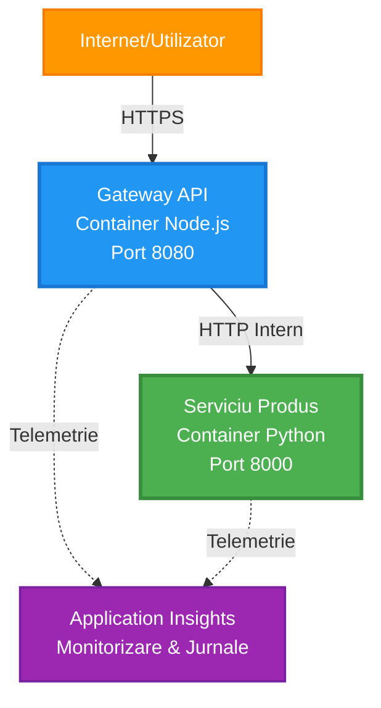
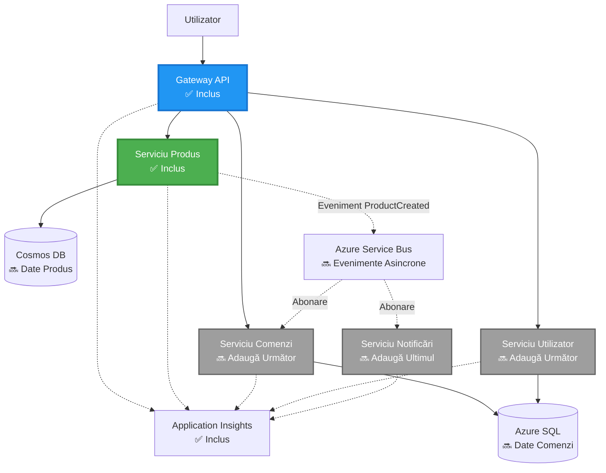
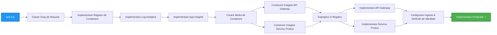
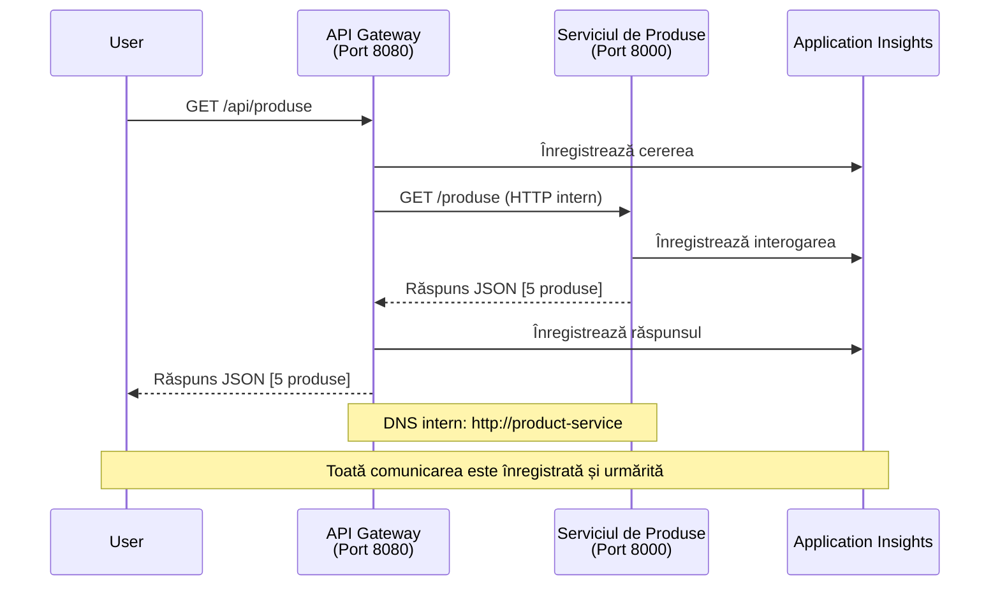

# Arhitectura Microservicii - Exemplu de Aplicație Container

⏱️ **Timp Estimat**: 25-35 minute | 💰 **Cost Estimat**: ~$50-100/lună | ⭐ **Complexitate**: Avansată

**📚 Parcurs de Învățare:**
- ← Anterior: [API Simplu Flask](../../../../examples/container-app/simple-flask-api) - Bazele unui container unic
- 🎯 **Ești Aici**: Arhitectura Microservicii (fundament cu 2 servicii)
- → Următor: [Integrare AI](../../../../docs/ai-foundry) - Adaugă inteligență serviciilor tale
- 🏠 [Pagina Principală a Cursului](../../README.md)

---

O **arhitectură simplificată dar funcțională** de microservicii, implementată pe Azure Container Apps folosind AZD CLI. Acest exemplu demonstrează comunicarea între servicii, orchestrarea containerelor și monitorizarea într-o configurație practică cu 2 servicii.

> **📚 Abordare de Învățare**: Acest exemplu începe cu o arhitectură minimă de 2 servicii (API Gateway + Serviciu Backend) pe care o poți implementa și învăța. După ce stăpânești această bază, oferim ghidare pentru extinderea către un ecosistem complet de microservicii.

## Ce Vei Învăța

După finalizarea acestui exemplu, vei:
- Implementa mai multe containere pe Azure Container Apps
- Realiza comunicarea între servicii cu rețele interne
- Configura scalarea bazată pe mediu și verificările de sănătate
- Monitoriza aplicații distribuite cu Application Insights
- Înțelege modelele de implementare ale microserviciilor și cele mai bune practici
- Învăța extinderea progresivă de la arhitecturi simple la complexe

## Arhitectură

### Faza 1: Ce Construim (Inclus în Acest Exemplu)


**Detalii Componentă:**

| Componentă | Scop | Acces | Resurse |
|------------|------|-------|---------|
| **API Gateway** | Direcționează cererile externe către serviciile backend | Public (HTTPS) | 1 vCPU, 2GB RAM, 2-20 replici |
| **Serviciu Produse** | Gestionează catalogul de produse cu date în memorie | Doar intern | 0.5 vCPU, 1GB RAM, 1-10 replici |
| **Application Insights** | Jurnalizare centralizată și trasabilitate distribuită | Portal Azure | 1-2 GB/lună ingestie de date |

**De ce să Începem Simplu?**
- ✅ Implementare și înțelegere rapidă (25-35 minute)
- ✅ Învățare a modelelor de bază ale microserviciilor fără complexitate
- ✅ Cod funcțional pe care îl poți modifica și experimenta
- ✅ Costuri reduse pentru învățare (~$50-100/lună vs $300-1400/lună)
- ✅ Construirea încrederii înainte de a adăuga baze de date și cozi de mesaje

**Analogie**: Gândește-te la asta ca la învățarea condusului. Începi într-o parcare goală (2 servicii), stăpânești bazele, apoi progresezi către traficul urban (5+ servicii cu baze de date).

### Faza 2: Extindere Viitoare (Arhitectură de Referință)

După ce stăpânești arhitectura cu 2 servicii, poți extinde către:


Vezi secțiunea "Ghid de Extindere" la final pentru instrucțiuni pas cu pas.

## Funcționalități Incluse

✅ **Descoperirea Serviciilor**: Descoperire automată bazată pe DNS între containere  
✅ **Balansare de Sarcină**: Balansare de sarcină integrată între replici  
✅ **Auto-scalare**: Scalare independentă per serviciu bazată pe cereri HTTP  
✅ **Monitorizare Sănătate**: Probele de liveness și readiness pentru ambele servicii  
✅ **Jurnalizare Distribuită**: Jurnalizare centralizată cu Application Insights  
✅ **Rețea Internă**: Comunicare sigură între servicii  
✅ **Orchestrare Containere**: Implementare și scalare automată  
✅ **Actualizări Fără Timp de Nefuncționare**: Actualizări progresive cu gestionarea reviziilor  

## Cerințe Prealabile

### Instrumente Necesare

Înainte de a începe, verifică dacă ai aceste instrumente instalate:

1. **[Azure Developer CLI (azd)](https://learn.microsoft.com/azure/developer/azure-developer-cli/install-azd)** (versiunea 1.0.0 sau mai mare)
   ```bash
   azd version
   # Rezultatul așteptat: versiunea azd 1.0.0 sau mai mare
   ```

2. **[Azure CLI](https://learn.microsoft.com/cli/azure/install-azure-cli)** (versiunea 2.50.0 sau mai mare)
   ```bash
   az --version
   # Rezultatul așteptat: azure-cli 2.50.0 sau mai mare
   ```

3. **[Docker](https://www.docker.com/get-started)** (pentru dezvoltare/testare locală - opțional)
   ```bash
   docker --version
   # Rezultatul așteptat: Versiunea Docker 20.10 sau mai mare
   ```

### Verifică Configurația

Rulează aceste comenzi pentru a confirma că ești pregătit:

```bash
# Verificați Azure Developer CLI
azd version
# ✅ Așteptat: versiunea azd 1.0.0 sau mai mare

# Verificați Azure CLI
az --version
# ✅ Așteptat: azure-cli 2.50.0 sau mai mare

# Verificați Docker (opțional)
docker --version
# ✅ Așteptat: versiunea Docker 20.10 sau mai mare
```

**Criterii de Succes**: Toate comenzile returnează numere de versiune care se potrivesc sau depășesc minimul.

### Cerințe Azure

- Un **abonament Azure** activ ([creează un cont gratuit](https://azure.microsoft.com/free/))
- Permisiuni pentru a crea resurse în abonamentul tău
- Rolul **Contributor** pe abonament sau grupul de resurse

### Cerințe de Cunoștințe

Acesta este un exemplu de **nivel avansat**. Ar trebui să ai:
- Finalizat exemplul [API Simplu Flask](../../../../examples/container-app/simple-flask-api) 
- Înțelegere de bază a arhitecturii microserviciilor
- Familiaritate cu API-urile REST și HTTP
- Înțelegerea conceptelor de container

**Nou în Container Apps?** Începe cu exemplul [API Simplu Flask](../../../../examples/container-app/simple-flask-api) pentru a învăța bazele.

## Start Rapid (Pas cu Pas)

### Pasul 1: Clonează și Navighează

```bash
git clone https://github.com/microsoft/AZD-for-beginners.git
cd AZD-for-beginners/examples/microservices
```

**✓ Verificare Succes**: Verifică dacă vezi `azure.yaml`:
```bash
ls
# Așteptat: README.md, azure.yaml, infra/, src/
```

### Pasul 2: Autentificare cu Azure

```bash
azd auth login
```

Aceasta deschide browserul pentru autentificarea Azure. Conectează-te cu acreditările tale Azure.

**✓ Verificare Succes**: Ar trebui să vezi:
```
Logged in to Azure.
```

### Pasul 3: Inițializează Mediul

```bash
azd init
```

**Prompturi pe care le vei vedea**:
- **Nume mediu**: Introdu un nume scurt (ex.: `microservices-dev`)
- **Abonament Azure**: Selectează abonamentul tău
- **Locație Azure**: Alege o regiune (ex.: `eastus`, `westeurope`)

**✓ Verificare Succes**: Ar trebui să vezi:
```
SUCCESS: New project initialized!
```

### Pasul 4: Implementare Infrastructură și Servicii

```bash
azd up
```

**Ce se întâmplă** (durează 8-12 minute):


**✓ Verificare Succes**: Ar trebui să vezi:
```
SUCCESS: Your application was deployed to Azure in X minutes Y seconds.
Endpoint: https://api-gateway-<unique-id>.azurecontainerapps.io
```

**⏱️ Timp**: 8-12 minute

### Pasul 5: Testează Implementarea

```bash
# Obține punctul final al gateway-ului
GATEWAY_URL=$(azd env get-values | grep API_GATEWAY_URL | cut -d '=' -f2 | tr -d '"')

# Testează sănătatea API Gateway
curl $GATEWAY_URL/health
```

**✅ Rezultat așteptat:**
```json
{
  "status": "healthy",
  "service": "api-gateway",
  "timestamp": "2025-11-19T10:30:00Z"
}
```

**Testează serviciul de produse prin gateway**:
```bash
# Listează produsele
curl $GATEWAY_URL/api/products
```

**✅ Rezultat așteptat:**
```json
[
  {"id":1,"name":"Laptop","price":999.99,"stock":50},
  {"id":2,"name":"Mouse","price":29.99,"stock":200},
  {"id":3,"name":"Keyboard","price":79.99,"stock":150}
]
```

**✓ Verificare Succes**: Ambele puncte de acces returnează date JSON fără erori.

---

**🎉 Felicitări!** Ai implementat o arhitectură de microservicii pe Azure!

## Structura Proiectului

Toate fișierele de implementare sunt incluse—acesta este un exemplu complet și funcțional:

```
microservices/
│
├── README.md                         # This file
├── azure.yaml                        # AZD configuration
├── .gitignore                        # Git ignore patterns
│
├── infra/                           # Infrastructure as Code (Bicep)
│   ├── main.bicep                   # Main orchestration
│   ├── abbreviations.json           # Naming conventions
│   ├── core/                        # Shared infrastructure
│   │   ├── container-apps-environment.bicep  # Container environment + registry
│   │   └── monitor.bicep            # Application Insights + Log Analytics
│   └── app/                         # Service definitions
│       ├── api-gateway.bicep        # API Gateway container app
│       └── product-service.bicep    # Product Service container app
│
└── src/                             # Application source code
    ├── api-gateway/                 # Node.js API Gateway
    │   ├── app.js                   # Express server with routing
    │   ├── package.json             # Node dependencies
    │   └── Dockerfile               # Container definition
    └── product-service/             # Python Product Service
        ├── main.py                  # Flask API with product data
        ├── requirements.txt         # Python dependencies
        └── Dockerfile               # Container definition
```

**Ce Face Fiecare Componentă:**

**Infrastructură (infra/)**:
- `main.bicep`: Orchestrarea tuturor resurselor Azure și a dependențelor lor
- `core/container-apps-environment.bicep`: Creează mediul Container Apps și Azure Container Registry
- `core/monitor.bicep`: Configurează Application Insights pentru jurnalizare distribuită
- `app/*.bicep`: Definiții individuale ale aplicațiilor container cu scalare și verificări de sănătate

**API Gateway (src/api-gateway/)**:
- Serviciu orientat spre public care direcționează cererile către serviciile backend
- Implementează jurnalizare, gestionarea erorilor și redirecționarea cererilor
- Demonstrează comunicarea HTTP între servicii

**Serviciu Produse (src/product-service/)**:
- Serviciu intern cu catalog de produse (în memorie pentru simplitate)
- API REST cu verificări de sănătate
- Exemplu de model backend microserviciu

## Prezentare Generală a Serviciilor

### API Gateway (Node.js/Express)

**Port**: 8080  
**Acces**: Public (ingress extern)  
**Scop**: Direcționează cererile primite către serviciile backend corespunzătoare  

**Puncte de Acces**:
- `GET /` - Informații despre serviciu
- `GET /health` - Punct de verificare a sănătății
- `GET /api/products` - Redirecționează către serviciul de produse (listare toate)
- `GET /api/products/:id` - Redirecționează către serviciul de produse (obține după ID)

**Funcționalități Cheie**:
- Redirecționarea cererilor cu axios
- Jurnalizare centralizată
- Gestionarea erorilor și a timeout-urilor
- Descoperirea serviciilor prin variabile de mediu
- Integrare Application Insights

**Fragment de Cod** (`src/api-gateway/app.js`):
```javascript
// Comunicare între servicii interne
app.get('/api/products', async (req, res) => {
  const response = await axios.get(`${PRODUCT_SERVICE_URL}/products`, {
    timeout: 5000
  });
  res.json(response.data);
});
```

### Serviciu Produse (Python/Flask)

**Port**: 8000  
**Acces**: Doar intern (fără ingress extern)  
**Scop**: Gestionează catalogul de produse cu date în memorie  

**Puncte de Acces**:
- `GET /` - Informații despre serviciu
- `GET /health` - Punct de verificare a sănătății
- `GET /products` - Listează toate produsele
- `GET /products/<id>` - Obține produsul după ID

**Funcționalități Cheie**:
- API RESTful cu Flask
- Stocare de produse în memorie (simplu, fără bază de date)
- Monitorizare sănătate cu probe
- Jurnalizare structurată
- Integrare Application Insights

**Model de Date**:
```python
{
  "id": 1,
  "name": "Laptop",
  "description": "High-performance laptop",
  "price": 999.99,
  "stock": 50
}
```

**De ce Doar Intern?**
Serviciul de produse nu este expus public. Toate cererile trebuie să treacă prin API Gateway, care oferă:
- Securitate: Punct de acces controlat
- Flexibilitate: Poți schimba backend-ul fără a afecta clienții
- Monitorizare: Jurnalizare centralizată a cererilor

## Înțelegerea Comunicării între Servicii

### Cum Comunică Serviciile Între Ele


În acest exemplu, API Gateway comunică cu Serviciul Produse folosind **apeluri HTTP interne**:

```javascript
// Gateway API (src/api-gateway/app.js)
const PRODUCT_SERVICE_URL = process.env.PRODUCT_SERVICE_URL;

// Efectuați cerere HTTP internă
const response = await axios.get(`${PRODUCT_SERVICE_URL}/products`);
```

**Puncte Cheie**:

1. **Descoperire Bazată pe DNS**: Container Apps oferă automat DNS pentru servicii interne
   - FQDN Serviciu Produse: `product-service.internal.<environment>.azurecontainerapps.io`
   - Simplificat ca: `http://product-service` (Container Apps îl rezolvă)

2. **Fără Expunere Publică**: Serviciul Produse are `external: false` în Bicep
   - Accesibil doar în mediul Container Apps
   - Nu poate fi accesat de pe internet

3. **Variabile de Mediu**: URL-urile serviciilor sunt injectate la momentul implementării
   - Bicep transmite FQDN-ul intern către gateway
   - Fără URL-uri hardcodate în codul aplicației

**Analogie**: Gândește-te la asta ca la camerele de birou. API Gateway este recepția (orientată spre public), iar Serviciul Produse este o cameră de birou (doar internă). Vizitatorii trebuie să treacă prin recepție pentru a ajunge la orice cameră.

## Opțiuni de Implementare

### Implementare Completă (Recomandată)

```bash
# Implementați infrastructura și ambele servicii
azd up
```

Aceasta implementează:
1. Mediul Container Apps
2. Application Insights
3. Container Registry
4. Container API Gateway
5. Container Serviciu Produse

**Timp**: 8-12 minute

### Implementare Serviciu Individual

```bash
# Implementați doar un serviciu (după azd up inițial)
azd deploy api-gateway

# Sau implementați serviciul de produs
azd deploy product-service
```

**Caz de Utilizare**: Când ai actualizat codul într-un serviciu și vrei să implementezi doar acel serviciu.

### Actualizare Configurație

```bash
# Schimbă parametrii de scalare
azd env set GATEWAY_MAX_REPLICAS 30

# Redistribuie cu noua configurație
azd up
```

## Configurație

### Configurație Scalare

Ambele servicii sunt configurate cu auto-scalare bazată pe HTTP în fișierele Bicep:

**API Gateway**:
- Min replici: 2 (întotdeauna cel puțin 2 pentru disponibilitate)
- Max replici: 20
- Trigger scalare: 50 cereri simultane per replică

**Serviciu Produse**:
- Min replici: 1 (poate scala la zero dacă este necesar)
- Max replici: 10
- Trigger scalare: 100 cereri simultane per replică

**Personalizează Scalarea** (în `infra/app/*.bicep`):
```bicep
scale: {
  minReplicas: 1
  maxReplicas: 10
  rules: [
    {
      name: 'http-scale-rule'
      http: {
        metadata: {
          concurrentRequests: '100'  // Adjust this
        }
      }
    }
  ]
}
```

### Alocare Resurse

**API Gateway**:
- CPU: 1.0 vCPU
- Memorie: 2 GiB
- Motiv: Gestionează tot traficul extern

**Serviciu Produse**:
- CPU: 0.5 vCPU
- Memorie: 1 GiB
- Motiv: Operațiuni ușoare în memorie

### Verificări de Sănătate

Ambele servicii includ probe de liveness și readiness:

```bicep
probes: [
  {
    type: 'Liveness'
    httpGet: {
      path: '/health'
      port: 8080
    }
    initialDelaySeconds: 10
    periodSeconds: 30
  }
  {
    type: 'Readiness'
    httpGet: {
      path: '/health'
      port: 8080
    }
    initialDelaySeconds: 5
    periodSeconds: 10
  }
]
```

**Ce Înseamnă Acest Lucru**:
- **Liveness**: Dacă verificarea sănătății eșuează, Container Apps repornește containerul
- **Readiness**: Dacă nu este gata, Container Apps oprește direcționarea traficului către acea replică

## Monitorizare și Observabilitate

### Vizualizare Jurnale Servicii

```bash
# Transmite jurnale de la API Gateway
azd logs api-gateway --follow

# Vizualizează jurnalele recente ale serviciului de produse
azd logs product-service --tail 100

# Vizualizează toate jurnalele de la ambele servicii
azd logs --follow
```

**Rezultat Așteptat**:
```
[api-gateway] API Gateway listening on port 8080
[api-gateway] Product Service URL: http://product-service
[api-gateway] GET /api/products 200 - 45ms
[product-service] Retrieved 5 products
```

### Interogări Application Insights

Accesează Application Insights în Portalul Azure, apoi rulează aceste interogări:

**Găsește Cereri Lente**:
```kusto
requests
| where timestamp > ago(1h)
| where duration > 1000  // Requests taking >1 second
| summarize count() by name, cloud_RoleName
| order by count_ desc
```

**Urmărește Apelurile Serviciu-la-Serviciu**:
```kusto
dependencies
| where timestamp > ago(1h)
| where type == "Http"
| project timestamp, name, target, duration, success
| order by timestamp desc
```

**Rata Erorilor pe Serviciu**:
```kusto
exceptions
| where timestamp > ago(24h)
| summarize errorCount = count() by cloud_RoleName, type
| order by errorCount desc
```

**Volumul Cererilor în Timp**:
```kusto
requests
| where timestamp > ago(1h)
| summarize requestCount = count() by bin(timestamp, 5m), cloud_RoleName
| render timechart
```

### Accesare Tablou de Bord Monitorizare

```bash
# Obține detalii despre Application Insights
azd env get-values | grep APPLICATIONINSIGHTS

# Deschide monitorizarea portalului Azure
az monitor app-insights component show \
  --app $(azd env get-values | grep APPLICATIONINSIGHTS_CONNECTION_STRING | cut -d '=' -f2) \
  --resource-group $(azd env get-values | grep AZURE_RESOURCE_GROUP | cut -d '=' -f2) \
  --query "appId" -o tsv
```

### Metrice Live

1. Navighează la Application Insights în Portalul Azure
2. Click pe "Live Metrics"
3. Vezi cererile, erorile și performanța în timp real
4. Testează rulând: `curl $(azd env get-values | grep API_GATEWAY_URL | cut -d '=' -f2 | tr -d '"')/api/products`

## Exerciții Practice

### Exercițiul 1: Adaugă un Nou Endpoint pentru Produse ⭐ (Ușor)

**Scop**: Adaugă un endpoint POST pentru a crea produse noi

**Punct de Pornire**: `src/product-service/main.py`

**Pași**:

1. Adaugă acest endpoint după funcția `get_product` în `main.py`:

```python
@app.route('/products', methods=['POST'])
def create_product():
    """Create a new product"""
    data = request.get_json()
    
    # Validați câmpurile obligatorii
    if not data or 'name' not in data or 'price' not in data:
        return jsonify({'error': 'Missing required fields: name, price'}), 400
    
    new_id = max(p['id'] for p in products) + 1
    new_product = {
        'id': new_id,
        'name': data['name'],
        'description': data.get('description', ''),
        'price': float(data['price']),
        'stock': int(data.get('stock', 0))
    }
    products.append(new_product)
    logger.info(f"Created product {new_id}")
    return jsonify(new_product), 201
```

2. Adaugă ruta POST la API Gateway (`src/api-gateway/app.js`):

```javascript
// Adăugați acest lucru după ruta GET /api/products
app.post('/api/products', async (req, res) => {
  try {
    console.log(`Forwarding POST request to ${PRODUCT_SERVICE_URL}/products`);
    const response = await axios.post(`${PRODUCT_SERVICE_URL}/products`, req.body, {
      timeout: 5000
    });
    res.status(201).json(response.data);
  } catch (error) {
    console.error('Error calling product service:', error.message);
    res.status(503).json({
      error: 'Product service unavailable',
      message: error.message
    });
  }
});
```

3. Redeployați ambele servicii:

```bash
azd deploy product-service
azd deploy api-gateway
```

4. Testați noul endpoint:

```bash
GATEWAY_URL=$(azd env get-values | grep API_GATEWAY_URL | cut -d '=' -f2 | tr -d '"')

# Creează un produs nou
curl -X POST $GATEWAY_URL/api/products \
  -H "Content-Type: application/json" \
  -d '{"name":"USB Cable","price":9.99,"stock":500}'
```

**✅ Rezultatul așteptat:**
```json
{"id":6,"name":"USB Cable","description":"","price":9.99,"stock":500}
```

5. Verificați dacă apare în listă:

```bash
curl $GATEWAY_URL/api/products
# Ar trebui să afișeze acum 6 produse, inclusiv noul cablu USB
```

**Criterii de succes**:
- ✅ Cererea POST returnează HTTP 201
- ✅ Produsul nou apare în lista GET /api/products
- ✅ Produsul are ID incrementat automat

**Timp**: 10-15 minute

---

### Exercițiul 2: Modificați regulile de autoscalare ⭐⭐ (Mediu)

**Obiectiv**: Schimbați Product Service pentru a scala mai agresiv

**Punct de pornire**: `infra/app/product-service.bicep`

**Pași**:

1. Deschideți `infra/app/product-service.bicep` și găsiți blocul `scale` (aproximativ linia 95)

2. Schimbați de la:
```bicep
scale: {
  minReplicas: 1
  maxReplicas: 10
  rules: [
    {
      name: 'http-scale-rule'
      http: {
        metadata: {
          concurrentRequests: '100'  // OLD
        }
      }
    }
  ]
}
```

La:
```bicep
scale: {
  minReplicas: 2  // Always have 2 running
  maxReplicas: 20  // Allow more scaling
  rules: [
    {
      name: 'http-scale-rule'
      http: {
        metadata: {
          concurrentRequests: '20'  // Scale at lower threshold
        }
      }
    }
  ]
}
```

3. Redeployați infrastructura:

```bash
azd up
```

4. Verificați noua configurație de scalare:

```bash
az containerapp show \
  --name $(azd env get-values | grep PRODUCT_SERVICE | head -1 | cut -d '/' -f5) \
  --resource-group $(azd env get-values | grep AZURE_RESOURCE_GROUP | cut -d '=' -f2 | tr -d '"') \
  --query "properties.template.scale" -o json
```

**✅ Rezultatul așteptat:**
```json
{
  "minReplicas": 2,
  "maxReplicas": 20,
  "rules": [...]
}
```

5. Testați autoscalarea sub încărcare:

```bash
# Generează cereri simultane
for i in {1..500}; do curl $GATEWAY_URL/api/products & done

# Observă cum are loc scalarea
azd logs product-service --follow
# Caută: Evenimente de scalare ale Container Apps
```

**Criterii de succes**:
- ✅ Product Service rulează mereu cel puțin 2 replici
- ✅ Sub încărcare, scalează la mai mult de 2 replici
- ✅ Portalul Azure afișează noile reguli de scalare

**Timp**: 15-20 minute

---

### Exercițiul 3: Adăugați o interogare personalizată de monitorizare ⭐⭐ (Mediu)

**Obiectiv**: Creați o interogare personalizată în Application Insights pentru a urmări performanța API-ului de produse

**Pași**:

1. Navigați la Application Insights în Azure Portal:
   - Accesați Azure Portal
   - Găsiți grupul de resurse (rg-microservices-*)
   - Faceți clic pe resursa Application Insights

2. Faceți clic pe "Logs" în meniul din stânga

3. Creați această interogare:

```kusto
requests
| where timestamp > ago(1h)
| where name contains "products"
| summarize 
    RequestCount = count(),
    AvgDuration = avg(duration),
    P95Duration = percentile(duration, 95),
    SuccessRate = 100.0 * countif(success == true) / count()
  by bin(timestamp, 5m)
| render timechart
```

4. Faceți clic pe "Run" pentru a executa interogarea

5. Salvați interogarea:
   - Faceți clic pe "Save"
   - Nume: "Product API Performance"
   - Categorie: "Performance"

6. Generați trafic de test:

```bash
for i in {1..100}; do curl $GATEWAY_URL/api/products; sleep 1; done
```

7. Reîmprospătați interogarea pentru a vedea datele

**✅ Rezultatul așteptat:**
- Grafic care arată numărul de cereri în timp
- Durata medie < 500ms
- Rata de succes = 100%
- Interval de timp de 5 minute

**Criterii de succes**:
- ✅ Interogarea arată 100+ cereri
- ✅ Rata de succes este 100%
- ✅ Durata medie < 500ms
- ✅ Graficul afișează intervale de timp de 5 minute

**Rezultat de învățare**: Înțelegeți cum să monitorizați performanța serviciilor cu interogări personalizate

**Timp**: 10-15 minute

---

### Exercițiul 4: Implementați logica de retry ⭐⭐⭐ (Avansat)

**Obiectiv**: Adăugați logica de retry în API Gateway când Product Service este temporar indisponibil

**Punct de pornire**: `src/api-gateway/app.js`

**Pași**:

1. Instalați biblioteca de retry:

```bash
cd src/api-gateway
npm install axios-retry --save
cd ../..
```

2. Actualizați `src/api-gateway/app.js` (adăugați după importul axios):

```javascript
const axiosRetry = require('axios-retry');

// Configurați logica de reîncercare
axiosRetry(axios, {
  retries: 3,
  retryDelay: (retryCount) => {
    return retryCount * 1000; // 1s, 2s, 3s
  },
  retryCondition: (error) => {
    // Reîncercați în cazul erorilor de rețea sau răspunsurilor 5xx
    return axiosRetry.isNetworkOrIdempotentRequestError(error) ||
           (error.response && error.response.status >= 500);
  }
});

console.log('Retry logic configured: 3 retries with exponential backoff');
```

3. Redeployați API Gateway:

```bash
azd deploy api-gateway
```

4. Testați comportamentul de retry simulând o defecțiune a serviciului:

```bash
# Redimensionați serviciul de produse la 0 (simulați eșecul)
az containerapp update \
  --name $(azd env get-values | grep PRODUCT_SERVICE | head -1 | cut -d '/' -f5) \
  --resource-group $(azd env get-values | grep AZURE_RESOURCE_GROUP | cut -d '=' -f2 | tr -d '"') \
  --min-replicas 0 \
  --max-replicas 0

# Încercați să accesați produsele (va încerca de 3 ori)
time curl -v $GATEWAY_URL/api/products
# Observați: Răspunsul durează ~6 secunde (1s + 2s + 3s încercări)

# Restaurați serviciul de produse
az containerapp update \
  --name $(azd env get-values | grep PRODUCT_SERVICE | head -1 | cut -d '/' -f5) \
  --resource-group $(azd env get-values | grep AZURE_RESOURCE_GROUP | cut -d '=' -f2 | tr -d '"') \
  --min-replicas 1 \
  --max-replicas 10
```

5. Vizualizați logurile de retry:

```bash
azd logs api-gateway --tail 50
# Căutați: Mesaje de încercare de reîncercare
```

**✅ Comportament așteptat:**
- Cererile se retry de 3 ori înainte de a eșua
- Fiecare retry așteaptă mai mult (1s, 2s, 3s)
- Cererile reușesc după repornirea serviciului
- Logurile arată încercările de retry

**Criterii de succes**:
- ✅ Cererile se retry de 3 ori înainte de a eșua
- ✅ Fiecare retry așteaptă mai mult (backoff exponențial)
- ✅ Cererile reușesc după repornirea serviciului
- ✅ Logurile arată încercările de retry

**Rezultat de învățare**: Înțelegeți modelele de reziliență în microservicii (circuit breakers, retry, timeouts)

**Timp**: 20-25 minute

---

## Punct de verificare a cunoștințelor

După finalizarea acestui exemplu, verificați-vă înțelegerea:

### 1. Comunicare între servicii ✓

Testați-vă cunoștințele:
- [ ] Puteți explica cum API Gateway descoperă Product Service? (Descoperire bazată pe DNS)
- [ ] Ce se întâmplă dacă Product Service este offline? (Gateway returnează eroarea 503)
- [ ] Cum ați adăuga un al treilea serviciu? (Creați un nou fișier Bicep, adăugați-l în main.bicep, creați folderul src)

**Verificare practică**:
```bash
# Simulează eșecul serviciului
az containerapp update --name <product-service-name> --min-replicas 0 --max-replicas 0
curl $GATEWAY_URL/api/products
# ✅ Așteptat: 503 Serviciu Indisponibil

# Restaurează serviciul
az containerapp update --name <product-service-name> --min-replicas 1 --max-replicas 10
```

### 2. Monitorizare și observabilitate ✓

Testați-vă cunoștințele:
- [ ] Unde vedeți logurile distribuite? (Application Insights în Azure Portal)
- [ ] Cum urmăriți cererile lente? (Interogare Kusto: `requests | where duration > 1000`)
- [ ] Puteți identifica ce serviciu a cauzat o eroare? (Verificați câmpul `cloud_RoleName` în loguri)

**Verificare practică**:
```bash
# Generează o simulare de cerere lentă
curl "$GATEWAY_URL/api/products?delay=2000"

# Interoghează Application Insights pentru cereri lente
# Navighează la Azure Portal → Application Insights → Logs
# Rulează: requests | where duration > 1000 | project timestamp, name, duration, cloud_RoleName
```

### 3. Scalare și performanță ✓

Testați-vă cunoștințele:
- [ ] Ce declanșează autoscalarea? (Reguli de cereri HTTP concurente: 50 pentru gateway, 100 pentru produs)
- [ ] Câte replici rulează acum? (Verificați cu `az containerapp revision list`)
- [ ] Cum ați scala Product Service la 5 replici? (Actualizați minReplicas în Bicep)

**Verificare practică**:
```bash
# Generează sarcină pentru a testa autoscalarea
for i in {1..1000}; do curl $GATEWAY_URL/api/products & done

# Urmărește creșterea replicilor
azd logs api-gateway --follow
# ✅ Așteptat: Vezi evenimentele de scalare în jurnale
```

**Criterii de succes**: Puteți răspunde la toate întrebările și verifica cu comenzi practice.

---

## Analiza costurilor

### Costuri estimate lunare (Pentru acest exemplu cu 2 servicii)

| Resursă | Configurație | Cost estimat |
|---------|--------------|--------------|
| API Gateway | 2-20 replici, 1 vCPU, 2GB RAM | $30-150 |
| Product Service | 1-10 replici, 0.5 vCPU, 1GB RAM | $15-75 |
| Container Registry | Tier de bază | $5 |
| Application Insights | 1-2 GB/lună | $5-10 |
| Log Analytics | 1 GB/lună | $3 |
| **Total** | | **$58-243/lună** |

### Defalcarea costurilor pe utilizare

**Trafic redus** (testare/învățare): ~60$/lună
- API Gateway: 2 replici × 24/7 = $30
- Product Service: 1 replică × 24/7 = $15
- Monitorizare + Registry = $13

**Trafic moderat** (producție mică): ~120$/lună
- API Gateway: 5 replici medii = $75
- Product Service: 3 replici medii = $45
- Monitorizare + Registry = $13

**Trafic intens** (perioade aglomerate): ~240$/lună
- API Gateway: 15 replici medii = $225
- Product Service: 8 replici medii = $120
- Monitorizare + Registry = $13

### Sfaturi pentru optimizarea costurilor

1. **Scalați la zero pentru dezvoltare**:
   ```bicep
   scale: {
     minReplicas: 0  // Save $30-40/month when not in use
     maxReplicas: 10
   }
   ```

2. **Folosiți Consumption Plan pentru Cosmos DB** (când îl adăugați):
   - Plătiți doar pentru ceea ce utilizați
   - Fără taxe minime

3. **Setați Sampling în Application Insights**:
   ```javascript
   appInsights.defaultClient.config.samplingPercentage = 50; // Eșantionează 50% din cereri
   ```

4. **Ștergeți resursele când nu sunt necesare**:
   ```bash
   azd down --force --purge
   ```

### Opțiuni gratuite

Pentru învățare/testare, luați în considerare:
- ✅ Folosiți credite gratuite Azure ($200 pentru primele 30 de zile cu conturi noi)
- ✅ Mențineți replicile la minimum (economisiți ~50% din costuri)
- ✅ Ștergeți după testare (fără taxe continue)
- ✅ Scalați la zero între sesiunile de învățare

**Exemplu**: Rularea acestui exemplu timp de 2 ore/zi × 30 zile = ~5$/lună în loc de 60$/lună

---

## Referință rapidă pentru depanare

### Problemă: `azd up` eșuează cu "Subscription not found"

**Soluție**:
```bash
# Conectați-vă din nou cu abonament explicit
az account set --subscription <your-subscription-id>
azd env set AZURE_SUBSCRIPTION_ID <your-subscription-id>
azd up
```

### Problemă: API Gateway returnează 503 "Product service unavailable"

**Diagnosticare**:
```bash
# Verificați jurnalele serviciului de produs
azd logs product-service --tail 50

# Verificați sănătatea serviciului de produs
az containerapp show \
  --name $(azd env get-values | grep PRODUCT_SERVICE | head -1 | cut -d '/' -f5) \
  --resource-group $(azd env get-values | grep AZURE_RESOURCE_GROUP | cut -d '=' -f2 | tr -d '"') \
  --query "properties.runningStatus"
```

**Cauze comune**:
1. Product service nu a pornit (verificați logurile pentru erori Python)
2. Health check eșuează (verificați dacă endpoint-ul `/health` funcționează)
3. Build-ul imaginii containerului a eșuat (verificați registry-ul pentru imagine)

### Problemă: Autoscalarea nu funcționează

**Diagnosticare**:
```bash
# Verificați numărul curent de replici
az containerapp revision list \
  --name $(azd env get-values | grep API_GATEWAY | head -1 | cut -d '/' -f5) \
  --resource-group $(azd env get-values | grep AZURE_RESOURCE_GROUP | cut -d '=' -f2 | tr -d '"') \
  --query "[].properties.replicas"

# Generați sarcină pentru testare
for i in {1..1000}; do curl $GATEWAY_URL/api/products & done

# Urmăriți evenimentele de scalare
azd logs api-gateway --follow | grep -i scale
```

**Cauze comune**:
1. Încărcarea nu este suficient de mare pentru a declanșa regula de scalare (necesar >50 cereri concurente)
2. Numărul maxim de replici a fost deja atins (verificați configurația Bicep)
3. Regula de scalare configurată greșit în Bicep (verificați valoarea concurrentRequests)

### Problemă: Application Insights nu afișează loguri

**Diagnosticare**:
```bash
# Verificați dacă șirul de conexiune este setat
azd env get-values | grep APPLICATIONINSIGHTS

# Verificați dacă serviciile trimit telemetrie
az monitor app-insights component show \
  --app $(azd env get-values | grep APPLICATIONINSIGHTS_NAME | cut -d '=' -f2 | tr -d '"') \
  --resource-group $(azd env get-values | grep AZURE_RESOURCE_GROUP | cut -d '=' -f2 | tr -d '"') \
  --query "properties.InstrumentationKey"
```

**Cauze comune**:
1. String-ul de conexiune nu este transmis containerului (verificați variabilele de mediu)
2. SDK-ul Application Insights nu este configurat (verificați importurile în cod)
3. Firewall-ul blochează telemetria (rar, verificați regulile de rețea)

### Problemă: Build-ul Docker eșuează local

**Diagnosticare**:
```bash
# Testați construirea API Gateway
cd src/api-gateway
docker build -t test-gateway .

# Testați construirea serviciului de produs
cd ../product-service
docker build -t test-product .
```

**Cauze comune**:
1. Dependențe lipsă în package.json/requirements.txt
2. Erori de sintaxă în Dockerfile
3. Probleme de rețea la descărcarea dependențelor

**Încă aveți probleme?** Consultați [Ghidul de probleme comune](../../docs/troubleshooting/common-issues.md) sau [Depanare Azure Container Apps](https://learn.microsoft.com/azure/container-apps/troubleshooting)

---

## Curățare

Pentru a evita taxele continue, ștergeți toate resursele:

```bash
azd down --force --purge
```

**Prompt de confirmare**:
```
? Total resources to delete: 6, are you sure you want to continue? (y/N)
```

Tastați `y` pentru a confirma.

**Ce se șterge**:
- Mediul Container Apps
- Ambele Container Apps (gateway & product service)
- Container Registry
- Application Insights
- Log Analytics Workspace
- Grupul de resurse

**✓ Verificați curățarea**:
```bash
az group list --query "[?starts_with(name,'rg-microservices')]" --output table
```

Ar trebui să returneze gol.

---

## Ghid de extindere: De la 2 la 5+ servicii

După ce ați stăpânit această arhitectură cu 2 servicii, iată cum să extindeți:

### Faza 1: Adăugați persistența bazei de date (Pasul următor)

**Adăugați Cosmos DB pentru Product Service**:

1. Creați `infra/core/cosmos.bicep`:
   ```bicep
   resource cosmosAccount 'Microsoft.DocumentDB/databaseAccounts@2023-04-15' = {
     name: name
     location: location
     kind: 'GlobalDocumentDB'
     properties: {
       databaseAccountOfferType: 'Standard'
       consistencyPolicy: { defaultConsistencyLevel: 'Session' }
       locations: [{ locationName: location, failoverPriority: 0 }]
     }
   }
   ```

2. Actualizați Product Service pentru a utiliza Azure Cosmos DB Python SDK în loc de date în memorie

3. Cost suplimentar estimat: ~25$/lună (serverless)

### Faza 2: Adăugați al treilea serviciu (Order Management)

**Creați Order Service**:

1. Folder nou: `src/order-service/` (Python/Node.js/C#)
2. Bicep nou: `infra/app/order-service.bicep`
3. Actualizați API Gateway pentru a ruta `/api/orders`
4. Adăugați Azure SQL Database pentru persistența comenzilor

**Arhitectura devine**:
```
API Gateway → Product Service (Cosmos DB)
           → Order Service (Azure SQL)
```

### Faza 3: Adăugați comunicare asincronă (Service Bus)

**Implementați arhitectura bazată pe evenimente**:

1. Adăugați Azure Service Bus: `infra/core/servicebus.bicep`
2. Product Service publică evenimente "ProductCreated"
3. Order Service se abonează la evenimentele produsului
4. Adăugați Notification Service pentru procesarea evenimentelor

**Model**: Request/Response (HTTP) + Event-Driven (Service Bus)

### Faza 4: Adăugați autentificare utilizator

**Implementați User Service**:

1. Creați `src/user-service/` (Go/Node.js)
2. Adăugați Azure AD B2C sau autentificare JWT personalizată
3. API Gateway validează token-urile înainte de rutare
4. Serviciile verifică permisiunile utilizatorului

### Faza 5: Pregătire pentru producție

**Adăugați aceste componente**:
- ✅ Azure Front Door (balansare globală a încărcării)
- ✅ Azure Key Vault (gestionarea secretelor)
- ✅ Azure Monitor Workbooks (dashboard-uri personalizate)
- ✅ Pipeline CI/CD (GitHub Actions)
- ✅ Deployments Blue-Green
- ✅ Managed Identity pentru toate serviciile

**Cost arhitectură completă pentru producție**: ~300-1,400$/lună

---

## Aflați mai multe

### Documentație relevantă
- [Documentație Azure Container Apps](https://learn.microsoft.com/azure/container-apps/)
- [Ghidul arhitecturii microserviciilor](https://learn.microsoft.com/azure/architecture/guide/architecture-styles/microservices)
- [Application Insights pentru tracing distribuit](https://learn.microsoft.com/azure/azure-monitor/app/distributed-tracing)
- [Documentație Azure Developer CLI](https://learn.microsoft.com/azure/developer/azure-developer-cli/)

### Pași următori în acest curs
- ← Anterior: [API Flask simplu](../../../../examples/container-app/simple-flask-api) - Exemplu simplu cu un singur container
- → Următor: [Ghid de integrare AI](../../../../docs/ai-foundry) - Adăugați capabilități AI
- 🏠 [Pagina principală a cursului](../../README.md)

### Comparație: Când să folosiți ce

| Caracteristică | Container unic | Microservicii (Acesta) | Kubernetes (AKS) |
|----------------|----------------|------------------------|------------------|
| **Caz de utilizare** | Aplicații simple | Aplicații complexe | Aplicații enterprise |
| **Scalabilitate** | Serviciu unic | Scalare pe serviciu | Flexibilitate maximă |
| **Complexitate** | Scăzută | Medie | Ridicată |
| **Dimensiunea echipei** | 1-3 dezvoltatori | 3-10 dezvoltatori | 10+ dezvoltatori |
| **Cost** | ~15-50$/lună | ~60-250$/lună | ~150-500$/lună |
| **Timp de deploy** | 5-10 minute | 8-12 minute | 15-30 minute |
| **Cel mai potrivit pentru** | MVP-uri, prototipuri | Aplicații de producție | Multi-cloud, rețele avansate |

**Recomandare**: Începeți cu Container Apps (acest exemplu), treceți la AKS doar dacă aveți nevoie de funcționalități specifice Kubernetes.

---

## Întrebări frecvente

**Î: De ce doar 2 servicii în loc de 5+?**  
R: Progres educațional. Stăpâniți elementele de bază (comunicarea între servicii, monitorizarea, scalarea) cu un exemplu simplu înainte de a adăuga complexitate. Modelele pe care le învățați aici se aplică arhitecturilor cu 100 de servicii.

**Î: Pot să adaug mai multe servicii singur?**  
R: Absolut! Urmați ghidul de extindere de mai sus. Fiecare serviciu nou urmează același model: creați folderul src, creați fișierul Bicep, actualizați azure.yaml, implementați.

**Î: Este pregătit pentru producție?**  
R: Este o fundație solidă. Pentru producție, adăugați: identitate gestionată, Key Vault, baze de date persistente, pipeline CI/CD, alerte de monitorizare și strategie de backup.

**Î: De ce să nu folosesc Dapr sau alt service mesh?**  
R: Păstrați lucrurile simple pentru învățare. După ce înțelegeți rețelele native ale Container Apps, puteți adăuga Dapr pentru scenarii avansate (gestionarea stării, pub/sub, legături).

**Î: Cum pot depana local?**  
R: Rulați serviciile local cu Docker:  
```bash
cd src/api-gateway
docker build -t local-gateway .
docker run -p 8080:8080 -e PRODUCT_SERVICE_URL=http://localhost:8000 local-gateway
```
  
**Î: Pot folosi limbaje de programare diferite?**  
R: Da! Acest exemplu arată Node.js (gateway) + Python (serviciul de produse). Puteți combina orice limbaje care rulează în containere: C#, Go, Java, Ruby, PHP etc.

**Î: Ce fac dacă nu am credite Azure?**  
R: Folosiți nivelul gratuit Azure (primele 30 de zile cu conturi noi primesc credite de $200) sau implementați pentru perioade scurte de testare și ștergeți imediat. Acest exemplu costă ~2$/zi.

**Î: Cum diferă acest lucru de Azure Kubernetes Service (AKS)?**  
R: Container Apps este mai simplu (nu necesită cunoștințe Kubernetes), dar mai puțin flexibil. AKS vă oferă control complet Kubernetes, dar necesită mai multă expertiză. Începeți cu Container Apps, treceți la AKS dacă este necesar.

**Î: Pot folosi acest lucru cu servicii Azure existente?**  
R: Da! Puteți conecta la baze de date existente, conturi de stocare, Service Bus etc. Actualizați fișierele Bicep pentru a face referire la resursele existente în loc să creați altele noi.

---

> **🎓 Rezumatul traseului de învățare**: Ați învățat să implementați o arhitectură multi-serviciu cu scalare automată, rețea internă, monitorizare centralizată și modele pregătite pentru producție. Această fundație vă pregătește pentru sisteme distribuite complexe și arhitecturi microservicii de nivel enterprise.

**📚 Navigare în curs:**
- ← Anterior: [API simplu Flask](../../../../examples/container-app/simple-flask-api)
- → Următor: [Exemplu de integrare a bazei de date](../../../../database-app)
- 🏠 [Pagina principală a cursului](../../README.md)
- 📖 [Cele mai bune practici pentru Container Apps](../../docs/deployment/deployment-guide.md)

---

**✨ Felicitări!** Ați finalizat exemplul de microservicii. Acum înțelegeți cum să construiți, implementați și monitorizați aplicații distribuite pe Azure Container Apps. Sunteți gata să adăugați capabilități AI? Consultați [Ghidul de integrare AI](../../../../docs/ai-foundry)!

---

<!-- CO-OP TRANSLATOR DISCLAIMER START -->
**Declinare de responsabilitate**:  
Acest document a fost tradus folosind serviciul de traducere AI [Co-op Translator](https://github.com/Azure/co-op-translator). Deși ne străduim să asigurăm acuratețea, vă rugăm să fiți conștienți că traducerile automate pot conține erori sau inexactități. Documentul original în limba sa maternă ar trebui considerat sursa autoritară. Pentru informații critice, se recomandă traducerea profesională realizată de un specialist uman. Nu ne asumăm responsabilitatea pentru eventualele neînțelegeri sau interpretări greșite care pot apărea din utilizarea acestei traduceri.
<!-- CO-OP TRANSLATOR DISCLAIMER END -->