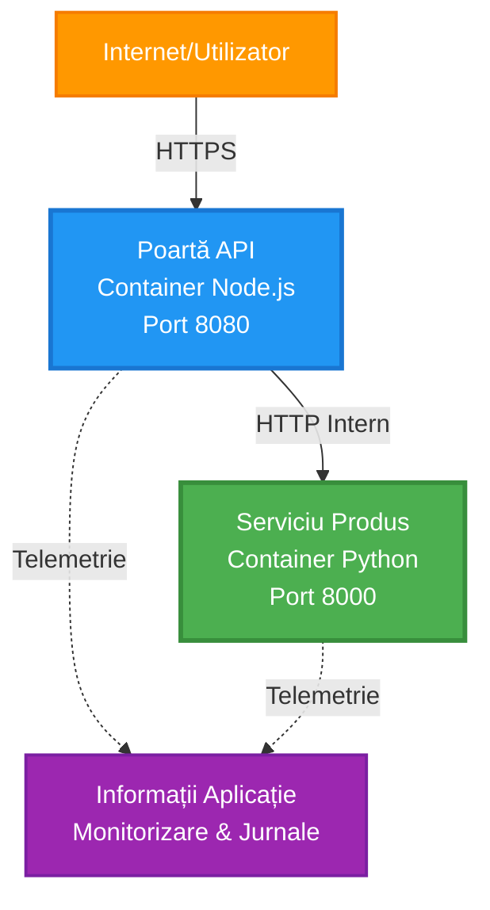
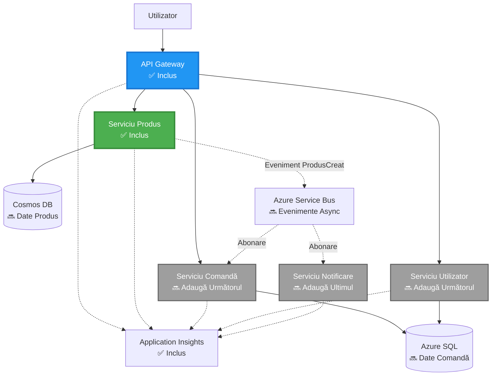
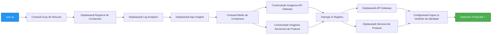
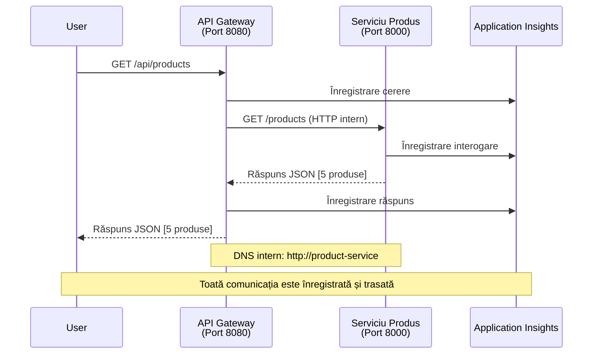

# Arhitectură Microservicii - Exemplu Container App

⏱️ **Timp estimat**: 25-35 minute | 💰 **Cost estimat**: ~50-100$/lună | ⭐ **Complexitate**: Avansat

**📚 Parcurs de învățare:**  
- ← Anterior: [Simple Flask API](../../../../examples/container-app/simple-flask-api) - Bazele containerului unic  
- 🎯 **Ești aici**: Arhitectura Microserviciilor (bază 2 servicii)  
- → Următor: [AI Integration](../../../../docs/ai-foundry) - Adaugă inteligență serviciilor tale  
- 🏠 [Pagina principală curs](../../README.md)

---

O arhitectură microservicii **simplificată, dar funcțională**, implementată pe Azure Container Apps folosind AZD CLI. Acest exemplu demonstrează comunicarea între servicii, orchestrarea containerelor și monitorizarea într-un setup practic cu 2 servicii.

> **📚 Abordare de învățare**: Acest exemplu începe cu o arhitectură minimă cu 2 servicii (API Gateway + Backend Service) pe care o poți efectiv implementa și studia. După ce stăpânești această bază, oferim ghiduri pentru extinderea la un ecosistem complet de microservicii.

## Ce vei învăța

Prin completarea acestui exemplu, vei:  
- Implementa multiple containere pe Azure Container Apps  
- Implementa comunicare între servicii cu rețea internă  
- Configura scalarea și verificările de sănătate în funcție de mediu  
- Monitoriza aplicații distribuite cu Application Insights  
- Înțelege modele și bune practici pentru implementarea microserviciilor  
- Învață extinderea progresivă de la arhitecturi simple la complexe

## Arhitectură

### Faza 1: Ce construim (inclus în acest exemplu)


```mermaid
graph TB
    Internet[Internet/Utilizator]
    Gateway[Poartă API<br/>Container Node.js<br/>Port 8080]
    Product[Serviciu Produs<br/>Container Python<br/>Port 8000]
    AppInsights[Informații Aplicație<br/>Monitorizare & Jurnale]
    
    Internet -->|HTTPS| Gateway
    Gateway -->|HTTP Intern| Product
    Gateway -.->|Telemetrie| AppInsights
    Product -.->|Telemetrie| AppInsights
    
    style Gateway fill:#2196F3,stroke:#1976D2,stroke-width:3px,color:#fff
    style Product fill:#4CAF50,stroke:#388E3C,stroke-width:3px,color:#fff
    style Internet fill:#FF9800,stroke:#F57C00,stroke-width:2px,color:#fff
    style AppInsights fill:#9C27B0,stroke:#7B1FA2,stroke-width:2px,color:#fff
```  
**Detalii componente:**

| Componentă | Scop | Acces | Resurse |
|------------|-------|-------|---------|
| **API Gateway** | Redirecționează cererile externe către serviciile backend | Public (HTTPS) | 1 vCPU, 2GB RAM, 2-20 replici |
| **Product Service** | Gestionează catalogul de produse în memorie | Doar intern | 0.5 vCPU, 1GB RAM, 1-10 replici |
| **Application Insights** | Logare centralizată și trasare distribuită | Azure Portal | 1-2 GB/lună ingestie date |

**De ce începem simplu?**  
- ✅ Implementare și înțelegere rapidă (25-35 minute)  
- ✅ Învață tiparele microserviciilor fără complexitate  
- ✅ Cod funcțional pe care îl poți modifica și experimenta  
- ✅ Cost redus pentru învățare (~50-100$/lună vs 300-1400$/lună)  
- ✅ Construiește încredere înainte de a adăuga baze de date și cozi de mesaje

**Analogie**: E ca și cum înveți să conduci. Începi într-o parcare goală (2 servicii), stăpânești bazele, apoi treci la trafic urban (5+ servicii cu baze de date).

### Faza 2: Extinderea viitoare (Arhitectură de referință)

După ce stăpânești arhitectura cu 2 servicii, poți extinde la:


```mermaid
graph TB
    User[Utilizator]
    Gateway[API Gateway<br/>✅ Inclus]
    Product[Serviciu Produs<br/>✅ Inclus]
    Order[Serviciu Comandă<br/>🔜 Adaugă Următorul]
    UserSvc[Serviciu Utilizator<br/>🔜 Adaugă Următorul]
    Notify[Serviciu Notificare<br/>🔜 Adaugă Ultimul]
    
    CosmosDB[(Cosmos DB<br/>🔜 Date Produs)]
    AzureSQL[(Azure SQL<br/>🔜 Date Comandă)]
    ServiceBus[Azure Service Bus<br/>🔜 Evenimente Async]
    AppInsights[Application Insights<br/>✅ Inclus]
    
    User --> Gateway
    Gateway --> Product
    Gateway --> Order
    Gateway --> UserSvc
    
    Product --> CosmosDB
    Order --> AzureSQL
    UserSvc --> AzureSQL
    
    Product -.->|Eveniment ProdusCreat| ServiceBus
    ServiceBus -.->|Abonare| Notify
    ServiceBus -.->|Abonare| Order
    
    Gateway -.-> AppInsights
    Product -.-> AppInsights
    Order -.-> AppInsights
    UserSvc -.-> AppInsights
    Notify -.-> AppInsights
    
    style Product fill:#4CAF50,stroke:#388E3C,stroke-width:3px,color:#fff
    style Gateway fill:#2196F3,stroke:#1976D2,stroke-width:3px,color:#fff
    style Order fill:#9E9E9E,stroke:#616161,stroke-width:2px,color:#fff
    style UserSvc fill:#9E9E9E,stroke:#616161,stroke-width:2px,color:#fff
    style Notify fill:#9E9E9E,stroke:#616161,stroke-width:2px,color:#fff
```  
Vezi secțiunea „Ghid de extindere” la final pentru instrucțiuni pas cu pas.

## Funcționalități incluse

✅ **Descoperire Servicii**: Descoperire automată DNS între containere  
✅ **Echilibrare Sarcină**: Echilibrare încorporată între replici  
✅ **Auto-scalare**: Scalare independentă per serviciu bazată pe cereri HTTP  
✅ **Monitorizare Stare**: Probe de liveness și readiness pentru ambele servicii  
✅ **Logare Distribuită**: Logare centralizată cu Application Insights  
✅ **Rețea Internă**: Comunicare securizată între servicii  
✅ **Orchestrare Containere**: Deploy și scalare automată  
✅ **Actualizări fără întrerupere**: Actualizări progresive cu managementul reviziilor  

## Cerințe preliminare

### Unelte necesare

Înainte de a începe, verifică dacă ai instalate următoarele unelte:

1. **[Azure Developer CLI (azd)](https://learn.microsoft.com/azure/developer/azure-developer-cli/install-azd)** (versiunea 1.0.0 sau mai mare)  
   ```bash
   azd version
   # Ieșire așteptată: versiunea azd 1.0.0 sau mai mare
   ```
  
2. **[Azure CLI](https://learn.microsoft.com/cli/azure/install-azure-cli)** (versiunea 2.50.0 sau mai mare)  
   ```bash
   az --version
   # Rezultatul așteptat: azure-cli 2.50.0 sau mai nou
   ```
  
3. **[Docker](https://www.docker.com/get-started)** (pentru dezvoltare/testare locală - opțional)  
   ```bash
   docker --version
   # Output așteptat: versiunea Docker 20.10 sau mai nouă
   ```
  
### Verifică setup-ul

Rulează aceste comenzi pentru a confirma că ești pregătit:

```bash
# Verifică Azure Developer CLI
azd version
# ✅ Așteptat: azd versiunea 1.0.0 sau mai mare

# Verifică Azure CLI
az --version
# ✅ Așteptat: azure-cli 2.50.0 sau mai mare

# Verifică Docker (opțional)
docker --version
# ✅ Așteptat: versiunea Docker 20.10 sau mai mare
```
  
**Criterii de succes**: Toate comenzile returnează versiuni egale sau mai noi decât cele minime specificate.

### Cerințe Azure

- Un **abonament Azure activ** ([creează un cont gratuit](https://azure.microsoft.com/free/))  
- Permisiuni pentru crearea resurselor în abonament  
- Rol **Contributor** pe abonament sau grup de resurse

### Cunoștințe necesare

Acesta este un exemplu de **nivel avansat**. Trebuie să ai:  
- Exemplul [Simple Flask API](../../../../examples/container-app/simple-flask-api) completat  
- Înțelegere de bază a arhitecturii microserviciilor  
- Familiaritate cu REST API-uri și HTTP  
- Înțelegerea conceptelor de containere

**Ești nou la Container Apps?** Începe cu exemplul [Simple Flask API](../../../../examples/container-app/simple-flask-api) pentru a învăța bazele.

## Pornire rapidă (pas cu pas)

### Pasul 1: Clonează și navighează

```bash
git clone https://github.com/microsoft/AZD-for-beginners.git
cd AZD-for-beginners/examples/microservices
```
  
**✓ Verificare succes**: Confirmă că vezi `azure.yaml`:  
```bash
ls
# Așteptat: README.md, azure.yaml, infra/, src/
```
  
### Pasul 2: Autentificare Azure

```bash
azd auth login
```
  
Se deschide browserul pentru autentificare Azure. Conectează-te cu datele tale.

**✓ Verificare succes**: Ar trebui să vezi:  
```
Logged in to Azure.
```
  
### Pasul 3: Initializează mediul

```bash
azd init
```
  
**Prompturi afișate**:  
- **Nume mediu**: Introdu un nume scurt (ex: `microservices-dev`)  
- **Abonament Azure**: Selectează-ți abonamentul  
- **Regiune Azure**: Alege o regiune (ex: `eastus`, `westeurope`)

**✓ Verificare succes**: Ar trebui să vezi:  
```
SUCCESS: New project initialized!
```
  
### Pasul 4: Implementează infrastructura și serviciile

```bash
azd up
```
  
**Ce se întâmplă** (8-12 minute):  


```mermaid
graph LR
    A[azd up] --> B[Creează Grup de Resurse]
    B --> C[Deplasează Registrul de Containere]
    C --> D[Deplasează Log Analytics]
    D --> E[Deplasează App Insights]
    E --> F[Creează Mediu de Containere]
    F --> G[Construiește Imaginea API Gateway]
    F --> H[Construiește Imaginea Serviciului de Produse]
    G --> I[Împinge în Registru]
    H --> I
    I --> J[Deplasează API Gateway]
    I --> K[Deplasează Serviciul de Produse]
    J --> L[Configurează Ingres și Verificări de Sănătate]
    K --> L
    L --> M[Deploiere Finalizată ✓]
    
    style A fill:#2196F3,stroke:#1976D2,stroke-width:3px,color:#fff
    style M fill:#4CAF50,stroke:#388E3C,stroke-width:3px,color:#fff
```  
**✓ Verificare succes**: Ar trebui să vezi:  
```
SUCCESS: Your application was deployed to Azure in X minutes Y seconds.
Endpoint: https://api-gateway-<unique-id>.azurecontainerapps.io
```
  
**⏱️ Timp**: 8-12 minute

### Pasul 5: Testează implementarea

```bash
# Obține punctul final al gateway-ului
GATEWAY_URL=$(azd env get-values | grep API_GATEWAY_URL | cut -d '=' -f2 | tr -d '"')

# Testează starea de sănătate a API Gateway-ului
curl $GATEWAY_URL/health
```
  
**✅ Rezultat așteptat:**  
```json
{
  "status": "healthy",
  "service": "api-gateway",
  "timestamp": "2025-11-19T10:30:00Z"
}
```
  
**Testează serviciul de produse prin gateway**:  
```bash
# Listează produsele
curl $GATEWAY_URL/api/products
```
  
**✅ Rezultat așteptat:**  
```json
[
  {"id":1,"name":"Laptop","price":999.99,"stock":50},
  {"id":2,"name":"Mouse","price":29.99,"stock":200},
  {"id":3,"name":"Keyboard","price":79.99,"stock":150}
]
```
  
**✓ Verificare succes**: Ambele endpoint-uri returnează date JSON fără erori.

---

**🎉 Felicitări!** Ai implementat o arhitectură microservicii pe Azure!

## Structura proiectului

Toate fișierele de implementare sunt incluse — acesta este un exemplu complet și funcțional:

```
microservices/
│
├── README.md                         # This file
├── azure.yaml                        # AZD configuration
├── .gitignore                        # Git ignore patterns
│
├── infra/                           # Infrastructure as Code (Bicep)
│   ├── main.bicep                   # Main orchestration
│   ├── abbreviations.json           # Naming conventions
│   ├── core/                        # Shared infrastructure
│   │   ├── container-apps-environment.bicep  # Container environment + registry
│   │   └── monitor.bicep            # Application Insights + Log Analytics
│   └── app/                         # Service definitions
│       ├── api-gateway.bicep        # API Gateway container app
│       └── product-service.bicep    # Product Service container app
│
└── src/                             # Application source code
    ├── api-gateway/                 # Node.js API Gateway
    │   ├── app.js                   # Express server with routing
    │   ├── package.json             # Node dependencies
    │   └── Dockerfile               # Container definition
    └── product-service/             # Python Product Service
        ├── main.py                  # Flask API with product data
        ├── requirements.txt         # Python dependencies
        └── Dockerfile               # Container definition
```
  
**Ce face fiecare componentă:**

**Infrastructură (infra/):**  
- `main.bicep`: Ordonează toate resursele Azure și dependențele lor  
- `core/container-apps-environment.bicep`: Creează mediul Container Apps și Azure Container Registry  
- `core/monitor.bicep`: Configurează Application Insights pentru logare distribuită  
- `app/*.bicep`: Definiții individuale pentru container apps cu scalare și probe de sănătate

**API Gateway (src/api-gateway/):**  
- Serviciu expus public care redirecționează cererile către backend  
- Implementează logare, tratare erori și redirecționare cereri  
- Demonstrează comunicare HTTP între servicii

**Product Service (src/product-service/):**  
- Serviciu intern cu catalog produse în memorie (simplu)  
- REST API cu probe de sănătate  
- Exemplu de microserviciu backend

## Prezentare servicii

### API Gateway (Node.js/Express)

**Port**: 8080  
**Acces**: Public (ingress extern)  
**Scop**: Redirecționează cererile către serviciile backend corespunzătoare  

**Endpoints**:  
- `GET /` - Informații serviciu  
- `GET /health` - Verificare stare  
- `GET /api/products` - Redirecționează către serviciul produselor (listare)  
- `GET /api/products/:id` - Redirecționează către serviciul produselor (detalii după ID)

**Caracteristici cheie**:  
- Redirecționare cereri cu axios  
- Logare centralizată  
- Tratare erori și timeout-uri  
- Descoperire servicii prin variabile de mediu  
- Integrare Application Insights

**Fragment cod** (`src/api-gateway/app.js`):  
```javascript
// Comunicare internă de servicii
app.get('/api/products', async (req, res) => {
  const response = await axios.get(`${PRODUCT_SERVICE_URL}/products`, {
    timeout: 5000
  });
  res.json(response.data);
});
```
  
### Product Service (Python/Flask)

**Port**: 8000  
**Acces**: Doar intern (fără ingress extern)  
**Scop**: Gestionează catalogul de produse în memorie  

**Endpoints**:  
- `GET /` - Informații serviciu  
- `GET /health` - Verificare stare  
- `GET /products` - Listează toate produsele  
- `GET /products/<id>` - Obține produs după ID

**Caracteristici cheie**:  
- API RESTful cu Flask  
- Magazin produse în memorie (simplu, fără bază de date)  
- Monitorizare stare cu probe  
- Logare structurată  
- Integrare Application Insights

**Model date**:  
```python
{
  "id": 1,
  "name": "Laptop",
  "description": "High-performance laptop",
  "price": 999.99,
  "stock": 50
}
```
  
**De ce doar intern?**  
Serviciul de produse nu este expus public. Toate cererile trec prin API Gateway care oferă:  
- Securitate: punct de acces controlat  
- Flexibilitate: poți schimba backend-ul fără a afecta clienții  
- Monitorizare: logare centralizată a cererilor

## Înțelegerea comunicării între servicii

### Cum comunică serviciile între ele


```mermaid
sequenceDiagram
    participant User
    participant Gateway as API Gateway<br/>(Port 8080)
    participant Product as Serviciu Produs<br/>(Port 8000)
    participant AI as Application Insights
    
    User->>Gateway: GET /api/products
    Gateway->>AI: Înregistrare cerere
    Gateway->>Product: GET /products (HTTP intern)
    Product->>AI: Înregistrare interogare
    Product-->>Gateway: Răspuns JSON [5 produse]
    Gateway->>AI: Înregistrare răspuns
    Gateway-->>User: Răspuns JSON [5 produse]
    
    Note over Gateway,Product: DNS intern: http://product-service
    Note over User,AI: Toată comunicația este înregistrată și trasată
```  
În acest exemplu, API Gateway comunică cu Product Service folosind **apeluri HTTP interne**:

```javascript
// API Gateway (src/api-gateway/app.js)
const PRODUCT_SERVICE_URL = process.env.PRODUCT_SERVICE_URL;

// Efectuează o cerere HTTP internă
const response = await axios.get(`${PRODUCT_SERVICE_URL}/products`);
```
  
**Puncte cheie**:

1. **Descoperire DNS**: Container Apps oferă DNS automat pentru serviciile interne  
   - FQDN Product Service: `product-service.internal.<environment>.azurecontainerapps.io`  
   - Simplificat: `http://product-service` (Container Apps îl rezolvă)

2. **Fără expunere publică**: Product Service are `external: false` în Bicep  
   - Accesibil doar din interiorul mediului Container Apps  
   - Nu este accesibil de pe internet

3. **Variabile de mediu**: URL-urile serviciilor sunt injectate la implementare  
   - Bicep trece FQDN-ul intern către gateway  
   - Nu există URL-uri hardcodate în codul aplicației

**Analogie**: E ca într-un birou. API Gateway este recepția (publică), iar Product Service este un birou (numai pentru intern). Vizitatorii trebuie să treacă prin recepție pentru a ajunge în birou.

## Opțiuni de implementare

### Implementare completă (recomandat)

```bash
# Desfășurați infrastructura și ambele servicii
azd up
```
  
Aceasta implementează:  
1. Mediu Container Apps  
2. Application Insights  
3. Container Registry  
4. Container API Gateway  
5. Container Product Service

**Timp**: 8-12 minute

### Implementează serviciul individual

```bash
# Desfășurați un singur serviciu (după azd up inițial)
azd deploy api-gateway

# Sau desfășurați serviciul de produs
azd deploy product-service
```
  
**Caz de utilizare**: Când ai modificat cod într-un singur serviciu și vrei să redeploy-ezi doar acel serviciu.

### Actualizează configurația

```bash
# Schimbați parametrii de scalare
azd env set GATEWAY_MAX_REPLICAS 30

# Redeploy cu noua configurație
azd up
```
  
## Configurație

### Configurare scalare

Ambele servicii sunt configurate cu auto-scalare bazată pe HTTP în fișierele Bicep:

**API Gateway**:  
- Min replici: 2 (măcar 2 pentru disponibilitate)  
- Max replici: 20  
- Trigger scalare: 50 cereri concurente per replică

**Product Service**:  
- Min replici: 1 (poate scala la zero dacă e nevoie)  
- Max replici: 10  
- Trigger scalare: 100 cereri concurente per replică

**Personalizare scalare** (în `infra/app/*.bicep`):  
```bicep
scale: {
  minReplicas: 1
  maxReplicas: 10
  rules: [
    {
      name: 'http-scale-rule'
      http: {
        metadata: {
          concurrentRequests: '100'  // Adjust this
        }
      }
    }
  ]
}
```
  
### Alocare resurse

**API Gateway**:  
- CPU: 1.0 vCPU  
- Memorie: 2 GiB  
- Motiv: Gestionează tot traficul extern

**Product Service**:  
- CPU: 0.5 vCPU  
- Memorie: 1 GiB  
- Motiv: Operațiuni ușoare în memorie

### Probe de sănătate

Ambele servicii includ probe de liveness și readiness:

```bicep
probes: [
  {
    type: 'Liveness'
    httpGet: {
      path: '/health'
      port: 8080
    }
    initialDelaySeconds: 10
    periodSeconds: 30
  }
  {
    type: 'Readiness'
    httpGet: {
      path: '/health'
      port: 8080
    }
    initialDelaySeconds: 5
    periodSeconds: 10
  }
]
```
  
**Ce înseamnă asta**:  
- **Liveness**: Dacă verificarea stării eșuează, Container Apps repornește containerul  
- **Readiness**: Dacă nu e gata, Container Apps oprește traficul către replica respectivă

## Monitorizare și Observabilitate

### Vizualizează log-urile serviciilor

```bash
# Vizualizați jurnalele folosind azd monitor
azd monitor --logs

# Sau utilizați Azure CLI pentru aplicații containerizate specifice:
# Transmiteți jurnalele de la API Gateway
az containerapp logs show --name api-gateway --resource-group $RG_NAME --follow

# Vizualizați jurnalele recente ale serviciului de produse
az containerapp logs show --name product-service --resource-group $RG_NAME --tail 100
```
  
**Rezultat așteptat**:  
```
[api-gateway] API Gateway listening on port 8080
[api-gateway] Product Service URL: http://product-service
[api-gateway] GET /api/products 200 - 45ms
[product-service] Retrieved 5 products
```
  
### Interogări Application Insights

Accesează Application Insights din Azure Portal, apoi rulează aceste interogări:

**Găsește cererile lente**:  
```kusto
requests
| where timestamp > ago(1h)
| where duration > 1000  // Requests taking >1 second
| summarize count() by name, cloud_RoleName
| order by count_ desc
```
  
**Urmărește apelurile între servicii**:  
```kusto
dependencies
| where timestamp > ago(1h)
| where type == "Http"
| project timestamp, name, target, duration, success
| order by timestamp desc
```
  
**Rata erorilor pe serviciu**:  
```kusto
exceptions
| where timestamp > ago(24h)
| summarize errorCount = count() by cloud_RoleName, type
| order by errorCount desc
```
  
**Volum cereri în timp**:  
```kusto
requests
| where timestamp > ago(1h)
| summarize requestCount = count() by bin(timestamp, 5m), cloud_RoleName
| render timechart
```
  
### Accesează dashboard-ul de monitorizare

```bash
# Obține detalii despre Application Insights
azd env get-values | grep APPLICATIONINSIGHTS

# Deschide monitorizarea în Portalul Azure
az monitor app-insights component show \
  --app $(azd env get-values | grep APPLICATIONINSIGHTS_CONNECTION_STRING | cut -d '=' -f2) \
  --resource-group $(azd env get-values | grep AZURE_RESOURCE_GROUP | cut -d '=' -f2) \
  --query "appId" -o tsv
```
  
### Metrici Live

1. Mergi la Application Insights în Azure Portal  
2. Click pe „Live Metrics”  
3. Vezi cererile, erorile și performanța în timp real  
4. Testează cu: `curl $(azd env get-values | grep API_GATEWAY_URL | cut -d '=' -f2 | tr -d '"')/api/products`

## Exerciții practice

### Exercițiul 1: Adaugă un endpoint nou produs ⭐ (Ușor)

**Obiectiv**: Adaugă un endpoint POST pentru crearea de produse noi

**Punct de plecare**: `src/product-service/main.py`

**Pași**:

1. Adaugă acest endpoint după funcția `get_product` în `main.py`:

```python
@app.route('/products', methods=['POST'])
def create_product():
    """Create a new product"""
    data = request.get_json()
    
    # Validați câmpurile obligatorii
    if not data or 'name' not in data or 'price' not in data:
        return jsonify({'error': 'Missing required fields: name, price'}), 400
    
    new_id = max(p['id'] for p in products) + 1
    new_product = {
        'id': new_id,
        'name': data['name'],
        'description': data.get('description', ''),
        'price': float(data['price']),
        'stock': int(data.get('stock', 0))
    }
    products.append(new_product)
    logger.info(f"Created product {new_id}")
    return jsonify(new_product), 201
```
  
2. Adaugă ruta POST în API Gateway (`src/api-gateway/app.js`):

```javascript
// Adaugă asta după ruta GET /api/products
app.post('/api/products', async (req, res) => {
  try {
    console.log(`Forwarding POST request to ${PRODUCT_SERVICE_URL}/products`);
    const response = await axios.post(`${PRODUCT_SERVICE_URL}/products`, req.body, {
      timeout: 5000
    });
    res.status(201).json(response.data);
  } catch (error) {
    console.error('Error calling product service:', error.message);
    res.status(503).json({
      error: 'Product service unavailable',
      message: error.message
    });
  }
});
```

3. Redeploați ambele servicii:

```bash
azd deploy product-service
azd deploy api-gateway
```

4. Testați noul endpoint:

```bash
GATEWAY_URL=$(azd env get-values | grep API_GATEWAY_URL | cut -d '=' -f2 | tr -d '"')

# Creează un produs nou
curl -X POST $GATEWAY_URL/api/products \
  -H "Content-Type: application/json" \
  -d '{"name":"USB Cable","price":9.99,"stock":500}'
```

**✅ Rezultat așteptat:**
```json
{"id":6,"name":"USB Cable","description":"","price":9.99,"stock":500}
```

5. Verificați dacă apare în listă:

```bash
curl $GATEWAY_URL/api/products
# Ar trebui să afișeze acum 6 produse, inclusiv noul cablu USB
```

**Criterii de succes**:
- ✅ Cererea POST returnează HTTP 201
- ✅ Produsul nou apare în lista GET /api/products
- ✅ Produsul are ID auto-incrementat

**Timp**: 10-15 minute

---

### Exercițiul 2: Modificarea Regulilor de Autoscalare ⭐⭐ (Mediu)

**Scop**: Modifică Product Service pentru a scala mai agresiv

**Punct de pornire**: `infra/app/product-service.bicep`

**Pași**:

1. Deschide `infra/app/product-service.bicep` și găsește blocul `scale` (aproximativ linia 95)

2. Schimbă de la:
```bicep
scale: {
  minReplicas: 1
  maxReplicas: 10
  rules: [
    {
      name: 'http-scale-rule'
      http: {
        metadata: {
          concurrentRequests: '100'  // OLD
        }
      }
    }
  ]
}
```

La:
```bicep
scale: {
  minReplicas: 2  // Always have 2 running
  maxReplicas: 20  // Allow more scaling
  rules: [
    {
      name: 'http-scale-rule'
      http: {
        metadata: {
          concurrentRequests: '20'  // Scale at lower threshold
        }
      }
    }
  ]
}
```

3. Redeploați infrastructura:

```bash
azd up
```

4. Verificați noua configurație de scalare:

```bash
az containerapp show \
  --name $(azd env get-values | grep PRODUCT_SERVICE | head -1 | cut -d '/' -f5) \
  --resource-group $(azd env get-values | grep AZURE_RESOURCE_GROUP | cut -d '=' -f2 | tr -d '"') \
  --query "properties.template.scale" -o json
```

**✅ Rezultat așteptat:**
```json
{
  "minReplicas": 2,
  "maxReplicas": 20,
  "rules": [...]
}
```

5. Testați autoscalarea cu încărcare:

```bash
# Generează cereri concurente
for i in {1..500}; do curl $GATEWAY_URL/api/products & done

# Urmărește scalarea folosind Azure CLI
az containerapp logs show --name product-service --resource-group $RG_NAME --follow
# Caută: evenimente de scalare Container Apps
```

**Criterii de succes**:
- ✅ Product Service rulează întotdeauna cel puțin 2 replici
- ✅ La încărcare, scalați la mai mult de 2 replici
- ✅ Portalul Azure afișează noile reguli de scalare

**Timp**: 15-20 minute

---

### Exercițiul 3: Adăugarea unei Interogări Personalizate de Monitorizare ⭐⭐ (Mediu)

**Scop**: Creează o interogare personalizată Application Insights pentru a monitoriza performanța API-ului produsului

**Pași**:

1. Navigați la Application Insights în Azure Portal:
   - Mergi la Azure Portal
   - Găsește grupul tău de resurse (rg-microservices-*)
   - Dă click pe resursa Application Insights

2. Apasă "Logs" în meniul din stânga

3. Creează această interogare:

```kusto
requests
| where timestamp > ago(1h)
| where name contains "products"
| summarize 
    RequestCount = count(),
    AvgDuration = avg(duration),
    P95Duration = percentile(duration, 95),
    SuccessRate = 100.0 * countif(success == true) / count()
  by bin(timestamp, 5m)
| render timechart
```

4. Apasă "Run" pentru a executa interogarea

5. Salvează interogarea:
   - Apasă "Save"
   - Nume: "Product API Performance"
   - Categorie: "Performance"

6. Generează trafic de test:

```bash
for i in {1..100}; do curl $GATEWAY_URL/api/products; sleep 1; done
```

7. Reîmprospătează interogarea pentru a vedea datele

**✅ Rezultat așteptat:**
- Grafic care arată numărul de cereri în timp
- Durata medie < 500ms
- Rata de succes = 100%
- Intervale de timp de 5 minute

**Criterii de succes**:
- ✅ Interogarea afișează peste 100 cereri
- ✅ Rata de succes este 100%
- ✅ Durata medie < 500ms
- ✅ Graficul afișează intervale de timp de 5 minute

**Rezultat învățare**: Înțelege cum să monitorizezi performanța serviciului cu interogări personalizate

**Timp**: 10-15 minute

---

### Exercițiul 4: Implementarea Logicii de Retry ⭐⭐⭐ (Avansat)

**Scop**: Adaugă logică de retry la API Gateway când Product Service este temporar indisponibil

**Punct de pornire**: `src/api-gateway/app.js`

**Pași**:

1. Instalează biblioteca de retry:

```bash
cd src/api-gateway
npm install axios-retry --save
cd ../..
```

2. Actualizează `src/api-gateway/app.js` (adaugă după importul axios):

```javascript
const axiosRetry = require('axios-retry');

// Configurează logica de reîncercare
axiosRetry(axios, {
  retries: 3,
  retryDelay: (retryCount) => {
    return retryCount * 1000; // 1s, 2s, 3s
  },
  retryCondition: (error) => {
    // Reîncearcă la erori de rețea sau răspunsuri 5xx
    return axiosRetry.isNetworkOrIdempotentRequestError(error) ||
           (error.response && error.response.status >= 500);
  }
});

console.log('Retry logic configured: 3 retries with exponential backoff');
```

3. Redeploați API Gateway:

```bash
azd deploy api-gateway
```

4. Testați comportamentul retry simulând o cădere a serviciului:

```bash
# Reduceți serviciul de produs la 0 (simulați eșecul)
az containerapp update \
  --name $(azd env get-values | grep PRODUCT_SERVICE | head -1 | cut -d '/' -f5) \
  --resource-group $(azd env get-values | grep AZURE_RESOURCE_GROUP | cut -d '=' -f2 | tr -d '"') \
  --min-replicas 0 \
  --max-replicas 0

# Încercați să accesați produsele (va reîncerca de 3 ori)
time curl -v $GATEWAY_URL/api/products
# Observați: Răspunsul durează ~6 secunde (1s + 2s + 3s reîncercări)

# Restaurare serviciu de produs
az containerapp update \
  --name $(azd env get-values | grep PRODUCT_SERVICE | head -1 | cut -d '/' -f5) \
  --resource-group $(azd env get-values | grep AZURE_RESOURCE_GROUP | cut -d '=' -f2 | tr -d '"') \
  --min-replicas 1 \
  --max-replicas 10
```

5. Vizualizați logurile retry:

```bash
az containerapp logs show --name api-gateway --resource-group $RG_NAME --tail 50
# Caută: Mesaje pentru încercări de retry
```

**✅ Comportament așteptat:**
- Cererile sunt reîncercate de 3 ori înainte să eșueze
- Fiecare retry așteaptă mai mult (1s, 2s, 3s)
- Cereri reușite după repornirea serviciului
- Logurile arată încercările de retry

**Criterii de succes**:
- ✅ Cererile sunt reîncercate de 3 ori înainte să eșueze
- ✅ Fiecare retry așteaptă mai mult (retry exponentiel)
- ✅ Cereri reușite după repornirea serviciului
- ✅ Logurile arată încercările de retry

**Rezultat învățare**: Înțelege modelele de reziliență în microservicii (circuit breakers, retry-uri, timeout-uri)

**Timp**: 20-25 minute

---

## Verificare de cunoștințe

După ce ai terminat acest exemplu, verifică-ți înțelegerea:

### 1. Comunicare între servicii ✓

Testează-ți cunoștințele:
- [ ] Poți explica cum API Gateway descoperă Product Service? (descoperire a serviciului bazată pe DNS)
- [ ] Ce se întâmplă dacă Product Service este oprit? (Gateway returnează eroare 503)
- [ ] Cum adaugi un al treilea serviciu? (creezi un nou fișier Bicep, îl adaugi la main.bicep, creezi un folder src)

**Verificare practică:**
```bash
# Simulează eșecul serviciului
az containerapp update --name <product-service-name> --min-replicas 0 --max-replicas 0
curl $GATEWAY_URL/api/products
# ✅ Așteptat: 503 Serviciu Indisponibil

# Restaurează serviciul
az containerapp update --name <product-service-name> --min-replicas 1 --max-replicas 10
```

### 2. Monitorizare și Observabilitate ✓

Testează-ți cunoștințele:
- [ ] Unde vezi logurile distribuite? (Application Insights în Azure Portal)
- [ ] Cum urmărești cererile lente? (interogare Kusto: `requests | where duration > 1000`)
- [ ] Poți identifica ce serviciu a cauzat o eroare? (verifică câmpul `cloud_RoleName` în loguri)

**Verificare practică:**
```bash
# Generează o simulare de solicitare lentă
curl "$GATEWAY_URL/api/products?delay=2000"

# Interoghează Application Insights pentru solicitări lente
# Navighează la Azure Portal → Application Insights → Logs
# Rulează: requests | where duration > 1000 | project timestamp, name, duration, cloud_RoleName
```

### 3. Scalare și performanță ✓

Testează-ți cunoștințele:
- [ ] Ce declanșează autoscalarea? (reguli de cereri concurente HTTP: 50 pentru gateway, 100 pentru produs)
- [ ] Câte replici rulează acum? (verifică cu `az containerapp revision list`)
- [ ] Cum scazi Product Service la 5 replici? (actualizezi minReplicas în Bicep)

**Verificare practică:**
```bash
# Generează încărcare pentru a testa scalarea automată
for i in {1..1000}; do curl $GATEWAY_URL/api/products & done

# Monitorizează creșterea replicilor folosind Azure CLI
az containerapp logs show --name api-gateway --resource-group $RG_NAME --follow
# ✅ Așteptat: Vezi evenimentele de scalare în jurnale
```

**Criterii de succes**: Poți răspunde la toate întrebările și verifica cu comenzile practice.

---

## Analiza costurilor

### Costuri lunare estimate (pentru acest exemplu cu 2 servicii)

| Resursă | Configurație | Cost estimat |
|----------|--------------|--------------|
| API Gateway | 2-20 replici, 1 vCPU, 2GB RAM | $30-150 |
| Product Service | 1-10 replici, 0.5 vCPU, 1GB RAM | $15-75 |
| Container Registry | Nivel basic | $5 |
| Application Insights | 1-2 GB/lună | $5-10 |
| Log Analytics | 1 GB/lună | $3 |
| **Total** | | **$58-243/lună** |

### Despărțirea costurilor după utilizare

**Trafic redus** (testare/învățare): ~60$/lună
- API Gateway: 2 replici × 24/7 = $30
- Product Service: 1 replică × 24/7 = $15
- Monitorizare + Registru = $13

**Trafic moderat** (mică producție): ~120$/lună
- API Gateway: 5 replici medii = $75
- Product Service: 3 replici medii = $45
- Monitorizare + Registru = $13

**Trafic mare** (perioade aglomerate): ~240$/lună
- API Gateway: 15 replici medii = $225
- Product Service: 8 replici medii = $120
- Monitorizare + Registru = $13

### Sfaturi pentru optimizarea costurilor

1. **Scalați la zero pentru dezvoltare**:
   ```bicep
   scale: {
     minReplicas: 0  // Save $30-40/month when not in use
     maxReplicas: 10
   }
   ```

2. **Folosiți planul de consum pentru Cosmos DB** (când îl adăugați):
   - Plătiți doar pentru ce utilizați
   - Fără taxă minimă

3. **Setați eșantionarea Application Insights**:
   ```javascript
   appInsights.defaultClient.config.samplingPercentage = 50; // Eșantionarea a 50% dintre cereri
   ```

4. **Curățați când nu este necesar**:
   ```bash
   azd down --force --purge
   ```

### Opțiuni gratuite

Pentru învățare/testare, luați în considerare:
- ✅ Folosește credite gratuite Azure ($200 pentru primele 30 zile la conturi noi)
- ✅ Țineți numărul minim de replici (economisește ~50% costuri)
- ✅ Ștergeți după testare (fără costuri continue)
- ✅ Scalați la zero între sesiunile de învățare

**Exemplu**: Rularea acestui exemplu 2 ore/zi × 30 zile = ~5$/lună în loc de 60$/lună

---

## Referință rapidă pentru depanare

### Problema: `azd up` eșuează cu "Subscription not found"

**Soluție**:
```bash
# Autentificați-vă din nou cu abonament explicit
az account set --subscription <your-subscription-id>
azd env set AZURE_SUBSCRIPTION_ID <your-subscription-id>
azd up
```

### Problema: API Gateway returnează 503 "Product service unavailable"

**Diagnosticați**:
```bash
# Verificați jurnalele serviciului de produs folosind Azure CLI
az containerapp logs show --name product-service --resource-group $RG_NAME --tail 50

# Verificați starea de sănătate a serviciului de produs
az containerapp show \
  --name $(azd env get-values | grep PRODUCT_SERVICE | head -1 | cut -d '/' -f5) \
  --resource-group $(azd env get-values | grep AZURE_RESOURCE_GROUP | cut -d '=' -f2 | tr -d '"') \
  --query "properties.runningStatus"
```

**Cauze comune**:
1. Serviciul product nu a pornit (verifică logurile pentru erori Python)
2. Health check eșuat (verifică endpoint-ul `/health`)
3. Build-ul imaginii container a eșuat (verifică registrul pentru imagine)

### Problema: Autoscalarea nu funcționează

**Diagnosticați**:
```bash
# Verifică numărul actual de replici
az containerapp revision list \
  --name $(azd env get-values | grep API_GATEWAY | head -1 | cut -d '/' -f5) \
  --resource-group $(azd env get-values | grep AZURE_RESOURCE_GROUP | cut -d '=' -f2 | tr -d '"') \
  --query "[].properties.replicas"

# Generează sarcină pentru testare
for i in {1..1000}; do curl $GATEWAY_URL/api/products & done

# Urmărește evenimentele de scalare folosind Azure CLI
az containerapp logs show --name api-gateway --resource-group $RG_NAME --follow | grep -i scale
```

**Cauze comune**:
1. Încărcarea nu este suficient de mare să activeze regula de scalare (>50 cereri concurente)
2. Numărul maxim de replici deja atins (verifică configurația Bicep)
3. Regula de scalare greșit configurată în Bicep (verifică valoarea concurrentRequests)

### Problema: Application Insights nu afișează loguri

**Diagnosticați**:
```bash
# Verificați dacă șirul de conexiune este setat
azd env get-values | grep APPLICATIONINSIGHTS

# Verificați dacă serviciile trimit telemetrie
az monitor app-insights component show \
  --app $(azd env get-values | grep APPLICATIONINSIGHTS_NAME | cut -d '=' -f2 | tr -d '"') \
  --resource-group $(azd env get-values | grep AZURE_RESOURCE_GROUP | cut -d '=' -f2 | tr -d '"') \
  --query "properties.InstrumentationKey"
```

**Cauze comune**:
1. String-ul de conexiune nu este trecut în container (verifică variabilele de mediu)
2. SDK Application Insights nu este configurat (verifică importurile în cod)
3. Firewall blochează telemetria (rar, verifică regulile de rețea)

### Problema: Build Docker eșuează local

**Diagnosticați**:
```bash
# Testare compilare API Gateway
cd src/api-gateway
docker build -t test-gateway .

# Testare compilare serviciu produs
cd ../product-service
docker build -t test-product .
```

**Cauze comune**:
1. Lipsesc dependențe în package.json/requirements.txt
2. Erori de sintaxă în Dockerfile
3. Probleme de rețea la descărcarea dependențelor

**Încă blocat?** Vezi [Ghid probleme comune](../../docs/chapter-07-troubleshooting/common-issues.md) sau [Depanare Azure Container Apps](https://learn.microsoft.com/azure/container-apps/troubleshooting)

---

## Curățare

Pentru a evita costuri continue, șterge toate resursele:

```bash
azd down --force --purge
```

**Prompt de confirmare**:
```
? Total resources to delete: 6, are you sure you want to continue? (y/N)
```

Tastează `y` pentru a confirma.

**Ce se șterge**:
- Mediul Container Apps
- Ambele Container Apps (gateway și product service)
- Container Registry
- Application Insights
- Log Analytics Workspace
- Grupul de resurse

**✓ Verificare curățare**:
```bash
az group list --query "[?starts_with(name,'rg-microservices')]" --output table
```

Ar trebui să returneze gol.

---

## Ghid de extindere: de la 2 la 5+ servicii

După ce ai stăpânit această arhitectură cu 2 servicii, iată cum să extinzi:

### Faza 1: Adăugarea persistenței bazei de date (Pas următor)

**Adaugă Cosmos DB pentru Product Service**:

1. Creează `infra/core/cosmos.bicep`:
   ```bicep
   resource cosmosAccount 'Microsoft.DocumentDB/databaseAccounts@2023-04-15' = {
     name: name
     location: location
     kind: 'GlobalDocumentDB'
     properties: {
       databaseAccountOfferType: 'Standard'
       consistencyPolicy: { defaultConsistencyLevel: 'Session' }
       locations: [{ locationName: location, failoverPriority: 0 }]
     }
   }
   ```

2. Actualizează product service pentru a folosi Azure Cosmos DB Python SDK în loc de date în memorie

3. Cost suplimentar estimat: ~25$/lună (serverless)

### Faza 2: Adăugarea unui al treilea serviciu (Gestionare comenzi)

**Creează Order Service**:

1. Folder nou: `src/order-service/` (Python/Node.js/C#)
2. Bicep nou: `infra/app/order-service.bicep`
3. Actualizează API Gateway să ruteze `/api/orders`
4. Adaugă Azure SQL Database pentru persistența comenzilor

**Arhitectura devine**:
```
API Gateway → Product Service (Cosmos DB)
           → Order Service (Azure SQL)
```

### Faza 3: Adăugarea comunicației asincrone (Service Bus)

**Implementare arhitectură bazată pe evenimente**:

1. Adaugă Azure Service Bus: `infra/core/servicebus.bicep`
2. Product Service publică evenimente „ProductCreated”
3. Order Service se abonează la evenimentele produse
4. Adaugă Notification Service pentru procesarea evenimentelor

**Pattern**: Cerere/Răspuns (HTTP) + Evenimente (Service Bus)

### Faza 4: Adăugarea autentificării utilizator

**Implementare User Service**:

1. Creează `src/user-service/` (Go/Node.js)
2. Adaugă Azure AD B2C sau autentificare JWT personalizată
3. API Gateway validează token-urile înainte de rutare
4. Serviciile verifică permisiunile utilizatorilor

### Faza 5: Pregătire pentru producție

**Adaugă aceste componente**:
- ✅ Azure Front Door (load balancing global)
- ✅ Azure Key Vault (gestionare secrete)
- ✅ Azure Monitor Workbooks (dashboard-uri personalizate)
- ✅ Pipeline CI/CD (GitHub Actions)
- ✅ Deploy-uri Blue-Green
- ✅ Identitate gestionată pentru toate serviciile

**Cost arhitectură completă pentru producție**: ~300-1,400$/lună

---

## Aflați mai multe

### Documentație relevantă
- [Documentația Azure Container Apps](https://learn.microsoft.com/azure/container-apps/)
- [Ghid arhitectură Microservicii](https://learn.microsoft.com/azure/architecture/guide/architecture-styles/microservices)
- [Application Insights pentru tracing distribuit](https://learn.microsoft.com/azure/azure-monitor/app/distributed-tracing)
- [Documentația Azure Developer CLI](https://learn.microsoft.com/azure/developer/azure-developer-cli/)

### Pași următori în acest curs
- ← Anterior: [Simple Flask API](../../../../examples/container-app/simple-flask-api) - Exemplu simplu cu un singur container
- → Următor: [Ghid integrare AI](../../../../docs/ai-foundry) - Adăugarea capabilităților AI
- 🏠 [Acasă curs](../../README.md)

### Comparativ: Când să folosești ce anume

| Caracteristică | Container unic | Microservicii (acesta) | Kubernetes (AKS) |
|----------------|----------------|-----------------------|------------------|
| **Caz de folosire** | Aplicații simple | Aplicații complexe | Aplicații enterprise |
| **Scalabilitate** | Un singur serviciu | Scalare per serviciu | Flexibilitate maximă |
| **Complexitate** | Mică | Medie | Mare |
| **Dimensiune echipă** | 1-3 dezvoltatori | 3-10 dezvoltatori | Peste 10 dezvoltatori |
| **Cost** | ~15-50$/lună | ~60-250$/lună | ~150-500$/lună |
| **Timp implementare** | 5-10 minute | 8-12 minute | 15-30 minute |
| **Potrivit pentru** | MVP-uri, prototipuri | Aplicații de producție | Multi-cloud, rețelistică avansată |

**Recomandare**: Începe cu Container Apps (acest exemplu), treci la AKS doar dacă ai nevoie de funcționalități specifice Kubernetes.

---

## Întrebări frecvente

**Î: De ce doar 2 servicii în loc de 5+?**  
R: Progres educațional. Stăpânește elementele de bază (comunicarea serviciilor, monitorizarea, scalarea) cu un exemplu simplu înainte de a adăuga complexitate. Modelele pe care le înveți aici se aplică arhitecturilor cu 100 de servicii.

**Î: Pot adăuga singur mai multe servicii?**  
R: Absolut! Urmează ghidul de extindere de mai sus. Fiecare serviciu nou urmează același tipar: creează folderul src, creează fișierul Bicep, actualizează azure.yaml, deployază.

**Î: Este gata pentru producție?**  
R: Este o bază solidă. Pentru producție, adaugă: identitate gestionată, Key Vault, baze de date persistente, pipeline CI/CD, alerte de monitorizare și strategie de backup.

**Î: De ce să nu folosesc Dapr sau alt service mesh?**  
R: Pentru simplitate în învățare. Odată ce înțelegi networking-ul nativ al Container Apps, poți adăuga Dapr pentru scenarii avansate (gestionare stare, pub/sub, bindings).

**Î: Cum pot debuga local?**  
R: Rulează serviciile local cu Docker:  
```bash
cd src/api-gateway
docker build -t local-gateway .
docker run -p 8080:8080 -e PRODUCT_SERVICE_URL=http://localhost:8000 local-gateway
```
  
**Î: Pot folosi alte limbaje de programare?**  
R: Da! Acest exemplu arată Node.js (gateway) + Python (serviciu produs). Poți combina orice limbaje care rulează în containere: C#, Go, Java, Ruby, PHP etc.

**Î: Ce fac dacă nu am credite Azure?**  
R: Folosește nivelul gratuit Azure (primele 30 zile cont nou primești 200$ credite) sau deployează pentru perioade scurte de testare și șterge imediat. Acest exemplu costă aproximativ 2$/zi.

**Î: Cum diferă asta de Azure Kubernetes Service (AKS)?**  
R: Container Apps este mai simplu (nu trebuie să știi Kubernetes) dar mai puțin flexibil. AKS îți dă control complet Kubernetes dar cere mai multă expertiză. Începe cu Container Apps, treci la AKS dacă este nevoie.

**Î: Pot folosi asta cu servicii Azure existente?**  
R: Da! Poți conecta la baze de date, conturi de stocare, Service Bus etc. actuale. Modifică fișierele Bicep pentru a face referire la resursele existente în loc să creezi altele noi.

---

> **🎓 Rezumat Parcurs de Învățare**: Ai învățat să deployezi o arhitectură multi-serviciu cu scalare automată, networking intern, monitorizare centralizată și modele gata pentru producție. Această bază te pregătește pentru sisteme distribuite complexe și arhitecturi enterprise de microservicii.

**📚 Navigare Curs:**
- ← Anterior: [Simple Flask API](../../../../examples/container-app/simple-flask-api)
- → Următor: [Exemplu Integrare Bază de Date](../../../../database-app)
- 🏠 [Acasă Curs](../../README.md)
- 📖 [Cele Mai Bune Practici Container Apps](../../docs/chapter-04-infrastructure/deployment-guide.md)

---

**✨ Felicitări!** Ai finalizat exemplul de microservicii. Acum înțelegi cum să construiești, deployezi și monitorizezi aplicații distribuite pe Azure Container Apps. Pregătit să adaugi capabilități AI? Vezi [Ghidul de Integrare AI](../../../../docs/ai-foundry)!

---

<!-- CO-OP TRANSLATOR DISCLAIMER START -->
**Declinare de responsabilitate**:  
Acest document a fost tradus utilizând serviciul de traducere automată [Co-op Translator](https://github.com/Azure/co-op-translator). Deși ne străduim pentru acuratețe, vă rugăm să țineți cont că traducerile automate pot conține erori sau inexactități. Documentul original, în limba sa nativă, trebuie considerat sursa autorizată. Pentru informații critice, este recomandată traducerea profesională realizată de un specialist uman. Nu ne asumăm răspunderea pentru eventuale neînțelegeri sau interpretări greșite care pot apărea ca urmare a utilizării acestei traduceri.
<!-- CO-OP TRANSLATOR DISCLAIMER END -->