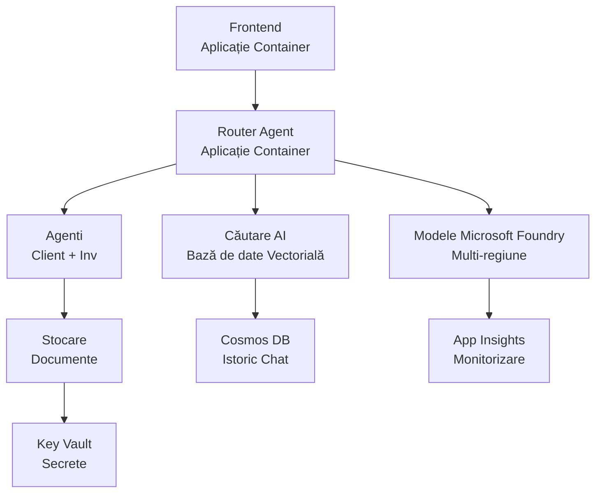

# Retail Multi-Agent Solution - Șablon de Infrastructură

**Capitolul 5: Pachet de Implementare în Producție**  
- **📚 Acasă curs**: [AZD Pentru Începători](../../README.md)  
- **📖 Capitol conex**: [Capitolul 5: Soluții AI Multi-Agenti](../../README.md#-chapter-5-multi-agent-ai-solutions-advanced)  
- **📝 Ghid scenariu**: [Arhitectură completă](../retail-scenario.md)  
- **🎯 Implementare rapidă**: [Implementare cu un singur click](#-quick-deployment)  

> **⚠️ DOAR ȘABLONUL DE INFRASTRUCTURĂ**  
> Acest șablon ARM implementează **resurse Azure** pentru un sistem multi-agent.  
>  
> **Ce se implementează (15-25 minute):**  
> - ✅ Serviciile Microsoft Foundry Models (gpt-4.1, gpt-4.1-mini, embeddings în 3 regiuni)  
> - ✅ Serviciul AI Search (gol, pregătit pentru crearea indexului)  
> - ✅ Container Apps (imagini placeholder, pregătite pentru codul dvs.)  
> - ✅ Storage, Cosmos DB, Key Vault, Application Insights  
>  
> **Ce NU este inclus (necesită dezvoltare):**  
> - ❌ Cod de implementare agent (Agent Client, Agent Inventar)  
> - ❌ Logică de rutare și puncte finale API  
> - ❌ Interfață chat frontend  
> - ❌ Scheme index căutare și pipeline-uri de date  
> - ❌ **Estimat efort dezvoltare: 80-120 ore**  
>  
> **Folosiți acest șablon dacă:**  
> - ✅ Vreți să provisionați infrastructura Azure pentru un proiect multi-agent  
> - ✅ Plănuiți să dezvoltați separat codul agenților  
> - ✅ Aveți nevoie de o bază de infrastructură gata pentru producție  
>  
> **Nu folosiți dacă:**  
> - ❌ Vă așteptați la o demonstrație multi-agent funcțională imediat  
> - ❌ Căutați exemple complete de cod pentru aplicație  

## Prezentare generală

Acest director conține un șablon Azure Resource Manager (ARM) complet pentru implementarea **fundamentului infrastructurii** unui sistem multi-agent de suport clienți. Șablonul provisionează toate serviciile Azure necesare, configurate și interconectate corect, gata pentru dezvoltarea aplicației dvs.

**După implementare veți avea:** Infrastructură Azure gata pentru producție  
**Pentru a finaliza sistemul aveți nevoie de:** Cod agent, UI frontend și configurare date (vedeți [Ghidul Arhitecturii](../retail-scenario.md))

## 🎯 Ce se implementează

### Infrastructură de bază (Stare după implementare)

✅ **Servicii Microsoft Foundry Models** (Gata pentru apeluri API)  
- Regiunea principală: implementare gpt-4.1 (capacitate 20K TPM)  
- Regiunea secundară: implementare gpt-4.1-mini (capacitate 10K TPM)  
- Regiunea terțiară: model embeddings text (capacitate 30K TPM)  
- Regiunea evaluare: model gpt-4.1 grader (capacitate 15K TPM)  
- **Stare:** Complet funcțional - poate face apeluri API imediat  

✅ **Azure AI Search** (Gol - gata pentru configurare)  
- Capacități căutare vectorială activate  
- Tastă standard cu 1 partiție, 1 replică  
- **Stare:** Serviciu activ, dar necesită creare index  
- **Acțiune necesară:** Creați indexul de căutare cu schema dvs.  

✅ **Cont de stocare Azure** (Gol - pregătit pentru încărcări)  
- Containere blob: `documents`, `uploads`  
- Configurare securizată (doar HTTPS, fără acces public)  
- **Stare:** Gata să primească fișiere  
- **Acțiune necesară:** Încărcați datele produselor și documentele  

⚠️ **Mediu Container Apps** (Imagini placeholder implementate)  
- Aplicație router agent (imagine nginx implicită)  
- Aplicație frontend (imagine nginx implicită)  
- Auto-scalare configurată (0-10 instanțe)  
- **Stare:** Rulează containere placeholder  
- **Acțiune necesară:** Construiți și implementați aplicațiile agenților  

✅ **Azure Cosmos DB** (Gol - pregătit pentru date)  
- Baza de date și containere preconfigurate  
- Optimizat pentru operațiuni cu latență redusă  
- TTL activat pentru curățare automată  
- **Stare:** Gata să stocheze istoricul conversațiilor  

✅ **Azure Key Vault** (Opțional - gata pentru secrete)  
- Ștergere moale activată  
- RBAC configurat pentru identități gestionate  
- **Stare:** Gata să stocheze chei API și stringuri de conexiune  

✅ **Application Insights** (Opțional - monitorizare activă)  
- Conectat la workspace Log Analytics  
- Metrici și alerte personalizate configurate  
- **Stare:** Gata să primească telemetrie de la aplicațiile dvs.  

✅ **Document Intelligence** (Gata pentru apeluri API)  
- Tastă S0 pentru sarcini de producție  
- **Stare:** Gata să proceseze documentele încărcate  

✅ **Bing Search API** (Gata pentru apeluri API)  
- Tastă S1 pentru căutări în timp real  
- **Stare:** Gata pentru interogări web  

### Moduri de implementare

| Mod | Capacitate OpenAI | Instanțe containere | Tastă căutare | Redundanță stocare | Recomandat pentru |
|------|-----------------|---------------------|---------------|-------------------|------------------|
| **Minimal** | 10K-20K TPM | 0-2 replici | Basic | LRS (Local) | Dezvoltare/test, învățare, proof-of-concept |
| **Standard** | 30K-60K TPM | 2-5 replici | Standard | ZRS (Zone) | Producție, trafic moderat (<10K utilizatori) |
| **Premium** | 80K-150K TPM | 5-10 replici, redundanță zonală | Premium | GRS (Geo) | Enterprise, trafic mare (>10K utilizatori), SLA 99,99% |

**Impact costuri:**  
- **Minimal → Standard:** creștere ~4x ($100-370/lună → $420-1,450/lună)  
- **Standard → Premium:** creștere ~3x ($420-1,450/lună → $1,150-3,500/lună)  
- **Alegeți în funcție de:** încărcare așteptată, cerințe SLA, buget

**Planificare capacitate:**  
- **TPM (Tokens Per Minute):** Total pe toate implementările modelelor  
- **Instanțe containere:** Interval auto-scalare (min-max replici)  
- **Tastă căutare:** Afectează performanța interogărilor și limitele dimensiunii indexului  

## 📋 Precondiții

### Unelte necesare  
1. **Azure CLI** (versiune 2.50.0 sau mai nouă)  
   ```bash
   az --version  # Verifică versiunea
   az login      # Autentificare
   ```
  
2. **Abonament activ Azure** cu acces Owner sau Contributor  
   ```bash
   az account show  # Verificați abonamentul
   ```
  

### Cote Azure necesare  

Înainte de implementare, verificați cote suficiente în regiunile țintă:  

```bash
# Verificați disponibilitatea modelelor Microsoft Foundry în regiunea dvs.
az cognitiveservices account list-skus \
  --kind OpenAI \
  --location eastus2

# Verificați cota OpenAI (exemplu pentru gpt-4.1)
az cognitiveservices usage list \
  --location eastus2 \
  --query "[?name.value=='OpenAI.Standard.gpt-4.1']"

# Verificați cota aplicațiilor containerizate
az provider show \
  --namespace Microsoft.App \
  --query "resourceTypes[?resourceType=='managedEnvironments'].locations"
```
  
**Cote minime necesare:**  
- **Microsoft Foundry Models:** 3-4 implementări de modele în regiuni diferite  
  - gpt-4.1: 20K TPM (Tokens Per Minute)  
  - gpt-4.1-mini: 10K TPM  
  - text-embedding-ada-002: 30K TPM  
  - **Notă:** gpt-4.1 poate avea listă de așteptare în unele regiuni - verificați [disponibilitate modele](https://learn.microsoft.com/azure/ai-services/openai/concepts/models)  
- **Container Apps:** Mediu gestionat + 2-10 instanțe containere  
- **AI Search:** Tastă standard (Basic insuficient pentru căutare vectorială)  
- **Cosmos DB:** Throughput provisionat standard  

**Dacă cota este insuficientă:**  
1. Accesați Azure Portal → Cote → Solicitați creștere  
2. Sau folosiți Azure CLI:  
   ```bash
   az support tickets create \
     --ticket-name "OpenAI-Quota-Increase" \
     --severity "minimal" \
     --description "Request quota increase for Microsoft Foundry Models gpt-4.1 in eastus2"
   ```
  
3. Luați în considerare regiuni alternative cu disponibilitate  

## 🚀 Implementare rapidă

### Opțiunea 1: Folosind Azure CLI  

```bash
# Clonează sau descarcă fișierele șablon
git clone <repository-url>
cd examples/retail-multiagent-arm-template

# Fă scriptul de implementare executabil
chmod +x deploy.sh

# Derulează implementarea cu setările implicite
./deploy.sh -g myResourceGroup

# Derulează implementarea pentru producție cu funcții premium
./deploy.sh -g myProdRG -e prod -m premium -l eastus2
```
  

### Opțiunea 2: Folosind Azure Portal  

[](https://portal.azure.com/#create/Microsoft.Template/uri/https%3A%2F%2Fraw.githubusercontent.com%2Fmicrosoft%2Fazd-for-beginners%2Fmain%2Fexamples%2Fretail-multiagent-arm-template%2Fazuredeploy.json)  

### Opțiunea 3: Folosind Azure CLI direct  

```bash
# Creează grupul de resurse
az group create --name myResourceGroup --location eastus2

# Publică șablonul
az deployment group create \
  --resource-group myResourceGroup \
  --template-file azuredeploy.json \
  --parameters azuredeploy.parameters.json
```
  

## ⏱️ Timeline implementare

### Ce să așteptați

| Fază | Durată | Ce se întâmplă |
|-------|----------|--------------|
| **Validare șablon** | 30-60 secunde | Azure validează sintaxa și parametrii șablonului ARM |  
| **Configurare Resource Group** | 10-20 secunde | Creează grupul de resurse (dacă este nevoie) |  
| **Provisionare OpenAI** | 5-8 minute | Creează 3-4 conturi OpenAI și implementează modelele |  
| **Container Apps** | 3-5 minute | Creează mediul și implementează containere placeholder |  
| **Search & Storage** | 2-4 minute | Provisionează serviciul AI Search și conturile de stocare |  
| **Cosmos DB** | 2-3 minute | Creează baza de date și configurează containerele |  
| **Configurare monitorizare** | 2-3 minute | Configurează Application Insights și Log Analytics |  
| **Configurare RBAC** | 1-2 minute | Configurează identități gestionate și permisiuni |  
| **Implementare totală** | **15-25 minute** | Infrastructură complet gata |  

**După implementare:**  
- ✅ **Infrastructură gata:** Toate serviciile Azure sunt provisionate și funcționează  
- ⏱️ **Dezvoltare aplicație:** 80-120 ore (responsabilitatea dvs.)  
- ⏱️ **Configurare index:** 15-30 minute (necesită schema dvs.)  
- ⏱️ **Încărcare date:** Varibil în funcție de mărimea setului de date  
- ⏱️ **Testare & validare:** 2-4 ore  

---

## ✅ Verificați succesul implementării

### Pas 1: Verificați provisioningul resurselor (2 minute)

```bash
# Verificați dacă toate resursele au fost implementate cu succes
az resource list \
  --resource-group myResourceGroup \
  --query "[?provisioningState!='Succeeded'].{Name:name, Status:provisioningState, Type:type}" \
  --output table
```
  
**Așteptat:** Tabel gol (toate resursele afișează status "Succeeded")  

### Pas 2: Verificați implementările Microsoft Foundry Models (3 minute)

```bash
# Listează toate conturile OpenAI
az cognitiveservices account list \
  --resource-group myResourceGroup \
  --query "[?kind=='OpenAI'].{Name:name, Location:location, Status:properties.provisioningState}" \
  --output table

# Verifică implementările modelelor pentru regiunea primară
OPENAI_NAME=$(az cognitiveservices account list \
  --resource-group myResourceGroup \
  --query "[?kind=='OpenAI'] | [0].name" -o tsv)

az cognitiveservices account deployment list \
  --name $OPENAI_NAME \
  --resource-group myResourceGroup \
  --output table
```
  
**Așteptat:**  
- 3-4 conturi OpenAI (regiuni principală, secundară, terțiară, evaluare)  
- 1-2 implementări modele per cont (gpt-4.1, gpt-4.1-mini, text-embedding-ada-002)  

### Pas 3: Testați endpoint-urile infrastructurii (5 minute)

```bash
# Obține URL-urile aplicației Container
az containerapp list \
  --resource-group myResourceGroup \
  --query "[].{Name:name, URL:properties.configuration.ingress.fqdn, Status:properties.runningStatus}" \
  --output table

# Testează endpoint-ul routerului (o imagine temporară va răspunde)
ROUTER_URL=$(az containerapp show \
  --name retail-router \
  --resource-group myResourceGroup \
  --query "properties.configuration.ingress.fqdn" -o tsv)

echo "Testing: https://$ROUTER_URL"
curl -I https://$ROUTER_URL || echo "Container running (placeholder image - expected)"
```
  
**Așteptat:**  
- Container Apps afișează status "Running"  
- Placeholder nginx răspunde cu HTTP 200 sau 404 (fără cod aplicație încă)  

### Pas 4: Verificați accesul API Microsoft Foundry Models (3 minute)

```bash
# Obține endpoint-ul și cheia OpenAI
OPENAI_ENDPOINT=$(az cognitiveservices account show \
  --name $OPENAI_NAME \
  --resource-group myResourceGroup \
  --query "properties.endpoint" -o tsv)

OPENAI_KEY=$(az cognitiveservices account keys list \
  --name $OPENAI_NAME \
  --resource-group myResourceGroup \
  --query "key1" -o tsv)

# Testează implementarea gpt-4.1
curl "${OPENAI_ENDPOINT}openai/deployments/gpt-4.1/chat/completions?api-version=2024-08-01-preview" \
  -H "Content-Type: application/json" \
  -H "api-key: $OPENAI_KEY" \
  -d '{
    "messages": [{"role": "user", "content": "Say hello"}],
    "max_tokens": 10
  }'
```
  
**Așteptat:** Răspuns JSON cu completare chat (confirmă funcționalitatea OpenAI)  

### Ce funcționează vs. ce nu

**✅ Funcționează după implementare:**  
- Modele Microsoft Foundry Models implementate și acceptă apeluri API  
- Serviciu AI Search activ (gol, fără indexuri)  
- Container Apps rulează (imagini placeholder nginx)  
- Conturi de stocare accesibile și pregătite pentru încărcări  
- Cosmos DB pregătit pentru operații cu date  
- Application Insights colectează telemetrie infrastructură  
- Key Vault gata pentru stocare secrete  

**❌ Nu funcționează încă (Necesită dezvoltare):**  
- Endpoint-uri agent (fără cod aplicație implementat)  
- Funcționalitate chat (necesită frontend + backend)  
- Interogări de căutare (fără index creat)  
- Pipeline pentru procesare documente (fără date încărcate)  
- Telemetrie personalizată (necesită instrumentare aplicație)  

**Pași următori:** Vedeți [Configurarea post-implementare](#-post-deployment-next-steps) pentru dezvoltare și implementare aplicație  

---

## ⚙️ Opțiuni de configurare

### Parametrii șablonului

| Parametru | Tip | Implicit | Descriere |
|-----------|-----|----------|-----------|
| `projectName` | string | "retail" | Prefix pentru toate denumirile resurselor |  
| `location` | string | Locația grupului de resurse | Regiunea principală de implementare |  
| `secondaryLocation` | string | "westus2" | Regiunea secundară pentru implementare multi-regiune |  
| `tertiaryLocation` | string | "francecentral" | Regiunea pentru modelul embeddings |  
| `environmentName` | string | "dev" | Denumire mediu (dev/staging/prod) |  
| `deploymentMode` | string | "standard" | Configurare implementare (minimal/standard/premium) |  
| `enableMultiRegion` | bool | true | Activează implementare multi-regiune |  
| `enableMonitoring` | bool | true | Activează Application Insights și logging |  
| `enableSecurity` | bool | true | Activează Key Vault și securitate avansată |  

### Personalizare parametri

Modificați `azuredeploy.parameters.json`:  

```json
{
  "$schema": "https://schema.management.azure.com/schemas/2019-04-01/deploymentParameters.json#",
  "contentVersion": "1.0.0.0",
  "parameters": {
    "projectName": {
      "value": "mycompany"
    },
    "environmentName": {
      "value": "prod"
    },
    "deploymentMode": {
      "value": "premium"
    },
    "location": {
      "value": "eastus2"
    }
  }
}
```
  
## 🏗️ Prezentare arhitectură  


## 📖 Utilizare script implementare  

Scriptul `deploy.sh` oferă o experiență interactivă de implementare:  

```bash
# Afișează ajutor
./deploy.sh --help

# Implementare de bază
./deploy.sh -g myResourceGroup

# Implementare avansată cu setări personalizate
./deploy.sh \
  -g myProductionRG \
  -p companyname \
  -e prod \
  -m premium \
  -l eastus2

# Implementare pentru dezvoltare fără multi-regiune
./deploy.sh \
  -g myDevRG \
  -e dev \
  -m minimal \
  --no-multi-region \
  --no-security
```
  
### Funcționalități script  

- ✅ **Validare precondiții** (Azure CLI, status login, fișiere șablon)  
- ✅ **Management grup resurse** (creează dacă nu există)  
- ✅ **Validare șablon** înainte de implementare  
- ✅ **Monitorizare progres** cu output colorat  
- ✅ **Afișare output implementare**  
- ✅ **Instrucțiuni după implementare**  

## 📊 Monitorizare implementare

### Verificare status implementare

```bash
# Listează implementările
az deployment group list --resource-group myResourceGroup --output table

# Obține detalii despre implementare
az deployment group show \
  --resource-group myResourceGroup \
  --name retail-deployment-YYYYMMDD-HHMMSS

# Urmărește progresul implementării
az deployment group create \
  --resource-group myResourceGroup \
  --template-file azuredeploy.json \
  --parameters azuredeploy.parameters.json \
  --verbose
```
  
### Output-uri implementare  

După implementare reușită, sunt disponibile următoarele output-uri:  

- **URL frontend**: Endpoint public pentru interfața web  
- **URL router**: Endpoint API pentru routerul agent  
- **Endpoint-uri OpenAI**: Endpoint-uri primare și secundare pentru serviciul OpenAI  
- **Serviciu căutare**: Endpoint serviciu Azure AI Search  
- **Cont stocare**: Numele contului de stocare pentru documente  
- **Key Vault**: Numele Key Vaultului (dacă este activat)  
- **Application Insights**: Numele serviciului de monitorizare (dacă este activat)  

## 🔧 Pași următori după implementare
> **📝 Important:** Infrastructura este implementată, dar trebuie să dezvolți și să implementezi codul aplicației.

### Faza 1: Dezvoltă Aplicațiile Agent (Responsabilitatea Ta)

Șablonul ARM creează **Container Apps goale** cu imagini nginx de substituție. Trebuie să:

**Dezvoltare necesară:**
1. **Implementare Agent** (30-40 ore)
   - Agent serviciu clienți cu integrare gpt-4.1
   - Agent inventar cu integrare gpt-4.1-mini
   - Logică rutare agenți

2. **Dezvoltare Frontend** (20-30 ore)
   - Interfață chat UI (React/Vue/Angular)
   - Funcționalitate încărcare fișiere
   - Redare și formatare răspunsuri

3. **Servicii Backend** (12-16 ore)
   - FastAPI sau router Express
   - Middleware autentificare
   - Integrare telemetrie

**Vezi:** [Ghid de Arhitectură](../retail-scenario.md) pentru modele detaliate de implementare și exemple de cod

### Faza 2: Configurează Indexul de Căutare AI (15-30 minute)

Creează un index de căutare care să corespundă modelului tău de date:

```bash
# Obține detalii despre serviciul de căutare
SEARCH_NAME=$(az search service list \
  --resource-group myResourceGroup \
  --query "[0].name" -o tsv)

SEARCH_KEY=$(az search admin-key show \
  --service-name $SEARCH_NAME \
  --resource-group myResourceGroup \
  --query "primaryKey" -o tsv)

# Creează indexul cu schema ta (exemplu)
curl -X POST "https://${SEARCH_NAME}.search.windows.net/indexes?api-version=2023-11-01" \
  -H "Content-Type: application/json" \
  -H "api-key: ${SEARCH_KEY}" \
  -d '{
    "name": "products",
    "fields": [
      {"name": "id", "type": "Edm.String", "key": true},
      {"name": "title", "type": "Edm.String", "searchable": true},
      {"name": "content", "type": "Edm.String", "searchable": true},
      {"name": "category", "type": "Edm.String", "filterable": true},
      {"name": "content_vector", "type": "Collection(Edm.Single)", 
       "searchable": true, "dimensions": 1536, "vectorSearchProfile": "default"}
    ],
    "vectorSearch": {
      "algorithms": [{"name": "default", "kind": "hnsw"}],
      "profiles": [{"name": "default", "algorithm": "default"}]
    }
  }'
```

**Resurse:**
- [Design Schema Index Căutare AI](https://learn.microsoft.com/azure/search/search-what-is-an-index)
- [Configurare Căutare Vectorială](https://learn.microsoft.com/azure/search/vector-search-how-to-create-index)

### Faza 3: Încarcă Datele Tale (Timp variabil)

După ce ai datele de produs și documentele:

```bash
# Obține detaliile contului de stocare
STORAGE_NAME=$(az storage account list \
  --resource-group myResourceGroup \
  --query "[0].name" -o tsv)

STORAGE_KEY=$(az storage account keys list \
  --account-name $STORAGE_NAME \
  --resource-group myResourceGroup \
  --query "[0].value" -o tsv)

# Încarcă documentele tale
az storage blob upload-batch \
  --destination documents \
  --source /path/to/your/product/docs \
  --account-name $STORAGE_NAME \
  --account-key $STORAGE_KEY

# Exemplu: Încarcă un singur fișier
az storage blob upload \
  --container-name documents \
  --name "product-manual.pdf" \
  --file /path/to/product-manual.pdf \
  --account-name $STORAGE_NAME \
  --account-key $STORAGE_KEY
```

### Faza 4: Construiește și Implementează Aplicațiile Tale (8-12 ore)

După ce ai dezvoltat codul agenților:

```bash
# 1. Creați Azure Container Registry (dacă este necesar)
az acr create \
  --name myregistry \
  --resource-group myResourceGroup \
  --sku Basic

# 2. Construiește și împinge imaginea agent router
docker build -t myregistry.azurecr.io/agent-router:v1 /path/to/your/router/code
az acr login --name myregistry
docker push myregistry.azurecr.io/agent-router:v1

# 3. Construiește și împinge imaginea frontend
docker build -t myregistry.azurecr.io/frontend:v1 /path/to/your/frontend/code
docker push myregistry.azurecr.io/frontend:v1

# 4. Actualizează Container Apps cu imaginile tale
az containerapp update \
  --name retail-router \
  --resource-group myResourceGroup \
  --image myregistry.azurecr.io/agent-router:v1

az containerapp update \
  --name retail-frontend \
  --resource-group myResourceGroup \
  --image myregistry.azurecr.io/frontend:v1

# 5. Configurează variabilele de mediu
az containerapp update \
  --name retail-router \
  --resource-group myResourceGroup \
  --set-env-vars \
    OPENAI_ENDPOINT=secretref:openai-endpoint \
    OPENAI_KEY=secretref:openai-key \
    SEARCH_ENDPOINT=secretref:search-endpoint \
    SEARCH_KEY=secretref:search-key
```

### Faza 5: Testează Aplicația Ta (2-4 ore)

```bash
# Obține URL-ul aplicației tale
ROUTER_URL=$(az containerapp show \
  --name retail-router \
  --resource-group myResourceGroup \
  --query "properties.configuration.ingress.fqdn" -o tsv)

# Testează endpoint-ul agentului (după ce codul tău este implementat)
curl -X POST "https://${ROUTER_URL}/chat" \
  -H "Content-Type: application/json" \
  -d '{
    "message": "Hello, I need help with my order",
    "agent": "customer"
  }'

# Verifică jurnalele aplicației
az containerapp logs show \
  --name retail-router \
  --resource-group myResourceGroup \
  --follow
```

### Resurse pentru Implementare

**Arhitectură & Design:**
- 📖 [Ghid Complet de Arhitectură](../retail-scenario.md) - Modele detaliate de implementare
- 📖 [Modele Design Multi-Agent](https://learn.microsoft.com/azure/architecture/ai-ml/guide/multi-agent-systems)

**Exemple de Cod:**
- 🔗 [Microsoft Foundry Models Chat Sample](https://github.com/Azure-Samples/azure-search-openai-demo) - Model RAG
- 🔗 [Semantic Kernel](https://github.com/microsoft/semantic-kernel) - Platformă agent (C#)
- 🔗 [LangChain Azure](https://github.com/langchain-ai/langchain) - Orchestrare agenți (Python)
- 🔗 [AutoGen](https://github.com/microsoft/autogen) - Conversații multi-agenți

**Estimare Totală Efort:**
- Implementare infrastructură: 15-25 minute (✅ Complet)
- Dezvoltare aplicație: 80-120 ore (🔨 Munca Ta)
- Testare și optimizare: 15-25 ore (🔨 Munca Ta)

## 🛠️ Depanare

### Probleme Comune

#### 1. Cota Microsoft Foundry Models Depășită

```bash
# Verifică utilizarea curentă a cotei
az cognitiveservices usage list --location eastus2

# Solicită creșterea cotei
az support tickets create \
  --ticket-name "OpenAI-Quota-Increase" \
  --severity "minimal" \
  --description "Request quota increase for Microsoft Foundry Models in region X"
```

#### 2. Implementare Container Apps Eșuată

```bash
# Verifică jurnalele aplicației container
az containerapp logs show \
  --name retail-router \
  --resource-group myResourceGroup \
  --follow

# Repornire aplicație container
az containerapp revision restart \
  --name retail-router \
  --resource-group myResourceGroup
```

#### 3. Inițializare Serviciu Căutare

```bash
# Verificați starea serviciului de căutare
az search service show \
  --name <search-service-name> \
  --resource-group myResourceGroup

# Testați conectivitatea serviciului de căutare
curl -X GET "https://<search-service-name>.search.windows.net/indexes?api-version=2023-11-01" \
  -H "api-key: <search-admin-key>"
```

### Validare Implementare

```bash
# Verificați dacă toate resursele sunt create
az resource list \
  --resource-group myResourceGroup \
  --output table

# Verificați starea resurselor
az resource list \
  --resource-group myResourceGroup \
  --query "[?provisioningState!='Succeeded'].{Name:name, Status:provisioningState, Type:type}" \
  --output table
```

## 🔐 Considerații de Securitate

### Managementul Cheilor
- Toate secretele sunt stocate în Azure Key Vault (când este activat)
- Container apps folosesc identitate gestionată pentru autentificare
- Conturile de stocare au setări securizate implicite (doar HTTPS, fără acces blob public)

### Securitatea Rețelei
- Container apps utilizează rețea internă unde este posibil
- Serviciul de căutare configurat cu opțiune endpoint-uri private
- Cosmos DB configurat cu permisiuni minim necesare

### Configurarea RBAC
```bash
# Atribuie rolurile necesare pentru identitatea gestionată
az role assignment create \
  --assignee <container-app-managed-identity> \
  --role "Cognitive Services OpenAI User" \
  --scope <openai-resource-id>
```

## 💰 Optimizarea Costurilor

### Estimări Costuri (Lunar, USD)

| Mod | OpenAI | Container Apps | Căutare | Stocare | Estimare Totală |
|------|--------|----------------|--------|---------|------------|
| Minimal | $50-200 | $20-50 | $25-100 | $5-20 | $100-370 |
| Standard | $200-800 | $100-300 | $100-300 | $20-50 | $420-1450 |
| Premium | $500-2000 | $300-800 | $300-600 | $50-100 | $1150-3500 |

### Monitorizarea Costurilor

```bash
# Configurarea alertelor de buget
az consumption budget create \
  --account-name <subscription-id> \
  --budget-name "retail-budget" \
  --amount 500 \
  --time-grain Monthly \
  --start-date 2024-01-01 \
  --end-date 2024-12-31
```

## 🔄 Actualizări și Mentenanță

### Actualizări Șablon
- Controlează versiunile fișierelor șablon ARM
- Testează modificările mai întâi în mediu de dezvoltare
- Folosește modul de implementare incrementală pentru actualizări

### Actualizări Resurse
```bash
# Actualizează cu noi parametri
az deployment group create \
  --resource-group myResourceGroup \
  --template-file azuredeploy.json \
  --parameters azuredeploy.parameters.json \
  --mode Incremental
```

### Backup și Recuperare
- Backup automat Cosmos DB activat
- Ștergere soft Key Vault activată
- Revizii aplicații container păstrate pentru revenire

## 📞 Asistență

- **Probleme Șablon:** [GitHub Issues](https://github.com/microsoft/azd-for-beginners/issues)
- **Asistență Azure:** [Portal Asistență Azure](https://portal.azure.com/#blade/Microsoft_Azure_Support/HelpAndSupportBlade)
- **Comunitate:** [Azure AI Discord](https://discord.gg/microsoft-azure)

---

**⚡ Gata să implementezi soluția ta multi-agent?**

Pornește cu: `./deploy.sh -g myResourceGroup`

---

<!-- CO-OP TRANSLATOR DISCLAIMER START -->
**Declinare a responsabilității**:  
Acest document a fost tradus folosind serviciul de traducere AI [Co-op Translator](https://github.com/Azure/co-op-translator). Deși ne străduim pentru acuratețe, vă rugăm să fiți conștienți că traducerile automate pot conține erori sau inexactități. Documentul original în limba sa nativă trebuie considerat sursa autorizată. Pentru informații critice, se recomandă traducerea profesională realizată de un specialist uman. Nu ne asumăm răspunderea pentru eventualele neînțelegeri sau interpretări greșite care pot apărea în urma utilizării acestei traduceri.
<!-- CO-OP TRANSLATOR DISCLAIMER END -->