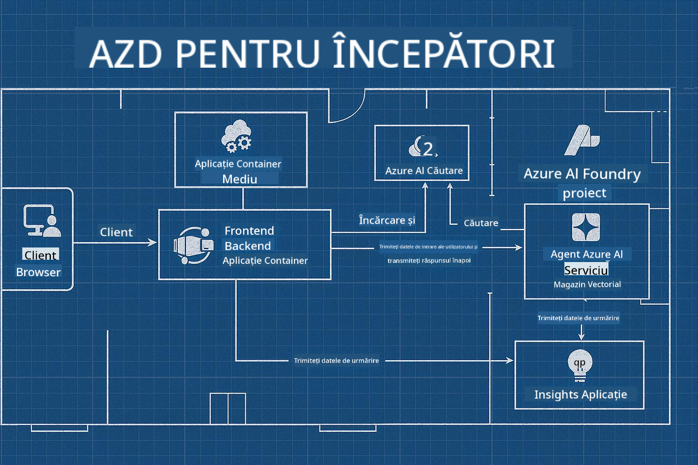

<!--
CO_OP_TRANSLATOR_METADATA:
{
  "original_hash": "245d24997bbcf2bae93bb2a503845d37",
  "translation_date": "2025-09-23T12:04:58+00:00",
  "source_file": "workshop/README.md",
  "language_code": "ro"
}
-->
# Atelier AZD pentru Dezvoltatori AI

## Șabloane AZD

Construirea unei soluții de aplicație AI de nivel enterprise pentru scenariul tău specific este foarte asemănătoare cu construirea propriei case. Poți să o proiectezi singur, să o construiești cărămidă cu cărămidă și să îți asumi responsabilitatea de a te asigura că respectă toate regulile de guvernanță și dezvoltare.

**SAU ....**

Poți lucra cu un arhitect care îți poate oferi un _plan_ pentru o casă de început și apoi să colaborezi cu el pentru a o _personaliza_ astfel încât să se potrivească nevoilor tale. Acest lucru îți permite să te concentrezi pe ceea ce face **casa ta** specială, în timp ce cablurile, instalațiile și alte dependențe sunt gestionate de experți.

**Aceasta este abordarea din spatele [Șabloanelor de Aplicații AI](https://ai.azure.com/templates)** - o serie de planuri pentru construirea diferitelor tipuri de "case AI" în funcție de nevoile și dependențele tale principale.

## Personalizarea Șabloanelor

Șabloanele sunt concepute să funcționeze cu [Azure AI Foundry](https://ai.azure.com). Gândește-te la această platformă ca la "contractorul tău de construcții", cu acces la toate resursele, instrumentele și expertiza de care ai nevoie pentru a finaliza proiectul!

Tot ce trebuie să faci este să alegi [șabloanele tale de început](https://learn.microsoft.com/en-us/azure/ai-foundry/how-to/develop/ai-template-get-started). De exemplu, ne vom concentra pe șablonul _Get Started with AI Agents_ pentru a construi o "casă AI agentică" care vine echipată cu funcționalități precum AI Search, Red Teaming, Evaluări, Tracing, Monitorizare și multe altele!



Tot ce trebuie să faci este să rezervi timp cu arhitectul, care să te ghideze prin procesul de personalizare. [GitHub Copilot pentru Azure](https://learn.microsoft.com/en-us/azure/developer/github-copilot-azure/get-started) poate fi acel ghid. Pur și simplu "discută cu el" pentru a:

- Afla despre funcționalitățile Azure din șablonul tău
- Implementa resurse Azure
- Obține informații despre implementarea ta
- Diagnostica și rezolva probleme!

În acest atelier, învățăm cum să _deconstruim_ șablonul existent (pentru a înțelege ce oferă), apoi să îl _personalizăm_ (pentru a îndeplini cerințele noastre) - pas cu pas.

Șabloanele AI **fac să funcționeze** - completând atelierul vei învăța să **faci să fie al tău**.

----

**Navigarea Atelierului**
- **📚 Pagina Principală a Cursului**: [AZD Pentru Începători](../README.md)
- **📖 Capitole Asemănătoare**: Acoperă [Capitolul 1](../README.md#-chapter-1-foundation--quick-start), [Capitolul 2](../README.md#-chapter-2-ai-first-development-recommended-for-ai-developers), și [Capitolul 5](../README.md#-chapter-5-multi-agent-ai-solutions-advanced)
- **🛠️ Laborator Practic**: [Laborator Atelier AI](../docs/ai-foundry/ai-workshop-lab.md)
- **🚀 Următorii Pași**: [Modulele Laboratorului Atelierului](../../../workshop)

Bine ai venit la atelierul practic pentru învățarea Azure Developer CLI (AZD) cu accent pe implementarea aplicațiilor AI. Acest atelier este conceput să te ducă de la bazele AZD la implementarea soluțiilor AI pregătite pentru producție.

## Prezentarea Atelierului

**Durată:** 2-3 ore  
**Nivel:** Începător până la Intermediar  
**Cerințe preliminare:** Cunoștințe de bază despre Azure, instrumente de linie de comandă și concepte AI

### Ce Vei Învăța

- **Fundamentele AZD**: Înțelegerea infrastructurii ca cod cu AZD
- 🤖 **Integrarea Serviciilor AI**: Implementarea Azure OpenAI, AI Search și alte servicii AI
- **Implementarea Containerelor**: Utilizarea Azure Container Apps pentru aplicații AI
- **Cele Mai Bune Practici de Securitate**: Implementarea Managed Identity și configurații sigure
- **Monitorizare și Observabilitate**: Configurarea Application Insights pentru sarcini AI
- **Modele de Producție**: Strategii de implementare pregătite pentru enterprise

## Structura Atelierului

### Modulul 1: Fundamentele AZD (30 minute)
- Instalarea și configurarea AZD
- Înțelegerea structurii proiectului AZD
- Prima ta implementare AZD
- **Laborator**: Implementarea unei aplicații web simple

### Modulul 2: Integrarea Azure OpenAI (45 minute)
- Configurarea resurselor Azure OpenAI
- Strategii de implementare a modelelor
- Configurarea accesului API și autentificării
- **Laborator**: Implementarea unei aplicații de chat cu GPT-4

### Modulul 3: Aplicații RAG (45 minute)
- Integrarea Azure AI Search
- Procesarea documentelor cu Azure Document Intelligence
- Vector embeddings și căutare semantică
- **Laborator**: Construirea unui sistem de întrebări și răspunsuri pe baza documentelor

### Modulul 4: Implementare în Producție (30 minute)
- Configurarea Container Apps
- Optimizarea scalării și performanței
- Monitorizare și logare
- **Laborator**: Implementare în producție cu observabilitate

### Modulul 5: Modele Avansate (15 minute)
- Implementări multi-mediu
- Integrarea CI/CD
- Strategii de optimizare a costurilor
- **Încheiere**: Lista de verificare pentru pregătirea producției

## Cerințe Preliminare

### Instrumente Necesare

Te rugăm să instalezi aceste instrumente înainte de atelier:

```bash
# Azure Developer CLI
curl -fsSL https://aka.ms/install-azd.sh | bash

# Azure CLI
curl -sL https://aka.ms/InstallAzureCLIDeb | sudo bash

# Git
sudo apt-get install git

# Docker
curl -fsSL https://get.docker.com -o get-docker.sh
sudo sh get-docker.sh

# Python 3.10+
sudo apt-get install python3.10 python3.10-venv python3-pip
```

### Configurarea Contului Azure

1. **Abonament Azure**: [Înscrie-te gratuit](https://azure.microsoft.com/free/)
2. **Acces Azure OpenAI**: [Solicită acces](https://aka.ms/oai/access)
3. **Permisiuni Necesare**:
   - Rol Contributor pe abonament sau grup de resurse
   - Administrator Acces Utilizator (pentru atribuiri RBAC)

### Verificarea Cerințelor Preliminare

Rulează acest script pentru a verifica configurația ta:

```bash
#!/bin/bash
echo "Verifying workshop prerequisites..."

# Check AZD installation
if command -v azd &> /dev/null; then
    echo "✅ Azure Developer CLI: $(azd --version)"
else
    echo "❌ Azure Developer CLI not found"
fi

# Check Azure CLI
if command -v az &> /dev/null; then
    echo "✅ Azure CLI: $(az --version | head -n1)"
else
    echo "❌ Azure CLI not found"
fi

# Check Docker
if command -v docker &> /dev/null; then
    echo "✅ Docker: $(docker --version)"
else
    echo "❌ Docker not found"
fi

# Check Python
if command -v python3 &> /dev/null; then
    echo "✅ Python: $(python3 --version)"
else
    echo "❌ Python 3 not found"
fi

# Check Azure login
if az account show &> /dev/null; then
    echo "✅ Azure: Logged in as $(az account show --query user.name -o tsv)"
else
    echo "❌ Azure: Not logged in (run 'az login')"
fi

echo "Setup verification complete!"
```

## Materiale Atelier

### Exerciții de Laborator

Fiecare modul include laboratoare practice cu cod de început și instrucțiuni pas cu pas:

- **[lab-1-azd-basics/](../../../workshop/lab-1-azd-basics)** - Prima ta implementare AZD
- **[lab-2-openai-chat/](../../../workshop/lab-2-openai-chat)** - Aplicație de chat cu Azure OpenAI
- **[lab-3-rag-search/](../../../workshop/lab-3-rag-search)** - Aplicație RAG cu AI Search
- **[lab-4-production/](../../../workshop/lab-4-production)** - Modele de implementare în producție
- **[lab-5-advanced/](../../../workshop/lab-5-advanced)** - Scenarii avansate de implementare

### Materiale de Referință

- **[Ghid de Integrare AI Foundry](../docs/ai-foundry/azure-ai-foundry-integration.md)** - Modele de integrare cuprinzătoare
- **[Ghid de Implementare a Modelului AI](../docs/ai-foundry/ai-model-deployment.md)** - Cele mai bune practici de implementare a modelelor
- **[Practici AI pentru Producție](../docs/ai-foundry/production-ai-practices.md)** - Modele de implementare enterprise
- **[Ghid de Rezolvare a Problemelor AI](../docs/troubleshooting/ai-troubleshooting.md)** - Probleme comune și soluții

### Șabloane Exemplu

Șabloane de început pentru scenarii AI comune:

```
workshop/templates/
├── minimal-chat/          # Basic OpenAI chat app
├── rag-application/       # RAG with AI Search
├── multi-model/          # Multiple AI services
└── production-ready/     # Enterprise template
```

## Începe

### Opțiunea 1: GitHub Codespaces (Recomandat)

Cea mai rapidă modalitate de a începe atelierul:

[](https://github.com/codespaces/new?hide_repo_select=true&ref=main&repo=YOUR_REPO_ID)

### Opțiunea 2: Dezvoltare Locală

1. **Clonează depozitul atelierului:**
```bash
git clone https://github.com/YOUR_ORG/AZD-for-beginners.git
cd AZD-for-beginners/workshop
```

2. **Autentifică-te în Azure:**
```bash
az login
azd auth login
```

3. **Începe cu Laboratorul 1:**
```bash
cd lab-1-azd-basics
cat README.md  # Follow the instructions
```

### Opțiunea 3: Atelier Condus de Instructor

Dacă participi la o sesiune condusă de instructor:

- 🎥 **Înregistrare Atelier**: [Disponibil la cerere](https://aka.ms/azd-ai-workshop)
- 💬 **Comunitatea Discord**: [Alătură-te pentru suport live](https://aka.ms/foundry/discord)
- **Feedback Atelier**: [Împărtășește experiența ta](https://aka.ms/azd-workshop-feedback)

## Cronologia Atelierului

### Învățare în Ritm Propriu (3 ore)

```
⏰ 00:00 - 00:30  Module 1: AZD Foundations
⏰ 00:30 - 01:15  Module 2: Azure OpenAI Integration
⏰ 01:15 - 02:00  Module 3: RAG Applications
⏰ 02:00 - 02:30  Module 4: Production Deployment
⏰ 02:30 - 02:45  Module 5: Advanced Patterns
⏰ 02:45 - 03:00  Q&A and Next Steps
```

### Sesiune Condusă de Instructor (2.5 ore)

```
⏰ 00:00 - 00:15  Welcome & Prerequisites Check
⏰ 00:15 - 00:40  Module 1: Live Demo + Lab
⏰ 00:40 - 01:20  Module 2: OpenAI Integration
⏰ 01:20 - 01:30  Break
⏰ 01:30 - 02:10  Module 3: RAG Applications
⏰ 02:10 - 02:30  Module 4: Production Patterns
⏰ 02:30 - 02:45  Module 5: Advanced Topics
⏰ 02:45 - 03:00  Q&A and Resources
```

## Criterii de Succes

Până la finalul acestui atelier, vei putea:

✅ **Implementa aplicații AI** folosind șabloane AZD  
✅ **Configura Azure OpenAI** cu securitate adecvată  
✅ **Construi aplicații RAG** cu integrarea Azure AI Search  
✅ **Implementa modele de producție** pentru sarcini AI enterprise  
✅ **Monitoriza și rezolva probleme** în implementările aplicațiilor AI  
✅ **Aplica strategii de optimizare a costurilor** pentru sarcini AI  

## Comunitate & Suport

### În Timpul Atelierului

- 🙋 **Întrebări**: Folosește chat-ul atelierului sau ridică mâna
- 🐛 **Probleme**: Verifică [ghidul de rezolvare a problemelor](../docs/troubleshooting/ai-troubleshooting.md)
- **Sfaturi**: Împărtășește descoperirile cu ceilalți participanți

### După Atelier

- 💬 **Discord**: [Comunitatea Azure AI Foundry](https://aka.ms/foundry/discord)
- **Probleme GitHub**: [Raportează problemele șabloanelor](https://github.com/YOUR_ORG/AZD-for-beginners/issues)
- 📧 **Feedback**: [Formular de evaluare atelier](https://aka.ms/azd-workshop-feedback)

## Următorii Pași

### Continuă Învățarea

1. **Scenarii Avansate**: Explorează [implementările multi-regiune](../docs/ai-foundry/production-ai-practices.md#multi-region-deployment)
2. **Integrarea CI/CD**: Configurează [fluxuri de lucru GitHub Actions](../docs/deployment/github-actions.md)
3. **Șabloane Personalizate**: Creează propriile [șabloane AZD](../docs/getting-started/custom-templates.md)

### Aplică în Proiectele Tale

1. **Evaluare**: Folosește [lista noastră de verificare pentru pregătire](./production-readiness-checklist.md)
2. **Șabloane**: Începe cu [șabloanele noastre specifice AI](../../../workshop/templates)
3. **Suport**: Alătură-te [Discordului Azure AI Foundry](https://aka.ms/foundry/discord)

### Împărtășește Succesul Tău

- ⭐ **Dă stea depozitului** dacă acest atelier te-a ajutat
- 🐦 **Distribuie pe social media** cu #AzureDeveloperCLI #AzureAI
- 📝 **Scrie un articol pe blog** despre călătoria ta de implementare AI

---

## Feedback Atelier

Feedback-ul tău ne ajută să îmbunătățim experiența atelierului:

| Aspect | Evaluare (1-5) | Comentarii |
|--------|----------------|------------|
| Calitatea Conținutului | ⭐⭐⭐⭐⭐ | |
| Laboratoare Practice | ⭐⭐⭐⭐⭐ | |
| Documentație | ⭐⭐⭐⭐⭐ | |
| Nivel de Dificultate | ⭐⭐⭐⭐⭐ | |
| Experiență Generală | ⭐⭐⭐⭐⭐ | |

**Trimite feedback**: [Formular de Evaluare Atelier](https://aka.ms/azd-workshop-feedback)

---

**Anterior:** [Ghid de Rezolvare a Problemelor AI](../docs/troubleshooting/ai-troubleshooting.md) | **Următor:** Începe cu [Laboratorul 1: Fundamente AZD](../../../workshop/lab-1-azd-basics)

**Ești gata să începi să construiești aplicații AI cu AZD?**

[Începe Laboratorul 1: Fundamente AZD →](./lab-1-azd-basics/README.md)

---

