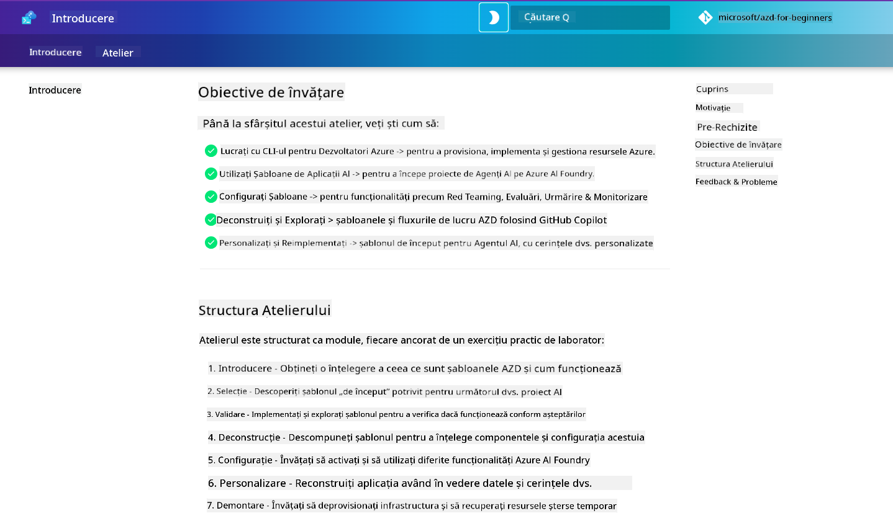

<!--
CO_OP_TRANSLATOR_METADATA:
{
  "original_hash": "9cc966416ab431c38b2ab863884b196c",
  "translation_date": "2025-09-25T01:07:58+00:00",
  "source_file": "workshop/README.md",
  "language_code": "ro"
}
-->
# Atelier AZD pentru Dezvoltatori AI

Bine ați venit la atelierul practic pentru învățarea Azure Developer CLI (AZD) cu accent pe implementarea aplicațiilor AI. Acest atelier vă ajută să dobândiți o înțelegere aplicată a șabloanelor AZD în 3 pași:

1. **Descoperire** - găsiți șablonul potrivit pentru voi.
1. **Implementare** - implementați și validați că funcționează.
1. **Personalizare** - modificați și adaptați pentru a-l face al vostru!

Pe parcursul acestui atelier, veți fi, de asemenea, introdus în instrumente și fluxuri de lucru esențiale pentru dezvoltatori, pentru a vă ajuta să simplificați procesul de dezvoltare de la început până la sfârșit.

<br/>

## Ghid bazat pe browser

Lecțiile atelierului sunt în format Markdown. Le puteți naviga direct pe GitHub - sau puteți lansa o previzualizare bazată pe browser, așa cum este prezentat în captura de ecran de mai jos.



Pentru a utiliza această opțiune - faceți fork la depozitul în profilul vostru și lansați GitHub Codespaces. Odată ce terminalul VS Code este activ, introduceți această comandă:

```bash title="" linenums="0"
mkdocs serve > /dev/null 2>&1 &
```

În câteva secunde, veți vedea un dialog pop-up. Selectați opțiunea `Open in browser`. Ghidul bazat pe web se va deschide acum într-o filă nouă a browserului. Unele beneficii ale acestei previzualizări:

1. **Căutare integrată** - găsiți cuvinte cheie sau lecții rapid.
1. **Icon pentru copiere** - treceți cu mouse-ul peste blocurile de cod pentru a vedea această opțiune.
1. **Comutare temă** - schimbați între teme întunecate și luminoase.
1. **Obțineți ajutor** - faceți clic pe iconul Discord din footer pentru a vă alătura!

<br/>

## Prezentare generală a atelierului

**Durată:** 3-4 ore  
**Nivel:** Începător până la Intermediar  
**Cerințe preliminare:** Familiaritate cu Azure, concepte AI, VS Code și instrumente de linie de comandă.

Acesta este un atelier practic în care învățați prin aplicare. După ce ați finalizat exercițiile, vă recomandăm să revizuiți curriculumul AZD Pentru Începători pentru a continua călătoria de învățare în cele mai bune practici de securitate și productivitate.

| Timp | Modul  | Obiectiv |
|:---|:---|:---|
| 15 min | [Introducere](docs/instructions/0-Introduction.md) | Stabiliți contextul, înțelegeți obiectivele |
| 30 min | [Selectați Șablonul AI](docs/instructions/1-Select-AI-Template.md) | Explorați opțiunile și alegeți un punct de pornire | 
| 30 min | [Validați Șablonul AI](docs/instructions/2-Validate-AI-Template.md) | Implementați soluția implicită pe Azure |
| 30 min | [Deconstruiți Șablonul AI](docs/instructions/3-Deconstruct-AI-Template.md) | Explorați structura și configurația |
| 30 min | [Configurați Șablonul AI](docs/instructions/4-Configure-AI-Template.md) | Activați și încercați funcțiile disponibile |
| 30 min | [Personalizați Șablonul AI](docs/instructions/5-Customize-AI-Template.md) | Adaptați șablonul la nevoile voastre |
| 30 min | [Demontați Infrastructura](docs/instructions/6-Teardown-Infrastructure.md) | Curățați și eliberați resursele |
| 15 min | [Concluzii și Pași Următori](docs/instructions/7-Wrap-up.md) | Resurse de învățare, provocarea atelierului |

<br/>

## Ce veți învăța

Gândiți-vă la Șablonul AZD ca la un mediu de învățare pentru a explora diverse capabilități și instrumente pentru dezvoltarea completă pe Azure AI Foundry. Până la finalul acestui atelier, ar trebui să aveți o înțelegere intuitivă a diverselor instrumente și concepte în acest context.

| Concept  | Obiectiv |
|:---|:---|
| **Azure Developer CLI** | Înțelegeți comenzile și fluxurile de lucru ale instrumentului |
| **Șabloane AZD**| Înțelegeți structura proiectului și configurația |
| **Agent AI Azure**| Proiectați și implementați proiectul Azure AI Foundry |
| **Căutare AI Azure**| Activați ingineria contextului cu agenți |
| **Observabilitate**| Explorați trasabilitatea, monitorizarea și evaluările |
| **Testare adversarială**| Explorați testarea adversarială și soluțiile |

<br/>

## Structura atelierului

Atelierul este structurat pentru a vă duce într-o călătorie de la descoperirea șablonului, la implementare, deconstrucție și personalizare - folosind șablonul oficial [Getting Started with AI Agents](https://github.com/Azure-Samples/get-started-with-ai-agents) ca bază.

### [Modul 1: Selectați Șablonul AI](docs/instructions/1-Select-AI-Template.md) (30 min)

- Ce sunt șabloanele AI?
- Unde pot găsi șabloane AI?
- Cum pot începe să construiesc agenți AI?
- **Laborator**: Începeți rapid cu GitHub Codespaces

### [Modul 2: Validați Șablonul AI](docs/instructions/2-Validate-AI-Template.md) (30 min)

- Care este arhitectura șablonului AI?
- Care este fluxul de lucru AZD Development?
- Cum pot obține ajutor pentru dezvoltarea AZD?
- **Laborator**: Implementați și validați șablonul agenților AI

### [Modul 3: Deconstruiți Șablonul AI](docs/instructions/3-Deconstruct-AI-Template.md) (30 min)

- Explorați mediul în `.azure/` 
- Explorați configurarea resurselor în `infra/` 
- Explorați configurația AZD în `azure.yaml`s
- **Laborator**: Modificați variabilele de mediu și reimplementați

### [Modul 4: Configurați Șablonul AI](docs/instructions/4-Configure-AI-Template.md) (30 min)
- Explorați: Generarea Augmentată prin Recuperare
- Explorați: Evaluarea Agenților și Testarea Adversarială
- Explorați: Trasabilitate și Monitorizare
- **Laborator**: Explorați Agentul AI + Observabilitate 

### [Modul 5: Personalizați Șablonul AI](docs/instructions/5-Customize-AI-Template.md) (30 min)
- Definiți: PRD cu cerințe de scenariu
- Configurați: Variabile de mediu pentru AZD
- Implementați: Lifecycle Hooks pentru sarcini suplimentare
- **Laborator**: Personalizați șablonul pentru scenariul meu

### [Modul 6: Demontați Infrastructura](docs/instructions/6-Teardown-Infrastructure.md) (30 min)
- Recapitulare: Ce sunt șabloanele AZD?
- Recapitulare: De ce să folosiți Azure Developer CLI?
- Pași următori: Încercați un alt șablon!
- **Laborator**: Dezactivați infrastructura și curățați

<br/>

## Provocarea atelierului

Doriți să vă provocați să faceți mai mult? Iată câteva sugestii de proiecte - sau împărtășiți ideile voastre cu noi!!

| Proiect | Descriere |
|:---|:---|
|1. **Deconstruiți un Șablon AI Complex** | Utilizați fluxul de lucru și instrumentele pe care le-am prezentat și vedeți dacă puteți implementa, valida și personaliza un alt șablon de soluție AI. _Ce ați învățat?_|
|2. **Personalizați cu Scenariul Vostru**  | Încercați să scrieți un PRD (Document de Cerințe ale Produsului) pentru un alt scenariu. Apoi utilizați GitHub Copilot în depozitul vostru de șabloane în modul Agent Model - și cereți-i să genereze un flux de lucru de personalizare pentru voi. _Ce ați învățat? Cum ați putea îmbunătăți aceste sugestii?_|
| | |

## Aveți feedback?

1. Postați o problemă pe acest depozit - etichetați-o `Workshop` pentru comoditate.
1. Alăturați-vă Discordului Azure AI Foundry - conectați-vă cu colegii voștri!


| | | 
|:---|:---|
| **📚 Pagina Cursului**| [AZD Pentru Începători](../README.md)|
| **📖 Documentație** | [Începeți cu șabloanele AI](https://learn.microsoft.com/en-us/azure/ai-foundry/how-to/develop/ai-template-get-started)|
| **🛠️Șabloane AI** | [Șabloane Azure AI Foundry](https://ai.azure.com/templates) |
|**🚀 Pași Următori** | [Acceptați Provocarea](../../../workshop) |
| | |

<br/>

---

**Anterior:** [Ghid de depanare AI](../docs/troubleshooting/ai-troubleshooting.md) | **Următor:** Începeți cu [Laboratorul 1: Bazele AZD](../../../workshop/lab-1-azd-basics)

**Gata să începeți să construiți aplicații AI cu AZD?**

[Începeți Laboratorul 1: Fundamentele AZD →](./lab-1-azd-basics/README.md)

---

