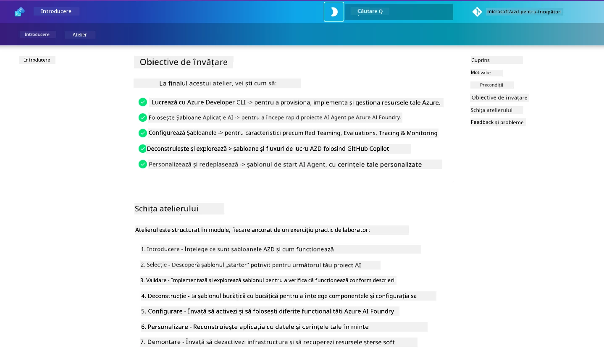

<div align="center">
  <div style="background: linear-gradient(135deg, #0078d4, #106ebe); border-radius: 10px; padding: 20px; margin: 20px 0; box-shadow: 0 4px 15px rgba(0, 120, 212, 0.3); border: 2px solid #005a9e;">
    <h2 style="color: white; margin: 0; font-size: 24px; text-shadow: 1px 1px 2px rgba(0,0,0,0.3);">
      🎯 AZD pentru Dezvoltatori AI - Workshop
    </h2>
    <p style="color: white; margin: 10px 0 0 0; font-size: 16px; text-shadow: 1px 1px 2px rgba(0,0,0,0.3);">
      <strong>Un workshop practic pentru construirea aplicațiilor AI cu Azure Developer CLI.</strong><br>
      Completează 7 module pentru a stăpâni șabloanele AZD și fluxurile de lucru pentru implementarea AI.
    </p>
    <div style="margin-top: 15px;">
      <span style="background: rgba(255,255,255,0.2); padding: 5px 10px; border-radius: 15px; color: white; font-size: 14px;">
        📅 Ultima actualizare: martie 2026
      </span>
    </div>
  </div>
</div>

# AZD pentru Dezvoltatori AI - Workshop

Bine ai venit la workshop-ul practic pentru învățarea Azure Developer CLI (AZD) cu un accent pe implementarea aplicațiilor AI. Acest workshop te ajută să dobândești o înțelegere aplicată a șabloanelor AZD în 3 pași:

1. **Descoperire** - găsește șablonul care ți se potrivește.
1. **Implementare** - implementează și validează că funcționează
1. **Personalizare** - modifică și iterează pentru a-l face al tău!

Pe parcursul acestui workshop, vei fi introdus și în unelte și fluxuri de lucru esențiale pentru dezvoltatori, pentru a-ți eficientiza călătoria de dezvoltare end-to-end.

<br/>

## Ghid bazat pe browser

Lecțiile workshop-ului sunt în Markdown. Le poți parcurge direct în GitHub - sau poți lansa o previzualizare în browser așa cum se arată în captura de ecran de mai jos.



To use this option - fork the repository to your profile, and launch GitHub Codespaces. Once the VS Code terminal is active, type this command:

This browser preview works in GitHub Codespaces, dev containers, or a local clone with Python and MkDocs installed.

```bash title="" linenums="0"
mkdocs serve > /dev/null 2>&1 &
```

In a few seconds, you will see a pop-up dialog. Select the option to `Deschide în browser`. The web-based guide will now open in a new browser tab. Some benefits of this preview:

1. **Built-in search** - find keywords or lessons quickly.
1. **Copy icon** - hover over codeblocks to see this option
1. **Theme toggle** - switch between dark and light themes
1. **Get help** - click the Discord icon in footer to join!

<br/>

## Prezentare generală a workshop-ului

**Durată:** 3-4 hours  
**Nivel:** Beginner to Intermediate  
**Cerințe prealabile:** Familiarity with Azure, AI concepts, VS Code & command-line tools.

Acesta este un workshop practic în care înveți făcând. După ce ai finalizat exercițiile, recomandăm să parcurgi curriculumul AZD For Beginners pentru a continua călătoria de învățare în practici de Securitate și Productivitate.

| Time| Module  | Objective |
|:---|:---|:---|
| 15 mins | [Introducere](docs/instructions/0-Introduction.md) | Stabilește contextul, înțelege obiectivele |
| 30 mins | [Selectează șablonul AI](docs/instructions/1-Select-AI-Template.md) | Explorează opțiunile și alege un șablon de pornire | 
| 30 mins | [Validează șablonul AI](docs/instructions/2-Validate-AI-Template.md) | Implementează soluția implicită în Azure |
| 30 mins | [Deconstruiește șablonul AI](docs/instructions/3-Deconstruct-AI-Template.md) | Explorează structura și configurația |
| 30 mins | [Configurează șablonul AI](docs/instructions/4-Configure-AI-Template.md) | Activează și testează funcționalitățile disponibile |
| 30 mins | [Personalizează șablonul AI](docs/instructions/5-Customize-AI-Template.md) | Adaptează șablonul la nevoile tale |
| 30 mins | [Dezafectare infrastructură](docs/instructions/6-Teardown-Infrastructure.md) | Curăță și eliberează resursele |
| 15 mins | [Concluzii și pași următori](docs/instructions/7-Wrap-up.md) | Resurse de învățare, provocarea workshop-ului |

<br/>

## Ce vei învăța

Gândește-te la Șablonul AZD ca la un sandbox de învățare pentru a explora diverse capabilități și unelte pentru dezvoltare end-to-end pe Microsoft Foundry. La sfârșitul acestui workshop, ar trebui să ai o înțelegere intuitivă a diferitelor unelte și concepte din acest context.

| Concept  | Objective |
|:---|:---|
| **Azure Developer CLI** | Înțelege comenzile uneltei și fluxurile de lucru|
| **AZD Templates**| Înțelege structura proiectului și configurația|
| **Azure AI Agent**| Provisionare și implementare a proiectului Microsoft Foundry  |
| **Azure AI Search**| Permite ingineria contextului cu agenți |
| **Observability**| Explorează trasarea, monitorizarea și evaluările |
| **Red Teaming**| Explorează testarea adversarială și măsuri de atenuare |

<br/>

## Structura workshop-ului

Workshop-ul este structurat pentru a te duce într-o călătorie de la descoperirea șablonului, la implementare, deconstrucție și personalizare - folosind template-ul oficial [Getting Started with AI Agents](https://github.com/Azure-Samples/get-started-with-ai-agents) ca bază.

### [Modul 1: Selectează șablonul AI](docs/instructions/1-Select-AI-Template.md) (30 mins)

- Ce sunt șabloanele AI?
- Unde pot găsi șabloane AI?
- Cum pot începe să construiesc agenți AI?
- **Lab**: Quickstart în Codespaces sau un dev container

### [Modul 2: Validează șablonul AI](docs/instructions/2-Validate-AI-Template.md) (30 mins)

- Care este arhitectura șablonului AI?
- Care este fluxul de dezvoltare AZD?
- Cum pot obține ajutor pentru dezvoltarea cu AZD?
- **Lab**: Implementează & validează șablonul AI Agents

### [Modul 3: Deconstruiește șablonul AI](docs/instructions/3-Deconstruct-AI-Template.md) (30 mins)

- Explorează mediul tău în `.azure/` 
- Explorează configurația resurselor în `infra/` 
- Explorează configurația AZD în `azure.yaml`s
- **Lab**: Modifică variabilele de mediu & redeploy

### [Modul 4: Configurează șablonul AI](docs/instructions/4-Configure-AI-Template.md) (30 mins)
- Explorează: Retrieval Augmented Generation
- Explorează: Evaluarea agenților & Red Teaming
- Explorează: Tracing & Monitorizare
- **Lab**: Explorează Agentul AI + Observability 

### [Modul 5: Personalizează șablonul AI](docs/instructions/5-Customize-AI-Template.md) (30 mins)
- Definește: PRD cu cerințele scenariului
- Configurează: Variabile de mediu pentru AZD
- Implementă: Lifecycle Hooks pentru sarcini adăugate
- **Lab**: Personalizează șablonul pentru scenariul meu

### [Modul 6: Dezafectare infrastructură](docs/instructions/6-Teardown-Infrastructure.md) (30 mins)
- Recapitulare: Ce sunt șabloanele AZD?
- Recapitulare: De ce să folosești Azure Developer CLI?
- Pași următori: Încearcă un alt șablon!
- **Lab**: Deprovisionare infrastructură & curățare

<br/>

## Provocarea workshop-ului

Vrei să te provoci să faci mai mult? Iată câteva sugestii de proiecte - sau împărtășește-ne ideile tale!!

| Project | Description |
|:---|:---|
|1. **Deconstruiește un șablon AI complex** | Folosește fluxul de lucru și instrumentele pe care le-am prezentat și vezi dacă poți implementa, valida și personaliza un alt șablon de soluție AI. _Ce ai învățat?_|
|2. **Personalizează pentru scenariul tău**  | Încearcă să redactezi un PRD (Product Requirements Document) pentru un alt scenariu. Apoi folosește GitHub Copilot în repo-ul șablonului tău în Agent Model - și cere-i să genereze un flux de lucru de personalizare pentru tine. _Ce ai învățat? Cum ai putea îmbunătăți aceste sugestii?_|
| | |

## Ai feedback?

1. Publică un issue pe acest repo - etichetează-l `Workshop` pentru comoditate.
1. Alătură-te Discord Microsoft Foundry - conectează-te cu colegii tăi!


| | | 
|:---|:---|
| **📚 Pagina cursului**| [AZD For Beginners](../README.md)|
| **📖 Documentație** | [Get started with AI templates](https://learn.microsoft.com/en-us/azure/ai-foundry/how-to/develop/ai-template-get-started)|
| **🛠️Șabloane AI** | [Microsoft Foundry Templates](https://ai.azure.com/templates) |
|**🚀 Pași următori** | [Begin Workshop](#prezentare-generală-a-workshop-ului) |
| | |

<br/>

---

**Navigare:** [Curs principal](../README.md) | [Introducere](docs/instructions/0-Introduction.md) | [Modul 1: Selectează șablonul](docs/instructions/1-Select-AI-Template.md)

**Ești gata să începi să construiești aplicații AI cu AZD?**

[Începe atelierul: Introducere →](docs/instructions/0-Introduction.md)

---

<!-- CO-OP TRANSLATOR DISCLAIMER START -->
**Declinare de responsabilitate**:
Acest document a fost tradus folosind serviciul de traducere AI [Co-op Translator](https://github.com/Azure/co-op-translator). Deși ne străduim pentru acuratețe, vă rugăm să rețineți că traducerile automatizate pot conține erori sau inexactități. Documentul original în limba sa de origine trebuie considerat sursa autoritativă. Pentru informații critice, se recomandă traducerea profesională realizată de un traducător uman. Nu ne asumăm nicio răspundere pentru eventualele neînțelegeri sau interpretări eronate care decurg din utilizarea acestei traduceri.
<!-- CO-OP TRANSLATOR DISCLAIMER END -->