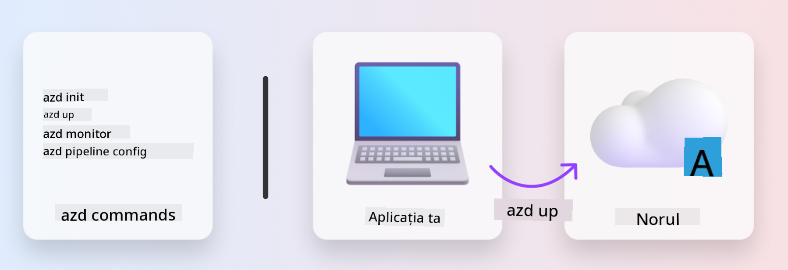
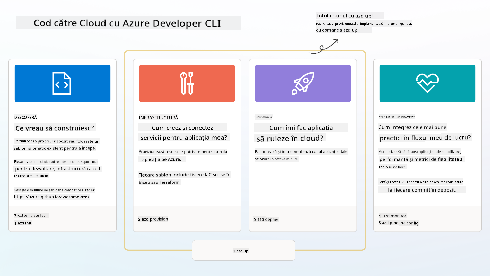

<!--
CO_OP_TRANSLATOR_METADATA:
{
  "original_hash": "06d6207eff634aefcaa41739490a5324",
  "translation_date": "2025-09-25T01:59:33+00:00",
  "source_file": "workshop/docs/instructions/1-Select-AI-Template.md",
  "language_code": "ro"
}
-->
# 1. Selectați un Șablon

!!! tip "LA SFÂRȘITUL ACESTUI MODUL VEI FI CAPABIL SĂ"

    - [ ] Descrii ce sunt șabloanele AZD
    - [ ] Descoperi și utilizezi șabloanele AZD pentru AI
    - [ ] Începi cu șablonul AI Agents
    - [ ] **Laborator 1:** AZD Quickstart cu GitHub Codespaces

---

## 1. O Analogie a Constructorului

Construirea unei aplicații AI moderne, pregătite pentru întreprinderi, _de la zero_ poate fi copleșitoare. Este puțin asemănător cu construirea unei case noi pe cont propriu, cărămidă cu cărămidă. Da, se poate face! Dar nu este cea mai eficientă metodă de a obține rezultatul dorit!

În schimb, de obicei începem cu un _plan de design_ existent și lucrăm cu un arhitect pentru a-l personaliza conform cerințelor noastre personale. Exact aceasta este abordarea pe care ar trebui să o adopți atunci când construiești aplicații inteligente. Mai întâi, găsește o arhitectură de design bună care se potrivește spațiului problemei tale. Apoi, lucrează cu un arhitect de soluții pentru a personaliza și dezvolta soluția pentru scenariul tău specific.

Dar unde putem găsi aceste planuri de design? Și cum găsim un arhitect dispus să ne învețe cum să personalizăm și să implementăm aceste planuri pe cont propriu? În acest atelier, răspundem la aceste întrebări introducându-te în trei tehnologii:

1. [Azure Developer CLI](https://aka.ms/azd) - un instrument open-source care accelerează calea dezvoltatorului de la dezvoltarea locală (build) la implementarea în cloud (ship).
1. [Azure AI Foundry Templates](https://ai.azure.com/templates) - depozite open-source standardizate care conțin cod de exemplu, fișiere de infrastructură și configurare pentru implementarea unei arhitecturi de soluție AI.
1. [GitHub Copilot Agent Mode](https://code.visualstudio.com/docs/copilot/chat/chat-agent-mode) - un agent de codare bazat pe cunoștințe Azure, care ne poate ghida în navigarea codului și efectuarea modificărilor - folosind limbaj natural.

Cu aceste instrumente la îndemână, putem acum _descoperi_ șablonul potrivit, _implementa_ pentru a valida că funcționează și _personaliza_ pentru a se potrivi scenariilor noastre specifice. Să începem și să învățăm cum funcționează acestea.

---

## 2. Azure Developer CLI

[Azure Developer CLI](https://learn.microsoft.com/en-us/azure/developer/azure-developer-cli/) (sau `azd`) este un instrument open-source de linie de comandă care poate accelera călătoria ta de la cod la cloud cu un set de comenzi prietenoase pentru dezvoltatori, care funcționează consistent în mediile tale IDE (dezvoltare) și CI/CD (devops).

Cu `azd`, călătoria ta de implementare poate fi la fel de simplă ca:

- `azd init` - Inițializează un proiect AI nou dintr-un șablon AZD existent.
- `azd up` - Provoacă infrastructura și implementează aplicația ta într-un singur pas.
- `azd monitor` - Obține monitorizare și diagnosticare în timp real pentru aplicația ta implementată.
- `azd pipeline config` - Configurează pipeline-uri CI/CD pentru a automatiza implementarea în Azure.

**🎯 | EXERCIȚIU**: <br/> Explorează instrumentul de linie de comandă `azd` în mediul tău GitHub Codespaces acum. Începe prin a introduce această comandă pentru a vedea ce poate face instrumentul:

```bash title="" linenums="0"
azd help
```



---

## 3. Șablonul AZD

Pentru ca `azd` să realizeze acest lucru, trebuie să știe ce infrastructură să provoace, ce setări de configurare să aplice și ce aplicație să implementeze. Aici intervin [șabloanele AZD](https://learn.microsoft.com/en-us/azure/developer/azure-developer-cli/azd-templates?tabs=csharp).

Șabloanele AZD sunt depozite open-source care combină cod de exemplu cu fișiere de infrastructură și configurare necesare pentru implementarea arhitecturii soluției. 
Folosind o abordare _Infrastructure-as-Code_ (IaC), acestea permit definirea resurselor șablonului și setările de configurare să fie controlate prin versiuni (la fel ca codul sursă al aplicației) - creând fluxuri de lucru reutilizabile și consistente între utilizatorii acelui proiect.

Când creezi sau reutilizezi un șablon AZD pentru scenariul _tău_, ia în considerare aceste întrebări:

1. Ce construiești? → Există un șablon care are cod de început pentru acel scenariu?
1. Cum este arhitectată soluția ta? → Există un șablon care are resursele necesare?
1. Cum este implementată soluția ta? → Gândește-te la `azd deploy` cu hook-uri de pre/post-procesare!
1. Cum o poți optimiza mai departe? → Gândește-te la monitorizare integrată și pipeline-uri de automatizare!

**🎯 | EXERCIȚIU**: <br/> 
Vizitează galeria [Awesome AZD](https://azure.github.io/awesome-azd/) și folosește filtrele pentru a explora cele peste 250 de șabloane disponibile în prezent. Vezi dacă poți găsi unul care se aliniază cerințelor scenariului _tău_.



---

## 4. Șabloane de Aplicații AI

---

