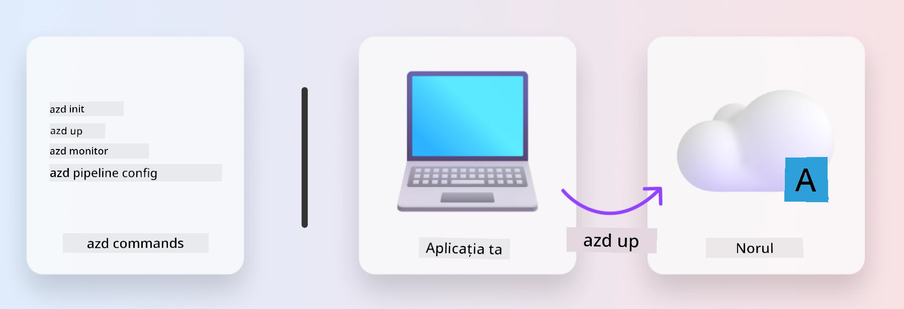
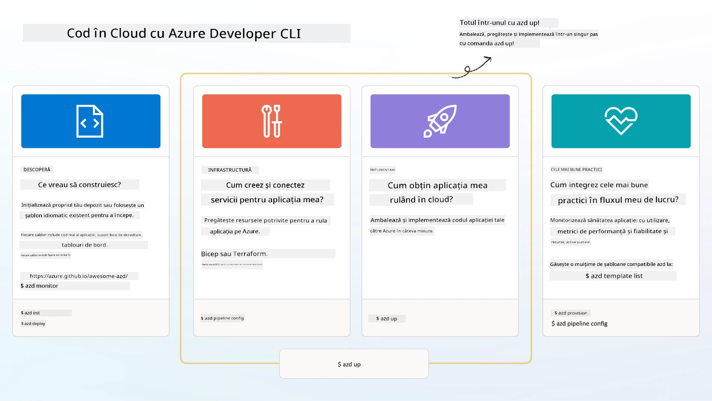

# 1. Selectați un Șablon

!!! tip "PÂNĂ LA SFÂRȘITUL ACESTUI MODUL VEȚI FI CAPABIL SĂ"

    - [ ] Descrieți ce sunt șabloanele AZD
    - [ ] Descoperiți și utilizați șabloanele AZD pentru AI
    - [ ] Începeți cu șablonul AI Agents
    - [ ] **Laborator 1:** AZD Quickstart în Codespaces sau un container de dezvoltare

---

## 1. O analogie a constructorului

Construirea unei aplicații AI moderne, pregătită pentru mediul enterprise, _de la zero_ poate fi descurajantă. Este puțin ca a-ți construi singur o nouă casă, cărămidă cu cărămidă. Da, se poate face! Dar nu este cea mai eficientă cale de a obține rezultatul dorit!

În schimb, adesea începem cu un _plan de design_ existent și lucrăm cu un arhitect pentru a-l personaliza conform cerințelor personale. Și acesta este exact abordarea de urmat când construim aplicații inteligente. Mai întâi, găsiți o arhitectură de design bună care se potrivește domeniului vostru de problemă. Apoi lucrați cu un arhitect de soluții pentru a personaliza și dezvolta soluția pentru scenariul vostru specific.

Dar unde putem găsi aceste planuri de design? Și cum găsim un arhitect dispus să ne învețe cum să personalizăm și să implementăm aceste planuri pe cont propriu? În acest workshop, răspundem la aceste întrebări prin prezentarea a trei tehnologii:

1. [Azure Developer CLI](https://aka.ms/azd) - un instrument open-source care accelerează calea dezvoltatorului de la dezvoltare locală (build) la implementare în cloud (ship).
1. [Microsoft Foundry Templates](https://ai.azure.com/templates) - depozite open-source standardizate care conțin cod de exemplu, infrastructură și fișiere de configurare pentru implementarea unei arhitecturi de soluție AI.
1. [GitHub Copilot Agent Mode](https://code.visualstudio.com/docs/copilot/chat/chat-agent-mode) - un agent de programare ancorat în cunoștințele Azure, care ne poate ghida în navigarea codului și în efectuarea modificărilor - folosind limbaj natural.

Cu aceste instrumente la îndemână, putem acum să _descoperim_ șablonul potrivit, să îl _implementăm_ pentru a valida că funcționează și să îl _personalizăm_ pentru a se potrivi scenariilor noastre specifice. Să ne scufundăm și să învățăm cum funcționează acestea.


---

## 2. Azure Developer CLI

The [Azure Developer CLI](https://learn.microsoft.com/en-us/azure/developer/azure-developer-cli/) (or `azd`) is an open-source commandline tool that can speed up your code-to-cloud journey with a set of developer-friendly commands that work consistently across your IDE (development) and CI/CD (devops) environments.

With `azd`, your deployment journey can be as simple as:

- `azd init` - Initializes a new AI project from an existing AZD template.
- `azd up` - Provisions infrastructure and deploy your application in one step.
- `azd monitor` - Get real-time monitoring and diagnostics for your deployed application.
- `azd pipeline config` - Setup CI/CD pipelines to automate deployment to Azure.

**🎯 | EXERCIȚIU**: <br/> Explorați acum instrumentul de linie de comandă `azd` în mediul workshop-ului curent. Acesta poate fi GitHub Codespaces, un container de dezvoltare sau un clone local cu prerechizitele instalate. Începeți tastând această comandă pentru a vedea ce poate face instrumentul:

```bash title="" linenums="0"
azd help
```



---

## 3. The AZD Template

For `azd` to achieve this, it needs to know the infrastructure to provision, the configuration settings to enforce, and the application to deploy. This is where [AZD templates](https://learn.microsoft.com/en-us/azure/developer/azure-developer-cli/azd-templates?tabs=csharp) come in. 

AZD templates are open-source repositories that combine sample code with infrastructure and configuraton files required for deploying the solution architecture.
By using an _Infrastructure-as-Code_ (IaC) approach, they allow template resource definitions and configuration settings to be version-controller (just like the app source code) - creating reusable and consistent workflows across users of that project.

When creating or reusing an AZD template for _your_ scenario, consider these questions:

1. What are you building? → Is there a template that has starter code for that scenario?
1. How is your solution architected? → Is there a template that has the necessary resources?
1. How is your solution deployed? → Think `azd deploy` with pre/post-processing hooks!
1. How can you optimize it further? → Think built-in monitoring and automation pipelines!

**🎯 | EXERCIȚIU**: <br/> 
Vizitați galeria [Awesome AZD](https://azure.github.io/awesome-azd/) și folosiți filtrele pentru a explora cele 250+ șabloane disponibile în prezent. Vedeți dacă puteți găsi unul care se aliniază cerințelor _voastre_ de scenariu.



---

## 4. AI App Templates

For AI-powered applications, Microsoft provides specialized templates featuring **Microsoft Foundry** and **Foundry Agents**. These templates accelerate your path to building intelligent, production-ready applications.

### Microsoft Foundry & Foundry Agents Templates

Select a template below to deploy. Each template is available on [Awesome AZD](https://azure.github.io/awesome-azd/) and can be initialized with a single command.

| Șablon | Descriere | Comandă de implementare |
|----------|-------------|----------------|
| **[AI Chat with RAG](https://azure.github.io/awesome-azd/?tags=ai&tags=rag)** | Aplicație de chat cu Retrieval Augmented Generation folosind Microsoft Foundry | `azd init -t azure-samples/azure-search-openai-demo` |
| **[Foundry Agent Service Starter](https://azure.github.io/awesome-azd/?tags=ai&tags=agents)** | Construiți agenți AI cu Foundry Agents pentru execuția autonomă a sarcinilor | `azd init -t azure-samples/foundry-agent-service-starter` |
| **[Multi-Agent Orchestration](https://azure.github.io/awesome-azd/?tags=ai&tags=agents)** | Coordonați mai mulți Foundry Agents pentru fluxuri de lucru complexe | `azd init -t azure-samples/multi-agent-orchestration` |
| **[AI Document Intelligence](https://azure.github.io/awesome-azd/?tags=ai&tags=document)** | Extrageți și analizați documente cu modele Microsoft Foundry | `azd init -t azure-samples/ai-document-processing` |
| **[Conversational AI Bot](https://azure.github.io/awesome-azd/?tags=ai&tags=bot)** | Construiți chatboți inteligenți cu integrare Microsoft Foundry | `azd init -t azure-samples/ai-chat-protocol` |
| **[AI Image Generation](https://azure.github.io/awesome-azd/?tags=ai&tags=dalle)** | Generați imagini folosind DALL-E prin Microsoft Foundry | `azd init -t azure-samples/ai-image-generation` |
| **[Semantic Kernel Agent](https://azure.github.io/awesome-azd/?tags=ai&tags=semantic-kernel)** | Agenți AI folosind Semantic Kernel împreună cu Foundry Agents | `azd init -t azure-samples/semantic-kernel-agent` |
| **[AutoGen Multi-Agent](https://azure.github.io/awesome-azd/?tags=ai&tags=autogen)** | Sisteme multi-agent folosind framework-ul AutoGen | `azd init -t azure-samples/autogen-multi-agent` |

### Pornire rapidă

1. **Răsfoiți șabloanele**: Vizitați [https://azure.github.io/awesome-azd/](https://azure.github.io/awesome-azd/) și filtrați după `AI`, `Agents` sau `Microsoft Foundry`
2. **Selectați șablonul**: Alegeți unul care se potrivește cazului vostru de utilizare
3. **Inițializați**: Rulați comanda `azd init` pentru șablonul ales
4. **Implementați**: Rulați `azd up` pentru a provisiona și implementa

**🎯 | EXERCIȚIU**: <br/>
Selectați unul dintre șabloanele de mai sus în funcție de scenariul vostru:

- **Construiți un chatbot?** → Începeți cu **AI Chat with RAG** sau **Conversational AI Bot**
- **Aveți nevoie de agenți autonomi?** → Încercați **Foundry Agent Service Starter** sau **Multi-Agent Orchestration**
- **Procesați documente?** → Folosiți **AI Document Intelligence**
- **Doriți asistență AI pentru programare?** → Explorați **Semantic Kernel Agent** sau **AutoGen Multi-Agent**

```bash title="Example: Deploy the AI Chat with RAG template" linenums="0"
azd init -t azure-samples/azure-search-openai-demo
azd up
```

!!! info "Explorați mai multe șabloane"
    Galeria [Awesome AZD](https://azure.github.io/awesome-azd/) conține peste 250 de șabloane. Folosiți filtrele pentru a găsi șabloane care se potrivesc cerințelor dvs. specifice pentru limbaj, framework și servicii Azure.

---

<!-- CO-OP TRANSLATOR DISCLAIMER START -->
**Declinare de responsabilitate**:
Acest document a fost tradus folosind serviciul de traducere AI [Co-op Translator](https://github.com/Azure/co-op-translator). Deși ne străduim pentru acuratețe, vă rugăm să rețineți că traducerile automate pot conține erori sau inexactități. Documentul original în limba sa nativă ar trebui considerat sursa autorizată. Pentru informații critice, se recomandă o traducere profesională realizată de un traducător. Nu ne asumăm răspunderea pentru eventuale neînțelegeri sau interpretări greșite care decurg din utilizarea acestei traduceri.
<!-- CO-OP TRANSLATOR DISCLAIMER END -->