<!--
CO_OP_TRANSLATOR_METADATA:
{
  "original_hash": "7816c6ec50c694c331e7c6092371be4d",
  "translation_date": "2025-09-25T02:11:31+00:00",
  "source_file": "workshop/docs/instructions/2-Validate-AI-Template.md",
  "language_code": "ro"
}
-->
# 2. Validarea unui Șablon

!!! tip "LA SFÂRȘITUL ACESTUI MODUL VEI FI CAPABIL SĂ"

    - [ ] Analizezi Arhitectura Soluției AI
    - [ ] Înțelegi Fluxul de Lucru AZD pentru Implementare
    - [ ] Utilizezi GitHub Copilot pentru ajutor în utilizarea AZD
    - [ ] **Laborator 2:** Implementarea și Validarea șablonului AI Agents

---

## 1. Introducere

[Azure Developer CLI](https://learn.microsoft.com/en-us/azure/developer/azure-developer-cli/) sau `azd` este un instrument open-source de linie de comandă care simplifică fluxul de lucru al dezvoltatorilor atunci când construiesc și implementează aplicații pe Azure.

[Șabloanele AZD](https://learn.microsoft.com/azure/developer/azure-developer-cli/azd-templates) sunt depozite standardizate care includ cod de aplicație exemplu, active de _infrastructură ca cod_ și fișiere de configurare `azd` pentru o arhitectură de soluție coerentă. Provizionarea infrastructurii devine la fel de simplă ca un comandă `azd provision` - iar utilizarea `azd up` îți permite să provizionezi infrastructura **și** să implementezi aplicația într-un singur pas!

Astfel, procesul de dezvoltare al aplicației tale poate începe rapid prin găsirea unui _șablon AZD Starter_ care se apropie cel mai mult de nevoile tale de aplicație și infrastructură - apoi personalizarea depozitului pentru a se potrivi cerințelor scenariului tău.

Înainte de a începe, să ne asigurăm că ai instalat Azure Developer CLI.

1. Deschide un terminal VS Code și tastează această comandă:

      ```bash title="" linenums="0"
      azd version
      ```

1. Ar trebui să vezi ceva de genul acesta!

      ```bash title="" linenums="0"
      azd version 1.19.0 (commit b3d68cea969b2bfbaa7b7fa289424428edb93e97)
      ```

**Acum ești pregătit să selectezi și să implementezi un șablon cu azd**

---

## 2. Selectarea Șablonului

Platforma Azure AI Foundry vine cu un [set de șabloane AZD recomandate](https://learn.microsoft.com/en-us/azure/ai-foundry/how-to/develop/ai-template-get-started) care acoperă scenarii populare de soluții, cum ar fi _automatizarea fluxurilor de lucru multi-agent_ și _procesarea conținutului multi-modal_. Poți descoperi aceste șabloane vizitând portalul Azure AI Foundry.

1. Vizitează [https://ai.azure.com/templates](https://ai.azure.com/templates)
1. Autentifică-te în portalul Azure AI Foundry când ți se solicită - vei vedea ceva de genul acesta.

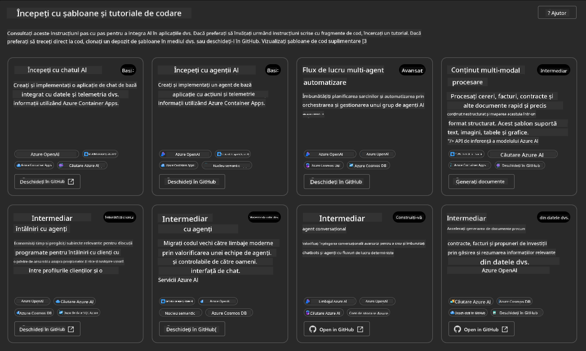

Opțiunile **Basic** sunt șabloanele de început:

1. [ ] [Get Started with AI Chat](https://github.com/Azure-Samples/get-started-with-ai-chat) care implementează o aplicație de chat de bază _cu datele tale_ pe Azure Container Apps. Folosește acest șablon pentru a explora un scenariu de chatbot AI de bază.
1. [X] [Get Started with AI Agents](https://github.com/Azure-Samples/get-started-with-ai-agents) care implementează un Agent AI standard (cu Azure AI Agent Service). Folosește acest șablon pentru a te familiariza cu soluțiile AI agentice care implică instrumente și modele.

Vizitează al doilea link într-o filă nouă de browser (sau fă clic pe `Open in GitHub` pentru cardul aferent). Ar trebui să vezi depozitul pentru acest șablon AZD. Ia un minut pentru a explora README-ul. Arhitectura aplicației arată astfel:

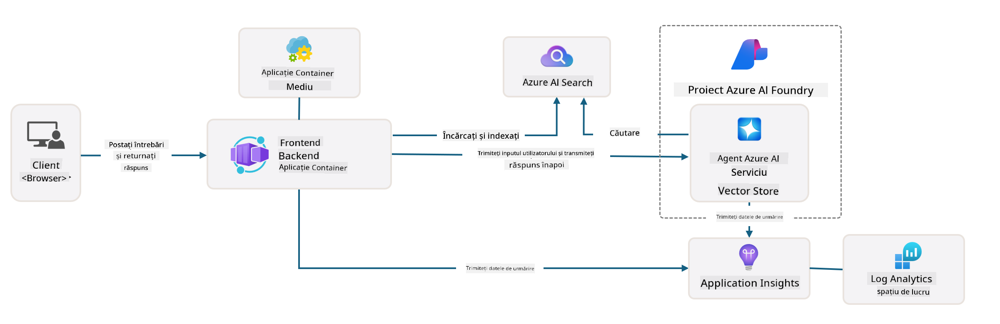

---

## 3. Activarea Șablonului

Să încercăm să implementăm acest șablon și să ne asigurăm că este valid. Vom urma liniile directoare din secțiunea [Getting Started](https://github.com/Azure-Samples/get-started-with-ai-agents?tab=readme-ov-file#getting-started).

1. Fă clic pe [acest link](https://github.com/codespaces/new/Azure-Samples/get-started-with-ai-agents) - confirmă acțiunea implicită pentru `Create codespace`
1. Aceasta deschide o filă nouă de browser - așteaptă ca sesiunea GitHub Codespaces să se încarce complet
1. Deschide terminalul VS Code în Codespaces - tastează următoarea comandă:

   ```bash title="" linenums="0"
   azd up
   ```

Completează pașii fluxului de lucru pe care îi va declanșa:

1. Ți se va solicita să te autentifici în Azure - urmează instrucțiunile pentru autentificare
1. Introdu un nume unic pentru mediu - de exemplu, eu am folosit `nitya-mshack-azd`
1. Aceasta va crea un folder `.azure/` - vei vedea un subfolder cu numele mediului
1. Ți se va solicita să selectezi un nume de abonament - selectează implicitul
1. Ți se va solicita o locație - folosește `East US 2`

Acum, așteaptă ca provizionarea să se finalizeze. **Aceasta durează 10-15 minute**

1. Când este gata, consola ta va afișa un mesaj de SUCCES, cum ar fi acesta:
      ```bash title="" linenums="0"
      SUCCESS: Your up workflow to provision and deploy to Azure completed in 10 minutes 17 seconds.
      ```
1. Portalul Azure va avea acum un grup de resurse provizionat cu numele mediului:

      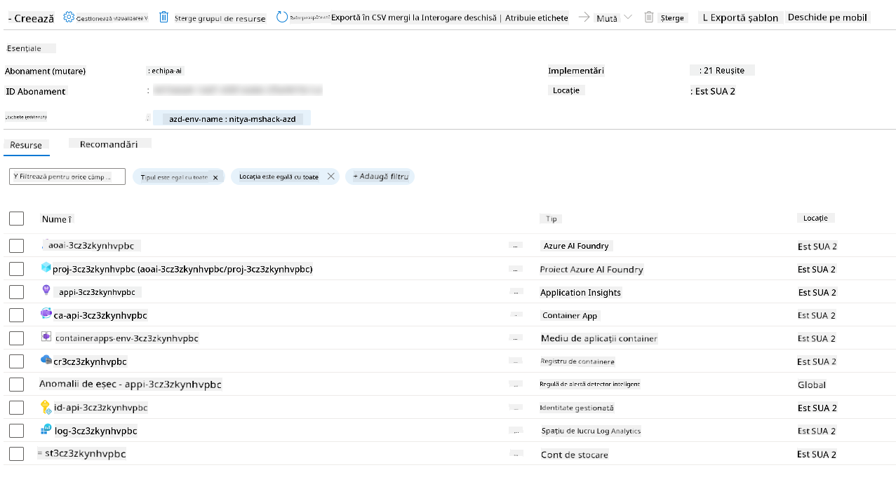

1. **Acum ești pregătit să validezi infrastructura și aplicația implementată**.

---

## 4. Validarea Șablonului

1. Vizitează pagina [Resource Groups](https://portal.azure.com/#browse/resourcegroups) din Portalul Azure - autentifică-te când ți se solicită
1. Fă clic pe RG pentru numele mediului tău - vei vedea pagina de mai sus

      - fă clic pe resursa Azure Container Apps
      - fă clic pe URL-ul aplicației din secțiunea _Essentials_ (dreapta sus)

1. Ar trebui să vezi o interfață UI de aplicație găzduită, cum ar fi aceasta:

   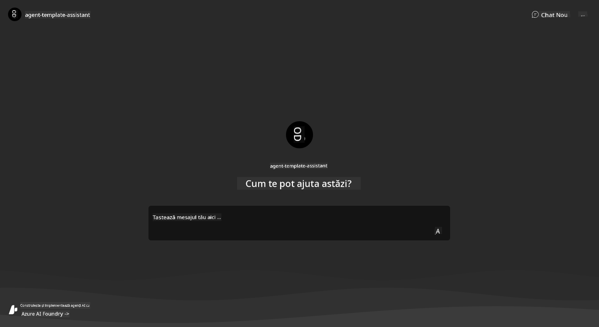

1. Încearcă să pui câteva [întrebări exemplu](https://github.com/Azure-Samples/get-started-with-ai-agents/blob/main/docs/sample_questions.md)

      1. Întreabă: ```Care este capitala Franței?``` 
      1. Întreabă: ```Care este cel mai bun cort sub 200$ pentru două persoane și ce caracteristici include?```

1. Ar trebui să primești răspunsuri similare cu cele prezentate mai jos. _Dar cum funcționează acest lucru?_ 

      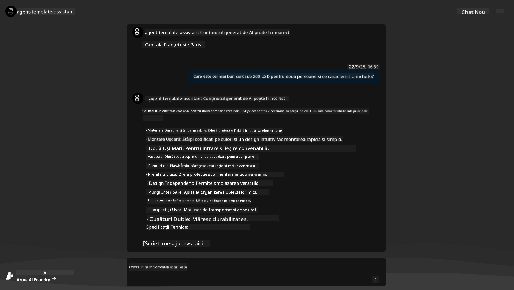

---

## 5. Validarea Agentului

Azure Container App implementează un endpoint care se conectează la Agentul AI provizionat în proiectul Azure AI Foundry pentru acest șablon. Să vedem ce înseamnă asta.

1. Revino la pagina _Overview_ din Portalul Azure pentru grupul tău de resurse

1. Fă clic pe resursa `Azure AI Foundry` din listă

1. Ar trebui să vezi aceasta. Fă clic pe butonul `Go to Azure AI Foundry Portal`. 
   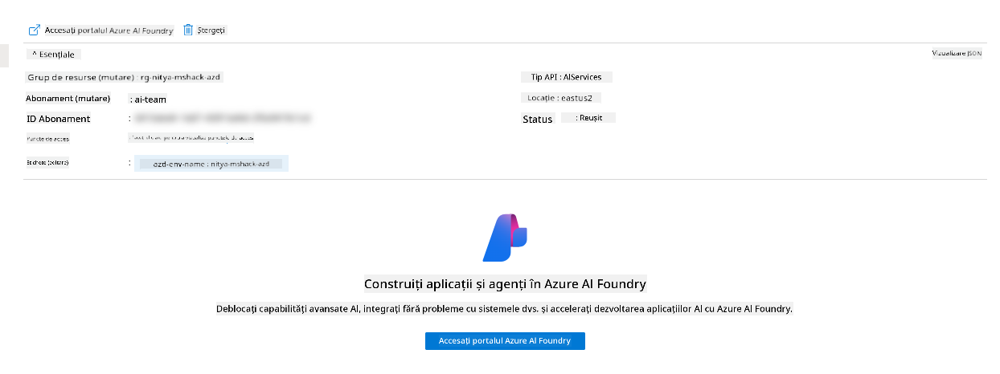

1. Ar trebui să vezi pagina Proiectului Foundry pentru aplicația ta AI
   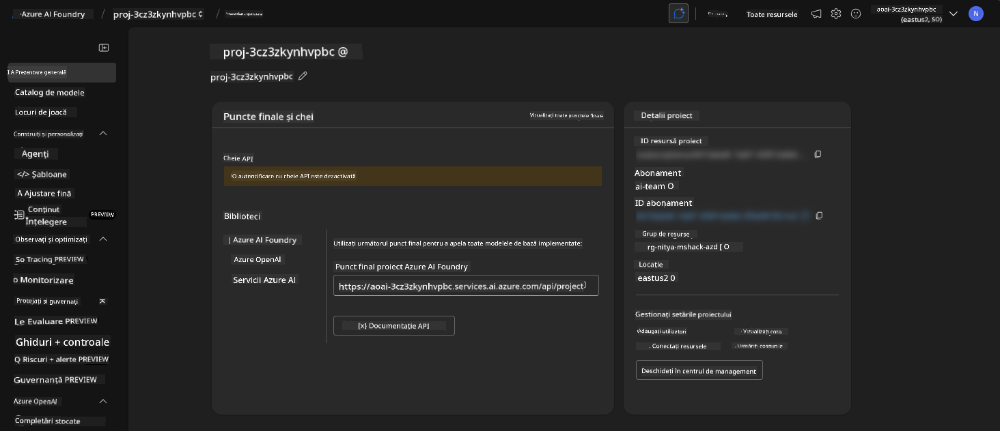

1. Fă clic pe `Agents` - vei vedea Agentul implicit provizionat în proiectul tău
   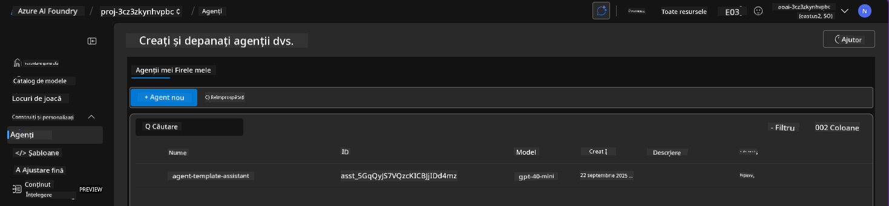

1. Selectează-l - și vei vedea detaliile Agentului. Observă următoarele:

      - Agentul folosește File Search implicit (mereu)
      - `Knowledge` al agentului indică faptul că are 32 de fișiere încărcate (pentru File Search)
      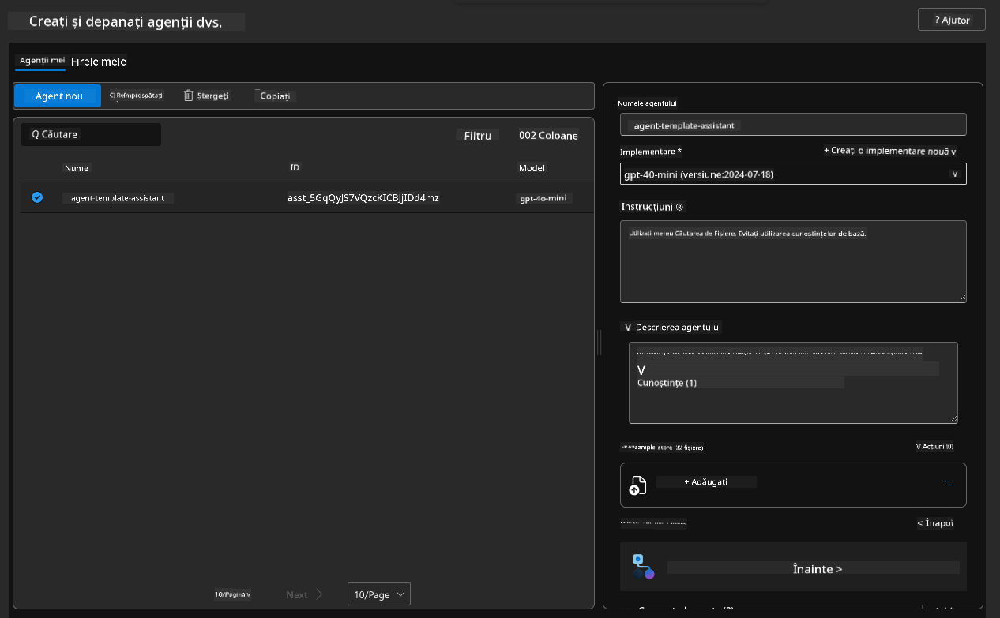

1. Caută opțiunea `Data+indexes` în meniul din stânga și fă clic pentru detalii. 

      - Ar trebui să vezi cele 32 de fișiere de date încărcate pentru cunoștințe.
      - Acestea vor corespunde celor 12 fișiere de clienți și 20 de fișiere de produse din `src/files` 
      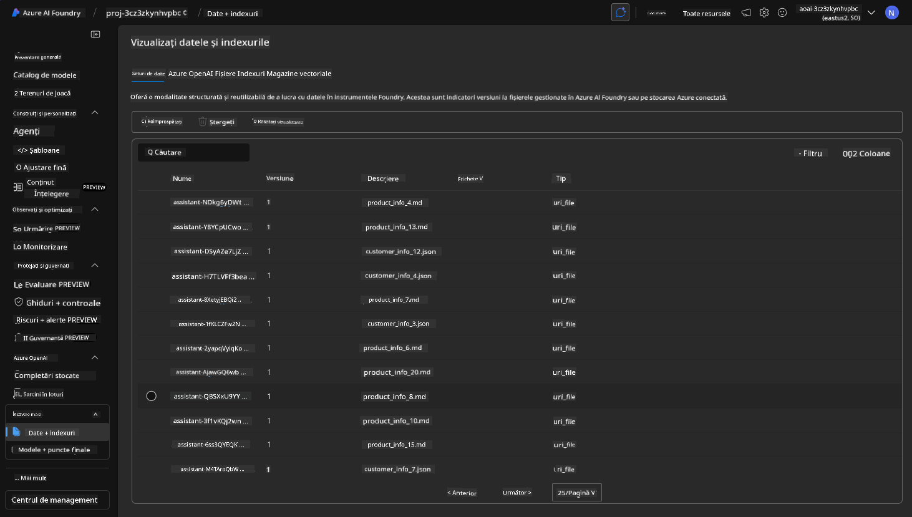

**Ai validat funcționarea Agentului!** 

1. Răspunsurile agentului sunt fundamentate pe cunoștințele din acele fișiere. 
1. Acum poți pune întrebări legate de acele date și primi răspunsuri fundamentate.
1. Exemplu: `customer_info_10.json` descrie cele 3 achiziții făcute de "Amanda Perez"

Revino la fila browserului cu endpoint-ul Container App și întreabă: `Ce produse deține Amanda Perez?`. Ar trebui să vezi ceva de genul acesta:


---

## 6. Locul de Joacă al Agentului

Să construim puțin mai multă intuiție pentru capacitățile Azure AI Foundry, luând Agentul la o tură în Locul de Joacă al Agenților. 

1. Revino la pagina `Agents` din Azure AI Foundry - selectează agentul implicit
1. Fă clic pe opțiunea `Try in Playground` - ar trebui să obții o interfață UI de Loc de Joacă, cum ar fi aceasta
1. Pune aceeași întrebare: `Ce produse deține Amanda Perez?`

    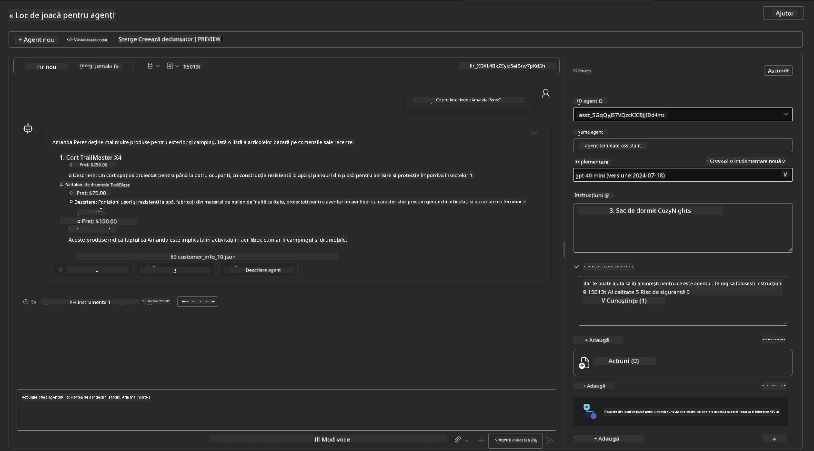

Primești același (sau similar) răspuns - dar primești și informații suplimentare pe care le poți folosi pentru a înțelege calitatea, costul și performanța aplicației tale agentice. De exemplu:

1. Observă că răspunsul citează fișierele de date utilizate pentru a "fundamenta" răspunsul
1. Plasează cursorul peste oricare dintre aceste etichete de fișiere - datele corespund interogării și răspunsului afișat?

De asemenea, vezi un rând de _statistici_ sub răspuns. 

1. Plasează cursorul peste orice metrică - de exemplu, Siguranță. Vezi ceva de genul acesta
1. Evaluarea corespunde intuiției tale pentru nivelul de siguranță al răspunsului?

      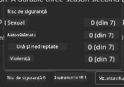

---x

## 7. Observabilitate Integrată

Observabilitatea se referă la instrumentarea aplicației tale pentru a genera date care pot fi utilizate pentru a înțelege, depana și optimiza operațiunile acesteia. Pentru a înțelege acest lucru:

1. Fă clic pe butonul `View Run Info` - ar trebui să vezi această vizualizare. Acesta este un exemplu de [trasare a Agentului](https://learn.microsoft.com/en-us/azure/ai-foundry/how-to/develop/trace-agents-sdk#view-trace-results-in-the-azure-ai-foundry-agents-playground) în acțiune. _Poți obține această vizualizare și făcând clic pe Thread Logs în meniul principal_.

   - Obține o idee despre pașii de rulare și instrumentele utilizate de agent
   - Înțelege numărul total de Token-uri (vs. utilizarea token-urilor de ieșire) pentru răspuns
   - Înțelege latența și unde se consumă timpul în execuție

      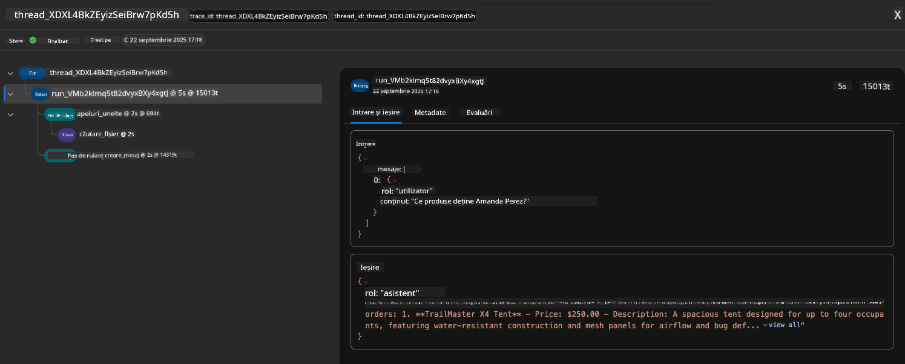

1. Fă clic pe fila `Metadata` pentru a vedea atribute suplimentare ale rulării, care pot oferi context util pentru depanarea problemelor mai târziu.   

      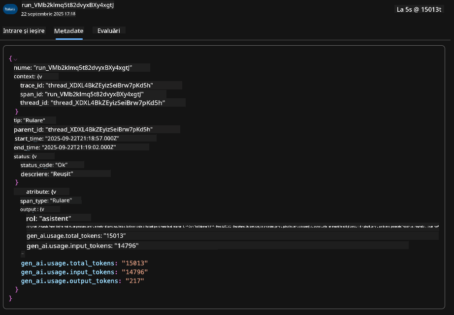


1. Fă clic pe fila `Evaluations` pentru a vedea evaluările automate făcute asupra răspunsului agentului. Acestea includ evaluări de siguranță (de exemplu, Auto-vătămare) și evaluări specifice agentului (de exemplu, Rezoluția intenției, Respectarea sarcinii).

      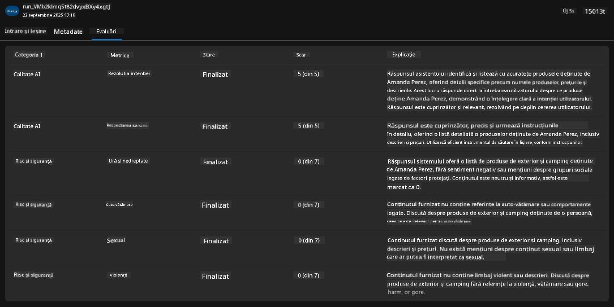

1. În cele din urmă, fă clic pe fila `Monitoring` din meniul lateral.

      - Selectează fila `Resource usage` din pagina afișată - și vizualizează metricile.
      - Urmărește utilizarea aplicației în termeni de costuri (token-uri) și încărcare (cereri).
      - Urmărește latența aplicației până la primul byte (procesarea intrării) și ultimul byte (ieșirea).

      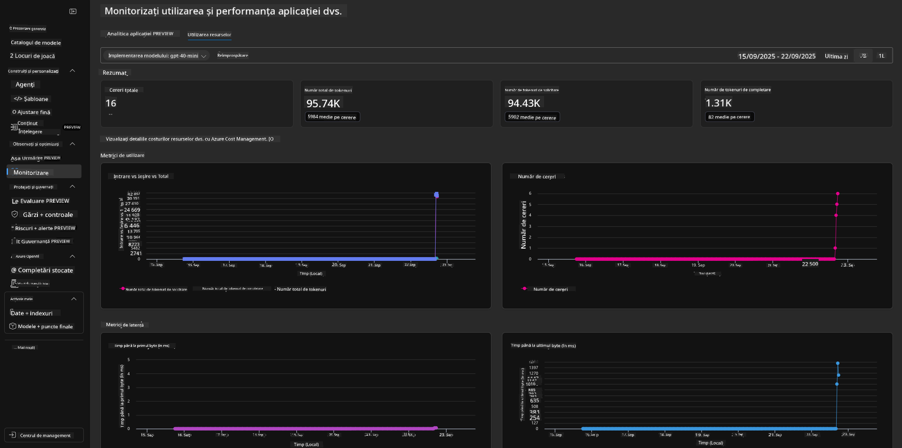

---

## 8. Variabile de Mediu

Până acum, am parcurs implementarea în browser - și am validat că infrastructura noastră este provizionată și aplicația este operațională. Dar pentru a lucra cu aplicația _din perspectiva codului_, trebuie să configurăm mediul nostru de dezvoltare local cu variabilele relevante necesare pentru a lucra cu aceste resurse. Utilizarea `azd` face acest lucru ușor.

1. Azure Developer CLI [folosește variabile de mediu](https://learn.microsoft.com/en-us/azure/developer/azure-developer-cli/manage-environment-variables?tabs=bash) pentru a stoca și gestiona setările de configurare pentru implementările aplicației.

1. Variabilele de mediu sunt stocate în `.azure/<env-name>/.env` - acestea sunt limitate la mediul `env-name` utilizat în timpul implementării și te ajută să izolezi mediile între diferite ținte de implementare în același depozit.

1. Variabilele de mediu sunt încărcate automat de comanda `azd` ori de câte ori execută o comandă specifică (de exemplu, `azd up`). Observă că `azd` nu citește automat variabilele de mediu la nivel de OS (de exemplu, setate în shell) - în schimb, folosește `azd set env` și `azd get env` pentru a transfera informații în scripturi.


Să încercăm câteva comenzi:

1. Obține toate variabilele de mediu setate pentru `azd` în acest mediu:

      ```bash title="" linenums="0"
      azd env get-values
      ```
      
      Vezi ceva de genul acesta:

      ```bash title="" linenums="0"
      AZURE_AI_AGENT_DEPLOYMENT_NAME="gpt-4o-mini"
      AZURE_AI_AGENT_NAME="agent-template-assistant"
      AZURE_AI_EMBED_DEPLOYMENT_NAME="text-embedding-3-small"
      AZURE_AI_EMBED_DIMENSIONS=100
      ...
      ```

1. Obține o valoare specifică - de exemplu, vreau să știu dacă am setat valoarea `AZURE_AI_AGENT_MODEL_NAME`

      ```bash title="" linenums="0"
      azd env get-value AZURE_AI_AGENT_MODEL_NAME 
      ```
      
      Vezi ceva de genul acesta - nu a fost setată implicit!

      ```bash title="" linenums="0"
      ERROR: key 'AZURE_AI_AGENT_MODEL_NAME' not found in the environment values
      ```

1. Setează o nouă variabilă de mediu pentru `azd`. Aici, actualizăm numele modelului agentului. _Notă: orice modificări făcute vor fi reflectate imediat în fișierul `.azure/<env-name>/.env`.

      ```bash title="" linenums="0"
      azd env set AZURE_AI_AGENT_MODEL_NAME gpt-4.1
      azd env set AZURE_AI_AGENT_MODEL_VERSION 2025-04-14
      azd env set AZURE_AI_AGENT_DEPLOYMENT_CAPACITY 150
      ```

      Acum, ar trebui să găsim valoarea setată:

      ```bash title="" linenums="0"
      azd env get-value AZURE_AI_AGENT_MODEL_NAME 
      ```

1. Observă că unele resurse sunt persistente (de exemplu, implementările de modele) și vor necesita mai mult decât un `azd up` pentru a forța reimplementarea. Să încercăm să eliminăm implementarea originală și să reimplementăm cu variabile de mediu modificate.

1. **Refresh** Dacă ai implementat anterior infrastructura folosind un șablon azd - poți _actualiza_ starea variabilelor de mediu locale pe baza stării actuale a implementării tale Azure folosind această comandă:
      ```bash title="" linenums="0"
      azd env refresh
      ```

      Aceasta este o modalitate puternică de a _sincroniza_ variabilele de mediu între două sau mai multe medii de dezvoltare locale (de exemplu, o echipă cu mai mulți dezvoltatori) - permițând infrastructurii implementate să servească drept sursă de adevăr pentru starea variabilelor de mediu. Membrii echipei pur și simplu _reîmprospătează_ variabilele pentru a reveni în sincronizare.

---

## 9. Felicitări 🏆

Tocmai ai finalizat un flux de lucru complet în care ai:

- [X] Selectat șablonul AZD pe care dorești să îl utilizezi
- [X] Lansat șablonul cu GitHub Codespaces 
- [X] Implementat șablonul și validat că funcționează

---

