# 2. Validarea unui Șablon

!!! tip "LA FINALUL ACESTUI MODUL VEI FI CAPABIL SĂ"

    - [ ] Analizezi Arhitectura Soluției AI
    - [ ] Înțelegi Fluxul de Lucru al Implementării AZD
    - [ ] Folosești GitHub Copilot pentru a obține ajutor privind utilizarea AZD
    - [ ] **Laborator 2:** Implementează și validează șablonul AI Agents

---


## 1. Introducere

[Azure Developer CLI](https://learn.microsoft.com/en-us/azure/developer/azure-developer-cli/) sau `azd` este un instrument open-source de linie de comandă care simplifică fluxul de lucru al dezvoltatorului atunci când construiește și implementează aplicații pe Azure.

[Șabloanele AZD](https://learn.microsoft.com/azure/developer/azure-developer-cli/azd-templates) sunt depozite standardizate care includ cod exemple de aplicații, active _infrastructură ca cod_, și fișiere de configurare `azd` pentru o arhitectură de soluție coerentă. Pregătirea infrastructurii devine la fel de simplă ca o comandă `azd provision` - în timp ce folosirea `azd up` permite să pregătești infrastructura **și** să implementezi aplicația dintr-o singură dată!

Ca rezultat, demararea procesului de dezvoltare a aplicației poate fi la fel de simplă ca găsirea șablonului potrivit _AZD Starter_ care se potrivește nevoilor tale de aplicație și infrastructură - apoi personalizarea depozitului pentru a se alinia cerințelor scenariului tău.

Înainte să începem, haide să ne asigurăm că ai instalat Azure Developer CLI.

1. Deschide un terminal VS Code și tastează această comandă:

      ```bash title="" linenums="0"
      azd version
      ```

1. Ar trebui să vezi ceva asemănător!

      ```bash title="" linenums="0"
      azd version 1.19.0 (commit b3d68cea969b2bfbaa7b7fa289424428edb93e97)
      ```

**Acum ești gata să selectezi și să implementezi un șablon cu azd**

---

## 2. Selectarea Șablonului

Platforma Microsoft Foundry vine cu un [set de șabloane AZD recomandate](https://learn.microsoft.com/en-us/azure/ai-foundry/how-to/develop/ai-template-get-started) care acoperă scenarii populare de soluții precum _automatizarea fluxului multi-agent_ și _procesarea conținutului multimodal_. De asemenea, poți descoperi aceste șabloane accesând portalul Microsoft Foundry.

1. Vizitează [https://ai.azure.com/templates](https://ai.azure.com/templates)
1. Autentifică-te în portalul Microsoft Foundry când ți se cere - vei vedea ceva asemănător.

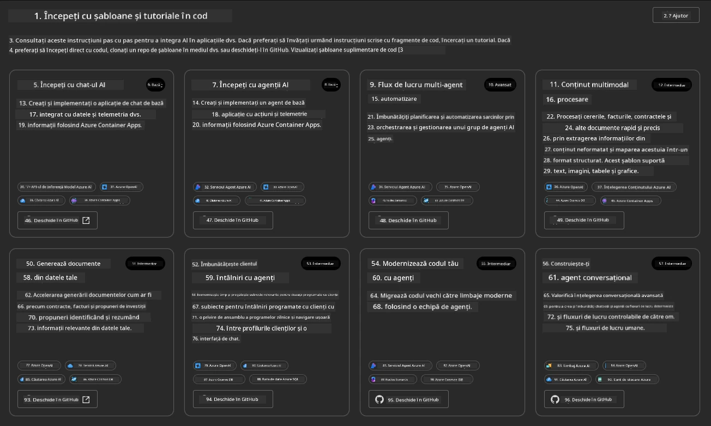


Opțiunile **Basic** sunt șabloanele tale de pornire:

1. [ ] [Pornește cu AI Chat](https://github.com/Azure-Samples/get-started-with-ai-chat) care implementează o aplicație de chat de bază _cu datele tale_ pe Azure Container Apps. Folosește acest șablon pentru a explora un scenariu simplu de chatbot AI.
1. [X] [Pornește cu AI Agents](https://github.com/Azure-Samples/get-started-with-ai-agents) care de asemenea implementează un Agent AI standard (cu Foundry Agents). Folosește-l pentru a te familiariza cu soluțiile AI agentice care implică unelte și modele.

Accesează al doilea link într-un tab nou al browserului (sau apasă `Open in GitHub` pe cardul aferent). Ar trebui să vezi depozitul pentru acest șablon AZD. Ia-ți un moment să explorezi README. Arhitectura aplicației arată astfel:

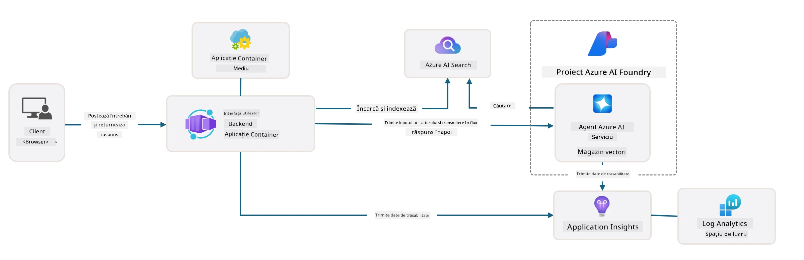

---

## 3. Activarea Șablonului

Hai să încercăm să implementăm acest șablon și să ne asigurăm că este valid. Vom urma indicațiile din secțiunea [Getting Started](https://github.com/Azure-Samples/get-started-with-ai-agents?tab=readme-ov-file#getting-started).

1. Apasă [acest link](https://github.com/codespaces/new/Azure-Samples/get-started-with-ai-agents) - confirmă acțiunea implicită `Create codespace`
1. Se va deschide un tab nou în browser - așteaptă finalizarea încărcării sesiunii GitHub Codespaces
1. Deschide terminalul VS Code în Codespaces - tastează următoarea comandă:

   ```bash title="" linenums="0"
   azd up
   ```

Finalizează pașii fluxului pe care îi va declanșa:

1. Ți se va cere să te autentifici în Azure - urmează instrucțiunile de autentificare
1. Introdu un nume unic pentru mediu - de exemplu, eu am folosit `nitya-mshack-azd`
1. Aceasta va crea un dosar `.azure/` - vei vedea un subdosar cu numele mediului
1. Ți se va cere să selectezi numele unui abonament - selectează implicit
1. Ți se va cere o locație - folosește `East US 2`

Acum, așteaptă finalizarea pregătirii. **Aceasta durează 10-15 minute**

1. Când se termină, consola ta va afișa un mesaj de SUCCES ca acesta:
      ```bash title="" linenums="0"
      SUCCESS: Your up workflow to provision and deploy to Azure completed in 10 minutes 17 seconds.
      ```
1. Portalul tău Azure va avea acum un grup de resurse implementat cu numele mediului:

      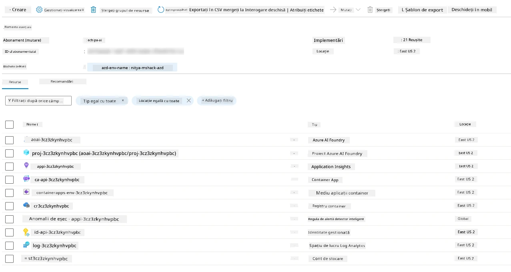

1. **Acum ești gata să validezi infrastructura și aplicația implementate**.

---

## 4. Validarea Șablonului

1. Vizitează pagina Azure Portal [Resource Groups](https://portal.azure.com/#browse/resourcegroups) - autentifică-te când ți se cere
1. Click pe RG-ul cu numele mediului tău - vei vedea pagina prezentată mai sus

      - apasă pe resursa Azure Container Apps
      - apasă pe Application Url în secțiunea _Essentials_ (în dreapta sus)

1. Ar trebui să vezi o interfață front-end a aplicației găzduite ca aceasta:

   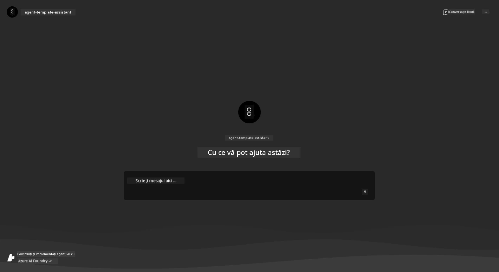

1. Încearcă să pui câteva [întrebări exemplu](https://github.com/Azure-Samples/get-started-with-ai-agents/blob/main/docs/sample_questions.md)

      1. Întreabă: ```Care este capitala Franței?``` 
      1. Întreabă: ```Care este cel mai bun cort sub 200$ pentru două persoane și ce caracteristici are?```

1. Ar trebui să primești răspunsuri similare cu cele afișate mai jos. _Dar cum funcționează asta?_ 

      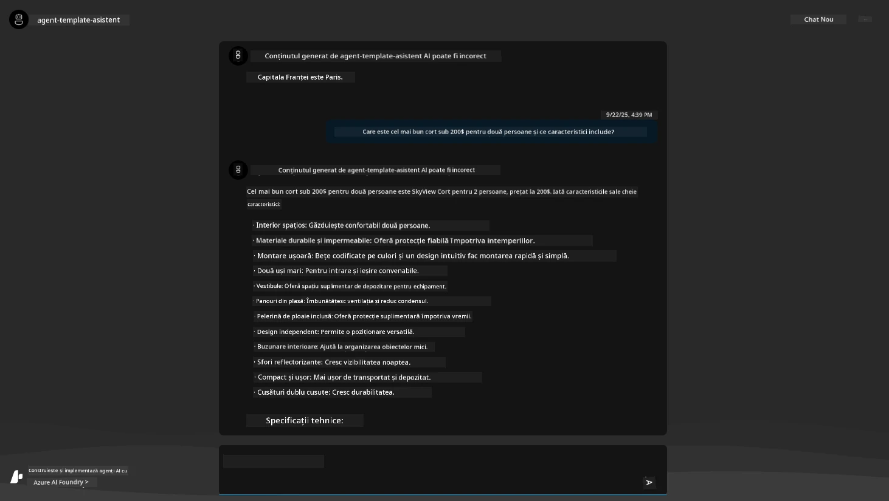

---

## 5. Validarea Agentului

Azure Container App implementează un endpoint care se conectează la Agentul AI provisionat în proiectul Microsoft Foundry aferent acestui șablon. Haide să vedem ce înseamnă asta.

1. Revino la pagina _Overview_ a grupului de resurse din Azure Portal

1. Apasă pe resursa `Microsoft Foundry` din acea listă

1. Ar trebui să vezi asta. Apasă butonul `Go to Microsoft Foundry Portal`.
   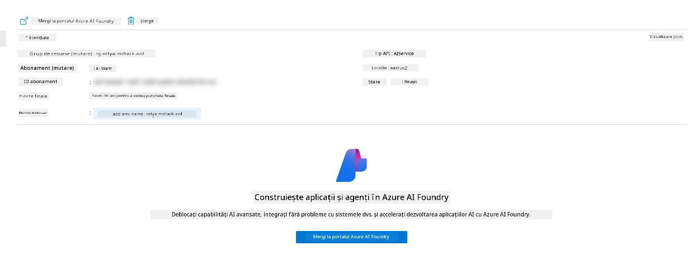

1. Vei vedea pagina Proiectului Foundry pentru aplicația ta AI
   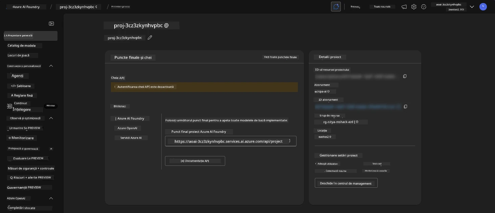

1. Apasă pe `Agents` - vei vedea agentul implicit provisionat în proiectul tău
   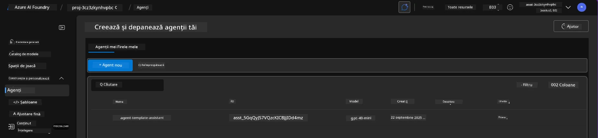

1. Selectează-l și vei vedea detaliile agentului. Observă următoarele:

      - Agentul folosește implicit File Search (căutare în fișiere) (mereu)
      - „Cunoștințele” agentului indică că are 32 de fișiere încărcate (pentru căutarea în fișiere)
      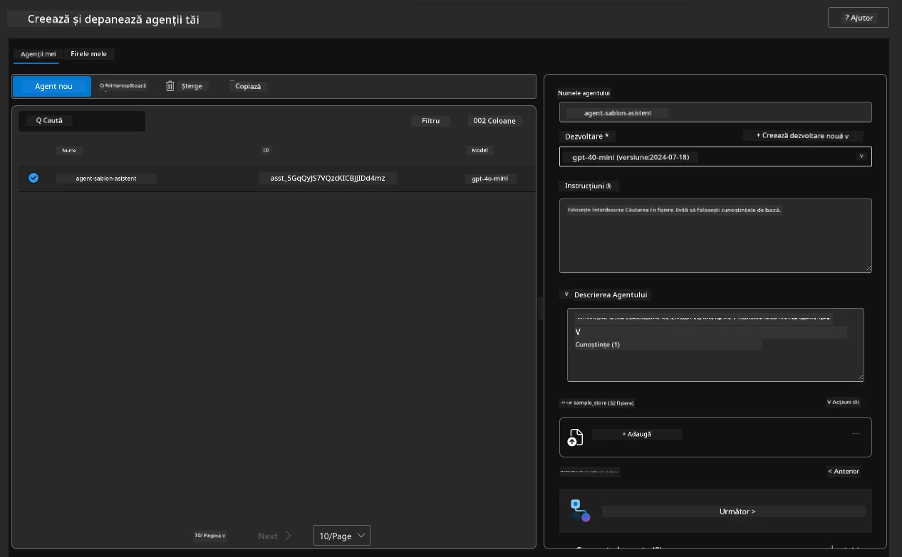

1. Caută opțiunea `Data+indexes` în meniul din stânga și fă click pentru detalii.

      - Ar trebui să vezi cele 32 de fișiere de date încărcate pentru cunoștințe.
      - Acestea corespund celor 12 fișiere pentru clienți și 20 fișiere pentru produse din `src/files`
      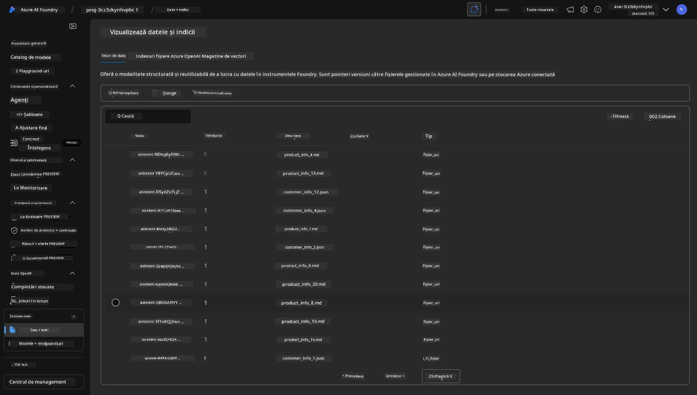

**Ai validat funcționarea Agentului!**

1. Răspunsurile agentului se bazează pe cunoștințele din acele fișiere.
1. Acum poți pune întrebări legate de acele date și primi răspunsuri fundamentate.
1. Exemplu: `customer_info_10.json` descrie cele 3 achiziții făcute de „Amanda Perez”

Revino în tab-ul browserului cu endpoint-ul Container App și întreabă: `Ce produse deține Amanda Perez?`. Ar trebui să vezi ceva asemănător:

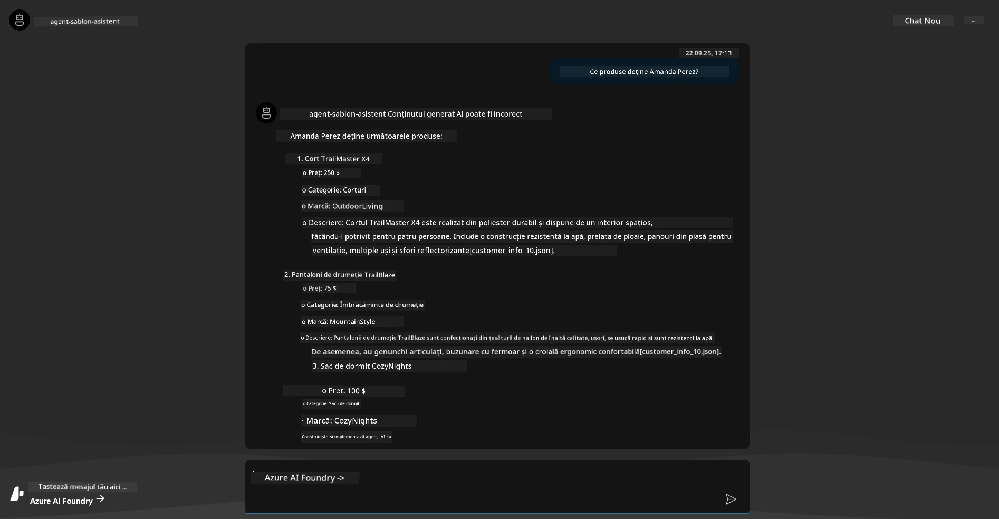

---

## 6. Terenul de joacă al Agentului

Să construim o intuiție mai bună pentru capabilitățile Microsoft Foundry, testând Agentul în Agents Playground.

1. Revino la pagina `Agents` din Microsoft Foundry - selectează agentul implicit
1. Apasă pe opțiunea `Try in Playground` - ar trebui să primești o interfață Playground ca aceasta
1. Pune aceeași întrebare: `Ce produse deține Amanda Perez?`

    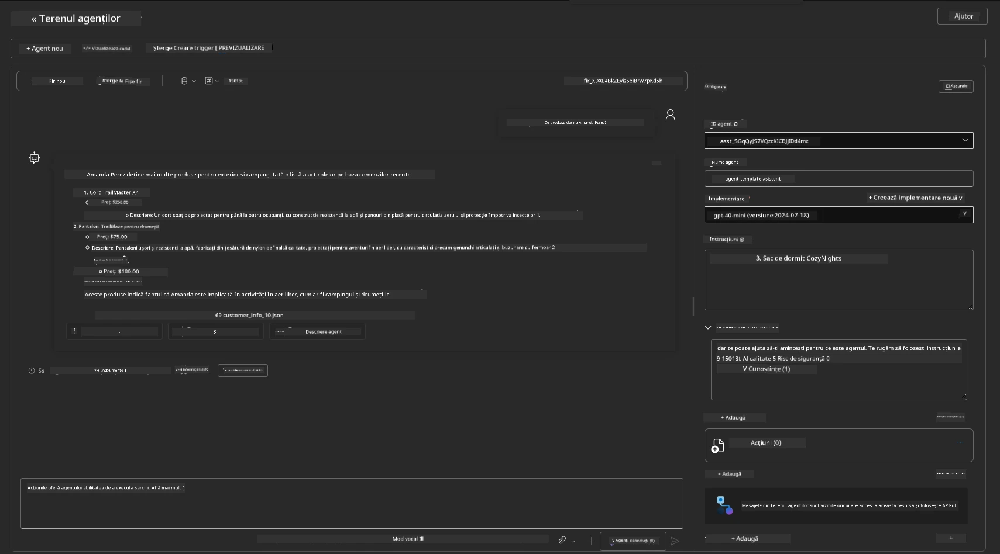

Primești același (sau similar) răspuns - dar primești și informații suplimentare pe care le poți folosi pentru a înțelege calitatea, costul și performanța aplicației tale agentice. De exemplu:

1. Observă că răspunsul citează fișierele de date folosite pentru „baza” răspunsului
1. Pune cursorul peste oricare dintre aceste etichete de fișiere - datele corespund întrebării și răspunsului afișat?

Vezi de asemenea un rând de _statistici_ sub răspuns.

1. Pune cursorul peste orice metrică - de exemplu, Siguranța. Vezi ceva de genul acesta
1. Potrivesc evaluarea cu intuiția ta privind nivelul de siguranță al răspunsului?

      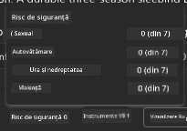

---

## 7. Observabilitate încorporată

Observabilitatea înseamnă instrumentarea aplicației tale pentru a genera date care pot fi folosite pentru a înțelege, depana și optimiza operațiunile sale. Pentru a face ceva lumină asupra acestui aspect:

1. Apasă butonul `View Run Info` - ar trebui să vezi această fereastră. Este un exemplu de [tracing Agent](https://learn.microsoft.com/en-us/azure/ai-foundry/how-to/develop/trace-agents-sdk#view-trace-results-in-the-azure-ai-foundry-agents-playground) în acțiune. _Poți accesa această vizualizare și dând click pe Thread Logs în meniul principal_.

   - Vezi pașii rularii și uneltele folosite de agent
   - Înțelege numărul total de Tokeni (vs. folosirea tokenilor pentru output) pentru răspuns
   - Înțelege latența și unde este petrecut timpul în execuție

      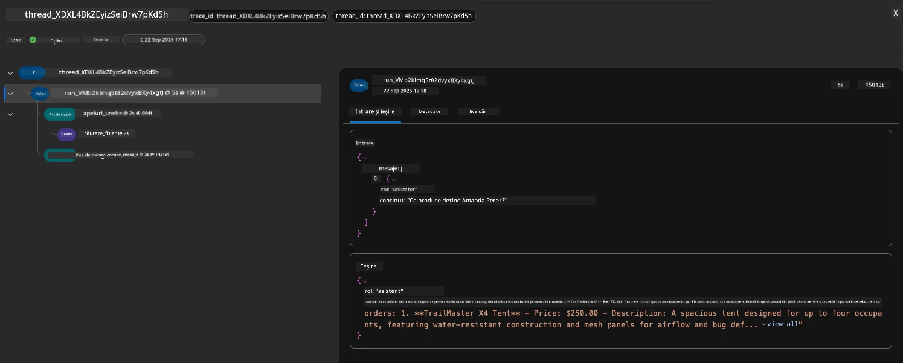

1. Apasă tab-ul `Metadata` pentru a vedea atribute suplimentare despre rulare, care pot oferi context util pentru depanare ulterioară.

      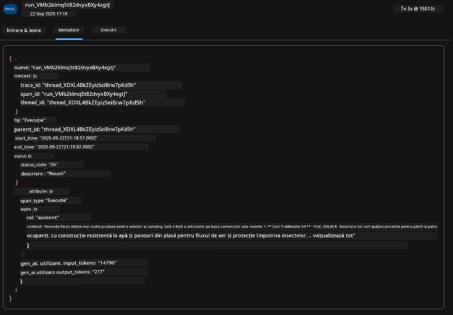


1. Apasă tab-ul `Evaluations` pentru a vedea autoevaluările făcute asupra răspunsului agentului. Acestea includ evaluări de siguranță (de ex., Auto-vătămare) și evaluări specifice agentului (de ex., rezolvarea intenției, respectarea sarcinii).

      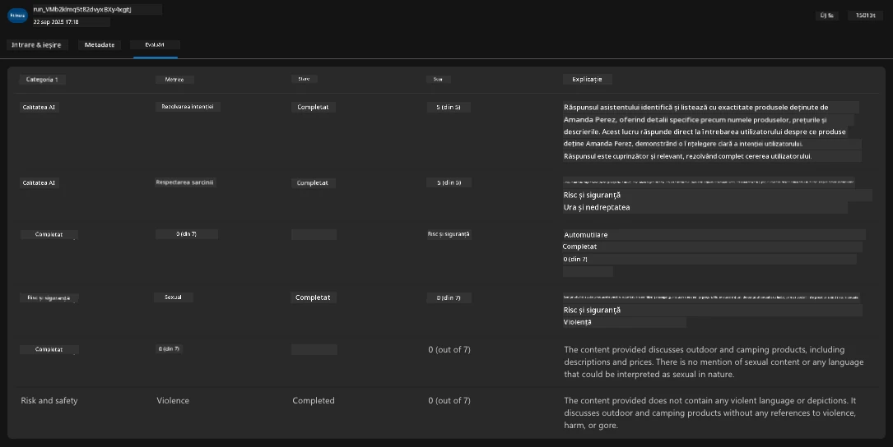

1. Ultimul dar nu cel din urmă, apasă tab-ul `Monitoring` din meniul lateral.

      - Selectează tab-ul `Resource usage` în pagina afișată - și urmărește metricile.
      - Monitorizează utilizarea aplicației în termeni de costuri (tokeni) și încărcare (cereri).
      - Monitorizează latența aplicației până la primul byte (procesarea inputului) și ultimul byte (output).

      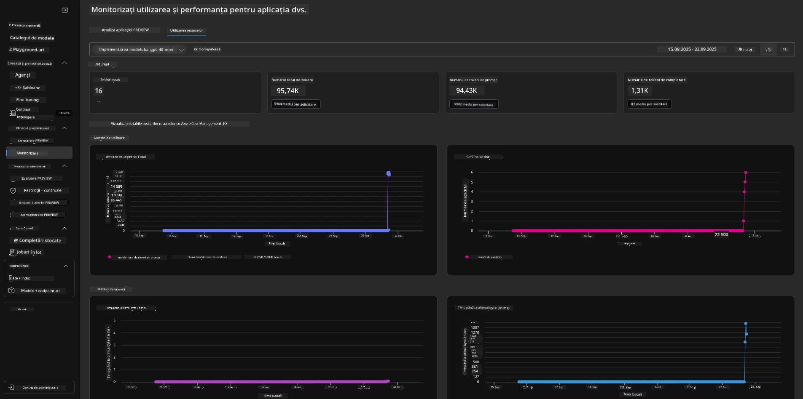

---

## 8. Variabilele de Mediu

Până acum, am parcurs implementarea în browser - și am validat că infrastructura este pregătită și aplicația este operațională. Dar pentru a lucra cu aplicația _mai întâi din cod_, trebuie să configurăm mediul local de dezvoltare cu variabilele relevante necesare pentru a lucra cu aceste resurse. Folosirea `azd` face acest lucru simplu.

1. Azure Developer CLI [folosește variabile de mediu](https://learn.microsoft.com/en-us/azure/developer/azure-developer-cli/manage-environment-variables?tabs=bash) pentru a stoca și gestiona setările de configurare pentru implementările aplicațiilor.

1. Variabilele de mediu sunt stocate în `.azure/<env-name>/.env` - acestea sunt restricționate la mediul `env-name` folosit la implementare și te ajută să separi mediile între diverse ținte de implementare în același repo.

1. Variabilele de mediu sunt încărcate automat de comanda `azd` ori de câte ori execută o comandă specifică (de exemplu, `azd up`). Reține că `azd` nu citește automat variabilele _la nivel OS_ (de ex., setate în shell) - în schimb, folosește `azd set env` și `azd get env` pentru a transfera informații în scripturi.


Hai să încercăm câteva comenzi:

1. Obține toate variabilele de mediu setate pentru `azd` în acest mediu:

      ```bash title="" linenums="0"
      azd env get-values
      ```
      
      Vei vedea ceva asemănător:

      ```bash title="" linenums="0"
      AZURE_AI_AGENT_DEPLOYMENT_NAME="gpt-4.1-mini"
      AZURE_AI_AGENT_NAME="agent-template-assistant"
      AZURE_AI_EMBED_DEPLOYMENT_NAME="text-embedding-3-small"
      AZURE_AI_EMBED_DIMENSIONS=100
      ...
      ```

1. Obține o valoare specifică - de ex., vreau să știu dacă a fost setată valoarea `AZURE_AI_AGENT_MODEL_NAME`

      ```bash title="" linenums="0"
      azd env get-value AZURE_AI_AGENT_MODEL_NAME 
      ```
      
      Vei vedea ceva de genul acesta - nu fusese setată implicit!

      ```bash title="" linenums="0"
      ERROR: key 'AZURE_AI_AGENT_MODEL_NAME' not found in the environment values
      ```

1. Setează o nouă variabilă de mediu pentru `azd`. Aici actualizăm numele modelului agentului. _Notă: orice modificare făcută va fi reflectată imediat în fișierul `.azure/<env-name>/.env`.

      ```bash title="" linenums="0"
      azd env set AZURE_AI_AGENT_MODEL_NAME gpt-4.1
      azd env set AZURE_AI_AGENT_MODEL_VERSION 2025-04-14
      azd env set AZURE_AI_AGENT_DEPLOYMENT_CAPACITY 150
      ```

      Acum, ar trebui să găsim valoarea setată:

      ```bash title="" linenums="0"
      azd env get-value AZURE_AI_AGENT_MODEL_NAME 
      ```

1. Reține că unele resurse sunt persistente (de ex., implementările de modele) și vor necesita mai mult decât o comandă `azd up` pentru a forța redeploy-ul. Hai să încercăm să dezinstalăm implementarea inițială și să reimplementăm cu variabilele de mediu modificate.

1. **Reîmprospătare** Dacă ai implementat anterior infrastructura folosind un șablon azd - poți _reîmprospăta_ starea variabilelor tale locale de mediu pe baza stării curente a implementării tale Azure folosind această comandă:

      ```bash title="" linenums="0"
      azd env refresh
      ```

      Aceasta este o metodă puternică de a _sincroniza_ variabilele de mediu între două sau mai multe medii locale de dezvoltare (de exemplu, o echipă cu mai mulți dezvoltatori) - permițând infrastructurii implementate să servească drept adevărul fundamental pentru starea variabilelor de mediu. Membrii echipei pur și simplu _reîmprospătează_ variabilele pentru a reveni în sincronizare.

---

## 9. Felicitări 🏆

Tocmai ai finalizat un flux de lucru complet unde ai:

- [X] Selectat Șablonul AZD pe care dorești să îl folosești
- [X] Lansat Șablonul cu GitHub Codespaces 
- [X] Implementat Șablonul și ai validat că funcționează

---

<!-- CO-OP TRANSLATOR DISCLAIMER START -->
**Declinarea responsabilității**:  
Acest document a fost tradus folosind serviciul de traducere AI [Co-op Translator](https://github.com/Azure/co-op-translator). Deși ne străduim pentru acuratețe, vă rugăm să rețineți că traducerile automate pot conține erori sau inexactități. Documentul original în limba sa nativă trebuie considerat sursa autoritară. Pentru informații critice, se recomandă traducerea profesională realizată de un specialist uman. Nu ne asumăm responsabilitatea pentru eventualele neînțelegeri sau interpretări greșite apărute în urma utilizării acestei traduceri.
<!-- CO-OP TRANSLATOR DISCLAIMER END -->