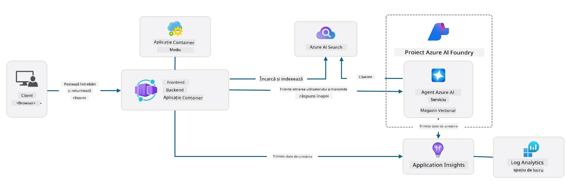

# 3. Deconstruiește un Șablon

!!! tip "LA FINALUL ACESTUI MODUL VEI FI CAPABIL SĂ"

    - [ ] Activezi GitHub Copilot cu serverele MCP pentru asistență Azure
    - [ ] Înțelegi structura folderului șablon AZD și componentele acestuia
    - [ ] Explorezi modele de organizare infrastructure-as-code (Bicep)
    - [ ] **Laborator 3:** Folosește GitHub Copilot pentru a explora și înțelege arhitectura repository-ului

---


Cu șabloanele AZD și Azure Developer CLI (`azd`) putem porni rapid călătoria noastră de dezvoltare AI cu repository-uri standardizate care oferă cod exemplu, fișiere de infrastructură și configurație - sub forma unui proiect _starter_ gata de implementare.

**Dar acum, trebuie să înțelegem structura proiectului și baza de cod - și să putem personaliza șablonul AZD - fără vreo experiență sau înțelegere anterioară a AZD!**

---

## 1. Activează GitHub Copilot

### 1.1 Instalează GitHub Copilot Chat

Este timpul să explorăm [GitHub Copilot cu Agent Mode](https://code.visualstudio.com/docs/copilot/chat/chat-agent-mode). Acum, putem folosi limbaj natural pentru a descrie sarcina noastră la un nivel înalt și să primim asistență în execuție. Pentru acest laborator, vom folosi [planul Copilot Free](https://github.com/github-copilot/signup) care are o limită lunară pentru finalizări și interacțiuni în chat.

Extensia poate fi instalată din marketplace, dar ar trebui să fie deja disponibilă în mediul tău Codespaces. _Click pe `Open Chat` din meniul derulant al iconiței Copilot - și tastează un prompt ca `What can you do?`_ - este posibil să fii rugat să te conectezi. **GitHub Copilot Chat este gata de utilizare**.

### 1.2. Instalează Serverele MCP

Pentru ca modul Agent să fie eficient, are nevoie de acces la uneltele potrivite pentru a ajuta la preluarea cunoștințelor sau pentru a lua acțiuni. Aici pot ajuta serverele MCP. Vom configura următoarele servere:

1. [Azure MCP Server](../../../../../workshop/docs/instructions)
1. [Microsoft Docs MCP Server](../../../../../workshop/docs/instructions)

Pentru a le activa:

1. Creează un fișier numit `.vscode/mcp.json` dacă nu există
1. Copiază următorul conținut în acel fișier - și pornește serverele!
   ```json title=".vscode/mcp.json"
   {
      "servers": {
         "Azure MCP Server": {
            "command": "npx",
            "args": [
            "-y",
            "@azure/mcp@latest",
            "server",
            "start"
            ]
         },
         "microsoft.docs.mcp": {
            "type": "http",
            "url": "https://learn.microsoft.com/api/mcp"
         }
      }
   }
   ```

??? warning "Este posibil să primești o eroare că `npx` nu este instalat (click pentru soluție)"

      Pentru a remedia, deschide fișierul `.devcontainer/devcontainer.json` și adaugă această linie în secțiunea features. Apoi reconstruiește containerul. Acum ar trebui să ai `npx` instalat.

      ```title="" linenums="0"
         "features": {
            "ghcr.io/devcontainers/features/node:1": {},
            ...
         },
      ```

---

### 1.3. Testează GitHub Copilot Chat

**În primul rând folosește `az login` pentru a te autentifica în Azure din linia de comandă VS Code.**

Acum ar trebui să poți interoga statusul abonamentului tău Azure și să pui întrebări despre resursele sau configurațiile implementate. Încearcă aceste prompturi:

1. `List my Azure resource groups`
1. `#foundry list my current deployments`

De asemenea, poți pune întrebări despre documentația Azure și vei primi răspunsuri bazate pe serverul Microsoft Docs MCP. Încearcă aceste prompturi:

1. `#microsoft_docs_search What is Azure Developer CLI?`
1. `#microsoft_docs_search Show me a Python tutorial to chat with deployed model`

Sau poți cere fragmente de cod pentru a completa o sarcină. Încearcă acest prompt.

1. `Give me a Python code example that uses AAD for an interactive chat client`

În modul `Ask`, va furniza cod pe care îl poți copia-lipi și testa. În modul `Agent`, ar putea merge un pas mai departe și să creeze resursele relevante pentru tine - inclusiv scripturi de configurare și documentație - pentru a te ajuta să execuți acea sarcină.

**Acum ești echipat să începi explorarea repository-ului șablon**

---

## 2. Deconstruiește Arhitectura

??? prompt "ÎNTREABĂ: Explică arhitectura aplicației din docs/images/architecture.png în 1 paragraf"

      Această aplicație este o aplicație de chat alimentată de AI construită pe Azure care demonstrează o arhitectură modernă bazată pe agenți. Soluția se concentrează în jurul unui Azure Container App care găzduiește codul principal al aplicației, care procesează intrarea utilizatorului și generează răspunsuri inteligente printr-un agent AI. 
      
      Arhitectura valorifică Microsoft Foundry Project ca fundament pentru capabilitățile AI, conectându-se la Serviciile Azure AI care oferă modelele de limbaj subiacente (precum GPT-4o-mini) și funcționalitatea agentului. Interacțiunile utilizatorului trec printr-un frontend bazat pe React către un backend FastAPI care comunică cu serviciul agent AI pentru generarea de răspunsuri contextuale. 
      
      Sistemul încorporează capabilități de recuperare a cunoștințelor prin căutare în fișiere sau serviciul Azure AI Search, permițând agentului să acceseze și să citeze informații din documentele încărcate. Pentru excelență operațională, arhitectura include monitorizare cuprinzătoare prin Application Insights și Log Analytics Workspace pentru urmărire, logare și optimizare a performanței. 
      
      Azure Storage oferă stocare blob pentru datele aplicației și încărcări de fișiere, în timp ce Managed Identity asigură acces securizat între resursele Azure fără stocarea acreditărilor. Întreaga soluție este proiectată pentru scalabilitate și mentenabilitate, cu aplicația containerizată care se scalează automat în funcție de cerere oferind în același timp securitate încorporată, monitorizare și capabilități CI/CD prin ecosistemul serviciilor gestionate Azure.



---

## 3. Structura Repository-ului

!!! prompt "ÎNTREABĂ: Explică structura folderului șablon. Începe cu un diagram vizual ierarhic."

??? info "RĂSPUNS: Diagram ierarhic vizual"

      ```bash title="" 
      get-started-with-ai-agents/
      ├── 📋 Configuration & Setup
      │   ├── azure.yaml                    # Configurare Azure Developer CLI
      │   ├── docker-compose.yaml           # Containere pentru dezvoltare locală
      │   ├── pyproject.toml                # Configurare proiect Python
      │   ├── requirements-dev.txt          # Dependențe pentru dezvoltare
      │   └── .devcontainer/                # Configurare container dev VS Code
      │
      ├── 🏗️ Infrastructure (infra/)
      │   ├── main.bicep                    # Șablon principal infrastructură
      │   ├── api.bicep                     # Resurse specifice API
      │   ├── main.parameters.json          # Parametri pentru infrastructură
      │   └── core/                         # Componente modulare de infrastructură
      │       ├── ai/                       # Configurări servicii AI
      │       ├── host/                     # Infrastructură de hosting
      │       ├── monitor/                  # Monitorizare și înregistrare
      │       ├── search/                   # Configurare Azure AI Search
      │       ├── security/                 # Securitate și identitate
      │       └── storage/                  # Configurări cont stocare
      │
      ├── 💻 Application Source (src/)
      │   ├── api/                          # Backend API
      │   │   ├── main.py                   # Punctul de intrare al aplicației FastAPI
      │   │   ├── routes.py                 # Definiții rute API
      │   │   ├── search_index_manager.py   # Funcționalitate căutare
      │   │   ├── data/                     # Manipulare date API
      │   │   ├── static/                   # Resurse web statice
      │   │   └── templates/                # Șabloane HTML
      │   ├── frontend/                     # Frontend React/TypeScript
      │   │   ├── package.json              # Dependențe Node.js
      │   │   ├── vite.config.ts            # Configurație build Vite
      │   │   └── src/                      # Cod sursă frontend
      │   ├── data/                         # Fișiere de date exemplu
      │   │   └── embeddings.csv            # Embeddings pre-calculate
      │   ├── files/                        # Fișiere bază de cunoștințe
      │   │   ├── customer_info_*.json      # Exemple date clienți
      │   │   └── product_info_*.md         # Documentație produse
      │   ├── Dockerfile                    # Configurare container
      │   └── requirements.txt              # Dependențe Python
      │
      ├── 🔧 Automation & Scripts (scripts/)
      │   ├── postdeploy.sh/.ps1           # Configurare post-implementare
      │   ├── setup_credential.sh/.ps1     # Configurare acreditări
      │   ├── validate_env_vars.sh/.ps1    # Validare variabile de mediu
      │   └── resolve_model_quota.sh/.ps1  # Gestionare cotă modele
      │
      ├── 🧪 Testing & Evaluation
      │   ├── tests/                        # Teste unitare și de integrare
      │   │   └── test_search_index_manager.py
      │   ├── evals/                        # Cadru de evaluare agent
      │   │   ├── evaluate.py               # Executor evaluare
      │   │   ├── eval-queries.json         # Interogări de test
      │   │   └── eval-action-data-path.json
      │   ├── sandbox/                      # Zonă de dezvoltare experimentală
      │   │   ├── 1-quickstart.py           # Exemple de început rapid
      │   │   └── aad-interactive-chat.py   # Exemple autentificare
      │   └── airedteaming/                 # Evaluare siguranță AI
      │       └── ai_redteaming.py          # Testare red team
      │
      ├── 📚 Documentation (docs/)
      │   ├── deployment.md                 # Ghid de implementare
      │   ├── local_development.md          # Instrucțiuni pentru setup local
      │   ├── troubleshooting.md            # Probleme comune & remedieri
      │   ├── azure_account_setup.md        # Precondiții Azure
      │   └── images/                       # Resurse documentație
      │
      └── 📄 Project Metadata
         ├── README.md                     # Prezentare generală proiect
         ├── CODE_OF_CONDUCT.md           # Regulament comunitate
         ├── CONTRIBUTING.md              # Ghid de contribuție
         ├── LICENSE                      # Termeni licență
         └── next-steps.md                # Ghid post-implementare
      ```

### 3.1. Arhitectura aplicației principale

Acest șablon urmează un model de **aplicație web full-stack** cu:

- **Backend**: Python FastAPI cu integrare Azure AI
- **Frontend**: TypeScript/React cu sistem de build Vite
- **Infrastructură**: șabloane Azure Bicep pentru resurse cloud
- **Containerizare**: Docker pentru implementare consistentă

### 3.2 Infra ca Cod (bicep)

Stratul de infrastructură folosește șabloane **Azure Bicep** organizate modular:

   - **`main.bicep`**: Orchestrat toate resursele Azure
   - **module `core/`**: Componente reutilizabile pentru diverse servicii
      - Servicii AI (Azure OpenAI, AI Search)
      - Gazduire conṭainere (Azure Container Apps)
      - Monitorizare (Application Insights, Log Analytics)
      - Securitate (Key Vault, Managed Identity)

### 3.3 Sursă aplicație (`src/`)

**Backend API (`src/api/`)**:

- API REST bazat pe FastAPI
- Integrare Foundry Agents
- Gestionare index de căutare pentru recuperarea cunoștințelor
- Capacități de upload și procesare fișiere

**Frontend (`src/frontend/`)**:

- SPA modern React/TypeScript
- Vite pentru dezvoltare rapidă și build-uri optimizate
- Interfață de chat pentru interacțiuni cu agenții

**Bază de cunoștințe (`src/files/`)**:

- Exemple de date clienți și produse
- Demonstrează recuperarea cunoștințelor din fișiere
- Exemple în format JSON și Markdown


### 3.4 DevOps & Automatizare

**Scripturi (`scripts/`)**:

- Scripturi PowerShell și Bash cross-platform
- Validare și configurare mediu
- Configurare post-implementare
- Gestionare cotă modele

**Integrare Azure Developer CLI**:

- Configurare `azure.yaml` pentru fluxuri de lucru `azd`
- Provisionare și implementare automate
- Gestionare variabile de mediu

### 3.5 Testare & Asigurarea Calității

**Cadru de evaluare (`evals/`)**:

- Evaluarea performanței agentului
- Testarea calității răspunsurilor
- Pipeline automatizat de evaluare

**Siguranță AI (`airedteaming/`)**:

- Testare red team pentru siguranța AI
- Scanare vulnerabilități de securitate
- Practici responsabile AI

---

## 4. Felicitări 🏆

Ai folosit cu succes GitHub Copilot Chat cu serverele MCP pentru a explora repository-ul.

- [X] Ai activat GitHub Copilot pentru Azure
- [X] Ai înțeles arhitectura aplicației
- [X] Ai explorat structura șablonului AZD

Acum ai o idee despre activele _infrastructure as code_ pentru acest șablon. Următorul pas este să analizăm fișierul de configurare pentru AZD.

---

<!-- CO-OP TRANSLATOR DISCLAIMER START -->
**Declinare a răspunderii**:
Acest document a fost tradus folosind serviciul de traducere AI [Co-op Translator](https://github.com/Azure/co-op-translator). Deși ne străduim pentru acuratețe, vă rugăm să rețineți că traducerile automate pot conține erori sau inexactități. Documentul original în limba sa nativă trebuie considerat sursa autorizată. Pentru informații critice, se recomandă traducerea profesională realizată de un specialist uman. Nu ne asumăm răspunderea pentru eventualele neînțelegeri sau interpretări greșite rezultate din utilizarea acestei traduceri.
<!-- CO-OP TRANSLATOR DISCLAIMER END -->