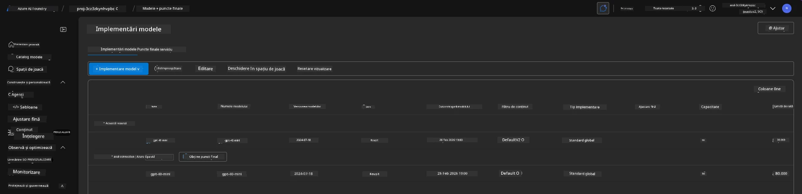
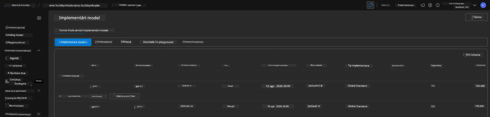

# 6. Demontarea infrastructurii

!!! tip "LA FINALUL ACESTUI MODUL VEȚI FI CAPABIL SĂ"

    - [ ] Înțelegeți importanța curățării resurselor și gestionării costurilor
    - [ ] Folosiți `azd down` pentru a dezabona infrastructura în siguranță
    - [ ] Recuperați serviciile cognitive șterse soft dacă este necesar
    - [ ] **Laborator 6:** Curățați resursele Azure și verificați eliminarea

---

## Exerciții bonus

Înainte de a demonta proiectul, acordați câteva minute pentru o explorare deschisă.

!!! info "Încercați aceste indicații pentru explorare"

    **Experimentați cu GitHub Copilot:**
    
    1. Întrebați: `Ce alte șabloane AZD aș putea încerca pentru scenarii multi-agent?`
    2. Întrebați: `Cum pot personaliza instrucțiunile agentului pentru un caz de utilizare în domeniul sănătății?`
    3. Întrebați: `Ce variabile de mediu controlează optimizarea costurilor?`
    
    **Explorați Portalul Azure:**
    
    1. Examinați metricile Application Insights pentru implementarea dvs.
    2. Verificați analiza costurilor pentru resursele provisionate
    3. Explorați din nou spațiul de joacă al agentului din portalul Microsoft Foundry

---

## Dezabonare infrastructură

1. Demontarea infrastructurii este la fel de ușoară ca:
      
      ```bash title="" linenums="0"
      azd down --purge
      ```
1. Flag-ul `--purge` asigură că de asemenea elimină definitiv resursele Cognitive Service șterse soft, eliberând astfel cotaționarea deținută de aceste resurse. Odată finalizat, veți vedea ceva de genul acesta:
      
      ```bash title="" linenums="0"
      ? Total resources to delete: 11, are you sure you want to continue? Yes
      Deleting your resources can take some time.
      (✓) Done: Deleted resource group rg-nitya-mshack-azd
      (✓) Done: Purging Cognitive Account: aoai-3cz3zkynhvpbc

      SUCCESS: Your application was removed from Azure in 11 minutes 4 seconds.
      ```

1. (Opțional) Dacă acum rulați din nou `azd up`, veți observa că modelul gpt-4.1 este implementat deoarece variabila de mediu a fost schimbată (și salvată) în folderul local `.azure`. 

      Iată implementările modelului **înainte**:

      

      Iar aici **după**:
      

---

<!-- CO-OP TRANSLATOR DISCLAIMER START -->
**Declinare a responsabilității**:  
Acest document a fost tradus folosind serviciul de traducere AI [Co-op Translator](https://github.com/Azure/co-op-translator). Deși ne străduim pentru acuratețe, vă rugăm să rețineți că traducerile automate pot conține erori sau inexactități. Documentul original în limba sa nativă trebuie considerat sursa autorizată. Pentru informații critice, se recomandă traducerea profesională realizată de un specialist uman. Nu ne asumăm răspunderea pentru eventualele neînțelegeri sau interpretări greșite care rezultă din utilizarea acestei traduceri.
<!-- CO-OP TRANSLATOR DISCLAIMER END -->