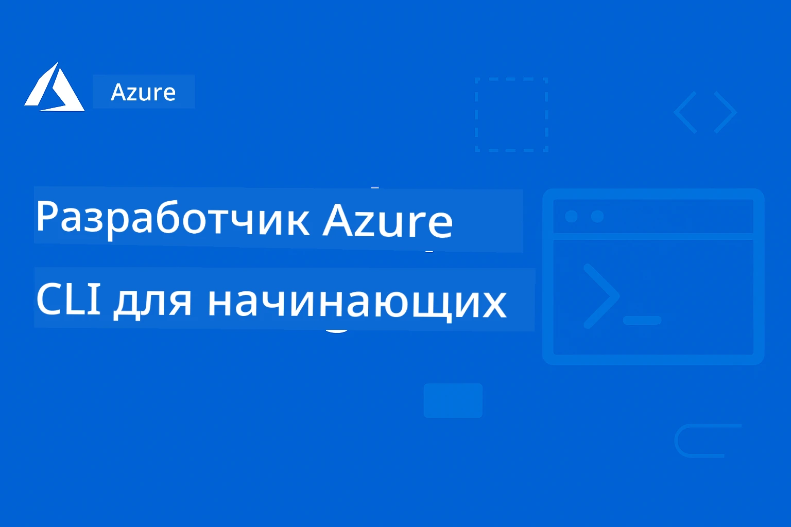

# AZD для начинающих: структурированное обучение

 

[](https://GitHub.com/microsoft/azd-for-beginners/watchers/)
[](https://GitHub.com/microsoft/azd-for-beginners/network/)
[](https://GitHub.com/microsoft/azd-for-beginners/stargazers/)

[](https://discord.gg/microsoft-azure)
[](https://discord.gg/nTYy5BXMWG)

---

### Автоматический перевод (всегда актуально)

<!-- CO-OP TRANSLATOR LANGUAGES TABLE START -->
[Арабский](../ar/README.md) | [Бенгальский](../bn/README.md) | [Болгарский](../bg/README.md) | [Бирманский (Мьянма)](../my/README.md) | [Китайский (упрощенный)](../zh-CN/README.md) | [Китайский (традиционный, Гонконг)](../zh-HK/README.md) | [Китайский (традиционный, Макао)](../zh-MO/README.md) | [Китайский (традиционный, Тайвань)](../zh-TW/README.md) | [Хорватский](../hr/README.md) | [Чешский](../cs/README.md) | [Датский](../da/README.md) | [Нидерландский](../nl/README.md) | [Эстонский](../et/README.md) | [Финский](../fi/README.md) | [Французский](../fr/README.md) | [Немецкий](../de/README.md) | [Греческий](../el/README.md) | [Иврит](../he/README.md) | [Хинди](../hi/README.md) | [Венгерский](../hu/README.md) | [Индонезийский](../id/README.md) | [Итальянский](../it/README.md) | [Японский](../ja/README.md) | [Каннада](../kn/README.md) | [Корейский](../ko/README.md) | [Литовский](../lt/README.md) | [Малайский](../ms/README.md) | [Малаялам](../ml/README.md) | [Маратхи](../mr/README.md) | [Непальский](../ne/README.md) | [Нигерийский язык пиджин](../pcm/README.md) | [Норвежский](../no/README.md) | [Персидский (фарси)](../fa/README.md) | [Польский](../pl/README.md) | [Португальский (Бразилия)](../pt-BR/README.md) | [Португальский (Португалия)](../pt-PT/README.md) | [Панджаби (Гурмукхи)](../pa/README.md) | [Румынский](../ro/README.md) | [Русский](./README.md) | [Сербский (кириллица)](../sr/README.md) | [Словацкий](../sk/README.md) | [Словенский](../sl/README.md) | [Испанский](../es/README.md) | [Суахили](../sw/README.md) | [Шведский](../sv/README.md) | [Тагалог (филиппинский)](../tl/README.md) | [Тамильский](../ta/README.md) | [Телугу](../te/README.md) | [Тайский](../th/README.md) | [Турецкий](../tr/README.md) | [Украинский](../uk/README.md) | [Урду](../ur/README.md) | [Вьетнамский](../vi/README.md)

> **Предпочитаете клонировать локально?**

> В этом репозитории есть 50+ языковых переводов, что значительно увеличивает размер скачивания. Чтобы клонировать без переводов, используйте sparse checkout:
> ```bash
> git clone --filter=blob:none --sparse https://github.com/microsoft/AZD-for-beginners.git
> cd AZD-for-beginners
> git sparse-checkout set --no-cone '/*' '!translations' '!translated_images'
> ```
> Это даст вам всё необходимое для прохождения курса с гораздо более быстрой загрузкой.
<!-- CO-OP TRANSLATOR LANGUAGES TABLE END -->

## 🚀 Что такое Azure Developer CLI (azd)?

**Azure Developer CLI (azd)** — это удобный для разработчиков инструмент командной строки, который упрощает развертывание приложений в Azure. Вместо ручного создания и связывания множества ресурсов Azure вы можете развернуть целое приложение одной командой.

### Магия `azd up`

```bash
# Эта одна команда делает всё:
# ✅ Создаёт все ресурсы Azure
# ✅ Настраивает сеть и безопасность
# ✅ Собирает код вашего приложения
# ✅ Развёртывает в Azure
# ✅ Предоставляет рабочую ссылку
azd up
```

**Вот и всё!** Никаких кликов в Azure Portal, никаких сложных шаблонов ARM для изучения, никакой ручной настройки — просто рабочие приложения в Azure.

---

## ❓ Azure Developer CLI vs Azure CLI: в чём разница?

Это самый распространённый вопрос среди новичков. Вот простой ответ:

| Функция | **Azure CLI (`az`)** | **Azure Developer CLI (`azd`)** |
|---------|---------------------|--------------------------------|
| **Цель** | Управление отдельными ресурсами Azure | Развертывание полноценных приложений |
| **Подход** | Сфокусирован на инфраструктуре | Сфокусирован на приложении |
| **Пример** | `az webapp create --name myapp...` | `azd up` |
| **Кривая обучения** | Нужно знать сервисы Azure | Достаточно знать своё приложение |
| **Лучше подходит для** | DevOps, инфраструктура | Разработчики, прототипирование |

### Простая аналогия

- **Azure CLI** — как иметь все инструменты для строительства дома: молотки, пилы, гвозди. Можно построить всё, но нужно знать строительное дело.
- **Azure Developer CLI** — как нанять подрядчика: вы описываете, что хотите, а он позаботится о строительстве.

### Когда использовать каждый

| Сценарий | Используйте это |
|----------|----------------|
| «Хочу быстро развернуть своё веб-приложение» | `azd up` |
| «Мне нужно просто создать учётную запись хранения» | `az storage account create` |
| «Строю полноценное ИИ-приложение» | `azd init --template azure-search-openai-demo` |
| «Мне нужно отладить конкретный ресурс Azure» | `az resource show` |
| «Хочу развернуть в продакшн за несколько минут» | `azd up --environment production` |

### Они работают вместе!

AZD использует Azure CLI под капотом. Можно использовать оба:
```bash
# Разверните приложение с помощью AZD
azd up

# Затем точно настройте конкретные ресурсы с помощью Azure CLI
az webapp config set --name myapp --always-on true
```

---

## 🌟 Ищите шаблоны в Awesome AZD

Не начинайте с нуля! **Awesome AZD** — сообщество с коллекцией готовых к развертыванию шаблонов:

| Ресурс | Описание |
|--------|----------|
| 🔗 [**Awesome AZD Gallery**](https://azure.github.io/awesome-azd/) | Просматривайте 200+ шаблонов с развертыванием в один клик |
| 🔗 [**Отправить шаблон**](https://github.com/Azure/awesome-azd/issues) | Внесите свой шаблон в сообщество |
| 🔗 [**Репозиторий GitHub**](https://github.com/Azure/awesome-azd) | Звёздьте и изучайте исходники |

### Популярные AI-шаблоны из Awesome AZD

```bash
# RAG-чат с Azure OpenAI + AI Search
azd init --template azure-search-openai-demo

# Быстрое чат-приложение с ИИ
azd init --template openai-chat-app-quickstart

# Агенты ИИ с Foundry Agents
azd init --template get-started-with-ai-agents
```

---

## 🎯 Начало работы в 3 шага

### Шаг 1: Установите AZD (2 минуты)

**Windows:**
```powershell
winget install microsoft.azd
```

**macOS:**
```bash
brew tap azure/azd && brew install azd
```

**Linux:**
```bash
curl -fsSL https://aka.ms/install-azd.sh | bash
```

### Шаг 2: Войдите в Azure

```bash
azd auth login
```

### Шаг 3: Разверните своё первое приложение

```bash
# Инициализировать из шаблона
azd init --template todo-nodejs-mongo

# Развернуть в Azure (создаёт всё!)
azd up
```

**🎉 Вот и всё!** Ваше приложение теперь работает в Azure.

### Уборка (не забудьте!)

```bash
# Remove all resources when done experimenting
azd down --force --purge
```

---

## 📚 Как пользоваться этим курсом

Этот курс рассчитан на **пошаговое обучение** — начинайте с того, что удобно, и двигайтесь дальше:

| Ваш опыт | Начните здесь |
|----------|--------------|
| **Новичок в Azure** | [Глава 1: Основы](../..) |
| **Знакомы с Azure, новичок в AZD** | [Глава 1: Основы](../..) |
| **Хотите развертывать AI-приложения** | [Глава 2: AI-первый подход](../..) |
| **Хочется практики** | [🎓 Интерактивный воркшоп](workshop/README.md) - 3-4 часа пошаговых лабораторий |
| **Нужны паттерны для продакшна** | [Глава 8: Продакшн и корпоративные паттерны](../..) |

### Быстрая настройка

1. **Склоньте этот репозиторий**: [](https://GitHub.com/microsoft/azd-for-beginners/fork)
2. **Клонируйте**: `git clone https://github.com/YOUR-USERNAME/azd-for-beginners.git`
3. **Получите помощь**: [Сообщество Azure Discord](https://discord.com/invite/ByRwuEEgH4)

> **Предпочитаете клонировать локально?**

> В этом репозитории есть 50+ языковых переводов, что значительно увеличивает размер скачивания. Чтобы клонировать без переводов, используйте sparse checkout:
> ```bash
> git clone --filter=blob:none --sparse https://github.com/microsoft/AZD-for-beginners.git
> cd AZD-for-beginners
> git sparse-checkout set --no-cone '/*' '!translations' '!translated_images'
> ```
> Это даст вам всё необходимое для прохождения курса с гораздо более быстрой загрузкой.


## Обзор курса

Освойте Azure Developer CLI (azd) через структурированные главы, предназначенные для последовательного изучения. **Особое внимание развертыванию AI-приложений с интеграцией Microsoft Foundry.**

### Почему этот курс важен для современных разработчиков

Исходя из идей сообщества Microsoft Foundry Discord, **45% разработчиков хотят использовать AZD для AI-задач**, но сталкиваются с проблемами:
- Сложные многосервисные AI-архитектуры
- Лучшие практики развертывания AI в продакшн  
- Интеграция и настройка сервисов Azure AI
- Оптимизация затрат для AI-нагрузок
- Отладка и решение специфичных для AI проблем развертывания

### Цели обучения

По окончании структурированного курса вы сможете:
- **Освоить основы AZD**: ключевые концепции, установка и настройка
- **Развертывать AI-приложения**: использовать AZD с Microsoft Foundry
- **Реализовать Infrastructure as Code**: управлять ресурсами Azure с помощью шаблонов Bicep
- **Устранять неполадки при развертывании**: решать типичные проблемы и отлаживать
- **Оптимизировать для продакшна**: безопасность, масштабирование, мониторинг и управление затратами
- **Создавать мультиагентные решения**: развертывать сложные AI-архитектуры

## 🗺️ Карта курса: Быстрая навигация по главам

У каждой главы есть отдельный README с целями обучения, быстрыми стартами и упражнениями:

| Глава | Тема | Уроки | Время | Сложность |
|---------|-------|---------|----------|------------|
| **[Глава 1: Основы](docs/chapter-01-foundation/README.md)** | Начало работы | [Основы AZD](docs/chapter-01-foundation/azd-basics.md) &#124; [Установка](docs/chapter-01-foundation/installation.md) &#124; [Первый проект](docs/chapter-01-foundation/first-project.md) | 30-45 мин | ⭐ |
| **[Глава 2: Разработка AI](docs/chapter-02-ai-development/README.md)** | AI-первый подход | [Интеграция с Foundry](docs/chapter-02-ai-development/microsoft-foundry-integration.md) &#124; [AI-Агенты](docs/chapter-02-ai-development/agents.md) &#124; [Развёртывание моделей](docs/chapter-02-ai-development/ai-model-deployment.md) &#124; [Воркшоп](docs/chapter-02-ai-development/ai-workshop-lab.md) | 1-2 часа | ⭐⭐ |
| **[Глава 3: Конфигурация](docs/chapter-03-configuration/README.md)** | Аутентификация и безопасность | [Конфигурация](docs/chapter-03-configuration/configuration.md) &#124; [Аутентификация и безопасность](docs/chapter-03-configuration/authsecurity.md) | 45-60 мин | ⭐⭐ |
| **[Глава 4: Инфраструктура](docs/chapter-04-infrastructure/README.md)** | IaC и развертывание | [Руководство по развертыванию](docs/chapter-04-infrastructure/deployment-guide.md) &#124; [Процесс Provisioning](docs/chapter-04-infrastructure/provisioning.md) | 1-1.5 часа | ⭐⭐⭐ |
| **[Гл. 5: Мультиагентные системы](docs/chapter-05-multi-agent/README.md)** | Решения с ИИ-агентами | [Ритейл-сценарий](examples/retail-scenario.md) &#124; [Паттерны координации](docs/chapter-06-pre-deployment/coordination-patterns.md) | 2-3 часа | ⭐⭐⭐⭐ |
| **[Гл. 6: Предварительная подготовка](docs/chapter-06-pre-deployment/README.md)** | Планирование и проверка | [Предварительная проверка](docs/chapter-06-pre-deployment/preflight-checks.md) &#124; [Планирование мощности](docs/chapter-06-pre-deployment/capacity-planning.md) &#124; [Выбор SKU](docs/chapter-06-pre-deployment/sku-selection.md) &#124; [App Insights](docs/chapter-06-pre-deployment/application-insights.md) | 1 час | ⭐⭐ |
| **[Гл. 7: Отладка](docs/chapter-07-troubleshooting/README.md)** | Отладка и исправление | [Распространённые проблемы](docs/chapter-07-troubleshooting/common-issues.md) &#124; [Отладка](docs/chapter-07-troubleshooting/debugging.md) &#124; [Проблемы с ИИ](docs/chapter-07-troubleshooting/ai-troubleshooting.md) | 1-1,5 часа | ⭐⭐ |
| **[Гл. 8: Продакшен](docs/chapter-08-production/README.md)** | Корпоративные паттерны | [Практики продакшена](docs/chapter-08-production/production-ai-practices.md) | 2-3 часа | ⭐⭐⭐⭐ |
| **[🎓 Мастерская](workshop/README.md)** | Практический курс | [Введение](workshop/docs/instructions/0-Introduction.md) &#124; [Выбор](workshop/docs/instructions/1-Select-AI-Template.md) &#124; [Проверка](workshop/docs/instructions/2-Validate-AI-Template.md) &#124; [Деконструкция](workshop/docs/instructions/3-Deconstruct-AI-Template.md) &#124; [Конфигурация](workshop/docs/instructions/4-Configure-AI-Template.md) &#124; [Настройка](workshop/docs/instructions/5-Customize-AI-Template.md) &#124; [Завершение](workshop/docs/instructions/6-Teardown-Infrastructure.md) &#124; [Итоги](workshop/docs/instructions/7-Wrap-up.md) | 3-4 часа | ⭐⭐ |

**Общая продолжительность курса:** ~10-14 часов | **Прогресс навыков:** Начинающий → Готов к продакшену

---

## 📚 Учебные главы

*Выберите путь обучения в зависимости от уровня опыта и целей*

### 🚀 Глава 1: Основы и Быстрый старт
**Требования**: Подписка Azure, базовые знания командной строки  
**Продолжительность**: 30-45 минут  
**Сложность**: ⭐

#### Что вы изучите
- Основы Azure Developer CLI
- Установка AZD на вашу платформу
- Ваше первое успешное развертывание

#### Учебные материалы
- **🎯 Начать здесь**: [Что такое Azure Developer CLI?](../..)
- **📖 Теория**: [Основы AZD](docs/chapter-01-foundation/azd-basics.md) - Ключевые концепции и терминология
- **⚙️ Установка**: [Установка и настройка](docs/chapter-01-foundation/installation.md) - Руководство по платформам
- **🛠️ Практика**: [Ваш первый проект](docs/chapter-01-foundation/first-project.md) - Пошаговое руководство
- **📋 Быстрая справка**: [Сокращённое руководство по командам](resources/cheat-sheet.md)

#### Практические задания
```bash
# Быстрая проверка установки
azd version

# Разверните ваше первое приложение
azd init --template todo-nodejs-mongo
azd up
```

**💡 Итог главы**: Успешно развернуть простое веб-приложение в Azure с использованием AZD

**✅ Проверка успеха:**
```bash
# После завершения главы 1 вы должны уметь:
azd version              # Показывает установленную версию
azd init --template todo-nodejs-mongo  # Инициализирует проект
azd up                  # Развёртывает в Azure
azd show                # Отображает URL запущенного приложения
# Приложение открывается в браузере и работает
azd down --force --purge  # Освобождает ресурсы
```

**📊 Время:** 30-45 минут  
**📈 Уровень после:** Способность самостоятельно развертывать базовые приложения

**✅ Проверка успеха:**
```bash
# После завершения Главы 1 вы должны уметь:
azd version              # Показывает установленную версию
azd init --template todo-nodejs-mongo  # Инициализирует проект
azd up                  # Развёртывает в Azure
azd show                # Отображает URL запущенного приложения
# Приложение открывается в браузере и работает
azd down --force --purge  # Очищает ресурсы
```

**📊 Время:** 30-45 минут  
**📈 Уровень после:** Способность самостоятельно развертывать базовые приложения

---

### 🤖 Глава 2: Разработка с приоритетом на ИИ (Рекомендуется разработчикам ИИ)
**Требования**: Завершена Глава 1  
**Продолжительность**: 1-2 часа  
**Сложность**: ⭐⭐

#### Что вы изучите
- Интеграция Microsoft Foundry с AZD
- Развёртывание приложений с ИИ
- Понимание конфигураций сервисов ИИ

#### Учебные материалы
- **🎯 Начать здесь**: [Интеграция Microsoft Foundry](docs/chapter-02-ai-development/microsoft-foundry-integration.md)
- **🤖 ИИ агенты**: [Руководство по ИИ агентам](docs/chapter-02-ai-development/agents.md) - Развёртывание интеллектуальных агентов с AZD
- **📖 Паттерны**: [Развёртывание ИИ-моделей](docs/chapter-02-ai-development/ai-model-deployment.md) - Развёртывание и управление ИИ-моделями
- **🛠️ Мастерская**: [ИИ мастерская](docs/chapter-02-ai-development/ai-workshop-lab.md) - Подготовка ИИ-решений к AZD
- **🎥 Интерактивное руководство**: [Материалы мастерской](workshop/README.md) - Обучение в браузере с MkDocs * Окружение DevContainer
- **📋 Шаблоны**: [Шаблоны Microsoft Foundry](../..)
- **📝 Примеры**: [Примеры развёртывания AZD](examples/README.md)

#### Практические задания
```bash
# Разверните ваше первое AI-приложение
azd init --template azure-search-openai-demo
azd up

# Попробуйте дополнительные шаблоны AI
azd init --template openai-chat-app-quickstart
azd init --template agent-openai-python-prompty
```

**💡 Итог главы**: Развернуть и настроить чат-приложение с ИИ и возможностями RAG

**✅ Проверка успеха:**
```bash
# После главы 2 вы сможете:
azd init --template azure-search-openai-demo
azd up
# Тестировать интерфейс чата с ИИ
# Задавать вопросы и получать ответы с поддержкой ИИ с источниками
# Проверять работу интеграции поиска
azd monitor  # Проверять, что Application Insights отображает телеметрию
azd down --force --purge
```

**📊 Время:** 1-2 часа  
**📈 Уровень после:** Способность развертывать и настраивать ИИ-приложения, готовые к продакшену  
**💰 Осведомлённость о затратах:** Понимание затрат $80-150/месяц на разработку, $300-3500/месяц на продакшен

#### 💰 Учет затрат на развёртывания ИИ

**Среда разработки (примерно $80-150/месяц):**
- Azure OpenAI (почасовая оплата): $0-50/месяц (в зависимости от токенов)
- AI Search (базовый уровень): $75/месяц
- Container Apps (потребление): $0-20/месяц
- Хранение (стандартное): $1-5/месяц

**Продакшен-среда (примерно $300-3500+/месяц):**
- Azure OpenAI (PTU для стабильной производительности): $3,000+/месяц ИЛИ почасовая оплата при высоком объёме
- AI Search (стандартный уровень): $250/месяц
- Container Apps (выделенный): $50-100/месяц
- Application Insights: $5-50/месяц
- Хранение (премиум): $10-50/месяц

**💡 Советы по оптимизации затрат:**
- Используйте **бесплатный уровень** Azure OpenAI для обучения (50,000 токенов/месяц включено)
- Запускайте `azd down` для освобождения ресурсов при неактивной разработке
- Начинайте с модели оплаты по потреблению, переходите на PTU только для продакшена
- Используйте `azd provision --preview` для оценки затрат до развёртывания
- Включайте авто-масштабирование: платите только за фактическое использование

**Мониторинг затрат:**
```bash
# Проверить оценочные ежемесячные затраты
azd provision --preview

# Отслеживать фактические затраты в портале Azure
az consumption budget list --resource-group <your-rg>
```

---

### ⚙️ Глава 3: Конфигурация и аутентификация
**Требования**: Завершена Глава 1  
**Продолжительность**: 45-60 минут  
**Сложность**: ⭐⭐

#### Что вы изучите
- Конфигурация и управление окружением
- Лучшие практики аутентификации и безопасности
- Именование ресурсов и организация

#### Учебные материалы
- **📖 Конфигурация**: [Руководство по конфигурации](docs/chapter-03-configuration/configuration.md) - Настройка окружения
- **🔐 Безопасность**: [Паттерны аутентификации и управляемые идентичности](docs/chapter-03-configuration/authsecurity.md) - Паттерны аутентификации
- **📝 Примеры**: [Пример приложения с базой данных](examples/database-app/README.md) - Примеры AZD баз данных

#### Практические задания
- Настройка нескольких окружений (разработка, тестирование, продакшен)
- Настройка аутентификации с управляемыми идентичностями
- Внедрение конфигураций для разных окружений

**💡 Итог главы**: Управлять несколькими окружениями с правильной аутентификацией и безопасностью

---

### 🏗️ Глава 4: Инфраструктура как код и развёртывание
**Требования**: Завершены Главы 1-3  
**Продолжительность**: 1-1,5 часа  
**Сложность**: ⭐⭐⭐

#### Что вы изучите
- Расширенные паттерны развёртывания
- Инфраструктура как код с Bicep
- Стратегии Provisioning ресурсов

#### Учебные материалы
- **📖 Развёртывание**: [Руководство по развёртыванию](docs/chapter-04-infrastructure/deployment-guide.md) - Полные workflow
- **🏗️ Provisioning**: [Provisioning ресурсов](docs/chapter-04-infrastructure/provisioning.md) - Управление ресурсами Azure
- **📝 Примеры**: [Пример Container App](../../examples/container-app) - Контейнерные развёртывания

#### Практические задания
- Создание пользовательских шаблонов Bicep
- Развёртывание многосервисных приложений
- Внедрение стратегий blue-green deployment

**💡 Итог главы**: Развертывать сложные многосервисные приложения с использованием пользовательских инфраструктурных шаблонов

---

### 🎯 Глава 5: Мультиагентные ИИ-решения (Продвинутый уровень)
**Требования**: Завершены Главы 1-2  
**Продолжительность**: 2-3 часа  
**Сложность**: ⭐⭐⭐⭐

#### Что вы изучите
- Паттерны архитектуры мультиагентов
- Оркестрация и координация агентов
- Развёртывания ИИ, готовые для продакшена

#### Учебные материалы
- **🤖 Пример проекта**: [Ритейл мультиагентное решение](examples/retail-scenario.md) - Полная реализация
- **🛠️ ARM шаблоны**: [Пакет ARM шаблонов](../../examples/retail-multiagent-arm-template) - Развёртывание одним кликом
- **📖 Архитектура**: [Паттерны координации мультиагентов](docs/chapter-06-pre-deployment/coordination-patterns.md) - Паттерны

#### Практические задания
```bash
# Развернуть полное розничное решение с несколькими агентами
cd examples/retail-multiagent-arm-template
./deploy.sh

# Изучить конфигурации агентов
az deployment group show --resource-group <rg-name> --name <deployment-name>
```

**💡 Итог главы**: Развернуть и управлять мультиагентным ИИ-решением для продакшена с агентами клиентов и инвентаризации

---

### 🔍 Глава 6: Предварительная проверка и планирование
**Требования**: Завершена Глава 4  
**Продолжительность**: 1 час  
**Сложность**: ⭐⭐

#### Что вы изучите
- Планирование мощности и проверка ресурсов
- Стратегии выбора SKU
- Предвариельные проверки и автоматизация

#### Учебные материалы
- **📊 Планирование**: [Планирование мощности](docs/chapter-06-pre-deployment/capacity-planning.md) - Проверка ресурсов
- **💰 Выбор**: [Выбор SKU](docs/chapter-06-pre-deployment/sku-selection.md) - Экономически эффективные решения
- **✅ Валидация**: [Предварительные проверки](docs/chapter-06-pre-deployment/preflight-checks.md) - Автоматические скрипты

#### Практические задания
- Запуск скриптов проверки мощности
- Оптимизация выбора SKU для снижения затрат
- Внедрение автоматических предразвёртывательных проверок

**💡 Итог главы**: Проверять и оптимизировать развёртывания до их выполнения

---

### 🚨 Глава 7: Отладка и устранение неисправностей
**Требования**: Завершена любая глава по развёртыванию  
**Продолжительность**: 1-1,5 часа  
**Сложность**: ⭐⭐

#### Что вы изучите
- Системные подходы к отладке
- Распространённые проблемы и их решения
- Особенности устранения неисправностей ИИ-сервисов

#### Учебные материалы
- **🔧 Распространённые проблемы**: [Часто задаваемые вопросы и решения](docs/chapter-07-troubleshooting/common-issues.md)
- **🕵️ Отладка**: [Руководство по отладке](docs/chapter-07-troubleshooting/debugging.md) - Пошаговые стратегии
- **🤖 Проблемы ИИ**: [Устранение неполадок ИИ](docs/chapter-07-troubleshooting/ai-troubleshooting.md) - Проблемы с ИИ-сервисами

#### Практические задания
- Диагностика сбоев при развёртывании
- Решение проблем аутентификации
- Отладка подключения к услугам ИИ

**💡 Итог главы**: Самостоятельно диагностировать и устранять распространённые проблемы развёртывания

---

### 🏢 Глава 8: Продакшен и корпоративные паттерны
**Требования**: Завершены Главы 1-4  
**Продолжительность**: 2-3 часа  
**Сложность**: ⭐⭐⭐⭐

#### Что вы изучите
- Стратегии развёртывания в продакшен
- Паттерны корпоративной безопасности
- Мониторинг и оптимизация затрат

#### Учебные материалы
- **🏭 Продакшен**: [Лучшие практики AI в продакшене](docs/chapter-08-production/production-ai-practices.md) - Корпоративные паттерны
- **📝 Примеры**: [Пример микросервисов](../../examples/microservices) - Сложные архитектуры
- **📊 Мониторинг**: [Интеграция Application Insights](docs/chapter-06-pre-deployment/application-insights.md) - Мониторинг

#### Практические задания
- Внедрение корпоративных паттернов безопасности
- Настройка комплексного мониторинга
- Развёртывание в продакшен с соблюдением корпоративных требований

**💡 Итог главы**: Развертывать приложения, готовые к корпоративному продакшену с полной функциональностью

---

## 🎓 Мастерская: Практический опыт обучения

> **⚠️ СТАТУС МАСТЕРСКОЙ: Активная разработка**  
> Материалы мастерской находятся в процессе разработки и доработки. Основные модули работают, но некоторые продвинутые разделы ещё не завершены. Мы активно работаем над полным завершением контента. [Отслеживать прогресс →](workshop/README.md)

### Интерактивные материалы мастерской  
**Полное практическое обучение с использованием браузерных инструментов и направленных упражнений**
Наши материалы для воркшопа предоставляют структурированный, интерактивный опыт обучения, который дополняет приведённую выше программу по главам. Воркшоп разработан как для самостоятельного изучения, так и для занятий под руководством инструктора.

#### 🛠️ Особенности воркшопа
- **Интерфейс в браузере**: Полноценный воркшоп на базе MkDocs с поиском, копированием и возможностями смены темы
- **Интеграция с GitHub Codespaces**: Настройка среды разработки в один клик
- **Структурированный учебный план**: 8-модульные пошаговые упражнения (всего 3-4 часа)
- **Прогрессивная методология**: Введение → Выбор → Проверка → Разбор → Конфигурация → Настройка → Завершение → Итог
- **Интерактивная среда DevContainer**: Преднастроенные инструменты и зависимости

#### 📚 Структура модулей воркшопа
Воркшоп следует **8-модульной прогрессивной методологии**, которая проведёт вас от знакомства с основами до мастерства в развертывании:

| Модуль | Тема | Что вы будете делать | Время |
|--------|-------|--------------------|--------|
| **0. Введение** | Обзор воркшопа | Понимание целей обучения, требований и структуры воркшопа | 15 мин |
| **1. Выбор** | Поиск шаблонов | Исследовать шаблоны AZD и выбрать подходящий AI-шаблон для вашего сценария | 20 мин |
| **2. Проверка** | Развертывание и проверка | Развернуть шаблон с помощью `azd up` и проверить работу инфраструктуры | 30 мин |
| **3. Разбор** | Понимание структуры | Использовать GitHub Copilot для изучения архитектуры шаблона, файлов Bicep и организации кода | 30 мин |
| **4. Конфигурация** | Глубокий разбор azure.yaml | Освоить конфигурацию `azure.yaml`, хуки жизненного цикла и переменные окружения | 30 мин |
| **5. Настройка** | Сделайте шаблон своим | Включить AI Search, трассировку, оценку и настроить под ваш сценарий | 45 мин |
| **6. Завершение** | Очистка | Безопасно деактивировать ресурсы с помощью `azd down --purge` | 15 мин |
| **7. Итог** | Следующие шаги | Обзор достигнутого, ключевых концепций и продолжение обучения | 15 мин |

**Порядок воркшопа:**
```
Introduction → Selection → Validation → Deconstruction → Configuration → Customization → Teardown → Wrap-up
     ↓            ↓           ↓              ↓               ↓              ↓            ↓           ↓
  Overview    Find the     Deploy &      Explore        Master         Customize     Clean up    Review &
             right        verify        code &        azure.yaml      for your      resources   next steps
             template                   structure                     scenario
```

#### 🚀 Начало работы с воркшопом
```bash
# Вариант 1: GitHub Codespaces (рекомендуется)
# Нажмите "Code" → "Create codespace on main" в репозитории

# Вариант 2: Локальная разработка
git clone https://github.com/microsoft/azd-for-beginners.git
cd azd-for-beginners/workshop
# Следуйте инструкциям по настройке в workshop/README.md
```

#### 🎯 Результаты обучения воркшопа
Завершив воркшоп, участники смогут:
- **Разворачивать продакшен-приложения AI**: Использовать AZD с сервисами Microsoft Foundry
- **Освоить мультиагентные архитектуры**: Реализовать координированные решения с AI-агентами
- **Внедрять лучшие практики безопасности**: Настраивать аутентификацию и контроль доступа
- **Оптимизировать масштабируемость**: Проектировать экономичные и производительные развертывания
- **Самостоятельно устранять проблемы**: Решать типичные ошибки развертывания

#### 📖 Ресурсы воркшопа
- **🎥 Интерактивное руководство**: [Материалы воркшопа](workshop/README.md) — обучение в браузере
- **📋 Инструкции по модулям**:
  - [0. Введение](workshop/docs/instructions/0-Introduction.md) — обзор и цели воркшопа
  - [1. Выбор](workshop/docs/instructions/1-Select-AI-Template.md) — поиск и выбор AI-шаблонов
  - [2. Проверка](workshop/docs/instructions/2-Validate-AI-Template.md) — развертывание и проверка шаблонов
  - [3. Разбор](workshop/docs/instructions/3-Deconstruct-AI-Template.md) — изучение архитектуры шаблонов
  - [4. Конфигурация](workshop/docs/instructions/4-Configure-AI-Template.md) — мастерство работы с azure.yaml
  - [5. Настройка](workshop/docs/instructions/5-Customize-AI-Template.md) — настройка под ваш сценарий
  - [6. Завершение](workshop/docs/instructions/6-Teardown-Infrastructure.md) — очистка ресурсов
  - [7. Итог](workshop/docs/instructions/7-Wrap-up.md) — обзор и дальнейшие шаги
- **🛠️ Лаборатория AI Workshop**: [AI Workshop Lab](docs/chapter-02-ai-development/ai-workshop-lab.md) — упражнения по AI
- **💡 Быстрый старт**: [Руководство по настройке воркшопа](workshop/README.md#quick-start) — конфигурация среды

**Отлично подходит для**: корпоративного обучения, университетских курсов, самостоятельного изучения и обучающих программ для разработчиков.

---

## 📖 Углублённый обзор возможностей AZD

Помимо базового функционала, AZD предлагает мощные возможности для продакшен-развертываний:

- **Развертывания на основе шаблонов** — Используйте готовые шаблоны для типовых приложений
- **Инфраструктура как код** — Управление ресурсами Azure с помощью Bicep или Terraform  
- **Интегрированные рабочие процессы** — Безшовное создание, развертывание и мониторинг приложений
- **Ориентированность на разработчика** — Оптимизация продуктивности и удобства работы разработчиков

### **AZD + Microsoft Foundry: идеальное решение для AI-развертываний**

**Зачем AZD для AI?** AZD решает основные проблемы разработчиков AI:

- **Готовые AI-шаблоны** — Преднастроенные шаблоны для Azure OpenAI, Cognitive Services и ML нагрузок
- **Безопасное AI-развертывание** — Встроенные шаблоны безопасности для AI-сервисов, ключей API и эндпоинтов моделей  
- **Паттерны продакшен AI** — Лучшие практики для масштабируемых и экономичных развертываний AI-приложений
- **Полный цикл рабочих процессов AI** — От разработки модели до продакшен-развертывания с мониторингом
- **Оптимизация затрат** — Интеллектуальное распределение ресурсов и масштабирование для AI-нагрузок
- **Интеграция Microsoft Foundry** — Плавное подключение к каталогу моделей и эндпоинтам Microsoft Foundry

---

## 🎯 Библиотека шаблонов и примеров

### Рекомендуемое: шаблоны Microsoft Foundry
**Начинайте здесь, если разворачиваете AI-приложения!**

> **Примечание:** Эти шаблоны демонстрируют разные AI-паттерны. Некоторые — внешние примеры Azure Samples, другие — локальные реализации.

| Шаблон | Глава | Сложность | Сервисы | Тип |
|--------|-------|-----------|---------|-----|
| [**Начало работы с AI-чатом**](https://github.com/Azure-Samples/get-started-with-ai-chat) | Глава 2 | ⭐⭐ | AzureOpenAI + Azure AI Model Inference API + Azure AI Search + Azure Container Apps + Application Insights | Внешний |
| [**Начало работы с AI-агентами**](https://github.com/Azure-Samples/get-started-with-ai-agents) | Глава 2 | ⭐⭐ | Foundry Agents + AzureOpenAI + Azure AI Search + Azure Container Apps + Application Insights| Внешний |
| [**Демо Azure Search + OpenAI**](https://github.com/Azure-Samples/azure-search-openai-demo) | Глава 2 | ⭐⭐ | AzureOpenAI + Azure AI Search + App Service + Storage | Внешний |
| [**Quickstart OpenAI Chat App**](https://github.com/Azure-Samples/openai-chat-app-quickstart) | Глава 2 | ⭐ | AzureOpenAI + Container Apps + Application Insights | Внешний |
| [**Agent OpenAI Python Prompty**](https://github.com/Azure-Samples/agent-openai-python-prompty) | Глава 5 | ⭐⭐⭐ | AzureOpenAI + Azure Functions + Prompty | Внешний |
| [**Contoso Chat RAG**](https://github.com/Azure-Samples/contoso-chat) | Глава 8 | ⭐⭐⭐⭐ | AzureOpenAI + AI Search + Cosmos DB + Container Apps | Внешний |
| [**Розничное мультиагентное решение**](examples/retail-scenario.md) | Глава 5 | ⭐⭐⭐⭐ | AzureOpenAI + AI Search + Storage + Container Apps + Cosmos DB | **Локальный** |

### Рекомендуемое: Полные сценарии обучения
**Шаблоны продакшен-приложений по главам обучения**

| Шаблон | Глава обучения | Сложность | Ключевые навыки |
|--------|----------------|-----------|-----------------|
| [**openai-chat-app-quickstart**](https://github.com/Azure-Samples/openai-chat-app-quickstart) | Глава 2 | ⭐ | Основные паттерны развертывания AI |
| [**azure-search-openai-demo**](https://github.com/Azure-Samples/azure-search-openai-demo) | Глава 2 | ⭐⭐ | Реализация RAG с Azure AI Search |
| [**ai-document-processing**](https://github.com/Azure-Samples/ai-document-processing) | Глава 4 | ⭐⭐ | Интеграция интеллектуальной обработки документов |
| [**agent-openai-python-prompty**](https://github.com/Azure-Samples/agent-openai-python-prompty) | Глава 5 | ⭐⭐⭐ | Фреймворк агентов и вызовы функций |
| [**contoso-chat**](https://github.com/Azure-Samples/contoso-chat) | Глава 8 | ⭐⭐⭐ | Оркестрация корпоративного AI |
| [**retail-multi-agent-solution**](examples/retail-scenario.md) | Глава 5 | ⭐⭐⭐⭐ | Мультиагентная архитектура с агентами по клиентам и запасам |

### Обучение по типу примеров

> **📌 Локальные vs внешние примеры:**  
> **Локальные примеры** (в этом репозитории) = готовы к использованию сразу  
> **Внешние примеры** (Azure Samples) = клонируются из связанных репозиториев

#### Локальные примеры (Готовы к использованию)
- [**Розничное мультиагентное решение**](examples/retail-scenario.md) — Полная продакшен-реализация с шаблонами ARM
  - Мультиагентная архитектура (агенты Клиентов и Запасов)
  - Комплексный мониторинг и оценка
  - Развёртывание в один клик через шаблон ARM

#### Локальные примеры — контейнерные приложения (главы 2-5)
**Полные примеры развертывания контейнеров в этом репозитории:**
- [**Примеры Container App**](examples/container-app/README.md) — Полное руководство по контейнерным развертываниям
  - [Простой Flask API](../../examples/container-app/simple-flask-api) — Базовый REST API с масштабированием до нуля
  - [Микросервисная архитектура](../../examples/container-app/microservices) — Продакшен-развертывание многосервисного приложения
  - Быстрый старт, продакшен и продвинутые паттерны развертывания
  - Руководство по мониторингу, безопасности и оптимизации затрат

#### Внешние примеры — простые приложения (главы 1-2)
**Клонируйте эти репозитории Azure Samples для начала:**
- [Простое веб-приложение - Node.js + MongoDB](https://github.com/Azure-Samples/todo-nodejs-mongo) — Основные паттерны развертывания
- [Статический сайт - React SPA](https://github.com/Azure-Samples/todo-csharp-sql-swa-func) — Развертывание статического контента
- [Container App - Python Flask](https://github.com/Azure-Samples/container-apps-store-api-microservice) — Развертывание REST API

#### Внешние примеры — интеграция с базами данных (главы 3-4)  
- [Приложение с базой данных - C# + SQL](https://github.com/Azure-Samples/todo-csharp-sql) — Паттерны подключения к базе данных
- [Functions + Cosmos DB](https://github.com/Azure-Samples/todo-python-mongo-swa-func) — Безсерверные рабочие процессы с данными

#### Внешние примеры — продвинутые паттерны (главы 4-8)
- [Java микросервисы](https://github.com/Azure-Samples/java-microservices-aca-lab) — Многосервисная архитектура
- [Jobs в Container Apps](https://github.com/Azure-Samples/container-apps-jobs) — Фоновая обработка  
- [Корпоративный ML pipeline](https://github.com/Azure-Samples/mlops-v2) — Продакшен-паттерны ML

### Коллекции внешних шаблонов
- [**Официальная галерея шаблонов AZD**](https://azure.github.io/awesome-azd/) — Кураторская коллекция официальных и сообществных шаблонов
- [**Шаблоны Azure Developer CLI**](https://learn.microsoft.com/en-us/azure/developer/azure-developer-cli/azd-templates) — Документация по шаблонам Microsoft Learn
- [**Каталог примеров**](examples/README.md) — Локальные учебные примеры с подробными объяснениями

---

## 📚 Ресурсы для обучения и ссылки

### Быстрые справочники
- [**Справочник команд**](resources/cheat-sheet.md) — Основные команды azd по главам
- [**Глоссарий**](resources/glossary.md) — Терминология Azure и azd  
- [**FAQ**](resources/faq.md) — Частые вопросы по главам
- [**Учебное руководство**](resources/study-guide.md) — Всеобъемлющие практические упражнения

### Практические воркшопы
- [**AI Workshop Lab**](docs/chapter-02-ai-development/ai-workshop-lab.md) — Сделайте ваши AI-решения deployable с помощью AZD (2-3 часа)
- [**Интерактивный воркшоп**](workshop/README.md) — 8-модульные пошаговые упражнения с MkDocs и GitHub Codespaces
  - Проходит этапы: Введение → Выбор → Проверка → Разбор → Конфигурация → Настройка → Завершение → Итог

### Внешние обучающие ресурсы
- [Документация Azure Developer CLI](https://learn.microsoft.com/en-us/azure/developer/azure-developer-cli/)
- [Центр архитектуры Azure](https://learn.microsoft.com/en-us/azure/architecture/)
- [Калькулятор стоимости Azure](https://azure.microsoft.com/pricing/calculator/)
- [Статус Azure](https://status.azure.com/)

---

## 🔧 Быстрый гид по устранению неполадок

**Типичные проблемы начинающих и быстрые решения:**

<details>
<summary><strong>❌ "azd: команда не найдена"</strong></summary>

```bash
# Сначала установите AZD
# Windows (PowerShell):
winget install microsoft.azd

# macOS:
brew tap azure/azd && brew install azd

# Linux:
curl -fsSL https://aka.ms/install-azd.sh | bash

# Проверьте установку
azd version
```
</details>

<details>
<summary><strong>❌ "Подписка не найдена" или "Подписка не установлена"</strong></summary>

```bash
# Список доступных подписок
az account list --output table

# Установить подписку по умолчанию
az account set --subscription "<subscription-id-or-name>"

# Установить для среды AZD
azd env set AZURE_SUBSCRIPTION_ID "<subscription-id>"

# Проверить
az account show
```
</details>

<details>
<summary><strong>❌ "Недостаточно квоты" или "Превышение квоты"</strong></summary>

```bash
# Попробуйте другой регион Azure
azd env set AZURE_LOCATION "westus2"
azd up

# Или используйте меньшие SKU в разработке
# Отредактируйте infra/main.parameters.json:
{
  "sku": "B1"  // Instead of "P1V2"
}
```
</details>

<details>
<summary><strong>❌ Сбой "azd up" на полпути</strong></summary>
```bash
# Вариант 1: Очистить и повторить попытку
azd down --force --purge
azd up

# Вариант 2: Просто исправить инфраструктуру
azd provision

# Вариант 3: Проверить подробный статус
azd show

# Вариант 4: Проверить логи в Azure Monitor
azd monitor --logs
```
</details>

<details>
<summary><strong>❌ «Ошибка аутентификации» или «Токен истек»</strong></summary>

```bash
# Повторная аутентификация
az logout
az login

azd auth logout
azd auth login

# Проверить аутентификацию
az account show
```
</details>

<details>
<summary><strong>❌ «Ресурс уже существует» или конфликты имен</strong></summary>

```bash
# AZD генерирует уникальные имена, но если возникает конфликт:
azd down --force --purge

# Тогда попробуйте снова с новым окружением
azd env new dev-v2
azd up
```
</details>

<details>
<summary><strong>❌ Развертывание шаблона занимает слишком много времени</strong></summary>

**Обычные времена ожидания:**
- Простое веб-приложение: 5-10 минут
- Приложение с базой данных: 10-15 минут
- AI-приложения: 15-25 минут (поставки OpenAI идут медленно)

```bash
# Проверить прогресс
azd show

# Если застряли более 30 минут, проверьте портал Azure:
azd monitor
# Ищите неудачные развертывания
```
</details>

<details>
<summary><strong>❌ «Отказано в доступе» или «Запрещено»</strong></summary>

```bash
# Проверьте свою роль в Azure
az role assignment list --assignee $(az account show --query user.name -o tsv)

# Вам нужна роль не ниже "Contributor"
# Попросите администратора Azure предоставить:
# - Contributor (для ресурсов)
# - User Access Administrator (для назначений ролей)
```
</details>

<details>
<summary><strong>❌ Не удается найти URL развернутого приложения</strong></summary>

```bash
# Показать все конечные точки службы
azd show

# Или открыть портал Azure
azd monitor

# Проверить конкретную службу
azd env get-values
# Искать переменные *_URL
```
</details>

### 📚 Полные ресурсы по устранению неполадок

- **Руководство по распространённым проблемам:** [Подробные решения](docs/chapter-07-troubleshooting/common-issues.md)
- **Проблемы, связанные с AI:** [Устранение неполадок AI](docs/chapter-07-troubleshooting/ai-troubleshooting.md)
- **Руководство по отладке:** [Пошаговая отладка](docs/chapter-07-troubleshooting/debugging.md)
- **Получить помощь:** [Azure Discord](https://discord.gg/microsoft-azure) #azure-developer-cli

---

## 🎓 Завершение курса и сертификация

### Отслеживание прогресса
Отслеживайте свой учебный прогресс по главам:

- [ ] **Глава 1**: Основы и быстрый старт ✅
- [ ] **Глава 2**: Разработка с приоритетом AI ✅  
- [ ] **Глава 3**: Конфигурация и аутентификация ✅
- [ ] **Глава 4**: Инфраструктура как код и развертывание ✅
- [ ] **Глава 5**: Многоагентные AI-решения ✅
- [ ] **Глава 6**: Предварительная проверка и планирование перед развертыванием ✅
- [ ] **Глава 7**: Устранение неполадок и отладка ✅
- [ ] **Глава 8**: Продакшн и корпоративные шаблоны ✅

### Проверка знаний
После завершения каждой главы подтвердите свои знания:
1. **Практическое упражнение**: Выполните практическое развертывание по главе
2. **Проверка знаний**: Ознакомьтесь с разделом FAQ по вашей главе
3. **Обсуждение в сообществе**: Поделитесь своим опытом в Azure Discord
4. **Следующая глава**: Перейдите к следующему уровню сложности

### Преимущества завершения курса
После прохождения всех глав вы получите:
- **Опыт в продакшне**: Развернутые реальные AI-приложения в Azure
- **Профессиональные навыки**: Возможности корпоративного развертывания  
- **Признание в сообществе**: Активный участник сообщества разработчиков Azure
- **Карьера**: Востребованные навыки AZD и развертывания AI

---

## 🤝 Сообщество и поддержка

### Получить помощь и поддержку
- **Технические проблемы**: [Сообщить об ошибках и запросить функции](https://github.com/microsoft/azd-for-beginners/issues)
- **Вопросы по обучению**: [Сообщество Microsoft Azure Discord](https://discord.gg/microsoft-azure) и [](https://discord.gg/nTYy5BXMWG)
- **Специфическая помощь по AI**: Присоединяйтесь к [](https://discord.gg/nTYy5BXMWG)
- **Документация**: [Официальная документация Azure Developer CLI](https://learn.microsoft.com/en-us/azure/developer/azure-developer-cli/)

### Мнения сообщества из Microsoft Foundry Discord

**Недавние результаты опроса в канале #Azure:**
- **45%** разработчиков хотят использовать AZD для AI-нагрузок
- **Основные сложности**: Развертывания с несколькими сервисами, управление учетными данными, готовность к продакшну  
- **Самое востребованное**: Шаблоны для AI, руководства по устранению проблем, лучшие практики

**Присоединяйтесь к нашему сообществу, чтобы:**
- Делиться опытом использования AZD + AI и получать помощь
- Получать ранний доступ к новым AI-шаблонам
- Вносить вклад в лучшие практики развертывания AI
- Влиять на развитие будущих возможностей AI + AZD

### Как внести вклад в курс
Мы приветствуем вклад! Пожалуйста, прочитайте наше [Руководство по внесению вклада](CONTRIBUTING.md) для деталей о:
- **Улучшении контента**: Расширение существующих глав и примеров
- **Новых примерах**: Добавление реальных сценариев и шаблонов  
- **Переводе**: Помощь в поддержке многоязычности
- **Сообщениях об ошибках**: Улучшение точности и ясности
- **Правилах сообщества**: Следование нашим инклюзивным правилам

---

## 📄 Информация о курсе

### Лицензия
Этот проект лицензирован по лицензии MIT — смотрите файл [LICENSE](../../LICENSE) для подробностей.

### Связанные обучающие ресурсы Microsoft

Наша команда создает другие комплексные обучающие курсы:

<!-- CO-OP TRANSLATOR OTHER COURSES START -->
### LangChain
[](https://aka.ms/langchain4j-for-beginners)
[](https://aka.ms/langchainjs-for-beginners?WT.mc_id=m365-94501-dwahlin)
[](https://github.com/microsoft/langchain-for-beginners?WT.mc_id=m365-94501-dwahlin)
---

### Azure / Edge / MCP / Агентства
[](https://github.com/microsoft/AZD-for-beginners?WT.mc_id=academic-105485-koreyst)
[](https://github.com/microsoft/edgeai-for-beginners?WT.mc_id=academic-105485-koreyst)
[](https://github.com/microsoft/mcp-for-beginners?WT.mc_id=academic-105485-koreyst)
[](https://github.com/microsoft/ai-agents-for-beginners?WT.mc_id=academic-105485-koreyst)

---
 
### Серия Generative AI
[](https://github.com/microsoft/generative-ai-for-beginners?WT.mc_id=academic-105485-koreyst)
[-9333EA?style=for-the-badge&labelColor=E5E7EB&color=9333EA)](https://github.com/microsoft/Generative-AI-for-beginners-dotnet?WT.mc_id=academic-105485-koreyst)
[-C084FC?style=for-the-badge&labelColor=E5E7EB&color=C084FC)](https://github.com/microsoft/generative-ai-for-beginners-java?WT.mc_id=academic-105485-koreyst)
[-E879F9?style=for-the-badge&labelColor=E5E7EB&color=E879F9)](https://github.com/microsoft/generative-ai-with-javascript?WT.mc_id=academic-105485-koreyst)

---
 
### Основное обучение
[](https://aka.ms/ml-beginners?WT.mc_id=academic-105485-koreyst)
[](https://aka.ms/datascience-beginners?WT.mc_id=academic-105485-koreyst)
[](https://aka.ms/ai-beginners?WT.mc_id=academic-105485-koreyst)
[](https://github.com/microsoft/Security-101?WT.mc_id=academic-96948-sayoung)
[](https://aka.ms/webdev-beginners?WT.mc_id=academic-105485-koreyst)
[](https://aka.ms/iot-beginners?WT.mc_id=academic-105485-koreyst)
[](https://github.com/microsoft/xr-development-for-beginners?WT.mc_id=academic-105485-koreyst)

---
 
### Серия Copilot
[](https://aka.ms/GitHubCopilotAI?WT.mc_id=academic-105485-koreyst)
[](https://github.com/microsoft/mastering-github-copilot-for-dotnet-csharp-developers?WT.mc_id=academic-105485-koreyst)
[](https://github.com/microsoft/CopilotAdventures?WT.mc_id=academic-105485-koreyst)
<!-- CO-OP TRANSLATOR OTHER COURSES END -->

---

## 🗺️ Навигация по курсу

**🚀 Готовы начать обучение?**

**Начинающие**: Начните с [Глава 1: Основы и быстрый старт](../..)  
**Разработчики ИИ**: Перейти к [Глава 2: Разработка с приоритетом для ИИ](../..)  
**Опытные разработчики**: Начать с [Глава 3: Конфигурация и аутентификация](../..)

**Следующие шаги**: [Начать главу 1 - Основы AZD](docs/chapter-01-foundation/azd-basics.md) →

---

<!-- CO-OP TRANSLATOR DISCLAIMER START -->
**Отказ от ответственности**:  
Этот документ был переведен с помощью сервиса автоматического перевода [Co-op Translator](https://github.com/Azure/co-op-translator). Несмотря на наши усилия обеспечить точность, имейте в виду, что автоматический перевод может содержать ошибки или неточности. Оригинальный документ на его исходном языке следует считать авторитетным источником. Для критически важной информации рекомендуется профессиональный перевод человеком. Мы не несем ответственности за любые недоразумения или неправильные толкования, возникшие в результате использования данного перевода.
<!-- CO-OP TRANSLATOR DISCLAIMER END -->