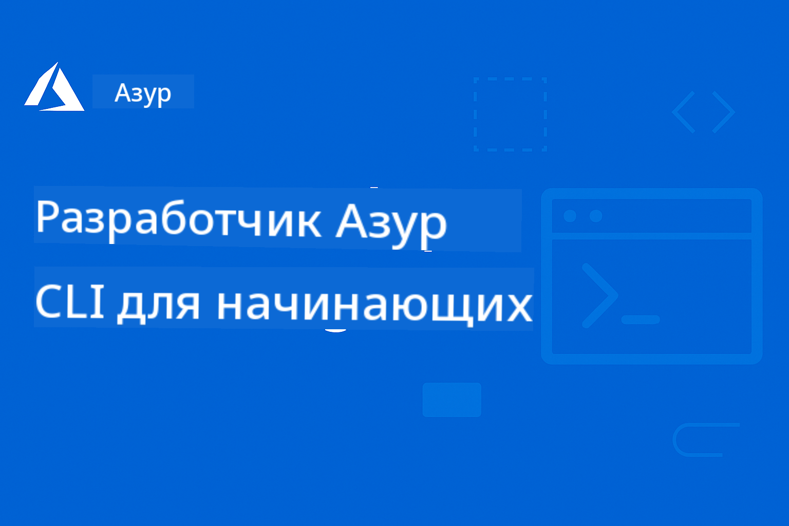

<!--
CO_OP_TRANSLATOR_METADATA:
{
  "original_hash": "9d6a833ed38e4fb2c726d3955fc8a726",
  "translation_date": "2025-12-19T10:08:59+00:00",
  "source_file": "README.md",
  "language_code": "ru"
}
-->
# AZD для начинающих: структурированное обучение

 

[](https://GitHub.com/microsoft/azd-for-beginners/watchers/)
[](https://GitHub.com/microsoft/azd-for-beginners/network/)
[](https://GitHub.com/microsoft/azd-for-beginners/stargazers/)

[](https://discord.gg/microsoft-azure)
[](https://discord.gg/nTYy5BXMWG)

## Начало работы с этим курсом

Следуйте этим шагам, чтобы начать обучение AZD:

1. **Форкните репозиторий**: Нажмите [](https://GitHub.com/microsoft/azd-for-beginners/fork)
2. **Клонируйте репозиторий**: `git clone https://github.com/microsoft/azd-for-beginners.git`
3. **Присоединяйтесь к сообществу**: [Сообщества Azure Discord](https://discord.com/invite/ByRwuEEgH4) для поддержки экспертов
4. **Выберите путь обучения**: Выберите главу ниже, соответствующую вашему уровню опыта

### Поддержка нескольких языков

#### Автоматические переводы (всегда актуальные)

<!-- CO-OP TRANSLATOR LANGUAGES TABLE START -->
[Arabic](../ar/README.md) | [Bengali](../bn/README.md) | [Bulgarian](../bg/README.md) | [Burmese (Myanmar)](../my/README.md) | [Chinese (Simplified)](../zh/README.md) | [Chinese (Traditional, Hong Kong)](../hk/README.md) | [Chinese (Traditional, Macau)](../mo/README.md) | [Chinese (Traditional, Taiwan)](../tw/README.md) | [Croatian](../hr/README.md) | [Czech](../cs/README.md) | [Danish](../da/README.md) | [Dutch](../nl/README.md) | [Estonian](../et/README.md) | [Finnish](../fi/README.md) | [French](../fr/README.md) | [German](../de/README.md) | [Greek](../el/README.md) | [Hebrew](../he/README.md) | [Hindi](../hi/README.md) | [Hungarian](../hu/README.md) | [Indonesian](../id/README.md) | [Italian](../it/README.md) | [Japanese](../ja/README.md) | [Kannada](../kn/README.md) | [Korean](../ko/README.md) | [Lithuanian](../lt/README.md) | [Malay](../ms/README.md) | [Malayalam](../ml/README.md) | [Marathi](../mr/README.md) | [Nepali](../ne/README.md) | [Nigerian Pidgin](../pcm/README.md) | [Norwegian](../no/README.md) | [Persian (Farsi)](../fa/README.md) | [Polish](../pl/README.md) | [Portuguese (Brazil)](../br/README.md) | [Portuguese (Portugal)](../pt/README.md) | [Punjabi (Gurmukhi)](../pa/README.md) | [Romanian](../ro/README.md) | [Russian](./README.md) | [Serbian (Cyrillic)](../sr/README.md) | [Slovak](../sk/README.md) | [Slovenian](../sl/README.md) | [Spanish](../es/README.md) | [Swahili](../sw/README.md) | [Swedish](../sv/README.md) | [Tagalog (Filipino)](../tl/README.md) | [Tamil](../ta/README.md) | [Telugu](../te/README.md) | [Thai](../th/README.md) | [Turkish](../tr/README.md) | [Ukrainian](../uk/README.md) | [Urdu](../ur/README.md) | [Vietnamese](../vi/README.md)
<!-- CO-OP TRANSLATOR LANGUAGES TABLE END -->

## Обзор курса

Освойте Azure Developer CLI (azd) через структурированные главы, разработанные для поэтапного обучения. **Особое внимание уделяется развертыванию AI-приложений с интеграцией Microsoft Foundry.**

### Почему этот курс важен для современных разработчиков

Основываясь на данных сообщества Microsoft Foundry Discord, **45% разработчиков хотят использовать AZD для AI-нагрузок**, но сталкиваются с проблемами:
- Сложные много-сервисные AI-архитектуры
- Лучшие практики развертывания AI в продакшн  
- Интеграция и настройка Azure AI сервисов
- Оптимизация затрат на AI-нагрузки
- Устранение неполадок, специфичных для AI-развертываний

### Цели обучения

Пройдя этот структурированный курс, вы:
- **Освоите основы AZD**: ключевые концепции, установка и настройка
- **Развернете AI-приложения**: использование AZD с сервисами Microsoft Foundry
- **Реализуете инфраструктуру как код**: управление ресурсами Azure с помощью шаблонов Bicep
- **Устраните неполадки развертываний**: решение распространенных проблем и отладка
- **Оптимизируете для продакшна**: безопасность, масштабирование, мониторинг и управление затратами
- **Создадите мультиагентные решения**: развертывание сложных AI-архитектур

## 📚 Главы обучения

*Выберите путь обучения в зависимости от уровня опыта и целей*

### 🚀 Глава 1: Основы и быстрый старт
**Требования**: подписка Azure, базовые знания командной строки  
**Длительность**: 30-45 минут  
**Сложность**: ⭐

#### Что вы изучите
- Основы Azure Developer CLI
- Установка AZD на вашу платформу
- Ваше первое успешное развертывание

#### Учебные материалы
- **🎯 Начните здесь**: [Что такое Azure Developer CLI?](../..)
- **📖 Теория**: [Основы AZD](docs/getting-started/azd-basics.md) - ключевые концепции и терминология
- **⚙️ Настройка**: [Установка и настройка](docs/getting-started/installation.md) - руководства по платформам
- **🛠️ Практика**: [Ваш первый проект](docs/getting-started/first-project.md) - пошаговое руководство
- **📋 Быстрая справка**: [Шпаргалка команд](resources/cheat-sheet.md)

#### Практические упражнения
```bash
# Быстрая проверка установки
azd version

# Разверните ваше первое приложение
azd init --template todo-nodejs-mongo
azd up
```

**💡 Результат главы**: Успешно развернуть простое веб-приложение в Azure с помощью AZD

**✅ Проверка успеха:**
```bash
# После завершения главы 1 вы должны уметь:
azd version              # Показывает установленную версию
azd init --template todo-nodejs-mongo  # Инициализирует проект
azd up                  # Разворачивает в Azure
azd show                # Отображает URL запущенного приложения
# Приложение открывается в браузере и работает
azd down --force --purge  # Очищает ресурсы
```

**📊 Время на выполнение:** 30-45 минут  
**📈 Уровень после:** Способность самостоятельно развертывать базовые приложения

**✅ Проверка успеха:**
```bash
# После завершения главы 1 вы должны уметь:
azd version              # Показывает установленную версию
azd init --template todo-nodejs-mongo  # Инициализирует проект
azd up                  # Развёртывает в Azure
azd show                # Отображает URL запущенного приложения
# Приложение открывается в браузере и работает
azd down --force --purge  # Очищает ресурсы
```

**📊 Время на выполнение:** 30-45 минут  
**📈 Уровень после:** Способность самостоятельно развертывать базовые приложения

---

### 🤖 Глава 2: Разработка с приоритетом AI (Рекомендуется для AI-разработчиков)
**Требования**: завершена Глава 1  
**Длительность**: 1-2 часа  
**Сложность**: ⭐⭐

#### Что вы изучите
- Интеграция Microsoft Foundry с AZD
- Развертывание AI-приложений
- Понимание конфигураций AI-сервисов

#### Учебные материалы
- **🎯 Начните здесь**: [Интеграция Microsoft Foundry](docs/microsoft-foundry/microsoft-foundry-integration.md)
- **📖 Шаблоны**: [Развертывание AI-моделей](docs/microsoft-foundry/ai-model-deployment.md) - развертывание и управление AI-моделями
- **🛠️ Лаборатория**: [AI Workshop Lab](docs/microsoft-foundry/ai-workshop-lab.md) - подготовка AI-решений к AZD
- **🎥 Интерактивное руководство**: [Материалы воркшопа](workshop/README.md) - обучение в браузере с MkDocs * DevContainer Environment
- **📋 Шаблоны**: [Шаблоны Microsoft Foundry](../..)
- **📝 Примеры**: [Примеры развертывания AZD](examples/README.md)

#### Практические упражнения
```bash
# Разверните ваше первое AI-приложение
azd init --template azure-search-openai-demo
azd up

# Попробуйте дополнительные шаблоны AI
azd init --template openai-chat-app-quickstart
azd init --template agent-openai-python-prompty
```

**💡 Результат главы**: Развернуть и настроить AI-чат с возможностями RAG

**✅ Проверка успеха:**
```bash
# После главы 2 вы должны уметь:
azd init --template azure-search-openai-demo
azd up
# Тестировать интерфейс чата с ИИ
# Задавать вопросы и получать ответы с поддержкой ИИ с указанием источников
# Проверять работу интеграции поиска
azd monitor  # Проверять, что Application Insights отображает телеметрию
azd down --force --purge
```

**📊 Время на выполнение:** 1-2 часа  
**📈 Уровень после:** Способность развертывать и настраивать AI-приложения, готовые к продакшн  
**💰 Осведомленность о затратах:** Понимание затрат на разработку $80-150/мес, на продакшн $300-3500/мес

#### 💰 Затраты на AI-развертывания

**Среда разработки (примерно $80-150/мес):**
- Azure OpenAI (оплата по факту): $0-50/мес (в зависимости от использования токенов)
- AI Search (базовый уровень): $75/мес
- Container Apps (потребление): $0-20/мес
- Хранение (стандарт): $1-5/мес

**Продакшн-среда (примерно $300-3500+/мес):**
- Azure OpenAI (PTU для стабильной производительности): $3000+/мес ИЛИ оплата по факту при большом объеме
- AI Search (стандартный уровень): $250/мес
- Container Apps (выделенный): $50-100/мес
- Application Insights: $5-50/мес
- Хранение (премиум): $10-50/мес

**💡 Советы по оптимизации затрат:**
- Используйте **бесплатный уровень** Azure OpenAI для обучения (включено 50,000 токенов/мес)
- Запускайте `azd down` для освобождения ресурсов, когда не разрабатываете активно
- Начинайте с оплаты по потреблению, переходите на PTU только для продакшна
- Используйте `azd provision --preview` для оценки затрат перед развертыванием
- Включайте авто-масштабирование: платите только за фактическое использование

**Мониторинг затрат:**
```bash
# Проверьте предполагаемые ежемесячные расходы
azd provision --preview

# Отслеживайте фактические расходы в портале Azure
az consumption budget list --resource-group <your-rg>
```

---

### ⚙️ Глава 3: Конфигурация и аутентификация
**Требования**: завершена Глава 1  
**Длительность**: 45-60 минут  
**Сложность**: ⭐⭐

#### Что вы изучите
- Конфигурация и управление средами
- Лучшие практики аутентификации и безопасности
- Именование и организация ресурсов

#### Учебные материалы
- **📖 Конфигурация**: [Руководство по конфигурации](docs/getting-started/configuration.md) - настройка среды
- **🔐 Безопасность**: [Паттерны аутентификации и управляемые идентичности](docs/getting-started/authsecurity.md) - паттерны аутентификации
- **📝 Примеры**: [Пример приложения с базой данных](examples/database-app/README.md) - примеры AZD с базой данных

#### Практические упражнения
- Настройка нескольких сред (dev, staging, prod)
- Настройка аутентификации с управляемой идентичностью
- Реализация конфигураций, специфичных для среды

**💡 Результат главы**: Управление несколькими средами с правильной аутентификацией и безопасностью

---

### 🏗️ Глава 4: Инфраструктура как код и развертывание
**Требования**: завершены Главы 1-3  
**Длительность**: 1-1.5 часа  
**Сложность**: ⭐⭐⭐

#### Что вы изучите
- Продвинутые паттерны развертывания
- Инфраструктура как код с Bicep
- Стратегии провиженинга ресурсов

#### Учебные материалы
- **📖 Развертывание**: [Руководство по развертыванию](docs/deployment/deployment-guide.md) - полные рабочие процессы
- **🏗️ Провиженинг**: [Провиженинг ресурсов](docs/deployment/provisioning.md) - управление ресурсами Azure
- **📝 Примеры**: [Пример Container App](../../examples/container-app) - контейнеризированные развертывания

#### Практические упражнения
- Создание кастомных шаблонов Bicep
- Развертывание много-сервисных приложений
- Реализация стратегий blue-green deployment

**💡 Результат главы**: Развертывание сложных много-сервисных приложений с использованием кастомных инфраструктурных шаблонов

---

### 🎯 Глава 5: Мультиагентные AI-решения (Продвинутый уровень)
**Требования**: завершены Главы 1-2  
**Длительность**: 2-3 часа  
**Сложность**: ⭐⭐⭐⭐

#### Что вы изучите
- Паттерны мультиагентной архитектуры
- Оркестрация и координация агентов
- AI-развертывания, готовые к продакшн

#### Учебные материалы
- **🤖 Рекомендуемый проект**: [Мультиагентное решение для ритейла](examples/retail-scenario.md) - полная реализация
- **🛠️ ARM Templates**: [ARM Template Package](../../examples/retail-multiagent-arm-template) - Развертывание в один клик
- **📖 Архитектура**: [Паттерны координации мультиагентов](/docs/pre-deployment/coordination-patterns.md) - Паттерны

#### Практические упражнения
```bash
# Развернуть полное многоагентное решение для розничной торговли
cd examples/retail-multiagent-arm-template
./deploy.sh

# Изучить конфигурации агентов
az deployment group show --resource-group <rg-name> --name <deployment-name>
```

**💡 Результат главы**: Развернуть и управлять готовым к производству решением с мультиагентным ИИ с агентами Клиента и Инвентаря

---

### 🔍 Глава 6: Валидация и планирование перед развертыванием
**Требования**: Глава 4 завершена  
**Длительность**: 1 час  
**Сложность**: ⭐⭐

#### Что вы узнаете
- Планирование емкости и проверка ресурсов
- Стратегии выбора SKU
- Предварительные проверки и автоматизация

#### Ресурсы для обучения
- **📊 Планирование**: [Планирование емкости](docs/pre-deployment/capacity-planning.md) - Проверка ресурсов
- **💰 Выбор**: [Выбор SKU](docs/pre-deployment/sku-selection.md) - Экономичные варианты
- **✅ Валидация**: [Предварительные проверки](docs/pre-deployment/preflight-checks.md) - Автоматизированные скрипты

#### Практические упражнения
- Запустить скрипты проверки емкости
- Оптимизировать выбор SKU для снижения затрат
- Реализовать автоматизированные проверки перед развертыванием

**💡 Результат главы**: Проверить и оптимизировать развертывания до выполнения

---

### 🚨 Глава 7: Поиск и устранение неисправностей
**Требования**: Любая глава по развертыванию завершена  
**Длительность**: 1-1.5 часа  
**Сложность**: ⭐⭐

#### Что вы узнаете
- Систематические подходы к отладке
- Распространенные проблемы и решения
- Особенности устранения неполадок в ИИ

#### Ресурсы для обучения
- **🔧 Распространенные проблемы**: [Распространенные проблемы](docs/troubleshooting/common-issues.md) - FAQ и решения
- **🕵️ Отладка**: [Руководство по отладке](docs/troubleshooting/debugging.md) - Пошаговые стратегии
- **🤖 Проблемы ИИ**: [Устранение неполадок ИИ](docs/troubleshooting/ai-troubleshooting.md) - Проблемы сервисов ИИ

#### Практические упражнения
- Диагностировать сбои развертывания
- Решать проблемы аутентификации
- Отлаживать подключение к сервисам ИИ

**💡 Результат главы**: Самостоятельно диагностировать и решать распространенные проблемы развертывания

---

### 🏢 Глава 8: Производственные и корпоративные паттерны
**Требования**: Главы 1-4 завершены  
**Длительность**: 2-3 часа  
**Сложность**: ⭐⭐⭐⭐

#### Что вы узнаете
- Стратегии производственного развертывания
- Корпоративные паттерны безопасности
- Мониторинг и оптимизация затрат

#### Ресурсы для обучения
- **🏭 Производство**: [Лучшие практики ИИ для производства](docs/microsoft-foundry/production-ai-practices.md) - Корпоративные паттерны
- **📝 Примеры**: [Пример микросервисов](../../examples/microservices) - Сложные архитектуры
- **📊 Мониторинг**: [Интеграция Application Insights](docs/pre-deployment/application-insights.md) - Мониторинг

#### Практические упражнения
- Реализовать корпоративные паттерны безопасности
- Настроить комплексный мониторинг
- Развернуть в производство с надлежащим управлением

**💡 Результат главы**: Развернуть корпоративные приложения с полным производственным функционалом

---

## 🎓 Обзор мастер-класса: Практический опыт обучения

> **⚠️ СТАТУС МАСТЕР-КЛАССА: Активная разработка**  
> Материалы мастер-класса находятся в процессе разработки и доработки. Основные модули работают, но некоторые продвинутые разделы еще не завершены. Мы активно работаем над полным завершением контента. [Отслеживать прогресс →](workshop/README.md)

### Интерактивные материалы мастер-класса
**Полноценное практическое обучение с браузерными инструментами и пошаговыми упражнениями**

Наши материалы мастер-класса обеспечивают структурированный, интерактивный опыт обучения, дополняющий учебный план по главам выше. Мастер-класс предназначен как для самостоятельного изучения, так и для занятий с инструктором.

#### 🛠️ Особенности мастер-класса
- **Интерфейс в браузере**: Полный мастер-класс на базе MkDocs с поиском, копированием и темами оформления
- **Интеграция с GitHub Codespaces**: Настройка среды разработки в один клик
- **Структурированный учебный путь**: 7 пошаговых упражнений (всего 3.5 часа)
- **Методология Discovery → Deployment → Customization**: Прогрессивный подход
- **Интерактивная среда DevContainer**: Преднастроенные инструменты и зависимости

#### 📚 Структура мастер-класса
Мастер-класс следует методологии **Discovery → Deployment → Customization**:

1. **Фаза изучения** (45 мин)
   - Изучение шаблонов и сервисов Microsoft Foundry
   - Понимание архитектурных паттернов мультиагентов
   - Обзор требований и предпосылок для развертывания

2. **Фаза развертывания** (2 часа)
   - Практическое развертывание ИИ-приложений с AZD
   - Настройка сервисов Azure AI и конечных точек
   - Реализация паттернов безопасности и аутентификации

3. **Фаза настройки** (45 мин)
   - Модификация приложений под конкретные сценарии
   - Оптимизация для производственного развертывания
   - Внедрение мониторинга и управления затратами

#### 🚀 Начало работы с мастер-классом
```bash
# Вариант 1: GitHub Codespaces (рекомендуется)
# Нажмите "Code" → "Create codespace on main" в репозитории

# Вариант 2: Локальная разработка
git clone https://github.com/microsoft/azd-for-beginners.git
cd azd-for-beginners/workshop
# Следуйте инструкциям по настройке в workshop/README.md
```

#### 🎯 Результаты обучения мастер-класса
По завершении мастер-класса участники смогут:
- **Развертывать производственные ИИ-приложения**: Использовать AZD с сервисами Microsoft Foundry
- **Освоить архитектуры мультиагентов**: Реализовывать координированные решения с ИИ-агентами
- **Внедрять лучшие практики безопасности**: Настраивать аутентификацию и контроль доступа
- **Оптимизировать масштабируемость**: Проектировать экономичные и производительные развертывания
- **Устранять неполадки развертываний**: Самостоятельно решать распространенные проблемы

#### 📖 Ресурсы мастер-класса
- **🎥 Интерактивное руководство**: [Материалы мастер-класса](workshop/README.md) - Обучающая среда в браузере
- **📋 Пошаговые инструкции**: [Пошаговые упражнения](../../workshop/docs/instructions) - Детальные руководства
- **🛠️ Лаборатория ИИ**: [Лаборатория ИИ](docs/microsoft-foundry/ai-workshop-lab.md) - Упражнения по ИИ
- **💡 Быстрый старт**: [Руководство по настройке мастер-класса](workshop/README.md#quick-start) - Конфигурация среды

**Идеально подходит для**: Корпоративного обучения, университетских курсов, самостоятельного изучения и буткемпов для разработчиков.

---

## 📖 Что такое Azure Developer CLI?

Azure Developer CLI (azd) — это ориентированный на разработчика интерфейс командной строки, который ускоряет процесс создания и развертывания приложений в Azure. Он предоставляет:

- **Развертывания на основе шаблонов** — Используйте готовые шаблоны для распространенных паттернов приложений
- **Инфраструктура как код** — Управляйте ресурсами Azure с помощью Bicep или Terraform  
- **Интегрированные рабочие процессы** — Бесшовное создание, развертывание и мониторинг приложений
- **Удобство для разработчиков** — Оптимизирован для продуктивности и удобства разработчиков

### **AZD + Microsoft Foundry: Идеально для развертываний ИИ**

**Почему AZD для ИИ-решений?** AZD решает основные проблемы, с которыми сталкиваются разработчики ИИ:

- **Готовые шаблоны для ИИ** — Преднастроенные шаблоны для Azure OpenAI, Cognitive Services и ML-нагрузок
- **Безопасные развертывания ИИ** — Встроенные паттерны безопасности для сервисов ИИ, ключей API и конечных точек моделей  
- **Паттерны производственного ИИ** — Лучшие практики для масштабируемых и экономичных развертываний ИИ-приложений
- **Полные рабочие процессы ИИ** — От разработки модели до производственного развертывания с мониторингом
- **Оптимизация затрат** — Умное распределение ресурсов и стратегии масштабирования для ИИ-нагрузок
- **Интеграция с Microsoft Foundry** — Бесшовное подключение к каталогу моделей и конечным точкам Microsoft Foundry

---

## 🎯 Библиотека шаблонов и примеров

### Рекомендуемые: Шаблоны Microsoft Foundry
**Начните здесь, если развертываете ИИ-приложения!**

> **Примечание:** Эти шаблоны демонстрируют различные паттерны ИИ. Некоторые — внешние примеры Azure, другие — локальные реализации.

| Шаблон | Глава | Сложность | Сервисы | Тип |
|----------|---------|------------|----------|------|
| [**Начало работы с AI chat**](https://github.com/Azure-Samples/get-started-with-ai-chat) | Глава 2 | ⭐⭐ | AzureOpenAI + Azure AI Model Inference API + Azure AI Search + Azure Container Apps + Application Insights | Внешний |
| [**Начало работы с AI agents**](https://github.com/Azure-Samples/get-started-with-ai-agents) | Глава 2 | ⭐⭐ | Azure AI Agent Service + AzureOpenAI + Azure AI Search + Azure Container Apps + Application Insights| Внешний |
| [**Демо Azure Search + OpenAI**](https://github.com/Azure-Samples/azure-search-openai-demo) | Глава 2 | ⭐⭐ | AzureOpenAI + Azure AI Search + App Service + Storage | Внешний |
| [**Быстрый старт OpenAI Chat App**](https://github.com/Azure-Samples/openai-chat-app-quickstart) | Глава 2 | ⭐ | AzureOpenAI + Container Apps + Application Insights | Внешний |
| [**Agent OpenAI Python Prompty**](https://github.com/Azure-Samples/agent-openai-python-prompty) | Глава 5 | ⭐⭐⭐ | AzureOpenAI + Azure Functions + Prompty | Внешний |
| [**Contoso Chat RAG**](https://github.com/Azure-Samples/contoso-chat) | Глава 8 | ⭐⭐⭐⭐ | AzureOpenAI + AI Search + Cosmos DB + Container Apps | Внешний |
| [**Розничное мультиагентное решение**](examples/retail-scenario.md) | Глава 5 | ⭐⭐⭐⭐ | AzureOpenAI + AI Search + Storage + Container Apps + Cosmos DB | **Локальный** |

### Рекомендуемые: Полные учебные сценарии
**Готовые к производству шаблоны приложений, сопоставленные с учебными главами**

| Шаблон | Учебная глава | Сложность | Ключевые знания |
|----------|------------------|------------|--------------|
| [**openai-chat-app-quickstart**](https://github.com/Azure-Samples/openai-chat-app-quickstart) | Глава 2 | ⭐ | Основные паттерны развертывания ИИ |
| [**azure-search-openai-demo**](https://github.com/Azure-Samples/azure-search-openai-demo) | Глава 2 | ⭐⭐ | Реализация RAG с Azure AI Search |
| [**ai-document-processing**](https://github.com/Azure-Samples/ai-document-processing) | Глава 4 | ⭐⭐ | Интеграция Document Intelligence |
| [**agent-openai-python-prompty**](https://github.com/Azure-Samples/agent-openai-python-prompty) | Глава 5 | ⭐⭐⭐ | Фреймворк агентов и вызов функций |
| [**contoso-chat**](https://github.com/Azure-Samples/contoso-chat) | Глава 8 | ⭐⭐⭐ | Корпоративная оркестрация ИИ |
| [**retail-multi-agent-solution**](examples/retail-scenario.md) | Глава 5 | ⭐⭐⭐⭐ | Архитектура мультиагентов с агентами Клиента и Инвентаря |

### Обучение по типу примера

> **📌 Локальные и внешние примеры:**  
> **Локальные примеры** (в этом репозитории) = Готовы к использованию сразу  
> **Внешние примеры** (Azure Samples) = Клонировать из связанных репозиториев

#### Локальные примеры (Готовы к использованию)
- [**Розничное мультиагентное решение**](examples/retail-scenario.md) - Полная готовая к производству реализация с ARM шаблонами
  - Архитектура мультиагентов (агенты Клиента и Инвентаря)
  - Комплексный мониторинг и оценка
  - Развертывание в один клик через ARM шаблон

#### Локальные примеры - Контейнерные приложения (Главы 2-5)
**Полные примеры развертывания контейнеров в этом репозитории:**
- [**Примеры контейнерных приложений**](examples/container-app/README.md) - Полное руководство по развертыванию контейнеров
  - [Простой Flask API](../../examples/container-app/simple-flask-api) - Базовый REST API с масштабированием до нуля
  - [Архитектура микросервисов](../../examples/container-app/microservices) - Готовое к производству мультисервисное развертывание
  - Быстрый старт, производственные и продвинутые паттерны развертывания
  - Руководства по мониторингу, безопасности и оптимизации затрат

#### Внешние примеры - Простые приложения (Главы 1-2)
**Клонируйте эти репозитории Azure Samples для начала работы:**
- [Простое веб-приложение - Node.js + MongoDB](https://github.com/Azure-Samples/todo-nodejs-mongo) - Основные паттерны развертывания
- [Статический сайт - React SPA](https://github.com/Azure-Samples/todo-csharp-sql-swa-func) - Развертывание статического контента
- [Контейнерное приложение - Python Flask](https://github.com/Azure-Samples/container-apps-store-api-microservice) - Развертывание REST API

#### Внешние примеры - Интеграция с базами данных (Главы 3-4)  
- [Приложение с базой данных - C# + SQL](https://github.com/Azure-Samples/todo-csharp-sql) - Паттерны подключения к базе данных
- [Функции + Cosmos DB](https://github.com/Azure-Samples/todo-python-mongo-swa-func) - Безсерверные рабочие процессы с данными

#### Внешние примеры - Продвинутые паттерны (Главы 4-8)
- [Java микросервисы](https://github.com/Azure-Samples/java-microservices-aca-lab) - Мультисервисные архитектуры
- [Задания Container Apps](https://github.com/Azure-Samples/container-apps-jobs) - Фоновая обработка  
- [Корпоративный ML pipeline](https://github.com/Azure-Samples/mlops-v2) - Готовые к производству ML паттерны

### Внешние коллекции шаблонов
- [**Официальная галерея шаблонов AZD**](https://azure.github.io/awesome-azd/) - Курируемая коллекция официальных и сообществных шаблонов
- [**Шаблоны Azure Developer CLI**](https://learn.microsoft.com/en-us/azure/developer/azure-developer-cli/azd-templates) - Документация по шаблонам Microsoft Learn
- [**Каталог примеров**](examples/README.md) - Локальные учебные примеры с подробными объяснениями

---

## 📚 Ресурсы для обучения и ссылки

### Быстрые ссылки
- [**Шпаргалка по командам**](resources/cheat-sheet.md) - Основные команды azd, организованные по главам  
- [**Глоссарий**](resources/glossary.md) - Терминология Azure и azd  
- [**Часто задаваемые вопросы**](resources/faq.md) - Распространённые вопросы, организованные по главам обучения  
- [**Учебное пособие**](resources/study-guide.md) - Комплексные практические упражнения  

### Практические мастер-классы
- [**Лаборатория AI Workshop**](docs/microsoft-foundry/ai-workshop-lab.md) - Сделайте ваши AI-решения готовыми к развертыванию с помощью AZD (2-3 часа)  
- [**Интерактивное руководство по мастер-классу**](workshop/README.md) - Мастер-класс в браузере с MkDocs и средой DevContainer  
- [**Структурированный учебный путь**](../../workshop/docs/instructions) - 7 шагов с пошаговыми упражнениями (Обзор → Развертывание → Настройка)  
- [**Мастер-класс AZD для начинающих**](workshop/README.md) - Полный комплект материалов с интеграцией GitHub Codespaces  

### Внешние учебные ресурсы
- [Документация Azure Developer CLI](https://learn.microsoft.com/en-us/azure/developer/azure-developer-cli/)  
- [Центр архитектуры Azure](https://learn.microsoft.com/en-us/azure/architecture/)  
- [Калькулятор цен Azure](https://azure.microsoft.com/pricing/calculator/)  
- [Статус Azure](https://status.azure.com/)  

---

## 🔧 Быстрое руководство по устранению неполадок

**Распространённые проблемы у начинающих и быстрые решения:**

### ❌ "azd: команда не найдена"

```bash
# Сначала установите AZD
# Windows (PowerShell):
winget install microsoft.azd

# macOS:
brew tap azure/azd && brew install azd

# Linux:
curl -fsSL https://aka.ms/install-azd.sh | bash

# Проверьте установку
azd version
```
  
### ❌ "Подписка не найдена" или "Подписка не установлена"

```bash
# Список доступных подписок
az account list --output table

# Установить подписку по умолчанию
az account set --subscription "<subscription-id-or-name>"

# Установить для среды AZD
azd env set AZURE_SUBSCRIPTION_ID "<subscription-id>"

# Проверить
az account show
```
  
### ❌ "InsufficientQuota" или "Превышена квота"

```bash
# Попробуйте другой регион Azure
azd env set AZURE_LOCATION "westus2"
azd up

# Или используйте меньшие SKU в разработке
# Отредактируйте infra/main.parameters.json:
{
  "sku": "B1"  // Instead of "P1V2"
}
```
  
### ❌ "azd up" прерывается на середине

```bash
# Вариант 1: Очистить и повторить попытку
azd down --force --purge
azd up

# Вариант 2: Просто исправить инфраструктуру
azd provision

# Вариант 3: Проверить подробные логи
azd show
azd logs
```
  
### ❌ "Ошибка аутентификации" или "Токен истёк"

```bash
# Повторная аутентификация
az logout
az login

azd auth logout
azd auth login

# Проверить аутентификацию
az account show
```
  
### ❌ "Ресурс уже существует" или конфликты имён

```bash
# AZD генерирует уникальные имена, но в случае конфликта:
azd down --force --purge

# Затем повторите попытку с новым окружением
azd env new dev-v2
azd up
```
  
### ❌ Развёртывание шаблона занимает слишком много времени

**Обычное время ожидания:**  
- Простое веб-приложение: 5-10 минут  
- Приложение с базой данных: 10-15 минут  
- AI-приложения: 15-25 минут (Provisioning OpenAI идёт медленно)  

```bash
# Проверить прогресс
azd show

# Если застряли более 30 минут, проверьте портал Azure:
azd monitor
# Ищите неудачные развертывания
```
  
### ❌ "Доступ запрещён" или "Запрещено"

```bash
# Проверьте вашу роль в Azure
az role assignment list --assignee $(az account show --query user.name -o tsv)

# Вам нужна роль не ниже "Участник"
# Попросите администратора Azure предоставить:
# - Участник (для ресурсов)
# - Администратор доступа пользователей (для назначений ролей)
```
  
### ❌ Не удаётся найти URL развернутого приложения

```bash
# Показать все конечные точки сервиса
azd show

# Или открыть портал Azure
azd monitor

# Проверить конкретный сервис
azd env get-values
# Искать переменные *_URL
```
  
### 📚 Полные ресурсы по устранению неполадок

- **Руководство по распространённым проблемам:** [Подробные решения](docs/troubleshooting/common-issues.md)  
- **Проблемы, связанные с AI:** [Устранение неполадок AI](docs/troubleshooting/ai-troubleshooting.md)  
- **Руководство по отладке:** [Пошаговая отладка](docs/troubleshooting/debugging.md)  
- **Получить помощь:** [Azure Discord](https://discord.gg/microsoft-azure) #azure-developer-cli  

---

## 🔧 Быстрое руководство по устранению неполадок

**Распространённые проблемы у начинающих и быстрые решения:**

<details>
<summary><strong>❌ "azd: команда не найдена"</strong></summary>

```bash
# Сначала установите AZD
# Windows (PowerShell):
winget install microsoft.azd

# macOS:
brew tap azure/azd && brew install azd

# Linux:
curl -fsSL https://aka.ms/install-azd.sh | bash

# Проверьте установку
azd version
```
</details>

<details>
<summary><strong>❌ "Подписка не найдена" или "Подписка не установлена"</strong></summary>

```bash
# Список доступных подписок
az account list --output table

# Установить подписку по умолчанию
az account set --subscription "<subscription-id-or-name>"

# Установить для среды AZD
azd env set AZURE_SUBSCRIPTION_ID "<subscription-id>"

# Проверить
az account show
```
</details>

<details>
<summary><strong>❌ "InsufficientQuota" или "Превышена квота"</strong></summary>

```bash
# Попробуйте другой регион Azure
azd env set AZURE_LOCATION "westus2"
azd up

# Или используйте меньшие SKU в разработке
# Отредактируйте infra/main.parameters.json:
{
  "sku": "B1"  // Instead of "P1V2"
}
```
</details>

<details>
<summary><strong>❌ "azd up" прерывается на середине</strong></summary>

```bash
# Вариант 1: Очистить и повторить попытку
azd down --force --purge
azd up

# Вариант 2: Просто исправить инфраструктуру
azd provision

# Вариант 3: Проверить подробные логи
azd show
azd logs
```
</details>

<details>
<summary><strong>❌ "Ошибка аутентификации" или "Токен истёк"</strong></summary>

```bash
# Повторная аутентификация
az logout
az login

azd auth logout
azd auth login

# Проверить аутентификацию
az account show
```
</details>

<details>
<summary><strong>❌ "Ресурс уже существует" или конфликты имён</strong></summary>

```bash
# AZD генерирует уникальные имена, но в случае конфликта:
azd down --force --purge

# Затем повторите попытку с новым окружением
azd env new dev-v2
azd up
```
</details>

<details>
<summary><strong>❌ Развёртывание шаблона занимает слишком много времени</strong></summary>

**Обычное время ожидания:**  
- Простое веб-приложение: 5-10 минут  
- Приложение с базой данных: 10-15 минут  
- AI-приложения: 15-25 минут (Provisioning OpenAI идёт медленно)  

```bash
# Проверить прогресс
azd show

# Если застряли более 30 минут, проверьте портал Azure:
azd monitor
# Ищите неудачные развертывания
```
</details>

<details>
<summary><strong>❌ "Доступ запрещён" или "Запрещено"</strong></summary>

```bash
# Проверьте вашу роль в Azure
az role assignment list --assignee $(az account show --query user.name -o tsv)

# Вам нужна роль не ниже "Участник"
# Попросите администратора Azure предоставить:
# - Участник (для ресурсов)
# - Администратор доступа пользователей (для назначений ролей)
```
</details>

<details>
<summary><strong>❌ Не удаётся найти URL развернутого приложения</strong></summary>

```bash
# Показать все конечные точки сервиса
azd show

# Или открыть портал Azure
azd monitor

# Проверить конкретный сервис
azd env get-values
# Искать переменные *_URL
```
</details>

### 📚 Полные ресурсы по устранению неполадок

- **Руководство по распространённым проблемам:** [Подробные решения](docs/troubleshooting/common-issues.md)  
- **Проблемы, связанные с AI:** [Устранение неполадок AI](docs/troubleshooting/ai-troubleshooting.md)  
- **Руководство по отладке:** [Пошаговая отладка](docs/troubleshooting/debugging.md)  
- **Получить помощь:** [Azure Discord](https://discord.gg/microsoft-azure) #azure-developer-cli  

---

## 🎓 Завершение курса и сертификация

### Отслеживание прогресса  
Отслеживайте ваш прогресс по каждой главе:

- [ ] **Глава 1**: Основы и быстрый старт ✅  
- [ ] **Глава 2**: Разработка с приоритетом AI ✅  
- [ ] **Глава 3**: Конфигурация и аутентификация ✅  
- [ ] **Глава 4**: Инфраструктура как код и развертывание ✅  
- [ ] **Глава 5**: Многоагентные AI-решения ✅  
- [ ] **Глава 6**: Предварительная проверка и планирование развертывания ✅  
- [ ] **Глава 7**: Устранение неполадок и отладка ✅  
- [ ] **Глава 8**: Производственные и корпоративные шаблоны ✅  

### Проверка знаний  
После завершения каждой главы проверьте свои знания:  
1. **Практическое упражнение**: Выполните практическое развертывание главы  
2. **Проверка знаний**: Ознакомьтесь с разделом FAQ по вашей главе  
3. **Обсуждение в сообществе**: Поделитесь опытом в Azure Discord  
4. **Следующая глава**: Перейдите к следующему уровню сложности  

### Преимущества завершения курса  
После прохождения всех глав вы получите:  
- **Опыт в продакшене**: Развернутые реальные AI-приложения в Azure  
- **Профессиональные навыки**: Готовность к корпоративному развертыванию  
- **Признание в сообществе**: Активное членство в сообществе разработчиков Azure  
- **Карьерный рост**: Востребованные навыки AZD и AI-развертывания  

---

## 🤝 Сообщество и поддержка

### Получить помощь и поддержку  
- **Технические проблемы**: [Сообщить об ошибках и запросить функции](https://github.com/microsoft/azd-for-beginners/issues)  
- **Вопросы по обучению**: [Сообщество Microsoft Azure Discord](https://discord.gg/microsoft-azure) и [](https://discord.gg/nTYy5BXMWG)  
- **Помощь по AI**: Присоединяйтесь к [](https://discord.gg/nTYy5BXMWG)  
- **Документация**: [Официальная документация Azure Developer CLI](https://learn.microsoft.com/en-us/azure/developer/azure-developer-cli/)  

### Информация из сообщества Microsoft Foundry Discord

**Последние результаты опроса в канале #Azure:**  
- **45%** разработчиков хотят использовать AZD для AI-нагрузок  
- **Основные проблемы**: Развёртывание нескольких сервисов, управление учётными данными, готовность к продакшену  
- **Самое востребованное**: AI-специфичные шаблоны, руководства по устранению неполадок, лучшие практики  

**Присоединяйтесь к нашему сообществу, чтобы:**  
- Делиться опытом AZD + AI и получать помощь  
- Получать ранний доступ к новым AI-шаблонам  
- Вносить вклад в лучшие практики развертывания AI  
- Влиять на развитие будущих функций AI + AZD  

### Вклад в курс  
Мы приветствуем ваши предложения! Пожалуйста, ознакомьтесь с нашим [Руководством по внесению вклада](CONTRIBUTING.md) для деталей:  
- **Улучшение контента**: Расширение глав и примеров  
- **Новые примеры**: Добавление реальных сценариев и шаблонов  
- **Переводы**: Помощь в поддержке многоязычности  
- **Сообщения об ошибках**: Повышение точности и ясности  
- **Стандарты сообщества**: Соблюдение наших инклюзивных правил сообщества  

---

## 📄 Информация о курсе

### Лицензия  
Этот проект лицензирован под лицензией MIT — см. файл [LICENSE](../../LICENSE) для подробностей.  

### Связанные учебные ресурсы Microsoft

Наша команда выпускает и другие комплексные учебные курсы:

<!-- CO-OP TRANSLATOR OTHER COURSES START -->
### LangChain  
[](https://aka.ms/langchain4j-for-beginners)  
[](https://aka.ms/langchainjs-for-beginners?WT.mc_id=m365-94501-dwahlin)  

---

### Azure / Edge / MCP / Агенты  
[](https://github.com/microsoft/AZD-for-beginners?WT.mc_id=academic-105485-koreyst)  
[](https://github.com/microsoft/edgeai-for-beginners?WT.mc_id=academic-105485-koreyst)  
[](https://github.com/microsoft/mcp-for-beginners?WT.mc_id=academic-105485-koreyst)  
[](https://github.com/microsoft/ai-agents-for-beginners?WT.mc_id=academic-105485-koreyst)  

---

### Серия по генеративному AI  
[](https://github.com/microsoft/generative-ai-for-beginners?WT.mc_id=academic-105485-koreyst)  
[-9333EA?style=for-the-badge&labelColor=E5E7EB&color=9333EA)](https://github.com/microsoft/Generative-AI-for-beginners-dotnet?WT.mc_id=academic-105485-koreyst)  
[-C084FC?style=for-the-badge&labelColor=E5E7EB&color=C084FC)](https://github.com/microsoft/generative-ai-for-beginners-java?WT.mc_id=academic-105485-koreyst)  
[-E879F9?style=for-the-badge&labelColor=E5E7EB&color=E879F9)](https://github.com/microsoft/generative-ai-with-javascript?WT.mc_id=academic-105485-koreyst)  

---

### Основное обучение  
[](https://aka.ms/ml-beginners?WT.mc_id=academic-105485-koreyst)  
[](https://aka.ms/datascience-beginners?WT.mc_id=academic-105485-koreyst)
[](https://aka.ms/ai-beginners?WT.mc_id=academic-105485-koreyst)
[](https://github.com/microsoft/Security-101?WT.mc_id=academic-96948-sayoung)
[](https://aka.ms/webdev-beginners?WT.mc_id=academic-105485-koreyst)
[](https://aka.ms/iot-beginners?WT.mc_id=academic-105485-koreyst)
[](https://github.com/microsoft/xr-development-for-beginners?WT.mc_id=academic-105485-koreyst)

---
 
### Серия Copilot
[](https://aka.ms/GitHubCopilotAI?WT.mc_id=academic-105485-koreyst)
[](https://github.com/microsoft/mastering-github-copilot-for-dotnet-csharp-developers?WT.mc_id=academic-105485-koreyst)
[](https://github.com/microsoft/CopilotAdventures?WT.mc_id=academic-105485-koreyst)
<!-- CO-OP TRANSLATOR OTHER COURSES END -->

---

## 🗺️ Навигация по курсу

**🚀 Готовы начать обучение?**

**Новички**: Начните с [Глава 1: Основы и быстрый старт](../..)  
**Разработчики AI**: Перейдите к [Глава 2: Разработка с приоритетом AI](../..)  
**Опытные разработчики**: Начните с [Глава 3: Конфигурация и аутентификация](../..)

**Следующие шаги**: [Начать главу 1 - Основы AZD](docs/getting-started/azd-basics.md) →

---

<!-- CO-OP TRANSLATOR DISCLAIMER START -->
**Отказ от ответственности**:  
Этот документ был переведен с помощью сервиса автоматического перевода [Co-op Translator](https://github.com/Azure/co-op-translator). Несмотря на наши усилия по обеспечению точности, имейте в виду, что автоматический перевод может содержать ошибки или неточности. Оригинальный документ на его исходном языке следует считать авторитетным источником. Для получения критически важной информации рекомендуется использовать профессиональный перевод, выполненный человеком. Мы не несем ответственности за любые недоразумения или неправильные толкования, возникшие в результате использования данного перевода.
<!-- CO-OP TRANSLATOR DISCLAIMER END -->