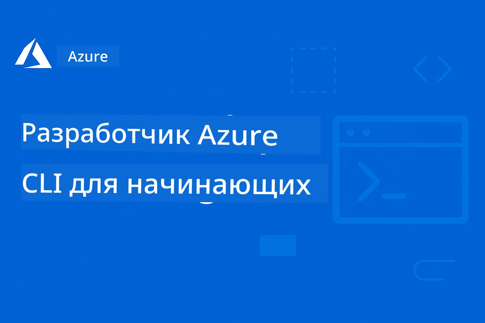

# AZD для начинающих: структурированное обучение

 

[](https://GitHub.com/microsoft/azd-for-beginners/watchers/)
[](https://GitHub.com/microsoft/azd-for-beginners/network/)
[](https://GitHub.com/microsoft/azd-for-beginners/stargazers/)

[](https://discord.com/invite/nkVh3dp)
[](https://discord.gg/nTYy5BXMWG)

---

### Автоматический перевод (всегда актуально)

<!-- CO-OP TRANSLATOR LANGUAGES TABLE START -->
[Арабский](../ar/README.md) | [Бенгальский](../bn/README.md) | [Болгарский](../bg/README.md) | [Бирманский (Мьянма)](../my/README.md) | [Китайский (упрощённый)](../zh-CN/README.md) | [Китайский (традиционный, Гонконг)](../zh-HK/README.md) | [Китайский (традиционный, Макао)](../zh-MO/README.md) | [Китайский (традиционный, Тайвань)](../zh-TW/README.md) | [Хорватский](../hr/README.md) | [Чешский](../cs/README.md) | [Датский](../da/README.md) | [Нидерландский](../nl/README.md) | [Эстонский](../et/README.md) | [Финский](../fi/README.md) | [Французский](../fr/README.md) | [Немецкий](../de/README.md) | [Греческий](../el/README.md) | [Иврит](../he/README.md) | [Хинди](../hi/README.md) | [Венгерский](../hu/README.md) | [Индонезийский](../id/README.md) | [Итальянский](../it/README.md) | [Японский](../ja/README.md) | [Каннада](../kn/README.md) | [Корейский](../ko/README.md) | [Литовский](../lt/README.md) | [Малайский](../ms/README.md) | [Малаялам](../ml/README.md) | [Маратхи](../mr/README.md) | [Непальский](../ne/README.md) | [Нигерийский пиджин](../pcm/README.md) | [Норвежский](../no/README.md) | [Персидский (фарси)](../fa/README.md) | [Польский](../pl/README.md) | [Португальский (Бразилия)](../pt-BR/README.md) | [Португальский (Португалия)](../pt-PT/README.md) | [Пенджабский (Гурмукхи)](../pa/README.md) | [Румынский](../ro/README.md) | [Русский](./README.md) | [Сербский (кириллица)](../sr/README.md) | [Словацкий](../sk/README.md) | [Словенский](../sl/README.md) | [Испанский](../es/README.md) | [Свахили](../sw/README.md) | [Шведский](../sv/README.md) | [Тагалог (филиппинский)](../tl/README.md) | [Тамильский](../ta/README.md) | [Телугу](../te/README.md) | [Тайский](../th/README.md) | [Турецкий](../tr/README.md) | [Украинский](../uk/README.md) | [Урду](../ur/README.md) | [Вьетнамский](../vi/README.md)

> **Предпочитаете клонировать локально?**
>
> В этом репозитории содержится более 50 переводов на разные языки, что значительно увеличивает размер загрузки. Чтобы клонировать без переводов, используйте sparse checkout:
>
> **Bash / macOS / Linux:**
> ```bash
> git clone --filter=blob:none --sparse https://github.com/microsoft/AZD-for-beginners.git
> cd AZD-for-beginners
> git sparse-checkout set --no-cone '/*' '!translations' '!translated_images'
> ```
>
> **CMD (Windows):**
> ```cmd
> git clone --filter=blob:none --sparse https://github.com/microsoft/AZD-for-beginners.git
> cd AZD-for-beginners
> git sparse-checkout set --no-cone "/*" "!translations" "!translated_images"
> ```
>
> Это даст вам всё необходимое для прохождения курса с более быстрой загрузкой.
<!-- CO-OP TRANSLATOR LANGUAGES TABLE END -->

## 🆕 Что нового в azd сегодня

Azure Developer CLI вышел за рамки традиционных веб-приложений и API. Сегодня azd — это единый инструмент для развертывания **любых** приложений в Azure — включая приложения с искусственным интеллектом и интеллектуальных агентов.

Вот что это значит для вас:

- **AI-агенты теперь полноценные рабочие нагрузки azd.** Вы можете инициализировать, развертывать и управлять проектами AI-агентов, используя привычный рабочий процесс `azd init` → `azd up`.
- **Интеграция с Microsoft Foundry** добавляет развертывание моделей, хостинг агентов и настройку AI-сервисов непосредственно в экосистему шаблонов azd.
- **Основной рабочий процесс не изменился.** Независимо от того, развертываете ли вы todo-приложение, микросервис или многопользовательское AI-решение, команды остаются теми же.

Если вы уже использовали azd, поддержка AI — это естественное расширение, а не отдельный инструмент или сложный курс. Если вы начинаете с нуля, вы изучите один рабочий процесс, работающий для всего.

---

## 🚀 Что такое Azure Developer CLI (azd)?

**Azure Developer CLI (azd)** — это удобный для разработчиков инструмент командной строки, который упрощает развертывание приложений в Azure. Вместо ручного создания и подключения множества ресурсов Azure вы можете развернуть целое приложение одной командой.

### Магия `azd up`

```bash
# Эта единственная команда делает всё:
# ✅ Создаёт все ресурсы Azure
# ✅ Настраивает сеть и безопасность
# ✅ Собирает код вашего приложения
# ✅ Разворачивает в Azure
# ✅ Предоставляет рабочий URL
azd up
```

**Вот и всё!** Никаких кликов в Azure Portal, никакого изучения сложных ARM-шаблонов, никакой ручной настройки — просто работающие приложения в Azure.

---

## ❓ Azure Developer CLI vs Azure CLI: в чём разница?

Это самый частый вопрос новичков. Вот простой ответ:

| Функция | **Azure CLI (`az`)** | **Azure Developer CLI (`azd`)** |
|---------|---------------------|--------------------------------|
| **Цель** | Управление отдельными ресурсами Azure | Развёртывание полных приложений |
| **Подход** | Ориентация на инфраструктуру | Ориентация на приложения |
| **Пример** | `az webapp create --name myapp...` | `azd up` |
| **Кривая обучения** | Нужно знать сервисы Azure | Достаточно знать своё приложение |
| **Кому подходит** | DevOps, специалисты по инфраструктуре | Разработчики, прототипирование |

### Простая аналогия

- **Azure CLI** — как иметь весь набор инструментов для строительства дома: молотки, пилы, гвозди. Можно построить что угодно, но нужно знать строительное дело.
- **Azure Developer CLI** — как нанять подрядчика: вы описываете, что хотите, а он строит.

### Когда использовать что

| Сценарий | Используйте |
|----------|------------|
| «Хочу быстро развернуть веб-приложение» | `azd up` |
| «Мне нужно создать только учётную запись хранения» | `az storage account create` |
| «Создаю полное AI-приложение» | `azd init --template azure-search-openai-demo` |
| «Нужно отладить конкретный ресурс Azure» | `az resource show` |
| «Хочу развертывание для продакшена за минуты» | `azd up --environment production` |

### Они работают вместе!

AZD использует Azure CLI под капотом. Вы можете использовать оба:
```bash
# Разверните ваше приложение с помощью AZD
azd up

# Затем точно настройте конкретные ресурсы с помощью Azure CLI
az webapp config set --name myapp --always-on true
```

---

## 🌟 Найдите шаблоны в Awesome AZD

Не начинайте с нуля! **Awesome AZD** — это сообщество с коллекцией готовых к развертыванию шаблонов:

| Ресурс | Описание |
|----------|-------------|
| 🔗 [**Awesome AZD Gallery**](https://azure.github.io/awesome-azd/) | Просмотр 200+ шаблонов с развертыванием в один клик |
| 🔗 [**Отправить шаблон**](https://github.com/Azure/awesome-azd/issues) | Внесите свой шаблон в сообщество |
| 🔗 [**Репозиторий GitHub**](https://github.com/Azure/awesome-azd) | Поставьте звёздочку и исследуйте исходники |

### Популярные AI-шаблоны из Awesome AZD

```bash
# RAG-чат с моделями Microsoft Foundry и AI Search
azd init --template azure-search-openai-demo

# Быстрое чат-приложение с ИИ
azd init --template openai-chat-app-quickstart

# Агенты ИИ с агентами Foundry
azd init --template get-started-with-ai-agents
```

---

## 🎯 Начало работы в 3 шага

### Шаг 1: Установите AZD (2 минуты)

**Windows:**
```powershell
winget install microsoft.azd
```

**macOS:**
```bash
brew tap azure/azd && brew install azd
```

**Linux:**
```bash
curl -fsSL https://aka.ms/install-azd.sh | bash
```

### Шаг 2: Войдите в Azure

```bash
azd auth login
```

### Шаг 3: Разверните первое приложение

```bash
# Инициализировать из шаблона
azd init --template todo-nodejs-mongo

# Развернуть в Azure (создаёт всё!)
azd up
```

**🎉 Вот и всё!** Ваше приложение теперь работает в Azure.

### Очистка (не забудьте!)

```bash
# Remove all resources when done experimenting
azd down --force --purge
```

---

## 📚 Как использовать этот курс

Этот курс разработан для **пошагового обучения** — начинайте там, где вам комфортно, и продвигайтесь дальше:

| Ваш опыт | Начните здесь |
|-----------------|------------|
| **Новый в Azure** | [Глава 1: Основы](#-chapter-1-foundation--quick-start) |
| **Знаете Azure, новый в AZD** | [Глава 1: Основы](#-chapter-1-foundation--quick-start) |
| **Хотите разворачивать AI-приложения** | [Глава 2: AI-первое развитие](#-chapter-2-ai-first-development-recommended-for-ai-developers) |
| **Хотите практические занятия** | [🎓 Интерактивный воркшоп](workshop/README.md) — лабораторная работа на 3-4 часа |
| **Нужны производственные паттерны** | [Глава 8: Производство и корпоративные паттерны](#-chapter-8-production--enterprise-patterns) |

### Быстрая настройка

1. **Сделайте форк этого репозитория**: [](https://GitHub.com/microsoft/azd-for-beginners/fork)
2. **Клонируйте его**: `git clone https://github.com/YOUR-USERNAME/azd-for-beginners.git`
3. **Получите помощь**: [Сообщество Azure Discord](https://discord.com/invite/ByRwuEEgH4)

> **Предпочитаете клонировать локально?**

> В этом репозитории содержится более 50 переводов, что значительно увеличивает размер загрузки. Чтобы клонировать без переводов, используйте sparse checkout:
> ```bash
> git clone --filter=blob:none --sparse https://github.com/microsoft/AZD-for-beginners.git
> cd AZD-for-beginners
> git sparse-checkout set --no-cone '/*' '!translations' '!translated_images'
> ```
> Это даст вам всё необходимое для прохождения курса с более быстрой загрузкой.


## Обзор курса

Освойте Azure Developer CLI (azd) через структурированные главы, разработанные для поэтапного обучения. **Особое внимание уделяется развертыванию AI-приложений с интеграцией Microsoft Foundry.**

### Почему этот курс важен для современных разработчиков

По результатам опросов сообщества Microsoft Foundry Discord **45% разработчиков хотят использовать AZD для AI-рабочих нагрузок**, но сталкиваются с такими трудностями, как:
- Сложные многосервисные архитектуры AI
- Лучшие практики для продакшн-развёртывания AI  
- Интеграция и настройка Azure AI-сервисов
- Оптимизация затрат на AI-рабочие нагрузки
- Отладка и решение специфичных для AI проблем при развёртывании

### Цели обучения

Пройдя этот структурированный курс, вы:
- **Освоите основы AZD**: ключевые понятия, установка и настройка
- **Развернёте AI-приложения**: использование AZD с сервисами Microsoft Foundry
- **Внедрите инфраструктуру как код**: управление ресурсами Azure с помощью Bicep-шаблонов
- **Отладите развёртывания**: устранение распространённых проблем и отладка
- **Оптимизируете для продакшена**: безопасность, масштабирование, мониторинг и управление затратами
- **Создадите многопользовательские AI-решения**: развертывание сложных AI-архитектур

## 🗺️ Карта курса: Быстрая навигация по главам

Каждая глава содержит отдельный README с целями обучения, быстрым стартом и заданиями:

| Глава | Тема | Уроки | Продолжительность | Сложность |
|---------|-------|---------|----------|------------|
| **[Гл. 1: Основы](docs/chapter-01-foundation/README.md)** | Начало работы | [Основы AZD](docs/chapter-01-foundation/azd-basics.md) &#124; [Установка](docs/chapter-01-foundation/installation.md) &#124; [Первый проект](docs/chapter-01-foundation/first-project.md) | 30-45 мин | ⭐ |
| **[Гл. 2: Разработка ИИ](docs/chapter-02-ai-development/README.md)** | Приложения с приоритетом ИИ | [Интеграция Foundry](docs/chapter-02-ai-development/microsoft-foundry-integration.md) &#124; [ИИ-агенты](docs/chapter-02-ai-development/agents.md) &#124; [Развертывание модели](docs/chapter-02-ai-development/ai-model-deployment.md) &#124; [Мастерская](docs/chapter-02-ai-development/ai-workshop-lab.md) | 1-2 часа | ⭐⭐ |
| **[Гл. 3: Конфигурация](docs/chapter-03-configuration/README.md)** | Аутентификация и безопасность | [Конфигурация](docs/chapter-03-configuration/configuration.md) &#124; [Аутентификация и безопасность](docs/chapter-03-configuration/authsecurity.md) | 45-60 мин | ⭐⭐ |
| **[Гл. 4: Инфраструктура](docs/chapter-04-infrastructure/README.md)** | IaC и развертывание | [Руководство по развертыванию](docs/chapter-04-infrastructure/deployment-guide.md) &#124; [Провижинг](docs/chapter-04-infrastructure/provisioning.md) | 1-1.5 часа | ⭐⭐⭐ |
| **[Гл. 5: Мультиагент](docs/chapter-05-multi-agent/README.md)** | Решения с ИИ-агентами | [Розничный сценарий](examples/retail-scenario.md) &#124; [Паттерны координации](docs/chapter-06-pre-deployment/coordination-patterns.md) | 2-3 часа | ⭐⭐⭐⭐ |
| **[Гл. 6: Предварительное развертывание](docs/chapter-06-pre-deployment/README.md)** | Планирование и проверка | [Предварительные проверки](docs/chapter-06-pre-deployment/preflight-checks.md) &#124; [Планирование емкости](docs/chapter-06-pre-deployment/capacity-planning.md) &#124; [Выбор SKU](docs/chapter-06-pre-deployment/sku-selection.md) &#124; [Application Insights](docs/chapter-06-pre-deployment/application-insights.md) | 1 час | ⭐⭐ |
| **[Гл. 7: Устранение неисправностей](docs/chapter-07-troubleshooting/README.md)** | Отладка и исправление | [Распространенные проблемы](docs/chapter-07-troubleshooting/common-issues.md) &#124; [Отладка](docs/chapter-07-troubleshooting/debugging.md) &#124; [Проблемы ИИ](docs/chapter-07-troubleshooting/ai-troubleshooting.md) | 1-1.5 часа | ⭐⭐ |
| **[Гл. 8: Производство](docs/chapter-08-production/README.md)** | Корпоративные паттерны | [Практики производства](docs/chapter-08-production/production-ai-practices.md) | 2-3 часа | ⭐⭐⭐⭐ |
| **[🎓 Мастерская](workshop/README.md)** | Практическая лаборатория | [Введение](workshop/docs/instructions/0-Introduction.md) &#124; [Выбор](workshop/docs/instructions/1-Select-AI-Template.md) &#124; [Проверка](workshop/docs/instructions/2-Validate-AI-Template.md) &#124; [Декомпозиция](workshop/docs/instructions/3-Deconstruct-AI-Template.md) &#124; [Конфигурация](workshop/docs/instructions/4-Configure-AI-Template.md) &#124; [Кастомизация](workshop/docs/instructions/5-Customize-AI-Template.md) &#124; [Снятие инфраструктуры](workshop/docs/instructions/6-Teardown-Infrastructure.md) &#124; [Завершение](workshop/docs/instructions/7-Wrap-up.md) | 3-4 часа | ⭐⭐ |

**Общее время курса:** ~10-14 часов | **Прогресс навыков:** Новичок → Готов к производству

---

## 📚 Учебные главы

*Выберите свой учебный путь в зависимости от опыта и целей*

### 🚀 Глава 1: Основы и быстрый старт
**Предварительные требования**: Подписка Azure, базовые навыки работы с командной строкой  
**Продолжительность**: 30-45 минут  
**Сложность**: ⭐

#### Чему вы научитесь
- Основы Azure Developer CLI
- Установка AZD на вашу платформу
- Ваше первое успешное развертывание

#### Учебные материалы
- **🎯 Начать здесь**: [Что такое Azure Developer CLI?](#what-is-azure-developer-cli)
- **📖 Теория**: [Основы AZD](docs/chapter-01-foundation/azd-basics.md) - Основные понятия и терминология
- **⚙️ Настройка**: [Установка и настройка](docs/chapter-01-foundation/installation.md) - Руководства для платформ
- **🛠️ Практика**: [Ваш первый проект](docs/chapter-01-foundation/first-project.md) - Пошаговое руководство
- **📋 Быстрая справка**: [Шпаргалка команд](resources/cheat-sheet.md)

#### Практические задания
```bash
# Быстрая проверка установки
azd version

# Разверните ваше первое приложение
azd init --template todo-nodejs-mongo
azd up
```

**💡 Результат главы**: Успешно развернуть простое веб-приложение в Azure с помощью AZD

**✅ Проверка успеха:**
```bash
# После завершения Главы 1 вы сможете:
azd version              # Показывает установленную версию
azd init --template todo-nodejs-mongo  # Инициализирует проект
azd up                  # Разворачивает на Azure
azd show                # Показывает URL запущенного приложения
# Приложение открывается в браузере и работает
azd down --force --purge  # Очищает ресурсы
```

**📊 Затраченное время:** 30-45 минут  
**📈 Уровень навыков после:** Может самостоятельно развертывать базовые приложения

---

### 🤖 Глава 2: Разработка ИИ-первичных приложений (Рекомендуется для разработчиков ИИ)
**Предварительные требования**: Завершена глава 1  
**Продолжительность**: 1-2 часа  
**Сложность**: ⭐⭐

#### Чему вы научитесь
- Интеграция Microsoft Foundry с AZD
- Развертывание приложений на основе ИИ
- Понимание конфигураций ИИ-сервисов

#### Учебные материалы
- **🎯 Начать здесь**: [Интеграция Microsoft Foundry](docs/chapter-02-ai-development/microsoft-foundry-integration.md)
- **🤖 ИИ-агенты**: [Руководство по ИИ-агентам](docs/chapter-02-ai-development/agents.md) - Развертывание интеллектуальных агентов с AZD
- **📖 Паттерны**: [Развертывание ИИ-моделей](docs/chapter-02-ai-development/ai-model-deployment.md) - Разворачивать и управлять ИИ-моделями
- **🛠️ Мастерская**: [Мастерская по ИИ](docs/chapter-02-ai-development/ai-workshop-lab.md) - Подготовка ИИ-решений для AZD
- **🎥 Интерактивное руководство**: [Материалы мастерской](workshop/README.md) - Обучение в браузере с MkDocs * Среда DevContainer
- **📋 Шаблоны**: [Шаблоны Microsoft Foundry](#ресурсы-мастер-класса)
- **📝 Примеры**: [Примеры развертывания AZD](examples/README.md)

#### Практические задания
```bash
# Разверните ваше первое AI-приложение
azd init --template azure-search-openai-demo
azd up

# Попробуйте дополнительные шаблоны AI
azd init --template openai-chat-app-quickstart
azd init --template agent-openai-python-prompty
```

**💡 Результат главы**: Развернуть и настроить чат-приложение с ИИ и возможностями RAG

**✅ Проверка успеха:**
```bash
# После главы 2 вы должны уметь:
azd init --template azure-search-openai-demo
azd up
# Тестировать интерфейс чат-бота с ИИ
# Задавать вопросы и получать ответы с поддержкой ИИ с указанием источников
# Проверять, что интеграция поиска работает
azd monitor  # Проверять, что Application Insights отображает телеметрию
azd down --force --purge
```

**📊 Затраченное время:** 1-2 часа  
**📈 Уровень навыков после:** Может развернуть и настроить ИИ-приложения, готовые к производству  
**💰 Осознание затрат:** Понимание затрат разработки $80-150/месяц, производственных $300-3500/месяц

#### 💰 Учет затрат для развертывания ИИ

**Среда разработки (Оценочно $80-150/месяц):**
- Модели Microsoft Foundry (оплата по использованию): $0-50/месяц (в зависимости от токенов)
- Поиск ИИ (базовый уровень): $75/месяц
- Контейнерные приложения (по потреблению): $0-20/месяц
- Хранилище (стандартное): $1-5/месяц

**Производственная среда (Оценочно $300-3500+/месяц):**
- Модели Microsoft Foundry (PTU для стабильной производительности): $3,000+/месяц ИЛИ оплата по использованию при больших объемах
- Поиск ИИ (стандартный уровень): $250/месяц
- Контейнерные приложения (выделенные): $50-100/месяц
- Application Insights: $5-50/месяц
- Хранилище (премиум): $10-50/месяц

**💡 Советы по оптимизации затрат:**
- Используйте **бесплатный уровень** моделей Microsoft Foundry для обучения (включено 50,000 токенов в Azure OpenAI)
- Выполняйте `azd down` для освобождения ресурсов при отсутствии активной разработки
- Начинайте с оплаты по потреблению, переходите на PTU только для продакшена
- Используйте `azd provision --preview` для оценки затрат перед развертыванием
- Включайте авто-масштабирование: платите только за фактическое использование

**Мониторинг затрат:**
```bash
# Проверьте оценочные ежемесячные расходы
azd provision --preview

# Отслеживайте фактические расходы в портале Azure
az consumption budget list --resource-group <your-rg>
```

---

### ⚙️ Глава 3: Конфигурация и аутентификация
**Предварительные требования**: Завершена глава 1  
**Продолжительность**: 45-60 минут  
**Сложность**: ⭐⭐

#### Чему вы научитесь
- Конфигурация и управление окружением
- Лучшие практики аутентификации и безопасности
- Именование ресурсов и организация

#### Учебные материалы
- **📖 Конфигурация**: [Руководство по конфигурации](docs/chapter-03-configuration/configuration.md) - Настройка окружения
- **🔐 Безопасность**: [Паттерны аутентификации и управляемая идентичность](docs/chapter-03-configuration/authsecurity.md) - Паттерны аутентификации
- **📝 Примеры**: [Пример приложения с базой данных](examples/database-app/README.md) - Примеры AZD с базами данных

#### Практические задания
- Настройка нескольких окружений (разработка, тест, прод)
- Настройка аутентификации с управляемой идентичностью
- Внедрение настроек, специфичных для окружения

**💡 Результат главы**: Управлять несколькими окружениями с правильной аутентификацией и безопасностью

---

### 🏗️ Глава 4: Инфраструктура как код и развертывание
**Предварительные требования**: Завершены главы 1-3  
**Продолжительность**: 1-1.5 часа  
**Сложность**: ⭐⭐⭐

#### Чему вы научитесь
- Продвинутые паттерны развертывания
- Инфраструктура как код с Bicep
- Стратегии провижинга ресурсов

#### Учебные материалы
- **📖 Развертывание**: [Руководство по развертыванию](docs/chapter-04-infrastructure/deployment-guide.md) - Полные рабочие процессы
- **🏗️ Провижинг**: [Управление ресурсами](docs/chapter-04-infrastructure/provisioning.md) - Управление ресурсами Azure
- **📝 Примеры**: [Пример контейнерного приложения](../../examples/container-app) - Контейнерные развертывания

#### Практические задания
- Создавайте собственные шаблоны Bicep
- Разворачивайте мультисервисные приложения
- Внедряйте стратегии blue-green развертывания

**💡 Результат главы**: Развертывать сложные мультисервисные приложения с помощью кастомных шаблонов инфраструктуры

---

### 🎯 Глава 5: Мультиагентные ИИ-решения (Продвинутый уровень)
**Предварительные требования**: Завершены главы 1-2  
**Продолжительность**: 2-3 часа  
**Сложность**: ⭐⭐⭐⭐

#### Чему вы научитесь
- Паттерны мультиагентной архитектуры
- Оркестровка и координация агентов
- Развертывания ИИ, готовые к производству

#### Учебные материалы
- **🤖 Рекомендуемый проект**: [Розничное мультиагентное решение](examples/retail-scenario.md) - Полная реализация
- **🛠️ ARM шаблоны**: [Пакет ARM шаблонов](../../examples/retail-multiagent-arm-template) - Одним кликом развертывание
- **📖 Архитектура**: [Паттерны координации мультиагентов](docs/chapter-06-pre-deployment/coordination-patterns.md) - Паттерны

#### Практические задания
```bash
# Развернуть полное многоагентное решение для розничной торговли
cd examples/retail-multiagent-arm-template
./deploy.sh

# Изучить конфигурации агентов
az deployment group show --resource-group <rg-name> --name <deployment-name>
```

**💡 Результат главы**: Развернуть и управлять производственным мультиагентным ИИ-решением с агентами Клиентов и Инвентаря

---

### 🔍 Глава 6: Предварительная проверка и планирование развертывания
**Предварительные требования**: Завершена глава 4  
**Продолжительность**: 1 час  
**Сложность**: ⭐⭐

#### Чему вы научитесь
- Планирование емкости и проверка ресурсов
- Стратегии выбора SKU
- Предварительные проверки и автоматизация

#### Учебные материалы
- **📊 Планирование**: [Планирование емкости](docs/chapter-06-pre-deployment/capacity-planning.md) - Проверка ресурсов
- **💰 Выбор**: [Выбор SKU](docs/chapter-06-pre-deployment/sku-selection.md) - Экономичные варианты
- **✅ Валидация**: [Предварительные проверки](docs/chapter-06-pre-deployment/preflight-checks.md) - Автоматизированные скрипты

#### Практические задания
- Запуск скриптов проверки емкости
- Оптимизация выбора SKU для снижения затрат
- Внедрение автоматизированных предварительных проверок

**💡 Результат главы**: Проверить и оптимизировать развертывание перед выполнением

---

### 🚨 Глава 7: Устранение неполадок и отладка
**Предварительные требования**: Завершена любая глава по развертыванию  
**Продолжительность**: 1-1.5 часа  
**Сложность**: ⭐⭐

#### Чему вы научитесь
- Систематические подходы к отладке
- Распространённые проблемы и решения
- Специфические проблемы ИИ и их устранение

#### Учебные материалы
- **🔧 Распространённые проблемы**: [Часто задаваемые вопросы и решения](docs/chapter-07-troubleshooting/common-issues.md)
- **🕵️ Отладка**: [Руководство по отладке](docs/chapter-07-troubleshooting/debugging.md) - Пошаговые стратегии
- **🤖 Проблемы ИИ**: [Устранение проблем ИИ](docs/chapter-07-troubleshooting/ai-troubleshooting.md) - Проблемы сервисов ИИ

#### Практические задания
- Диагностика сбоев развертывания
- Решение проблем с аутентификацией
- Отладка соединения с ИИ-сервисами

**💡 Результат главы**: Самостоятельно диагностировать и решать распространённые проблемы развертывания

---

### 🏢 Глава 8: Производство и корпоративные паттерны
**Предварительные требования**: Завершены главы 1-4  
**Продолжительность**: 2-3 часа  
**Сложность**: ⭐⭐⭐⭐

#### Чему вы научитесь
- Стратегии производственного развертывания
- Паттерны корпоративной безопасности
- Мониторинг и оптимизация затрат

#### Учебные материалы
- **🏭 Производство**: [Лучшие практики AI для производства](docs/chapter-08-production/production-ai-practices.md) - Корпоративные шаблоны
- **📝 Примеры**: [Пример микросервисов](../../examples/microservices) - Сложные архитектуры
- **📊 Мониторинг**: [Интеграция Application Insights](docs/chapter-06-pre-deployment/application-insights.md) - Мониторинг

#### Практические упражнения
- Реализовать корпоративные шаблоны безопасности
- Настроить комплексный мониторинг
- Развернуть в производстве с надлежащим управлением

**💡 Итог главы**: Разворачивайте корпоративные приложения с полной производственной функциональностью

---

## 🎓 Обзор мастер-класса: Практический опыт обучения

> **⚠️ СОСТОЯНИЕ МАСТЕР-КЛАССА: Активная разработка**  
> Материалы мастер-класса в настоящее время разрабатываются и дорабатываются. Основные модули работают, но некоторые продвинутые разделы не завершены. Мы активно трудимся над завершением всего контента. [Отследить прогресс →](workshop/README.md)

### Интерактивные материалы мастер-класса
**Всеобъемлющее практическое обучение с браузерными инструментами и пошаговыми упражнениями**

Наши материалы мастер-класса предоставляют структурированный и интерактивный опыт обучения, дополняющий вышеуказанный учебный курс по главам. Мастер-класс предназначен для как самостоятельного изучения, так и для занятий под руководством преподавателя.

#### 🛠️ Особенности мастер-класса
- **Интерфейс в браузере**: Полный мастер-класс на базе MkDocs с поиском, копированием и настройкой темы
- **Интеграция GitHub Codespaces**: Однонажатий запуск среды разработки
- **Структурированный учебный путь**: 8 модулей с пошаговыми упражнениями (3-4 часа всего)
- **Прогрессивная методология**: Введение → Выбор → Валидация → Разбор → Конфигурация → Настройка → Завершение → Итоги
- **Интерактивная среда DevContainer**: Преднастроенные инструменты и зависимости

#### 📚 Структура модулей мастер-класса
Мастер-класс следует **8-модульной прогрессивной методологии**, которая ведёт от ознакомления до мастерства развертывания:

| Модуль | Тема | Что вы сделаете | Продолжительность |
|--------|-------|----------------|-------------------|
| **0. Введение** | Обзор мастер-класса | Ознакомитесь с целями обучения, требованиями и структурой мастер-класса | 15 мин |
| **1. Выбор** | Поиск шаблонов | Изучите шаблоны AZD и выберите подходящий AI шаблон для вашего сценария | 20 мин |
| **2. Валидация** | Развертывание и проверка | Разверните шаблон с помощью `azd up` и проверьте работоспособность инфраструктуры | 30 мин |
| **3. Разбор** | Понимание структуры | Используйте GitHub Copilot для изучения архитектуры шаблона, Bicep-файлов и организации кода | 30 мин |
| **4. Конфигурация** | Глубокое погружение в azure.yaml | Освойте конфигурацию `azure.yaml`, хуки жизненного цикла и переменные окружения | 30 мин |
| **5. Настройка** | Сделайте под себя | Включите AI Search, трассировку, оценку и настройте под свой сценарий | 45 мин |
| **6. Завершение** | Очистка | Безопасно удалите ресурсы с помощью `azd down --purge` | 15 мин |
| **7. Итоги** | Следующие шаги | Обзор достижений, ключевых концепций и дальнейшее обучение | 15 мин |

**Ход мастер-класса:**  
```
Introduction → Selection → Validation → Deconstruction → Configuration → Customization → Teardown → Wrap-up
     ↓            ↓           ↓              ↓               ↓              ↓            ↓           ↓
  Overview    Find the     Deploy &      Explore        Master         Customize     Clean up    Review &
             right        verify        code &        azure.yaml      for your      resources   next steps
             template                   structure                     scenario
```
  
#### 🚀 Начало работы с мастер-классом  
```bash
# Вариант 1: GitHub Codespaces (рекомендуется)
# Нажмите "Code" → "Create codespace on main" в репозитории

# Вариант 2: Локальная разработка
git clone https://github.com/microsoft/azd-for-beginners.git
cd azd-for-beginners/workshop
# Следуйте инструкциям по установке в workshop/README.md
```
  
#### 🎯 Результаты обучения мастер-класса  
По завершении мастер-класса участники смогут:  
- **Разворачивать AI приложения в продакшн**: Использовать AZD с сервисами Microsoft Foundry  
- **Освоить архитектуры с несколькими агентами**: Реализовать скоординированные AI-системы с агентами  
- **Реализовать лучшие практики безопасности**: Настроить аутентификацию и контроль доступа  
- **Оптимизировать масштабируемость**: Проектировать эффективные и производительные развертывания  
- **Самостоятельно решать проблемы при развертывании**: Быстро устранять типичные ошибки

#### 📖 Ресурсы мастер-класса
- **🎥 Интерактивное руководство**: [Материалы мастер-класса](workshop/README.md) - Обучающая среда в браузере  
- **📋 Пошаговые инструкции по модулям**:  
  - [0. Введение](workshop/docs/instructions/0-Introduction.md) - Обзор и цели мастер-класса  
  - [1. Выбор](workshop/docs/instructions/1-Select-AI-Template.md) - Поиск и выбор AI шаблонов  
  - [2. Валидация](workshop/docs/instructions/2-Validate-AI-Template.md) - Развертывание и проверка  
  - [3. Разбор](workshop/docs/instructions/3-Deconstruct-AI-Template.md) - Изучение архитектуры шаблона  
  - [4. Конфигурация](workshop/docs/instructions/4-Configure-AI-Template.md) - Освоение azure.yaml  
  - [5. Настройка](workshop/docs/instructions/5-Customize-AI-Template.md) - Настройка под свой сценарий  
  - [6. Завершение](workshop/docs/instructions/6-Teardown-Infrastructure.md) - Очистка ресурсов  
  - [7. Итоги](workshop/docs/instructions/7-Wrap-up.md) - Обзор и дальнейшие шаги  
- **🛠️ Лаборатория AI мастер-класса**: [AI Workshop Lab](docs/chapter-02-ai-development/ai-workshop-lab.md) - Упражнения по AI  
- **💡 Быстрый старт**: [Руководство по настройке мастер-класса](workshop/README.md#quick-start) - Конфигурация окружения

**Идеально для**: Корпоративного обучения, университетских курсов, самостоятельного изучения и буткемпов для разработчиков.

---

## 📖 Глубокое погружение: возможности AZD

Помимо базовых функций, AZD предоставляет мощные возможности для производственных развертываний:

- **Развертывания на основе шаблонов** — Используйте готовые шаблоны для распространённых паттернов приложений  
- **Инфраструктура как код** — Управляйте ресурсами Azure с помощью Bicep или Terraform  
- **Интегрированные рабочие процессы** — Бесшовное создание, развертывание и мониторинг приложений  
- **Дружественность для разработчиков** — Оптимизировано для производительности и удобства разработчиков

### **AZD + Microsoft Foundry: Идеально для AI развертываний**

**Почему AZD для AI решений?** AZD решает основные проблемы, с которыми сталкиваются разработчики AI:

- **Шаблоны, готовые для AI** — Преднастроенные шаблоны для Microsoft Foundry моделей, сервисов Cognitive Services и ML нагрузок  
- **Безопасные AI развертывания** — Встроенные шаблоны безопасности для AI сервисов, ключей API и конечных точек моделей  
- **Паттерны производства AI** — Лучшие практики масштабируемых и экономичных AI приложений  
- **Комплексные AI рабочие процессы** — От разработки модели до производственного развертывания с мониторингом  
- **Оптимизация затрат** — Умное распределение ресурсов и стратегии масштабирования AI нагрузок  
- **Интеграция с Microsoft Foundry** — Бесшовное подключение к каталогу и конечным точкам моделей Microsoft Foundry

---

## 🎯 Библиотека шаблонов и примеров

### Рекомендуемые: Шаблоны Microsoft Foundry
**Начните здесь, если разворачиваете AI приложения!**

> **Примечание:** Эти шаблоны демонстрируют различные AI паттерны. Некоторые — внешние Azure Samples, другие — локальные реализации.

| Шаблон | Глава | Сложность | Сервисы | Тип |
|--------|-------|-----------|---------|-----|
| [**Начало работы с AI чат-ботом**](https://github.com/Azure-Samples/get-started-with-ai-chat) | Глава 2 | ⭐⭐ | AzureOpenAI + Azure AI Model Inference API + Azure AI Search + Azure Container Apps + Application Insights | Внешний |
| [**Начало работы с AI агентами**](https://github.com/Azure-Samples/get-started-with-ai-agents) | Глава 2 | ⭐⭐ | Foundry Agents + AzureOpenAI + Azure AI Search + Azure Container Apps + Application Insights| Внешний |
| [**Демонстрация Azure Search + OpenAI**](https://github.com/Azure-Samples/azure-search-openai-demo) | Глава 2 | ⭐⭐ | AzureOpenAI + Azure AI Search + App Service + Storage | Внешний |
| [**Быстрый старт OpenAI Chat App**](https://github.com/Azure-Samples/openai-chat-app-quickstart) | Глава 2 | ⭐ | AzureOpenAI + Container Apps + Application Insights | Внешний |
| [**Agent OpenAI Python Prompty**](https://github.com/Azure-Samples/agent-openai-python-prompty) | Глава 5 | ⭐⭐⭐ | AzureOpenAI + Azure Functions + Prompty | Внешний |
| [**Contoso Chat RAG**](https://github.com/Azure-Samples/contoso-chat) | Глава 8 | ⭐⭐⭐⭐ | AzureOpenAI + AI Search + Cosmos DB + Container Apps | Внешний |
| [**Решение для ритейла с несколькими агентами**](examples/retail-scenario.md) | Глава 5 | ⭐⭐⭐⭐ | AzureOpenAI + AI Search + Storage + Container Apps + Cosmos DB | **Локальный** |

### Рекомендуемые: Полные обучающие сценарии
**Шаблоны приложений, готовые к производству, сопоставленные с учебными главами**

| Шаблон | Глава для изучения | Сложность | Основное обучение |
|--------|--------------------|-----------|-------------------|
| [**openai-chat-app-quickstart**](https://github.com/Azure-Samples/openai-chat-app-quickstart) | Глава 2 | ⭐ | Базовые AI паттерны развертываний |
| [**azure-search-openai-demo**](https://github.com/Azure-Samples/azure-search-openai-demo) | Глава 2 | ⭐⭐ | Реализация RAG с Azure AI Search |
| [**ai-document-processing**](https://github.com/Azure-Samples/ai-document-processing) | Глава 4 | ⭐⭐ | Интеграция Document Intelligence |
| [**agent-openai-python-prompty**](https://github.com/Azure-Samples/agent-openai-python-prompty) | Глава 5 | ⭐⭐⭐ | Фреймворк агентов и вызов функций |
| [**contoso-chat**](https://github.com/Azure-Samples/contoso-chat) | Глава 8 | ⭐⭐⭐ | Корпоративная оркестрация AI |
| [**retail-multi-agent-solution**](examples/retail-scenario.md) | Глава 5 | ⭐⭐⭐⭐ | Архитектура с несколькими агентами, Клиент и Инвентарь |

### Обучение по типу примеров

> **📌 Локальные и внешние примеры:**  
> **Локальные примеры** (в этом репозитории) = готовы к использованию сразу  
> **Внешние примеры** (Azure Samples) = клонировать из связных репозиториев

#### Локальные примеры (готовы к использованию)
- [**Решение для ритейла с несколькими агентами**](examples/retail-scenario.md) - Полная производственная реализация с ARM шаблонами  
  - Архитектура с несколькими агентами (Клиент + Инвентарь)  
  - Комплексный мониторинг и оценка  
  - Однокликовое развертывание через ARM шаблон

#### Локальные примеры — Контейнерные приложения (главы 2-5)
**Полные примеры контейнерных развертываний в этом репозитории:**  
- [**Примеры Container App**](examples/container-app/README.md) - Полное руководство по контейнеризации  
  - [Простой Flask API](../../examples/container-app/simple-flask-api) - Базовый REST API с масштабированием до нуля  
  - [Архитектура микросервисов](../../examples/container-app/microservices) - Готовое к продакшену много-сервисное развертывание  
  - Быстрый старт, Производство и Продвинутые паттерны развертываний  
  - Руководство по мониторингу, безопасности и оптимизации затрат

#### Внешние примеры — Простые приложения (главы 1-2)
**Клонируйте эти репозитории Azure Samples для начала:**  
- [Простое веб-приложение - Node.js + MongoDB](https://github.com/Azure-Samples/todo-nodejs-mongo) - Базовые паттерны развертывания  
- [Статический сайт - React SPA](https://github.com/Azure-Samples/todo-csharp-sql-swa-func) - Развертывание статического контента  
- [Container App - Python Flask](https://github.com/Azure-Samples/container-apps-store-api-microservice) - Развертывание REST API

#### Внешние примеры — Интеграция с базами данных (главы 3-4)  
- [Приложение с базой данных - C# + SQL](https://github.com/Azure-Samples/todo-csharp-sql) - Паттерны подключения к базе данных  
- [Functions + Cosmos DB](https://github.com/Azure-Samples/todo-python-mongo-swa-func) - Безсерверные data workflow

#### Внешние примеры — Продвинутые паттерны (главы 4-8)
- [Java микросервисы](https://github.com/Azure-Samples/java-microservices-aca-lab) - Много-сервисные архитектуры  
- [Задачи Container Apps](https://github.com/Azure-Samples/container-apps-jobs) - Фоновая обработка  
- [Enterprise ML Pipeline](https://github.com/Azure-Samples/mlops-v2) - Готовые к производству ML паттерны

### Внешние коллекции шаблонов
- [**Официальная галерея шаблонов AZD**](https://azure.github.io/awesome-azd/) - Курируемая коллекция официальных и сообщественных шаблонов  
- [**Шаблоны Azure Developer CLI**](https://learn.microsoft.com/en-us/azure/developer/azure-developer-cli/azd-templates) - Документация Microsoft Learn по шаблонам  
- [**Каталог примеров**](examples/README.md) - Локальные учебные примеры с подробными объяснениями

---

## 📚 Ресурсы для обучения и ссылки

### Быстрые ссылки
- [**Шпаргалка по командам**](resources/cheat-sheet.md) - Основные команды azd, организованные по главам  
- [**Глоссарий**](resources/glossary.md) - Термины Azure и azd  
- [**FAQ**](resources/faq.md) - Часто задаваемые вопросы по главам обучения  
- [**Учебное пособие**](resources/study-guide.md) - Всеобъемлющие практические упражнения

### Практические мастер-классы
- [**Лаборатория AI Workshop**](docs/chapter-02-ai-development/ai-workshop-lab.md) - Сделайте ваши AI решения развертываемыми через AZD (2-3 часа)  
- [**Интерактивный мастер-класс**](workshop/README.md) - 8 модулей с пошаговыми упражнениями на базе MkDocs и GitHub Codespaces  
  - Схема: Введение → Выбор → Валидация → Разбор → Конфигурация → Настройка → Завершение → Итоги

### Внешние ресурсы для обучения
- [Документация Azure Developer CLI](https://learn.microsoft.com/en-us/azure/developer/azure-developer-cli/)
- [Центр архитектуры Azure](https://learn.microsoft.com/en-us/azure/architecture/)
- [Калькулятор цен Azure](https://azure.microsoft.com/pricing/calculator/)
- [Статус Azure](https://status.azure.com/)

### Навыки AI-агентов для вашего редактора
- [**Навыки Microsoft Azure на skills.sh**](https://skills.sh/microsoft/github-copilot-for-azure) - 37 открытых навыков агентов для Azure AI, Foundry, развертывания, диагностики, оптимизации затрат и многого другого. Установите их в GitHub Copilot, Cursor, Claude Code или любом поддерживаемом агенте:
  ```bash
  npx skills add microsoft/github-copilot-for-azure
  ```

---

## 🔧 Быстрое руководство по устранению неполадок

**Распространённые проблемы новичков и немедленные решения:**

<details>
<summary><strong>❌ Команда "azd" не найдена</strong></summary>

```bash
# Сначала установите AZD
# Windows (PowerShell):
winget install microsoft.azd

# macOS:
brew tap azure/azd && brew install azd

# Linux:
curl -fsSL https://aka.ms/install-azd.sh | bash

# Проверьте установку
azd version
```
</details>

<details>
<summary><strong>❌ "Подписка не найдена" или "Подписка не задана"</strong></summary>

```bash
# Список доступных подписок
az account list --output table

# Установить подписку по умолчанию
az account set --subscription "<subscription-id-or-name>"

# Установить для среды AZD
azd env set AZURE_SUBSCRIPTION_ID "<subscription-id>"

# Проверить
az account show
```
</details>

<details>
<summary><strong>❌ "Недостаточно квоты" или "Превышена квота"</strong></summary>

```bash
# Попробуйте другой регион Azure
azd env set AZURE_LOCATION "westus2"
azd up

# Или используйте меньшие SKU в разработке
# Редактируйте infra/main.parameters.json:
{
  "sku": "B1"  // Instead of "P1V2"
}
```
</details>

<details>
<summary><strong>❌ Ошибка посреди выполнения "azd up"</strong></summary>

```bash
# Вариант 1: Очистить и попробовать заново
azd down --force --purge
azd up

# Вариант 2: Просто исправить инфраструктуру
azd provision

# Вариант 3: Проверить подробный статус
azd show

# Вариант 4: Проверить логи в Azure Monitor
azd monitor --logs
```
</details>

<details>
<summary><strong>❌ "Аутентификация не удалась" или "Срок действия токена истёк"</strong></summary>

```bash
# Повторная аутентификация
az logout
az login

azd auth logout
azd auth login

# Проверить аутентификацию
az account show
```
</details>

<details>
<summary><strong>❌ "Ресурс уже существует" или конфликты имён</strong></summary>

```bash
# AZD генерирует уникальные имена, но в случае конфликта:
azd down --force --purge

# Затем повторите попытку с новой средой
azd env new dev-v2
azd up
```
</details>

<details>
<summary><strong>❌ Развёртывание шаблона занимает слишком много времени</strong></summary>

**Нормальное время ожидания:**
- Простое веб-приложение: 5-10 минут
- Приложение с базой данных: 10-15 минут
- AI-приложения: 15-25 минут (Provisioning OpenAI медленное)

```bash
# Проверить прогресс
azd show

# Если застряли более 30 минут, проверьте портал Azure:
azd monitor
# Ищите неудачные развертывания
```
</details>

<details>
<summary><strong>❌ "Доступ запрещён" или "Запрещено"</strong></summary>

```bash
# Проверьте вашу роль в Azure
az role assignment list --assignee $(az account show --query user.name -o tsv)

# Вам нужна как минимум роль "Участник"
# Попросите администратора Azure предоставить:
# - Участник (для ресурсов)
# - Администратор доступа пользователей (для назначений ролей)
```
</details>

<details>
<summary><strong>❌ Не удаётся найти URL развернутого приложения</strong></summary>

```bash
# Показать все конечные точки сервиса
azd show

# Или открыть портал Azure
azd monitor

# Проверить конкретный сервис
azd env get-values
# Ищите переменные *_URL
```
</details>

### 📚 Полные ресурсы по устранению неполадок

- **Руководство по распространённым проблемам:** [Подробные решения](docs/chapter-07-troubleshooting/common-issues.md)
- **Проблемы, связанные с AI:** [Устранение неполадок AI](docs/chapter-07-troubleshooting/ai-troubleshooting.md)
- **Руководство по отладке:** [Пошаговая отладка](docs/chapter-07-troubleshooting/debugging.md)
- **Получить помощь:** [Azure Discord](https://discord.gg/microsoft-azure) #azure-developer-cli

---

## 🎓 Завершение курса и сертификация

### Отслеживание прогресса
Отслеживайте свой прогресс по каждой главе:

- [ ] **Глава 1**: Основы и быстрый старт ✅
- [ ] **Глава 2**: Разработка с AI в приоритете ✅  
- [ ] **Глава 3**: Конфигурация и аутентификация ✅
- [ ] **Глава 4**: Инфраструктура как код и развертывание ✅
- [ ] **Глава 5**: Мультиагентные AI решения ✅
- [ ] **Глава 6**: Валидация и планирование перед развертыванием ✅
- [ ] **Глава 7**: Устранение неполадок и отладка ✅
- [ ] **Глава 8**: Производственные и корпоративные шаблоны ✅

### Проверка знаний
После завершения каждой главы подтвердите свои знания:
1. **Практическое задание**: Выполните практическое развертывание по главе
2. **Проверка знаний**: Ознакомьтесь с разделом FAQ для вашей главы
3. **Обсуждение в сообществе**: Поделитесь опытом в Azure Discord
4. **Следующая глава**: Перейдите к следующему уровню сложности

### Преимущества завершения курса
По завершении всех глав у вас будет:
- **Опыт в производстве**: Развернутые реальные AI-приложения в Azure
- **Профессиональные навыки**: Возможности корпоративного развертывания  
- **Признание в сообществе**: Активный участник сообщества разработчиков Azure
- **Карьерный рост**: Востребованные навыки AZD и AI-развертывания

---

## 🤝 Сообщество и поддержка

### Получить помощь и поддержку
- **Технические проблемы**: [Сообщить об ошибках и запросить функции](https://github.com/microsoft/azd-for-beginners/issues)
- **Вопросы по обучению**: [Сообщество Microsoft Azure Discord](https://discord.gg/microsoft-azure) и [](https://discord.gg/nTYy5BXMWG)
- **Помощь по AI**: Присоединяйтесь к [](https://discord.gg/nTYy5BXMWG)
- **Документация**: [Официальная документация Azure Developer CLI](https://learn.microsoft.com/en-us/azure/developer/azure-developer-cli/)

### Инсайты сообщества из Microsoft Foundry Discord

**Результаты последнего опроса на канале #Azure:**
- **45%** разработчиков хотят использовать AZD для AI-задач
- **Основные проблемы**: Мульти-сервисные развертывания, управление учетными данными, готовность к производству  
- **Самое востребованное**: AI-специфичные шаблоны, руководства по устранению неполадок, лучшие практики

**Присоединяйтесь к нашему сообществу чтобы:**
- Делитесь опытом AZD + AI и получайте помощь
- Получайте ранний доступ к новым AI-шаблонам
- Вносите вклад в лучшие практики AI-развертывания
- Влиять на развитие будущих функций AI + AZD

### Вклад в курс
Мы приветствуем ваш вклад! Пожалуйста, ознакомьтесь с нашим [Руководством по внесению изменений](CONTRIBUTING.md) для подробностей:
- **Улучшение контента**: Дополняйте существующие главы и примеры
- **Новые примеры**: Добавляйте реальные сценарии и шаблоны  
- **Перевод**: Помогайте поддерживать многоязычную поддержку
- **Сообщения об ошибках**: Повышайте точность и ясность
- **Правила сообщества**: Следуйте нашим инклюзивным стандартам

---

## 📄 Информация о курсе

### Лицензия
Этот проект лицензирован под лицензией MIT — подробности смотрите в файле [LICENSE](../../LICENSE).

### Связанные обучающие ресурсы Microsoft

Наша команда выпускает другие комплексные обучающие курсы:

<!-- CO-OP TRANSLATOR OTHER COURSES START -->
### LangChain
[](https://aka.ms/langchain4j-for-beginners)
[](https://aka.ms/langchainjs-for-beginners?WT.mc_id=m365-94501-dwahlin)
[](https://github.com/microsoft/langchain-for-beginners?WT.mc_id=m365-94501-dwahlin)
---

### Azure / Edge / MCP / Агенты
[](https://github.com/microsoft/AZD-for-beginners?WT.mc_id=academic-105485-koreyst)
[](https://github.com/microsoft/edgeai-for-beginners?WT.mc_id=academic-105485-koreyst)
[](https://github.com/microsoft/mcp-for-beginners?WT.mc_id=academic-105485-koreyst)
[](https://github.com/microsoft/ai-agents-for-beginners?WT.mc_id=academic-105485-koreyst)

---
 
### Серия Generative AI
[](https://github.com/microsoft/generative-ai-for-beginners?WT.mc_id=academic-105485-koreyst)
[-9333EA?style=for-the-badge&labelColor=E5E7EB&color=9333EA)](https://github.com/microsoft/Generative-AI-for-beginners-dotnet?WT.mc_id=academic-105485-koreyst)
[-C084FC?style=for-the-badge&labelColor=E5E7EB&color=C084FC)](https://github.com/microsoft/generative-ai-for-beginners-java?WT.mc_id=academic-105485-koreyst)
[-E879F9?style=for-the-badge&labelColor=E5E7EB&color=E879F9)](https://github.com/microsoft/generative-ai-with-javascript?WT.mc_id=academic-105485-koreyst)

---
 
### Основное обучение
[](https://aka.ms/ml-beginners?WT.mc_id=academic-105485-koreyst)
[](https://aka.ms/datascience-beginners?WT.mc_id=academic-105485-koreyst)
[](https://aka.ms/ai-beginners?WT.mc_id=academic-105485-koreyst)
[](https://github.com/microsoft/Security-101?WT.mc_id=academic-96948-sayoung)
[](https://aka.ms/webdev-beginners?WT.mc_id=academic-105485-koreyst)
[](https://aka.ms/iot-beginners?WT.mc_id=academic-105485-koreyst)
[](https://github.com/microsoft/xr-development-for-beginners?WT.mc_id=academic-105485-koreyst)

---
 
### Серия Copilot
[](https://aka.ms/GitHubCopilotAI?WT.mc_id=academic-105485-koreyst)
[](https://github.com/microsoft/mastering-github-copilot-for-dotnet-csharp-developers?WT.mc_id=academic-105485-koreyst)
[](https://github.com/microsoft/CopilotAdventures?WT.mc_id=academic-105485-koreyst)
<!-- CO-OP TRANSLATOR OTHER COURSES END -->

---

## 🗺️ Навигация по курсу

**🚀 Готовы начать обучение?**

**Новички**: Начните с [Глава 1: Основы и быстрый старт](#-chapter-1-foundation--quick-start)  
**Разработчики ИИ**: Перейдите к [Глава 2: Разработка с приоритетом ИИ](#-chapter-2-ai-first-development-recommended-for-ai-developers)  
**Опытные разработчики**: Начните с [Глава 3: Конфигурация и аутентификация](#️-chapter-3-configuration--authentication)

**Следующие шаги**: [Начать главу 1 - Основы AZD](docs/chapter-01-foundation/azd-basics.md) →

---

<!-- CO-OP TRANSLATOR DISCLAIMER START -->
**Отказ от ответственности**:  
Этот документ был переведен с использованием сервиса автоматического перевода [Co-op Translator](https://github.com/Azure/co-op-translator). Несмотря на наши усилия обеспечить точность, имейте в виду, что автоматический перевод может содержать ошибки или неточности. Оригинальный документ на его родном языке следует считать авторитетным источником. Для критически важной информации рекомендуется профессиональный перевод человеком. Мы не несем ответственности за любые недоразумения или искажения, возникшие при использовании этого перевода.
<!-- CO-OP TRANSLATOR DISCLAIMER END -->