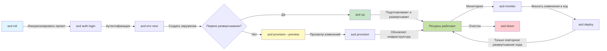
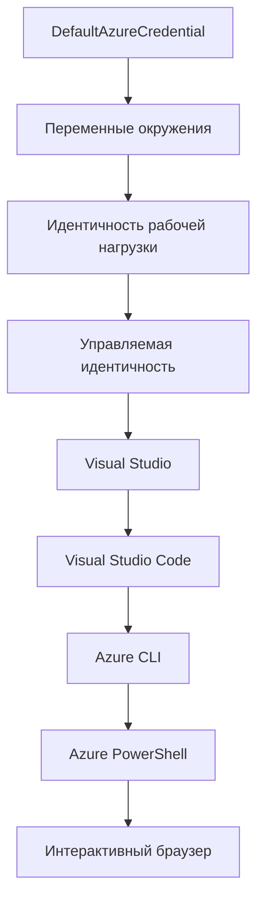

# Основы AZD - Понимание Azure Developer CLI

# Основы AZD - Основные понятия и основы

**Навигация по главам:**
- **📚 Главная курса**: [AZD для начинающих](../../README.md)
- **📖 Текущая глава**: Глава 1 - Основа и быстрый старт
- **⬅️ Предыдущая**: [Обзор курса](../../README.md#-chapter-1-foundation--quick-start)
- **➡️ Следующая**: [Установка и настройка](installation.md)
- **🚀 Следующая глава**: [Глава 2: Разработка с AI в первую очередь](../chapter-02-ai-development/microsoft-foundry-integration.md)

## Введение

Этот урок познакомит вас с Azure Developer CLI (azd) — мощным инструментом командной строки, который ускоряет ваш путь от локальной разработки до развертывания в Azure. Вы узнаете основные концепции, ключевые функции и поймёте, как azd упрощает развертывание облачных приложений.

## Цели обучения

К концу этого урока вы:
- Поймёте, что такое Azure Developer CLI и его основное назначение
- Изучите ключевые понятия шаблонов, сред и сервисов
- Ознакомитесь с основными функциями, включая разработку на основе шаблонов и инфраструктуру как код
- Поймёте структуру проекта azd и рабочий процесс
- Будете готовы установить и настроить azd для вашей среды разработки

## Результаты обучения

После завершения урока вы сможете:
- Объяснить роль azd в современных облачных рабочих процессах разработки
- Определить компоненты структуры проекта azd
- Описать, как работают шаблоны, среды и сервисы вместе
- Понять преимущества инфраструктуры как кода с azd
- Узнавать разные команды azd и их назначение

## Что такое Azure Developer CLI (azd)?

Azure Developer CLI (azd) — это инструмент командной строки, созданный для ускорения вашего пути от локальной разработки до развертывания в Azure. Он упрощает процесс создания, развертывания и управления облачными приложениями на платформе Azure.

### Что можно развернуть с помощью azd?

azd поддерживает широкий спектр рабочих нагрузок — и этот список постоянно растёт. Сегодня с помощью azd можно развернуть:

| Тип нагрузки | Примеры | Один и тот же рабочий процесс? |
|--------------|---------|-------------------------------|
| **Традиционные приложения** | Веб-приложения, REST API, статические сайты | ✅ `azd up` |
| **Сервисы и микросервисы** | Container Apps, Function Apps, многосервисные бэкенды | ✅ `azd up` |
| **Приложения с искусственным интеллектом** | Чат-приложения с Microsoft Foundry Models, RAG-решения с AI Search | ✅ `azd up` |
| **Интеллектуальные агенты** | Агенты, размещённые в Foundry, оркестрация многократных агентов | ✅ `azd up` |

Главное понимание: **жизненный цикл azd остаётся одинаковым независимо от того, что вы развертываете**. Вы инициализируете проект, создаёте инфраструктуру, разворачиваете код, мониторите приложение и очищаете ресурсы — будь то простой веб-сайт или сложный AI-агент.

Это сделано сознательно. azd рассматривает возможности AI как ещё один вид сервиса, который ваше приложение может использовать, а не как нечто принципиально иное. Точка чат-сервиса, поддерживаемая Microsoft Foundry Models, с точки зрения azd — это просто ещё один сервис для настройки и развертывания.

### 🎯 Зачем использовать AZD? Реальное сравнение

Сравним развертывание простого веб-приложения с базой данных:

#### ❌ БЕЗ AZD: Ручное развертывание в Azure (более 30 минут)

```bash
# Шаг 1: Создать группу ресурсов
az group create --name myapp-rg --location eastus

# Шаг 2: Создать план обслуживания приложения
az appservice plan create --name myapp-plan \
  --resource-group myapp-rg \
  --sku B1 --is-linux

# Шаг 3: Создать веб-приложение
az webapp create --name myapp-web-unique123 \
  --resource-group myapp-rg \
  --plan myapp-plan \
  --runtime "NODE:18-lts"

# Шаг 4: Создать учетную запись Cosmos DB (10-15 минут)
az cosmosdb create --name myapp-cosmos-unique123 \
  --resource-group myapp-rg \
  --kind MongoDB

# Шаг 5: Создать базу данных
az cosmosdb mongodb database create \
  --account-name myapp-cosmos-unique123 \
  --resource-group myapp-rg \
  --name tododb

# Шаг 6: Создать коллекцию
az cosmosdb mongodb collection create \
  --account-name myapp-cosmos-unique123 \
  --resource-group myapp-rg \
  --database-name tododb \
  --name todos

# Шаг 7: Получить строку подключения
CONN_STR=$(az cosmosdb keys list \
  --name myapp-cosmos-unique123 \
  --resource-group myapp-rg \
  --type connection-strings \
  --query "connectionStrings[0].connectionString" -o tsv)

# Шаг 8: Настроить параметры приложения
az webapp config appsettings set \
  --name myapp-web-unique123 \
  --resource-group myapp-rg \
  --settings MONGODB_URI="$CONN_STR"

# Шаг 9: Включить ведение журналов
az webapp log config --name myapp-web-unique123 \
  --resource-group myapp-rg \
  --application-logging filesystem \
  --detailed-error-messages true

# Шаг 10: Настроить Application Insights
az monitor app-insights component create \
  --app myapp-insights \
  --location eastus \
  --resource-group myapp-rg

# Шаг 11: Связать App Insights с веб-приложением
INSTRUMENTATION_KEY=$(az monitor app-insights component show \
  --app myapp-insights \
  --resource-group myapp-rg \
  --query "instrumentationKey" -o tsv)

az webapp config appsettings set \
  --name myapp-web-unique123 \
  --resource-group myapp-rg \
  --settings APPINSIGHTS_INSTRUMENTATIONKEY="$INSTRUMENTATION_KEY"

# Шаг 12: Собрать приложение локально
npm install
npm run build

# Шаг 13: Создать пакет развертывания
zip -r app.zip . -x "*.git*" "node_modules/*"

# Шаг 14: Развернуть приложение
az webapp deployment source config-zip \
  --resource-group myapp-rg \
  --name myapp-web-unique123 \
  --src app.zip

# Шаг 15: Ждать и молиться, чтобы всё работало 🙏
# (Автоматической проверки нет, требуется ручное тестирование)
```

**Проблемы:**
- ❌ Более 15 команд для запоминания и выполнения в правильном порядке
- ❌ 30-45 минут ручной работы
- ❌ Легко ошибиться (опечатки, неверные параметры)
- ❌ Строки подключения видны в истории терминала
- ❌ Нет автоматического отката при сбоях
- ❌ Сложно воспроизвести для членов команды
- ❌ Каждый раз по-разному (не воспроизводимо)

#### ✅ С AZD: Автоматизированное развертывание (5 команд, 10-15 минут)

```bash
# Шаг 1: Инициализация из шаблона
azd init --template todo-nodejs-mongo

# Шаг 2: Аутентификация
azd auth login

# Шаг 3: Создание окружения
azd env new dev

# Шаг 4: Предварительный просмотр изменений (необязательно, но рекомендуется)
azd provision --preview

# Шаг 5: Развернуть всё
azd up

# ✨ Готово! Всё развернуто, настроено и находится под мониторингом
```

**Преимущества:**
- ✅ **5 команд** вместо 15+ ручных шагов
- ✅ Всего **10-15 минут** (большую часть времени ожидание Azure)
- ✅ **Меньше ошибок** — стабильный процесс на основе шаблонов
- ✅ **Защищённое управление секретами** — многие шаблоны используют хранилище секретов Azure
- ✅ **Повторяемые развертывания** — одинаковый процесс каждый раз
- ✅ **Полная воспроизводимость** — одинаковый результат каждый раз
- ✅ **Готовность для команды** — любой сможет развернуть с теми же командами
- ✅ **Инфраструктура как код** — версии шаблонов Bicep под контролем исходного кода
- ✅ **Встроенный мониторинг** — Application Insights настраивается автоматически

### 📊 Сокращение времени и ошибок

| Метрика | Ручное развертывание | Развертывание с AZD | Улучшение |
|:--------|:---------------------|:--------------------|:----------|
| **Команды** | 15+ | 5 | на 67% меньше |
| **Время** | 30-45 мин | 10-15 мин | на 60% быстрее |
| **Ошибки** | ~40% | <5% | на 88% меньше |
| **Согласованность** | Низкая (ручная) | 100% (автоматизированная) | Идеально |
| **Ввод в команду** | 2-4 часа | 30 минут | на 75% быстрее |
| **Время отката** | 30+ мин (ручное) | 2 минуты (автоматическое) | на 93% быстрее |

## Основные понятия

### Шаблоны
Шаблоны — основа azd. Они содержат:
- **Код приложения** — ваш исходный код и зависимости
- **Определения инфраструктуры** — ресурсы Azure в Bicep или Terraform
- **Конфигурационные файлы** — настройки и переменные среды
- **Скрипты развертывания** — автоматизированные процессы развертывания

### Среды
Среды представляют разные цели развертывания:
- **Разработка** — для тестирования и разработки
- **Предварительное производство (staging)** — предпроизводственная среда
- **Производство** — живая производственная среда

Каждая среда имеет свои:
- группу ресурсов Azure
- конфигурационные настройки
- состояние развертывания

### Сервисы
Сервисы — строительные блоки вашего приложения:
- **Фронтенд** — веб-приложения, SPA
- **Бэкенд** — API, микросервисы
- **База данных** — решения для хранения данных
- **Хранилище** — файловое и блоб-хранилище

## Ключевые возможности

### 1. Разработка на основе шаблонов
```bash
# Просмотреть доступные шаблоны
azd template list

# Инициализировать из шаблона
azd init --template <template-name>
```

### 2. Инфраструктура как код
- **Bicep** — язык предметной области Azure
- **Terraform** — мультиоблачный инструмент инфраструктуры
- **ARM-шаблоны** — шаблоны Azure Resource Manager

### 3. Интегрированные рабочие процессы
```bash
# Полный процесс развертывания
azd up            # Подготовка + Развертывание, это полностью автоматизировано для первоначальной настройки

# 🧪 НОВИНКА: Предварительный просмотр изменений инфраструктуры перед развертыванием (БЕЗОПАСНО)
azd provision --preview    # Смоделировать развертывание инфраструктуры без внесения изменений

azd provision     # Создайте ресурсы Azure, если вы обновляете инфраструктуру, используйте это
azd deploy        # Развернуть код приложения или повторно развернуть код после обновления
azd down          # Очистить ресурсы
```

#### 🛡️ Безопасное планирование инфраструктуры с помощью предварительного просмотра
Команда `azd provision --preview` меняет правила игры для безопасных развертываний:
- **Анализ без изменения** — показывает, что будет создано, изменено или удалено
- **Нулевой риск** — фактически никаких изменений в Azure не происходит
- **Сотрудничество в команде** — делитесь результатами предварительного просмотра перед развертыванием
- **Оценка стоимости** — понимание затрат на ресурсы перед принятием решения

```bash
# Пример предварительного просмотра рабочего процесса
azd provision --preview           # Посмотреть, что изменится
# Проверить результат, обсудить с командой
azd provision                     # Применить изменения с уверенностью
```

### 📊 Визуализация: рабочий процесс разработки AZD


**Описание рабочего процесса:**
1. **Init** — начать с шаблона или нового проекта
2. **Auth** — аутентификация в Azure
3. **Environment** — создать изолированную среду развертывания
4. **Preview** — 🆕 Всегда сначала предварительный просмотр изменений инфраструктуры (безопасная практика)
5. **Provision** — создание/обновление ресурсов Azure
6. **Deploy** — загрузка кода приложения
7. **Monitor** — наблюдение за производительностью приложения
8. **Iterate** — внесение изменений и повторное развертывание кода
9. **Cleanup** — удаление ресурсов после завершения

### 4. Управление средами
```bash
# Создавайте и управляйте окружениями
azd env new <environment-name>
azd env select <environment-name>
azd env list
```

### 5. Расширения и AI-команды

azd использует систему расширений для добавления возможностей за пределы базового CLI. Это особенно полезно для AI-решений:

```bash
# Список доступных расширений
azd extension list

# Установить расширение агентов Foundry
azd extension install azure.ai.agents

# Инициализировать проект AI агента из манифеста
azd ai agent init -m agent-manifest.yaml

# Запустить сервер MCP для AI-поддерживаемой разработки (Альфа)
azd mcp start
```

> Расширения подробно рассматриваются в [Главе 2: Разработка с AI в первую очередь](../chapter-02-ai-development/agents.md) и в справочнике [AZD AI CLI Commands](../chapter-08-production/production-ai-practices.md#azd-ai-cli-commands-and-extensions).

## 📁 Структура проекта

Типичная структура проекта azd:
```
my-app/
├── .azd/                    # azd configuration
│   └── config.json
├── .azure/                  # Azure deployment artifacts
├── .devcontainer/          # Development container config
├── .github/workflows/      # GitHub Actions
├── .vscode/               # VS Code settings
├── infra/                 # Infrastructure code
│   ├── main.bicep        # Main infrastructure template
│   ├── main.parameters.json
│   └── modules/          # Reusable modules
├── src/                  # Application source code
│   ├── api/             # Backend services
│   └── web/             # Frontend application
├── azure.yaml           # azd project configuration
└── README.md
```

## 🔧 Конфигурационные файлы

### azure.yaml
Основной конфигурационный файл проекта:
```yaml
name: my-awesome-app
metadata:
  template: my-template@1.0.0

services:
  web:
    project: ./src/web
    language: js
    host: appservice
  api:
    project: ./src/api
    language: js
    host: appservice

hooks:
  preprovision:
    shell: pwsh
    run: echo "Preparing to provision..."
```

### .azure/config.json
Конфигурация, специфичная для среды:
```json
{
  "version": 1,
  "defaultEnvironment": "dev",
  "environments": {
    "dev": {
      "subscriptionId": "your-subscription-id",
      "location": "eastus"
    }
  }
}
```

## 🎪 Общие рабочие процессы с практическими упражнениями

> **💡 Совет по обучению:** Следуйте упражнениям по порядку, чтобы постепенно развивать навыки работы с AZD.

### 🎯 Упражнение 1: Инициализация первого проекта

**Цель:** Создать проект AZD и изучить его структуру

**Шаги:**
```bash
# Используйте проверенный шаблон
azd init --template todo-nodejs-mongo

# Изучите сгенерированные файлы
ls -la  # Просмотрите все файлы, включая скрытые

# Созданные ключевые файлы:
# - azure.yaml (основная конфигурация)
# - infra/ (код инфраструктуры)
# - src/ (код приложения)
```

**✅ Успех:** У вас есть каталоги azure.yaml, infra/ и src/

---

### 🎯 Упражнение 2: Развертывание в Azure

**Цель:** Завершить полное развертывание с начала до конца

**Шаги:**
```bash
# 1. Аутентификация
az login && azd auth login

# 2. Создать окружение
azd env new dev
azd env set AZURE_LOCATION eastus

# 3. Предпросмотр изменений (РЕКОМЕНДУЕТСЯ)
azd provision --preview

# 4. Развернуть всё
azd up

# 5. Проверить развертывание
azd show    # Просмотреть URL вашего приложения
```

**Ожидаемое время:** 10-15 минут  
**✅ Успех:** URL приложения открывается в браузере

---

### 🎯 Упражнение 3: Несколько сред

**Цель:** Развернуть в dev и staging

**Шаги:**
```bash
# Уже есть dev, создать staging
azd env new staging
azd env set AZURE_LOCATION westus2
azd up

# Переключаться между ними
azd env list
azd env select dev
```

**✅ Успех:** Две отдельные группы ресурсов в Azure Portal

---

### 🛡️ Чистый старт: `azd down --force --purge`

Когда нужно полностью сбросить:

```bash
azd down --force --purge
```

**Что делает:**
- `--force`: Без запросов подтверждения
- `--purge`: Удаляет все локальное состояние и ресурсы Azure

**Используйте когда:**
- Развертывание прервано на середине
- Переходите на другой проект
- Нужен чистый старт

---

## 🎪 Оригинальный рабочий процесс

### Начало нового проекта
```bash
# Метод 1: Использовать существующий шаблон
azd init --template todo-nodejs-mongo

# Метод 2: Начать с нуля
azd init

# Метод 3: Использовать текущий каталог
azd init .
```

### Цикл разработки
```bash
# Настройка среды разработки
azd auth login
azd env new dev
azd env select dev

# Развернуть всё
azd up

# Внести изменения и развернуть заново
azd deploy

# Очистить после завершения
azd down --force --purge # команда в Azure Developer CLI является **жесткой перезагрузкой** вашей среды — особенно полезна при устранении неполадок с неудачными развертываниями, очистке оставшихся ресурсов или подготовке к новому развертыванию.
```

## Понимание `azd down --force --purge`
Команда `azd down --force --purge` — мощный способ полностью уничтожить вашу среду azd и все связанные ресурсы. Вот что делают каждый из флагов:
```
--force
```
- Пропускает запросы на подтверждение.
- Полезно для автоматизации или сценариев без ручного ввода.
- Обеспечивает непрерывное выполнение даже при обнаружении CLI несоответствий.

```
--purge
```
Удаляет **всю связанную метаинформацию**, включая:
Состояние среды  
Локальную папку `.azure`  
Кэшированную информацию о развертывании  
Предотвращает "запоминание" azd предыдущих развертываний, что может вызывать проблемы с несоответствием групп ресурсов или устаревшими ссылками на реестры.

### Почему использовать оба сразу?
Когда вы сталкиваетесь с проблемами при `azd up` из-за остаточного состояния или частичных развертываний, эту комбинацию используют для **чистого старта**.

Это особенно полезно после ручного удаления ресурсов в портале Azure или при смене шаблонов, сред или соглашений по именованию групп ресурсов.

### Управление несколькими средами
```bash
# Создать тестовую среду
azd env new staging
azd env select staging
azd up

# Переключиться обратно на dev
azd env select dev

# Сравнить среды
azd env list
```

## 🔐 Аутентификация и учетные данные

Понимание аутентификации критично для успешных развертываний с azd. Azure использует несколько методов аутентификации, а azd опирается на ту же цепочку учётных данных, что и другие инструменты Azure.

### Аутентификация Azure CLI (`az login`)

Перед использованием azd нужно выполнить аутентификацию в Azure. Самый распространённый метод — через Azure CLI:

```bash
# Интерактивный вход (открывает браузер)
az login

# Вход с конкретным арендатором
az login --tenant <tenant-id>

# Вход с использованием сервисного принципала
az login --service-principal -u <app-id> -p <password> --tenant <tenant-id>

# Проверить текущий статус входа
az account show

# Список доступных подписок
az account list --output table

# Установить подписку по умолчанию
az account set --subscription <subscription-id>
```

### Поток аутентификации
1. **Интерактивный вход**: Открывается ваш браузер для аутентификации
2. **Device Code Flow**: Для сред без доступа к браузеру
3. **Service Principal**: Для автоматизации и CI/CD сценариев
4. **Managed Identity**: Для приложений, размещённых в Azure

### Цепочка DefaultAzureCredential

`DefaultAzureCredential` — тип учетных данных, который упрощает аутентификацию, автоматически пытаясь использовать различные источники в определённом порядке:

#### Порядок цепочки учетных данных

#### 1. Переменные среды
```bash
# Установить переменные окружения для служебного принципала
export AZURE_CLIENT_ID="<app-id>"
export AZURE_CLIENT_SECRET="<password>"
export AZURE_TENANT_ID="<tenant-id>"
```

#### 2. Workload Identity (Kubernetes/GitHub Actions)
Автоматически используется в:
- Azure Kubernetes Service (AKS) с Workload Identity
- GitHub Actions с OIDC федерацией
- Других сценариях с федеративной идентичностью

#### 3. Managed Identity
Для ресурсов Azure, таких как:
- Виртуальные машины
- App Service
- Azure Functions
- Container Instances

```bash
# Проверить, выполняется ли на ресурсе Azure с управляемой идентичностью
az account show --query "user.type" --output tsv
# Возвращает: "servicePrincipal", если используется управляемая идентичность
```

#### 4. Интеграция с инструментами разработчика
- **Visual Studio**: Использует автоматически вошедший аккаунт
- **VS Code**: Использует учетные данные расширения Azure Account
- **Azure CLI**: Использует учетные данные `az login` (самый распространённый для локальной разработки)

### Настройка аутентификации AZD

```bash
# Метод 1: Используйте Azure CLI (рекомендуется для разработки)
az login
azd auth login  # Использует существующие учетные данные Azure CLI

# Метод 2: Прямая аутентификация azd
azd auth login --use-device-code  # Для безголовых окружений

# Метод 3: Проверка статуса аутентификации
azd auth login --check-status

# Метод 4: Выход из системы и повторная аутентификация
azd auth logout
azd auth login
```

### Лучшие практики аутентификации

#### Для локальной разработки
```bash
# 1. Войдите с помощью Azure CLI
az login

# 2. Проверьте правильность подписки
az account show
az account set --subscription "Your Subscription Name"

# 3. Используйте azd с существующими учетными данными
azd auth login
```

#### Для CI/CD конвейеров
```yaml
# GitHub Actions example
- name: Azure Login
  uses: azure/login@v1
  with:
    creds: ${{ secrets.AZURE_CREDENTIALS }}

- name: Deploy with azd
  run: |
    azd auth login --client-id ${{ secrets.AZURE_CLIENT_ID }} \
                    --client-secret ${{ secrets.AZURE_CLIENT_SECRET }} \
                    --tenant-id ${{ secrets.AZURE_TENANT_ID }}
    azd up --no-prompt
```

#### Для производственных сред
- Используйте **Managed Identity** при запуске на ресурсах Azure
- Используйте **Service Principal** для автоматизации
- Избегайте хранения учетных данных в коде или конфигурациях
- Используйте **Azure Key Vault** для чувствительной конфигурации

### Распространённые проблемы с аутентификацией и решения

#### Проблема: "No subscription found"
```bash
# Решение: Установить подписку по умолчанию
az account list --output table
az account set --subscription "<subscription-id>"
azd env set AZURE_SUBSCRIPTION_ID "<subscription-id>"
```

#### Проблема: "Insufficient permissions"
```bash
# Решение: Проверьте и назначьте необходимые роли
az role assignment list --assignee $(az account show --query user.name --output tsv)

# Общие необходимые роли:
# - Участник (для управления ресурсами)
# - Администратор доступа пользователей (для назначения ролей)
```

#### Проблема: "Token expired"
```bash
# Решение: Повторная аутентификация
az logout
az login
azd auth logout
azd auth login
```

### Аутентификация в разных сценариях

#### Локальная разработка
```bash
# Личный счет для развития
az login
azd auth login
```

#### Командная разработка
```bash
# Используйте конкретного арендатора для организации
az login --tenant contoso.onmicrosoft.com
azd auth login
```

#### Мультиарендные сценарии
```bash
# Переключаться между арендаторами
az login --tenant tenant1.onmicrosoft.com
# Развернуть у арендатора 1
azd up

az login --tenant tenant2.onmicrosoft.com  
# Развернуть у арендатора 2
azd up
```

### Вопросы безопасности
1. **Хранение учетных данных**: Никогда не храните учетные данные в исходном коде  
2. **Ограничение области доступа**: Используйте принцип наименьших привилегий для сервисных учетных записей  
3. **Периодическая смена токенов**: Регулярно обновляйте секреты сервисных учетных записей  
4. **Аудит действий**: Отслеживайте аутентификацию и действия по развертыванию  
5. **Сетевая безопасность**: Используйте приватные конечные точки, когда это возможно  

### Устранение проблем с аутентификацией

```bash
# Отладка проблем с аутентификацией
azd auth login --check-status
az account show
az account get-access-token

# Распространенные диагностические команды
whoami                          # Текущий контекст пользователя
az ad signed-in-user show      # Детали пользователя Azure AD
az group list                  # Проверка доступа к ресурсу
```
  
## Понимание `azd down --force --purge`  

### Обнаружение  
```bash
azd template list              # Просмотр шаблонов
azd template show <template>   # Детали шаблона
azd init --help               # Опции инициализации
```
  
### Управление проектом  
```bash
azd show                     # Обзор проекта
azd env list                # Доступные среды и выбранная по умолчанию
azd config show            # Настройки конфигурации
```
  
### Мониторинг  
```bash
azd monitor                  # Открыть мониторинг портала Azure
azd monitor --logs           # Просмотреть журналы приложения
azd monitor --live           # Просмотреть текущие метрики
azd pipeline config          # Настроить CI/CD
```
  
## Лучшие практики  

### 1. Используйте осмысленные имена  
```bash
# Хорошо
azd env new production-east
azd init --template web-app-secure

# Избегать
azd env new env1
azd init --template template1
```
  
### 2. Используйте шаблоны  
- Начинайте с готовых шаблонов  
- Настраивайте под свои нужды  
- Создавайте повторно используемые шаблоны для своей организации  

### 3. Изоляция окружений  
- Используйте отдельные окружения для разработки/тестирования/продакшена  
- Никогда не развертывайте напрямую в продакшен с локальной машины  
- Используйте CI/CD пайплайны для продакшен-развертываний  

### 4. Управление конфигурацией  
- Используйте переменные окружения для чувствительных данных  
- Храните конфигурацию в системе контроля версий  
- Документируйте настройки для каждого окружения  

## Этапы обучения  

### Начинающий (1-2 неделя)  
1. Установить azd и пройти аутентификацию  
2. Развернуть простой шаблон  
3. Понять структуру проекта  
4. Освоить базовые команды (up, down, deploy)  

### Средний уровень (3-4 неделя)  
1. Настраивать шаблоны  
2. Управлять несколькими окружениями  
3. Понимать код инфраструктуры  
4. Настроить CI/CD пайплайны  

### Продвинутый уровень (5+ неделя)  
1. Создавать собственные шаблоны  
2. Использовать продвинутые шаблоны инфраструктуры  
3. Развертывать в нескольких регионах  
4. Настраивать корпоративные конфигурации  

## Следующие шаги  

**📖 Продолжить изучение главы 1:**  
- [Установка и настройка](installation.md) — установите и настройте azd  
- [Ваш первый проект](first-project.md) — выполните практическое руководство  
- [Руководство по конфигурации](configuration.md) — расширенные параметры настройки  

**🎯 Готовы перейти к следующей главе?**  
- [Глава 2: Разработка с упором на ИИ](../chapter-02-ai-development/microsoft-foundry-integration.md) — начните создавать ИИ-приложения  

## Дополнительные ресурсы  

- [Обзор Azure Developer CLI](https://learn.microsoft.com/en-us/azure/developer/azure-developer-cli/)  
- [Галерея шаблонов](https://azure.github.io/awesome-azd/)  
- [Образцы от сообщества](https://github.com/Azure-Samples)  

---

## 🙋 Часто задаваемые вопросы  

### Общие вопросы  

**В: В чем разница между AZD и Azure CLI?**  

О: Azure CLI (`az`) предназначен для управления отдельными ресурсами Azure. AZD (`azd`) предназначен для управления целыми приложениями:  

```bash
# Azure CLI - Управление ресурсами низкого уровня
az webapp create --name myapp --resource-group rg
az sql server create --name myserver --resource-group rg
# ...требуется гораздо больше команд

# AZD - Управление на уровне приложения
azd up  # Разворачивает все приложение со всеми ресурсами
```
  
**Представьте так:**  
- `az` = работа с отдельными кубиками Lego  
- `azd` = работа с готовыми наборами Lego  

---

**В: Нужно ли знать Bicep или Terraform для использования AZD?**  

О: Нет! Начинайте с шаблонов:  
```bash
# Используйте существующий шаблон - знание IaC не требуется
azd init --template todo-nodejs-mongo
azd up
```
  
Впоследствии вы можете изучить Bicep для кастомизации инфраструктуры. Шаблоны предоставляют рабочие примеры для обучения.  

---

**В: Сколько стоит запускать шаблоны AZD?**  

О: Стоимость зависит от шаблона. Большинство шаблонов для разработки стоят $50-150 в месяц:  

```bash
# Предварительный просмотр затрат перед развертыванием
azd provision --preview

# Всегда очищайте ресурсы, когда не используете
azd down --force --purge  # Удаляет все ресурсы
```
  
**Полезный совет:** Используйте бесплатные уровни, где это возможно:  
- App Service: уровень F1 (бесплатно)  
- Microsoft Foundry Models: Azure OpenAI 50,000 токенов в месяц бесплатно  
- Cosmos DB: бесплатный уровень 1000 RU/s  

---

**В: Можно ли использовать AZD с уже существующими ресурсами Azure?**  

О: Да, но проще начать с чистого листа. AZD лучше всего работает, когда управляет полным жизненным циклом. Для существующих ресурсов:  

```bash
# Вариант 1: Импорт существующих ресурсов (для продвинутых)
azd init
# Затем измените infra/, чтобы ссылаться на существующие ресурсы

# Вариант 2: Начать заново (рекомендуется)
azd init --template matching-your-stack
azd up  # Создает новую среду
```
  
---

**В: Как поделиться проектом с командой?**  

О: Зафиксируйте проект AZD в Git (НО НЕ папку .azure):  

```bash
# Уже есть в .gitignore по умолчанию
.azure/        # Содержит секреты и данные окружения
*.env          # Переменные окружения

# Члены команды затем:
git clone <your-repo>
azd auth login
azd env new <their-name>-dev
azd up
```
  
Так все получают идентичную инфраструктуру из одних и тех же шаблонов.  

---

### Вопросы по устранению неполадок  

**В: Команда "azd up" прервалась на середине. Что делать?**  

О: Проверьте ошибку, исправьте и повторите попытку:  

```bash
# Просмотреть подробные журналы
azd show

# Общие исправления:

# 1. Если превышена квота:
azd env set AZURE_LOCATION "westus2"  # Попробуйте другой регион

# 2. Если конфликт имени ресурса:
azd down --force --purge  # Начать с чистого листа
azd up  # Повторить попытку

# 3. Если срок действия аутентификации истек:
az login
azd auth login
azd up
```
  
**Самая частая проблема:** выбран неправильный Azure подписка  
```bash
az account list --output table
az account set --subscription "<correct-subscription>"
```
  
---

**В: Как развернуть только изменения в коде, без повторного создания инфраструктуры?**  

О: Используйте `azd deploy` вместо `azd up`:  

```bash
azd up          # Первый раз: подготовка + развертывание (медленно)

# Внести изменения в код...

azd deploy      # Последующие разы: только развертывание (быстро)
```
  
Сравнение по времени:  
- `azd up`: 10-15 минут (создает инфраструктуру)  
- `azd deploy`: 2-5 минут (только код)  

---

**В: Можно ли настроить шаблоны инфраструктуры?**  

О: Да! Редактируйте файлы Bicep в папке `infra/`:  

```bash
# После azd init
cd infra/
code main.bicep  # Редактировать в VS Code

# Предварительный просмотр изменений
azd provision --preview

# Применить изменения
azd provision
```
  
**Совет:** Начните с малого — измените SKU:  
```bicep
// infra/main.bicep
sku: {
  name: 'B1'  // Change to 'P1V2' for production
}
```
  
---

**В: Как удалить все, что создал AZD?**  

О: Одна команда удаляет все ресурсы:  

```bash
azd down --force --purge

# Это удаляет:
# - Все ресурсы Azure
# - Группу ресурсов
# - Состояние локальной среды
# - Кэшированные данные развертывания
```
  
**Запускайте эту команду, когда:**  
- Закончили тестировать шаблон  
- Меняете проект  
- Хотите начать заново  

**Экономия:** Удаление неиспользуемых ресурсов = отсутствие затрат  

---

**В: Что делать, если я случайно удалил ресурсы через Azure Portal?**  

О: Состояние AZD может стать несинхронизированным. Используйте «чистый лист»:  

```bash
# 1. Удалить локальное состояние
azd down --force --purge

# 2. Начать заново
azd up

# Альтернатива: Позволить AZD обнаружить и исправить
azd provision  # Создаст отсутствующие ресурсы
```
  
---

### Продвинутые вопросы  

**В: Можно ли использовать AZD в CI/CD пайплайнах?**  

О: Да! Пример для GitHub Actions:  

```yaml
# .github/workflows/deploy.yml
name: Deploy with AZD

on:
  push:
    branches: [main]

jobs:
  deploy:
    runs-on: ubuntu-latest
    steps:
      - uses: actions/checkout@v2
      
      - name: Install azd
        run: curl -fsSL https://aka.ms/install-azd.sh | bash
      
      - name: Azure Login
        run: |
          azd auth login \
            --client-id ${{ secrets.AZURE_CLIENT_ID }} \
            --client-secret ${{ secrets.AZURE_CLIENT_SECRET }} \
            --tenant-id ${{ secrets.AZURE_TENANT_ID }}
      
      - name: Deploy
        run: azd up --no-prompt
```
  
---

**В: Как обрабатывать секреты и чувствительные данные?**  

О: AZD автоматически интегрируется с Azure Key Vault:  

```bash
# Секреты хранятся в Key Vault, а не в коде
azd env set DATABASE_PASSWORD "$(openssl rand -base64 32)"

# AZD автоматически:
# 1. Создает Key Vault
# 2. Сохраняет секрет
# 3. Предоставляет приложению доступ через управляемую идентичность
# 4. Внедряет во время выполнения
```
  
**Никогда не коммитьте:**  
- папку `.azure/` (содержит данные окружения)  
- файлы `.env` (локальные секреты)  
- строки подключения  

---

**В: Можно ли развернуть приложение в нескольких регионах?**  

О: Да, создайте окружение для каждого региона:  

```bash
# Среда Восток США
azd env new prod-eastus
azd env set AZURE_LOCATION eastus
azd up

# Среда Западная Европа
azd env new prod-westeurope
azd env set AZURE_LOCATION westeurope
azd up

# Каждая среда независима
azd env list
```
  
Для настоящих мульти региональных приложений настройте шаблоны Bicep для одновременного развертывания в несколько регионов.  

---

**В: Где получить помощь, если застрял?**  

1. **Документация AZD:** https://learn.microsoft.com/azure/developer/azure-developer-cli/  
2. **GitHub Issues:** https://github.com/Azure/azure-dev/issues  
3. **Discord:** [Azure Discord](https://discord.gg/microsoft-azure) — канал #azure-developer-cli  
4. **Stack Overflow:** Тег `azure-developer-cli`  
5. **Этот курс:** [Руководство по устранению проблем](../chapter-07-troubleshooting/common-issues.md)  

**Полезный совет:** Перед вопросом выполните:  
```bash
azd show       # Показывает текущее состояние
azd version    # Показывает вашу версию
```
  
Включите эту информацию в вопрос для более быстрого ответа.  

---

## 🎓 Что дальше?  

Теперь вы понимаете основы AZD. Выберите свой путь:  

### 🎯 Для начинающих:  
1. **Далее:** [Установка и настройка](installation.md) — установите AZD на свой компьютер  
2. **Затем:** [Ваш первый проект](first-project.md) — разверните первое приложение  
3. **Практика:** Выполните все 3 упражнения этого урока  

### 🚀 Для разработчиков ИИ:  
1. **Перейдите к:** [Глава 2: Разработка с упором на ИИ](../chapter-02-ai-development/microsoft-foundry-integration.md)  
2. **Разверните:** Начните с `azd init --template get-started-with-ai-chat`  
3. **Учитесь:** Создавайте приложения в процессе развертывания  

### 🏗️ Для опытных разработчиков:  
1. **Изучите:** [Руководство по конфигурации](configuration.md) — продвинутые настройки  
2. **Изучите:** [Инфраструктура как код](../chapter-04-infrastructure/provisioning.md) — глубокое погружение в Bicep  
3. **Создавайте:** Собственные шаблоны для своего стека  

---

**Навигация по главам:**  
- **📚 Главная курса**: [AZD для начинающих](../../README.md)  
- **📖 Текущая глава**: Глава 1 - Основы и быстрый старт  
- **⬅️ Предыдущая:** [Обзор курса](../../README.md#-chapter-1-foundation--quick-start)  
- **➡️ Следующая:** [Установка и настройка](installation.md)  
- **🚀 Следующая глава:** [Глава 2: Разработка с упором на ИИ](../chapter-02-ai-development/microsoft-foundry-integration.md)

---

<!-- CO-OP TRANSLATOR DISCLAIMER START -->
**Отказ от ответственности**:  
Этот документ был переведен с помощью службы автоматического перевода [Co-op Translator](https://github.com/Azure/co-op-translator). Несмотря на наши усилия обеспечить точность, пожалуйста, учитывайте, что автоматический перевод может содержать ошибки или неточности. Оригинальный документ на его исходном языке следует считать авторитетным источником. Для критически важной информации рекомендуется профессиональный перевод человеком. Мы не несем ответственности за любые недоразумения или неправильное толкование, возникшие в результате использования этого перевода.
<!-- CO-OP TRANSLATOR DISCLAIMER END -->