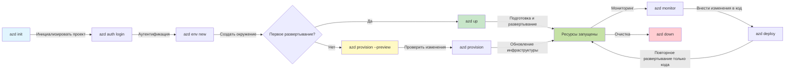
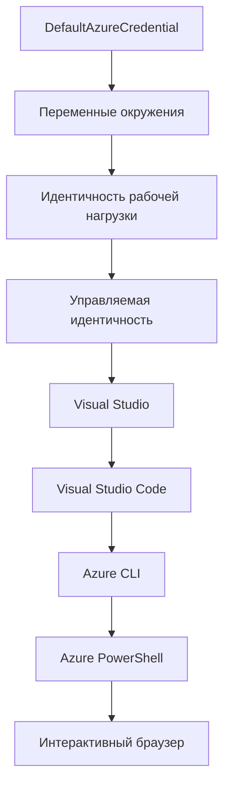

# Основы AZD - Понимание Azure Developer CLI

# Основы AZD - Основные понятия и фундаментальные знания

**Навигация по главам:**
- **📚 Домашняя страница курса**: [AZD для начинающих](../../README.md)
- **📖 Текущая глава**: Глава 1 - Основы и быстрый старт
- **⬅️ Предыдущая**: [Обзор курса](../../README.md#-chapter-1-foundation--quick-start)
- **➡️ Следующая**: [Установка и настройка](installation.md)
- **🚀 Следующая глава**: [Глава 2: Разработка с приоритетом ИИ](../chapter-02-ai-development/microsoft-foundry-integration.md)

## Введение

Этот урок познакомит вас с Azure Developer CLI (azd) — мощным инструментом командной строки, который ускоряет ваш путь от локальной разработки до развертывания в Azure. Вы узнаете основные концепции, ключевые функции и поймёте, как azd упрощает развертывание облачных приложений.

## Цели обучения

К концу этого урока вы:
- Поймёте, что такое Azure Developer CLI и его основное назначение
- Изучите ключевые концепции: шаблоны, окружения и сервисы
- Ознакомитесь с основными функциями, включая разработку на основе шаблонов и инфраструктуру как код
- Поймёте структуру проекта azd и процесс работы
- Будете готовы установить и настроить azd для своей среды разработки

## Результаты обучения

После прохождения урока вы сможете:
- Объяснить роль azd в современных рабочих процессах облачной разработки
- Выделить компоненты структуры проекта azd
- Описать взаимодействие шаблонов, окружений и сервисов
- Понять преимущества инфраструктуры как кода с azd
- Узнать разные команды azd и их назначение

## Что такое Azure Developer CLI (azd)?

Azure Developer CLI (azd) — это инструмент командной строки, предназначенный для ускорения вашего пути от локальной разработки до развертывания в Azure. Он упрощает процесс создания, развертывания и управления облачными приложениями на платформе Azure.

### Что можно развернуть с помощью azd?

azd поддерживает широкий спектр рабочих нагрузок — и список постоянно растёт. Сегодня вы можете использовать azd для развертывания:

| Тип нагрузки | Примеры | Одинаковый процесс? |
|--------------|---------|---------------------|
| **Традиционные приложения** | Веб-приложения, REST API, статические сайты | ✅ `azd up` |
| **Сервисы и микросервисы** | Контейнерные приложения, Function Apps, многосервисные бэкенды | ✅ `azd up` |
| **Приложения с ИИ** | Чат-приложения с Microsoft Foundry Models, RAG решения с AI Search | ✅ `azd up` |
| **Интеллектуальные агенты** | Агенты, размещённые в Foundry, оркестрации с несколькими агентами | ✅ `azd up` |

Главный вывод — **жизненный цикл azd остаётся неизменным независимо от того, что вы развертываете**. Вы инициализируете проект, создаёте инфраструктуру, развертываете код, мониторите приложение и очищаете ресурсы — будь то простой веб-сайт или сложный ИИ-агент.

Это обеспечивает согласованность. azd рассматривает ИИ-возможности как ещё один тип сервиса, который ваше приложение может использовать, а не что-то принципиально иное. Точка доступа чата на основе Microsoft Foundry Models — с точки зрения azd — это просто ещё один сервис для настройки и развертывания.

### 🎯 Зачем использовать AZD? Сравнение на практике

Сравним развертывание простого веб-приложения с базой данных:

#### ❌ БЕЗ AZD: Ручное развертывание в Azure (более 30 минут)

```bash
# Шаг 1: Создать группу ресурсов
az group create --name myapp-rg --location eastus

# Шаг 2: Создать план службы приложений
az appservice plan create --name myapp-plan \
  --resource-group myapp-rg \
  --sku B1 --is-linux

# Шаг 3: Создать веб-приложение
az webapp create --name myapp-web-unique123 \
  --resource-group myapp-rg \
  --plan myapp-plan \
  --runtime "NODE:18-lts"

# Шаг 4: Создать учетную запись Cosmos DB (10-15 минут)
az cosmosdb create --name myapp-cosmos-unique123 \
  --resource-group myapp-rg \
  --kind MongoDB

# Шаг 5: Создать базу данных
az cosmosdb mongodb database create \
  --account-name myapp-cosmos-unique123 \
  --resource-group myapp-rg \
  --name tododb

# Шаг 6: Создать коллекцию
az cosmosdb mongodb collection create \
  --account-name myapp-cosmos-unique123 \
  --resource-group myapp-rg \
  --database-name tododb \
  --name todos

# Шаг 7: Получить строку подключения
CONN_STR=$(az cosmosdb keys list \
  --name myapp-cosmos-unique123 \
  --resource-group myapp-rg \
  --type connection-strings \
  --query "connectionStrings[0].connectionString" -o tsv)

# Шаг 8: Настроить параметры приложения
az webapp config appsettings set \
  --name myapp-web-unique123 \
  --resource-group myapp-rg \
  --settings MONGODB_URI="$CONN_STR"

# Шаг 9: Включить логирование
az webapp log config --name myapp-web-unique123 \
  --resource-group myapp-rg \
  --application-logging filesystem \
  --detailed-error-messages true

# Шаг 10: Настроить Application Insights
az monitor app-insights component create \
  --app myapp-insights \
  --location eastus \
  --resource-group myapp-rg

# Шаг 11: Связать App Insights с веб-приложением
INSTRUMENTATION_KEY=$(az monitor app-insights component show \
  --app myapp-insights \
  --resource-group myapp-rg \
  --query "instrumentationKey" -o tsv)

az webapp config appsettings set \
  --name myapp-web-unique123 \
  --resource-group myapp-rg \
  --settings APPINSIGHTS_INSTRUMENTATIONKEY="$INSTRUMENTATION_KEY"

# Шаг 12: Собрать приложение локально
npm install
npm run build

# Шаг 13: Создать пакет развертывания
zip -r app.zip . -x "*.git*" "node_modules/*"

# Шаг 14: Развернуть приложение
az webapp deployment source config-zip \
  --resource-group myapp-rg \
  --name myapp-web-unique123 \
  --src app.zip

# Шаг 15: Подождать и молиться, что всё работает 🙏
# (Автоматическая проверка отсутствует, требуется ручное тестирование)
```

**Проблемы:**
- ❌ Более 15 команд, которые нужно помнить и выполнять в порядке
- ❌ 30-45 минут ручной работы
- ❌ Легко совершить ошибки (опечатки, неверные параметры)
- ❌ Строки подключения видны в истории терминала
- ❌ Нет автоматического отката при сбоях
- ❌ Трудно воспроизвести для других членов команды
- ❌ Каждый раз по-разному (нерепродуцируемо)

#### ✅ С AZD: Автоматизированное развертывание (5 команд, 10-15 минут)

```bash
# Шаг 1: Инициализация из шаблона
azd init --template todo-nodejs-mongo

# Шаг 2: Аутентификация
azd auth login

# Шаг 3: Создание окружения
azd env new dev

# Шаг 4: Предварительный просмотр изменений (необязательно, но рекомендовано)
azd provision --preview

# Шаг 5: Развертывание всего
azd up

# ✨ Готово! Все развернуто, настроено и мониторится
```

**Преимущества:**
- ✅ **5 команд** вместо 15+ ручных шагов
- ✅ **10-15 минут** общее время (большая часть — ожидание Azure)
- ✅ **Меньше ошибок** — стабильный, основанный на шаблонах процесс
- ✅ **Безопасное управление секретами** — многие шаблоны используют хранилища секретов Azure
- ✅ **Повторяемость развертывания** — одинаковый процесс каждый раз
- ✅ **Полная воспроизводимость** — одинаковый результат
- ✅ **Готовность для команды** — любой может развернуть с помощью тех же команд
- ✅ **Инфраструктура как код** — шаблоны Bicep под управлением версий
- ✅ **Встроенный мониторинг** — автоматическая настройка Application Insights

### 📊 Сокращение времени и числа ошибок

| Метрика | Ручное развертывание | Развертывание с AZD | Улучшение |
|:--------|:---------------------|:--------------------|:----------|
| **Команды** | 15+ | 5 | На 67% меньше |
| **Время** | 30-45 мин | 10-15 мин | На 60% быстрее |
| **Уровень ошибок** | ~40% | <5% | Снижение на 88% |
| **Стабильность** | Низкая (ручное) | 100% (автоматическое) | Идеально |
| **Введение в команду** | 2-4 часа | 30 минут | На 75% быстрее |
| **Время отката** | 30+ мин (ручной) | 2 мин (автоматический) | На 93% быстрее |

## Основные понятия

### Шаблоны  
Шаблоны — это основа azd. Они содержат:  
- **Код приложения** — ваш исходный код и зависимости  
- **Определения инфраструктуры** — ресурсы Azure, описанные на Bicep или Terraform  
- **Конфигурационные файлы** — настройки и переменные окружения  
- **Скрипты развертывания** — автоматизированные рабочие процессы  

### Окружения  
Окружения представляют разные цели развертывания:  
- **Development** — для тестирования и разработки  
- **Staging** — предпроизводственная среда  
- **Production** — рабочая (продакшен) среда  

Каждое окружение имеет собственные:  
- группу ресурсов Azure  
- настройки конфигурации  
- состояние развертывания  

### Сервисы  
Сервисы — это строительные блоки вашего приложения:  
- **Frontend** — веб-приложения, SPA  
- **Backend** — API, микросервисы  
- **Database** — решения для хранения данных  
- **Storage** — файловое и блоб-хранилище  

## Ключевые функции

### 1. Разработка на основе шаблонов  
```bash
# Просмотреть доступные шаблоны
azd template list

# Инициализировать из шаблона
azd init --template <template-name>
```
  
### 2. Инфраструктура как код  
- **Bicep** — специализированный язык Azure  
- **Terraform** — инструмент для управления многоблачной инфраструктурой  
- **ARM Templates** — шаблоны Azure Resource Manager  

### 3. Интегрированные рабочие процессы  
```bash
# Полный процесс развертывания
azd up            # Подготовка + Развертывание, это автоматизировано для первого запуска

# 🧪 НОВИНКА: Предварительный просмотр изменений инфраструктуры перед развертыванием (БЕЗОПАСНО)
azd provision --preview    # Симуляция развертывания инфраструктуры без внесения изменений

azd provision     # Создайте ресурсы Azure, если вы обновляете инфраструктуру, используйте это
azd deploy        # Развернуть код приложения или повторно развернуть код приложения после обновления
azd down          # Очистка ресурсов
```
  
#### 🛡️ Безопасное планирование инфраструктуры с помощью Preview  
Команда `azd provision --preview` — ключ к безопасным развертываниям:  
- **Сухой запуск** — показывает, что будет создано, изменено или удалено  
- **Нулевой риск** — никаких изменений в Azure не происходит  
- **Совместная работа в команде** — делитесь результатами превью перед развертыванием  
- **Оценка стоимости** — понимание затрат на ресурсы перед принятием решения  

```bash
# Пример предварительного просмотра рабочего процесса
azd provision --preview           # Посмотрите, что изменится
# Просмотрите результат, обсудите с командой
azd provision                     # Вносите изменения с уверенностью
```
  
### 📊 Визуальное представление: Рабочий процесс разработки в AZD  


  
**Объяснение рабочего процесса:**  
1. **Init** — старт с шаблона или нового проекта  
2. **Auth** — аутентификация в Azure  
3. **Environment** — создание изолированного окружения для развертывания  
4. **Preview** — 🆕 всегда сначала просматривайте изменения инфраструктуры (безопасная практика)  
5. **Provision** — создание/обновление ресурсов Azure  
6. **Deploy** — загрузка кода приложения  
7. **Monitor** — мониторинг производительности приложения  
8. **Iterate** — внесение изменений и повторное развертывание  
9. **Cleanup** — удаление ресурсов по завершении  

### 4. Управление окружениями  
```bash
# Создавать и управлять окружениями
azd env new <environment-name>
azd env select <environment-name>
azd env list
```
  
### 5. Расширения и команды ИИ  

azd использует систему расширений для добавления возможностей за пределами базового CLI. Это особенно полезно для рабочих нагрузок с ИИ:

```bash
# Список доступных расширений
azd extension list

# Установить расширение агентов Foundry
azd extension install azure.ai.agents

# Инициализировать проект AI-агента из манифеста
azd ai agent init -m agent-manifest.yaml

# Протестировать развернутого агента (показывает задержку и время до первого байта)
azd ai agent invoke

# Запустить сервер MCP для AI-ассистированной разработки (Альфа)
azd mcp start
```
  
**Жизненный цикл агента от начала до конца.** После установки `azure.ai.agents` единый процесс проведёт вас от идеи до работающего, мониторящегося агента. Не нужно всё сразу — просто знайте, что это есть:

| Этап | Команда | Что делает |
|-------|---------|------------|
| **Scaffold** | `azd ai agent init -m <manifest>` | Генерирует проект агента из манифеста |
| **Test** | `azd ai agent invoke` | Вызывает агента и показывает время ответа |
| **Measure** | `azd ai agent eval generate` | Создаёт набор данных для оценки агента |
| **Improve** | `azd ai agent optimize` | Оптимизирует инструкции агента на основе ваших данных |
| **Inspect** | `azd ai agent endpoint show` | Показывает конфигурацию рабочей точки агента |
| **Clean up** | `azd ai agent delete` | Удаляет размещённого агента и все его версии |

> Расширения подробно рассмотрены в [Главе 2: Разработка с приоритетом ИИ](../chapter-02-ai-development/agents.md) и в справочнике [Команд AZD AI CLI](../chapter-08-production/production-ai-practices.md#azd-ai-cli-commands-and-extensions).

## 📁 Структура проекта

Типичная структура проекта azd:  
```
my-app/
├── .azd/                    # azd configuration
│   └── config.json
├── .azure/                  # Azure deployment artifacts
├── .devcontainer/          # Development container config
├── .github/workflows/      # GitHub Actions
├── .vscode/               # VS Code settings
├── infra/                 # Infrastructure code
│   ├── main.bicep        # Main infrastructure template
│   ├── main.parameters.json
│   └── modules/          # Reusable modules
├── src/                  # Application source code
│   ├── api/             # Backend services
│   └── web/             # Frontend application
├── azure.yaml           # azd project configuration
└── README.md
```
  
## 🔧 Конфигурационные файлы  

### azure.yaml  
Основной конфигурационный файл проекта:  
```yaml
name: my-awesome-app
metadata:
  template: my-template@1.0.0

services:
  web:
    project: ./src/web
    language: js
    host: appservice
  api:
    project: ./src/api
    language: js
    host: appservice

hooks:
  preprovision:
    shell: pwsh
    run: echo "Preparing to provision..."
```
  
### .azure/config.json  
Конфигурация, специфичная для окружения:  
```json
{
  "version": 1,
  "defaultEnvironment": "dev",
  "environments": {
    "dev": {
      "subscriptionId": "your-subscription-id",
      "location": "eastus"
    }
  }
}
```
  
## 🎪 Общие рабочие процессы с практическими упражнениями  

> **💡 Совет по обучению:** Выполняйте упражнения по порядку, чтобы последовательно развивать навыки работы с AZD.

### 🎯 Упражнение 1: Инициализация первого проекта  

**Цель:** Создать проект AZD и изучить его структуру  

**Шаги:**  
```bash
# Используйте проверенный шаблон
azd init --template todo-nodejs-mongo

# Изучите сгенерированные файлы
ls -la  # Просмотрите все файлы, включая скрытые

# Созданные ключевые файлы:
# - azure.yaml (основная конфигурация)
# - infra/ (код инфраструктуры)
# - src/ (код приложения)
```
  
**✅ Успех:** У вас появились директории azure.yaml, infra/ и src/

---

### 🎯 Упражнение 2: Развертывание в Azure  

**Цель:** Выполнить сквозное развертывание  

**Шаги:**  
```bash
# 1. Аутентификация
az login && azd auth login

# 2. Создать окружение
azd env new dev
azd env set AZURE_LOCATION eastus

# 3. Предварительный просмотр изменений (РЕКОМЕНДУЕТСЯ)
azd provision --preview

# 4. Развернуть всё
azd up

# 5. Проверить развертывание
azd show    # Просмотреть URL вашего приложения
```
  
**Ожидаемое время:** 10-15 минут  
**✅ Успех:** URL приложения открывается в браузере

---

### 🎯 Упражнение 3: Несколько окружений  

**Цель:** Развернуть в dev и staging  

**Шаги:**  
```bash
# Уже есть dev, создать staging
azd env new staging
azd env set AZURE_LOCATION westus2
azd up

# Переключаться между ними
azd env list
azd env select dev
```
  
**✅ Успех:** В портале Azure две отдельные группы ресурсов

---

### 🛡️ Чистый старт: `azd down --force --purge`

Когда нужно полностью сбросить:

```bash
azd down --force --purge
```
  
**Что делает:**  
- `--force`: Без подтверждений  
- `--purge`: Удаляет все локальные состояния и ресурсы Azure  

**Используйте, если:**  
- Развертывание прервалось  
- Переходите на другой проект  
- Нужен чистый старт  

---

## 🎪 Оригинальная справка по рабочему процессу

### Начало нового проекта  
```bash
# Метод 1: Использовать существующий шаблон
azd init --template todo-nodejs-mongo

# Метод 2: Начать с нуля
azd init

# Метод 3: Использовать текущий каталог
azd init .
```
  
### Цикл разработки  
```bash
# Настройте среду разработки
azd auth login
azd env new dev
azd env select dev

# Разверните всё
azd up

# Внесите изменения и разверните заново
azd deploy

# Очистите после завершения
azd down --force --purge # команда в Azure Developer CLI — это **жесткая перезагрузка** вашей среды, особенно полезная при устранении сбоев развертывания, очистке заброшенных ресурсов или подготовке к новому развертыванию.
```
  
## Понимание `azd down --force --purge`  
Команда `azd down --force --purge` — мощный способ полностью удалить ваше окружение azd и все связанные ресурсы. Вот пояснение к каждому флагу:  
```
--force
```
- Пропускает запросы на подтверждение.  
- Полезно для автоматизации или сценариев, где нет возможности ручного ввода.  
- Обеспечивает непрерывный процесс удаления, даже если CLI обнаруживает несоответствия.  

```
--purge
```
Удаляет **всю связанную метаинформацию**, включая:  
Состояние окружения  
Локальную папку `.azure`  
Кэшированные данные развертывания  
Предотвращает запоминание azd предыдущих развертываний, что может вызвать проблемы — например, несоответствие групп ресурсов или устаревшие ссылки на реестр.  

### Зачем использовать оба?  
Когда вы столкнулись с проблемой `azd up` из-за остатков состояния или частичных развертываний, этот набор команд гарантирует **чистый старт**.

Это особенно полезно после ручного удаления ресурсов через портал Azure или при смене шаблонов, окружений или соглашений именования групп ресурсов.

### Управление несколькими окружениями  
```bash
# Создать промежуточную среду
azd env new staging
azd env select staging
azd up

# Переключиться обратно на dev
azd env select dev

# Сравнить среды
azd env list
```
  
## 🔐 Аутентификация и учетные данные

Понимание аутентификации — ключ к успешным развертываниям azd. Azure использует несколько методов аутентификации, и azd использует тот же цепочный механизм учетных данных, что и другие инструменты Azure.

### Аутентификация через Azure CLI (`az login`)

Перед использованием azd необходимо пройти аутентификацию в Azure. Самый распространённый способ — через Azure CLI:

```bash
# Интерактивный вход (открывается браузер)
az login

# Вход с указанием конкретного арендатора
az login --tenant <tenant-id>

# Вход с использованием сервисного принципала
az login --service-principal -u <app-id> -p <password> --tenant <tenant-id>

# Проверить текущий статус входа
az account show

# Список доступных подписок
az account list --output table

# Установить подписку по умолчанию
az account set --subscription <subscription-id>
```
  
### Поток аутентификации  
1. **Интерактивный вход**: открывает ваш браузер для аутентификации  
2. **Device Code Flow**: для сред без доступа к браузеру  
3. **Service Principal**: для автоматизации и сценариев CI/CD  
4. **Managed Identity**: для приложений, размещённых в Azure  

### Цепочка DefaultAzureCredential

`DefaultAzureCredential` — тип учетных данных, который упрощает аутентификацию, автоматически пытаясь использовать несколько источников в определённом порядке:

#### Порядок источников учетных данных  

  
#### 1. Переменные окружения  
```bash
# Установить переменные окружения для сервисного принципала
export AZURE_CLIENT_ID="<app-id>"
export AZURE_CLIENT_SECRET="<password>"
export AZURE_TENANT_ID="<tenant-id>"
```
  
#### 2. Workload Identity (Kubernetes/GitHub Actions)  
Используется автоматически в:  
- Azure Kubernetes Service (AKS) с Workload Identity  
- GitHub Actions с OIDC федерацией  
- Других сценариях федеративной идентификации  

#### 3. Managed Identity  
Для ресурсов Azure, таких как:  
- Виртуальные машины  
- App Service  
- Azure Functions  
- Container Instances  

```bash
# Проверяет, запущено ли на ресурсе Azure с управляемой идентичностью
az account show --query "user.type" --output tsv
# Возвращает: "servicePrincipal", если используется управляемая идентичность
```
  
#### 4. Интеграция с инструментами для разработчиков  
- **Visual Studio**: использует автоматически авторизованный аккаунт  
- **VS Code**: использует учетные данные расширения Azure Account  
- **Azure CLI**: использует учетные данные `az login` (наиболее распространён для локальной разработки)  

### Настройка аутентификации AZD

```bash
# Метод 1: Используйте Azure CLI (рекомендуется для разработки)
az login
azd auth login  # Использует существующие учетные данные Azure CLI

# Метод 2: Прямая аутентификация azd
azd auth login --use-device-code  # Для безголовых сред

# Метод 3: Проверка статуса аутентификации
azd auth login --check-status

# Метод 4: Выход из системы и повторная аутентификация
azd auth logout
azd auth login
```
  
### Лучшие практики аутентификации  

#### Для локальной разработки
```bash
# 1. Войдите с помощью Azure CLI
az login

# 2. Проверьте правильность подписки
az account show
az account set --subscription "Your Subscription Name"

# 3. Используйте azd с существующими учетными данными
azd auth login
```

#### Для CI/CD конвейеров
```yaml
# GitHub Actions example
- name: Azure Login
  uses: azure/login@v1
  with:
    creds: ${{ secrets.AZURE_CREDENTIALS }}

- name: Deploy with azd
  run: |
    azd auth login --client-id ${{ secrets.AZURE_CLIENT_ID }} \
                    --client-secret ${{ secrets.AZURE_CLIENT_SECRET }} \
                    --tenant-id ${{ secrets.AZURE_TENANT_ID }}
    azd up --no-prompt
```

#### Для производственных сред
- Используйте **Управляемую учетную запись (Managed Identity)** при работе с ресурсами Azure
- Используйте **Служебный принципал (Service Principal)** для сценариев автоматизации
- Избегайте хранения учетных данных в коде или конфигурационных файлах
- Используйте **Azure Key Vault** для чувствительной конфигурации

### Распространенные проблемы аутентификации и их решения

#### Проблема: "Подписка не найдена"
```bash
# Решение: Установить подписку по умолчанию
az account list --output table
az account set --subscription "<subscription-id>"
azd env set AZURE_SUBSCRIPTION_ID "<subscription-id>"
```

#### Проблема: "Недостаточно прав"
```bash
# Решение: Проверить и назначить необходимые роли
az role assignment list --assignee $(az account show --query user.name --output tsv)

# Общие необходимые роли:
# - Участник (для управления ресурсами)
# - Администратор доступа пользователей (для назначений ролей)
```

#### Проблема: "Срок действия токена истек"
```bash
# Решение: Повторная аутентификация
az logout
az login
azd auth logout
azd auth login
```

### Аутентификация в различных сценариях

#### Локальная разработка
```bash
# Личный счет для развития
az login
azd auth login
```

#### Командная разработка
```bash
# Используйте конкретного арендатора для организации
az login --tenant contoso.onmicrosoft.com
azd auth login
```

#### Мультиарендные сценарии
```bash
# Переключение между арендаторами
az login --tenant tenant1.onmicrosoft.com
# Развернуть для арендатора 1
azd up

az login --tenant tenant2.onmicrosoft.com  
# Развернуть для арендатора 2
azd up
```

### Соображения по безопасности

1. **Хранение учетных данных**: Никогда не храните учетные данные в исходном коде
2. **Ограничение области действий**: Используйте принцип наименьших привилегий для служебных принципалов
3. **Ротация токенов**: Регулярно меняйте секреты служебных принципалов
4. **Аудит**: Отслеживайте действия аутентификации и развертывания
5. **Сетевая безопасность**: Используйте приватные конечные точки, когда возможно

### Устранение проблем с аутентификацией

```bash
# Отладка проблем аутентификации
azd auth login --check-status
az account show
az account get-access-token

# Общие диагностические команды
whoami                          # Контекст текущего пользователя
az ad signed-in-user show      # Данные пользователя Microsoft Entra ID
az group list                  # Тест доступа к ресурсу
```

## Понимание команды `azd down --force --purge`

### Обнаружение
```bash
azd template list              # Просмотр шаблонов
azd template show <template>   # Детали шаблона
azd init --help               # Параметры инициализации
```

### Управление проектом
```bash
azd show                     # Обзор проекта
azd env list                # Доступные окружения и выбранные по умолчанию
azd config show            # Настройки конфигурации
```

### Мониторинг
```bash
azd monitor                  # Открыть портал мониторинга Azure
azd monitor --logs           # Просмотреть журналы приложений
azd monitor --live           # Просмотреть живые метрики
azd pipeline config          # Настроить CI/CD
```

## Лучшие практики

### 1. Используйте значимые имена
```bash
# Хорошо
azd env new production-east
azd init --template web-app-secure

# Избегать
azd env new env1
azd init --template template1
```

### 2. Используйте шаблоны
- Начните с существующих шаблонов
- Настройте под свои нужды
- Создавайте многоразовые шаблоны для вашей организации

### 3. Изоляция окружений
- Используйте отдельные окружения для разработки, тестирования и производства
- Никогда не разворачивайте напрямую в продакшн с локальной машины
- Используйте CI/CD конвейеры для продакшн-развертываний

### 4. Управление конфигурацией
- Используйте переменные окружения для чувствительных данных
- Храните конфигурацию в системе контроля версий
- Документируйте настройки для каждого окружения

## Прогресс обучения

### Начинающий (недели 1-2)
1. Установите azd и выполните аутентификацию
2. Разверните простой шаблон
3. Поймите структуру проекта
4. Изучите базовые команды (up, down, deploy)

### Средний уровень (недели 3-4)
1. Настройте шаблоны под себя
2. Управляйте несколькими окружениями
3. Поймите инфраструктурный код
4. Настройте CI/CD конвейеры

### Продвинутый (недели 5+)
1. Создавайте свои шаблоны
2. Используйте продвинутые инфраструктурные паттерны
3. Развертывание в нескольких регионах
4. Конфигурации корпоративного уровня

## Следующие шаги

**📖 Продолжайте обучение по главе 1:**
- [Установка и настройка](installation.md) - Установка и настройка azd
- [Ваш первый проект](first-project.md) - Практическое руководство
- [Руководство по конфигурации](configuration.md) - Расширенные параметры конфигурации

**🎯 Готовы к следующей главе?**
- [Глава 2: Разработка с акцентом на ИИ](../chapter-02-ai-development/microsoft-foundry-integration.md) - Начинайте создавать AI-приложения

## Дополнительные ресурсы

- [Обзор Azure Developer CLI](https://learn.microsoft.com/en-us/azure/developer/azure-developer-cli/)
- [Галерея шаблонов](https://azure.github.io/awesome-azd/)
- [Образцы от сообщества](https://github.com/Azure-Samples)

---

## 🙋 Часто задаваемые вопросы

### Общие вопросы

**В: В чем разница между AZD и Azure CLI?**

О: Azure CLI (`az`) предназначен для управления отдельными ресурсами Azure. AZD (`azd`) предназначен для управления целыми приложениями:

```bash
# Azure CLI - Низкоуровневое управление ресурсами
az webapp create --name myapp --resource-group rg
az sql server create --name myserver --resource-group rg
# ...нужно еще много команд

# AZD - Управление на уровне приложения
azd up  # Развертывает все приложение со всеми ресурсами
```

**Думайте об этом так:**
- `az` = управление отдельными кирпичиками LEGO
- `azd` = работа с готовыми наборами LEGO

---

**В: Нужно ли знать Bicep или Terraform для работы с AZD?**

О: Нет! Начинайте с шаблонов:
```bash
# Используйте существующий шаблон - знания IaC не требуются
azd init --template todo-nodejs-mongo
azd up
```

Позже вы можете изучить Bicep для настройки инфраструктуры. Шаблоны дают вам рабочие примеры для обучения.

---

**В: Сколько стоит запуск шаблонов AZD?**

О: Стоимость зависит от шаблона. Большинство шаблонов для разработки стоит $50-150 в месяц:

```bash
# Предварительный просмотр затрат перед развертыванием
azd provision --preview

# Всегда очищайте, когда не используете
azd down --force --purge  # Удаляет все ресурсы
```

**Полезный совет:** Используйте бесплатные уровни, где возможно:
- App Service: уровень F1 (бесплатно)
- Модели Microsoft Foundry: Azure OpenAI бесплатно 50,000 токенов в месяц
- Cosmos DB: бесплатный уровень 1000 RU/с

---

**В: Можно ли использовать AZD с уже существующими ресурсами Azure?**

О: Да, но проще начинать с нуля. AZD работает лучше, когда управляет полным жизненным циклом. Для существующих ресурсов:

```bash
# Вариант 1: Импортировать существующие ресурсы (расширенный)
azd init
# Затем измените infra/ для ссылки на существующие ресурсы

# Вариант 2: Начать с нуля (рекомендуется)
azd init --template matching-your-stack
azd up  # Создает новую среду
```

---

**В: Как поделиться проектом с командой?**

О: Закоммитьте проект AZD в Git (НО не папку .azure):

```bash
# Уже по умолчанию в .gitignore
.azure/        # Содержит секреты и данные окружения
*.env          # Переменные окружения

# Участники команды тогда:
git clone <your-repo>
azd auth login
azd env new <their-name>-dev
azd up
```

Так все получают одинаковую инфраструктуру из одних и тех же шаблонов.

---

### Вопросы по устранению неисправностей

**В: Команда "azd up" прервана на полпути. Что делать?**

О: Проверьте ошибку, исправьте и попробуйте снова:

```bash
# Просмотреть подробные журналы
azd show

# Общие исправления:

# 1. Если превышена квота:
azd env set AZURE_LOCATION "westus2"  # Попробуйте другой регион

# 2. Если конфликт имени ресурса:
azd down --force --purge  # Начать с чистого листа
azd up  # Повторить попытку

# 3. Если срок действия авторизации истек:
az login
azd auth login
azd up
```

**Самая распространенная ошибка:** выбрана неправильная подписка Azure
```bash
az account list --output table
az account set --subscription "<correct-subscription>"
```

---

**В: Как развернуть только изменения в коде, не перестраивая инфраструктуру?**

О: Используйте `azd deploy` вместо `azd up`:

```bash
azd up          # Первый запуск: подготовка + деплой (медленно)

# Внесите изменения в код...

azd deploy      # Следующие запуски: только деплой (быстро)
```

Сравнение скорости:
- `azd up`: 10-15 минут (создание инфраструктуры)
- `azd deploy`: 2-5 минут (только код)

---

**В: Можно ли настроить шаблоны инфраструктуры?**

О: Да! Редактируйте файлы Bicep в `infra/`:

```bash
# После выполнения azd init
cd infra/
code main.bicep  # Редактирование в VS Code

# Предпросмотр изменений
azd provision --preview

# Применить изменения
azd provision
```

**Совет:** Начинайте с малого — сначала измените SKU:
```bicep
// infra/main.bicep
sku: {
  name: 'B1'  // Change to 'P1V2' for production
}
```

---

**В: Как удалить все, что создал AZD?**

О: Одна команда удаляет все ресурсы:

```bash
azd down --force --purge

# Это удаляет:
# - Все ресурсы Azure
# - Группу ресурсов
# - Локальное состояние среды
# - Кэшированные данные развертывания
```

**Запускайте это всегда, когда:**
- Закончили тестировать шаблон
- Переходите к другому проекту
- Хотите начать заново

**Экономия:** удаление неиспользуемых ресурсов = $0 затрат

---

**В: Что делать, если случайно удалил ресурсы через портал Azure?**

О: Состояние AZD может не соответствовать текущему. Нужно очистить всё:

```bash
# 1. Удалить локальное состояние
azd down --force --purge

# 2. Начать заново
azd up

# Альтернатива: Позволить AZD обнаружить и исправить
azd provision  # Создаст отсутствующие ресурсы
```

---

### Продвинутые вопросы

**В: Можно ли использовать AZD в CI/CD конвейерах?**

О: Да! Пример для GitHub Actions:

```yaml
# .github/workflows/deploy.yml
name: Deploy with AZD

on:
  push:
    branches: [main]

jobs:
  deploy:
    runs-on: ubuntu-latest
    steps:
      - uses: actions/checkout@v2
      
      - name: Install azd
        run: curl -fsSL https://aka.ms/install-azd.sh | bash
      
      - name: Azure Login
        run: |
          azd auth login \
            --client-id ${{ secrets.AZURE_CLIENT_ID }} \
            --client-secret ${{ secrets.AZURE_CLIENT_SECRET }} \
            --tenant-id ${{ secrets.AZURE_TENANT_ID }}
      
      - name: Deploy
        run: azd up --no-prompt
```

---

**В: Как работать с секретами и конфиденциальными данными?**

О: AZD автоматически интегрируется с Azure Key Vault:

```bash
# Секреты хранятся в Key Vault, а не в коде
azd env set DATABASE_PASSWORD "$(openssl rand -base64 32)"

# AZD автоматически:
# 1. Создаёт Key Vault
# 2. Хранит секрет
# 3. Предоставляет приложению доступ через управляемую идентичность
# 4. Внедряет во время выполнения
```

**Никогда не комитьте:**
- Папку `.azure/` (содержит данные окружения)
- Файлы `.env` (локальные секреты)
- Строки подключения

---

**В: Можно ли развертывать в нескольких регионах?**

О: Да, создавайте окружение для каждого региона:

```bash
# Среда Восток США
azd env new prod-eastus
azd env set AZURE_LOCATION eastus
azd up

# Среда Западная Европа
azd env new prod-westeurope
azd env set AZURE_LOCATION westeurope
azd up

# Каждая среда независима
azd env list
```

Для настоящих мульти-региональных приложений настраивайте шаблоны Bicep для одновременного развертывания в нескольких регионах.

---

**В: Где получить помощь, если застрял?**

1. **Документация AZD:** https://learn.microsoft.com/azure/developer/azure-developer-cli/
2. **GitHub Issues:** https://github.com/Azure/azure-dev/issues
3. **Discord:** [Azure Discord](https://discord.gg/microsoft-azure) - канал #azure-developer-cli
4. **Stack Overflow:** тег `azure-developer-cli`
5. **Этот курс:** [Руководство по устранению неполадок](../chapter-07-troubleshooting/common-issues.md)

**Полезный совет:** Перед вопросом выполните:
```bash
azd show       # Показывает текущее состояние
azd version    # Показывает вашу версию
```
Включите эту информацию в вопрос для более быстрой помощи.

---

## 🎓 Что дальше?

Теперь вы знакомы с основами AZD. Выберите свой путь:

### 🎯 Для начинающих:
1. **Далее:** [Установка и настройка](installation.md) - Установите AZD на свой компьютер
2. **Затем:** [Ваш первый проект](first-project.md) - Разверните первое приложение
3. **Практика:** Выполните все 3 упражнения этого урока

### 🚀 Для AI разработчиков:
1. **Перейти к:** [Глава 2: Разработка с акцентом на ИИ](../chapter-02-ai-development/microsoft-foundry-integration.md)
2. **Разверните:** Начните с `azd init --template get-started-with-ai-chat`
3. **Учитесь:** Создавайте проект во время развертывания

### 🏗️ Для опытных разработчиков:
1. **Изучите:** [Руководство по конфигурации](configuration.md) - Расширенные настройки
2. **Изучите:** [Инфраструктура как код](../chapter-04-infrastructure/provisioning.md) - Глубокое погружение в Bicep
3. **Создайте:** Собственные шаблоны для вашего стека

---

**Навигация по главам:**
- **📚 Главная курса:** [AZD для начинающих](../../README.md)
- **📖 Текущая глава:** Глава 1 - Основы и быстрый старт  
- **⬅️ Предыдущая:** [Обзор курса](../../README.md#-chapter-1-foundation--quick-start)
- **➡️ Следующая:** [Установка и настройка](installation.md)
- **🚀 Следующая глава:** [Глава 2: Разработка с акцентом на ИИ](../chapter-02-ai-development/microsoft-foundry-integration.md)

---

<!-- CO-OP TRANSLATOR DISCLAIMER START -->
**Отказ от ответственности**:
Этот документ был переведен с использованием сервиса машинного перевода [Co-op Translator](https://github.com/Azure/co-op-translator). Несмотря на наши усилия по обеспечению точности, имейте в виду, что автоматический перевод может содержать ошибки или неточности. Оригинальный документ на его исходном языке следует считать авторитетным источником. Для получения критически важной информации рекомендуется обратиться к профессиональному человеческому переводу. Мы не несем ответственности за любые недоразумения или неправильные толкования, возникшие в результате использования этого перевода.
<!-- CO-OP TRANSLATOR DISCLAIMER END -->