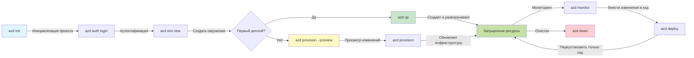
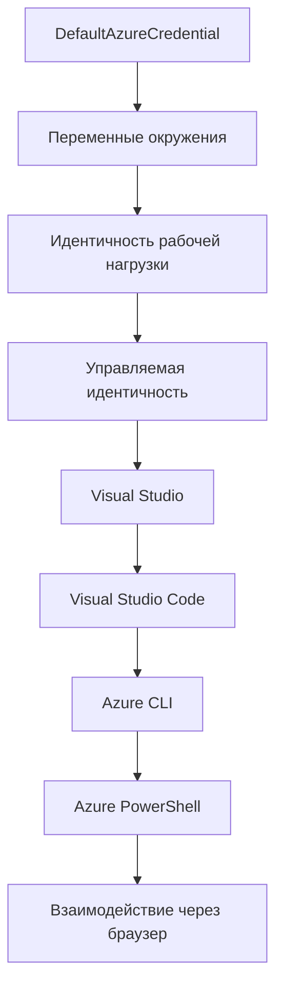

# Основы AZD - понимание Azure Developer CLI

# Основы AZD - основные концепции и фундаментальные сведения

**Навигация по главам:**
- **📚 Главная страница курса**: [AZD для начинающих](../../README.md)
- **📖 Текущая глава**: Глава 1 - Основы и быстрый старт
- **⬅️ Предыдущая**: [Обзор курса](../../README.md#-chapter-1-foundation--quick-start)
- **➡️ Следующая**: [Установка и настройка](installation.md)
- **🚀 Следующая глава**: [Глава 2: Разработка с упором на ИИ](../chapter-02-ai-development/microsoft-foundry-integration.md)

## Введение

Этот урок познакомит вас с Azure Developer CLI (azd) — мощным инструментом командной строки, который ускоряет ваш путь от локальной разработки до развертывания в Azure. Вы изучите основные концепции, ключевые возможности и поймете, как azd упрощает деплой облачных приложений.

## Цели обучения

К концу этого урока вы:
- Поймёте, что такое Azure Developer CLI и его основное назначение
- Изучите базовые концепции шаблонов, окружений и сервисов
- Ознакомитесь с ключевыми функциями, включая разработку на основе шаблонов и подход Infrastructure as Code
- Поймёте структуру проекта azd и рабочий процесс
- Будете готовы установить и настроить azd для своей среды разработки

## Результаты обучения

После завершения этого урока вы сможете:
- Объяснить роль azd в современных облачных процессах разработки
- Определить компоненты структуры проекта azd
- Описать, как шаблоны, окружения и сервисы работают вместе
- Понять преимущества Infrastructure as Code с azd
- Узнать различные команды azd и их предназначение

## Что такое Azure Developer CLI (azd)?

Azure Developer CLI (azd) — это инструмент командной строки, созданный для ускорения вашего пути от локальной разработки до деплоя в Azure. Он упрощает процесс создания, развертывания и управления облачными приложениями на Azure.

### Что можно развернуть с помощью azd?

azd поддерживает широкий спектр рабочих нагрузок, и список постоянно расширяется. Сегодня с помощью azd можно развернуть:

| Тип нагрузки | Примеры | Одинаковый рабочий процесс? |
|--------------|---------|----------------------------|
| **Традиционные приложения** | Веб-приложения, REST API, статические сайты | ✅ `azd up` |
| **Сервисы и микросервисы** | Container Apps, Function Apps, много-сервисные бэкенды | ✅ `azd up` |
| **Приложения с использованием ИИ** | Чат-приложения с моделями Microsoft Foundry, решения RAG с AI Search | ✅ `azd up` |
| **Интеллектуальные агенты** | Агенты на Foundry, оркестрации с несколькими агентами | ✅ `azd up` |

Главный вывод в том, что **жизненный цикл azd остается одинаковым независимо от того, что именно вы разворачиваете**. Вы инициализируете проект, создаёте инфраструктуру, развертываете код, мониторите приложение и очищаете ресурсы — будь то простой веб-сайт или сложный ИИ-агент.

Это сделано специально. azd рассматривает ИИ-возможности как ещё один вид сервиса, который может использовать ваше приложение, а не как принципиально нечто иное. Эндпоинт чата, базирующийся на моделях Microsoft Foundry, с точки зрения azd — это просто ещё один сервис для настройки и развертывания.

### 🎯 Почему стоит использовать AZD? Реальное сравнение

Сравним развертывание простого веб-приложения с базой данных:

#### ❌ БЕЗ AZD: Ручное развертывание в Azure (более 30 минут)

```bash
# Шаг 1: Создать группу ресурсов
az group create --name myapp-rg --location eastus

# Шаг 2: Создать план обслуживания приложений
az appservice plan create --name myapp-plan \
  --resource-group myapp-rg \
  --sku B1 --is-linux

# Шаг 3: Создать веб-приложение
az webapp create --name myapp-web-unique123 \
  --resource-group myapp-rg \
  --plan myapp-plan \
  --runtime "NODE:18-lts"

# Шаг 4: Создать аккаунт Cosmos DB (10-15 минут)
az cosmosdb create --name myapp-cosmos-unique123 \
  --resource-group myapp-rg \
  --kind MongoDB

# Шаг 5: Создать базу данных
az cosmosdb mongodb database create \
  --account-name myapp-cosmos-unique123 \
  --resource-group myapp-rg \
  --name tododb

# Шаг 6: Создать коллекцию
az cosmosdb mongodb collection create \
  --account-name myapp-cosmos-unique123 \
  --resource-group myapp-rg \
  --database-name tododb \
  --name todos

# Шаг 7: Получить строку подключения
CONN_STR=$(az cosmosdb keys list \
  --name myapp-cosmos-unique123 \
  --resource-group myapp-rg \
  --type connection-strings \
  --query "connectionStrings[0].connectionString" -o tsv)

# Шаг 8: Настроить параметры приложения
az webapp config appsettings set \
  --name myapp-web-unique123 \
  --resource-group myapp-rg \
  --settings MONGODB_URI="$CONN_STR"

# Шаг 9: Включить ведение журнала
az webapp log config --name myapp-web-unique123 \
  --resource-group myapp-rg \
  --application-logging filesystem \
  --detailed-error-messages true

# Шаг 10: Настроить Application Insights
az monitor app-insights component create \
  --app myapp-insights \
  --location eastus \
  --resource-group myapp-rg

# Шаг 11: Связать App Insights с веб-приложением
INSTRUMENTATION_KEY=$(az monitor app-insights component show \
  --app myapp-insights \
  --resource-group myapp-rg \
  --query "instrumentationKey" -o tsv)

az webapp config appsettings set \
  --name myapp-web-unique123 \
  --resource-group myapp-rg \
  --settings APPINSIGHTS_INSTRUMENTATIONKEY="$INSTRUMENTATION_KEY"

# Шаг 12: Сборка приложения локально
npm install
npm run build

# Шаг 13: Создать пакет развертывания
zip -r app.zip . -x "*.git*" "node_modules/*"

# Шаг 14: Развернуть приложение
az webapp deployment source config-zip \
  --resource-group myapp-rg \
  --name myapp-web-unique123 \
  --src app.zip

# Шаг 15: Подождать и молиться, чтобы всё заработало 🙏
# (Автоматическая проверка не предусмотрена, требуется ручное тестирование)
```
  
**Проблемы:**  
- ❌ Более 15 команд, которые нужно запомнить и выполнить в правильном порядке  
- ❌ 30-45 минут ручной работы  
- ❌ Легко допустить ошибки (опечатки, неверные параметры)  
- ❌ Строки подключения видны в истории терминала  
- ❌ Нет автоматического отката при сбое  
- ❌ Сложно повторить для членов команды  
- ❌ Каждый раз по-другому (нерепродуцируемо)  

#### ✅ С AZD: Автоматизированное развертывание (5 команд, 10-15 минут)

```bash
# Шаг 1: Инициализация из шаблона
azd init --template todo-nodejs-mongo

# Шаг 2: Аутентификация
azd auth login

# Шаг 3: Создание окружения
azd env new dev

# Шаг 4: Предварительный просмотр изменений (необязательно, но рекомендуется)
azd provision --preview

# Шаг 5: Развертывание всего
azd up

# ✨ Готово! Всё развернуто, настроено и мониторится
```
  
**Преимущества:**  
- ✅ **5 команд** вместо 15+ ручных шагов  
- ✅ **10-15 минут** общего времени (в основном ожидание Azure)  
- ✅ **Отсутствие ошибок** — автоматизировано и проверено  
- ✅ **Секреты надежно защищены** с помощью Key Vault  
- ✅ **Автоматический откат** при сбоях  
- ✅ **Полная повторяемость** — одинаковый результат каждый раз  
- ✅ **Готово для команды** — любой может развернуть с одинаковыми командами  
- ✅ **Infrastructure as Code** — версии Bicep-шаблонов под контролем  
- ✅ **Встроенный мониторинг** — Application Insights настроен автоматически  

### 📊 Сокращение времени и ошибок

| Метрика | Ручное развертывание | Развертывание с AZD | Улучшение |
|:--------|:---------------------|:--------------------|:----------|
| **Команд** | 15+ | 5 | на 67% меньше |
| **Время** | 30-45 мин | 10-15 мин | на 60% быстрее |
| **Количество ошибок** | ~40% | <5% | снижение на 88% |
| **Согласованность** | Низкая (ручная) | 100% (автоматизировано) | Идеально |
| **Время обучения команды** | 2-4 часа | 30 минут | в 4 раза быстрее |
| **Время отката** | 30+ мин (ручное) | 2 мин (автоматизировано) | на 93% быстрее |

## Основные концепции

### Шаблоны
Шаблоны — это основа azd. Они содержат:  
- **Код приложения** — ваш исходный код и зависимости  
- **Определения инфраструктуры** — ресурсы Azure, определённые с помощью Bicep или Terraform  
- **Конфигурационные файлы** — настройки и переменные окружения  
- **Скрипты развертывания** — автоматизированные рабочие процессы деплоя  

### Окружения
Окружения представляют разные цели развертывания:  
- **Разработка** — для тестирования и разработки  
- **Тестирование (staging)** — пред-продакшн среда  
- **Продакшн** — живая производственная среда  

Каждое окружение содержит:  
- Группу ресурсов Azure  
- Конфигурационные настройки  
- Состояние развертывания  

### Сервисы
Сервисы — строительные блоки вашего приложения:  
- **Фронтенд** — веб-приложения, одностраничные приложения (SPA)  
- **Бэкенд** — API, микросервисы  
- **База данных** — решения для хранения данных  
- **Хранилище** — файловое и блоб-хранилище  

## Ключевые возможности

### 1. Разработка на основе шаблонов  
```bash
# Просмотр доступных шаблонов
azd template list

# Инициализация из шаблона
azd init --template <template-name>
```
  
### 2. Infrastructure as Code  
- **Bicep** — специализированный язык Azure  
- **Terraform** — инструмент для мультиоблачной инфраструктуры  
- **ARM Templates** — шаблоны Azure Resource Manager  

### 3. Интегрированные рабочие процессы  
```bash
# Полный рабочий процесс развертывания
azd up            # Подготовка и развертывание — это полностью автоматизировано для первичной настройки

# 🧪 НОВОЕ: Просмотр изменений инфраструктуры перед развертыванием (БЕЗОПАСНО)
azd provision --preview    # Симуляция развертывания инфраструктуры без внесения изменений

azd provision     # Создайте ресурсы Azure, если обновляете инфраструктуру, используйте это
azd deploy        # Разверните код приложения или повторно разверните код приложения после обновления
azd down          # Очистка ресурсов
```
  
#### 🛡️ Безопасное планирование инфраструктуры с помощью превью  
Команда `azd provision --preview` — это революция для безопасных развертываний:  
- **Анализ "сухого запуска"** — показывает, что будет создано, изменено или удалено  
- **Нулевой риск** — реальные изменения в Azure не вносятся  
- **Сотрудничество в команде** — делитесь результатами превью перед развертыванием  
- **Оценка стоимости** — понимайте расходы на ресурсы перед обязательствами  

```bash
# Пример предварительного просмотра рабочего процесса
azd provision --preview           # Посмотрите, что изменится
# Просмотрите результат, обсудите с командой
azd provision                     # Вносите изменения уверенно
```
  
### 📊 Визуализация: рабочий процесс разработки AZD


**Объяснение рабочего процесса:**  
1. **Init** — старт с шаблона или нового проекта  
2. **Auth** — аутентификация в Azure  
3. **Environment** — создание изолированного окружения для развертывания  
4. **Preview** — 🆕 всегда сначала просматривайте изменения инфраструктуры (безопасная практика)  
5. **Provision** — создание/обновление ресурсов Azure  
6. **Deploy** — загрузка кода приложения  
7. **Monitor** — наблюдение за работой приложения  
8. **Iterate** — внесение изменений и повторный деплой  
9. **Cleanup** — удаление ресурсов по окончании работы  

### 4. Управление окружениями  
```bash
# Создавать и управлять окружениями
azd env new <environment-name>
azd env select <environment-name>
azd env list
```
  
### 5. Расширения и команды ИИ

azd использует систему расширений для добавления возможностей поверх базового CLI. Это особенно полезно для рабочих нагрузок с ИИ:

```bash
# Список доступных расширений
azd extension list

# Установить расширение агентов Foundry
azd extension install azure.ai.agents

# Инициализировать проект AI агента из манифеста
azd ai agent init -m agent-manifest.yaml

# Запустить сервер MCP для разработки с поддержкой ИИ (Альфа)
azd mcp start
```
  
> Расширения подробно рассматриваются в [Главе 2: Разработка с упором на ИИ](../chapter-02-ai-development/agents.md) и в справочнике [AZD AI CLI команды](../chapter-08-production/production-ai-practices.md#azd-ai-cli-commands-and-extensions).

## 📁 Структура проекта

Типичная структура проекта azd:  
```
my-app/
├── .azd/                    # azd configuration
│   └── config.json
├── .azure/                  # Azure deployment artifacts
├── .devcontainer/          # Development container config
├── .github/workflows/      # GitHub Actions
├── .vscode/               # VS Code settings
├── infra/                 # Infrastructure code
│   ├── main.bicep        # Main infrastructure template
│   ├── main.parameters.json
│   └── modules/          # Reusable modules
├── src/                  # Application source code
│   ├── api/             # Backend services
│   └── web/             # Frontend application
├── azure.yaml           # azd project configuration
└── README.md
```
  
## 🔧 Конфигурационные файлы

### azure.yaml  
Основной файл конфигурации проекта:  
```yaml
name: my-awesome-app
metadata:
  template: my-template@1.0.0

services:
  web:
    project: ./src/web
    language: js
    host: appservice
  api:
    project: ./src/api
    language: js
    host: appservice

hooks:
  preprovision:
    shell: pwsh
    run: echo "Preparing to provision..."
```
  
### .azure/config.json  
Конфигурация, специфичная для окружения:  
```json
{
  "version": 1,
  "defaultEnvironment": "dev",
  "environments": {
    "dev": {
      "subscriptionId": "your-subscription-id",
      "location": "eastus"
    }
  }
}
```
  
## 🎪 Общие рабочие процессы с практическими упражнениями

> **💡 Совет по обучению:** Выполняйте эти упражнения по порядку, чтобы последовательно развивать навыки работы с AZD.

### 🎯 Упражнение 1: Инициализация первого проекта

**Цель:** Создать проект AZD и изучить его структуру

**Шаги:**  
```bash
# Используйте проверенный шаблон
azd init --template todo-nodejs-mongo

# Изучите сгенерированные файлы
ls -la  # Просмотрите все файлы, включая скрытые

# Созданные ключевые файлы:
# - azure.yaml (основная конфигурация)
# - infra/ (код инфраструктуры)
# - src/ (код приложения)
```
  
**✅ Успешно:** У вас есть директории azure.yaml, infra/ и src/

---

### 🎯 Упражнение 2: Развертывание в Azure

**Цель:** Завершить развертывание от начала до конца

**Шаги:**  
```bash
# 1. Аутентификация
az login && azd auth login

# 2. Создать окружение
azd env new dev
azd env set AZURE_LOCATION eastus

# 3. Предварительный просмотр изменений (РЕКОМЕНДУЕТСЯ)
azd provision --preview

# 4. Развернуть все
azd up

# 5. Проверить развертывание
azd show    # Просмотреть URL вашего приложения
```
  
**Ожидаемое время:** 10-15 минут  
**✅ Успешно:** URL приложения открывается в браузере

---

### 🎯 Упражнение 3: Несколько окружений

**Цель:** Развернуть в dev и staging

**Шаги:**  
```bash
# Уже есть dev, создать staging
azd env new staging
azd env set AZURE_LOCATION westus2
azd up

# Переключаться между ними
azd env list
azd env select dev
```
  
**✅ Успешно:** Два отдельных группы ресурсов в портале Azure

---

### 🛡️ Полный сброс: `azd down --force --purge`

Когда нужно полностью сбросить всё:

```bash
azd down --force --purge
```
  
**Что делает:**  
- `--force`: без запросов подтверждения  
- `--purge`: удаляет всё локальное состояние и ресурсы Azure  

**Используйте, когда:**  
- Деплой не удался по середине  
- Переключаетесь между проектами  
- Нужно начать с чистого листа  

---

## 🎪 Справка по оригинальному рабочему процессу

### Начало нового проекта  
```bash
# Метод 1: Использовать существующий шаблон
azd init --template todo-nodejs-mongo

# Метод 2: Начать с нуля
azd init

# Метод 3: Использовать текущую директорию
azd init .
```
  
### Цикл разработки  
```bash
# Настроить среду разработки
azd auth login
azd env new dev
azd env select dev

# Развернуть всё
azd up

# Внести изменения и развернуть заново
azd deploy

# Очистить после завершения
azd down --force --purge # команда в Azure Developer CLI — это **жёсткий сброс** для вашей среды — особенно полезно при устранении неполадок после неудачных развертываний, очистке недоиспользуемых ресурсов или подготовке к повторному развертыванию.
```
  
## Понимание `azd down --force --purge`
Команда `azd down --force --purge` — это мощный способ полностью снести ваше окружение azd и все связанные ресурсы. Вот что делают каждое из флагов:  
```
--force
```
  
- Пропускает запросы на подтверждение.  
- Полезно для автоматизации и сценариев, где нельзя вводить данные вручную.  
- Обеспечивает беспрерывное выполнение очистки, даже если CLI обнаруживает несоответствия.  

```
--purge
```
  
Удаляет **всю связанную метаинформацию**, включая:  
Состояние окружения  
Локальную папку `.azure`  
Кэшированную информацию о развертывании  
Предотвращает, чтобы azd "помнил" предыдущие развертывания, что может вызывать проблемы, например, несоответствие групп ресурсов или устаревшие ссылки на реестры.  

### Зачем использовать оба флага?  
Когда при `azd up` возникают проблемы из-за оставшегося состояния или частичных развертываний, эта комбинация гарантирует **чистый старт**.

Это особенно помогает после ручного удаления ресурсов в портале Azure или при смене шаблонов, окружений или соглашений об именовании групп ресурсов.

### Управление несколькими окружениями  
```bash
# Создать тестовую среду
azd env new staging
azd env select staging
azd up

# Переключиться обратно на dev
azd env select dev

# Сравнить среды
azd env list
```
  
## 🔐 Аутентификация и учетные данные

Понимание аутентификации критично для успешных развертываний azd. Azure использует различные методы аутентификации, а azd применяет ту же цепочку учетных данных, что и другие Azure-инструменты.

### Аутентификация через Azure CLI (`az login`)

Перед использованием azd необходимо аутентифицироваться в Azure. Самый распространенный способ — через Azure CLI:

```bash
# Интерактивный вход (открывает браузер)
az login

# Вход с указанием конкретного клиента
az login --tenant <tenant-id>

# Вход с использованием служебного принципала
az login --service-principal -u <app-id> -p <password> --tenant <tenant-id>

# Проверить текущий статус входа
az account show

# Показать доступные подписки
az account list --output table

# Установить подписку по умолчанию
az account set --subscription <subscription-id>
```
  
### Процесс аутентификации  
1. **Интерактивный вход**: открывается браузер для авторизации  
2. **Поток по коду устройства**: для систем без браузера  
3. **Сервисный принципал**: для автоматизации и CI/CD  
4. **Управляемая идентичность**: для приложений в Azure  

### Цепочка DefaultAzureCredential

`DefaultAzureCredential` — тип учетных данных, который упрощает аутентификацию, автоматически пробуя разные источники в определённом порядке:

#### Порядок проверки учетных данных  

#### 1. Переменные окружения  
```bash
# Установить переменные окружения для главного пользователя службы
export AZURE_CLIENT_ID="<app-id>"
export AZURE_CLIENT_SECRET="<password>"
export AZURE_TENANT_ID="<tenant-id>"
```
  
#### 2. Идентичность рабочей нагрузки (Kubernetes/GitHub Actions)  
Автоматически используется в:  
- Azure Kubernetes Service (AKS) с Workload Identity  
- GitHub Actions с OIDC федерацией  
- Других федеративных сценариях  

#### 3. Управляемая идентичность  
Для ресурсов Azure, как:  
- Виртуальные машины  
- App Service  
- Azure Functions  
- Container Instances  

```bash
# Проверьте, выполняется ли на ресурсе Azure с управляемой идентификацией
az account show --query "user.type" --output tsv
# Возвращает: "servicePrincipal", если используется управляемая идентификация
```
  
#### 4. Интеграция с инструментами разработчика  
- **Visual Studio**: автоматически использует вошедший аккаунт  
- **VS Code**: применяет учетные данные расширения Azure Account  
- **Azure CLI**: применяет учетные данные из `az login` (наиболее распространенный для локальной разработки)  

### Настройка аутентификации AZD

```bash
# Метод 1: Использовать Azure CLI (Рекомендуется для разработки)
az login
azd auth login  # Использует существующие учетные данные Azure CLI

# Метод 2: Прямая аутентификация azd
azd auth login --use-device-code  # Для безголовых сред

# Метод 3: Проверить статус аутентификации
azd auth login --check-status

# Метод 4: Выйти и пройти аутентификацию снова
azd auth logout
azd auth login
```
  
### Лучшие практики аутентификации

#### Для локальной разработки  
```bash
# 1. Войдите с помощью Azure CLI
az login

# 2. Проверьте правильность подписки
az account show
az account set --subscription "Your Subscription Name"

# 3. Используйте azd с существующими учетными данными
azd auth login
```
  
#### Для CI/CD пайплайнов  
```yaml
# GitHub Actions example
- name: Azure Login
  uses: azure/login@v1
  with:
    creds: ${{ secrets.AZURE_CREDENTIALS }}

- name: Deploy with azd
  run: |
    azd auth login --client-id ${{ secrets.AZURE_CLIENT_ID }} \
                    --client-secret ${{ secrets.AZURE_CLIENT_SECRET }} \
                    --tenant-id ${{ secrets.AZURE_TENANT_ID }}
    azd up --no-prompt
```
  
#### Для продакшн-окружений  
- Используйте **Managed Identity** при запуске на ресурсах Azure  
- Используйте **Service Principal** для сценариев автоматизации  
- Избегайте хранения учетных данных в коде или конфигурационных файлах  
- Используйте **Azure Key Vault** для чувствительной конфигурации  

### Частые проблемы с аутентификацией и решения

#### Проблема: "No subscription found"  
```bash
# Решение: Установить подписку по умолчанию
az account list --output table
az account set --subscription "<subscription-id>"
azd env set AZURE_SUBSCRIPTION_ID "<subscription-id>"
```
  
#### Проблема: "Insufficient permissions"  
```bash
# Решение: Проверить и назначить необходимые роли
az role assignment list --assignee $(az account show --query user.name --output tsv)

# Общие необходимые роли:
# - Участник (для управления ресурсами)
# - Администратор доступа пользователей (для назначения ролей)
```
  
#### Проблема: "Token expired"  
```bash
# Решение: Пройдите повторную аутентификацию
az logout
az login
azd auth logout
azd auth login
```
  
### Аутентификация в разных сценариях

#### Локальная разработка  
```bash
# Личный счет развития
az login
azd auth login
```
  
#### Командная разработка  
```bash
# Используйте конкретного арендатора для организации
az login --tenant contoso.onmicrosoft.com
azd auth login
```
  
#### Мультиарендаторные сценарии  
```bash
# Переключиться между арендаторами
az login --tenant tenant1.onmicrosoft.com
# Развернуть на арендаторе 1
azd up

az login --tenant tenant2.onmicrosoft.com  
# Развернуть на арендаторе 2
azd up
```
  
### Вопросы безопасности
1. **Хранение учетных данных**: Никогда не храните учетные данные в исходном коде  
2. **Ограничение области действия**: Используйте принцип наименьших привилегий для сервисных принципалов  
3. **Ротация токенов**: Регулярно обновляйте секреты сервисных принципалов  
4. **Аудит**: Отслеживайте действия по аутентификации и развертыванию  
5. **Сетевая безопасность**: Используйте приватные конечные точки, когда это возможно  

### Устранение неисправностей аутентификации

```bash
# Отладка проблем с аутентификацией
azd auth login --check-status
az account show
az account get-access-token

# Общие диагностические команды
whoami                          # Текущий контекст пользователя
az ad signed-in-user show      # Детали пользователя Azure AD
az group list                  # Тест доступа к ресурсу
```
  
## Понимание `azd down --force --purge`  

### Обнаружение  
```bash
azd template list              # Просмотр шаблонов
azd template show <template>   # Детали шаблона
azd init --help               # Параметры инициализации
```
  
### Управление проектом  
```bash
azd show                     # Обзор проекта
azd env show                 # Текущая среда
azd config list             # Настройки конфигурации
```
  
### Мониторинг  
```bash
azd monitor                  # Открыть мониторинг портала Azure
azd monitor --logs           # Просмотреть журналы приложений
azd monitor --live           # Просмотреть метрики в реальном времени
azd pipeline config          # Настроить CI/CD
```
  
## Лучшие практики  

### 1. Используйте смысловые имена  
```bash
# Хорошо
azd env new production-east
azd init --template web-app-secure

# Избегайте
azd env new env1
azd init --template template1
```
  
### 2. Используйте шаблоны  
- Начинайте с существующих шаблонов  
- Настраивайте под свои нужды  
- Создавайте повторно используемые шаблоны для своей организации  

### 3. Изоляция окружений  
- Используйте отдельные окружения для разработки/тестирования/продакшн  
- Никогда не развертывайте прямо в продакшн с локальной машины  
- Используйте CI/CD конвейеры для продакшн-развертываний  

### 4. Управление конфигурацией  
- Используйте переменные окружения для конфиденциальных данных  
- Храните конфигурацию в системе контроля версий  
- Документируйте настройки, специфичные для каждого окружения  

## Прогресс обучения  

### Начинающий (1-2 недели)  
1. Установить azd и пройти аутентификацию  
2. Развернуть простой шаблон  
3. Понять структуру проекта  
4. Изучить базовые команды (up, down, deploy)  

### Средний уровень (3-4 недели)  
1. Кастомизировать шаблоны  
2. Управлять несколькими окружениями  
3. Понимать код инфраструктуры  
4. Настроить CI/CD конвейеры  

### Продвинутый уровень (5+ недель)  
1. Создавать собственные шаблоны  
2. Изучать продвинутые паттерны инфраструктуры  
3. Развертывать в нескольких регионах  
4. Использовать конфигурации корпоративного уровня  

## Следующие шаги  

**📖 Продолжить изучение главы 1:**  
- [Установка и настройка](installation.md) - Установить и сконфигурировать azd  
- [Ваш первый проект](first-project.md) - Практическое руководство  
- [Руководство по конфигурации](configuration.md) - Расширенные параметры настройки  

**🎯 Готовы к следующей главе?**  
- [Глава 2: Разработка с приоритетом AI](../chapter-02-ai-development/microsoft-foundry-integration.md) - Начать создавать AI-приложения  

## Дополнительные ресурсы  

- [Обзор Azure Developer CLI](https://learn.microsoft.com/en-us/azure/developer/azure-developer-cli/)  
- [Галерея шаблонов](https://azure.github.io/awesome-azd/)  
- [Образцы от сообщества](https://github.com/Azure-Samples)  

---

## 🙋 Часто задаваемые вопросы  

### Общие вопросы  

**В: В чем разница между AZD и Azure CLI?**  

О: Azure CLI (`az`) используется для управления отдельными ресурсами Azure. AZD (`azd`) управляет целыми приложениями:  

```bash
# Azure CLI - низкоуровневое управление ресурсами
az webapp create --name myapp --resource-group rg
az sql server create --name myserver --resource-group rg
# ...требуется гораздо больше команд

# AZD - управление на уровне приложения
azd up  # Разворачивает все приложение со всеми ресурсами
```
  
**Думайте так:**  
- `az` = Работа с отдельными кубиками Lego  
- `azd` = Работа с готовыми наборами Lego  

---

**В: Нужно ли знать Bicep или Terraform для использования AZD?**  

О: Нет! Начинайте с шаблонов:  
```bash
# Используйте существующий шаблон - знание IaC не требуется
azd init --template todo-nodejs-mongo
azd up
```
  
Вы можете изучить Bicep позже для настройки инфраструктуры. Шаблоны обеспечивают рабочие примеры для обучения.  

---

**В: Сколько стоит запуск шаблонов AZD?**  

О: Стоимость зависит от шаблона. Большинство шаблонов для разработки стоят $50-150 в месяц:  

```bash
# Просмотр затрат перед развертыванием
azd provision --preview

# Всегда очищайте, когда не используете
azd down --force --purge  # Удаляет все ресурсы
```
  
**Полезный совет:** Используйте бесплатные уровни, если они доступны:  
- App Service: F1 (бесплатный) уровень  
- Microsoft Foundry Models: Azure OpenAI 50 000 токенов в месяц бесплатно  
- Cosmos DB: бесплатный уровень 1000 RU/s  

---

**В: Могу ли я использовать AZD с существующими ресурсами Azure?**  

О: Да, но проще начать с нуля. AZD лучше всего работает, когда управляет полным жизненным циклом. Для существующих ресурсов:  

```bash
# Вариант 1: Импорт существующих ресурсов (расширенный)
azd init
# Затем измените infra/, чтобы ссылаться на существующие ресурсы

# Вариант 2: Начать с нуля (рекомендуется)
azd init --template matching-your-stack
azd up  # Создаёт новую среду
```
  
---

**В: Как поделиться проектом с коллегами?**  

О: Зафиксируйте проект AZD в Git (НО не папку .azure):  

```bash
# Уже по умолчанию в .gitignore
.azure/        # Содержит секреты и данные окружения
*.env          # Переменные окружения

# Участники команды тогда:
git clone <your-repo>
azd auth login
azd env new <their-name>-dev
azd up
```
  
Все получат одинаковую инфраструктуру из тех же шаблонов.  

---

### Вопросы по устранению неисправностей  

**В: "azd up" прервался на полпути. Что делать?**  

О: Проверьте ошибку, исправьте и повторите попытку:  

```bash
# Просмотреть подробные журналы
azd show

# Общие исправления:

# 1. Если превышена квота:
azd env set AZURE_LOCATION "westus2"  # Попробуйте другой регион

# 2. Если конфликт имени ресурса:
azd down --force --purge  # Начать с чистого листа
azd up  # Повторить попытку

# 3. Если срок действия аутентификации истек:
az login
azd auth login
azd up
```
  
**Самая распространенная проблема:** Выбрана неправильная подписка Azure  
```bash
az account list --output table
az account set --subscription "<correct-subscription>"
```
  
---

**В: Как развернуть только изменения кода без повторного создания инфраструктуры?**  

О: Используйте `azd deploy` вместо `azd up`:  

```bash
azd up          # Первый запуск: подготовка + развертывание (медленно)

# Внесите изменения в код...

azd deploy      # Последующие запуски: только развертывание (быстро)
```
  
Сравнение скорости:  
- `azd up`: 10-15 минут (создает инфраструктуру)  
- `azd deploy`: 2-5 минут (только код)  

---

**В: Могу ли я настраивать шаблоны инфраструктуры?**  

О: Да! Редактируйте файлы Bicep в `infra/`:  

```bash
# После azd init
cd infra/
code main.bicep  # Редактировать в VS Code

# Предварительный просмотр изменений
azd provision --preview

# Применить изменения
azd provision
```
  
**Совет:** Начните с малого — сначала измените SKU:  
```bicep
// infra/main.bicep
sku: {
  name: 'B1'  // Change to 'P1V2' for production
}
```
  
---

**В: Как удалить всё, что создал AZD?**  

О: Одна команда удаляет все ресурсы:  

```bash
azd down --force --purge

# Это удаляет:
# - Все ресурсы Azure
# - Группу ресурсов
# - Локальное состояние окружения
# - Кэшированные данные развертывания
```
  
**Всегда запускайте ее, когда:**  
- Закончили тестирование шаблона  
- Переходите к другому проекту  
- Хотите начать с чистого листа  

**Экономия:** Удаление неиспользуемых ресурсов = $0 расходов  

---

**В: Что делать, если я случайно удалил ресурсы через Azure Portal?**  

О: Состояние AZD может рассинхронизироваться. Подход с чистого листа:  

```bash
# 1. Удалить локальное состояние
azd down --force --purge

# 2. Начать с чистого листа
azd up

# Альтернатива: Позволить AZD обнаружить и исправить
azd provision  # Создаст отсутствующие ресурсы
```
  
---

### Продвинутые вопросы  

**В: Можно ли использовать AZD в CI/CD?**  

О: Можно! Пример для GitHub Actions:  

```yaml
# .github/workflows/deploy.yml
name: Deploy with AZD

on:
  push:
    branches: [main]

jobs:
  deploy:
    runs-on: ubuntu-latest
    steps:
      - uses: actions/checkout@v2
      
      - name: Install azd
        run: curl -fsSL https://aka.ms/install-azd.sh | bash
      
      - name: Azure Login
        run: |
          azd auth login \
            --client-id ${{ secrets.AZURE_CLIENT_ID }} \
            --client-secret ${{ secrets.AZURE_CLIENT_SECRET }} \
            --tenant-id ${{ secrets.AZURE_TENANT_ID }}
      
      - name: Deploy
        run: azd up --no-prompt
```
  
---

**В: Как работать с секретами и конфиденциальными данными?**  

О: AZD автоматически интегрируется с Azure Key Vault:  

```bash
# Секреты хранятся в Key Vault, а не в коде
azd env set DATABASE_PASSWORD "$(openssl rand -base64 32)"

# AZD автоматически:
# 1. Создает Key Vault
# 2. Сохраняет секрет
# 3. Предоставляет приложению доступ через управляемую идентичность
# 4. Внедряет во время выполнения
```
  
**Никогда не коммитьте:**  
- папку `.azure/` (содержит данные окружения)  
- `.env` файлы (локальные секреты)  
- строки подключения  

---

**В: Можно ли развернуть приложение в нескольких регионах?**  

О: Да, создайте окружение для каждого региона:  

```bash
# Среда Восток США
azd env new prod-eastus
azd env set AZURE_LOCATION eastus
azd up

# Среда Западная Европа
azd env new prod-westeurope
azd env set AZURE_LOCATION westeurope
azd up

# Каждая среда является независимой
azd env list
```
  
Для настоящих мульти-региональных приложений настройте шаблоны Bicep для одновременного развертывания в нескольких регионах.  

---

**В: Где я могу получить помощь, если застрял?**  

1. **Документация AZD:** https://learn.microsoft.com/azure/developer/azure-developer-cli/  
2. **GitHub Issues:** https://github.com/Azure/azure-dev/issues  
3. **Discord:** [Azure Discord](https://discord.gg/microsoft-azure) - канал #azure-developer-cli  
4. **Stack Overflow:** Тег `azure-developer-cli`  
5. **Этот курс:** [Руководство по устранению проблем](../chapter-07-troubleshooting/common-issues.md)  

**Полезный совет:** Перед вопросом запустите:  
```bash
azd show       # Показывает текущее состояние
azd version    # Показывает вашу версию
```
  
Включите эту информацию в ваш вопрос для быстрого получения помощи.  

---

## 🎓 Что дальше?  

Теперь вы понимаете основы AZD. Выберите свой путь:  

### 🎯 Для начинающих:  
1. **Далее:** [Установка и настройка](installation.md) - установить AZD на вашу машину  
2. **Потом:** [Ваш первый проект](first-project.md) - разверните первое приложение  
3. **Практика:** Выполните все 3 упражнения этого урока  

### 🚀 Для AI-разработчиков:  
1. **Перейти к:** [Глава 2: Разработка с приоритетом AI](../chapter-02-ai-development/microsoft-foundry-integration.md)  
2. **Развернуть:** Начните с `azd init --template get-started-with-ai-chat`  
3. **Изучать:** Создавайте во время развертывания  

### 🏗️ Для опытных разработчиков:  
1. **Изучить:** [Руководство по конфигурации](configuration.md) - расширенные настройки  
2. **Изучать:** [Инфраструктура как код](../chapter-04-infrastructure/provisioning.md) - глубокое изучение Bicep  
3. **Строить:** Создавайте собственные шаблоны для вашего стека  

---

**Навигация по главам:**  
- **📚 Домашняя страница курса:** [AZD для начинающих](../../README.md)  
- **📖 Текущая глава:** Глава 1 - Основы и быстрый старт  
- **⬅️ Предыдущая:** [Обзор курса](../../README.md#-chapter-1-foundation--quick-start)  
- **➡️ Следующая:** [Установка и настройка](installation.md)  
- **🚀 Следующая глава:** [Глава 2: Разработка с приоритетом AI](../chapter-02-ai-development/microsoft-foundry-integration.md)

---

<!-- CO-OP TRANSLATOR DISCLAIMER START -->
**Отказ от ответственности**:  
Этот документ был переведен с помощью автоматического сервиса перевода ИИ [Co-op Translator](https://github.com/Azure/co-op-translator). Несмотря на наши усилия обеспечить точность, обратите внимание, что автоматические переводы могут содержать ошибки или неточности. Оригинальный документ на его исходном языке следует считать официальным и авторитетным источником. Для критически важной информации рекомендуется использовать профессиональный перевод, выполненный человеком. Мы не несем ответственности за любые недоразумения или неверные толкования, возникшие в результате использования данного перевода.
<!-- CO-OP TRANSLATOR DISCLAIMER END -->