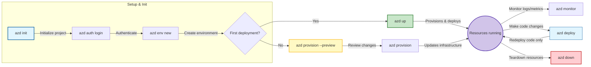
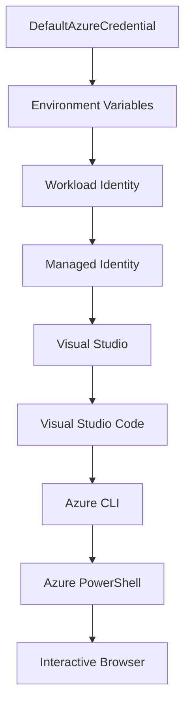

# Основы AZD - Ключевые понятия и основы

**Навигация по главам:**
- **📚 Главная курса**: [AZD для начинающих](../../README.md)
- **📖 Текущая глава**: Глава 1 - Основа и быстрый старт
- **⬅️ Предыдущая**: [Обзор курса](../../README.md#-chapter-1-foundation--quick-start)
- **➡️ Следующая**: [Установка и настройка](installation.md)
- **🚀 Следующая глава**: [Глава 2: Разработка с приоритетом AI](../chapter-02-ai-development/microsoft-foundry-integration.md)

## Введение

> Проверено в соответствии с `azd 1.37.2` (ноябрь 2026). Команды Bash используют кавычки для заполнителей, которые вы должны заменить. Шаблонные рабочие процессы используют `.` для инициализации текущего каталога; без аргумента каталога инициализация шаблона создаёт подкаталог и не меняет рабочий каталог вашей оболочки. Продвинутые сниппеты являются иллюстративными, а не полноценными проектами.

Этот урок познакомит вас с Azure Developer CLI (azd), мощным инструментом командной строки, который ускоряет ваш путь от локальной разработки до развертывания в Azure. Вы изучите основные концепции, ключевые функции и поймете, как azd упрощает развертывание облачных приложений.

## Цели обучения

К концу этого урока вы:
- Поймёте, что такое Azure Developer CLI и его основное назначение
- Изучите основные концепции шаблонов, сред и сервисов
- Исследуете ключевые функции, включая разработку на основе шаблонов и инфраструктуру как код
- Поймёте структуру проекта azd и рабочий процесс
- Будете готовы установить и настроить azd для вашей среды разработки

## Результаты обучения

По завершении урока вы сможете:
- Объяснить роль azd в современных рабочих процессах облачной разработки
- Определить компоненты структуры проекта azd
- Описать взаимосвязь шаблонов, сред и сервисов
- Понять преимущества инфраструктуры как кода с использованием azd
- Узнать различные команды azd и их назначение

## Что такое Azure Developer CLI (azd)?

Azure Developer CLI (azd) — это инструмент командной строки, созданный для ускорения вашего перехода от локальной разработки к развертыванию в Azure. Он упрощает процесс создания, развертывания и управления облачными приложениями на Azure.

### Что можно развернуть с помощью azd?

azd поддерживает широкий спектр нагрузок — и список постоянно расширяется. Сегодня с azd вы можете развернуть:

| Тип нагрузки | Примеры | Одинаковый рабочий процесс? |
|---------------|----------|----------------|
| **Традиционные приложения** | Веб-приложения, REST API, статические сайты | ✅ `azd up` |
| **Сервисы и микросервисы** | Container Apps, Function Apps, много-сервисные бэкенды | ✅ `azd up` |
| **Приложения с AI** | Чат-приложения с Microsoft Foundry Models, RAG решения с AI Search | ✅ `azd up` |
| **Интеллектуальные агенты** | Агенты, размещённые в Foundry, мультиагентные оркестрации | ✅ `azd up` |

Главное понимание в том, что **жизненный цикл azd остается одинаковым независимо от того, что вы разворачиваете**. Вы инициализируете проект, выделяете инфраструктуру, разворачиваете код, мониторите приложение и очищаете ресурсы — будь то простой веб-сайт или сложный AI-агент.

Эта непрерывность заложена конструктивно. azd рассматривает возможности AI как ещё один сервис, который может использовать ваше приложение, а не что-то принципиально другое. Точка доступа чата, поддерживаемая Microsoft Foundry Models, с точки зрения azd — это просто ещё один сервис для настройки и развертывания.

### 🎯 Почему использовать AZD? Сравнение на практике

Рассмотрим развертывание простого веб-приложения с базой данных:

#### ❌ БЕЗ AZD: Ручное развертывание в Azure (более 30 минут)

**Иллюстративное сравнение Bash, не запускаемый начальный код приложения.** Предполагается существующий код приложения, уникальные имена ресурсов, аутентификация Azure CLI и необходимые расширения CLI. Используйте упражнение с шаблоном ниже для поддерживаемого пути от начала до конца.

```bash
# Step 1: Create resource group
az group create --name myapp-rg --location eastus

# Step 2: Create App Service Plan
az appservice plan create --name myapp-plan \
  --resource-group myapp-rg \
  --sku B1 --is-linux

# Step 3: Create Web App
az webapp create --name myapp-web-unique123 \
  --resource-group myapp-rg \
  --plan myapp-plan \
  --runtime "NODE:22-lts"

# Step 4: Create Cosmos DB account (10-15 minutes)
az cosmosdb create --name myapp-cosmos-unique123 \
  --resource-group myapp-rg \
  --kind MongoDB

# Step 5: Create database
az cosmosdb mongodb database create \
  --account-name myapp-cosmos-unique123 \
  --resource-group myapp-rg \
  --name tododb

# Step 6: Create collection
az cosmosdb mongodb collection create \
  --account-name myapp-cosmos-unique123 \
  --resource-group myapp-rg \
  --database-name tododb \
  --name todos

# Step 7: Get connection string
CONN_STR=$(az cosmosdb keys list \
  --name myapp-cosmos-unique123 \
  --resource-group myapp-rg \
  --type connection-strings \
  --query "connectionStrings[0].connectionString" -o tsv)

# Step 8: Configure app settings
az webapp config appsettings set \
  --name myapp-web-unique123 \
  --resource-group myapp-rg \
  --settings MONGODB_URI="$CONN_STR"

# Step 9: Enable logging
az webapp log config --name myapp-web-unique123 \
  --resource-group myapp-rg \
  --application-logging filesystem \
  --detailed-error-messages true

# Step 10: Set up Application Insights
az monitor app-insights component create \
  --app myapp-insights \
  --location eastus \
  --resource-group myapp-rg

# Step 11: Link App Insights to Web App
INSTRUMENTATION_KEY=$(az monitor app-insights component show \
  --app myapp-insights \
  --resource-group myapp-rg \
  --query "instrumentationKey" -o tsv)

az webapp config appsettings set \
  --name myapp-web-unique123 \
  --resource-group myapp-rg \
  --settings APPINSIGHTS_INSTRUMENTATIONKEY="$INSTRUMENTATION_KEY"

# Step 12: Build application locally
npm install
npm run build

# Step 13: Create deployment package
zip -r app.zip . -x "*.git*" "node_modules/*"

# Step 14: Deploy application
az webapp deployment source config-zip \
  --resource-group myapp-rg \
  --name myapp-web-unique123 \
  --src app.zip

# Step 15: Wait and pray it works 🙏
# (No automated validation, manual testing required)
```

**Проблемы:**
- ❌ Более 15 команд, которые нужно помнить и выполнять по порядку
- ❌ 30-45 минут ручной работы
- ❌ Легко ошибиться (опечатки, неправильные параметры)
- ❌ Требуется явная работа с учетными данными; журналы отладки и трассировка оболочки могут их раскрывать
- ❌ Нет автоматического отката при сбоях
- ❌ Сложно воспроизвести для членов команды
- ❌ Каждый раз по-разному (не воспроизводимо)

#### ✅ С AZD: Автоматическое развертывание (5 команд, 10-15 минут)

```bash
# Step 1: Initialize from template
azd init --template todo-nodejs-mongo .

# Step 2: Authenticate
azd auth login

# Step 3: Select the environment created during init
azd env select dev

# Step 4: Preview changes (optional but recommended)
azd provision --preview

# Step 5: Deploy everything
azd up

# ✨ Done! Everything is deployed, configured, and monitored
```

**Преимущества:**
- ✅ **5 команд** вместо 15+ ручных шагов
- ✅ **10-15 минут** общего времени (преимущественно ожидание Azure)
- ✅ **Меньше ручных ошибок** — последовательный рабочий процесс на основе шаблонов
- ✅ **Безопасное управление секретами** — многие шаблоны используют хранилища секретов, управляемые Azure
- ✅ **Повторяемые развертывания** — один и тот же рабочий процесс каждый раз
- ✅ **Повторяемые определения инфраструктуры** — с учетом квот, региональной доступности и версий шаблонов
- ✅ **Готовность для команды** — любой может развернуть с помощью одних и тех же команд
- ✅ **Инфраструктура как код** — контролируемые версии шаблонов Bicep
- ✅ **Мониторинг, определённый шаблоном** — Application Insights, если включён в шаблон

### Время и надежность

Указанное время — ориентировочные данные, не эталонные показатели. azd сокращает количество команд, которые нужно координировать, но не гарантирует длительность развертывания, не устраняет ошибки и не обеспечивает автоматический откат приложения или базы данных. Храните рабочие версии в системе контроля и тестируйте процедуры восстановления.

## Основные понятия

### Шаблоны
Шаблоны — это фундамент azd. Они содержат:
- **Код приложения** — исходный код и зависимости
- **Определения инфраструктуры** — ресурсы Azure, описанные в Bicep или Terraform
- **Файлы конфигурации** — настройки и переменные среды
- **Скрипты развертывания** — автоматизированные рабочие процессы развертывания

### Среды
Среды представляют собой разные цели развертывания:
- **Разработка** — для тестирования и разработки
- **Тестирование (staging)** — предпроизводственная среда
- **Продакшен** — живая производственная среда

Каждая среда поддерживает собственные:
- Название среды и значения; изоляция ресурсов зависит от шаблона инфраструктуры
- Настройки конфигурации
- Состояние развертывания

### Сервисы
Сервисы в `azure.yaml` описывают компоненты приложения, доступные для развертывания:
- **Фронтенд** — веб-приложения, одностраничные приложения (SPA)
- **Бэкенд** — API, микросервисы

Обычно базы данных и хранилища выделяются как ресурсы инфраструктуры, а не придумываются как хосты сервисов вроде `host: postgres`.

## Ключевые функции

### 1. Разработка на основе шаблонов
```bash
# Browse available templates
azd template list

# Initialize from a template
azd init --template "<template-name>" .
```

### 2. Инфраструктура как код
- **Bicep** — язык специального назначения для Azure
- **Terraform** — мультиоблачный инструмент для инфраструктуры
- Bicep компилируется в ARM шаблоны; сырой JSON ARM не является отдельным встроенным `infra.provider`.

### 3. Интегрированные рабочие процессы
```bash
# Complete deployment workflow
azd up            # Provision + Deploy this is hands off for first time setup

# 🧪 NEW: Preview infrastructure changes before deployment (SAFE)
azd provision --preview    # Simulate infrastructure deployment without making changes

azd provision     # Create Azure resources if you update the infrastructure use this
azd deploy        # Deploy application code or redeploy application code once update
azd down          # Clean up resources
```

#### 🛡️ Безопасное планирование инфраструктуры с помощью предварительного просмотра
Команда `azd provision --preview` кардинально меняет безопасность развертываний:
- **Анализ без применения** — показывает, что будет создано, изменено или удалено
- **Без применения изменений** — проверяет изменения провайдера; сначала проверьте хуки проекта, так как они могут выполнять команды с побочными эффектами
- **Совместная работа команды** — делитесь результатами предварительного просмотра перед развертыванием
- **Ввод для планирования стоимости** — изучите предлагаемые SKU, затем рассчитайте цены с помощью Azure Pricing Calculator; предварительный просмотр не вычисляет цены

```bash
# Example preview workflow
azd provision --preview           # See what will change
# Review the output, discuss with team
azd provision                     # Apply changes with confidence
```

### 📊 Визуализация: Рабочий процесс разработки AZD


```mermaid
graph LR
    %% Initialization Phase
    subgraph Setup & Init
        A[azd init] -->|Initialize project| B[azd auth login]
        B -->|Authenticate| C[azd env new]
        C -->|Create environment| D{First deployment?}
    end

    %% Deployment Phase
    D -->|Yes| E[azd up]
    D -->|No| F[azd provision --preview]
    
    F -->|Review changes| G[azd provision]
    
    %% Operational Phase
    E -->|Provisions & deploys| H((Resources running))
    G -->|Updates infrastructure| H
    
    H -->|Monitor logs/metrics| I[azd monitor]
    
    %% Daily Dev Loop
    J[azd deploy] -->|Redeploy code only| H
    H -->|Make code changes| J
    
    %% Cleanup
    H -->|Teardown resources| K[azd down]

    %% Styling
    style A fill:#e1f5fe,stroke:#01579b,stroke-width:2px
    style E fill:#c8e6c9,stroke:#2e7d32,stroke-width:2px
    style F fill:#fff9c4,stroke:#fbc02d,stroke-width:2px
    style H fill:#d1c4e9,stroke:#512da8,stroke-width:2px
    style J fill:#e1f5fe,stroke:#01579b,stroke-width:1px
    style K fill:#ffcdd2,stroke:#c62828,stroke-width:2px
```

**Объяснение рабочего процесса:**
1. **Init** — начать с шаблона или нового проекта
2. **Auth** — аутентификация в Azure
3. **Environment** — создание изолированной среды развертывания
4. **Preview** — 🆕 всегда сначала предварительно просматривайте изменения инфраструктуры (безопасная практика)
5. **Provision** — создание или обновление ресурсов Azure
6. **Deploy** — загрузка кода приложения
7. **Monitor** — мониторинг производительности приложения
8. **Iterate** — внесение изменений и повторное развертывание кода
9. **Cleanup** — удаление ресурсов после завершения работы

### 4. Управление средами
```bash
# Create and manage environments
azd env new "<environment-name>"
azd env select "<environment-name>"
azd env list
```

### 5. Расширения и команды AI

azd использует систему расширений для добавления возможностей, выходящих за рамки основной CLI. Это особенно полезно для нагрузки на базе AI:

```bash
# List available extensions
azd extension list

# Install the Foundry agents extension
azd extension install azure.ai.agents

# Initialize an AI agent project interactively
azd ai agent init

# Test a deployed agent (shows latency and time-to-first-byte)
azd ai agent invoke

# Start the MCP server for AI-assisted development (Alpha)
azd mcp start
```

**Жизненный цикл агента от начала до конца.** Используйте `azure.ai.agents` для операций жизненного цикла агента и установите `azure.ai.evaluations` отдельно для оценки. Для комбинированного рабочего процесса используйте `azd >= 1.37.0`. Вам не нужны все эти команды с первого дня:

| Этап | Команда | Что делает |
|-------|---------|--------------|
| **Создание скелета** | `azd ai agent init --template <path-to-azure.yaml>` | Применение текущего шаблона проекта агента |
| **Тестирование** | `azd ai agent invoke` | Вызов агента и просмотр временных ответов |
| **Измерение** | `azd ai eval init`, `generate`, `run start` | Настройка, развертывание и запуск оценок с использованием отдельного расширения |
| **Улучшение** | `azd ai agent optimize --eval <evaluation-name> --optimize-model <optimizer-deployment>` | Повторное использование совместимых оценок для оптимизации агента |
| **Инспекция** | `azd ai agent endpoint show` | Просмотр конфигурации живой конечной точки |
| **Очистка** | `azd ai agent delete` | Удаление размещённого агента и всех его версий |

> Расширения подробно рассматриваются в [Глава 2: Разработка с приоритетом AI](../chapter-02-ai-development/agents.md) и в справке по [Командам AZD AI CLI](../chapter-08-production/production-ai-practices.md#azd-ai-cli-commands-and-extensions).

## 📁 Структура проекта

Типичная структура проекта azd:
```
my-app/
├── .azure/                  # Local environments and selected-environment config
│   ├── config.json
│   └── dev/.env
├── .devcontainer/          # Development container config
├── .github/workflows/      # GitHub Actions
├── .vscode/               # VS Code settings
├── infra/                 # Infrastructure code
│   ├── main.bicep        # Main infrastructure template
│   ├── main.parameters.json
│   └── modules/          # Reusable modules
├── src/                  # Application source code
│   ├── api/             # Backend services
│   └── web/             # Frontend application
├── azure.yaml           # azd project configuration
└── README.md
```

## 🔧 Конфигурационные файлы

### azure.yaml
Основной конфигурационный файл проекта:
```yaml
name: my-awesome-app
metadata:
  template: my-template@1.0.0

services:
  web:
    project: ./src/web
    language: js
    host: appservice
  api:
    project: ./src/api
    language: js
    host: appservice

hooks:
  preprovision:
    shell: pwsh
    run: echo "Preparing to provision..."
```

### .azure/config.json
Локальный выбор дефолтной среды проекта (иллюстративно; управляется azd):
```json
{
  "defaultEnvironment": "dev"
}
```

## 🎪 Часто используемые рабочие процессы с практическими упражнениями

> **💡 Совет для обучения:** Выполняйте эти упражнения по порядку, чтобы постепенно развивать навыки работы с AZD.

### 🎯 Упражнение 1: Инициализация вашего первого проекта

**Цель:** Создать проект AZD и изучить его структуру

**Шаги:**
```bash
# Use a proven template
mkdir azd-basics-practice
cd azd-basics-practice
# Choose "dev" for the environment name when prompted
azd init --template todo-nodejs-mongo .

# Explore the generated files
ls -la  # View all files including hidden ones

# Key files created:
# - azure.yaml (main config)
# - infra/ (infrastructure code)
# - src/ (application code)
```

**✅ Успех:** У вас есть каталоги azure.yaml, infra/ и src/

---

### 🎯 Упражнение 2: Развертывание в Azure

**Цель:** Завершить развертывание от начала до конца

**Шаги:**
```bash
# 1. Authenticate
azd auth login

# 2. Select the dev environment created in Exercise 1
azd env select dev
azd env set AZURE_LOCATION eastus

# 3. Preview changes (RECOMMENDED)
azd provision --preview

# 4. Deploy everything
azd up

# 5. Verify deployment
azd show    # View your app URL
```

**Ожидаемое время:** 10-15 минут  
**✅ Успех:** URL приложения открывается в браузере

---

### 🎯 Упражнение 3: Несколько сред

**Цель:** Развернуть в dev и staging

**Шаги:**
```bash
# Already have dev, create staging
azd env new staging
azd env set AZURE_LOCATION westus2
azd up

# Switch between them
azd env list
azd env select dev
```

**✅ Успех:** Две отдельные группы ресурсов в Azure Portal

**Очистка:** Упражнение 3 создаёт второе платное развертывание. Удалите оба по окончании:

```bash
azd down --environment dev
azd down --environment staging
```

---

### 🛡️ Разрушительная очистка: `azd down --force --purge`

Если вы намеренно хотите удалить ресурсы Azure выбранной среды:

```bash
azd down --force --purge
```

**Что делает:**
- `--force`: Без подтверждения пользователя
- `--purge`: Также окончательно удаляет поддерживаемые мягко удалённые ресурсы (например, Key Vaults), если разрешена защита очистки. Не удаляет локальный каталог `.azure/`.

**Используйте, когда:** закончили с временной средой. Не рассматривайте разрушительную очистку как первое средство для решения проблем с аутентификацией, квотами или конфигурацией.

---

## 🎪 Оригинальная справка по рабочему процессу

### Начало нового проекта
```bash
# Method 1: Use existing template
azd init --template todo-nodejs-mongo .

# Method 2: Start from scratch
azd init

# Method 3: Use current directory
azd init .
```

### Цикл разработки
```bash
# Set up development environment
azd auth login
azd env new dev
azd env select dev

# Deploy everything
azd up

# Make changes and redeploy
azd deploy

# Clean up when done
azd down --force --purge # Deletes this environment's discovered Azure resources; review before forcing deletion.
```

## Понимание `azd down --force --purge`
Команда `azd down --force --purge` — мощный способ полностью разрушить вашу среду azd и все связанные с ней ресурсы. Вот пояснение к каждому параметру:
```
--force
```
- Пропускает запросы подтверждения.
- Полезно для автоматизации или скриптов, где ручной ввод невозможен.
- Не обходится правами, защитой очистки или ошибками удаления.

```
--purge
```
Навсегда удаляет поддерживаемые ресурсы Azure с мягким удалением без дополнительного подтверждения. Защита от очистки и разрешения по-прежнему применяются. Это **не** удаляет локальные среды или папку `.azure/`.


### Почему использовать оба?
Используйте оба варианта только если вы намерены удалить ресурсы Azure выбранной среды и очистить восстанавливаемые ресурсы. Это разрушительная очистка, а не общее восстановление или сброс локального состояния.

Это особенно полезно после ручного удаления ресурсов в портале Azure или при смене шаблонов, сред или соглашений по именованию групп ресурсов.


### Управление несколькими средами
```bash
# Create staging environment
azd env new staging
azd env select staging
azd up

# Switch back to dev
azd env select dev

# Compare environments
azd env list
```

## 🔐 Аутентификация и учетные данные

Разграничьте аутентификацию развертывания (`azd auth login`) и аутентификацию SDK приложения (`DefaultAzureCredential`). Это разные вещи. azd по умолчанию не использует учетные данные Azure CLI.

### Аутентификация Azure CLI (`az login`)

Запустите `azd auth login` для azd. Следующие команды Azure CLI являются дополнительными и аутентифицируют команды `az` отдельно:

```bash
# Interactive login (opens browser)
az login

# Login with specific tenant
az login --tenant "<tenant-id>"

# Login with service principal
az login --service-principal -u "<app-id>" -p "<password>" --tenant "<tenant-id>"

# Check current login status
az account show

# List available subscriptions
az account list --output table

# Set default subscription
az account set --subscription "<subscription-id>"
```

### Последовательность аутентификации
1. **Интерактивный вход**: открывает ваш браузер по умолчанию для аутентификации
2. **Поток кода устройства**: для сред без доступа к браузеру
3. **Сервисный принципал**: для автоматизации и сценариев CI/CD
4. **Управляемая идентичность**: для приложений, размещённых в Azure

### Цепочка DefaultAzureCredential

`DefaultAzureCredential` — это тип учетных данных, который предоставляет упрощённый опыт аутентификации, автоматически пытаясь использовать несколько источников учетных данных в определённом порядке:

#### Цепочка учетных данных SDK приложения

Точная цепочка зависит от языка SDK Azure Identity, версии, установленных плагинов и параметров. Эта диаграмма является концептуальной, а не фиксированной последовательностью аутентификации azd; в последних SDK также могут быть включены учетные данные Azure Developer CLI.

```mermaid
graph TD
    A[DefaultAzureCredential] --> B[Environment Variables]
    B --> C[Workload Identity]
    C --> D[Managed Identity]
    D --> E[Visual Studio]
    E --> F[Visual Studio Code]
    F --> G[Azure CLI]
    G --> H[Azure PowerShell]
    H --> I[Interactive Browser]
```

#### 1. Переменные окружения
```bash
# Set environment variables for service principal
export AZURE_CLIENT_ID="<app-id>"
export AZURE_CLIENT_SECRET="<password>"
export AZURE_TENANT_ID="<tenant-id>"
```

#### 2. Workload Identity (Kubernetes/GitHub Actions)
Используется автоматически в:
- Azure Kubernetes Service (AKS) с Workload Identity
- GitHub Actions с федерацией OIDC
- Других сценариях федерации идентичности

#### 3. Управляемая учетная запись (Managed Identity)
Для ресурсов Azure, таких как:
- Виртуальные машины
- App Service
- Azure Functions
- Container Instances

```bash
# Inspect a deployed Container App's configured identity (requires az login)
az containerapp show --name "<app-name>" --resource-group "<rg-name>" --query identity
```

#### 4. Интеграция с инструментами разработчика
- **Visual Studio**: автоматически использует вошедшую в систему учетную запись
- **VS Code**: поддержка зависит от SDK и его настроек брокера/плагинов
- **Azure CLI**: использует `az login` учетные данные (чаще всего для локальной разработки)

### Настройка аутентификации AZD

```bash
# Method 1: Direct azd authentication (recommended)
azd auth login

# Method 2: Direct azd authentication
azd auth login --use-device-code  # For headless environments

# Method 3: Check authentication status
azd auth login --check-status

# Method 4: Logout and re-authenticate
azd auth logout
azd auth login
```

### Лучшие практики аутентификации

#### Для локальной разработки
```bash
# 1. Log in to azd
azd auth login

# 2. Select the subscription for this initialized environment
azd env set AZURE_SUBSCRIPTION_ID "<subscription-id>"

# 3. Check azd sign-in details (read the status message)
azd auth login --check-status
```

#### Для CI/CD пайплайнов
```yaml
# Partial GitHub Actions steps: assumes checkout, azd installation,
# required AZURE_* environment values, and pipeline secret configuration.
- name: Deploy with azd
  run: |
    azd auth login --client-id ${{ secrets.AZURE_CLIENT_ID }} \
                    --client-secret ${{ secrets.AZURE_CLIENT_SECRET }} \
                    --tenant-id ${{ secrets.AZURE_TENANT_ID }}
    azd up --no-prompt
```

#### Для производственных сред
- Используйте **управляемую учетную запись** при запуске на ресурсах Azure
- Используйте **служебный принципал** для автоматизации
- Избегайте хранения учетных данных в коде или файлах конфигурации
- Используйте **Azure Key Vault** для конфиденциальных настроек

### Распространенные проблемы с аутентификацией и их решения

#### Проблема: "Подписка не найдена"
```bash
# Solution: Set default subscription
az account list --output table
az account set --subscription "<subscription-id>"
azd env set AZURE_SUBSCRIPTION_ID "<subscription-id>"
```

#### Проблема: "Недостаточно прав"
```bash
# Solution: Check and assign required roles
az role assignment list --assignee $(az account show --query user.name --output tsv)

# Common required roles:
# - Contributor (for resource management)
# - User Access Administrator (for role assignments)
```

#### Проблема: "Токен истек"
```bash
# Solution: Re-authenticate
az logout
az login
azd auth logout
azd auth login
```

### Аутентификация в разных сценариях

#### Локальная разработка
```bash
# Personal development account
az login
azd auth login
```

#### Командная разработка
```bash
# Use specific tenant for organization
az login --tenant contoso.onmicrosoft.com
azd auth login --tenant-id "<tenant-id>"
```

#### Мультиарендные сценарии
```bash
# Switch between tenants
az login --tenant tenant1.onmicrosoft.com
azd auth login --tenant-id "<tenant-1-id>"
# Select an environment configured with tenant 1's subscription
azd env select tenant1-dev
# Deploy to tenant 1
azd up

az login --tenant tenant2.onmicrosoft.com  
azd auth login --tenant-id "<tenant-2-id>"
azd env select tenant2-dev
# Deploy to tenant 2
azd up
```

### Вопросы безопасности

1. **Хранение учетных данных**: Никогда не храните учетные данные в исходном коде
2. **Ограничение области действий**: Используйте принцип минимальных привилегий для служебных принципалов
3. **Ротация токенов**: Регулярно обновляйте секреты служебных принципалов
4. **Аудит**: Отслеживайте действия по аутентификации и развертыванию
5. **Сетевые меры безопасности**: Используйте приватные конечные точки, когда это возможно

### Устранение неполадок аутентификации

```bash
# Debug authentication issues
azd auth login --check-status
az account show
az account get-access-token

# Common diagnostic commands
whoami                          # Current user context
az ad signed-in-user show      # Microsoft Entra ID user details
az group list                  # Test resource access
```

## Обнаружение команд

### Обнаружение
```bash
azd template list              # Browse templates
azd template list --help       # Template discovery options
azd init --help               # Initialization options
```

### Управление проектом
```bash
azd show                     # Project overview
azd env list                # Available environments and selected default
azd config show            # Configuration settings
```

### Мониторинг
```bash
azd monitor                  # Open Azure portal monitoring
azd monitor --logs           # View application logs
azd monitor --live           # View live metrics
azd pipeline config          # Set up CI/CD
```

## Лучшие практики

### 1. Используйте осмысленные имена
```bash
# Good
azd env new production-east
azd init --template todo-nodejs-mongo .

# Avoid
azd env new env1
azd init --template template1 .
```

### 2. Используйте шаблоны
- Начинайте с готовых шаблонов
- Настраивайте под свои нужды
- Создавайте повторно используемые шаблоны для своей организации

### 3. Изоляция окружений
- Используйте отдельные окружения для разработки/тестирования/выпуска
- Никогда не развертывайте напрямую в продуктив с локальной машины
- Используйте CI/CD пайплайны для продакшен-развертываний

### 4. Управление конфигурацией
- Используйте управляемую учетную запись и Key Vault для секретов; обычные `azd env set` значения — это локальные простые текстовые значения
- Храните конфигурацию под версионным контролем
- Документируйте настройки для каждого окружения

## Последовательность обучения

### Начинающий (1-2 недели)
1. Установить azd и пройти аутентификацию
2. Развернуть простой шаблон
3. Понять структуру проекта
4. Изучить базовые команды (up, down, deploy)

### Средний уровень (3-4 недели)
1. Настроить шаблоны
2. Управлять несколькими окружениями
3. Понять инфраструктурный код
4. Настроить CI/CD пайплайны

### Продвинутый уровень (5+ недель)
1. Создавать собственные шаблоны
2. Продвинутые инфраструктурные паттерны
3. Мульти-региональные развертывания
4. Конфигурации корпоративного уровня

## Следующие шаги

**📖 Продолжите изучение главы 1:**
- [Установка и настройка](installation.md) - Установите azd и настройте его
- [Ваш первый проект](first-project.md) - Выполните практическое руководство
- [Руководство по конфигурации](../chapter-03-configuration/configuration.md) - Расширенные опции конфигурации

**🎯 Готовы к следующей главе?**
- [Глава 2: AI-First Development](../chapter-02-ai-development/microsoft-foundry-integration.md) - Начните создавать AI-приложения

## Дополнительные ресурсы

- [Обзор Azure Developer CLI](https://learn.microsoft.com/en-us/azure/developer/azure-developer-cli/)
- [Галерея шаблонов](https://azure.github.io/awesome-azd/)
- [Образцы сообщества](https://github.com/Azure-Samples)

---

## 🙋 Часто задаваемые вопросы

### Общие вопросы

**В: В чем разница между AZD и Azure CLI?**

О: Azure CLI (`az`) предназначен для управления отдельными ресурсами Azure. AZD (`azd`) предназначен для управления целыми приложениями:

```bash
# Azure CLI - Low-level resource management
az webapp create --name myapp --resource-group rg
az sql server create --name myserver --resource-group rg
# ...many more commands needed

# AZD - Application-level management
azd up  # Deploys entire app with all resources
```

**Думайте об этом так:**
- `az` = Работа с отдельными кирпичиками Lego
- `azd` = Работа с полными наборами Lego

---

**В: Нужно ли знать Bicep или Terraform для работы с AZD?**

О: Нет! Начинайте с шаблонов:
```bash
# Use existing template - no IaC knowledge needed
azd init --template todo-nodejs-mongo .
azd up
```

Позже вы можете изучить Bicep для настройки инфраструктуры. Шаблоны предоставляют рабочие примеры для обучения.

---

**В: Сколько стоит запускать шаблоны AZD?**

О: Стоимость варьируется в зависимости от региона, SKU, времени работы, режима базы данных и использования модели. Среда разработки может вызывать значительные ежемесячные расходы даже в состоянии бездействия; не рассчитывайте на универсальный диапазон от 50 до 150 долларов:

```bash
# Preview resource changes (not prices)
azd provision --preview

# Always cleanup when not using
azd down --force --purge  # Removes all resources
```

**Совет профессионала:** Используйте бесплатные уровни, где это возможно:
- App Service: уровень F1 (бесплатный)
- Azure OpenAI: нет гарантированного общего ежемесячного бесплатного лимита токенов; проверяйте текущие модели и цены
- Cosmos DB: подходящие аккаунты с предопределенной пропускной способностью могут подключиться к бесплатному уровню; серверлес-шаблоны не всегда подходят автоматически

---

**В: Можно ли использовать AZD с существующими ресурсами Azure?**

О: Да, но проще начать с нуля. AZD работает лучше всего, когда управляет полным жизненным циклом. Для существующих ресурсов:

```bash
# Option 1: Import existing resources (advanced)
azd init
# Then modify infra/ to reference existing resources

# Option 2: Start fresh (recommended)
azd init --template "<verified-template-name>" .
azd up  # Creates new environment
```

---

**В: Как поделиться проектом с командой?**

О: Зафиксируйте проект AZD в Git (но НЕ папку .azure):

```bash
# Already in .gitignore by default
.azure/        # Contains secrets and environment data
*.env          # Environment variables

# Team members then:
git clone "<your-repo>"
# Change into the cloned repository before running the remaining commands.
azd auth login
azd env new "<their-name>-dev"
azd up
```

Все получают идентичную инфраструктуру из одних и тех же шаблонов.

---

### Вопросы по устранению неполадок

**В: Команда "azd up" завершилась с ошибкой на середине. Что делать?**

О: Проверьте ошибку, исправьте и попробуйте снова:

```bash
# Capture detailed diagnostics (redact sensitive values before sharing)
azd up --debug

# Common fixes:

# 1. If quota exceeded:
azd env set AZURE_LOCATION "westus2"  # Try different region

# 2. If resource name conflict:
azd down --force --purge  # Clean slate
azd up  # Retry

# 3. If auth expired:
az login
azd auth login
azd up
```

**Самая распространенная проблема:** Выбрана неправильная подписка Azure
```bash
az account list --output table
az account set --subscription "<correct-subscription>"
azd env set AZURE_SUBSCRIPTION_ID "<correct-subscription-id>"
```

---

**В: Как развернуть только изменения в коде без пересоздания инфраструктуры?**

О: Используйте `azd deploy` вместо `azd up`:

```bash
azd up          # First time: provision + deploy (slow)

# Make code changes...

azd deploy      # Subsequent times: deploy only (fast)
```

Сравнение скорости:
- `azd up`: 10-15 минут (создает инфраструктуру)
- `azd deploy`: 2-5 минут (только код)

---

**В: Можно ли настраивать шаблоны инфраструктуры?**

О: Да! Редактируйте файлы Bicep в `infra/`:

```bash
# After azd init
cd infra/
code main.bicep  # Edit in VS Code

# Preview changes
azd provision --preview

# Apply changes
azd provision
```

**Совет:** Начните с малого — сначала измените SKU:
```bicep
// infra/main.bicep
sku: {
  name: 'B1'  // Change to 'P1V2' for production
}
```

---

**В: Как удалить всё, что создал AZD?**

О: Одна команда удаляет все ресурсы:

```bash
azd down --force --purge

# This deletes:
# - Azure resources/resource groups discovered for the selected environment
# - Supported soft-deleted resources, if purge protection allows
# Local .azure files remain; shared/external resources may remain too.
```

**Всегда запускайте её, когда:**
- Закончите тестирование шаблона
- Переходите к другому проекту
- Хотите начать заново

**Проверка расходов:** Подтвердите удаление в Azure и проверьте сохраненные/используемые ресурсы. Ранее понесённые затраты остаются в силе.

---

**В: Что если я случайно удалил ресурсы в Azure Portal?**

О: Состояние AZD может рассинхронизироваться. Подход с чистого листа:

```bash
# 1. Delete remaining resources only if that is your intent
azd down --force --purge

# 2. Start fresh
azd up

# Alternative: Let AZD detect and fix
azd provision  # Will create missing resources
```

---

### Продвинутые вопросы

**В: Можно ли использовать AZD в CI/CD пайплайнах?**

О: Да! Пример GitHub Actions:

```yaml
# .github/workflows/deploy.yml
name: Deploy with AZD

on:
  push:
    branches: [main]

jobs:
  deploy:
    runs-on: ubuntu-latest
    steps:
      - uses: actions/checkout@v4
      
      - name: Install azd
        run: curl -fsSL https://aka.ms/install-azd.sh | bash
      
      - name: Azure Login
        run: |
          azd auth login \
            --client-id ${{ secrets.AZURE_CLIENT_ID }} \
            --client-secret ${{ secrets.AZURE_CLIENT_SECRET }} \
            --tenant-id ${{ secrets.AZURE_TENANT_ID }}
      
      - name: Deploy
        env:
          AZURE_ENV_NAME: dev
          AZURE_LOCATION: ${{ vars.AZURE_LOCATION }}
          AZURE_SUBSCRIPTION_ID: ${{ vars.AZURE_SUBSCRIPTION_ID }}
        run: azd up --no-prompt
```

---

**В: Как работать с секретами и конфиденциальными данными?**

О: Используйте Key Vault явно. `azd env set` записывает обычные значения в локальный файл окружения; он не создает автоматически хранилище секретов, не назначает роли и не внедряет секреты в приложение.

```bash
# Interactive: create/select a Key Vault secret and save its reference
azd env set-secret DATABASE_PASSWORD
```

Вам требуются соответствующие разрешения на хранилище. Ваша инфраструктура/приложение должно подключить секрет к его потребителю и предоставить идентичности времени выполнения доступ. Не выводите разрешенные секретные значения в логи.

**Никогда не коммитьте:**
- Папку `.azure/` (содержит данные окружения)
- Файлы `.env` (локальные секреты)
- Строки подключения

---

**В: Можно ли развертывать в нескольких регионах?**

О: Да, создавайте окружение для каждого региона:

```bash
# East US environment
azd env new prod-eastus
azd env set AZURE_LOCATION eastus
azd up

# West Europe environment
azd env new prod-westeurope
azd env set AZURE_LOCATION westeurope
azd up

# Each environment is independent
azd env list
```

Для настоящих мульти-региональных приложений настраивайте шаблоны Bicep для одновременного развертывания в нескольких регионах.

---

**В: Где я могу получить помощь, если застрял?**

1. **Документация AZD:** https://learn.microsoft.com/azure/developer/azure-developer-cli/
2. **Проблемы на GitHub:** https://github.com/Azure/azure-dev/issues
3. **Discord:** [Azure Discord](https://discord.gg/microsoft-azure) - канал #azure-developer-cli
4. **Stack Overflow:** Тег `azure-developer-cli`
5. **Этот курс:** [Руководство по устранению неполадок](../chapter-07-troubleshooting/common-issues.md)

**Совет профессионала:** Перед вопросом выполните:
```bash
azd show       # Shows current state
azd version    # Shows your version
```
Включите эту информацию в свой вопрос для оперативной помощи.

---

## 🎓 Что дальше?

Теперь вы понимаете основы AZD. Выберите свой путь:

### 🎯 Для начинающих:
1. **Далее:** [Установка и настройка](installation.md) - Установите AZD на свой компьютер
2. **Затем:** [Ваш первый проект](first-project.md) - Разверните первое приложение
3. **Практика:** Выполните все 3 упражнения этого урока

### 🚀 Для AI-разработчиков:
1. **Перейти к:** [Глава 2: AI-First Development](../chapter-02-ai-development/microsoft-foundry-integration.md)
2. **Развернуть:** В пустой директории проекта начните с `azd init --template get-started-with-ai-chat .`
3. **Учиться:** Стройте, пока развертываете

### 🏗️ Для опытных разработчиков:
1. **Обзор:** [Руководство по конфигурации](../chapter-03-configuration/configuration.md) - Расширенные настройки
2. **Изучение:** [Инфраструктура как код](../chapter-04-infrastructure/provisioning.md) - Глубокое погружение в Bicep
3. **Создание:** Создайте собственные шаблоны для вашего стека

---

**Навигация по главам:**
- **📚 Домашняя страница курса**: [AZD для начинающих](../../README.md)
- **📖 Текущая глава**: Глава 1 - Основы и быстрый старт  
- **⬅️ Предыдущая**: [Обзор курса](../../README.md#-chapter-1-foundation--quick-start)
- **➡️ Следующая**: [Установка и настройка](installation.md)
- **🚀 Следующая глава**: [Глава 2: AI-First Development](../chapter-02-ai-development/microsoft-foundry-integration.md)

---

<!-- CO-OP TRANSLATOR DISCLAIMER START -->
**Отказ от ответственности**:
Этот документ был переведен с использованием сервиса машинного перевода [Co-op Translator](https://github.com/Azure/co-op-translator). Несмотря на наши усилия по обеспечению точности, имейте в виду, что автоматический перевод может содержать ошибки или неточности. Оригинальный документ на его исходном языке следует считать авторитетным источником. Для получения критически важной информации рекомендуется обратиться к профессиональному человеческому переводу. Мы не несем ответственности за любые недоразумения или неправильные толкования, возникшие в результате использования этого перевода.
<!-- CO-OP TRANSLATOR DISCLAIMER END -->