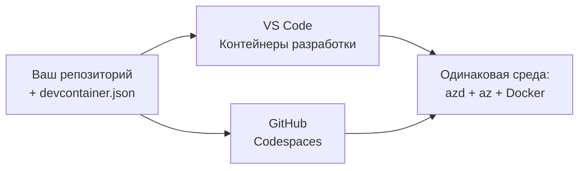

# Dev Containers & GitHub Codespaces for azd

**Chapter Navigation:**
- **📚 Главная страница курса**: [AZD для начинающих](../../README.md)
- **📖 Текущая глава**: Глава 1 - Foundation & Quick Start
- **⬅️ Предыдущая**: [Принесите своё приложение](bring-your-own-app.md)
- **🚀 Следующая глава**: [Глава 2: Разработка, ориентированная на ИИ](../chapter-02-ai-development/README.md)

> Проверено с `azd 1.25.6` в июне 2026 г.

## Введение

Установка azd, нужного рантайма языка, Docker и Azure CLI на каждой машине — утомительное занятие, и это основная причина, по которой руководство, которое «работает на моей машине», может не сработать у кого-то другого. **Dev container** решает эту проблему, описывая весь ваш тулчейн в файле. Любой, кто откроет проект в VS Code или GitHub Codespaces, получит точно такую же среду, с уже установленным azd. В этом уроке показано, как добавить его.

## Цели обучения

К концу этого урока вы:
- Поймёте, что такое dev container и почему он полезен при работе с azd
- Добавите минимальный `.devcontainer/devcontainer.json` в проект
- Включите azd, Azure CLI и Docker через *features* Dev Container
- Откроете проект в GitHub Codespaces или VS Code

## Результаты обучения

После выполнения этого урока вы сможете:
- Написать `devcontainer.json` для проекта azd
- Добавить azd и инструменты Azure без ручной установки
- Запустить `azd up` из контейнера или Codespace

---

## Что такое Dev Container?

Dev container — это среда разработки на базе Docker, определяемая файлом `.devcontainer/devcontainer.json` в вашем репозитории. Когда вы открываете проект:

- **VS Code** (с расширением Dev Containers) собирает контейнер и подключается к нему.
- **GitHub Codespaces** собирает тот же контейнер в облаке и предоставляет редактор в браузере.

В любом случае у каждого участника одинаковые инструменты — никаких вопросов «вы установили azd?» при устранении неполадок.



---

## Шаг 1: Создайте файл devcontainer

Создайте `.devcontainer/devcontainer.json` в корне вашего проекта:

```json
{
  "name": "azd-project",
  "image": "mcr.microsoft.com/devcontainers/base:bookworm",
  "features": {
    "ghcr.io/devcontainers/features/azure-cli:1": {},
    "ghcr.io/azure/azure-dev/azd:latest": {},
    "ghcr.io/devcontainers/features/docker-in-docker:2": {},
    "ghcr.io/devcontainers/features/node:1": {}
  },
  "customizations": {
    "vscode": {
      "extensions": [
        "ms-azuretools.azure-dev",
        "ms-azuretools.vscode-bicep"
      ]
    }
  },
  "forwardPorts": [3000],
  "postCreateCommand": "azd version"
}
```

Что делает каждая часть:

| Ключ | Назначение |
|-----|---------|
| `image` | Базовая ОС для контейнера |
| `features` | Предварительно упакованные установщики — здесь: Azure CLI, **azd**, Docker и Node.js |
| `customizations.vscode.extensions` | Автоматически устанавливает расширения VS Code для azd и Bicep |
| `forwardPorts` | Пробрасывает порт вашего приложения в браузер |
| `postCreateCommand` | Выполняется один раз после сборки контейнера (здесь — проверка работоспособности) |

> Фича `ghcr.io/azure/azure-dev/azd:latest` — это официальный способ получить azd в контейнере. Зафиксируйте конкретную версию (например `azd:1.25.6`), если нужна воспроизводимость.

---

## Шаг 2: Совместите feature с языком вашего приложения

Замените feature `node` на тот, который использует ваше приложение:

```jsonc
// Python project
"ghcr.io/devcontainers/features/python:1": {},

// .NET project
"ghcr.io/devcontainers/features/dotnet:2": {},

// Java project
"ghcr.io/devcontainers/features/java:1": {},

// Go project
"ghcr.io/devcontainers/features/go:1": {}
```

Оставьте `docker-in-docker`, если ваш `host` — `containerapp`, `aks` или любой другой, который собирает образ контейнера — azd требует Docker для сборки и отправки образов.

---

## Шаг 3: Откройте проект

**В VS Code:**
1. Установите расширение **Dev Containers**.
2. Откройте папку проекта.
3. Нажмите **Reopen in Container** когда появится подсказка (или запустите *Dev Containers: Reopen in Container*).

**В GitHub Codespaces:**
1. Запушьте репозиторий на GitHub.
2. Нажмите **Code → Codespaces → Create codespace on main**.
3. Дождитесь сборки контейнера — azd будет готов в терминале.

---

## Шаг 4: Развертывание изнутри контейнера

В контейнере azd уже предустановлен, поэтому обычный рабочий процесс просто работает:

```bash
azd auth login --use-device-code   # код устройства удобен внутри Codespaces
azd up
```

> **Почему `--use-device-code`?** В удалённом контейнере или Codespace нет локального браузера для перенаправления, поэтому вход по device-code — надёжный путь. Вы вставите код в вкладке браузера, чтобы завершить вход.

---

## Типичные ошибки

| Проблема | Решение |
|---------|-----|
| Команда `azd up` не может собрать образ | Добавьте feature `docker-in-docker` |
| Вход через браузер зависает в Codespaces | Используйте `azd auth login --use-device-code` |
| Инструменты различаются у участников команды | Зафиксируйте версии features (например `azd:1.25.6`) |
| Приложение недоступно в браузере | Добавьте порт в `forwardPorts` |

---

## Итог

- Dev container делает ваш тулчейн azd воспроизводимым для всех.
- Добавьте azd, Azure CLI и Docker через Dev Container *features*.
- Подберите feature для языка вашего приложения и оставьте `docker-in-docker` для хостов контейнера.
- Используйте вход по device-code при запуске внутри Codespaces.

---

## 🔗 Навигация

| Направление | Ресурс |
|-----------|----------|
| **Предыдущая** | [Принесите своё приложение](bring-your-own-app.md) |
| **Главная главы** | [Глава 1: Foundation & Quick Start](README.md) |
| **Следующая глава** | [Глава 2: Разработка, ориентированная на ИИ](../chapter-02-ai-development/README.md) |

## 📖 Связанные ресурсы

- [Установка и настройка](installation.md)
- [Справочник команд](../../resources/cheat-sheet.md)
- [Официальная спецификация Dev Containers](https://containers.dev/)
- [Фича Dev Container для azd](https://github.com/Azure/azure-dev/tree/main/ext/devcontainer)

---

<!-- CO-OP TRANSLATOR DISCLAIMER START -->
**Отказ от ответственности**:
Этот документ был переведен с использованием сервиса машинного перевода [Co-op Translator](https://github.com/Azure/co-op-translator). Несмотря на наши усилия по обеспечению точности, имейте в виду, что автоматический перевод может содержать ошибки или неточности. Оригинальный документ на его исходном языке следует считать авторитетным источником. Для получения критически важной информации рекомендуется обратиться к профессиональному человеческому переводу. Мы не несем ответственности за любые недоразумения или неправильные толкования, возникшие в результате использования этого перевода.
<!-- CO-OP TRANSLATOR DISCLAIMER END -->