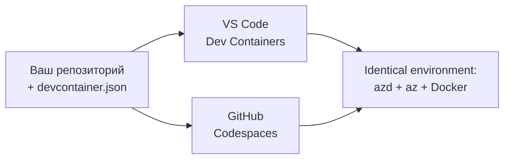

# Контейнеры для разработки и GitHub Codespaces для azd

**Навигация по главам:**
- **📚 Главная курса**: [AZD для начинающих](../../README.md)
- **📖 Текущая глава**: Глава 1 - Основы и Быстрый старт
- **⬅️ Предыдущая**: [Используйте собственное приложение](bring-your-own-app.md)
- **🚀 Следующая глава**: [Глава 2: Разработка с приоритетом на ИИ](../chapter-02-ai-development/README.md)

> Проверено на `azd 1.27.1` в июле 2026 года.

## Введение

Установка azd, нужной среды выполнения языка, Docker и Azure CLI на каждой машине — это хлопотно, и именно по этой причине урок, который «работает на моей машине», не работает у другого. **Контейнер для разработки** решает эту проблему, описывая всю цепочку инструментов в одном файле. Любой, кто открывает проект в VS Code или GitHub Codespaces, получает точно такую же среду с уже установленным azd. В этом уроке показано, как добавить такой контейнер.

## Цели обучения

К концу урока вы будете:
- Понимать, что такое контейнер для разработки и почему он помогает с azd
- Добавить минимальный `.devcontainer/devcontainer.json` в проект
- Включить azd, Azure CLI и Docker через *фичи* контейнера для разработки
- Открыть проект в GitHub Codespaces или VS Code

## Результаты обучения

После выполнения урока вы сможете:
- Создавать `devcontainer.json` для проекта azd
- Добавлять azd и инструменты Azure без ручных установок
- Запускать `azd up` внутри контейнера или Codespace

---

## Что такое контейнер для разработки?

Контейнер для разработки — это основанная на Docker среда разработки, определённая файлом `.devcontainer/devcontainer.json` в вашем репозитории. Когда вы открываете проект:

- **VS Code** (с расширением Dev Containers) собирает контейнер и подключается к нему.
- **GitHub Codespaces** собирает тот же контейнер в облаке и предоставляет редактор в браузере.

В любом случае каждый участник получает одинаковые инструменты — без вопросов «а ты установил azd?».



---

## Шаг 1: Создайте файл devcontainer

Создайте `.devcontainer/devcontainer.json` в корне вашего проекта:

```json
{
  "name": "azd-project",
  "image": "mcr.microsoft.com/devcontainers/base:bookworm",
  "features": {
    "ghcr.io/devcontainers/features/azure-cli:1": {},
    "ghcr.io/azure/azure-dev/azd:latest": {},
    "ghcr.io/devcontainers/features/docker-in-docker:2": {},
    "ghcr.io/devcontainers/features/node:1": {}
  },
  "customizations": {
    "vscode": {
      "extensions": [
        "ms-azuretools.azure-dev",
        "ms-azuretools.vscode-bicep"
      ]
    }
  },
  "forwardPorts": [3000],
  "postCreateCommand": "azd version"
}
```

Что делает каждая часть:

| Ключ | Назначение |
|-----|----------|
| `image` | Базовая ОС для контейнера |
| `features` | Предустановленные инсталляторы — здесь: Azure CLI, **azd**, Docker и Node.js |
| `customizations.vscode.extensions` | Автоматическая установка расширений azd и Bicep для VS Code |
| `forwardPorts` | Проброс порта вашего приложения в браузер |
| `postCreateCommand` | Выполняется один раз после сборки контейнера (здесь проверка работоспособности) |

> Фича `ghcr.io/azure/azure-dev/azd:latest` — официальный способ получить azd в контейнере. Зафиксируйте конкретную версию (например, `azd:1.27.1`) для воспроизводимости.

---

## Шаг 2: Подберите фичу под язык вашего приложения

Замените фичу `node` на ту, которую использует ваше приложение:

```jsonc
// Python project
"ghcr.io/devcontainers/features/python:1": {},

// .NET project
"ghcr.io/devcontainers/features/dotnet:2": {},

// Java project
"ghcr.io/devcontainers/features/java:1": {},

// Go project
"ghcr.io/devcontainers/features/go:1": {}
```

Оставьте `docker-in-docker`, если ваш `host` — это `containerapp`, `aks` или любое другое средство сборки контейнерных образов — azd нужен Docker для сборки и отправки образов.

---

## Шаг 3: Откройте проект

**В VS Code:**
1. Установите расширение **Dev Containers**.
2. Откройте папку проекта.
3. Нажмите **Reopen in Container** при появлении подсказки (или выполните *Dev Containers: Reopen in Container*).

**В GitHub Codespaces:**
1. Запушьте репозиторий в GitHub.
2. Нажмите **Code → Codespaces → Create codespace on main**.
3. Дождитесь сборки контейнера — azd уже готов в терминале.

---

## Шаг 4: Разверните изнутри контейнера

В контейнере azd предустановлен, так что обычный рабочий процесс просто работает:

```bash
azd auth login --use-device-code   # код устройства удобен внутри Codespaces
azd up
```

> **Почему `--use-device-code`?** В удалённом контейнере или Codespace нет локального браузера для перенаправления, поэтому логин через код устройства — это надежный способ. Вы вставите код в вкладку браузера для завершения входа.

---

## Частые ошибки

| Ошибка | Решение |
|---------|----------|
| `azd up` не может собрать образ | Добавьте фичу `docker-in-docker` |
| Авторизация через браузер зависает в Codespaces | Используйте `azd auth login --use-device-code` |
| Инструменты отличаются у разных участников | Зафиксируйте версии фич (например, `azd:1.27.1`) |
| Приложение недоступно в браузере | Добавьте порт в `forwardPorts` |

---

## Итоги

- Контейнер для разработки делает вашу цепочку инструментов azd воспроизводимой для всех.
- Добавьте azd, Azure CLI и Docker через *фичи* контейнера.
- Подберите языковую фичу под ваше приложение и сохраните `docker-in-docker` для хостов контейнеров.
- Используйте логин через код устройства при работе в Codespaces.

---

## 🔗 Навигация

| Направление | Ресурс |
|------------|---------|
| **Предыдущая** | [Используйте собственное приложение](bring-your-own-app.md) |
| **Главная главы** | [Глава 1: Основы и Быстрый старт](README.md) |
| **Следующая глава** | [Глава 2: Разработка с приоритетом на ИИ](../chapter-02-ai-development/README.md) |

## 📖 Связанные ресурсы

- [Установка и настройка](installation.md)
- [Шпаргалка по командам](../../resources/cheat-sheet.md)
- [Официальная спецификация Dev Containers](https://containers.dev/)
- [Фича dev контейнера azd](https://github.com/Azure/azure-dev/tree/main/ext/devcontainer)

---

<!-- CO-OP TRANSLATOR DISCLAIMER START -->
**Отказ от ответственности**:
Этот документ был переведен с использованием сервиса машинного перевода [Co-op Translator](https://github.com/Azure/co-op-translator). Несмотря на наши усилия по обеспечению точности, имейте в виду, что автоматический перевод может содержать ошибки или неточности. Оригинальный документ на его исходном языке следует считать авторитетным источником. Для получения критически важной информации рекомендуется обратиться к профессиональному человеческому переводу. Мы не несем ответственности за любые недоразумения или неправильные толкования, возникшие в результате использования этого перевода.
<!-- CO-OP TRANSLATOR DISCLAIMER END -->