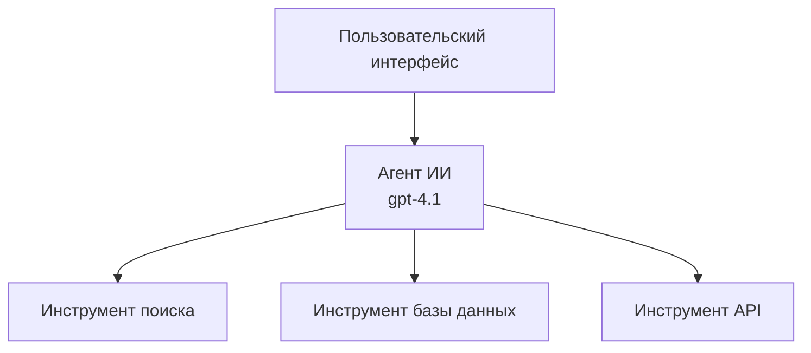
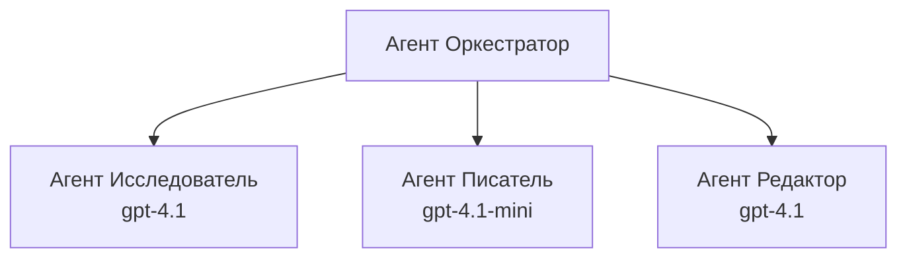

# Агенты ИИ с помощью Azure Developer CLI

**Навигация по главам:**
- **📚 Домашняя страница курса**: [AZD для начинающих](../../README.md)
- **📖 Текущая глава**: Глава 2 - Разработка с приоритетом ИИ
- **⬅️ Предыдущая**: [Интеграция Microsoft Foundry](microsoft-foundry-integration.md)
- **➡️ Следующая**: [Развертывание модели ИИ](ai-model-deployment.md)
- **🚀 Продвинутые**: [Решения с несколькими агентами](../../examples/retail-scenario.md)

---

## Введение

Агенты ИИ — это автономные программы, которые могут воспринимать окружающую среду, принимать решения и предпринимать действия для достижения конкретных целей. В отличие от простых чат-ботов, которые отвечают на запросы, агенты могут:

- **Использовать инструменты** — вызывать API, искать в базах данных, выполнять код
- **Планировать и рассуждать** — разбивать сложные задачи на шаги
- **Обучаться на контексте** — поддерживать память и адаптировать поведение
- **Сотрудничать** — работать с другими агентами (мультиагентные системы)

Это руководство показывает, как развернуть агентов ИИ в Azure с помощью Azure Developer CLI (azd).

## Цели обучения

Пройдя это руководство, вы:
- Поймёте, что такое агенты ИИ и чем они отличаются от чат-ботов
- Развернете готовые шаблоны агентов ИИ с помощью AZD
- Настроите Foundry Agents для пользовательских агентов
- Реализуете базовые паттерны агентов (использование инструментов, RAG, мультиагенты)
- Будете мониторить и отлаживать развернутых агентов

## Результаты обучения

По завершении вы сможете:
- Развернуть приложения агентов ИИ в Azure одной командой
- Настраивать инструменты и возможности агентов
- Реализовывать генерацию с дополнением из поиска (RAG) с агентами
- Проектировать архитектуры с несколькими агентами для сложных рабочих процессов
- Решать распространённые проблемы при развертывании агентов

---

## 🤖 Чем агент отличается от чат-бота?

| Особенность | Чат-бот | Агент ИИ |
|-------------|---------|----------|
| **Поведение** | Отвечает на запросы | Предпринимает автономные действия |
| **Инструменты** | Нет | Может вызывать API, выполнять поиск, запускать код |
| **Память** | Только за сессию | Постоянная память между сессиями |
| **Планирование** | Один ответ | Многоступенчатое рассуждение |
| **Сотрудничество** | Один субъект | Может работать с другими агентами |

### Простое сравнение

- **Чат-бот** = Вежливый человек, отвечающий на вопросы на информационной стойке
- **Агент ИИ** = Личный ассистент, который может звонить, записывать встречи и выполнять задачи за вас

---

## 🚀 Быстрый старт: разверните вашего первого агента

### Вариант 1: Шаблон Foundry Agents (рекомендуется)

```bash
# Инициализировать шаблон AI-агентов
azd init --template get-started-with-ai-agents

# Развернуть в Azure
azd up
```

**Что развертывается:**
- ✅ Foundry Agents
- ✅ Модели Microsoft Foundry (gpt-4.1)
- ✅ Azure AI Search (для RAG)
- ✅ Azure Container Apps (веб-интерфейс)
- ✅ Application Insights (мониторинг)

**Время:** ~15-20 минут  
**Стоимость:** ~$100-150/месяц (разработка)

### Вариант 2: Агент OpenAI с Prompty

```bash
# Инициализировать шаблон агента на основе Prompty
azd init --template agent-openai-python-prompty

# Развернуть в Azure
azd up
```

**Что развертывается:**
- ✅ Azure Functions (бессерверное выполнение агента)
- ✅ Модели Microsoft Foundry
- ✅ Конфигурационные файлы Prompty
- ✅ Пример реализации агента

**Время:** ~10-15 минут  
**Стоимость:** ~$50-100/месяц (разработка)

### Вариант 3: RAG-чат агент

```bash
# Инициализация шаблона чата RAG
azd init --template azure-search-openai-demo

# Развернуть в Azure
azd up
```

**Что развертывается:**
- ✅ Модели Microsoft Foundry
- ✅ Azure AI Search с примерными данными
- ✅ Конвейер обработки документов
- ✅ Чат-интерфейс с ссылками на источники

**Время:** ~15-25 минут  
**Стоимость:** ~$80-150/месяц (разработка)

### Вариант 4: AZD AI Agent Init (на основе манифеста)

Если у вас есть файл манифеста агента, вы можете использовать команду `azd ai` для создания проекта Foundry Agent Service напрямую:

```bash
# Установить расширение для ИИ-агентов
azd extension install azure.ai.agents

# Инициализировать из манифеста агента
azd ai agent init -m agent-manifest.yaml

# Развернуть в Azure
azd up
```

**Когда использовать `azd ai agent init` вместо `azd init --template`:**

| Подход | Для чего подходит | Как работает |
|--------|-------------------|--------------|
| `azd init --template` | Начало с рабочего шаблонного приложения | Клонирует полный репозиторий шаблона с кодом и инфраструктурой |
| `azd ai agent init -m` | Создание с собственного манифеста агента | Создаёт структуру проекта на основе вашего описания агента |

> **Совет:** Используйте `azd init --template` при обучении (варианты 1-3 выше). Используйте `azd ai agent init` для создания продакшен-агентов с вашими манифестами. Смотрите [AZD AI CLI команды](../chapter-08-production/production-ai-practices.md#azd-ai-cli-commands-and-extensions) для полного справочника.

---

## 🏗️ Архитектурные паттерны агентов

### Паттерн 1: Один агент с несколькими инструментами

Самый простой паттерн — один агент, который может использовать несколько инструментов.


**Лучше всего подходит для:**
- Ботов поддержки клиентов
- Исследовательских ассистентов
- Агентов анализа данных

**Шаблон AZD:** `azure-search-openai-demo`

### Паттерн 2: RAG агент (генерация с дополнением из поиска)

Агент, который сначала извлекает релевантные документы, а потом генерирует ответы.


**Лучше всего подходит для:**
- Корпоративных баз знаний
- Систем вопросов-ответов по документам
- Исследований в области соответствия и юриспруденции

**Шаблон AZD:** `azure-search-openai-demo`

### Паттерн 3: Мультиагентная система

Несколько специализированных агентов, которые совместно выполняют сложные задачи.


**Лучше всего подходит для:**
- Генерации сложного контента
- Многоступенчатых рабочих процессов
- Задач, требующих разных экспертиз

**Подробнее:** [Паттерны координации мультиагентных систем](../chapter-06-pre-deployment/coordination-patterns.md)

---

## ⚙️ Настройка инструментов для агентов

Агенты становятся мощными, когда могут использовать инструменты. Вот как настраивать распространённые инструменты:

### Настройка инструментов в Foundry Agents

```python
# agent_config.py
from azure.ai.projects import AIProjectClient
from azure.ai.projects.models import FunctionTool, CodeInterpreterTool

# Определить пользовательские инструменты
search_tool = FunctionTool(
    name="search_knowledge_base",
    description="Search the company knowledge base for relevant documents",
    parameters={
        "type": "object",
        "properties": {
            "query": {
                "type": "string",
                "description": "The search query"
            }
        },
        "required": ["query"]
    }
)

# Создать агента с инструментами
agent = project_client.agents.create_agent(
    model="gpt-4.1",
    name="Support Agent",
    instructions="You are a helpful support agent. Use the search tool to find relevant information.",
    tools=[search_tool, CodeInterpreterTool()]
)
```

### Конфигурация окружения

```bash
# Установить переменные окружения, специфичные для агента
azd env set AZURE_OPENAI_MODEL "gpt-4.1"
azd env set AGENT_INSTRUCTIONS "You are a helpful assistant..."
azd env set ENABLE_CODE_INTERPRETER "true"
azd env set ENABLE_FILE_SEARCH "true"

# Развернуть с обновленной конфигурацией
azd deploy
```

---

## 📊 Мониторинг агентов

### Интеграция Application Insights

Все шаблоны агентов AZD включают Application Insights для мониторинга:

```bash
# Открыть панель мониторинга
azd monitor --overview

# Просмотр живых журналов
azd monitor --logs

# Просмотр живой метрики
azd monitor --live
```

### Основные метрики для отслеживания

| Метрика | Описание | Цель |
|---------|----------|------|
| Задержка ответа | Время генерации ответа | < 5 секунд |
| Использование токенов | Токены на запрос | Контроль расходов |
| Процент успешных вызовов инструментов | % успешных вызовов | > 95% |
| Уровень ошибок | Ошибки запросов агента | < 1% |
| Удовлетворённость пользователей | Оценки обратной связи | > 4.0/5.0 |

### Пользовательское логирование агентов

```python
import os
from azure.monitor.opentelemetry import configure_azure_monitor
from opentelemetry import trace

# Настройка Azure Monitor с OpenTelemetry
configure_azure_monitor(
    connection_string=os.environ["APPLICATIONINSIGHTS_CONNECTION_STRING"]
)

tracer = trace.get_tracer(__name__)

def log_agent_interaction(user_query, agent_response, tools_used, latency_ms):
    with tracer.start_as_current_span("agent_interaction") as span:
        span.set_attributes({
            "user_query": user_query,
            "response_length": len(agent_response),
            "tools_used": tools_used,
            "latency_ms": latency_ms
        })
```

> **Примечание:** Установите необходимые пакеты: `pip install azure-monitor-opentelemetry opentelemetry`

---

## 💰 Вопросы стоимости

### Оценка ежемесячных затрат по паттернам

| Паттерн | Среда разработки | Продакшен |
|---------|------------------|-----------|
| Один агент | $50-100 | $200-500 |
| RAG агент | $80-150 | $300-800 |
| Мультиагент (2-3 агента) | $150-300 | $500-1,500 |
| Корпоративный мультиагент | $300-500 | $1,500-5,000+ |

### Советы по оптимизации расходов

1. **Используйте gpt-4.1-mini для простых задач**  
   ```bash
   azd env set AZURE_OPENAI_MODEL "gpt-4.1-mini"
   ```

2. **Реализуйте кеширование для повторяющихся запросов**  
   ```python
   from functools import lru_cache
   
   @lru_cache(maxsize=1000)
   def get_cached_response(query_hash):
       return agent.run(query_hash)
   ```

3. **Устанавливайте лимиты токенов на запуск**  
   ```python
   # Устанавливайте max_completion_tokens при запуске агента, а не во время создания
   run = project_client.agents.create_run(
       thread_id=thread.id,
       agent_id=agent.id,
       max_completion_tokens=1000  # Ограничить длину ответа
   )
   ```

4. **Масштабируйтесь до нуля при отсутствии нагрузки**  
   ```bash
   # Приложения-контейнеры автоматически масштабируются до нуля
   azd env set MIN_REPLICAS "0"
   ```

---

## 🔧 Устранение неполадок агентов

### Распространённые проблемы и решения

<details>
<summary><strong>❌ Агент не отвечает на вызовы инструментов</strong></summary>

```bash
# Проверьте, что инструменты правильно зарегистрированы
azd show

# Проверьте развертывание OpenAI
az cognitiveservices account deployment list \
  --name $AZURE_OPENAI_NAME \
  --resource-group $RG_NAME

# Проверьте логи агента
azd monitor --logs
```

**Распространённые причины:**
- Несовпадение сигнатуры функции инструмента
- Отсутствие необходимых разрешений
- Недоступность API-эндпоинта
</details>

<details>
<summary><strong>❌ Высокая задержка в ответах агента</strong></summary>

```bash
# Проверьте Application Insights на наличие узких мест
azd monitor --live

# Рассмотрите возможность использования более быстрой модели
azd env set AZURE_OPENAI_MODEL "gpt-4.1-mini"
azd deploy
```

**Советы по оптимизации:**
- Используйте потоковые ответы
- Реализуйте кеширование ответов
- Уменьшите размер контекстного окна
</details>

<details>
<summary><strong>❌ Агент возвращает неверную или вымышленную информацию</strong></summary>

```python
# Улучшить с помощью лучших системных подсказок
instructions = """
You are a helpful assistant. IMPORTANT:
- Only answer based on provided context
- If you don't know, say "I don't know"
- Always cite your sources
- Never make up information
"""

# Добавить извлечение для обоснования
agent = project_client.agents.create_agent(
    model="gpt-4.1",
    instructions=instructions,
    tools=[FileSearchTool()]  # Основывать ответы на документах
)
```
</details>

<details>
<summary><strong>❌ Ошибки превышения лимита токенов</strong></summary>

```python
# Реализовать управление окном контекста
def truncate_context(messages, max_tokens=8000, model="gpt-4.1"):
    """Keep only recent messages within token limit."""
    import tiktoken
    encoding = tiktoken.encoding_for_model(model)
    total_tokens = 0
    truncated = []
    
    for msg in reversed(messages):
        msg_tokens = len(encoding.encode(msg.content))
        if total_tokens + msg_tokens > max_tokens:
            break
        truncated.insert(0, msg)
        total_tokens += msg_tokens
    
    return truncated
```
</details>

---

## 🎓 Практические задания

### Задание 1: Развернуть базового агента (20 минут)

**Цель:** Развернуть первого агента ИИ с помощью AZD

```bash
# Шаг 1: Инициализация шаблона
azd init --template get-started-with-ai-agents

# Шаг 2: Вход в Azure
azd auth login

# Шаг 3: Развертывание
azd up

# Шаг 4: Тестирование агента
# Ожидаемый результат после развертывания:
#   Развертывание завершено!
#   Конечная точка: https://<app-name>.<region>.azurecontainerapps.io
# Откройте URL, показанный в выводе, и попробуйте задать вопрос

# Шаг 5: Просмотр мониторинга
azd monitor --overview

# Шаг 6: Очистка ресурсов
azd down --force --purge
```

**Критерии успеха:**
- [ ] Агент отвечает на вопросы
- [ ] Доступна панель мониторинга через `azd monitor`
- [ ] Ресурсы успешно очищены

### Задание 2: Добавить пользовательский инструмент (30 минут)

**Цель:** Расширить агента пользовательским инструментом

1. Разверните шаблон агента:  
   ```bash
   azd init --template get-started-with-ai-agents
   azd up
   ```
2. Создайте новую функцию инструмента в коде агента:  
   ```python
   def get_weather(location: str) -> str:
       """Get current weather for a location."""
       # Вызов API к сервису погоды
       return f"Weather in {location}: Sunny, 72°F"
   ```
3. Зарегистрируйте инструмент у агента:  
   ```python
   from azure.ai.projects.models import FunctionTool

   weather_tool = FunctionTool(
       name="get_weather",
       description="Get current weather for a location",
       parameters={
           "type": "object",
           "properties": {
               "location": {"type": "string", "description": "City name"}
           },
           "required": ["location"]
       }
   )

   agent = project_client.agents.create_agent(
       model="gpt-4.1",
       name="Weather Agent",
       tools=[weather_tool]
   )
   ```
4. Переразверните и протестируйте:  
   ```bash
   azd deploy
   # Спросить: "Какая погода в Сиэтле?"
   # Ожидается: Агент вызывает get_weather("Seattle") и возвращает информацию о погоде
   ```

**Критерии успеха:**
- [ ] Агент распознаёт вопросы о погоде
- [ ] Инструмент вызывается корректно
- [ ] Ответ содержит информацию о погоде

### Задание 3: Создать RAG агента (45 минут)

**Цель:** Создать агента, отвечающего на вопросы по вашим документам

```bash
# Шаг 1: Разверните шаблон RAG
azd init --template azure-search-openai-demo
azd up

# Шаг 2: Загрузите ваши документы
# Поместите файлы PDF/TXT в каталог data/, затем запустите:
python scripts/prepdocs.py

# Шаг 3: Проверьте с вопросами по специфике домена
# Откройте URL веб-приложения из вывода azd up
# Задавайте вопросы о ваших загруженных документах
# Ответы должны включать ссылки на источники, например [doc.pdf]
```

**Критерии успеха:**
- [ ] Агент отвечает на основе загруженных документов
- [ ] В ответах есть ссылки на источники
- [ ] Нет галлюцинаций при вопросах вне области

---

## 📚 Следующие шаги

Теперь, когда вы понимаете агентов ИИ, изучите эти продвинутые темы:

| Тема | Описание | Ссылка |
|------|----------|--------|
| **Мультиагентные системы** | Создание систем из нескольких взаимодействующих агентов | [Пример мультиагента в розничной торговле](../../examples/retail-scenario.md) |
| **Паттерны координации** | Изучение паттернов оркестровки и коммуникации | [Паттерны координации](../chapter-06-pre-deployment/coordination-patterns.md) |
| **Продакшен развертывание** | Развертывание агентов для бизнеса | [Практики продакшена ИИ](../chapter-08-production/production-ai-practices.md) |
| **Оценка агентов** | Тестирование и оценка производительности агентов | [Отладка ИИ](../chapter-07-troubleshooting/ai-troubleshooting.md) |
| **Лаборатория по ИИ** | Практические занятия по подготовке решений ИИ для AZD | [Лаборатория по ИИ](ai-workshop-lab.md) |

---

## 📖 Дополнительные ресурсы

### Официальная документация
- [Сервис агентов Azure AI](https://learn.microsoft.com/azure/ai-services/agents/)
- [Быстрый старт с сервисом Foundry Agent Azure AI](https://learn.microsoft.com/azure/ai-services/agents/quickstart)
- [Фреймворк Semantic Kernel Agent](https://learn.microsoft.com/semantic-kernel/)

### Шаблоны AZD для агентов
- [Начало работы с агентами ИИ](https://github.com/Azure-Samples/get-started-with-ai-agents)
- [Agent OpenAI Python Prompty](https://github.com/Azure-Samples/agent-openai-python-prompty)
- [Azure Search OpenAI Demo](https://github.com/Azure-Samples/azure-search-openai-demo)

### Ресурсы сообщества
- [Awesome AZD - шаблоны агентов](https://azure.github.io/awesome-azd/?tags=ai-agents)
- [Azure AI Discord](https://discord.gg/microsoft-azure)
- [Microsoft Foundry Discord](https://discord.gg/nTYy5BXMWG)

### Навыки агента для вашего редактора
- [**Навыки агентов Microsoft Azure**](https://skills.sh/microsoft/github-copilot-for-azure) — Установите переиспользуемые навыки агентов ИИ для разработки в Azure в GitHub Copilot, Cursor или любом поддерживаемом агенте. Включает навыки для [Azure AI](https://skills.sh/microsoft/github-copilot-for-azure/azure-ai), [Microsoft Foundry](https://skills.sh/microsoft/github-copilot-for-azure/microsoft-foundry), [развертывания](https://skills.sh/microsoft/github-copilot-for-azure/azure-deploy) и [диагностики](https://skills.sh/microsoft/github-copilot-for-azure/azure-diagnostics):  
  ```bash
  npx skills add microsoft/github-copilot-for-azure
  ```

---

**Навигация**
- **Предыдущий урок**: [Интеграция Microsoft Foundry](microsoft-foundry-integration.md)
- **Следующий урок**: [Развертывание модели ИИ](ai-model-deployment.md)

---

<!-- CO-OP TRANSLATOR DISCLAIMER START -->
**Отказ от ответственности**:  
Этот документ был переведен с использованием сервиса автоматического перевода [Co-op Translator](https://github.com/Azure/co-op-translator). Несмотря на наши усилия обеспечить точность, пожалуйста, имейте в виду, что автоматические переводы могут содержать ошибки или неточности. Оригинальный документ на исходном языке следует считать авторитетным источником. Для важной информации рекомендуется использовать профессиональный перевод, выполненный человеком. Мы не несем ответственности за любые недоразумения или неправильные толкования, возникающие из-за использования данного перевода.
<!-- CO-OP TRANSLATOR DISCLAIMER END -->