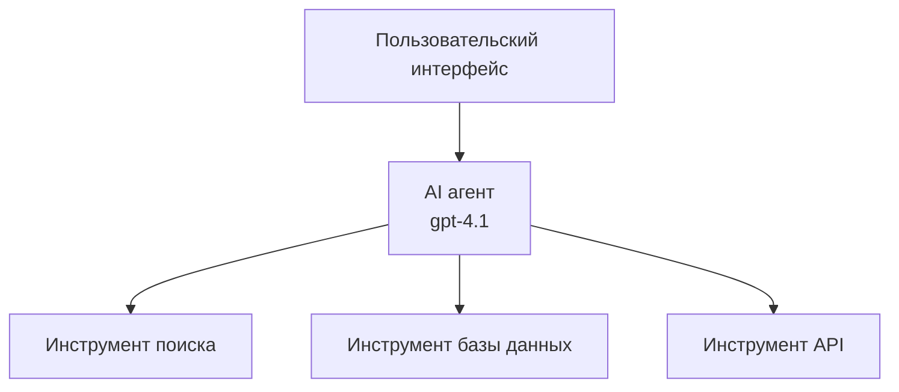
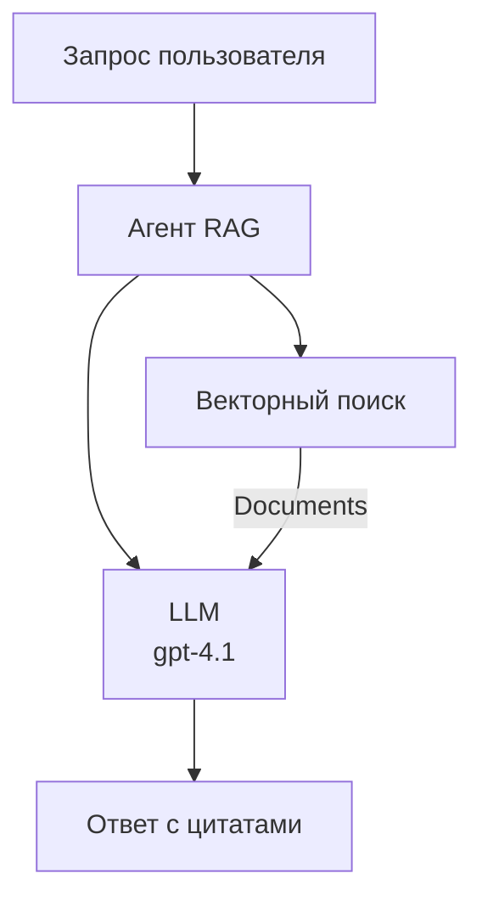
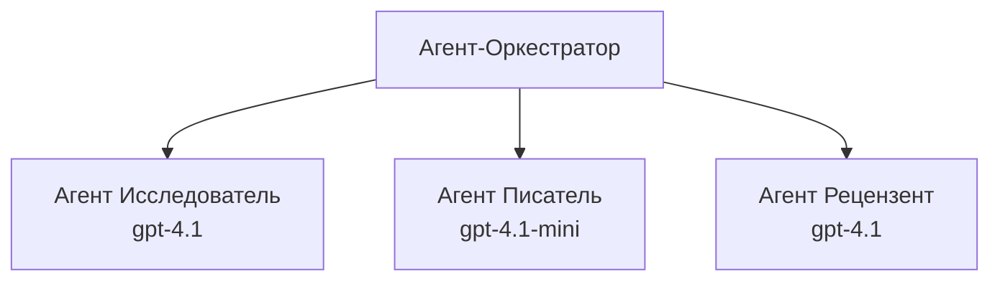

# AI-агенты с Azure Developer CLI

**Навигация по главе:**
- **📚 Домашняя страница курса**: [AZD для начинающих](../../README.md)
- **📖 Текущая глава**: Глава 2 - Разработка с искусственным интеллектом в первую очередь
- **⬅️ Предыдущая**: [Интеграция Microsoft Foundry](microsoft-foundry-integration.md)
- **➡️ Следующая**: [Развертывание AI-моделей](ai-model-deployment.md)
- **🚀 Продвинутый уровень**: [Многоагентные решения](../../examples/retail-scenario.md)

---

## Введение

AI-агенты — это автономные программы, которые могут воспринимать окружающую среду, принимать решения и выполнять действия для достижения конкретных целей. В отличие от простых чатботов, которые отвечают на запросы, агенты могут:

- **Использовать инструменты** — Вызывать API, искать в базах данных, выполнять код
- **Планировать и рассуждать** — Разбивать сложные задачи на этапы
- **Учиться на контексте** — Сохранять память и адаптировать поведение
- **Сотрудничать** — Работать с другими агентами (многоагентные системы)

Это руководство показывает, как развернуть AI-агентов в Azure с помощью Azure Developer CLI (azd).

> **Примечание по проверке (13.07.2026):** Это руководство было проверено с azd версии 1.27.1 и azure.ai.agents версии 1.0.0-beta.5. Опыт использования `azd ai` всё ещё находится в режиме предварительного просмотра, поэтому проверьте помощь расширения, если установленные у вас параметры отличаются.

## Цели обучения

Пройдя это руководство, вы:
- Поймете, что такое AI-агенты и чем они отличаются от чатботов
- Развернете готовые шаблоны AI-агентов с помощью AZD
- Настроите Foundry Agents для создания кастомных агентов
- Реализуете базовые паттерны агентов (использование инструментов, RAG, многоагентные системы)
- Будете контролировать и отлаживать развернутых агентов

## Результаты обучения

После завершения вы сможете:
- Развертывать приложения AI-агентов в Azure одной командой
- Настраивать инструменты и возможности агентов
- Реализовывать генерацию с дополнением по поиску (RAG) с агентами
- Проектировать многоагентные архитектуры для сложных рабочих процессов
- Решать распространённые проблемы развертывания агентов

---

## 🤖 Чем агент отличается от чатбота?

| Функция | Чатбот | AI-агент |
|---------|---------|----------|
| **Поведение** | Отвечает на запросы | Выполняет автономные действия |
| **Инструменты** | Нет | Может вызывать API, искать, выполнять код |
| **Память** | Только сессия | Постоянная память между сессиями |
| **Планирование** | Один ответ | Многошаговое рассуждение |
| **Сотрудничество** | Один субъект | Может работать с другими агентами |

### Простая аналогия

- **Чатбот** = Вежливый человек, отвечающий на вопросы у информационной стойки
- **AI-агент** = Личный помощник, который может звонить, записывать встречи и выполнять задачи за вас

---

## 🚀 Быстрый старт: разверните вашего первого агента

### Вариант 1: Шаблон Foundry Agents (рекомендуется)

```bash
# Инициализировать шаблон AI агентов
azd init --template get-started-with-ai-agents

# Развернуть в Azure
azd up
```

**Что развернется:**
- ✅ Foundry Agents
- ✅ Модели Microsoft Foundry (gpt-4.1)
- ✅ Azure AI Search (для RAG)
- ✅ Azure Container Apps (веб-интерфейс)
- ✅ Application Insights (мониторинг)

**Время:** около 15-20 минут
**Стоимость:** около 100-150 долларов в месяц (разработка)

### Вариант 2: Агент OpenAI с Prompty

```bash
# Инициализировать шаблон агента на основе Prompty
azd init --template agent-openai-python-prompty

# Развернуть в Azure
azd up
```

**Что развернется:**
- ✅ Azure Functions (безсерверное выполнение агента)
- ✅ Модели Microsoft Foundry
- ✅ Конфигурационные файлы Prompty
- ✅ Пример реализации агента

**Время:** около 10-15 минут
**Стоимость:** около 50-100 долларов в месяц (разработка)

### Вариант 3: RAG-чат-агент

```bash
# Инициализировать шаблон чата RAG
azd init --template azure-search-openai-demo

# Развернуть на Azure
azd up
```

**Что развернется:**
- ✅ Модели Microsoft Foundry
- ✅ Azure AI Search с примерными данными
- ✅ Конвейер обработки документов
- ✅ Чат-интерфейс с цитатами

**Время:** около 15-25 минут
**Стоимость:** около 80-150 долларов в месяц (разработка)

### Вариант 4: Инициализация агента AZD AI (на базе манифеста или шаблона, предварительный просмотр)

Если у вас есть файл манифеста агента, вы можете использовать команду `azd ai` для создания проекта Foundry Agent Service напрямую. В последних версиях предварительного просмотра также добавлена поддержка инициализации на основе шаблонов, поэтому точный процесс может немного отличаться в зависимости от установленной версии расширения.

```bash
# Установить расширение для AI-агентов
azd extension install azure.ai.agents

# По желанию: проверить установленную версию предварительного просмотра
azd extension show azure.ai.agents

# Инициализировать из манифеста агента
azd ai agent init -m agent-manifest.yaml

# Развернуть в Azure
azd up

# Протестировать развернутого агента (показывает задержку и время до первого байта)
azd ai agent invoke
```

**Когда использовать `azd ai agent init` вместо `azd init --template`:**

| Подход | Лучшее применение | Как это работает |
|----------|----------|------|
| `azd init --template` | Начало с рабочего примера | Клонирует полный шаблон репозитория с кодом и инфраструктурой |
| `azd ai agent init -m` | Создание на основе вашего манифеста агента | Генерирует структуру проекта из определения вашего агента |

> **Совет:** Используйте `azd init --template` для обучения (варианты 1-3 выше). Используйте `azd ai agent init`, создавая продакшн-агентов с вашими манифестами.

После `azd up` то же расширение проведет вас через остальной жизненный цикл агента: `azd ai agent invoke` для тестирования, `azd ai agent eval generate` и `azd ai agent optimize` для измерения и улучшения качества, и `azd ai agent delete` для очистки. См. [Команды AZD AI CLI](../chapter-08-production/production-ai-practices.md#azd-ai-cli-commands-and-extensions) для полного справочника.

---

## 🏗️ Паттерны архитектуры агентов

### Паттерн 1: Один агент с инструментами

Самый простой паттерн агента — один агент, который может использовать несколько инструментов.



**Подходит для:**
- Ботов поддержки клиентов
- Исследовательских помощников
- Агентов анализа данных

**Шаблон AZD:** `azure-search-openai-demo`

### Паттерн 2: RAG-агент (генерация с дополнением по поиску)

Агент, который извлекает релевантные документы перед генерацией ответа.



**Подходит для:**
- Корпоративных баз знаний
- Систем вопросов и ответов по документам
- Исследований по соответствию и юридическим вопросам

**Шаблон AZD:** `azure-search-openai-demo`

### Паттерн 3: Многоагентная система

Несколько специализированных агентов, работающих вместе над сложными задачами.



**Подходит для:**
- Сложного создания контента
- Многошаговых рабочих процессов
- Задач, требующих различных экспертиз

**Подробнее:** [Паттерны координации многоагентных систем](../chapter-06-pre-deployment/coordination-patterns.md)

---

## ⚙️ Настройка инструментов агента

Агенты становятся мощными, когда могут использовать инструменты. Вот как настроить основные из них:

### Конфигурация инструментов в Foundry Agents

```python
# agent_config.py
from azure.ai.projects import AIProjectClient
from azure.ai.projects.models import FunctionTool, CodeInterpreterTool

# Определить пользовательские инструменты
search_tool = FunctionTool(
    name="search_knowledge_base",
    description="Search the company knowledge base for relevant documents",
    parameters={
        "type": "object",
        "properties": {
            "query": {
                "type": "string",
                "description": "The search query"
            }
        },
        "required": ["query"]
    }
)

# Создать агента с инструментами
agent = project_client.agents.create_agent(
    model="gpt-4.1",
    name="Support Agent",
    instructions="You are a helpful support agent. Use the search tool to find relevant information.",
    tools=[search_tool, CodeInterpreterTool()]
)
```

### Конфигурация окружения

```bash
# Установить переменные среды, специфичные для агента
azd env set AZURE_OPENAI_MODEL "gpt-4.1"
azd env set AGENT_INSTRUCTIONS "You are a helpful assistant..."
azd env set ENABLE_CODE_INTERPRETER "true"
azd env set ENABLE_FILE_SEARCH "true"

# Развернуть с обновленной конфигурацией
azd deploy
```

---

## 📊 Мониторинг агентов

### Интеграция с Application Insights

Все шаблоны AZD для агентов включают Application Insights для мониторинга:

```bash
# Открыть панель мониторинга
azd monitor --overview

# Просмотреть живые логи
azd monitor --logs

# Просмотреть живые метрики
azd monitor --live
```

### Ключевые метрики для отслеживания

| Метрика | Описание | Цель |
|--------|-------------|--------|
| Задержка ответа | Время на генерацию ответа | < 5 секунд |
| Использование токенов | Токены на запрос | Контроль стоимости |
| Успешность вызова инструмента | % успешных вызовов | > 95% |
| Частота ошибок | Ошибочные запросы агента | < 1% |
| Удовлетворенность пользователей | Оценки отзывов | > 4.0 из 5.0 |

### Пользовательское логирование для агентов

```python
import os
from azure.monitor.opentelemetry import configure_azure_monitor
from opentelemetry import trace

# Настройка Azure Monitor с помощью OpenTelemetry
configure_azure_monitor(
    connection_string=os.environ["APPLICATIONINSIGHTS_CONNECTION_STRING"]
)

tracer = trace.get_tracer(__name__)

def log_agent_interaction(user_query, agent_response, tools_used, latency_ms):
    with tracer.start_as_current_span("agent_interaction") as span:
        span.set_attributes({
            "user_query": user_query,
            "response_length": len(agent_response),
            "tools_used": tools_used,
            "latency_ms": latency_ms
        })
```

> **Примечание:** Установите необходимые пакеты: `pip install azure-monitor-opentelemetry opentelemetry`

---

## 💰 Вопросы стоимости

### Оценочные ежемесячные затраты по паттернам

| Паттерн | Среда разработки | Продакшн |
|---------|-----------------|------------|
| Один агент | $50-100 | $200-500 |
| RAG-агент | $80-150 | $300-800 |
| Многоагентная система (2-3 агента) | $150-300 | $500-1,500 |
| Корпоративная многоагентная система | $300-500 | $1,500-5,000+ |

### Советы по оптимизации затрат

1. **Используйте gpt-4.1-mini для простых задач**
   ```bash
   azd env set AZURE_OPENAI_MODEL "gpt-4.1-mini"
   ```

2. **Используйте кэширование для повторяющихся запросов**
   ```python
   from functools import lru_cache
   
   @lru_cache(maxsize=1000)
   def get_cached_response(query_hash):
       return agent.run(query_hash)
   ```

3. **Устанавливайте лимиты токенов за запуск**
   ```python
   # Устанавливайте max_completion_tokens при запуске агента, а не во время создания
   run = project_client.agents.create_run(
       thread_id=thread.id,
       agent_id=agent.id,
       max_completion_tokens=1000  # Ограничьте длину ответа
   )
   ```

4. **Масштабирование до нуля, когда не используется**
   ```bash
   # Контейнерные приложения автоматически масштабируются до нуля
   azd env set MIN_REPLICAS "0"
   ```

---

## 🔧 Поиск и устранение неполадок агентов

### Распространённые проблемы и решения

<details>
<summary><strong>❌ Агент не отвечает на вызовы инструментов</strong></summary>

```bash
# Проверьте, правильно ли зарегистрированы инструменты
azd show

# Проверьте развертывание OpenAI
az cognitiveservices account deployment list \
  --name $AZURE_OPENAI_NAME \
  --resource-group $RG_NAME

# Проверьте журналы агента
azd monitor --logs
```

**Распространённые причины:**
- Несоответствие сигнатуры функции инструмента
- Отсутствуют необходимые разрешения
- Недоступен API-эндпоинт
</details>

<details>
<summary><strong>❌ Высокая задержка ответов агента</strong></summary>

```bash
# Проверьте Application Insights на наличие узких мест
azd monitor --live

# Рассмотрите возможность использования более быстрой модели
azd env set AZURE_OPENAI_MODEL "gpt-4.1-mini"
azd deploy
```

**Советы по оптимизации:**
- Используйте потоковые ответы
- Внедрите кэширование ответов
- Уменьшите размер контекстного окна
</details>

<details>
<summary><strong>❌ Агент возвращает неправильную или вымышленную информацию</strong></summary>

```python
# Улучшить с помощью лучших системных подсказок
instructions = """
You are a helpful assistant. IMPORTANT:
- Only answer based on provided context
- If you don't know, say "I don't know"
- Always cite your sources
- Never make up information
"""

# Добавить поиск для обоснования
agent = project_client.agents.create_agent(
    model="gpt-4.1",
    instructions=instructions,
    tools=[FileSearchTool()]  # Связывать ответы с документами
)
```
</details>

<details>
<summary><strong>❌ Ошибки превышения лимита токенов</strong></summary>

```python
# Реализовать управление контекстным окном
def truncate_context(messages, max_tokens=8000, model="gpt-4.1"):
    """Keep only recent messages within token limit."""
    import tiktoken
    encoding = tiktoken.encoding_for_model(model)
    total_tokens = 0
    truncated = []
    
    for msg in reversed(messages):
        msg_tokens = len(encoding.encode(msg.content))
        if total_tokens + msg_tokens > max_tokens:
            break
        truncated.insert(0, msg)
        total_tokens += msg_tokens
    
    return truncated
```
</details>

---

## 🎓 Практические упражнения

### Упражнение 1: Развернуть базового агента (20 минут)

**Цель:** Развернуть вашего первого AI-агента с помощью AZD

```bash
# Шаг 1: Инициализация шаблона
azd init --template get-started-with-ai-agents

# Шаг 2: Вход в Azure
azd auth login
# Если работаете с несколькими арендаторами, добавьте --tenant-id <tenant-id>

# Шаг 3: Развертывание
azd up

# Шаг 4: Тестирование агента
# Ожидаемый вывод после развертывания:
#   Развертывание завершено!
#   Конечная точка: https://<app-name>.<region>.azurecontainerapps.io
# Откройте URL, указанный в выводе, и попробуйте задать вопрос

# Шаг 5: Просмотр мониторинга
azd monitor --overview

# Шаг 6: Очистка
azd down --force --purge
```

**Критерии успеха:**
- [ ] Агент отвечает на вопросы
- [ ] Возможность доступа к панели мониторинга через `azd monitor`
- [ ] Ресурсы успешно очищены

### Упражнение 2: Добавить собственный инструмент (30 минут)

**Цель:** Расширить агента кастомным инструментом

1. Разверните шаблон агента:
   ```bash
   azd init --template get-started-with-ai-agents
   azd up
   ```
2. Создайте новую функцию инструмента в коде агента:
   ```python
   def get_weather(location: str) -> str:
       """Get current weather for a location."""
       # Вызов API к сервису погоды
       return f"Weather in {location}: Sunny, 72°F"
   ```
3. Зарегистрируйте инструмент у агента:
   ```python
   from azure.ai.projects.models import FunctionTool

   weather_tool = FunctionTool(
       name="get_weather",
       description="Get current weather for a location",
       parameters={
           "type": "object",
           "properties": {
               "location": {"type": "string", "description": "City name"}
           },
           "required": ["location"]
       }
   )

   agent = project_client.agents.create_agent(
       model="gpt-4.1",
       name="Weather Agent",
       tools=[weather_tool]
   )
   ```
4. Переразверните и протестируйте:
   ```bash
   azd deploy
   # Спросить: «Какая погода в Сиэтле?»
   # Ожидается: Агент вызывает get_weather("Seattle") и возвращает информацию о погоде
   ```

**Критерии успеха:**
- [ ] Агент распознает запросы, связанные с погодой
- [ ] Инструмент вызывается корректно
- [ ] Ответ содержит информацию о погоде

### Упражнение 3: Построить RAG-агента (45 минут)

**Цель:** Создать агента, который отвечает на вопросы по вашим документам

```bash
# Шаг 1: Разверните шаблон RAG
azd init --template azure-search-openai-demo
azd up

# Шаг 2: Загрузите ваши документы
# Поместите файлы PDF/TXT в директорию data/, затем выполните:
python scripts/prepdocs.py

# Шаг 3: Проверьте с вопросами по конкретной области
# Откройте URL веб-приложения из вывода azd up
# Задавайте вопросы по вашим загруженным документам
# Ответы должны включать ссылки на источники, например [doc.pdf]
```

**Критерии успеха:**
- [ ] Агент отвечает на основе загруженных документов
- [ ] Ответы содержат цитаты
- [ ] Отсутствие галлюцинаций по вопросам вне области данных

---

## 📚 Следующие шаги

Теперь, когда вы понимаете, что такое AI-агенты, изучите эти продвинутые темы:

| Тема | Описание | Ссылка |
|-------|-------------|------|
| **Многоагентные системы** | Создание систем с несколькими сотрудничающими агентами | [Пример многоагентной системы в розничной торговле](../../examples/retail-scenario.md) |
| **Паттерны координации** | Изучение паттернов оркестрации и коммуникации | [Паттерны координации](../chapter-06-pre-deployment/coordination-patterns.md) |
| **Развертывание в продакшн** | Развертывание агентов готовое для предприятия | [Практики AI в продакшн](../chapter-08-production/production-ai-practices.md) |
| **Оценка агентов** | Тестирование и оценка производительности агентов | [Устранение проблем AI](../chapter-07-troubleshooting/ai-troubleshooting.md) |
| **Лаборатория AI Workshop** | Практика: подготовка AI-решения к AZD | [Лаборатория AI Workshop](ai-workshop-lab.md) |

---

## 📖 Дополнительные ресурсы

### Официальная документация
- [Служба Microsoft Foundry Agent](https://learn.microsoft.com/azure/ai-services/agents/)
- [Быстрый старт Microsoft Foundry Agent Service](https://learn.microsoft.com/azure/ai-services/agents/quickstart)
- [Фреймворк Semantic Kernel Agent](https://learn.microsoft.com/semantic-kernel/)

### Шаблоны AZD для агентов
- [Начало работы с AI-агентами](https://github.com/Azure-Samples/get-started-with-ai-agents)
- [Agent OpenAI Python Prompty](https://github.com/Azure-Samples/agent-openai-python-prompty)
- [Демонстрация Azure Search OpenAI](https://github.com/Azure-Samples/azure-search-openai-demo)

### Ресурсы сообщества
- [Awesome AZD - шаблоны агентов](https://azure.github.io/awesome-azd/?tags=ai-agents)
- [Azure AI Discord](https://discord.gg/microsoft-azure)
- [Microsoft Foundry Discord](https://discord.gg/nTYy5BXMWG)

### Навыки агента для вашего редактора
- [**Навыки агентов Microsoft Azure**](https://skills.sh/microsoft/github-copilot-for-azure) - Установите повторно используемые навыки AI-агентов для разработки Azure в GitHub Copilot, Cursor или любом поддерживаемом агенте. Включает навыки для [Azure AI](https://skills.sh/microsoft/github-copilot-for-azure/azure-ai), [Microsoft Foundry](https://skills.sh/microsoft/github-copilot-for-azure/microsoft-foundry), [развертывания](https://skills.sh/microsoft/github-copilot-for-azure/azure-deploy) и [диагностики](https://skills.sh/microsoft/github-copilot-for-azure/azure-diagnostics):
  ```bash
  npx skills add microsoft/github-copilot-for-azure
  ```

---

**Навигация**
- **Предыдущее занятие**: [Интеграция Microsoft Foundry](microsoft-foundry-integration.md)
- **Следующее занятие**: [Развертывание AI-моделей](ai-model-deployment.md)

---

<!-- CO-OP TRANSLATOR DISCLAIMER START -->
**Отказ от ответственности**:
Этот документ был переведен с использованием сервиса машинного перевода [Co-op Translator](https://github.com/Azure/co-op-translator). Несмотря на наши усилия по обеспечению точности, имейте в виду, что автоматический перевод может содержать ошибки или неточности. Оригинальный документ на его исходном языке следует считать авторитетным источником. Для получения критически важной информации рекомендуется обратиться к профессиональному человеческому переводу. Мы не несем ответственности за любые недоразумения или неправильные толкования, возникшие в результате использования этого перевода.
<!-- CO-OP TRANSLATOR DISCLAIMER END -->