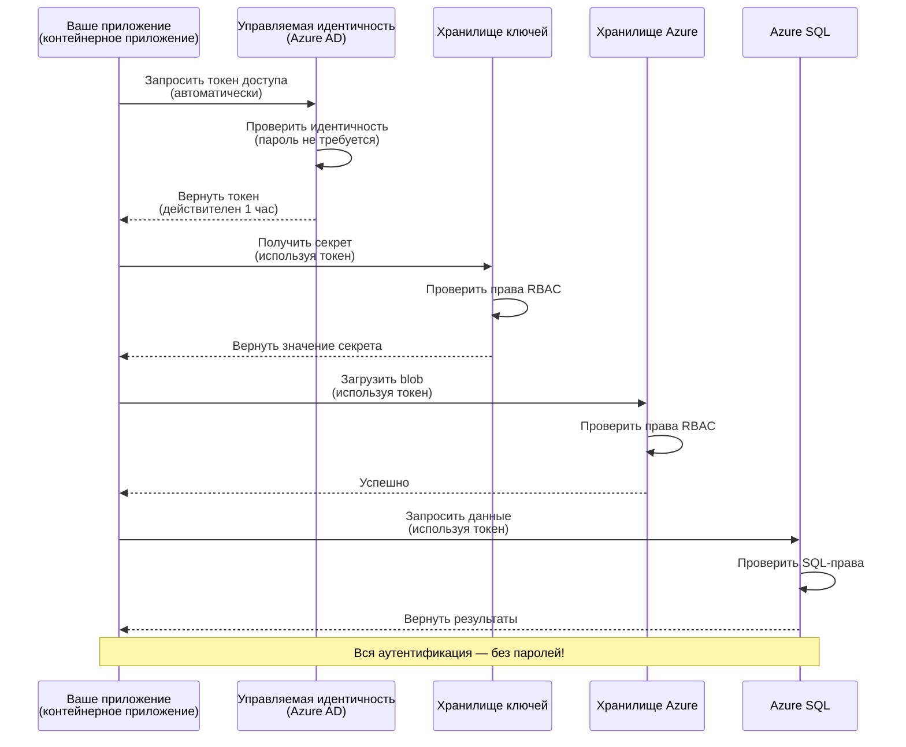
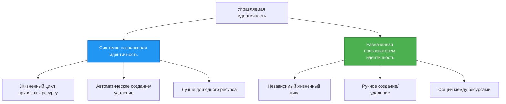

# Шаблоны аутентификации и Managed Identity

⏱️ **Примерное время**: 45-60 минут | 💰 **Влияние на стоимость**: Бесплатно (без дополнительных сборов) | ⭐ **Сложность**: Средний

**📚 Учебный план:**
- ← Предыдущая: [Управление конфигурацией](configuration.md) - Управление переменными окружения и секретами
- 🎯 **Вы здесь**: Аутентификация и безопасность (Managed Identity, Key Vault, безопасные практики)
- → Далее: [Первый проект](first-project.md) - Создайте ваше первое приложение AZD
- 🏠 [Главная курса](../../README.md)

---

## Чему вы научитесь

Выполнив этот урок, вы:
- Поймёте шаблоны аутентификации в Azure (ключи, строки подключения, Managed Identity)
- Реализуете **Managed Identity** для аутентификации без паролей
- Защитите секреты с помощью интеграции с **Azure Key Vault**
- Настроите **контроль доступа на основе ролей (RBAC)** для развертываний AZD
- Примените лучшие практики безопасности в Container Apps и службах Azure
- Мигрируете с аутентификации по ключу на аутентификацию по идентичности

## Почему Managed Identity важна

### Проблема: Традиционная аутентификация

**До Managed Identity:**
```javascript
// ❌ РИСК БЕЗОПАСНОСТИ: Жёстко зашитые секреты в коде
const connectionString = "Server=mydb.database.windows.net;User=admin;Password=P@ssw0rd123";
const storageKey = "xK7mN9pQ2wR5tY8uI0oP3aS6dF1gH4jK...";
const cosmosKey = "C2x7B9n4M1p8Q5w3E6r0T2y5U8i1O4p7...";
```

**Проблемы:**
- 🔴 **Секреты, выложенные в коде** — в конфигурационных файлах и переменных окружения
- 🔴 **Ротация учётных данных** требует изменений в коде и повторного развертывания
- 🔴 **Проблемы с аудитом** — кто и когда получил доступ?
- 🔴 **Разброс** — секреты разбросаны по разным системам
- 🔴 **Риски соответствия** — провал на проверках безопасности

### Решение: Managed Identity

**После Managed Identity:**
```javascript
// ✅ БЕЗОПАСНО: В коде нет секретов
const credential = new DefaultAzureCredential();
const client = new BlobServiceClient(
  "https://mystorageaccount.blob.core.windows.net",
  credential  // Azure автоматически обрабатывает аутентификацию
);
```

**Преимущества:**
- ✅ **Никаких секретов** в коде или конфигурации
- ✅ **Автоматическая ротация** — Azure управляет этим
- ✅ **Полный аудит** в логах Azure AD
- ✅ **Централизованная безопасность** — управление через Azure Portal
- ✅ **Готовность к соответствию** — соответствует стандартам безопасности

**Аналогия**: Традиционная аутентификация похожа на ношение множества физических ключей для разных дверей. Managed Identity похожа на пропуск, который автоматически даёт доступ в зависимости от того, кто вы — никаких ключей, которые можно потерять, скопировать или периодически менять.

---

## Обзор архитектуры

### Поток аутентификации с Managed Identity


```mermaid
sequenceDiagram
    participant App as Ваше приложение<br/>(контейнерное приложение)
    participant MI as Управляемая идентичность<br/>(Azure AD)
    participant KV as Хранилище ключей
    participant Storage as Хранилище Azure
    participant DB as Azure SQL
    
    App->>MI: Запросить токен доступа<br/>(автоматически)
    MI->>MI: Проверить идентичность<br/>(пароль не требуется)
    MI-->>App: Вернуть токен<br/>(действителен 1 час)
    
    App->>KV: Получить секрет<br/>(используя токен)
    KV->>KV: Проверить права RBAC
    KV-->>App: Вернуть значение секрета
    
    App->>Storage: Загрузить blob<br/>(используя токен)
    Storage->>Storage: Проверить права RBAC
    Storage-->>App: Успешно
    
    App->>DB: Запросить данные<br/>(используя токен)
    DB->>DB: Проверить SQL-права
    DB-->>App: Вернуть результаты
    
    Note over App,DB: Вся аутентификация — без паролей!
```
### Типы управляемых идентичностей


```mermaid
graph TB
    MI[Управляемая идентичность]
    SystemAssigned[Системно назначенная идентичность]
    UserAssigned[Назначенная пользователем идентичность]
    
    MI --> SystemAssigned
    MI --> UserAssigned
    
    SystemAssigned --> SA1[Жизненный цикл привязан к ресурсу]
    SystemAssigned --> SA2[Автоматическое создание/удаление]
    SystemAssigned --> SA3[Лучше для одного ресурса]
    
    UserAssigned --> UA1[Независимый жизненный цикл]
    UserAssigned --> UA2[Ручное создание/удаление]
    UserAssigned --> UA3[Общий между ресурсами]
    
    style SystemAssigned fill:#2196F3,stroke:#1976D2,stroke-width:2px,color:#fff
    style UserAssigned fill:#4CAF50,stroke:#388E3C,stroke-width:2px,color:#fff
```
| Параметр | System-Assigned | User-Assigned |
|---------|----------------|---------------|
| **Жизненный цикл** | Привязан к ресурсу | Независим |
| **Создание** | Автоматически с ресурсом | Создаётся вручную |
| **Удаление** | Удаляется вместе с ресурсом | Сохраняется после удаления ресурса |
| **Совместное использование** | Только один ресурс | Несколько ресурсов |
| **Сценарий использования** | Простые сценарии | Сложные сценарии с несколькими ресурсами |
| **По умолчанию в AZD** | ✅ Рекомендуется | Опционально |

---

## Предварительные требования

### Необходимые инструменты

Вы уже должны были установить следующее в предыдущих уроках:

```bash
# Проверить Azure Developer CLI
azd version
# ✅ Ожидается: azd версии 1.0.0 или выше

# Проверить Azure CLI
az --version
# ✅ Ожидается: azure-cli версии 2.50.0 или выше
```

### Требования Azure

- Активная подписка Azure
- Права на:
  - Создание управляемых идентичностей
  - Назначение ролей RBAC
  - Создание ресурсов Key Vault
  - Развёртывание Container Apps

### Базовые знания

Вы должны были пройти:
- [Installation Guide](installation.md) - Настройка AZD
- [AZD Basics](azd-basics.md) - Основные концепции
- [Configuration Management](configuration.md) - Переменные окружения

---

## Урок 1: Понимание шаблонов аутентификации

### Шаблон 1: Строки подключения (Устаревшее — избегать)

**Как это работает:**
```bash
# Строка подключения содержит учетные данные
STORAGE_CONNECTION_STRING="DefaultEndpointsProtocol=https;AccountName=myaccount;AccountKey=xK7mN9pQ2wR5..."
COSMOS_CONNECTION_STRING="AccountEndpoint=https://myaccount.documents.azure.com:443/;AccountKey=C2x7..."
SQL_CONNECTION_STRING="Server=myserver.database.windows.net;User=admin;Password=P@ssw0rd..."
```

**Проблемы:**
- ❌ Секреты видны в переменных окружения
- ❌ Логируются в системах развертывания
- ❌ Сложно ротировать
- ❌ Нет аудита доступа

**Когда использовать:** Только для локальной разработки, никогда — в продакшене.

---

### Шаблон 2: Ссылки на Key Vault (Лучше)

**Как это работает:**
```bicep
// Store secret in Key Vault
resource keyVault 'Microsoft.KeyVault/vaults@2023-02-01' = {
  name: 'mykv'
  properties: {
    enableRbacAuthorization: true
  }
}

// Reference in Container App
env: [
  {
    name: 'STORAGE_KEY'
    secretRef: 'storage-key'  // References Key Vault
  }
]
```

**Преимущества:**
- ✅ Секреты хранятся безопасно в Key Vault
- ✅ Централизованное управление секретами
- ✅ Ротация без изменения кода

**Ограничения:**
- ⚠️ Всё ещё используются ключи/пароли
- ⚠️ Нужно управлять доступом к Key Vault

**Когда использовать:** Шаг перехода от строк подключения к Managed Identity.

---

### Шаблон 3: Managed Identity (Лучшая практика)

**Как это работает:**
```bicep
// Enable managed identity
resource containerApp 'Microsoft.App/containerApps@2023-05-01' = {
  name: 'myapp'
  identity: {
    type: 'SystemAssigned'  // Automatically creates identity
  }
}

// Grant permissions
resource roleAssignment 'Microsoft.Authorization/roleAssignments@2022-04-01' = {
  scope: storageAccount
  properties: {
    roleDefinitionId: storageBlobDataContributorRole
    principalId: containerApp.identity.principalId
  }
}
```

**Код приложения:**
```javascript
// Секреты не нужны!
const { DefaultAzureCredential } = require('@azure/identity');
const { BlobServiceClient } = require('@azure/storage-blob');

const credential = new DefaultAzureCredential();
const blobServiceClient = new BlobServiceClient(
  'https://mystorageaccount.blob.core.windows.net',
  credential
);
```

**Преимущества:**
- ✅ Никаких секретов в коде/конфигурации
- ✅ Автоматическая ротация учётных данных
- ✅ Полный аудит
- ✅ Разрешения на основе RBAC
- ✅ Готово к требованиям соответствия

**Когда использовать:** Всегда, для производственных приложений.

---

## Урок 2: Реализация Managed Identity с AZD

### Пошаговая реализация

Давайте создадим безопасный Container App, который использует управляемую идентичность для доступа к Azure Storage и Key Vault.

### Структура проекта

```
secure-app/
├── azure.yaml                 # AZD configuration
├── infra/
│   ├── main.bicep            # Main infrastructure
│   ├── core/
│   │   ├── identity.bicep    # Managed identity setup
│   │   ├── keyvault.bicep    # Key Vault configuration
│   │   └── storage.bicep     # Storage with RBAC
│   └── app/
│       └── container-app.bicep
└── src/
    ├── app.js                # Application code
    ├── package.json
    └── Dockerfile
```

### 1. Настройка AZD (azure.yaml)

```yaml
name: secure-app
metadata:
  template: secure-app@1.0.0

services:
  api:
    project: ./src
    language: js
    host: containerapp

# Enable managed identity (AZD handles this automatically)
```

### 2. Инфраструктура: Включение Managed Identity

**Файл: `infra/main.bicep`**

```bicep
targetScope = 'subscription'

param environmentName string
param location string = 'eastus'

var tags = { 'azd-env-name': environmentName }

// Resource group
resource rg 'Microsoft.Resources/resourceGroups@2021-04-01' = {
  name: 'rg-${environmentName}'
  location: location
  tags: tags
}

// Storage Account
module storage './core/storage.bicep' = {
  name: 'storage'
  scope: rg
  params: {
    name: 'st${uniqueString(rg.id)}'
    location: location
    tags: tags
  }
}

// Key Vault
module keyVault './core/keyvault.bicep' = {
  name: 'keyvault'
  scope: rg
  params: {
    name: 'kv-${uniqueString(rg.id)}'
    location: location
    tags: tags
  }
}

// Container App with Managed Identity
module containerApp './app/container-app.bicep' = {
  name: 'container-app'
  scope: rg
  params: {
    name: 'ca-${environmentName}'
    location: location
    tags: tags
    storageAccountName: storage.outputs.name
    keyVaultName: keyVault.outputs.name
  }
}

// Grant Container App access to Storage
module storageRoleAssignment './core/role-assignment.bicep' = {
  name: 'storage-role'
  scope: rg
  params: {
    principalId: containerApp.outputs.identityPrincipalId
    roleDefinitionId: 'ba92f5b4-2d11-453d-a403-e96b0029c9fe'  // Storage Blob Data Contributor
    targetResourceId: storage.outputs.id
  }
}

// Grant Container App access to Key Vault
module kvRoleAssignment './core/role-assignment.bicep' = {
  name: 'kv-role'
  scope: rg
  params: {
    principalId: containerApp.outputs.identityPrincipalId
    roleDefinitionId: '4633458b-17de-408a-b874-0445c86b69e6'  // Key Vault Secrets User
    targetResourceId: keyVault.outputs.id
  }
}

// Outputs
output AZURE_STORAGE_ACCOUNT_NAME string = storage.outputs.name
output AZURE_KEY_VAULT_NAME string = keyVault.outputs.name
output APP_URL string = containerApp.outputs.url
```

### 3. Container App с системно назначенной идентичностью

**Файл: `infra/app/container-app.bicep`**

```bicep
param name string
param location string
param tags object = {}
param storageAccountName string
param keyVaultName string

resource containerApp 'Microsoft.App/containerApps@2023-05-01' = {
  name: name
  location: location
  tags: tags
  identity: {
    type: 'SystemAssigned'  // 🔑 Enable managed identity
  }
  properties: {
    configuration: {
      ingress: {
        external: true
        targetPort: 3000
      }
    }
    template: {
      containers: [
        {
          name: 'api'
          image: 'myregistry.azurecr.io/api:latest'
          resources: {
            cpu: json('0.5')
            memory: '1Gi'
          }
          env: [
            {
              name: 'AZURE_STORAGE_ACCOUNT_NAME'
              value: storageAccountName
            }
            {
              name: 'AZURE_KEY_VAULT_NAME'
              value: keyVaultName
            }
            // 🔑 No secrets - managed identity handles authentication!
          ]
        }
      ]
    }
  }
}

// Output the identity for RBAC assignments
output identityPrincipalId string = containerApp.identity.principalId
output id string = containerApp.id
output url string = 'https://${containerApp.properties.configuration.ingress.fqdn}'
```

### 4. Модуль назначения RBAC ролей

**Файл: `infra/core/role-assignment.bicep`**

```bicep
param principalId string
param roleDefinitionId string  // Azure built-in role ID
param targetResourceId string

resource roleAssignment 'Microsoft.Authorization/roleAssignments@2022-04-01' = {
  name: guid(principalId, roleDefinitionId, targetResourceId)
  scope: resourceId('Microsoft.Resources/resourceGroups', resourceGroup().name)
  properties: {
    roleDefinitionId: subscriptionResourceId('Microsoft.Authorization/roleDefinitions', roleDefinitionId)
    principalId: principalId
    principalType: 'ServicePrincipal'
  }
}

output id string = roleAssignment.id
```

### 5. Код приложения с Managed Identity

**Файл: `src/app.js`**

```javascript
const express = require('express');
const { DefaultAzureCredential } = require('@azure/identity');
const { BlobServiceClient } = require('@azure/storage-blob');
const { SecretClient } = require('@azure/keyvault-secrets');

const app = express();
const PORT = process.env.PORT || 3000;

// 🔑 Инициализировать учетные данные (работает автоматически с управляемой идентичностью)
const credential = new DefaultAzureCredential();

// Настройка Azure Storage
const storageAccountName = process.env.AZURE_STORAGE_ACCOUNT_NAME;
const blobServiceClient = new BlobServiceClient(
  `https://${storageAccountName}.blob.core.windows.net`,
  credential  // Ключи не требуются!
);

// Настройка Key Vault
const keyVaultName = process.env.AZURE_KEY_VAULT_NAME;
const secretClient = new SecretClient(
  `https://${keyVaultName}.vault.azure.net`,
  credential  // Ключи не требуются!
);

// Проверка работоспособности
app.get('/health', (req, res) => {
  res.json({ status: 'healthy', authentication: 'managed-identity' });
});

// Загрузить файл в Blob-хранилище
app.post('/upload', async (req, res) => {
  try {
    const containerClient = blobServiceClient.getContainerClient('uploads');
    await containerClient.createIfNotExists();
    
    const blobName = `file-${Date.now()}.txt`;
    const blockBlobClient = containerClient.getBlockBlobClient(blobName);
    
    await blockBlobClient.upload('Hello from managed identity!', 30);
    
    res.json({
      success: true,
      blobName: blobName,
      message: 'File uploaded using managed identity!'
    });
  } catch (error) {
    console.error('Upload error:', error);
    res.status(500).json({ error: error.message });
  }
});

// Получить секрет из Key Vault
app.get('/secret/:name', async (req, res) => {
  try {
    const secretName = req.params.name;
    const secret = await secretClient.getSecret(secretName);
    
    res.json({
      name: secretName,
      value: secret.value,
      message: 'Secret retrieved using managed identity!'
    });
  } catch (error) {
    console.error('Secret error:', error);
    res.status(500).json({ error: error.message });
  }
});

// Перечислить контейнеры Blob (демонстрирует доступ для чтения)
app.get('/containers', async (req, res) => {
  try {
    const containers = [];
    for await (const container of blobServiceClient.listContainers()) {
      containers.push(container.name);
    }
    
    res.json({
      containers: containers,
      count: containers.length,
      message: 'Containers listed using managed identity!'
    });
  } catch (error) {
    console.error('List error:', error);
    res.status(500).json({ error: error.message });
  }
});

app.listen(PORT, () => {
  console.log(`Secure API listening on port ${PORT}`);
  console.log('Authentication: Managed Identity (passwordless)');
});
```

**Файл: `src/package.json`**

```json
{
  "name": "secure-app",
  "version": "1.0.0",
  "dependencies": {
    "express": "^4.18.2",
    "@azure/identity": "^4.0.0",
    "@azure/storage-blob": "^12.17.0",
    "@azure/keyvault-secrets": "^4.7.0"
  },
  "scripts": {
    "start": "node app.js"
  }
}
```

### 6. Развёртывание и тестирование

```bash
# Инициализировать окружение AZD
azd init

# Развернуть инфраструктуру и приложение
azd up

# Получить URL приложения
APP_URL=$(azd env get-values | grep APP_URL | cut -d '=' -f2 | tr -d '"')

# Проверить работоспособность
curl $APP_URL/health
```

**✅ Ожидаемый вывод:**
```json
{
  "status": "healthy",
  "authentication": "managed-identity"
}
```

**Тест загрузки blob:**
```bash
curl -X POST $APP_URL/upload
```

**✅ Ожидаемый вывод:**
```json
{
  "success": true,
  "blobName": "file-1700404800000.txt",
  "message": "File uploaded using managed identity!"
}
```

**Тест списка контейнеров:**
```bash
curl $APP_URL/containers
```

**✅ Ожидаемый вывод:**
```json
{
  "containers": ["uploads"],
  "count": 1,
  "message": "Containers listed using managed identity!"
}
```

---

## Общие роли Azure RBAC

### Встроенные идентификаторы ролей для Managed Identity

| Служба | Название роли | Идентификатор роли | Разрешения |
|---------|-----------|---------|-------------|
| **Storage** | Storage Blob Data Reader | `2a2b9908-6b94-4a3d-8e5a-a7d8f8cc8a12` | Чтение blob-объектов и контейнеров |
| **Storage** | Storage Blob Data Contributor | `ba92f5b4-2d11-453d-a403-e96b0029c9fe` | Чтение, запись, удаление blob-объектов |
| **Storage** | Storage Queue Data Contributor | `974c5e8b-45b9-4653-ba55-5f855dd0fb88` | Чтение, запись, удаление сообщений очереди |
| **Key Vault** | Key Vault Secrets User | `4633458b-17de-408a-b874-0445c86b69e6` | Чтение секретов |
| **Key Vault** | Key Vault Secrets Officer | `b86a8fe4-44ce-4948-aee5-eccb2c155cd7` | Чтение, запись, удаление секретов |
| **Cosmos DB** | Cosmos DB Built-in Data Reader | `00000000-0000-0000-0000-000000000001` | Чтение данных Cosmos DB |
| **Cosmos DB** | Cosmos DB Built-in Data Contributor | `00000000-0000-0000-0000-000000000002` | Чтение, запись данных Cosmos DB |
| **SQL Database** | SQL DB Contributor | `9b7fa17d-e63e-47b0-bb0a-15c516ac86ec` | Управление базами данных SQL |
| **Service Bus** | Azure Service Bus Data Owner | `090c5cfd-751d-490a-894a-3ce6f1109419` | Отправка, получение и управление сообщениями |

### Как найти идентификаторы ролей

```bash
# Перечислить все встроенные роли
az role definition list --query "[].{Name:roleName, ID:name}" --output table

# Поиск конкретной роли
az role definition list --query "[?contains(roleName, 'Storage Blob')].{Name:roleName, ID:name}" --output table

# Получить сведения о роли
az role definition list --name "Storage Blob Data Contributor"
```

---

## Практические упражнения

### Упражнение 1: Включить Managed Identity для существующего приложения ⭐⭐ (Средний)

**Цель**: Добавить управляемую идентичность в существующее развертывание Container App

**Сценарий**: У вас есть Container App, использующий строки подключения. Конвертируйте его на Managed Identity.

**Стартовая точка**: Container App с этой конфигурацией:

```bicep
// ❌ Current: Using connection string
env: [
  {
    name: 'STORAGE_CONNECTION_STRING'
    secretRef: 'storage-connection'
  }
]
```

**Шаги**:

1. **Включите managed identity в Bicep:**

```bicep
resource containerApp 'Microsoft.App/containerApps@2023-05-01' = {
  name: 'myapp'
  identity: {
    type: 'SystemAssigned'  // Add this
  }
  // ... rest of configuration
}
```

2. **Предоставьте доступ к Storage:**

```bicep
// Get storage account reference
resource storageAccount 'Microsoft.Storage/storageAccounts@2023-01-01' existing = {
  name: storageAccountName
}

// Assign role
resource roleAssignment 'Microsoft.Authorization/roleAssignments@2022-04-01' = {
  name: guid(containerApp.id, 'ba92f5b4-2d11-453d-a403-e96b0029c9fe', storageAccount.id)
  scope: storageAccount
  properties: {
    roleDefinitionId: subscriptionResourceId('Microsoft.Authorization/roleDefinitions', 'ba92f5b4-2d11-453d-a403-e96b0029c9fe')
    principalId: containerApp.identity.principalId
    principalType: 'ServicePrincipal'
  }
}
```

3. **Обновите код приложения:**

**До (строка подключения):**
```javascript
const { BlobServiceClient } = require('@azure/storage-blob');

const blobServiceClient = BlobServiceClient.fromConnectionString(
  process.env.STORAGE_CONNECTION_STRING
);
```

**После (managed identity):**
```javascript
const { DefaultAzureCredential } = require('@azure/identity');
const { BlobServiceClient } = require('@azure/storage-blob');

const credential = new DefaultAzureCredential();
const blobServiceClient = new BlobServiceClient(
  `https://${process.env.STORAGE_ACCOUNT_NAME}.blob.core.windows.net`,
  credential
);
```

4. **Обновите переменные окружения:**

```bicep
env: [
  {
    name: 'STORAGE_ACCOUNT_NAME'
    value: storageAccountName  // Just the name, no secrets!
  }
  // Remove STORAGE_CONNECTION_STRING
]
```

5. **Разверните и протестируйте:**

```bash
# Переразвернуть
azd up

# Проверьте, что это всё ещё работает
curl https://myapp.azurecontainerapps.io/upload
```

**✅ Критерии успешности:**
- ✅ Приложение разворачивается без ошибок
- ✅ Операции со Storage работают (загрузка, просмотр, скачивание)
- ✅ Строк подключения отсутствуют в переменных окружения
- ✅ Идентичность видна в Azure Portal на вкладке "Identity"

**Проверка:**

```bash
# Проверьте, что управляемая идентичность включена
az containerapp show \
  --name myapp \
  --resource-group rg-myapp \
  --query "identity.type"
# ✅ Ожидается: "SystemAssigned"

# Проверьте назначение роли
az role assignment list \
  --assignee $(az containerapp show --name myapp --resource-group rg-myapp --query "identity.principalId" -o tsv) \
  --scope /subscriptions/{sub-id}/resourceGroups/rg-myapp/providers/Microsoft.Storage/storageAccounts/mystorageaccount
# ✅ Ожидается: Показывает роль "Storage Blob Data Contributor"
```

**Время**: 20-30 минут

---

### Упражнение 2: Доступ нескольких служб с пользовательской идентичностью ⭐⭐⭐ (Продвинутый)

**Цель**: Создать user-assigned identity, общую для нескольких Container Apps

**Сценарий**: У вас есть 3 микросервиса, которым нужен доступ к одному и тому же аккаунту Storage и Key Vault.

**Шаги**:

1. **Создайте user-assigned identity:**

**Файл: `infra/core/identity.bicep`**

```bicep
param name string
param location string
param tags object = {}

resource userAssignedIdentity 'Microsoft.ManagedIdentity/userAssignedIdentities@2023-01-31' = {
  name: name
  location: location
  tags: tags
}

output id string = userAssignedIdentity.id
output principalId string = userAssignedIdentity.properties.principalId
output clientId string = userAssignedIdentity.properties.clientId
```

2. **Назначьте роли user-assigned identity:**

```bicep
// In main.bicep
module userIdentity './core/identity.bicep' = {
  name: 'user-identity'
  scope: rg
  params: {
    name: 'id-${environmentName}'
    location: location
    tags: tags
  }
}

// Grant Storage access
resource storageRoleAssignment 'Microsoft.Authorization/roleAssignments@2022-04-01' = {
  name: guid(userIdentity.outputs.principalId, 'storage-contributor')
  scope: storageAccount
  properties: {
    roleDefinitionId: subscriptionResourceId('Microsoft.Authorization/roleDefinitions', 'ba92f5b4-2d11-453d-a403-e96b0029c9fe')
    principalId: userIdentity.outputs.principalId
    principalType: 'ServicePrincipal'
  }
}

// Grant Key Vault access
resource kvRoleAssignment 'Microsoft.Authorization/roleAssignments@2022-04-01' = {
  name: guid(userIdentity.outputs.principalId, 'kv-secrets-user')
  scope: keyVault
  properties: {
    roleDefinitionId: subscriptionResourceId('Microsoft.Authorization/roleDefinitions', '4633458b-17de-408a-b874-0445c86b69e6')
    principalId: userIdentity.outputs.principalId
    principalType: 'ServicePrincipal'
  }
}
```

3. **Назначьте идентичность нескольким Container Apps:**

```bicep
resource apiGateway 'Microsoft.App/containerApps@2023-05-01' = {
  name: 'api-gateway'
  identity: {
    type: 'UserAssigned'
    userAssignedIdentities: {
      '${userIdentity.outputs.id}': {}
    }
  }
  // ... rest of config
}

resource productService 'Microsoft.App/containerApps@2023-05-01' = {
  name: 'product-service'
  identity: {
    type: 'UserAssigned'
    userAssignedIdentities: {
      '${userIdentity.outputs.id}': {}
    }
  }
  // ... rest of config
}

resource orderService 'Microsoft.App/containerApps@2023-05-01' = {
  name: 'order-service'
  identity: {
    type: 'UserAssigned'
    userAssignedIdentities: {
      '${userIdentity.outputs.id}': {}
    }
  }
  // ... rest of config
}
```

4. **Код приложения (все сервисы используют один и тот же шаблон):**

```javascript
const { DefaultAzureCredential, ManagedIdentityCredential } = require('@azure/identity');

// Для назначенной пользователем идентичности укажите идентификатор клиента
const credential = new ManagedIdentityCredential(
  process.env.AZURE_CLIENT_ID  // Идентификатор клиента назначенной пользователем идентичности
);

// Или используйте DefaultAzureCredential (автоматическое определение)
const credential = new DefaultAzureCredential();

const blobServiceClient = new BlobServiceClient(
  `https://${process.env.STORAGE_ACCOUNT_NAME}.blob.core.windows.net`,
  credential
);
```

5. **Разверните и проверьте:**

```bash
azd up

# Проверить, что все сервисы могут получить доступ к хранилищу
curl https://api-gateway.azurecontainerapps.io/upload
curl https://product-service.azurecontainerapps.io/upload
curl https://order-service.azurecontainerapps.io/upload
```

**✅ Критерии успешности:**
- ✅ Одна идентичность, общая для 3 сервисов
- ✅ Все сервисы могут получить доступ к Storage и Key Vault
- ✅ Идентичность сохраняется при удалении одного сервиса
- ✅ Централизованное управление правами

**Преимущества user-assigned identity:**
- Одна идентичность для управления
- Последовательные права для всех сервисов
- Выживаемость при удалении сервисов
- Лучше для сложной архитектуры

**Время**: 30-40 минут

---

### Упражнение 3: Реализовать ротацию секретов в Key Vault ⭐⭐⭐ (Продвинутый)

**Цель**: Хранить API-ключи сторонних сервисов в Key Vault и получать их с помощью managed identity

**Сценарий**: Вашему приложению нужно вызывать внешний API (OpenAI, Stripe, SendGrid), который требует API-ключи.

**Шаги**:

1. **Создайте Key Vault с RBAC:**

**Файл: `infra/core/keyvault.bicep`**

```bicep
param name string
param location string
param tags object = {}

resource keyVault 'Microsoft.KeyVault/vaults@2023-02-01' = {
  name: name
  location: location
  tags: tags
  properties: {
    enableRbacAuthorization: true  // Use RBAC instead of access policies
    sku: {
      family: 'A'
      name: 'standard'
    }
    tenantId: subscription().tenantId
    enableSoftDelete: true
    softDeleteRetentionInDays: 90
  }
}

// Allow Container App to read secrets
output id string = keyVault.id
output name string = keyVault.name
output uri string = keyVault.properties.vaultUri
```

2. **Сохраните секреты в Key Vault:**

```bash
# Получить имя хранилища ключей
KV_NAME=$(azd env get-values | grep AZURE_KEY_VAULT_NAME | cut -d '=' -f2 | tr -d '"')

# Хранить API-ключи третьих сторон
az keyvault secret set \
  --vault-name $KV_NAME \
  --name "OpenAI-ApiKey" \
  --value "sk-proj-xxxxxxxxxxxxx"

az keyvault secret set \
  --vault-name $KV_NAME \
  --name "Stripe-ApiKey" \
  --value "sk_live_xxxxxxxxxxxxx"

az keyvault secret set \
  --vault-name $KV_NAME \
  --name "SendGrid-ApiKey" \
  --value "SG.xxxxxxxxxxxxx"
```

3. **Код приложения для получения секретов:**

**Файл: `src/config.js`**

```javascript
const { DefaultAzureCredential } = require('@azure/identity');
const { SecretClient } = require('@azure/keyvault-secrets');

class Config {
  constructor() {
    this.credential = new DefaultAzureCredential();
    this.secretClient = new SecretClient(
      `https://${process.env.AZURE_KEY_VAULT_NAME}.vault.azure.net`,
      this.credential
    );
    this.cache = {};
  }

  async getSecret(secretName) {
    // Сначала проверьте кэш
    if (this.cache[secretName]) {
      return this.cache[secretName];
    }

    try {
      const secret = await this.secretClient.getSecret(secretName);
      this.cache[secretName] = secret.value;
      console.log(`✅ Retrieved secret: ${secretName}`);
      return secret.value;
    } catch (error) {
      console.error(`❌ Failed to get secret ${secretName}:`, error.message);
      throw error;
    }
  }

  async getOpenAIKey() {
    return this.getSecret('OpenAI-ApiKey');
  }

  async getStripeKey() {
    return this.getSecret('Stripe-ApiKey');
  }

  async getSendGridKey() {
    return this.getSecret('SendGrid-ApiKey');
  }
}

module.exports = new Config();
```

4. **Используйте секреты в приложении:**

**Файл: `src/app.js`**

```javascript
const express = require('express');
const config = require('./config');
const { OpenAI } = require('openai');

const app = express();

// Инициализировать OpenAI, используя ключ из Key Vault
let openaiClient;

async function initializeServices() {
  const openaiKey = await config.getOpenAIKey();
  openaiClient = new OpenAI({ apiKey: openaiKey });
  console.log('✅ Services initialized with secrets from Key Vault');
}

// Вызывать при запуске
initializeServices().catch(console.error);

app.post('/chat', async (req, res) => {
  try {
    const completion = await openaiClient.chat.completions.create({
      model: 'gpt-4',
      messages: [{ role: 'user', content: 'Hello!' }]
    });
    
    res.json({
      response: completion.choices[0].message.content,
      authentication: 'Key from Key Vault via Managed Identity'
    });
  } catch (error) {
    res.status(500).json({ error: error.message });
  }
});

app.listen(3000, () => {
  console.log('Secure API with Key Vault integration running');
});
```

5. **Разверните и протестируйте:**

```bash
azd up

# Проверить, что API-ключи работают
curl -X POST https://myapp.azurecontainerapps.io/chat \
  -H "Content-Type: application/json" \
  -d '{"message":"Hello AI"}'
```

**✅ Критерии успешности:**
- ✅ Ни одного API-ключа в коде или переменных окружения
- ✅ Приложение получает ключи из Key Vault
- ✅ Внешние API работают корректно
- ✅ Можно ротировать ключи без изменения кода

**Ротация секрета:**

```bash
# Обновить секрет в Key Vault
az keyvault secret set \
  --vault-name $KV_NAME \
  --name "OpenAI-ApiKey" \
  --value "sk-proj-NEW_KEY_HERE"

# Перезапустить приложение, чтобы применить новый ключ
az containerapp revision restart \
  --name myapp \
  --resource-group rg-myapp
```

**Время**: 25-35 минут

---

## Контроль знаний

### 1. Шаблоны аутентификации ✓

Проверьте свои знания:

- [ ] **Q1**: Каковы три основных шаблона аутентификации? 
  - **A**: Строки подключения (устаревшие), Ссылки на Key Vault (переход), Managed Identity (лучше)

- [ ] **Q2**: Почему managed identity лучше, чем строки подключения?
  - **A**: Нет секретов в коде, автоматическая ротация, полный аудит, разрешения на основе RBAC

- [ ] **Q3**: Когда следует использовать user-assigned identity вместо system-assigned?
  - **A**: Когда идентичность нужно разделять между несколькими ресурсами или когда жизненный цикл идентичности независим от ресурса

**Проверка на ходу:**
```bash
# Проверьте, какой тип идентичности использует ваше приложение
az containerapp show \
  --name myapp \
  --resource-group rg-myapp \
  --query "identity.type"

# Перечислите все назначения ролей для этой идентичности
az role assignment list \
  --assignee $(az containerapp show --name myapp --resource-group rg-myapp --query "identity.principalId" -o tsv)
```

---

### 2. RBAC и разрешения ✓

Проверьте свои знания:

- [ ] **Q1**: Какой идентификатор роли у "Storage Blob Data Contributor"?
  - **A**: `ba92f5b4-2d11-453d-a403-e96b0029c9fe`

- [ ] **Q2**: Какие разрешения даёт "Key Vault Secrets User"?
  - **A**: Доступ только для чтения секретов (нельзя создавать, обновлять или удалять)

- [ ] **Q3**: Как предоставить Container App доступ к Azure SQL?
  - **A**: Назначить роль "SQL DB Contributor" или настроить аутентификацию Azure AD для SQL

**Проверка на ходу:**
```bash
# Найти конкретную роль
az role definition list --name "Storage Blob Data Contributor"

# Проверьте, какие роли назначены вашей идентичности
PRINCIPAL_ID=$(az containerapp show --name myapp --resource-group rg-myapp --query "identity.principalId" -o tsv)
az role assignment list --assignee $PRINCIPAL_ID --output table
```

---

### 3. Интеграция с Key Vault ✓
- [ ] **Q1**: Как включить RBAC для Key Vault вместо политик доступа?
  - **A**: Установите `enableRbacAuthorization: true` в Bicep

- [ ] **Q2**: Какая библиотека Azure SDK обрабатывает аутентификацию управляемой идентичностью?
  - **A**: `@azure/identity` с классом `DefaultAzureCredential`

- [ ] **Q3**: Как долго секреты Key Vault остаются в кэше?
  - **A**: Зависит от приложения; реализуйте собственную стратегию кэширования

**Практическая проверка:**
```bash
# Проверить доступ к Key Vault
az keyvault secret show \
  --vault-name $KV_NAME \
  --name "OpenAI-ApiKey" \
  --query "value"

# Проверить, что RBAC включён
az keyvault show \
  --name $KV_NAME \
  --query "properties.enableRbacAuthorization"
# ✅ Ожидается: true
```

---

## Лучшие практики безопасности

### ✅ ДЕЛАТЬ:

1. **Всегда используйте управляемую идентичность в продакшене**
   ```bicep
   identity: {
     type: 'SystemAssigned'
   }
   ```

2. **Используйте RBAC роли с минимальными привилегиями**
   - Используйте роль "Reader", когда это возможно
   - Избегайте "Owner" или "Contributor", если это не необходимо

3. **Храните ключи третьих сторон в Key Vault**
   ```javascript
   const apiKey = await secretClient.getSecret('ThirdPartyApiKey');
   ```

4. **Включите аудит и журналирование**
   ```bicep
   diagnosticSettings: {
     logs: [{ category: 'AuditEvent', enabled: true }]
   }
   ```

5. **Используйте разные идентичности для dev/staging/prod**
   ```bash
   azd env new dev
   azd env new staging
   azd env new prod
   ```

6. **Регулярно меняйте секреты**
   - Устанавливайте даты истечения для секретов Key Vault
   - Автоматизируйте ротацию с помощью Azure Functions

### ❌ НЕ ДЕЛАЙТЕ:

1. **Никогда не храните секреты в коде**
   ```javascript
   // ❌ ПЛОХО
   const apiKey = "sk-proj-xxxxxxxxxxxxx";
   ```

2. **Не используйте строки подключения в продакшене**
   ```javascript
   // ❌ ПЛОХО
   BlobServiceClient.fromConnectionString(process.env.STORAGE_CONNECTION_STRING)
   ```

3. **Не предоставляйте избыточные разрешения**
   ```bicep
   // ❌ BAD - too much access
   roleDefinitionId: 'Owner'
   
   // ✅ GOOD - least privilege
   roleDefinitionId: 'Storage Blob Data Reader'
   ```

4. **Не логируйте секреты**
   ```javascript
   // ❌ ПЛОХО
   console.log('API Key:', apiKey);
   
   // ✅ ХОРОШО
   console.log('API Key retrieved successfully');
   ```

5. **Не используйте идентичности продакшена совместно между средами**
   ```bicep
   // ❌ BAD - same identity for dev and prod
   // ✅ GOOD - separate identities per environment
   ```

---

## Руководство по устранению неполадок

### Проблема: "Unauthorized" при доступе к Azure Storage

**Симптомы:**
```
Error: Unauthorized (403)
AuthorizationPermissionMismatch: This request is not authorized to perform this operation
```

**Диагностика:**

```bash
# Проверьте, включена ли управляемая идентичность
az containerapp show \
  --name myapp \
  --resource-group rg-myapp \
  --query "identity.type"
# ✅ Ожидается: "SystemAssigned" или "UserAssigned"

# Проверьте назначения ролей
PRINCIPAL_ID=$(az containerapp show --name myapp --resource-group rg-myapp --query "identity.principalId" -o tsv)
az role assignment list --assignee $PRINCIPAL_ID

# Ожидается: увидеть "Storage Blob Data Contributor" или аналогичную роль
```

**Решения:**

1. **Предоставьте правильную роль RBAC:**
```bash
STORAGE_ID=$(az storage account show --name mystorageaccount --resource-group rg-myapp --query "id" -o tsv)
az role assignment create \
  --assignee $PRINCIPAL_ID \
  --role "Storage Blob Data Contributor" \
  --scope $STORAGE_ID
```

2. **Подождите распространения изменений (может занять 5-10 минут):**
```bash
# Проверить статус назначения роли
az role assignment list --assignee $PRINCIPAL_ID --scope $STORAGE_ID
```

3. **Убедитесь, что код приложения использует правильные учетные данные:**
```javascript
// Убедитесь, что вы используете DefaultAzureCredential
const credential = new DefaultAzureCredential();
```

---

### Проблема: отказ в доступе к Key Vault

**Симптомы:**
```
Error: Forbidden (403)
The user, group or application does not have secrets get permission
```

**Диагностика:**

```bash
# Проверить, что для Key Vault включён RBAC
az keyvault show \
  --name $KV_NAME \
  --query "properties.enableRbacAuthorization"
# ✅ Ожидается: true

# Проверить назначения ролей
az role assignment list \
  --assignee $PRINCIPAL_ID \
  --scope /subscriptions/{sub-id}/resourceGroups/rg-myapp/providers/Microsoft.KeyVault/vaults/$KV_NAME
```

**Решения:**

1. **Включите RBAC для Key Vault:**
```bash
az keyvault update \
  --name $KV_NAME \
  --enable-rbac-authorization true
```

2. **Предоставьте роль Key Vault Secrets User:**
```bash
KV_ID=$(az keyvault show --name $KV_NAME --query "id" -o tsv)
az role assignment create \
  --assignee $PRINCIPAL_ID \
  --role "Key Vault Secrets User" \
  --scope $KV_ID
```

---

### Проблема: DefaultAzureCredential не работает локально

**Симптомы:**
```
Error: DefaultAzureCredential failed to retrieve a token
CredentialUnavailableError: No credential available
```

**Диагностика:**

```bash
# Проверьте, вошли ли вы в систему
az account show

# Проверьте аутентификацию Azure CLI
az ad signed-in-user show
```

**Решения:**

1. **Войдите в Azure CLI:**
```bash
az login
```

2. **Выберите подписку Azure:**
```bash
az account set --subscription "Your Subscription Name"
```

3. **Для локальной разработки используйте переменные окружения:**
```bash
export AZURE_TENANT_ID="your-tenant-id"
export AZURE_CLIENT_ID="your-client-id"
export AZURE_CLIENT_SECRET="your-client-secret"
```

4. **Или используйте другой локальный провайдер учетных данных:**
```javascript
const { DefaultAzureCredential, AzureCliCredential } = require('@azure/identity');

// Используйте AzureCliCredential для локальной разработки
const credential = process.env.NODE_ENV === 'production' 
  ? new DefaultAzureCredential()
  : new AzureCliCredential();
```

---

### Проблема: назначение роли распространяется слишком долго

**Симптомы:**
- Роль успешно назначена
- По-прежнему получаете ошибки 403
- Непостоянный доступ (иногда работает, иногда нет)

**Объяснение:**
Изменения в Azure RBAC могут распространяться глобально в течение 5-10 минут.

**Решение:**

```bash
# Подождите и повторите попытку
echo "Waiting for RBAC propagation..."
sleep 300  # Подождите 5 минут

# Проверьте доступ
curl https://myapp.azurecontainerapps.io/upload

# Если по-прежнему не работает, перезапустите приложение
az containerapp revision restart \
  --name myapp \
  --resource-group rg-myapp
```

---

## Учет затрат

### Стоимость управляемой идентичности

| Ресурс | Стоимость |
|----------|------|
| **Управляемая идентичность** | 🆓 **БЕСПЛАТНО** - Без комиссии |
| **Назначения ролей RBAC** | 🆓 **БЕСПЛАТНО** - Без комиссии |
| **Запросы токенов Azure AD** | 🆓 **БЕСПЛАТНО** - Включено |
| **Операции Key Vault** | $0.03 за 10,000 операций |
| **Хранение в Key Vault** | $0.024 за секрет в месяц |

**Управляемая идентичность экономит средства за счет:**
- ✅ Исключения операций Key Vault при аутентификации сервисов между собой
- ✅ Снижения числа инцидентов безопасности (нет утечек учетных данных)
- ✅ Снижения операционных затрат (нет ручной ротации)

**Пример сравнения затрат (в месяц):**

| Сценарий | Строки подключения | Управляемая идентичность | Экономия |
|----------|-------------------|-------------------------|---------|
| Маленькое приложение (1M запросов) | ~$50 (Key Vault + операции) | ~$0 | $50/месяц |
| Среднее приложение (10M запросов) | ~$200 | ~$0 | $200/месяц |
| Крупное приложение (100M запросов) | ~$1,500 | ~$0 | $1,500/месяц |

---

## Узнать больше

### Официальная документация
- [Управляемые идентичности Azure](https://learn.microsoft.com/entra/identity/managed-identities-azure-resources/overview)
- [Azure RBAC](https://learn.microsoft.com/azure/role-based-access-control/overview)
- [Azure Key Vault](https://learn.microsoft.com/azure/key-vault/general/overview)
- [DefaultAzureCredential](https://learn.microsoft.com/dotnet/api/azure.identity.defaultazurecredential)

### Документация SDK
- [@azure/identity (Node.js)](https://www.npmjs.com/package/@azure/identity)
- [Azure.Identity (C#)](https://www.nuget.org/packages/Azure.Identity/)
- [azure-identity (Python)](https://pypi.org/project/azure-identity/)

### Следующие шаги в этом курсе
- ← Предыдущая: [Управление конфигурацией](configuration.md)
- → Следующая: [Первый проект](first-project.md)
- 🏠 [Домашняя страница курса](../../README.md)

### Связанные примеры
- [Azure OpenAI Chat Example](../../../../examples/azure-openai-chat) - Использует управляемую идентичность для Azure OpenAI
- [Microservices Example](../../../../examples/microservices) - Паттерны аутентификации для нескольких сервисов

---

## Итоги

**Вы узнали:**
- ✅ Три шаблона аутентификации (строки подключения, Key Vault, управляемая идентичность)
- ✅ Как включить и настроить управляемую идентичность в AZD
- ✅ Назначения ролей RBAC для сервисов Azure
- ✅ Интеграция Key Vault для секретов третьих сторон
- ✅ Идентичности, назначаемые пользователем, и системно назначаемые идентичности
- ✅ Лучшие практики безопасности и устранение неполадок

**Ключевые выводы:**
1. **Всегда используйте управляемую идентичность в продакшене** - никаких секретов, автоматическая ротация
2. **Используйте RBAC роли с минимальными привилегиями** - предоставляйте только необходимые разрешения
3. **Храните ключи третьих сторон в Key Vault** - централизованное управление секретами
4. **Разделяйте идентичности по средам** - изоляция dev, staging, prod
5. **Включите аудит и журналирование** - отслеживайте, кто что запрашивал

**Следующие шаги:**
1. Выполните практические задания выше
2. Перенесите существующее приложение со строк подключения на управляемую идентичность
3. Создайте свой первый проект AZD с изначальной безопасностью: [Первый проект](first-project.md)

---

<!-- CO-OP TRANSLATOR DISCLAIMER START -->
Отказ от ответственности:
Этот документ был переведён с помощью сервиса перевода с использованием ИИ Co-op Translator (https://github.com/Azure/co-op-translator). Хотя мы стремимся к точности, просим учитывать, что автоматические переводы могут содержать ошибки или неточности. Оригинальный документ в его исходном языке следует считать авторитетным источником. Для критически важной информации рекомендуется воспользоваться услугами профессионального переводчика. Мы не несем ответственности за любые недоразумения или неверные толкования, возникшие в результате использования данного перевода.
<!-- CO-OP TRANSLATOR DISCLAIMER END -->