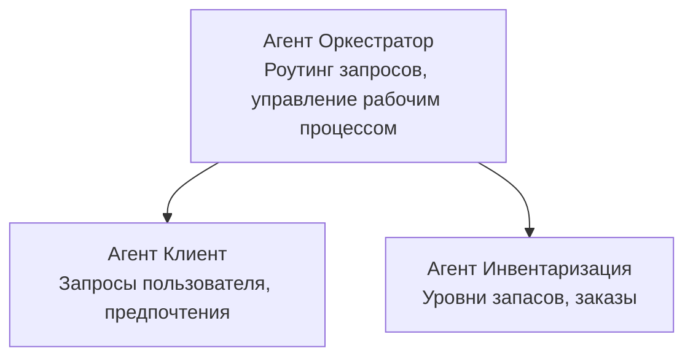

# Глава 5: Многоагентные ИИ решения

**📚 Курс**: [AZD для начинающих](../../README.md) | **⏱️ Продолжительность**: 2-3 часа | **⭐ Сложность**: Продвинутый

---

## Обзор

В этой главе рассматриваются продвинутые шаблоны многоагентной архитектуры, оркестровка агентов и готовые к производству ИИ-развертывания для сложных сценариев.

> Проверено с помощью `azd 1.23.12` в марте 2026 года.

## Цели обучения

Завершив эту главу, вы:
- Поймете шаблоны многоагентной архитектуры
- Развернете скоординированные системы ИИ-агентов
- Реализуете коммуникацию между агентами
- Создадите готовые к производству многоагентные решения

---

## 📚 Уроки

| # | Урок | Описание | Время |
|---|--------|-------------|------|
| 1 | [Многоагентное решение для ритейла](../../examples/retail-scenario.md) | Полный разбор реализации | 90 мин |
| 2 | [Шаблоны координации](../chapter-06-pre-deployment/coordination-patterns.md) | Стратегии оркестровки агентов | 30 мин |
| 3 | [Развертывание ARM шаблона](../../examples/retail-multiagent-arm-template/README.md) | Развертывание в один клик | 30 мин |

---

## 🚀 Быстрый старт

```bash
# Вариант 1: Развернуть из шаблона
azd init --template agent-openai-python-prompty
azd up

# Вариант 2: Развернуть из манифеста агента (требуется расширение azure.ai.agents)
azd extension install azure.ai.agents
azd ai agent init -m agent-manifest.yaml
azd up
```

> **Какой подход выбрать?** Используйте `azd init --template`, чтобы начать с рабочего примера. Используйте `azd ai agent init`, когда у вас есть собственный манифест агента. Полные сведения см. в [справочнике AZD AI CLI](../chapter-08-production/production-ai-practices.md#azd-ai-cli-commands-and-extensions).

---

## 🤖 Многоагентная архитектура


---

## 🎯 Рекомендуемое решение: Многоагентный ритейл

[Многоагентное ритейл-решение](../../examples/retail-scenario.md) демонстрирует:

- **Агент клиента**: Обрабатывает взаимодействия с пользователем и предпочтения
- **Агент учета запасов**: Управляет запасами и обработкой заказов
- **Оркестратор**: Координирует работу между агентами
- **Общая память**: Управление контекстом между агентами

### Используемые сервисы

| Сервис | Назначение |
|---------|---------|
| Microsoft Foundry Models | Понимание естественного языка |
| Azure AI Search | Каталог продуктов |
| Cosmos DB | Состояние и память агентов |
| Container Apps | Хостинг агентов |
| Application Insights | Мониторинг |

---

## 🔗 Навигация

| Направление | Глава |
|-----------|---------|
| **Предыдущая** | [Глава 4: Инфраструктура](../chapter-04-infrastructure/README.md) |
| **Следующая** | [Глава 6: Предварительное развертывание](../chapter-06-pre-deployment/README.md) |

---

## 📖 Связанные ресурсы

- [Руководство по ИИ-агентам](../chapter-02-ai-development/agents.md)
- [Практики производства ИИ](../chapter-08-production/production-ai-practices.md)
- [Устранение неисправностей ИИ](../chapter-07-troubleshooting/ai-troubleshooting.md)

---

<!-- CO-OP TRANSLATOR DISCLAIMER START -->
**Отказ от ответственности**:  
Этот документ был переведен с помощью сервиса автоматического перевода [Co-op Translator](https://github.com/Azure/co-op-translator). Несмотря на усилия по обеспечению точности, имейте в виду, что автоматические переводы могут содержать ошибки или неточности. Оригинальный документ на его родном языке следует считать авторитетным источником. Для получения критически важной информации рекомендуется обращаться к профессиональному переводу, выполненному человеком. Мы не несем ответственности за любые недоразумения или неверные толкования, возникшие в результате использования этого перевода.
<!-- CO-OP TRANSLATOR DISCLAIMER END -->