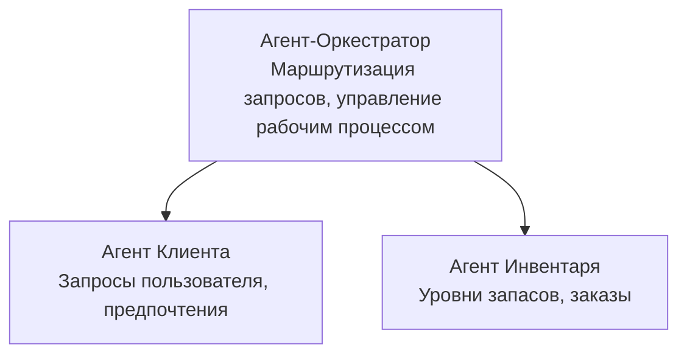

# Глава 5: Мультиагентные AI Рeшения

**📚 Курс**: [AZD Для начинающих](../../README.md) | **⏱️ Длительность**: 2-3 часа | **⭐ Сложность**: Продвинутый

---

## Обзор

В этой главе рассматриваются продвинутые шаблоны мультиагентной архитектуры, оркестрация агентов и готовые к работе в производстве AI решения для сложных сценариев.

> Проверено на `azd 1.27.1` в июле 2026 года.

## Цели обучения

После прохождения этой главы вы сможете:
- Понимать шаблоны мультиагентной архитектуры
- Разворачивать скоординированные системы AI агентов
- Реализовывать коммуникацию между агентами
- Создавать готовые к производству мультиагентные решения

---

## 📚 Уроки

| # | Урок | Описание | Время |
|---|--------|-------------|------|
| 1 | [Основы мультиагентов](multi-agent-basics.md) | Практика: развертывание рабочего мультиагентного приложения с `azd up` | 45 мин |
| 2 | [Шаблоны координации](../chapter-06-pre-deployment/coordination-patterns.md) | Стратегии оркестрации агентов (продолжение в Главе 6) | 30 мин |
| 3 | [Развертывание ARM шаблона](../../examples/retail-multiagent-arm-template/README.md) | Пример развертывания в один клик | 30 мин |

> **Начинайте с Урока 1.** Это единственный полностью практический и развертываемый урок в этой главе. Урок 2 находится в Главе 6 (он общий с планированием предразвертывания), а [Розничное мультиагентное решение](../../examples/retail-scenario.md) — это архитектурный шаблон — справочное дизайнерское решение, а не шаблон для одного клика.

---

## 🚀 Быстрый старт

```bash
# Вариант 1: Развернуть из шаблона
azd init --template agent-openai-python-prompty
azd up

# Вариант 2: Развернуть из манифеста агента (требуется расширение azure.ai.agents)
azd extension install azure.ai.agents
azd ai agent init -m agent-manifest.yaml
azd up
```

> **Какой подход выбрать?** Используйте `azd init --template` для начала с рабочего примера. Используйте `azd ai agent init`, когда у вас есть собственный манифест агента. Подробнее смотрите в [справочнике AZD AI CLI](../chapter-08-production/production-ai-practices.md#azd-ai-cli-commands-and-extensions).

---

## 🤖 Мультиагентная архитектура



---

## 🎯 Представленное решение: Розничное мультиагентное

[Розничное мультиагентное решение](../../examples/retail-scenario.md) демонстрирует:

- **Агент клиента**: Обрабатывает взаимодействия и предпочтения пользователя
- **Агент запасов**: Управляет запасами и обработкой заказов
- **Оркестратор**: Координирует работу агентов
- **Общая память**: Управление контекстом между агентами

### Используемые сервисы

| Сервис | Назначение |
|---------|---------|
| Microsoft Foundry Models | Понимание языка |
| Azure AI Search | Каталог продуктов |
| Cosmos DB | Состояние и память агента |
| Container Apps | Хостинг агентов |
| Application Insights | Мониторинг |

---

## 🔗 Навигация

| Направление | Глава |
|-----------|---------|
| **Предыдущая** | [Глава 4: Инфраструктура](../chapter-04-infrastructure/README.md) |
| **Следующая** | [Глава 6: Предразвертывание](../chapter-06-pre-deployment/README.md) |

---

## 📖 Связанные ресурсы

- [Руководство по AI агентам](../chapter-02-ai-development/agents.md)
- [Практики производственного AI](../chapter-08-production/production-ai-practices.md)
- [Устранение неполадок AI](../chapter-07-troubleshooting/ai-troubleshooting.md)

---

<!-- CO-OP TRANSLATOR DISCLAIMER START -->
**Отказ от ответственности**:
Этот документ был переведен с использованием сервиса машинного перевода [Co-op Translator](https://github.com/Azure/co-op-translator). Несмотря на наши усилия по обеспечению точности, имейте в виду, что автоматический перевод может содержать ошибки или неточности. Оригинальный документ на его исходном языке следует считать авторитетным источником. Для получения критически важной информации рекомендуется обратиться к профессиональному человеческому переводу. Мы не несем ответственности за любые недоразумения или неправильные толкования, возникшие в результате использования этого перевода.
<!-- CO-OP TRANSLATOR DISCLAIMER END -->