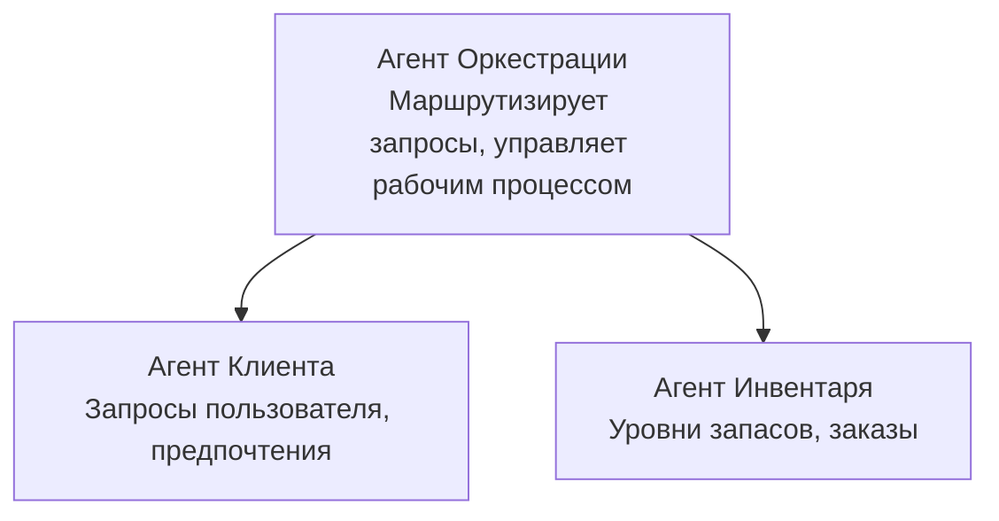

# Глава 5: Многоагентные решения на базе ИИ

**📚 Курс**: [AZD для начинающих](../../README.md) | **⏱️ Длительность**: 2-3 часа | **⭐ Сложность**: Продвинутая

---

## Обзор

В этой главе рассматриваются продвинутые архитектурные паттерны многоагентных систем, оркестрация агентов и готовые к производству внедрения ИИ для сложных сценариев.

> Проверено на `azd 1.25.6` в июне 2026 года.

## Цели обучения

Пройдя эту главу, вы сможете:
- Понять архитектурные паттерны многоагентных систем
- Развернуть скоординированные системы ИИ-агентов
- Реализовать коммуникацию между агентами
- Создать готовые к продакшену многоагентные решения

---

## 📚 Уроки

| № | Урок | Описание | Время |
|---|--------|-------------|------|
| 1 | [Основы многоагентных систем](multi-agent-basics.md) | Практика: развертывание работающего многоагентного приложения с помощью `azd up` | 45 мин |
| 2 | [Паттерны координации](../chapter-06-pre-deployment/coordination-patterns.md) | Стратегии оркестрации агентов (продолжается в Главе 6) | 30 мин |
| 3 | [Развертывание через ARM-шаблон](../../examples/retail-multiagent-arm-template/README.md) | Пример развертывания в один клик | 30 мин |

> **Начните с урока 1.** Это единственный полностью практический и готовый к развертыванию урок в этой главе. Урок 2 находится в Главе 6 (поделён с планированием перед развертыванием), а [Розничное многоагентное решение](../../examples/retail-scenario.md) — это архитектурный шаблон — справочный дизайн, а не шаблон для одного клика.

---

## 🚀 Быстрый старт

```bash
# Вариант 1: Развернуть из шаблона
azd init --template agent-openai-python-prompty
azd up

# Вариант 2: Развернуть из манифеста агента (требуется расширение azure.ai.agents)
azd extension install azure.ai.agents
azd ai agent init -m agent-manifest.yaml
azd up
```

> **Какой подход выбрать?** Используйте `azd init --template` для запуска с работающего примера. Используйте `azd ai agent init`, если у вас есть собственный манифест агента. Полные детали смотрите в [справке AZD AI CLI](../chapter-08-production/production-ai-practices.md#azd-ai-cli-commands-and-extensions).

---

## 🤖 Многоагентная архитектура



---

## 🎯 Рекомендованное решение: Розничное многоагентное решение

[Розничное многоагентное решение](../../examples/retail-scenario.md) демонстрирует:

- **Клиентский агент**: Обработка взаимодействия с пользователем и предпочтений  
- **Агент управления запасами**: Управление запасами и обработка заказов  
- **Оркестратор**: Координация между агентами  
- **Общая память**: Управление контекстом между агентами  

### Используемые сервисы

| Сервис | Назначение |
|---------|---------|
| Microsoft Foundry Models | Понимание языка |
| Azure AI Search | Каталог продуктов |
| Cosmos DB | Состояние и память агентов |
| Container Apps | Размещение агентов |
| Application Insights | Мониторинг |

---

## 🔗 Навигация

| Направление | Глава |
|-----------|---------|
| **Предыдущая** | [Глава 4: Инфраструктура](../chapter-04-infrastructure/README.md) |
| **Следующая** | [Глава 6: Подготовка к развертыванию](../chapter-06-pre-deployment/README.md) |

---

## 📖 Связанные ресурсы

- [Руководство по агентам ИИ](../chapter-02-ai-development/agents.md)
- [Практики продакшен ИИ](../chapter-08-production/production-ai-practices.md)
- [Устранение неполадок ИИ](../chapter-07-troubleshooting/ai-troubleshooting.md)

---

<!-- CO-OP TRANSLATOR DISCLAIMER START -->
**Отказ от ответственности**:
Этот документ был переведен с использованием сервиса машинного перевода [Co-op Translator](https://github.com/Azure/co-op-translator). Несмотря на наши усилия по обеспечению точности, имейте в виду, что автоматический перевод может содержать ошибки или неточности. Оригинальный документ на его исходном языке следует считать авторитетным источником. Для получения критически важной информации рекомендуется обратиться к профессиональному человеческому переводу. Мы не несем ответственности за любые недоразумения или неправильные толкования, возникшие в результате использования этого перевода.
<!-- CO-OP TRANSLATOR DISCLAIMER END -->