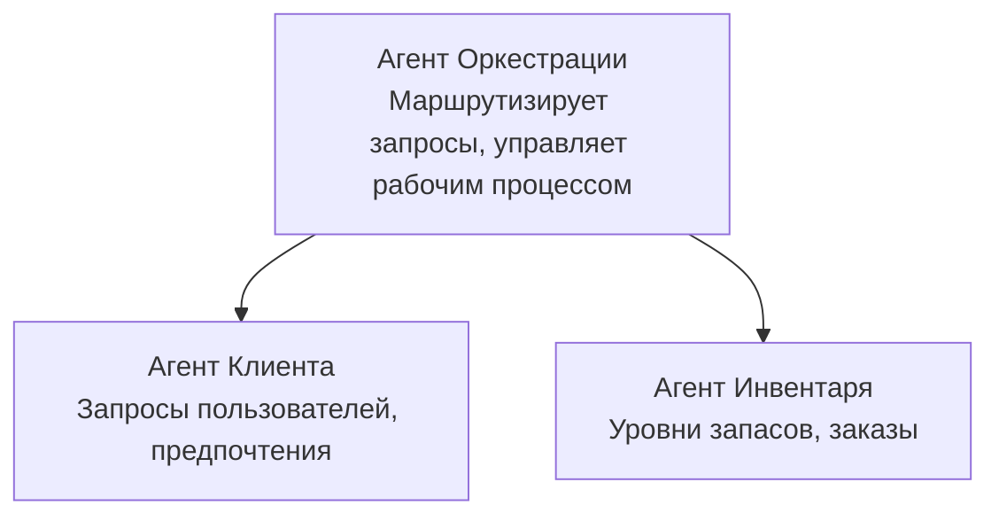

# Глава 5: Многозадачные AI решения

**📚 Курс**: [AZD для начинающих](../../README.md) | **⏱️ Продолжительность**: 2-3 часа | **⭐ Сложность**: Продвинутый

---

## Обзор

В этой главе рассматриваются продвинутые паттерны архитектуры многозадачных агентов, оркестрация агентов и готовые к производству AI-развертывания для сложных сценариев.

## Цели обучения

После прохождения этой главы вы сможете:
- Понимать паттерны архитектуры многозадачных агентов
- Разворачивать скоординированные системы AI-агентов
- Реализовывать коммуникацию между агентами
- Создавать готовые к производству многозадачные решения

---

## 📚 Уроки

| # | Урок | Описание | Время |
|---|--------|-------------|------|
| 1 | [Розничное многозадачное решение](../../examples/retail-scenario.md) | Полный разбор реализации | 90 мин |
| 2 | [Паттерны координации](../chapter-06-pre-deployment/coordination-patterns.md) | Стратегии оркестрации агентов | 30 мин |
| 3 | [Развертывание через ARM шаблон](../../examples/retail-multiagent-arm-template/README.md) | Развертывание в один клик | 30 мин |

---

## 🚀 Быстрый запуск

```bash
# Вариант 1: Развернуть из шаблона
azd init --template agent-openai-python-prompty
azd up

# Вариант 2: Развернуть из манифеста агента (требуется расширение azure.ai.agents)
azd extension install azure.ai.agents
azd ai agent init -m agent-manifest.yaml
azd up
```

> **Какой подход выбрать?** Используйте `azd init --template`, чтобы начать с рабочего примера. Используйте `azd ai agent init`, если у вас есть собственный манифест агента. Подробности см. в [справке по AZD AI CLI](../chapter-08-production/production-ai-practices.md#azd-ai-cli-commands-and-extensions).

---

## 🤖 Архитектура многозадачных агентов


---

## 🎯 Рекомендуемое решение: розничное многозадачное

[Розничное многозадачное решение](../../examples/retail-scenario.md) демонстрирует:

- **Агент клиента**: Обрабатывает взаимодействия с пользователем и предпочтения
- **Агент инвентаризации**: Управляет запасами и обработкой заказов
- **Оркестратор**: Координирует работу между агентами
- **Общая память**: Управление контекстом между агентами

### Используемые сервисы

| Сервис | Назначение |
|---------|---------|
| Microsoft Foundry Models | Понимание языка |
| Azure AI Search | Каталог продуктов |
| Cosmos DB | Состояние и память агента |
| Container Apps | Хостинг агентов |
| Application Insights | Мониторинг |

---

## 🔗 Навигация

| Направление | Глава |
|-----------|---------|
| **Предыдущая** | [Глава 4: Инфраструктура](../chapter-04-infrastructure/README.md) |
| **Следующая** | [Глава 6: Предварительное развертывание](../chapter-06-pre-deployment/README.md) |

---

## 📖 Связанные ресурсы

- [Руководство по AI агентов](../chapter-02-ai-development/agents.md)
- [Практики для производства AI](../chapter-08-production/production-ai-practices.md)
- [Устранение проблем AI](../chapter-07-troubleshooting/ai-troubleshooting.md)

---

<!-- CO-OP TRANSLATOR DISCLAIMER START -->
**Отказ от ответственности**:  
Этот документ был переведен с использованием службы автоматического перевода [Co-op Translator](https://github.com/Azure/co-op-translator). Несмотря на наши усилия по обеспечению точности, обратите внимание, что автоматические переводы могут содержать ошибки или неточности. Оригинальный документ на его исходном языке должен считаться авторитетным источником. Для критически важной информации рекомендуется обращаться к профессиональному человеческому переводу. Мы не несем ответственности за любые недоразумения или неправильные толкования, возникшие в результате использования этого перевода.
<!-- CO-OP TRANSLATOR DISCLAIMER END -->