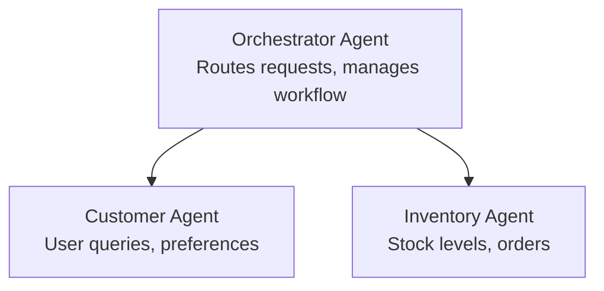

# Глава 5: Многоагентные AI решения

**📚 Курс**: [AZD для начинающих](../../README.md) | **⏱️ Длительность**: 2-3 часа | **⭐ Сложность**: Продвинутый

---

## Обзор

Эта глава охватывает продвинутые паттерны многоагентной архитектуры, оркестрацию агентов и готовые к производству AI-развертывания для комплексных сценариев.

> Руководство по командам проверено на соответствие опубликованному `azd 1.37.2` справочнику. Облачные развертывания не выполнялись.

## Цели обучения

Пройдя эту главу, вы:
- Поймёте паттерны многоагентной архитектуры
- Научитесь развёртывать согласованные системы AI-агентов
- Реализуете коммуникацию между агентами
- Создадите готовые к производству многоагентные решения

---

## 📚 Уроки

| № | Урок | Описание | Время |
|---|--------|-------------|------|
| 1 | [Основы многоагентных систем](multi-agent-basics.md) | Практика: разверните работащее многоагентное приложение с `azd up` | 45 мин |
| 2 | [Паттерны координации](../chapter-06-pre-deployment/coordination-patterns.md) | Стратегии оркестрации агентов (продолжение в Главе 6) | 30 мин |
| 3 | [Развёртывание ARM шаблона](../../examples/retail-multiagent-arm-template/README.md) | Пример развертывания в один клик | 30 мин |

> **Начинайте с Урока 1.** Это единственный полностью практический развертываемый урок в этой главе. Урок 2 находится в Главе 6 (он делится с планированием перед развертыванием), а [Розничное многоагентное решение](../../examples/retail-scenario.md) — это архитектурный шаблон — эталон дизайна, а не шаблон для запуска одной командой.

---

## 🚀 Быстрый старт

```bash
# Option 1: Deploy the multi-agent template used in Lesson 1
azd init --template Azure-Samples/contoso-creative-writer .
azd up

# Option 2: Initialize a Foundry agent interactively with the GA bundle
azd ext install microsoft.foundry
azd ai agent init
azd up
```

> **Какой подход выбрать?** Используйте `azd init --template`, чтобы начать с рабочего примера. Используйте `azd ai agent init` интерактивно или `azd ai agent init --template <path-to-azure.yaml>` для принятия текущего агентского проекта. См. [справочник AZD AI CLI](../chapter-08-production/production-ai-practices.md#azd-ai-cli-commands-and-extensions) для требований к версии и миграции оценки.

Запускайте эти альтернативы в отдельных пустых папках. Рабочий процесс GA Foundry требует `azd >= 1.37.0`; его интерактивный поток не создаёт пользовательский конвейер Service Bus из урока по координации. Для локального тестирования, развертывания кода и очистки между новыми и повторно используемыми проектами следуйте [пошаговому руководству по размещённым агентам](../chapter-02-ai-development/microsoft-foundry-integration.md#hosted-agent-walkthrough-ga).

---

## 🤖 Многоагентная архитектура


```mermaid
graph TD
    Orchestrator[Orchestrator Agent<br/>Routes requests, manages workflow] --> Customer[Customer Agent<br/>User queries, preferences]
    Orchestrator --> Inventory[Inventory Agent<br/>Stock levels, orders]
```

---

## 🎯 Выделенное решение: Розничное многоагентное

Решение [Retail Multi-Agent Solution](../../examples/retail-scenario.md) демонстрирует:

- **Агент клиента**: Обработка взаимодействий и предпочтений пользователей
- **Агент инвентаризации**: Управление запасами и обработка заказов
- **Оркестратор**: Координация между агентами
- **Общая память**: Управление контекстом между агентами

### Используемые службы

| Служба | Назначение |
|---------|---------|
| Microsoft Foundry Models | Понимание языка |
| Azure AI Search | Каталог продукции |
| Cosmos DB | Состояние и память агента |
| Container Apps | Хостинг агента |
| Application Insights | Мониторинг |

---

## 🔗 Навигация

| Направление | Глава |
|-----------|---------|
| **Предыдущая** | [Глава 4: Инфраструктура](../chapter-04-infrastructure/README.md) |
| **Следующая** | [Глава 6: Предварительное развертывание](../chapter-06-pre-deployment/README.md) |

---

## 📖 Связанные ресурсы

- [Руководство по агентам ИИ](../chapter-02-ai-development/agents.md)
- [Практики производства ИИ](../chapter-08-production/production-ai-practices.md)
- [Устранение неполадок ИИ](../chapter-07-troubleshooting/ai-troubleshooting.md)

---

<!-- CO-OP TRANSLATOR DISCLAIMER START -->
**Отказ от ответственности**:
Этот документ был переведен с использованием сервиса машинного перевода [Co-op Translator](https://github.com/Azure/co-op-translator). Несмотря на наши усилия по обеспечению точности, имейте в виду, что автоматический перевод может содержать ошибки или неточности. Оригинальный документ на его исходном языке следует считать авторитетным источником. Для получения критически важной информации рекомендуется обратиться к профессиональному человеческому переводу. Мы не несем ответственности за любые недоразумения или неправильные толкования, возникшие в результате использования этого перевода.
<!-- CO-OP TRANSLATOR DISCLAIMER END -->