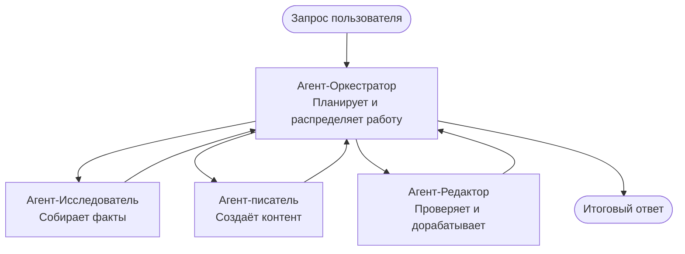

# Основы мультиагентных систем — Разверните свою первую скоординированную AI‑систему

**Навигация по главам:**
- **📚 Домашняя страница курса**: [AZD для начинающих](../../README.md)
- **📖 Текущая глава**: Глава 5 — Мультиагентные AI‑решения
- **⬅️ Предыдущая**: [Глава 4: Инфраструктура](../chapter-04-infrastructure/README.md)
- **➡️ Следующая**: [Паттерны координации](../chapter-06-pre-deployment/coordination-patterns.md)

> Проверено с `azd 1.25.6` в июне 2026 г.

## Введение

В предыдущих главах вы развернули одно приложение — а в Главе 2 вы развернули одного AI‑агента. Этот урок делает следующий шаг: развертывание **мультиагентной системы**, где несколько специализированных агентов работают вместе, чтобы решить задачу, с которой один агент справился бы хуже.

Хорошая новость для начинающих: **вам не нужны новые команды.** Мультиагентное решение по‑прежнему является проектом azd. Вы будете выполнять `azd init`, `azd up`, тестировать и `azd down` — тот самый рабочий процесс, который вы уже знаете. Меняется только *внутренняя структура* приложения.

## Цели обучения

К концу этого урока вы:
- Поймёте, что означает «мультиагентность» и когда она оправдана
- Распознаете типичные роли в мультиагентной системе (оркестратор + специалисты)
- Развернёте реальный рабочий мультиагентный шаблон с помощью `azd up`
- Поймёте Azure‑ресурсы, стоящие за мультиагентным приложением
- Узнаете, как проверить, настроить и корректно удалить решение

## Результаты обучения

После завершения урока вы сможете:
- Объяснить разницу между одиночным агентом и мультиагентной системой
- Выбрать между одним агентом с инструментами и истинной мультиагентной архитектурой
- Развернуть и протестировать мультиагентный шаблон end‑to‑end с помощью azd
- Определить, где выполняется каждый агент и как они обмениваются данными
- Очистить все ресурсы, чтобы избежать постоянных расходов

---

## Что такое мультиагентная система?

Одиночный AI‑агент — это одна модель с набором инструкций и (опционально) некоторыми инструментами. Это хорошо работает для узких задач. Но по мере роста задачи — исследование, затем написание, затем редактирование, затем проверка фактов — попытки уместить всё в один prompt делают агента медленнее, менее надёжным и сложнее для отладки.

A **мультиагентная система** разбивает работу на специалистов, каждый из которых хорошо выполняет одну задачу, координируемых оркестратором:



### Две роли, которые вы всегда увидите

| Роль | Задача | Пример |
|------|--------|--------|
| **Оркестратор** | Решает *что будет дальше* и распределяет работу между агентами | «Сначала исследование, затем написание, затем редактирование» |
| **Специалист** | Выполняет одну узконаправленную задачу и возвращает результат | «исследователь», который только собирает факты |

### Нужны ли вам действительно несколько агентов?

Начинайте с простого. Обращайтесь к мультиагентной архитектуре **только**, если выполняется одно из следующих условий:

- ✅ Задача имеет **отдельные этапы**, которым выгодны разные инструкции (исследование vs. написание vs. проверка)
- ✅ Вы хотите, чтобы специалисты работали **параллельно**, чтобы сэкономить время
- ✅ Разным шагам требуются **разные инструменты или источники данных**
- ✅ Каждый шаг должен быть **отдельно тестируемым и поддающимся отладке**

Если ваша задача — один вопрос‑ответ или простой вызов инструмента, то **один агент с инструментами** (Глава 2) проще, дешевле и удобнее в эксплуатации.

> **Совет для начинающих:** «Больше агентов» — не значит «лучше». Каждый агент добавляет задержку, стоимость и ещё один объект для мониторинга. Добавляйте агентов только тогда, когда проблема явно распадается на части.

---

## Два способа построения мультиагентной системы в Azure

| Подход | Что это | Лучшее для |
|--------|--------|-----------|
| **Один агент + инструменты** | Один агент Foundry, вызывающий функции/инструменты | Простые рабочие процессы, начало работы |
| **Несколько скоординированных агентов** | Несколько агентов с оркестратором | Явные этапы, параллельная работа, специализация |

Этот урок фокусируется на втором подходе с использованием **готового шаблона**, чтобы вы могли увидеть реальную мультиагентную систему в действии, прежде чем строить свою собственную.

---

## Практическое задание: Развернуть рабочее мультиагентное приложение

Мы развернём **Contoso Creative Writer**, официальный пример Azure, который использует несколько агентов (исследователь, писатель, редактор), скоординированных для создания статьи. Это отличный первый мультиагентный проект, потому что роли легко понять.

### Шаг 1: Инициализация шаблона

```bash
# Создайте рабочую папку
mkdir creative-writer && cd creative-writer

# Инициализируйте из официального многоагентного шаблона
azd init --template contoso-creative-writer
```

> Просмотрите другие мультиагентные шаблоны в любое время в [Галерее Awesome AZD AI](https://azure.github.io/awesome-azd/?tags=ai). Другие подходящие для начинающих варианты включают `get-started-with-ai-agents` и `azure-ai-travel-agents`.

### Шаг 2: Аутентификация

```bash
# Требуется для рабочих процессов azd
azd auth login
```

### Шаг 3: Создайте окружение

```bash
azd env new dev
```

### Шаг 4: Предпросмотр, затем развертывание

```bash
# Узнайте, что будет создано, прежде чем тратить что-либо (рекомендуется)
azd provision --preview

# Подготовить инфраструктуру и развернуть всех агентов за один шаг
azd up
```

`azd up` запросит подписку и регион, затем создаст ресурсы Azure и развернёт приложение. Развёртывания AI могут занимать больше времени, чем простое веб‑приложение — если вы развертываете более крупные модели, вы можете увеличить тайм‑аут развертывания:

```bash
azd deploy --timeout 1800
```

> **Внимание по расходам и квотам:** Мультиагентные приложения развёртывают AI‑модели, которые потребляют квоты и генерируют расходы. Если `azd up` не проходит из‑за квоты на модель, см. [Устранение неполадок AI](../chapter-07-troubleshooting/ai-troubleshooting.md) для решений по региону и квотам, и Главу 6 [Планирование ёмкости](../chapter-06-pre-deployment/capacity-planning.md).

---

## Понимание того, что вы развернули

Типичное мультиагентное приложение, подобное этому, создаёт набор ресурсов Azure, которые соответствуют обязанностям на диаграмме выше:

| Ресурс | Зачем он нужен |
|--------|----------------|
| **Microsoft Foundry / Models** | Размещает языковые модели, которыми пользуется каждый агент |
| **Azure AI Search** | Предоставляет агенту‑исследователю релевантные данные для поиска |
| **Container Apps** (или App Service) | Хостит оркестратор и код агентов |
| **Cosmos DB** (в некоторых примерах) | Хранит общее состояние/память, передаваемую между агентами |
| **Application Insights** | Отслеживает запросы *между* агентами, чтобы вы могли отлаживать поток |

### Как агенты обмениваются данными

В большинстве azd‑шаблонов с мультиагентной архитектурой **оркестратор запускается в коде вашего приложения** (например, с использованием фреймворка вроде Semantic Kernel или Microsoft Agent Framework). Оркестратор вызывает каждого специалиста по очереди, передаёт результаты и собирает окончательный ответ. Агенты обмениваются контекстом через:

- **Вызовы функций/инструментов** — оркестратор вызывает специалиста и получает результат
- **Общая память** — база данных (часто Cosmos DB) хранит состояние, которое могут читать оба агента
- **Сообщения/события** — для более слабой связки агенты общаются через очередь или Service Bus

> **Почему это важно для отладки:** поскольку каждый шаг отдельный, Application Insights показывает вам *какой* агент тормозит или упал. Это одна из главных причин разделять работу между агентами.

---

## Проверка развертывания

Подтвердите, что система действительно работает, прежде чем продолжать:

```bash
# Показать развернутые конечные точки
azd show

# Открыть панель мониторинга приложения
azd monitor

# Просматривать логи в режиме реального времени, если что-то не так
azd monitor --logs
```

Затем откройте URL приложения из `azd show` и попробуйте запрос, который задействует всех агентов (для Creative Writer попросите его написать короткую статью на тему). В **transaction search** Application Insights вы должны увидеть, как запрос разветвляется по шагам исследователя, писателя и редактора.

**Критерии успеха:**
- ✅ `azd show` отображает доступную конечную точку
- ✅ Запрос даёт результат, который явно прошёл через несколько этапов
- ✅ Application Insights показывает трассировки более чем для одного шага агента

---

## Настройка: Добавление или изменение агента

Поскольку каждый агент — это просто инструкции плюс инструменты, настройка доступна:

1. **Найдите определения агентов** в шаблоне (часто это набор файлов `prompts/`, `agents/` или `*.prompty`).
2. **Настройте инструкции агента** — например, попросите агента‑редактора применять определённый тон или ограничение по количеству слов.
3. **Разверните заново только код** (инфраструктура не меняется):

   ```bash
   azd deploy
   ```

Чтобы пойти дальше и создавать агентов из вашего *собственного* манифеста, используйте расширение агента и его полный жизненный цикл:

```bash
azd extension install azure.ai.agents
azd ai agent init -m agent-manifest.yaml
azd up
azd ai agent invoke      # тест, с временем отклика
```

См. [Глава 2: Агенты](../chapter-02-ai-development/agents.md) и справочник [AZD AI CLI](../chapter-08-production/production-ai-practices.md#azd-ai-cli-commands-and-extensions) для полного жизненного цикла агентов (`invoke`, `eval generate`, `optimize`, `delete`).

---

## Очистка

Мультиагентные приложения запускают несколько платных сервисов. Удаляйте всё, когда закончите:

```bash
azd down --force --purge
```

Флаг `--purge` также удаляет мягко удалённые AI‑ресурсы (например, аккаунты Foundry/Azure AI Services), чтобы они не блокировали будущие развертывания и не продолжали генерировать расходы.

---

## Примечание о мультиагентных системах в продакшене

[Retail Multi‑Agent Solution](../../examples/retail-scenario.md) в этом репозитории — это **архитектурный шаблон**, а не шаблон «в один клик» — он документирует, как производственная розничная система *могла бы* быть построена (и прямо указывает, что полноценная реализация — это значительная работа). Используйте его как справочник по дизайну *после* того, как вы развернёте рабочий пример здесь. По вопросам продакшена (надёжность, стоимость, мониторинг, управление) переходите в [Главу 8: Практики AI в продакшене](../chapter-08-production/production-ai-practices.md).

---

## Резюме

- Мультиагентная система распределяет работу между специалистами под управлением оркестратора.
- Используйте её только когда задача имеет отдельные этапы, требует параллелизма или разных инструментов — иначе предпочтительнее один агент.
- Рабочий процесс azd не меняется: `azd init` → `azd up` → тест → `azd down`.
- Готовый шаблон, например `contoso-creative-writer`, позволяет сегодня увидеть и настроить рабочее мультиагентное приложение.
- Трассировка в Application Insights через агентов — одно из крупнейших практических преимуществ мультиагентного подхода.

---

## 🔗 Навигация

| Направление | Урок |
|------------|------|
| **Предыдущая** | [Глава 4: Инфраструктура](../chapter-04-infrastructure/README.md) |
| **Следующая** | [Паттерны координации](../chapter-06-pre-deployment/coordination-patterns.md) |

## 📖 Связанные ресурсы

- [Руководство по AI‑агентам](../chapter-02-ai-development/agents.md)
- [Паттерны координации](../chapter-06-pre-deployment/coordination-patterns.md)
- [Практики AI в продакшене](../chapter-08-production/production-ai-practices.md)
- [Устранение неполадок AI](../chapter-07-troubleshooting/ai-troubleshooting.md)

---

<!-- CO-OP TRANSLATOR DISCLAIMER START -->
**Отказ от ответственности**:
Этот документ был переведен с использованием сервиса машинного перевода [Co-op Translator](https://github.com/Azure/co-op-translator). Несмотря на наши усилия по обеспечению точности, имейте в виду, что автоматический перевод может содержать ошибки или неточности. Оригинальный документ на его исходном языке следует считать авторитетным источником. Для получения критически важной информации рекомендуется обратиться к профессиональному человеческому переводу. Мы не несем ответственности за любые недоразумения или неправильные толкования, возникшие в результате использования этого перевода.
<!-- CO-OP TRANSLATOR DISCLAIMER END -->