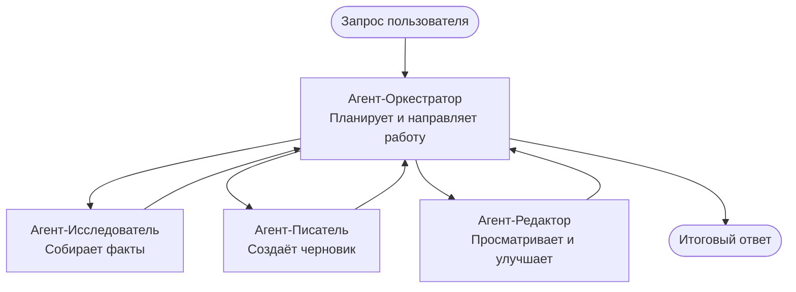

# Основы многопользовательских систем - Развертывание вашей первой скоординированной ИИ-системы

**Навигация по главе:**
- **📚 Домой по курсу**: [AZD Для начинающих](../../README.md)
- **📖 Текущая глава**: Глава 5 - Многопользовательские ИИ-решения
- **⬅️ Предыдущая**: [Глава 4: Инфраструктура](../chapter-04-infrastructure/README.md)
- **➡️ Следующая**: [Паттерны координации](../chapter-06-pre-deployment/coordination-patterns.md)

> Проверено на `azd 1.27.1` в июле 2026 года.

## Введение

В предыдущих главах вы развернули одно приложение — а в Главе 2 вы развернули одного ИИ-агента. Этот урок делает следующий шаг: развертывание **многопользовательской системы**, в которой несколько специализированных агентов работают вместе, чтобы решить задачу, с которой ни один агент не справился бы хорошо один.

Хорошая новость для начинающих: **вам не нужны новые команды.** Многопользовательское решение — это всё ещё проект azd. Вы будете выполнять `azd init`, `azd up`, тестировать и `azd down` — точно тот же процесс, что и раньше. Изменяется лишь *структура* приложения внутри.

## Цели обучения

К концу этого урока вы:
- Поймёте, что значит «многопользовательская» система и когда стоит брать на себя дополнительную сложность
- Узнаете общие роли в многопользовательской системе (оркестратор + специалисты)
- Развернете рабочий шаблон многопользовательской системы с помощью `azd up`
- Поймёте, какие ресурсы Azure поддерживают многопользовательское приложение
- Научитесь проверять, настраивать и корректно останавливать решение

## Результаты обучения

После прохождения этого урока вы сможете:
- Объяснить разницу между одним агентом и многопользовательской системой
- Выбрать между одним агентом с инструментами и настоящей многопользовательской архитектурой
- Развернуть и протестировать шаблон многопользовательской системы полностью с помощью azd
- Определить, где запускается каждый агент и как они общаются
- Очистить все ресурсы, чтобы избежать дальнейших затрат

---

## Что такое многопользовательская система?

Один ИИ-агент — это одна модель с набором инструкций и (опционально) с некоторыми инструментами. Это хорошо работает для узко направленных задач. Но по мере роста задачи — исследование, написание, редактирование, проверка фактов — попытка уместить всё в один запрос делает агента медленнее, менее надёжным и сложнее для отладки.

**Многопользовательская система** разбивает работу на специалистов, которые хорошо выполняют одну задачу, координируемых оркестратором:



### Две роли, которые вы всегда увидите

| Роль | Задача | Пример |
|------|--------|---------|
| **Оркестратор** | Решает, *что будет дальше* и распределяет работу между агентами | «Сначала исследование, потом написание, потом редактирование» |
| **Специалист** | Выполняет одну узкую задачу и возвращает результат | «Исследователь», который собирает только факты |

### Действительно ли нужны несколько агентов?

Начните с простого. Обращайтесь к многопользовательской системе **только если** верно хотя бы одно из следующих:

- ✅ Задача состоит из **четких этапов**, которым полезны разные инструкции (исследование против написания против проверки)
- ✅ Вы хотите, чтобы специалисты работали **параллельно**, чтобы сэкономить время
- ✅ Разные шаги требуют **разных инструментов или источников данных**
- ✅ Вам нужно, чтобы каждый шаг был **отдельно проверяемым и отлаживаемым**

Если ваша задача — это один вопрос и ответ или простой вызов инструмента, **один агент с инструментами** (Глава 2) проще, дешевле и удобнее в эксплуатации.

> **Совет для начинающих:** «Больше агентов» не значит «лучше». Каждый агент добавляет задержку, стоимость и новую вещь для мониторинга. Добавляйте агентов только когда задача явно делится на части.

---

## Два способа создания многопользовательских систем на Azure

| Подход | Что это | Для чего подходит |
|--------|----------|---------------|
| **Один агент + инструменты** | Один агент Foundry, вызывающий функции/инструменты | Простые рабочие процессы, начало работы |
| **Несколько скоординированных агентов** | Несколько агентов с оркестратором | Чёткие этапы, параллельная работа, специализация |

Этот урок сосредоточен на втором подходе с использованием **готового шаблона**, чтобы вы могли увидеть работающую многопользовательскую систему перед тем, как создавать свою.

---

## Практика: Разверните рабочее многопользовательское приложение

Мы развернем **Contoso Creative Writer**, официальный пример Azure, использующий несколько агентов (исследователь, писатель, редактор), скоординированных для создания статьи. Это отличное первое многопользовательское приложение, так как роли в нём легко понять.

### Шаг 1: Инициализация шаблона

```bash
# Создать рабочую папку
mkdir creative-writer && cd creative-writer

# Инициализировать из официального шаблона мультиагентов
azd init --template contoso-creative-writer
```

> В любое время можно просмотреть больше шаблонов для многопользовательских систем в [галерее Awesome AZD AI](https://azure.github.io/awesome-azd/?tags=ai). Среди других удобных для начинающих есть `get-started-with-ai-agents` и `azure-ai-travel-agents`.

### Шаг 2: Аутентификация

```bash
# Требуется для рабочих процессов azd
azd auth login
```

### Шаг 3: Создание окружения

```bash
azd env new dev
```

### Шаг 4: Просмотр, затем развертывание

```bash
# Посмотрите, что будет создано, прежде чем что-либо тратить (рекомендуется)
azd provision --preview

# Обеспечьте инфраструктуру и разверните всех агентов за один шаг
azd up
```

`azd up` запросит подписку и регион, затем создаст ресурсы Azure и развернёт приложение. Развёртывания ИИ могут занимать больше времени, чем простое веб-приложение — если вы развертываете большие модели, можно увеличить таймаут развертывания:

```bash
azd deploy --timeout 1800
```

> **Важно про стоимость и ёмкость:** Многопользовательские приложения развертывают ИИ-модели, которые используют квоты и генерируют затраты. Если `azd up` не удаётся из-за квоты модели, смотрите [Устранение неполадок ИИ](../chapter-07-troubleshooting/ai-troubleshooting.md) для исправления региона и квот, а также Главу 6 [Планирование ёмкости](../chapter-06-pre-deployment/capacity-planning.md).

---

## Понимание того, что вы развернули

Типичное многопользовательское приложение такого рода разворачивает набор ресурсов Azure, которые прямо соответствуют обязанностям на диаграмме выше:

| Ресурс | Зачем он нужен |
|--------|----------------|
| **Microsoft Foundry / Модели** | Хостинг языковых моделей, которые использует каждый агент |
| **Azure AI Search** | Даёт агенту-исследователю реальные данные для поиска |
| **Container Apps** (или App Service) | Хостинг кода оркестратора и агентов |
| **Cosmos DB** (в некоторых примерах) | Хранит общее состояние/память, передаваемую между агентами |
| **Application Insights** | Отслеживает запросы *между* агентами, чтобы вы могли отлаживать поток |

### Как агенты общаются друг с другом

В большинстве примеров многопользовательских систем с azd, **оркестратор запускается в вашем коде приложения** (например, с использованием фреймворка Semantic Kernel или Microsoft Agent Framework). Оркестратор последовательно вызывает каждого специалиста, передаёт результаты и собирает окончательный ответ. Агенты обмениваются контекстом через:

- **Вызовы функций/инструментов** — оркестратор вызывает специалиста и получает результат обратно
- **Общую память** — база данных (часто Cosmos DB) хранит состояние, которое могут читать оба агента
- **Сообщения/события** — при более слабой связке агенты взаимодействуют через очередь или Service Bus

> **Почему это важно для отладки:** так как каждый шаг отдельный, Application Insights показывает, *какой* агент был медленным или вызвал ошибку. Это одна из главных причин разделить работу между агентами.

---

## Проверка развертывания

Убедитесь, что система действительно работает, прежде чем продолжать:

```bash
# Показать развернутые конечные точки
azd show

# Открыть панель мониторинга приложения
azd monitor

# Просматривать логи в реальном времени, если что-то кажется неправильным
azd monitor --logs
```

Затем откройте URL приложения из `azd show` и сделайте запрос, который задействует всех агентов (для Creative Writer попросите написать короткую статью на тему). В поиске транзакций Application Insights вы должны увидеть, как запрос распределяется по шагам исследователя, писателя и редактора.

**Критерии успеха:**
- ✅ `azd show` показывает доступную конечную точку
- ✅ Запрос возвращает результат, который явно прошёл через несколько этапов
- ✅ Application Insights показывает трассировки для более чем одного шага агента

---

## Настройка: Добавление или изменение агента

Поскольку каждый агент — это просто инструкции и инструменты, настройка доступна:

1. **Найдите определения агентов** в шаблоне (часто это папки `prompts/`, `agents/` или файлы `*.prompty`).
2. **Настройте инструкции агента** — например, скажите агенту-редактору поддерживать определённый стиль или количество слов.
3. **Перезапустите только код** (инфраструктура остаётся без изменений):

   ```bash
   azd deploy
   ```

Чтобы пойти дальше и создавать агентов из *собственного* манифеста, используйте расширение агента и полный жизненный цикл:

```bash
azd extension install azure.ai.agents
azd ai agent init -m agent-manifest.yaml
azd up
azd ai agent invoke      # тест, с измерением времени отклика
```

Смотрите [Главу 2: Агенты](../chapter-02-ai-development/agents.md) и [Справочник AZD AI CLI](../chapter-08-production/production-ai-practices.md#azd-ai-cli-commands-and-extensions) для полного жизненного цикла агента (`invoke`, `eval generate`, `optimize`, `delete`).

---

## Очистка

Многопользовательские приложения запускают несколько платных сервисов. Останавливайте всё, когда закончите:

```bash
azd down --force --purge
```

Флаг `--purge` также удаляет ресурсы ИИ с мягким удалением (например, Foundry/Azure AI Services аккаунты), чтобы они не блокировали следующие развертывания и не создавали дополнительные расходы.

---

## Примечание о промышленных многопользовательских системах

[Розничное многопользовательское решение](../../examples/retail-scenario.md) в этом репозитории — это **архитектурный шаблон**, а не шаблон для развертывания одной командой — он документирует, как могла бы строиться промышленная розничная система (с чётким заявлением, что полный билд — это значительное усилие). Используйте его как справочник по дизайну *после* того, как развернули рабочий пример здесь. Для задач промышленной эксплуатации (надёжность, затраты, мониторинг, управление) переходите к [Главе 8: Производственные практики ИИ](../chapter-08-production/production-ai-practices.md).

---

## Итоги

- Многопользовательская система разделяет работу между специалистами, координируемыми оркестратором.
- Используйте её только когда есть чёткие этапы, параллелизм или разные инструменты на каждом шаге — в противном случае предпочтите одного агента.
- Рабочий процесс azd не меняется: `azd init` → `azd up` → тест → `azd down`.
- Реальный шаблон, например `contoso-creative-writer`, позволяет увидеть и настроить рабочее многопользовательское приложение уже сегодня.
- Трассировка Application Insights между агентами — одно из главных практических преимуществ многопользовательской архитектуры.

---

## 🔗 Навигация

| Направление | Урок |
|------------|------|
| **Предыдущий** | [Глава 4: Инфраструктура](../chapter-04-infrastructure/README.md) |
| **Следующий** | [Паттерны координации](../chapter-06-pre-deployment/coordination-patterns.md) |

## 📖 Связанные ресурсы

- [Руководство по ИИ-агентам](../chapter-02-ai-development/agents.md)
- [Паттерны координации](../chapter-06-pre-deployment/coordination-patterns.md)
- [Производственные практики ИИ](../chapter-08-production/production-ai-practices.md)
- [Устранение неполадок ИИ](../chapter-07-troubleshooting/ai-troubleshooting.md)

---

<!-- CO-OP TRANSLATOR DISCLAIMER START -->
**Отказ от ответственности**:
Этот документ был переведен с использованием сервиса машинного перевода [Co-op Translator](https://github.com/Azure/co-op-translator). Несмотря на наши усилия по обеспечению точности, имейте в виду, что автоматический перевод может содержать ошибки или неточности. Оригинальный документ на его исходном языке следует считать авторитетным источником. Для получения критически важной информации рекомендуется обратиться к профессиональному человеческому переводу. Мы не несем ответственности за любые недоразумения или неправильные толкования, возникшие в результате использования этого перевода.
<!-- CO-OP TRANSLATOR DISCLAIMER END -->