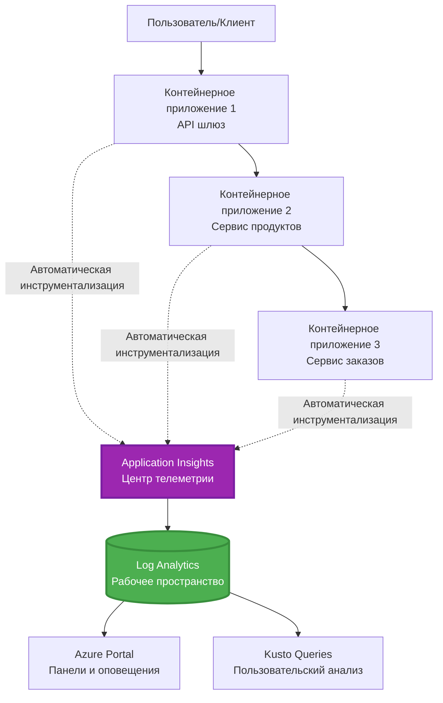
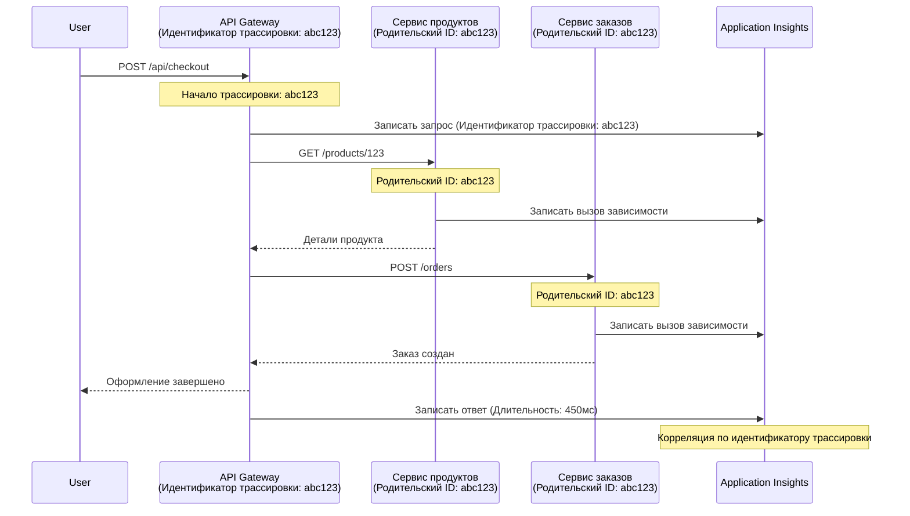

# Интеграция Application Insights с AZD

⏱️ **Ориентировочное время**: 40-50 минут | 💰 **Влияние на стоимость**: ~$5-15/месяц | ⭐ **Сложность**: Средний уровень

**📚 Учебный путь:**
- ← Предыдущее: [Preflight Checks](preflight-checks.md) - Проверки перед развертыванием
- 🎯 **Вы здесь**: Интеграция Application Insights (мониторинг, телеметрия, отладка)
- → Далее: [Руководство по развертыванию](../chapter-04-infrastructure/deployment-guide.md) - Развертывание в Azure
- 🏠 [Домашняя страница курса](../../README.md)

---

## Чему вы научитесь

После выполнения урока вы сможете:
- Автоматически интегрировать **Application Insights** в проекты AZD
- Настраивать **распределённое трассирование** для микросервисов
- Реализовывать **пользовательскую телеметрию** (метрики, события, зависимости)
- Настраивать **живые метрики** для мониторинга в реальном времени
- Создавать **оповещения и дашборды** из развертываний AZD
- Отлаживать производственные проблемы с помощью **телеметрических запросов**
- Оптимизировать **стоимость и стратегии выборки данных**
- Мониторить **AI/LLM-приложения** (токены, задержки, затраты)

## Почему важна интеграция Application Insights с AZD

### Задача: наблюдаемость в продакшене

**Без Application Insights:**
```
❌ No visibility into production behavior
❌ Manual log aggregation across services
❌ Reactive debugging (wait for customer complaints)
❌ No performance metrics
❌ Cannot trace requests across services
❌ Unknown failure rates and bottlenecks
```

**С Application Insights + AZD:**
```
✅ Automatic telemetry collection
✅ Centralized logs from all services
✅ Proactive issue detection
✅ End-to-end request tracing
✅ Performance metrics and insights
✅ Real-time dashboards
✅ AZD provisions everything automatically
```

**Аналогия**: Application Insights — это как "черный ящик" и приборная панель самолета для вашего приложения. Вы видите всё, что происходит в реальном времени, и можете воспроизвести любой инцидент.

---

## Обзор архитектуры

### Application Insights в архитектуре AZD


### Что мониторится автоматически

| Тип телеметрии | Что фиксируется | Сценарий использования |
|----------------|-----------------|-----------------------|
| **Запросы** | HTTP-запросы, коды статуса, время обработки | Мониторинг производительности API |
| **Зависимости** | Внешние вызовы (БД, API, хранилища) | Выявление узких мест |
| **Исключения** | Необработанные ошибки с трассировками стека | Отладка сбоев |
| **Пользовательские события** | Бизнес-события (регистрация, покупка) | Аналитика и воронки |
| **Метрики** | Счетчики производительности, пользовательские метрики | Планирование емкости |
| **Логи** | Сообщения с уровнем важности | Отладка и аудит |
| **Доступность** | Тесты работоспособности и времени отклика | Мониторинг SLA |

---

## Требования

### Необходимые инструменты

```bash
# Проверить Azure Developer CLI
azd version
# ✅ Ожидается: azd версии 1.0.0 или выше

# Проверить Azure CLI
az --version
# ✅ Ожидается: azure-cli версии 2.50.0 или выше
```

### Требования Azure

- Активная подписка Azure
- Разрешения на создание:
  - Ресурсов Application Insights
  - Рабочих областей Log Analytics
  - Container Apps
  - Групп ресурсов

### Требования к знаниям

Необходимо пройти:
- [Основы AZD](../chapter-01-foundation/azd-basics.md) - Ключевые концепции AZD
- [Конфигурация](../chapter-03-configuration/configuration.md) - Настройка окружения
- [Первый проект](../chapter-01-foundation/first-project.md) - Базовое развертывание

---

## Урок 1: Автоматический Application Insights с AZD

### Как AZD настраивает Application Insights

AZD автоматически создаёт и настраивает Application Insights при развертывании. Посмотрим, как это работает.

### Структура проекта

```
monitored-app/
├── azure.yaml                     # AZD configuration
├── infra/
│   ├── main.bicep                # Main infrastructure
│   ├── core/
│   │   └── monitoring.bicep      # Application Insights + Log Analytics
│   └── app/
│       └── api.bicep             # Container App with monitoring
└── src/
    ├── app.py                    # Application with telemetry
    ├── requirements.txt
    └── Dockerfile
```

---

### Шаг 1: Настройка AZD (azure.yaml)

**Файл: `azure.yaml`**

```yaml
name: monitored-app
metadata:
  template: monitored-app@1.0.0

services:
  api:
    project: ./src
    language: python
    host: containerapp

# AZD automatically provisions monitoring!
```

**Вот и всё!** AZD создаст Application Insights по умолчанию. Дополнительная настройка для базового мониторинга не требуется.

---

### Шаг 2: Инфраструктура мониторинга (Bicep)

**Файл: `infra/core/monitoring.bicep`**

```bicep
param logAnalyticsName string
param applicationInsightsName string
param location string = resourceGroup().location
param tags object = {}

// Log Analytics Workspace (required for Application Insights)
resource logAnalytics 'Microsoft.OperationalInsights/workspaces@2022-10-01' = {
  name: logAnalyticsName
  location: location
  tags: tags
  properties: {
    sku: {
      name: 'PerGB2018'  // Pay-as-you-go pricing
    }
    retentionInDays: 30  // Keep logs for 30 days
    features: {
      enableLogAccessUsingOnlyResourcePermissions: true
    }
  }
}

// Application Insights
resource applicationInsights 'Microsoft.Insights/components@2020-02-02' = {
  name: applicationInsightsName
  location: location
  tags: tags
  kind: 'web'
  properties: {
    Application_Type: 'web'
    WorkspaceResourceId: logAnalytics.id
    IngestionMode: 'LogAnalytics'
    publicNetworkAccessForIngestion: 'Enabled'
    publicNetworkAccessForQuery: 'Enabled'
  }
}

// Outputs for Container Apps
output logAnalyticsWorkspaceId string = logAnalytics.id
output logAnalyticsWorkspaceName string = logAnalytics.name
output applicationInsightsConnectionString string = applicationInsights.properties.ConnectionString
output applicationInsightsInstrumentationKey string = applicationInsights.properties.InstrumentationKey
output applicationInsightsName string = applicationInsights.name
```

---

### Шаг 3: Подключить Container App к Application Insights

**Файл: `infra/app/api.bicep`**

```bicep
param name string
param location string
param tags object = {}
param containerAppsEnvironmentName string
param applicationInsightsConnectionString string

resource containerApp 'Microsoft.App/containerApps@2023-05-01' = {
  name: name
  location: location
  tags: tags
  properties: {
    configuration: {
      ingress: {
        external: true
        targetPort: 8000
      }
      secrets: [
        {
          name: 'appinsights-connection-string'
          value: applicationInsightsConnectionString
        }
      ]
    }
    template: {
      containers: [
        {
          name: 'api'
          image: 'myregistry.azurecr.io/api:latest'
          resources: {
            cpu: json('0.5')
            memory: '1Gi'
          }
          env: [
            {
              name: 'APPLICATIONINSIGHTS_CONNECTION_STRING'
              secretRef: 'appinsights-connection-string'
            }
            {
              name: 'APPLICATIONINSIGHTS_ENABLED'
              value: 'true'
            }
          ]
        }
      ]
    }
  }
}

output uri string = 'https://${containerApp.properties.configuration.ingress.fqdn}'
```

---

### Шаг 4: Код приложения с телеметрией

**Файл: `src/app.py`**

```python
from flask import Flask, request, jsonify
from opencensus.ext.azure.log_exporter import AzureLogHandler
from opencensus.ext.azure.trace_exporter import AzureExporter
from opencensus.ext.flask.flask_middleware import FlaskMiddleware
from opencensus.trace.samplers import ProbabilitySampler
import logging
import os

app = Flask(__name__)

# Получить строку подключения Application Insights
connection_string = os.environ.get('APPLICATIONINSIGHTS_CONNECTION_STRING')

if connection_string:
    # Настроить распределённое трассирование
    middleware = FlaskMiddleware(
        app,
        exporter=AzureExporter(connection_string=connection_string),
        sampler=ProbabilitySampler(rate=1.0)  # 100% выборка для разработки
    )
    
    # Настроить логирование
    logger = logging.getLogger(__name__)
    logger.addHandler(AzureLogHandler(connection_string=connection_string))
    logger.setLevel(logging.INFO)
    
    print("✅ Application Insights enabled")
else:
    logger = logging.getLogger(__name__)
    logger.setLevel(logging.INFO)
    print("⚠️ Application Insights not configured")

@app.route('/health')
def health():
    logger.info('Health check endpoint called')
    return jsonify({'status': 'healthy', 'monitoring': 'enabled'})

@app.route('/api/products')
def get_products():
    logger.info('Fetching products')
    
    # Смоделировать вызов базы данных (автоматически отслеживается как зависимость)
    products = [
        {'id': 1, 'name': 'Laptop', 'price': 999.99},
        {'id': 2, 'name': 'Mouse', 'price': 29.99},
        {'id': 3, 'name': 'Keyboard', 'price': 79.99}
    ]
    
    logger.info(f'Returned {len(products)} products')
    return jsonify(products)

@app.route('/api/error-test')
def error_test():
    """Test error tracking"""
    logger.error('Testing error tracking')
    try:
        raise ValueError('This is a test exception')
    except Exception as e:
        logger.exception('Exception occurred in error-test endpoint')
        return jsonify({'error': str(e)}), 500

@app.route('/api/slow')
def slow_endpoint():
    """Test performance tracking"""
    import time
    logger.info('Slow endpoint called')
    time.sleep(3)  # Смоделировать медленную операцию
    logger.warning('Endpoint took 3 seconds to respond')
    return jsonify({'message': 'Slow operation completed'})

if __name__ == '__main__':
    app.run(host='0.0.0.0', port=8000)
```

**Файл: `src/requirements.txt`**

```txt
Flask==3.0.0
opencensus-ext-azure==1.1.13
opencensus-ext-flask==0.8.1
gunicorn==21.2.0
```

---

### Шаг 5: Развернуть и проверить

```bash
# Инициализировать AZD
azd init

# Развернуть (автоматически настраивает Application Insights)
azd up

# Получить URL приложения
APP_URL=$(azd env get-values | grep API_URL | cut -d '=' -f2 | tr -d '"')

# Сгенерировать телеметрию
curl $APP_URL/health
curl $APP_URL/api/products
curl $APP_URL/api/error-test
curl $APP_URL/api/slow
```

**✅ Ожидаемый вывод:**
```json
{
  "status": "healthy",
  "monitoring": "enabled"
}
```

---

### Шаг 6: Просмотр телеметрии в Azure Portal

```bash
# Получить сведения о Application Insights
azd env get-values | grep APPLICATIONINSIGHTS

# Открыть в Azure Portal
az monitor app-insights component show \
  --app $(azd env get-values | grep APPLICATIONINSIGHTS_NAME | cut -d '=' -f2 | tr -d '"') \
  --resource-group $(azd env get-values | grep AZURE_RESOURCE_GROUP | cut -d '=' -f2 | tr -d '"') \
  --query "appId" -o tsv
```

**Перейдите в Azure Portal → Application Insights → Transaction Search**

Вы должны увидеть:
- ✅ HTTP-запросы с кодами статуса
- ✅ Время обработки запросов (более 3 секунд для `/api/slow`)
- ✅ Детали исключений из `/api/error-test`
- ✅ Пользовательские лог-сообщения

---

## Урок 2: Пользовательская телеметрия и события

### Отслеживание бизнес-событий

Добавим пользовательскую телеметрию для важных бизнес-событий.

**Файл: `src/telemetry.py`**

```python
from opencensus.ext.azure import metrics_exporter
from opencensus.stats import aggregation as aggregation_module
from opencensus.stats import measure as measure_module
from opencensus.stats import stats as stats_module
from opencensus.stats import view as view_module
from opencensus.tags import tag_map as tag_map_module
from opencensus.ext.azure.log_exporter import AzureLogHandler
from opencensus.ext.azure.trace_exporter import AzureExporter
from opencensus.trace import tracer as tracer_module
import logging
import os

class TelemetryClient:
    """Custom telemetry client for Application Insights"""
    
    def __init__(self, connection_string=None):
        self.connection_string = connection_string or os.environ.get('APPLICATIONINSIGHTS_CONNECTION_STRING')
        
        if not self.connection_string:
            print("⚠️ Application Insights connection string not found")
            return
        
        # Настройка логгера
        self.logger = logging.getLogger(__name__)
        self.logger.addHandler(AzureLogHandler(connection_string=self.connection_string))
        self.logger.setLevel(logging.INFO)
        
        # Настройка экспортера метрик
        self.stats = stats_module.stats
        self.view_manager = self.stats.view_manager
        self.stats_recorder = self.stats.stats_recorder
        
        exporter = metrics_exporter.new_metrics_exporter(
            connection_string=self.connection_string
        )
        self.view_manager.register_exporter(exporter)
        
        # Настройка трассировщика
        self.tracer = tracer_module.Tracer(
            exporter=AzureExporter(connection_string=self.connection_string)
        )
        
        print("✅ Custom telemetry client initialized")
    
    def track_event(self, event_name: str, properties: dict = None):
        """Track custom business event"""
        properties = properties or {}
        self.logger.info(
            f"CustomEvent: {event_name}",
            extra={
                'custom_dimensions': {
                    'event_name': event_name,
                    **properties
                }
            }
        )
    
    def track_metric(self, metric_name: str, value: float, properties: dict = None):
        """Track custom metric"""
        properties = properties or {}
        self.logger.info(
            f"CustomMetric: {metric_name} = {value}",
            extra={
                'custom_dimensions': {
                    'metric_name': metric_name,
                    'value': value,
                    **properties
                }
            }
        )
    
    def track_dependency(self, name: str, dependency_type: str, duration: float, success: bool):
        """Track external dependency call"""
        with self.tracer.span(name=name) as span:
            span.add_attribute('dependency.type', dependency_type)
            span.add_attribute('duration', duration)
            span.add_attribute('success', success)

# Глобальный клиент телеметрии
telemetry = TelemetryClient()
```

### Обновление приложения с пользовательскими событиями

**Файл: `src/app.py` (расширенный)**

```python
from flask import Flask, request, jsonify
from telemetry import telemetry
import time
import random

app = Flask(__name__)

@app.route('/api/purchase', methods=['POST'])
def purchase():
    """Track purchase event with custom telemetry"""
    data = request.json
    product_id = data.get('product_id')
    quantity = data.get('quantity', 1)
    price = data.get('price', 0)
    
    # Отслеживание бизнес-события
    telemetry.track_event('Purchase', {
        'product_id': product_id,
        'quantity': quantity,
        'total_amount': price * quantity,
        'user_id': request.headers.get('X-User-Id', 'anonymous')
    })
    
    # Отслеживание показателя дохода
    telemetry.track_metric('Revenue', price * quantity, {
        'product_id': product_id,
        'currency': 'USD'
    })
    
    return jsonify({
        'order_id': f'ORD-{random.randint(1000, 9999)}',
        'status': 'confirmed',
        'total': price * quantity
    })

@app.route('/api/search')
def search():
    """Track search queries"""
    query = request.args.get('q', '')
    
    start_time = time.time()
    
    # Симуляция поиска (на самом деле будет запрос к базе данных)
    results = [{'id': 1, 'name': f'Result for {query}'}]
    
    duration = (time.time() - start_time) * 1000  # Преобразовать в мс
    
    # Отслеживание события поиска
    telemetry.track_event('Search', {
        'query': query,
        'results_count': len(results),
        'duration_ms': duration
    })
    
    # Отслеживание показателя производительности поиска
    telemetry.track_metric('SearchDuration', duration, {
        'query_length': len(query)
    })
    
    return jsonify({'results': results, 'count': len(results)})

@app.route('/api/external-call')
def external_call():
    """Track external API dependency"""
    import requests
    
    start_time = time.time()
    success = True
    
    try:
        # Симуляция вызова внешнего API
        response = requests.get('https://api.example.com/data', timeout=5)
        result = response.json()
    except Exception as e:
        success = False
        result = {'error': str(e)}
    
    duration = (time.time() - start_time) * 1000
    
    # Отслеживание зависимости
    telemetry.track_dependency(
        name='ExternalAPI',
        dependency_type='HTTP',
        duration=duration,
        success=success
    )
    
    return jsonify(result)

if __name__ == '__main__':
    app.run(host='0.0.0.0', port=8000)
```

### Тестирование пользовательской телеметрии

```bash
# Отслеживать событие покупки
curl -X POST $APP_URL/api/purchase \
  -H "Content-Type: application/json" \
  -H "X-User-Id: user123" \
  -d '{"product_id": 1, "quantity": 2, "price": 29.99}'

# Отслеживать событие поиска
curl "$APP_URL/api/search?q=laptop"

# Отслеживать внешнюю зависимость
curl $APP_URL/api/external-call
```

**Просмотр в Azure Portal:**

Перейдите в Application Insights → Logs и выполните:

```kusto
// View purchase events
traces
| where customDimensions.event_name == "Purchase"
| project 
    timestamp,
    product_id = tostring(customDimensions.product_id),
    total_amount = todouble(customDimensions.total_amount),
    user_id = tostring(customDimensions.user_id)
| order by timestamp desc

// View revenue metrics
traces
| where customDimensions.metric_name == "Revenue"
| summarize TotalRevenue = sum(todouble(customDimensions.value)) by bin(timestamp, 1h)
| render timechart

// View search performance
traces
| where customDimensions.event_name == "Search"
| summarize 
    AvgDuration = avg(todouble(customDimensions.duration_ms)),
    SearchCount = count()
  by bin(timestamp, 5m)
| render timechart
```

---

## Урок 3: Распределённое трассирование для микросервисов

### Включение трассирования между сервисами

Для микросервисов Application Insights автоматически коррелирует запросы между сервисами.

**Файл: `infra/main.bicep`**

```bicep
targetScope = 'subscription'

param environmentName string
param location string = 'eastus'

var tags = { 'azd-env-name': environmentName }

resource rg 'Microsoft.Resources/resourceGroups@2021-04-01' = {
  name: 'rg-${environmentName}'
  location: location
  tags: tags
}

// Monitoring (shared by all services)
module monitoring './core/monitoring.bicep' = {
  name: 'monitoring'
  scope: rg
  params: {
    logAnalyticsName: 'log-${environmentName}'
    applicationInsightsName: 'appi-${environmentName}'
    location: location
    tags: tags
  }
}

// API Gateway
module apiGateway './app/api-gateway.bicep' = {
  name: 'api-gateway'
  scope: rg
  params: {
    name: 'ca-gateway-${environmentName}'
    location: location
    tags: union(tags, { 'azd-service-name': 'gateway' })
    applicationInsightsConnectionString: monitoring.outputs.applicationInsightsConnectionString
  }
}

// Product Service
module productService './app/product-service.bicep' = {
  name: 'product-service'
  scope: rg
  params: {
    name: 'ca-products-${environmentName}'
    location: location
    tags: union(tags, { 'azd-service-name': 'products' })
    applicationInsightsConnectionString: monitoring.outputs.applicationInsightsConnectionString
  }
}

// Order Service
module orderService './app/order-service.bicep' = {
  name: 'order-service'
  scope: rg
  params: {
    name: 'ca-orders-${environmentName}'
    location: location
    tags: union(tags, { 'azd-service-name': 'orders' })
    applicationInsightsConnectionString: monitoring.outputs.applicationInsightsConnectionString
  }
}

output APPLICATIONINSIGHTS_CONNECTION_STRING string = monitoring.outputs.applicationInsightsConnectionString
output GATEWAY_URL string = apiGateway.outputs.uri
```

### Просмотр сквозного транзакционного трейса


**Запрос для просмотра сквозного трейса:**

```kusto
// Find complete request flow
let traceId = "abc123...";  // Get from response header
dependencies
| union requests
| where operation_Id == traceId
| project 
    timestamp,
    type = itemType,
    name,
    duration,
    success,
    cloud_RoleName
| order by timestamp asc
```

---

## Урок 4: Живые метрики и мониторинг в реальном времени

### Включение Live Metrics Stream

Live Metrics предоставляет телеметрию в реальном времени с задержкой менее 1 секунды.

**Доступ к Live Metrics:**

```bash
# Получить ресурс Application Insights
APPI_NAME=$(azd env get-values | grep APPLICATIONINSIGHTS_NAME | cut -d '=' -f2 | tr -d '"')

# Получить группу ресурсов
RG_NAME=$(azd env get-values | grep AZURE_RESOURCE_GROUP | cut -d '=' -f2 | tr -d '"')

echo "Navigate to: Azure Portal → Resource Groups → $RG_NAME → $APPI_NAME → Live Metrics"
```

**Что вы видите в реальном времени:**
- ✅ Скорость входящих запросов (запросы в секунду)
- ✅ Вызовы зависимостей
- ✅ Количество исключений
- ✅ Использование CPU и памяти
- ✅ Количество активных серверов
- ✅ Примеры телеметрии

### Генерация нагрузки для тестирования

```bash
# Создайте нагрузку, чтобы увидеть живые метрики
for i in {1..100}; do
  curl $APP_URL/api/products &
  curl $APP_URL/api/search?q=test$i &
done

# Просматривайте живые метрики в портале Azure
# Вы должны увидеть всплеск частоты запросов
```

---

## Практические упражнения

### Упражнение 1: Настройка оповещений ⭐⭐ (Средний уровень)

**Цель**: Создать оповещения по высоким ошибкам и медленным ответам.

**Шаги:**

1. **Создать оповещение по уровню ошибок:**

```bash
# Получить идентификатор ресурса Application Insights
APPI_ID=$(az monitor app-insights component show \
  --app $APPI_NAME \
  --resource-group $RG_NAME \
  --query "id" -o tsv)

# Создать оповещение по метрикам для неудачных запросов
az monitor metrics alert create \
  --name "High-Error-Rate" \
  --resource-group $RG_NAME \
  --scopes $APPI_ID \
  --condition "count requests/failed > 10" \
  --window-size 5m \
  --evaluation-frequency 1m \
  --description "Alert when error rate exceeds 10 per 5 minutes"
```

2. **Создать оповещение по медленным ответам:**

```bash
az monitor metrics alert create \
  --name "Slow-Responses" \
  --resource-group $RG_NAME \
  --scopes $APPI_ID \
  --condition "avg requests/duration > 3000" \
  --window-size 5m \
  --evaluation-frequency 1m \
  --description "Alert when average response time exceeds 3 seconds"
```

3. **Создать оповещение через Bicep (рекомендуется для AZD):**

**Файл: `infra/core/alerts.bicep`**

```bicep
param applicationInsightsId string
param actionGroupId string = ''
param location string = resourceGroup().location

// High error rate alert
resource errorRateAlert 'Microsoft.Insights/metricAlerts@2018-03-01' = {
  name: 'high-error-rate'
  location: 'global'
  properties: {
    description: 'Alert when error rate exceeds threshold'
    severity: 2
    enabled: true
    scopes: [
      applicationInsightsId
    ]
    evaluationFrequency: 'PT1M'
    windowSize: 'PT5M'
    criteria: {
      'odata.type': 'Microsoft.Azure.Monitor.SingleResourceMultipleMetricCriteria'
      allOf: [
        {
          name: 'Error rate'
          metricName: 'requests/failed'
          operator: 'GreaterThan'
          threshold: 10
          timeAggregation: 'Count'
        }
      ]
    }
    actions: actionGroupId != '' ? [
      {
        actionGroupId: actionGroupId
      }
    ] : []
  }
}

// Slow response alert
resource slowResponseAlert 'Microsoft.Insights/metricAlerts@2018-03-01' = {
  name: 'slow-responses'
  location: 'global'
  properties: {
    description: 'Alert when response time is too high'
    severity: 3
    enabled: true
    scopes: [
      applicationInsightsId
    ]
    evaluationFrequency: 'PT1M'
    windowSize: 'PT5M'
    criteria: {
      'odata.type': 'Microsoft.Azure.Monitor.SingleResourceMultipleMetricCriteria'
      allOf: [
        {
          name: 'Response duration'
          metricName: 'requests/duration'
          operator: 'GreaterThan'
          threshold: 3000
          timeAggregation: 'Average'
        }
      ]
    }
  }
}

output errorAlertId string = errorRateAlert.id
output slowResponseAlertId string = slowResponseAlert.id
```

4. **Тестирование оповещений:**

```bash
# Генерировать ошибки
for i in {1..20}; do
  curl $APP_URL/api/error-test
done

# Генерировать медленные ответы
for i in {1..10}; do
  curl $APP_URL/api/slow
done

# Проверить состояние оповещений (подождите 5-10 минут)
az monitor metrics alert list \
  --resource-group $RG_NAME \
  --query "[].{Name:name, Enabled:enabled, State:properties.enabled}" \
  --output table
```

**✅ Критерии успеха:**
- ✅ Оповещения созданы успешно
- ✅ Оповещения срабатывают при превышении порогов
- ✅ История оповещений доступна в Azure Portal
- ✅ Интегрировано с развертыванием AZD

**Время**: 20-25 минут

---

### Упражнение 2: Создание пользовательской панели ⭐⭐ (Средний уровень)

**Цель**: Построить дашборд с основными метриками приложения.

**Шаги:**

1. **Создать дашборд через Azure Portal:**

Перейдите: Azure Portal → Dashboards → Новый дашборд

2. **Добавить виджеты с ключевыми метриками:**

- Количество запросов (за последние 24 часа)
- Среднее время отклика
- Уровень ошибок
- Топ 5 самых медленных операций
- Географическое распределение пользователей

3. **Создать дашборд через Bicep:**

**Файл: `infra/core/dashboard.bicep`**

```bicep
param dashboardName string
param applicationInsightsId string
param location string = resourceGroup().location

resource dashboard 'Microsoft.Portal/dashboards@2020-09-01-preview' = {
  name: dashboardName
  location: location
  properties: {
    lenses: [
      {
        order: 0
        parts: [
          // Request count
          {
            position: { x: 0, y: 0, rowSpan: 4, colSpan: 6 }
            metadata: {
              type: 'Extension/Microsoft_OperationsManagementSuite_Workspace/PartType/LogsDashboardPart'
              inputs: [
                {
                  name: 'resourceId'
                  value: applicationInsightsId
                }
                {
                  name: 'query'
                  value: '''
                    requests
                    | summarize RequestCount = count() by bin(timestamp, 1h)
                    | render timechart
                  '''
                }
              ]
            }
          }
          // Error rate
          {
            position: { x: 6, y: 0, rowSpan: 4, colSpan: 6 }
            metadata: {
              type: 'Extension/Microsoft_OperationsManagementSuite_Workspace/PartType/LogsDashboardPart'
              inputs: [
                {
                  name: 'resourceId'
                  value: applicationInsightsId
                }
                {
                  name: 'query'
                  value: '''
                    requests
                    | summarize 
                        Total = count(),
                        Failed = countif(success == false)
                    | extend ErrorRate = (Failed * 100.0) / Total
                    | project ErrorRate
                  '''
                }
              ]
            }
          }
        ]
      }
    ]
  }
}

output dashboardId string = dashboard.id
```

4. **Развернуть дашборд:**

```bash
# Добавить в main.bicep
module dashboard './core/dashboard.bicep' = {
  name: 'dashboard'
  scope: rg
  params: {
    dashboardName: 'dashboard-${environmentName}'
    applicationInsightsId: monitoring.outputs.applicationInsightsId
    location: location
  }
}

# Развернуть
azd up
```

**✅ Критерии успеха:**
- ✅ Дашборд отображает ключевые метрики
- ✅ Может быть закреплён на главной в Azure Portal
- ✅ Обновляется в реальном времени
- ✅ Развёртывается через AZD

**Время**: 25-30 минут

---

### Упражнение 3: Мониторинг AI/LLM приложения ⭐⭐⭐ (Продвинутый уровень)

**Цель**: Отслеживать использование Microsoft Foundry Models (токены, затраты, задержки).

**Шаги:**

1. **Создать обертку для мониторинга AI:**

**Файл: `src/ai_telemetry.py`**

```python
from telemetry import telemetry
from openai import AzureOpenAI
import time

class MonitoredAzureOpenAI:
    """Microsoft Foundry Models client with automatic telemetry"""
    
    def __init__(self, api_key, endpoint, api_version="2024-02-01"):
        self.client = AzureOpenAI(
            api_key=api_key,
            api_version=api_version,
            azure_endpoint=endpoint
        )
    
    def chat_completion(self, model: str, messages: list, **kwargs):
        """Track chat completion with telemetry"""
        start_time = time.time()
        
        try:
            # Вызов моделей Microsoft Foundry
            response = self.client.chat.completions.create(
                model=model,
                messages=messages,
                **kwargs
            )
            
            duration = (time.time() - start_time) * 1000  # ms
            
            # Извлечь использование
            usage = response.usage
            prompt_tokens = usage.prompt_tokens
            completion_tokens = usage.completion_tokens
            total_tokens = usage.total_tokens
            
            # Рассчитать стоимость (ценообразование gpt-4.1)
            prompt_cost = (prompt_tokens / 1000) * 0.03  # $0.03 за 1000 токенов
            completion_cost = (completion_tokens / 1000) * 0.06  # $0.06 за 1000 токенов
            total_cost = prompt_cost + completion_cost
            
            # Отслеживать пользовательское событие
            telemetry.track_event('OpenAI_Request', {
                'model': model,
                'prompt_tokens': prompt_tokens,
                'completion_tokens': completion_tokens,
                'total_tokens': total_tokens,
                'duration_ms': duration,
                'cost_usd': total_cost,
                'success': True
            })
            
            # Отслеживать метрики
            telemetry.track_metric('OpenAI_Tokens', total_tokens, {
                'model': model,
                'type': 'total'
            })
            
            telemetry.track_metric('OpenAI_Cost', total_cost, {
                'model': model,
                'currency': 'USD'
            })
            
            telemetry.track_metric('OpenAI_Duration', duration, {
                'model': model
            })
            
            return response
            
        except Exception as e:
            duration = (time.time() - start_time) * 1000
            
            telemetry.track_event('OpenAI_Request', {
                'model': model,
                'duration_ms': duration,
                'success': False,
                'error': str(e)
            })
            
            raise
```

2. **Использовать мониторинговый клиент:**

```python
from flask import Flask, request, jsonify
from ai_telemetry import MonitoredAzureOpenAI
import os

app = Flask(__name__)

# Инициализация контролируемого клиента OpenAI
openai_client = MonitoredAzureOpenAI(
    api_key=os.environ['AZURE_OPENAI_API_KEY'],
    endpoint=os.environ['AZURE_OPENAI_ENDPOINT']
)

@app.route('/api/chat', methods=['POST'])
def chat():
    data = request.json
    user_message = data.get('message')
    
    # Вызов с автоматическим мониторингом
    response = openai_client.chat_completion(
        model='gpt-4.1',
        messages=[
            {'role': 'user', 'content': user_message}
        ]
    )
    
    return jsonify({
        'response': response.choices[0].message.content,
        'tokens': response.usage.total_tokens
    })
```

3. **Запросить метрики AI:**

```kusto
// Total AI spend over time
traces
| where customDimensions.event_name == "OpenAI_Request"
| where customDimensions.success == "True"
| summarize TotalCost = sum(todouble(customDimensions.cost_usd)) by bin(timestamp, 1h)
| render timechart

// Token usage by model
traces
| where customDimensions.event_name == "OpenAI_Request"
| summarize 
    TotalTokens = sum(toint(customDimensions.total_tokens)),
    RequestCount = count()
  by Model = tostring(customDimensions.model)

// Average latency
traces
| where customDimensions.event_name == "OpenAI_Request"
| summarize AvgDuration = avg(todouble(customDimensions.duration_ms))
| project AvgDurationSeconds = AvgDuration / 1000

// Cost per request
traces
| where customDimensions.event_name == "OpenAI_Request"
| extend Cost = todouble(customDimensions.cost_usd)
| summarize 
    TotalCost = sum(Cost),
    RequestCount = count(),
    AvgCostPerRequest = avg(Cost)
```

**✅ Критерии успеха:**
- ✅ Все вызовы OpenAI отслеживаются автоматически
- ✅ Видны использование токенов и затраты
- ✅ Мониторинг задержек
- ✅ Возможность задать бюджетные оповещения

**Время**: 35-45 минут

---

## Оптимизация стоимости

### Стратегии выборки данных (Sampling)

Контролируйте затраты с помощью выборки телеметрии:

```python
from opencensus.trace.samplers import ProbabilitySampler

# Разработка: 100% выборка
sampler = ProbabilitySampler(rate=1.0)

# Производство: 10% выборка (снижает затраты на 90%)
sampler = ProbabilitySampler(rate=0.1)

# Адаптивная выборка (автоматически регулируется)
from opencensus.trace.samplers import AdaptiveSampler
sampler = AdaptiveSampler()
```

**В Bicep:**

```bicep
resource applicationInsights 'Microsoft.Insights/components@2020-02-02' = {
  name: applicationInsightsName
  properties: {
    SamplingPercentage: 10  // 10% sampling
  }
}
```

### Хранение данных

```bicep
resource logAnalytics 'Microsoft.OperationalInsights/workspaces@2022-10-01' = {
  name: logAnalyticsName
  properties: {
    retentionInDays: 30  // Minimum (cheapest)
    // Options: 30, 31, 60, 90, 120, 180, 270, 365, 550, 730
  }
}
```

### Оценка ежемесячных затрат

| Объем данных | Срок хранения | Месячная стоимость |
|--------------|---------------|-------------------|
| 1 ГБ/месяц | 30 дней | ~$2-5 |
| 5 ГБ/месяц | 30 дней | ~$10-15 |
| 10 ГБ/месяц | 90 дней | ~$25-40 |
| 50 ГБ/месяц | 90 дней | ~$100-150 |

**Бесплатный тариф**: включено 5 ГБ/месяц

---

## Проверка знаний

### 1. Базовая интеграция ✓

Проверьте понимание:

- [ ] **Вопрос 1**: Как AZD настраивает Application Insights?
  - **Ответ**: Автоматически через Bicep-шаблоны в `infra/core/monitoring.bicep`

- [ ] **Вопрос 2**: Какая переменная окружения включает Application Insights?
  - **Ответ**: `APPLICATIONINSIGHTS_CONNECTION_STRING`

- [ ] **Вопрос 3**: Какие три основных типа телеметрии?
  - **Ответ**: Запросы (HTTP-вызовы), Зависимости (внешние вызовы), Исключения (ошибки)

**Практическая проверка:**
```bash
# Проверьте, настроен ли Application Insights
azd env get-values | grep APPLICATIONINSIGHTS

# Убедитесь, что телеметрия передается
az monitor app-insights metrics show \
  --app $APPI_NAME \
  --resource-group $RG_NAME \
  --metric "requests/count"
```

---

### 2. Пользовательская телеметрия ✓

Проверьте понимание:

- [ ] **Вопрос 1**: Как отслеживать пользовательские бизнес-события?
  - **Ответ**: Использовать логгер с `custom_dimensions` или `TelemetryClient.track_event()`

- [ ] **Вопрос 2**: Чем отличаются события от метрик?
  - **Ответ**: События — дискретные события, метрики — числовые измерения

- [ ] **Вопрос 3**: Как кореллировать телеметрию между сервисами?
  - **Ответ**: Application Insights автоматически использует `operation_Id` для корреляции

**Практическая проверка:**
```kusto
// Verify custom events
traces
| where customDimensions.event_name != ""
| summarize count() by tostring(customDimensions.event_name)
```

---

### 3. Мониторинг продакшена ✓

Проверьте понимание:

- [ ] **Вопрос 1**: Что такое выборка (sampling) и для чего она нужна?
  - **Ответ**: Выборка снижает объём данных (и затраты) за счёт захвата только части телеметрии

- [ ] **Вопрос 2**: Как настроить оповещения?
  - **Ответ**: Использовать метрико-ориентированные оповещения через Bicep или Azure Portal на основе метрик Application Insights

- [ ] **Вопрос 3**: Чем отличаются Log Analytics и Application Insights?
  - **Ответ**: Application Insights хранит данные в Log Analytics workspace; App Insights предоставляет представления, специфичные для приложений

**Практическая проверка:**
```bash
# Проверьте конфигурацию выборки
az monitor app-insights component show \
  --app $APPI_NAME \
  --resource-group $RG_NAME \
  --query "properties.SamplingPercentage"
```

---

## Лучшие практики

### ✅ РЕКОМЕНДУЕТСЯ:

1. **Использовать идентификаторы корреляции**
   ```python
   logger.info('Processing order', extra={
       'custom_dimensions': {
           'order_id': order_id,
           'user_id': user_id
       }
   })
   ```

2. **Настраивать оповещения для критических метрик**
   ```bicep
   // Error rate, slow responses, availability
   ```

3. **Использовать структурированное логирование**
   ```python
   # ✅ ХОРОШО: Структурировано
   logger.info('User signup', extra={'custom_dimensions': {'user_id': 123}})
   
   # ❌ ПЛОХО: Неструктурировано
   logger.info(f'User 123 signed up')
   ```

4. **Мониторить зависимости**
   ```python
   # Автоматически отслеживать вызовы базы данных, HTTP-запросы и т.д.
   ```

5. **Использовать Live Metrics при развертываниях**

### ❌ НЕ РЕКОМЕНДУЕТСЯ:

1. **Не логировать конфиденциальные данные**
   ```python
   # ❌ ПЛОХО
   logger.info(f'Login: {username}:{password}')
   
   # ✅ ХОРОШО
   logger.info('Login attempt', extra={'custom_dimensions': {'username': username}})
   ```

2. **Не использовать 100% выборку в продакшене**
   ```python
   # ❌ Дорогостоящий
   sampler = ProbabilitySampler(rate=1.0)
   
   # ✅ Экономичный
   sampler = ProbabilitySampler(rate=0.1)
   ```

3. **Не игнорировать очереди "мёртвых писем"**

4. **Не забывать устанавливать лимиты на хранение данных**

---

## Устранение неполадок

### Проблема: Телеметрия не отображается

**Диагностика:**
```bash
# Проверьте, что строка подключения установлена
azd env get-values | grep APPLICATIONINSIGHTS

# Проверьте логи приложения через Azure Monitor
azd monitor --logs

# Или используйте Azure CLI для Container Apps:
az containerapp logs show --name $APP_NAME --resource-group $RG_NAME --tail 50
```

**Решение:**
```bash
# Проверить строку подключения в контейнерном приложении
az containerapp show \
  --name $APP_NAME \
  --resource-group $RG_NAME \
  --query "properties.template.containers[0].env" \
  | grep -i applicationinsights
```

---

### Проблема: Высокие затраты

**Диагностика:**
```bash
# Проверить загрузку данных
az monitor app-insights metrics show \
  --app $APPI_NAME \
  --resource-group $RG_NAME \
  --metric "availabilityResults/count"
```

**Решение:**
- Снизить коэффициент выборки
- Уменьшить срок хранения данных
- Убрать избыточное ведение логов

---

## Узнайте больше

### Официальная документация
- [Обзор Application Insights](https://learn.microsoft.com/azure/azure-monitor/app/app-insights-overview)
- [Application Insights для Python](https://learn.microsoft.com/azure/azure-monitor/app/opencensus-python)
- [Язык запросов Kusto](https://learn.microsoft.com/azure/data-explorer/kusto/query/)
- [Мониторинг с AZD](https://learn.microsoft.com/azure/developer/azure-developer-cli/monitor-your-app)

### Следующие шаги в курсе
- ← Предыдущее: [Preflight Checks](preflight-checks.md)
- → Далее: [Руководство по развертыванию](../chapter-04-infrastructure/deployment-guide.md)
- 🏠 [Домашняя страница курса](../../README.md)

### Связанные примеры
- [Пример Microsoft Foundry Models](../../../../examples/azure-openai-chat) - AI телеметрия
- [Пример микросервисов](../../../../examples/microservices) - распределённое трассирование

---

## Итоги

**Вы узнали:**
- ✅ Автоматическое создание Application Insights с AZD
- ✅ Пользовательскую телеметрию (события, метрики, зависимости)
- ✅ Распределённое трассирование между микросервисами
- ✅ Live Metrics и мониторинг в реальном времени
- ✅ Оповещения и дашборды
- ✅ Мониторинг AI/LLM приложений
- ✅ Стратегии оптимизации затрат

**Ключевые выводы:**
1. **Мониторинг средств AZD осуществляется автоматически** - Нет необходимости в ручной настройке  
2. **Используйте структурированные логи** - Облегчает построение запросов  
3. **Отслеживайте бизнес-события** - Не только технические метрики  
4. **Контролируйте расходы на ИИ** - Отслеживайте токены и затраты  
5. **Настройте оповещения** - Будьте проактивны, а не реактивны  
6. **Оптимизируйте расходы** - Используйте выборку и ограничения хранения  

**Следующие шаги:**  
1. Выполните практические упражнения  
2. Добавьте Application Insights в ваши проекты AZD  
3. Создайте пользовательские панели мониторинга для вашей команды  
4. Изучите [Руководство по развертыванию](../chapter-04-infrastructure/deployment-guide.md)

---

<!-- CO-OP TRANSLATOR DISCLAIMER START -->
**Отказ от ответственности**:
Этот документ был переведен с использованием сервиса автоматического перевода [Co-op Translator](https://github.com/Azure/co-op-translator). Несмотря на наши усилия по обеспечению точности, просим учитывать, что автоматический перевод может содержать ошибки или неточности. Оригинальный документ на родном языке следует считать авторитетным источником. Для получения критически важной информации рекомендуется обращаться к услугам профессионального переводчика. Мы не несем ответственности за любые недоразумения или неправильные толкования, возникшие в результате использования этого перевода.
<!-- CO-OP TRANSLATOR DISCLAIMER END -->