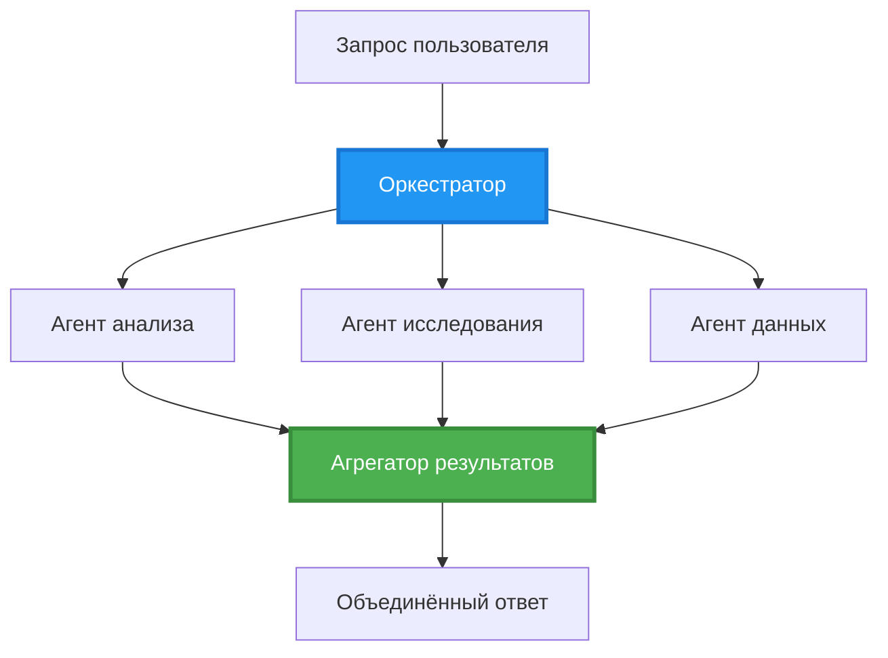
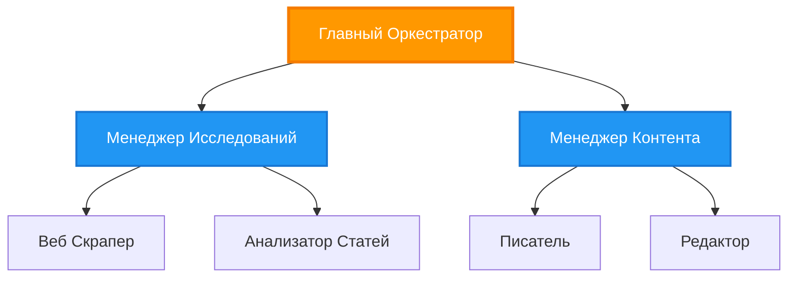
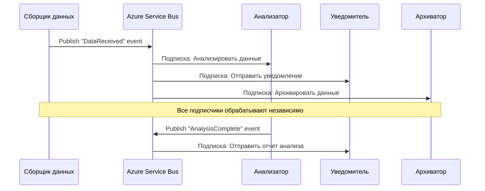
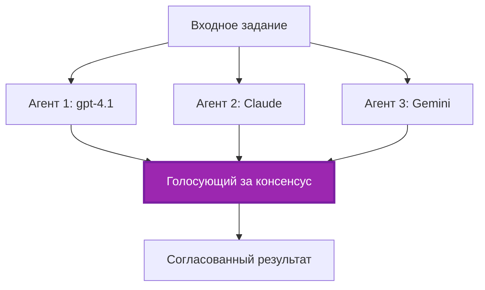
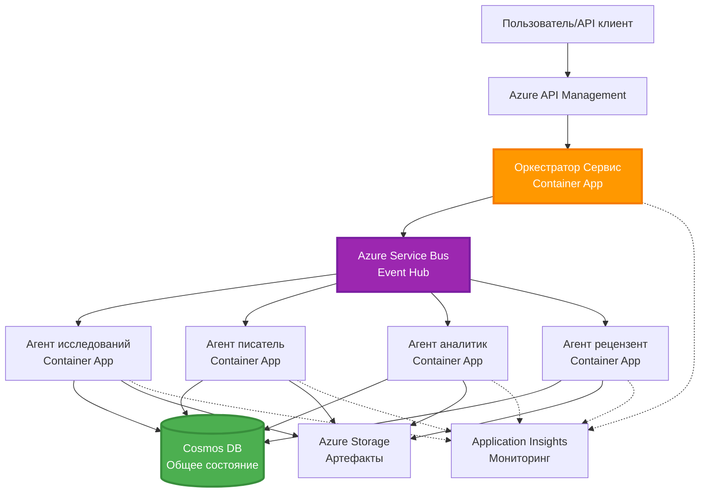

# Шаблоны координации мультиагентных систем

⏱️ **Ориентировочное время**: 60-75 минут | 💰 **Ориентировочная стоимость**: ~$100-300/месяц | ⭐ **Сложность**: Продвинутый уровень

**📚 Учебный путь:**
- ← Предыдущее: [Планирование мощностей](capacity-planning.md) - стратегии масштабирования и ресурсного планирования
- 🎯 **Вы здесь**: Шаблоны координации мультиагентных систем (Оркестрация, коммуникация, управление состоянием)
- → Следующее: [Выбор SKU](sku-selection.md) - выбор подходящих сервисов Azure
- 🏠 [Главная страница курса](../../README.md)

---

## Что вы узнаете

Выполнив этот урок, вы:
- Поймёте шаблоны **мультиагентной архитектуры** и когда их применять
- Реализуете **шаблоны оркестрации** (централизованная, децентрализованная, иерархическая)
- Спроектируете стратегии **коммуникации агентов** (синхронная, асинхронная, событийно-ориентированная)
- Управляете **общим состоянием** между распределёнными агентами
- Развернёте **мультиагентные системы** в Azure с помощью AZD
- Примените **шаблоны координации** в реальных сценариях ИИ
- Выполните мониторинг и отладку распределённых систем агентов

## Почему важна координация мультиагентов

### Эволюция: от одного агента к мультиагентной системе

**Одиночный агент (простой):**
```
User → Agent → Response
```
- ✅ Легко понять и реализовать
- ✅ Быстрый для простых задач
- ❌ Ограничен возможностями одного запроса модели
- ❌ Не может распараллеливать сложные задачи
- ❌ Нет специализации

**Мультиагентная система (сложная):**
```mermaid
graph TD
    Orchestrator[Оркестратор] --> Agent1[Агент1<br/>План]
    Orchestrator --> Agent2[Агент2<br/>Код]
    Orchestrator --> Agent3[Агент3<br/>Обзор]
```- ✅ Специализированные агенты для конкретных задач
- ✅ Параллельное выполнение для ускорения
- ✅ Модульность и удобство поддержки
- ✅ Лучше справляется со сложными рабочими процессами
- ⚠️ Требуется логика координации

**Аналогия**: одиночный агент — это как один человек, выполняющий все задачи. Мультиагент — это команда, где каждый член обладает специализированными навыками (исследователь, программист, ревьюер, писатель), работающая совместно.

---

## Основные шаблоны координации

### Шаблон 1: Последовательная координация (Цепочка ответственности)

**Когда использовать**: задачи должны выполняться в определённом порядке, каждый агент опирается на результат предыдущего.

```mermaid
sequenceDiagram
    participant User
    participant Orchestrator
    participant Agent1 as Исследовательский агент
    participant Agent2 as Писательский агент
    participant Agent3 as Редакторский агент
    
    User->>Orchestrator: "Написать статью об ИИ"
    Orchestrator->>Agent1: Исследовать тему
    Agent1-->>Orchestrator: Результаты исследования
    Orchestrator->>Agent2: Написать черновик (используя исследование)
    Agent2-->>Orchestrator: Черновик статьи
    Orchestrator->>Agent3: Отредактировать и улучшить
    Agent3-->>Orchestrator: Финальная статья
    Orchestrator-->>User: Отшлифованная статья
    
    Note over User,Agent3: Последовательно: Каждый шаг ждет предыдущего
```
**Преимущества:**
- ✅ Чёткий поток данных
- ✅ Легко отлаживать
- ✅ Предсказуемый порядок выполнения

**Ограничения:**
- ❌ Медленнее (нет параллелизма)
- ❌ Один сбой блокирует всю цепочку
- ❌ Не подходит для взаимозависимых задач

**Примеры использования:**
- Поток создания контента (исследование → написание → редактирование → публикация)
- Генерация кода (план → реализация → тест → деплой)
- Создание отчётов (сбор данных → анализ → визуализация → резюме)

---

### Шаблон 2: Параллельная координация (Fan-Out/Fan-In)

**Когда использовать**: независимые задачи могут выполняться одновременно, результаты объединяются в конце.


**Преимущества:**
- ✅ Быстро (параллельное выполнение)
- ✅ Отказоустойчиво (частичные результаты приемлемы)
- ✅ Горизонтально масштабируется

**Ограничения:**
- ⚠️ Результаты могут прийти не в порядке
- ⚠️ Требуется логика агрегации
- ⚠️ Сложное управление состоянием

**Примеры использования:**
- Сбор данных из множества источников (API + базы данных + веб-скрейпинг)
- Конкурентный анализ (несколько моделей генерируют решения, выбирается лучшее)
- Сервисы перевода (одновременный перевод на несколько языков)

---

### Шаблон 3: Иерархическая координация (Менеджер-Исполнитель)

**Когда использовать**: сложные рабочие процессы с подзадачами, требуется делегирование.


**Преимущества:**
- ✅ Обрабатывает сложные потоки работ
- ✅ Модульность и удобство поддержки
- ✅ Чёткое разделение ответственности

**Ограничения:**
- ⚠️ Более сложная архитектура
- ⚠️ Большая задержка (несколько уровней координации)
- ⚠️ Требуется сложная оркестрация

**Примеры использования:**
- Обработка корпоративных документов (классификация → маршрутизация → обработка → архивирование)
- Многоступенчатые конвейеры данных (загрузка → очистка → преобразование → анализ → отчёт)
- Сложные процессы автоматизации (планирование → выделение ресурсов → выполнение → мониторинг)

---

### Шаблон 4: Событийно-ориентированная координация (Publish-Subscribe)

**Когда использовать**: агенты должны реагировать на события, нужна слабая связность.


**Преимущества:**
- ✅ Слабая связность между агентами
- ✅ Легко добавить новых агентов (подписка)
- ✅ Асинхронная обработка
- ✅ Надёжность (сохранность сообщений)

**Ограничения:**
- ⚠️ Итоговая согласованность
- ⚠️ Сложная отладка
- ⚠️ Проблемы с порядком сообщений

**Примеры использования:**
- Системы мониторинга в реальном времени (сигналы тревоги, панели, логи)
- Мультиканальные уведомления (email, SMS, push, Slack)
- Конвейеры обработки данных (несколько потребителей одних и тех же данных)

---

### Шаблон 5: Координация на основе консенсуса (Голосование/Кворум)

**Когда использовать**: требуется согласие нескольких агентов перед продолжением.


**Преимущества:**
- ✅ Повышенная точность (множественные мнения)
- ✅ Отказоустойчивость (приемлемы сбои меньшинства)
- ✅ Встроенный контроль качества

**Ограничения:**
- ❌ Дорого (несколько вызовов моделей)
- ❌ Медленнее (ожидание всех агентов)
- ⚠️ Требуется разрешение конфликтов

**Примеры использования:**
- Модерация контента (несколько моделей проверяют контент)
- Код-ревью (несколько линтеров/анализаторов)
- Медицинская диагностика (несколько ИИ-моделей, экспертная проверка)

---

## Обзор архитектуры

### Полная мультиагентная система в Azure


**Основные компоненты:**

| Компонент | Назначение | Сервис Azure |
|-----------|------------|--------------|
| **API Gateway** | Точка входа, ограничение скорости, авторизация | API Management |
| **Оркестратор** | Координация рабочих процессов агентов | Container Apps |
| **Очередь сообщений** | Асинхронная коммуникация | Service Bus / Event Hubs |
| **Агенты** | Специализированные ИИ-воркеры | Container Apps / Functions |
| **Хранилище состояния** | Общее состояние, отслеживание задач | Cosmos DB |
| **Хранилище артефактов** | Документы, результаты, логи | Blob Storage |
| **Мониторинг** | Распределённое трассирование, логи | Application Insights |

---

## Предварительные требования

### Необходимые инструменты

```bash
# Проверить Azure Developer CLI
azd version
# ✅ Ожидается: версия azd 1.0.0 или выше

# Проверить Azure CLI
az --version
# ✅ Ожидается: версия azure-cli 2.50.0 или выше

# Проверить Docker (для локального тестирования)
docker --version
# ✅ Ожидается: версия Docker 20.10 или выше
```

### Требования Azure

- Активная подписка Azure
- Разрешения на создание:
  - Container Apps
  - пространства имён Service Bus
  - аккаунтов Cosmos DB
  - аккаунтов хранилища
  - Application Insights

### Требуемые знания

Вы должны быть знакомы с:
- [Управление конфигурацией](../chapter-03-configuration/configuration.md)
- [Аутентификация и безопасность](../chapter-03-configuration/authsecurity.md)
- [Пример микросервисов](../../../../examples/microservices)

---

## Руководство по реализации

### Структура проекта

```
multi-agent-system/
├── azure.yaml                    # AZD configuration
├── infra/
│   ├── main.bicep               # Main infrastructure
│   ├── core/
│   │   ├── servicebus.bicep     # Message queue
│   │   ├── cosmos.bicep         # State store
│   │   ├── storage.bicep        # Artifact storage
│   │   └── monitoring.bicep     # Application Insights
│   └── app/
│       ├── orchestrator.bicep   # Orchestrator service
│       └── agent.bicep          # Agent template
└── src/
    ├── orchestrator/            # Orchestration logic
    │   ├── app.py
    │   ├── workflows.py
    │   └── Dockerfile
    ├── agents/
    │   ├── research/            # Research agent
    │   ├── writer/              # Writer agent
    │   ├── analyst/             # Analyst agent
    │   └── reviewer/            # Reviewer agent
    └── shared/
        ├── state_manager.py     # Shared state logic
        └── message_handler.py   # Message handling
```

---

## Урок 1: Шаблон последовательной координации

### Реализация: конвейер создания контента

Построим последовательный конвейер: Исследование → Написание → Редактирование → Публикация

### 1. Конфигурация AZD

**Файл: `azure.yaml`**

```yaml
name: content-pipeline
metadata:
  template: multi-agent-sequential@1.0.0

services:
  orchestrator:
    project: ./src/orchestrator
    language: python
    host: containerapp
  
  research-agent:
    project: ./src/agents/research
    language: python
    host: containerapp
  
  writer-agent:
    project: ./src/agents/writer
    language: python
    host: containerapp
  
  editor-agent:
    project: ./src/agents/editor
    language: python
    host: containerapp
```

### 2. Инфраструктура: Service Bus для координации

**Файл: `infra/core/servicebus.bicep`**

```bicep
param name string
param location string
param tags object = {}

resource serviceBusNamespace 'Microsoft.ServiceBus/namespaces@2022-10-01-preview' = {
  name: name
  location: location
  tags: tags
  sku: {
    name: 'Standard'
    tier: 'Standard'
  }
  properties: {
    minimumTlsVersion: '1.2'
  }
}

// Queue for orchestrator → research agent
resource researchQueue 'Microsoft.ServiceBus/namespaces/queues@2022-10-01-preview' = {
  parent: serviceBusNamespace
  name: 'research-tasks'
  properties: {
    maxDeliveryCount: 3
    lockDuration: 'PT5M'
    deadLetteringOnMessageExpiration: true
  }
}

// Queue for research agent → writer agent
resource writerQueue 'Microsoft.ServiceBus/namespaces/queues@2022-10-01-preview' = {
  parent: serviceBusNamespace
  name: 'writer-tasks'
  properties: {
    maxDeliveryCount: 3
    lockDuration: 'PT5M'
  }
}

// Queue for writer agent → editor agent
resource editorQueue 'Microsoft.ServiceBus/namespaces/queues@2022-10-01-preview' = {
  parent: serviceBusNamespace
  name: 'editor-tasks'
  properties: {
    maxDeliveryCount: 3
    lockDuration: 'PT5M'
  }
}

output namespace string = serviceBusNamespace.name
output connectionString string = listKeys('${serviceBusNamespace.id}/AuthorizationRules/RootManageSharedAccessKey', serviceBusNamespace.apiVersion).primaryConnectionString
```

### 3. Менеджер общего состояния

**Файл: `src/shared/state_manager.py`**

```python
from azure.cosmos import CosmosClient, PartitionKey
from datetime import datetime
import os

class StateManager:
    """Manages shared state across agents using Cosmos DB"""
    
    def __init__(self):
        endpoint = os.environ['COSMOS_ENDPOINT']
        key = os.environ['COSMOS_KEY']
        
        self.client = CosmosClient(endpoint, key)
        self.database = self.client.get_database_client('agent-state')
        self.container = self.database.get_container_client('tasks')
    
    def create_task(self, task_id: str, task_type: str, input_data: dict):
        """Create a new task"""
        task = {
            'id': task_id,
            'type': task_type,
            'status': 'pending',
            'input': input_data,
            'created_at': datetime.utcnow().isoformat(),
            'steps': []
        }
        self.container.create_item(task)
        return task
    
    def update_task_step(self, task_id: str, step_name: str, result: dict):
        """Update task with completed step"""
        task = self.container.read_item(task_id, partition_key=task_id)
        
        task['steps'].append({
            'name': step_name,
            'completed_at': datetime.utcnow().isoformat(),
            'result': result
        })
        
        self.container.replace_item(task_id, task)
        return task
    
    def complete_task(self, task_id: str, final_result: dict):
        """Mark task as complete"""
        task = self.container.read_item(task_id, partition_key=task_id)
        task['status'] = 'completed'
        task['result'] = final_result
        task['completed_at'] = datetime.utcnow().isoformat()
        self.container.replace_item(task_id, task)
        return task
    
    def get_task(self, task_id: str):
        """Retrieve task state"""
        return self.container.read_item(task_id, partition_key=task_id)
```

### 4. Сервис оркестратора

**Файл: `src/orchestrator/app.py`**

```python
from flask import Flask, request, jsonify
from azure.servicebus import ServiceBusClient, ServiceBusMessage
import json
import uuid
import os
from shared.state_manager import StateManager

app = Flask(__name__)
state_manager = StateManager()

# Подключение к Service Bus
servicebus_connection_str = os.environ['SERVICEBUS_CONNECTION_STRING']
servicebus_client = ServiceBusClient.from_connection_string(servicebus_connection_str)

@app.route('/health', methods=['GET'])
def health():
    return jsonify({'status': 'healthy', 'service': 'orchestrator'})

@app.route('/create-content', methods=['POST'])
def create_content():
    """
    Sequential workflow: Research → Write → Edit → Publish
    """
    data = request.json
    topic = data.get('topic')
    
    if not topic:
        return jsonify({'error': 'Topic required'}), 400
    
    # Создать задачу в хранилище состояний
    task_id = str(uuid.uuid4())
    task = state_manager.create_task(
        task_id=task_id,
        task_type='content_creation',
        input_data={'topic': topic}
    )
    
    # Отправить сообщение агенту исследований (первый шаг)
    sender = servicebus_client.get_queue_sender('research-tasks')
    message = ServiceBusMessage(
        body=json.dumps({
            'task_id': task_id,
            'topic': topic,
            'next_queue': 'writer-tasks'  # Куда отправлять результаты
        }),
        content_type='application/json'
    )
    
    with sender:
        sender.send_messages(message)
    
    return jsonify({
        'task_id': task_id,
        'status': 'started',
        'workflow': 'sequential',
        'steps': ['research', 'write', 'edit', 'publish'],
        'message': 'Content creation pipeline initiated'
    }), 202

@app.route('/task/<task_id>', methods=['GET'])
def get_task_status(task_id):
    """Check task status"""
    try:
        task = state_manager.get_task(task_id)
        return jsonify(task)
    except Exception as e:
        return jsonify({'error': str(e)}), 404

if __name__ == '__main__':
    app.run(host='0.0.0.0', port=8080)
```

### 5. Агент исследования

**Файл: `src/agents/research/app.py`**

```python
from azure.servicebus import ServiceBusClient, ServiceBusMessage
from openai import AzureOpenAI
import json
import os
import time
from shared.state_manager import StateManager

# Инициализировать клиентов
state_manager = StateManager()
servicebus_client = ServiceBusClient.from_connection_string(
    os.environ['SERVICEBUS_CONNECTION_STRING']
)

openai_client = AzureOpenAI(
    api_key=os.environ['AZURE_OPENAI_API_KEY'],
    api_version="2024-02-01",
    azure_endpoint=os.environ['AZURE_OPENAI_ENDPOINT']
)

def process_research_task(message_data):
    """Process research request and pass to writer"""
    task_id = message_data['task_id']
    topic = message_data['topic']
    next_queue = message_data['next_queue']
    
    print(f"🔬 Researching: {topic}")
    
    # Вызов моделей Microsoft Foundry для исследований
    response = openai_client.chat.completions.create(
        model="gpt-4.1",
        messages=[
            {"role": "system", "content": "You are a research assistant. Provide comprehensive research on the given topic."},
            {"role": "user", "content": f"Research this topic thoroughly: {topic}"}
        ],
        max_tokens=1500
    )
    
    research_results = response.choices[0].message.content
    
    # Обновить состояние
    state_manager.update_task_step(
        task_id=task_id,
        step_name='research',
        result={'research': research_results}
    )
    
    # Отправить следующему агенту (писателю)
    sender = servicebus_client.get_queue_sender(next_queue)
    message = ServiceBusMessage(
        body=json.dumps({
            'task_id': task_id,
            'topic': topic,
            'research': research_results,
            'next_queue': 'editor-tasks'
        }),
        content_type='application/json'
    )
    
    with sender:
        sender.send_messages(message)
    
    print(f"✅ Research complete for task {task_id}")

def main():
    """Listen to research queue"""
    receiver = servicebus_client.get_queue_receiver('research-tasks')
    
    print("🔬 Research Agent started, listening for tasks...")
    
    with receiver:
        while True:
            messages = receiver.receive_messages(max_wait_time=5)
            for message in messages:
                try:
                    message_data = json.loads(str(message))
                    process_research_task(message_data)
                    receiver.complete_message(message)
                except Exception as e:
                    print(f"❌ Error processing message: {e}")
                    receiver.abandon_message(message)

if __name__ == '__main__':
    main()
```

### 6. Агент писателя

**Файл: `src/agents/writer/app.py`**

```python
from azure.servicebus import ServiceBusClient, ServiceBusMessage
from openai import AzureOpenAI
import json
import os
from shared.state_manager import StateManager

state_manager = StateManager()
servicebus_client = ServiceBusClient.from_connection_string(
    os.environ['SERVICEBUS_CONNECTION_STRING']
)

openai_client = AzureOpenAI(
    api_key=os.environ['AZURE_OPENAI_API_KEY'],
    api_version="2024-02-01",
    azure_endpoint=os.environ['AZURE_OPENAI_ENDPOINT']
)

def process_writing_task(message_data):
    """Write article based on research"""
    task_id = message_data['task_id']
    topic = message_data['topic']
    research = message_data['research']
    next_queue = message_data['next_queue']
    
    print(f"✍️ Writing article: {topic}")
    
    # Вызов Microsoft Foundry Models для написания статьи
    response = openai_client.chat.completions.create(
        model="gpt-4.1",
        messages=[
            {"role": "system", "content": "You are a professional writer. Write engaging, well-structured articles."},
            {"role": "user", "content": f"Based on this research:\n\n{research}\n\nWrite a comprehensive article about: {topic}"}
        ],
        max_tokens=2000
    )
    
    article_draft = response.choices[0].message.content
    
    # Обновить состояние
    state_manager.update_task_step(
        task_id=task_id,
        step_name='writing',
        result={'draft': article_draft}
    )
    
    # Отправить редактору
    sender = servicebus_client.get_queue_sender(next_queue)
    message = ServiceBusMessage(
        body=json.dumps({
            'task_id': task_id,
            'topic': topic,
            'draft': article_draft
        }),
        content_type='application/json'
    )
    
    with sender:
        sender.send_messages(message)
    
    print(f"✅ Article draft complete for task {task_id}")

def main():
    """Listen to writer queue"""
    receiver = servicebus_client.get_queue_receiver('writer-tasks')
    
    print("✍️ Writer Agent started, listening for tasks...")
    
    with receiver:
        while True:
            messages = receiver.receive_messages(max_wait_time=5)
            for message in messages:
                try:
                    message_data = json.loads(str(message))
                    process_writing_task(message_data)
                    receiver.complete_message(message)
                except Exception as e:
                    print(f"❌ Error: {e}")
                    receiver.abandon_message(message)

if __name__ == '__main__':
    main()
```

### 7. Агент редактора

**Файл: `src/agents/editor/app.py`**

```python
from azure.servicebus import ServiceBusClient
from openai import AzureOpenAI
import json
import os
from shared.state_manager import StateManager

state_manager = StateManager()
servicebus_client = ServiceBusClient.from_connection_string(
    os.environ['SERVICEBUS_CONNECTION_STRING']
)

openai_client = AzureOpenAI(
    api_key=os.environ['AZURE_OPENAI_API_KEY'],
    api_version="2024-02-01",
    azure_endpoint=os.environ['AZURE_OPENAI_ENDPOINT']
)

def process_editing_task(message_data):
    """Edit and finalize article"""
    task_id = message_data['task_id']
    topic = message_data['topic']
    draft = message_data['draft']
    
    print(f"📝 Editing article: {topic}")
    
    # Вызов моделей Microsoft Foundry для редактирования
    response = openai_client.chat.completions.create(
        model="gpt-4.1",
        messages=[
            {"role": "system", "content": "You are an expert editor. Improve grammar, clarity, and structure."},
            {"role": "user", "content": f"Edit and improve this article:\n\n{draft}"}
        ],
        max_tokens=2000
    )
    
    final_article = response.choices[0].message.content
    
    # Отметить задачу как выполненную
    state_manager.complete_task(
        task_id=task_id,
        final_result={
            'topic': topic,
            'final_article': final_article,
            'word_count': len(final_article.split())
        }
    )
    
    print(f"✅ Article finalized for task {task_id}")

def main():
    """Listen to editor queue"""
    receiver = servicebus_client.get_queue_receiver('editor-tasks')
    
    print("📝 Editor Agent started, listening for tasks...")
    
    with receiver:
        while True:
            messages = receiver.receive_messages(max_wait_time=5)
            for message in messages:
                try:
                    message_data = json.loads(str(message))
                    process_editing_task(message_data)
                    receiver.complete_message(message)
                except Exception as e:
                    print(f"❌ Error: {e}")
                    receiver.abandon_message(message)

if __name__ == '__main__':
    main()
```

### 8. Развёртывание и тестирование

```bash
# Вариант A: Развертывание на основе шаблона
azd init
azd up

# Вариант B: Развертывание манифеста агента (требуется расширение)
azd extension install azure.ai.agents
azd ai agent init -m agent-manifest.yaml
azd up
```

> См. [AZD AI CLI команды](../chapter-08-production/production-ai-practices.md#azd-ai-cli-commands-and-extensions) для всех флагов и опций `azd ai`.

```bash
# Получить URL оркестратора
ORCHESTRATOR_URL=$(azd env get-values | grep ORCHESTRATOR_URL | cut -d '=' -f2 | tr -d '"')

# Создать содержимое
curl -X POST $ORCHESTRATOR_URL/create-content \
  -H "Content-Type: application/json" \
  -d '{"topic": "The Future of AI in Healthcare"}'
```

**✅ Ожидаемый вывод:**
```json
{
  "task_id": "a1b2c3d4-e5f6-7890-abcd-ef1234567890",
  "status": "started",
  "workflow": "sequential",
  "steps": ["research", "write", "edit", "publish"],
  "message": "Content creation pipeline initiated"
}
```

**Проверка прогресса задачи:**
```bash
TASK_ID="a1b2c3d4-e5f6-7890-abcd-ef1234567890"
curl $ORCHESTRATOR_URL/task/$TASK_ID
```

**✅ Ожидаемый вывод (завершено):**
```json
{
  "id": "a1b2c3d4-e5f6-7890-abcd-ef1234567890",
  "type": "content_creation",
  "status": "completed",
  "steps": [
    {
      "name": "research",
      "completed_at": "2025-11-19T10:30:00Z",
      "result": {"research": "..."}
    },
    {
      "name": "writing",
      "completed_at": "2025-11-19T10:32:00Z",
      "result": {"draft": "..."}
    }
  ],
  "result": {
    "topic": "The Future of AI in Healthcare",
    "final_article": "...",
    "word_count": 1500
  }
}
```

---

## Урок 2: Шаблон параллельной координации

### Реализация: агрегатор исследований из нескольких источников

Построим параллельную систему, собирающую информацию из множества источников одновременно.

### Параллельный оркестратор

**Файл: `src/orchestrator/parallel_workflow.py`**

```python
from flask import Flask, request, jsonify
from azure.servicebus import ServiceBusClient, ServiceBusMessage
import json
import uuid
import os
from shared.state_manager import StateManager

app = Flask(__name__)
state_manager = StateManager()

servicebus_client = ServiceBusClient.from_connection_string(
    os.environ['SERVICEBUS_CONNECTION_STRING']
)

@app.route('/research-parallel', methods=['POST'])
def research_parallel():
    """
    Parallel workflow: Multiple agents work simultaneously
    """
    data = request.json
    query = data.get('query')
    
    task_id = str(uuid.uuid4())
    task = state_manager.create_task(
        task_id=task_id,
        task_type='parallel_research',
        input_data={
            'query': query,
            'agents': ['web', 'academic', 'news', 'social']
        }
    )
    
    # Рассылка: Отправить всем агентам одновременно
    agents = [
        ('web-research-queue', 'web'),
        ('academic-research-queue', 'academic'),
        ('news-research-queue', 'news'),
        ('social-research-queue', 'social')
    ]
    
    for queue_name, agent_type in agents:
        sender = servicebus_client.get_queue_sender(queue_name)
        message = ServiceBusMessage(
            body=json.dumps({
                'task_id': task_id,
                'query': query,
                'agent_type': agent_type,
                'result_queue': 'aggregation-queue'
            }),
            content_type='application/json'
        )
        
        with sender:
            sender.send_messages(message)
    
    return jsonify({
        'task_id': task_id,
        'status': 'started',
        'workflow': 'parallel',
        'agents_dispatched': 4,
        'message': 'Parallel research initiated'
    }), 202

if __name__ == '__main__':
    app.run(host='0.0.0.0', port=8080)
```

### Логика агрегации

**Файл: `src/agents/aggregator/app.py`**

```python
from azure.servicebus import ServiceBusClient
import json
import os
from collections import defaultdict
from shared.state_manager import StateManager

state_manager = StateManager()
servicebus_client = ServiceBusClient.from_connection_string(
    os.environ['SERVICEBUS_CONNECTION_STRING']
)

# Отслеживать результаты по каждой задаче
task_results = defaultdict(list)
expected_agents = 4  # веб, академический, новости, социальные

def process_result(message_data):
    """Aggregate results from parallel agents"""
    task_id = message_data['task_id']
    agent_type = message_data['agent_type']
    result = message_data['result']
    
    # Сохранить результат
    task_results[task_id].append({
        'agent': agent_type,
        'data': result
    })
    
    print(f"📊 Received result from {agent_type} agent ({len(task_results[task_id])}/{expected_agents})")
    
    # Проверить, завершили ли все агенты (fan-in)
    if len(task_results[task_id]) == expected_agents:
        print(f"✅ All agents completed for task {task_id}. Aggregating...")
        
        # Объединить результаты
        aggregated = {
            'query': message_data['query'],
            'sources': task_results[task_id],
            'summary': generate_summary(task_results[task_id])
        }
        
        # Отметить как выполненное
        state_manager.complete_task(task_id, aggregated)
        
        # Очистить
        del task_results[task_id]
        
        print(f"✅ Aggregation complete for task {task_id}")

def generate_summary(results):
    """Generate summary from all sources"""
    summaries = [r['data'].get('summary', '') for r in results]
    return '\n\n'.join(summaries)

def main():
    """Listen to aggregation queue"""
    receiver = servicebus_client.get_queue_receiver('aggregation-queue')
    
    print("📊 Aggregator started, listening for results...")
    
    with receiver:
        while True:
            messages = receiver.receive_messages(max_wait_time=5)
            for message in messages:
                try:
                    message_data = json.loads(str(message))
                    process_result(message_data)
                    receiver.complete_message(message)
                except Exception as e:
                    print(f"❌ Error: {e}")
                    receiver.abandon_message(message)

if __name__ == '__main__':
    main()
```

**Преимущества параллельного шаблона:**
- ⚡ **В 4 раза быстрее** (агенты работают одновременно)
- 🔄 **Отказоустойчивость** (приемлемы частичные результаты)
- 📈 **Масштабируемость** (легко добавить агентов)

---

## Практические упражнения

### Упражнение 1: Добавить обработку таймаута ⭐⭐ (Средний уровень)

**Цель**: реализовать логику таймаута, чтобы агрегатор не ждал вечно медленных агентов.

**Шаги**:

1. **Добавить отслеживание таймаута в агрегатор:**

```python
from datetime import datetime, timedelta

task_timeouts = {}  # task_id -> время истечения

def process_result(message_data):
    task_id = message_data['task_id']
    
    # Установить тайм-аут для первого результата
    if task_id not in task_timeouts:
        task_timeouts[task_id] = datetime.utcnow() + timedelta(seconds=30)
    
    task_results[task_id].append({
        'agent': message_data['agent_type'],
        'data': message_data['result']
    })
    
    # Проверить, выполнено ли или истекло время
    if len(task_results[task_id]) == expected_agents or \
       datetime.utcnow() > task_timeouts[task_id]:
        
        print(f"📊 Aggregating with {len(task_results[task_id])}/{expected_agents} results")
        
        aggregated = {
            'query': message_data['query'],
            'sources': task_results[task_id],
            'completed_agents': len(task_results[task_id]),
            'timed_out': len(task_results[task_id]) < expected_agents
        }
        
        state_manager.complete_task(task_id, aggregated)
        
        # Очистка
        del task_results[task_id]
        del task_timeouts[task_id]
```

2. **Проверить с искусственными задержками:**

```python
# В одном агенте добавьте задержку, чтобы имитировать медленную обработку
import time
time.sleep(35)  # Превышено время ожидания в 30 секунд
```

3. **Развернуть и проверить:**

```bash
azd deploy aggregator

# Отправить задачу
curl -X POST $ORCHESTRATOR_URL/research-parallel \
  -H "Content-Type: application/json" \
  -d '{"query": "AI safety research"}'

# Проверить результаты через 30 секунд
curl $ORCHESTRATOR_URL/task/$TASK_ID
```

**✅ Критерии успеха:**
- ✅ Задача завершается через 30 секунд даже при неполных данных агентов
- ✅ В ответе указано частичное выполнение (`"timed_out": true`)
- ✅ Возвращаются доступные результаты (3 из 4 агентов)

**Время**: 20-25 минут

---

### Упражнение 2: Реализовать логику повторных попыток ⭐⭐⭐ (Продвинутый уровень)

**Цель**: автоматически повторять задачи агентов при сбоях перед отказом.

**Шаги**:

1. **Добавить отслеживание повторов в оркестратор:**

```python
from dataclasses import dataclass
from typing import Dict

@dataclass
class RetryConfig:
    max_retries: int = 3
    backoff_seconds: int = 5

retry_counts: Dict[str, int] = {}  # message_id -> количество_повторных_попыток

def send_with_retry(queue_name: str, message_data: dict, retry_config: RetryConfig):
    """Send message with retry metadata"""
    message_id = message_data.get('message_id', str(uuid.uuid4()))
    message_data['message_id'] = message_id
    message_data['retry_count'] = retry_counts.get(message_id, 0)
    message_data['max_retries'] = retry_config.max_retries
    
    sender = servicebus_client.get_queue_sender(queue_name)
    message = ServiceBusMessage(
        body=json.dumps(message_data),
        content_type='application/json',
        message_id=message_id
    )
    
    with sender:
        sender.send_messages(message)
```

2. **Добавить обработчик повторов в агентах:**

```python
def process_with_retry(message, receiver, process_func):
    """Process message with automatic retry on failure"""
    try:
        message_data = json.loads(str(message))
        
        # Обработать сообщение
        process_func(message_data)
        
        # Успешно - завершено
        receiver.complete_message(message)
        
    except Exception as e:
        message_id = message.message_id
        retry_count = message_data.get('retry_count', 0)
        max_retries = message_data.get('max_retries', 3)
        
        if retry_count < max_retries:
            # Повторить попытку: отказаться и поставить в очередь заново с увеличенным счетчиком
            print(f"⚠️ Retry {retry_count + 1}/{max_retries} for message {message_id}")
            
            message_data['retry_count'] = retry_count + 1
            
            # Отправить обратно в ту же очередь с задержкой
            time.sleep(5 * (retry_count + 1))  # Экспоненциальная задержка
            send_with_retry(queue_name, message_data, RetryConfig())
            
            receiver.complete_message(message)  # Удалить оригинал
        else:
            # Превышено максимальное количество попыток - переместить в очередь «мертвых писем»
            print(f"❌ Max retries exceeded for message {message_id}")
            receiver.dead_letter_message(
                message,
                reason="MaxRetriesExceeded",
                error_description=str(e)
            )
```

3. **Отслеживать очередь с «мертвыми» сообщениями:**

```python
def monitor_dead_letters():
    """Check dead letter queue for failed messages"""
    receiver = servicebus_client.get_queue_receiver(
        'research-queue',
        sub_queue='deadletter'
    )
    
    with receiver:
        messages = receiver.receive_messages(max_wait_time=5)
        for message in messages:
            print(f"☠️ Dead letter: {message.message_id}")
            print(f"Reason: {message.dead_letter_reason}")
            print(f"Description: {message.dead_letter_error_description}")
```

**✅ Критерии успеха:**
- ✅ Сбои автоматически повторяются (до 3 раз)
- ✅ Экспоненциальная задержка между повторами (5с, 10с, 15с)
- ✅ После максимума попыток сообщения попадают в очередь мёртвых писем
- ✅ Очередь мёртвых писем можно мониторить и повторно проигрывать

**Время**: 30-40 минут

---

### Упражнение 3: Реализовать механизм circuit breaker ⭐⭐⭐ (Продвинутый уровень)

**Цель**: предотвратить каскадные отказы, приостанавливая запросы к сбойным агентам.

**Шаги**:

1. **Создать класс circuit breaker:**

```python
from enum import Enum
from datetime import datetime, timedelta

class CircuitState(Enum):
    CLOSED = "closed"      # Нормальная работа
    OPEN = "open"          # Отказ, отклонение запросов
    HALF_OPEN = "half_open"  # Проверка восстановления

class CircuitBreaker:
    def __init__(self, failure_threshold=5, timeout_seconds=60):
        self.failure_threshold = failure_threshold
        self.timeout_seconds = timeout_seconds
        self.failure_count = 0
        self.last_failure_time = None
        self.state = CircuitState.CLOSED
    
    def call(self, func):
        """Execute function with circuit breaker protection"""
        if self.state == CircuitState.OPEN:
            # Проверить, истекло ли время ожидания
            if datetime.utcnow() - self.last_failure_time > timedelta(seconds=self.timeout_seconds):
                self.state = CircuitState.HALF_OPEN
                print("🔄 Circuit breaker: HALF_OPEN (testing)")
            else:
                raise Exception(f"Circuit breaker OPEN for agent. Try again in {self.timeout_seconds}s")
        
        try:
            result = func()
            
            # Успех
            if self.state == CircuitState.HALF_OPEN:
                self.state = CircuitState.CLOSED
                self.failure_count = 0
                print("✅ Circuit breaker: CLOSED (recovered)")
            
            return result
            
        except Exception as e:
            self.failure_count += 1
            self.last_failure_time = datetime.utcnow()
            
            if self.failure_count >= self.failure_threshold:
                self.state = CircuitState.OPEN
                print(f"🔴 Circuit breaker: OPEN (too many failures)")
            
            raise e
```

2. **Применить к вызовам агентов:**

```python
# В оркестраторе
agent_circuits = {
    'web': CircuitBreaker(failure_threshold=5, timeout_seconds=60),
    'academic': CircuitBreaker(failure_threshold=5, timeout_seconds=60),
    'news': CircuitBreaker(failure_threshold=5, timeout_seconds=60),
    'social': CircuitBreaker(failure_threshold=5, timeout_seconds=60)
}

def send_to_agent(agent_type, message_data):
    """Send with circuit breaker protection"""
    circuit = agent_circuits[agent_type]
    
    try:
        circuit.call(lambda: send_message(agent_type, message_data))
    except Exception as e:
        print(f"⚠️ Skipping {agent_type} agent: {e}")
        # Продолжить с другими агентами
```

3. **Проверить работу circuit breaker:**

```bash
# Смоделировать повторяющиеся ошибки (остановить одного агента)
az containerapp stop --name web-research-agent --resource-group rg-agents

# Отправить несколько запросов
for i in {1..10}; do
  curl -X POST $ORCHESTRATOR_URL/research-parallel \
    -H "Content-Type: application/json" \
    -d '{"query": "test query '$i'"}'
  sleep 2
done

# Проверить логи - должно быть видно, что цепь разомкнулась после 5 ошибок
# Используйте Azure CLI для логов Container App:
az containerapp logs show --name orchestrator --resource-group $RG_NAME --tail 50
```

**✅ Критерии успеха:**
- ✅ После 5 неудачных попыток цепь размыкается (отклоняет запросы)
- ✅ Через 60 секунд цепь становится полуна открытой (тестирует восстановление)
- ✅ Другие агенты продолжают работу без сбоев
- ✅ Цепь автоматически закрывается при восстановлении агента

**Время**: 40-50 минут

---

## Мониторинг и отладка

### Распределённое трассирование с Application Insights

**Файл: `src/shared/tracing.py`**

```python
from opencensus.ext.azure.log_exporter import AzureLogHandler
from opencensus.ext.azure.trace_exporter import AzureExporter
from opencensus.trace import config_integration
from opencensus.trace.tracer import Tracer
from opencensus.trace.samplers import AlwaysOnSampler
import logging
import os

# Настроить трассировку
config_integration.trace_integrations(['requests', 'logging'])

connection_string = os.environ.get('APPLICATIONINSIGHTS_CONNECTION_STRING')

# Создать трассировщик
tracer = Tracer(
    exporter=AzureExporter(connection_string=connection_string),
    sampler=AlwaysOnSampler()
)

# Настроить журналирование
logger = logging.getLogger(__name__)
logger.addHandler(AzureLogHandler(connection_string=connection_string))
logger.setLevel(logging.INFO)

def trace_agent_call(agent_name, task_id, operation):
    """Trace agent operations"""
    with tracer.span(name=f'{agent_name}.{operation}') as span:
        span.add_attribute('agent', agent_name)
        span.add_attribute('task_id', task_id)
        span.add_attribute('operation', operation)
        
        try:
            result = operation()
            span.add_attribute('status', 'success')
            return result
        except Exception as e:
            span.add_attribute('status', 'error')
            span.add_attribute('error', str(e))
            raise
```

### Запросы в Application Insights

**Отслеживание мультиагентных рабочих процессов:**

```kusto
// Trace complete workflow for a task
traces
| where customDimensions.task_id == "a1b2c3d4-..."
| project timestamp, message, customDimensions.agent, customDimensions.operation
| order by timestamp asc
```

**Сравнение производительности агентов:**

```kusto
// Compare agent execution times
dependencies
| where name contains "agent"
| summarize 
    avg_duration = avg(duration),
    p95_duration = percentile(duration, 95),
    count = count()
  by agent = tostring(customDimensions.agent)
| order by avg_duration desc
```

**Анализ сбоев:**

```kusto
// Find which agents fail most
exceptions
| where customDimensions.agent != ""
| summarize 
    failure_count = count(),
    unique_errors = dcount(outerMessage)
  by agent = tostring(customDimensions.agent)
| order by failure_count desc
```

---

## Анализ затрат

### Расходы на мультиагентную систему (примерно в месяц)

| Компонент | Конфигурация | Стоимость |
|-----------|--------------|-----------|
| **Оркестратор** | 1 Container App (1 vCPU, 2GB) | $30-50 |
| **4 агента** | 4 Container Apps (0.5 vCPU, 1GB каждый) | $60-120 |
| **Service Bus** | Стандартный уровень, 10M сообщений | $10-20 |
| **Cosmos DB** | Serverless, 5GB хранилища, 1M RUs | $25-50 |
| **Blob Storage** | 10GB хранения, 100K операций | $5-10 |
| **Application Insights** | 5GB загрузка | $10-15 |
| **Модели Microsoft Foundry** | gpt-4.1, 10M токенов | $100-300 |
| **Итого** | | **$240-565/месяц** |

### Стратегии оптимизации затрат

1. **Используйте serverless, где возможно:**
   ```bicep
   // Cosmos DB serverless (no minimum cost)
   properties: {
     databaseAccountOfferType: 'Standard'
     capabilities: [{ name: 'EnableServerless' }]
   }
   ```

2. **Масштабируйте агентов до нуля при простое:**
   ```bicep
   scale: {
     minReplicas: 0  // Scale to zero when no messages
     maxReplicas: 10
   }
   ```

3. **Используйте пакетную обработку в Service Bus:**
   ```python
   # Отправлять сообщения пакетами (дешевле)
   sender.send_messages([message1, message2, message3])
   ```

4. **Кэшируйте часто используемые результаты:**
   ```python
   # Используйте Azure Cache for Redis
   if cache.exists(query_hash):
       return cache.get(query_hash)
   ```

---

## Лучшие практики

### ✅ Рекомендуется:

1. **Использовать идемпотентные операции**
   ```python
   # Агент может безопасно обрабатывать одно и то же сообщение несколько раз
   def process_task(task_id):
       if state_manager.task_exists(task_id):
           print(f"Task {task_id} already processed, skipping")
           return
       # Обработка задачи...
   ```

2. **Реализовывать комплексное логирование**
   ```python
   logger.info(f"Agent: {agent_name}, Task: {task_id}, Action: {action}")
   ```

3. **Использовать идентификаторы корреляции**
   ```python
   # Передать task_id через весь рабочий процесс
   message_data = {
       'task_id': task_id,  # Идентификатор корреляции
       'timestamp': datetime.utcnow().isoformat()
   }
   ```

4. **Устанавливать TTL сообщений**
   ```bicep
   properties: {
     defaultMessageTimeToLive: 'PT1H'  // 1 hour max
   }
   ```

5. **Мониторить очереди мёртвых писем**
   ```python
   # Регулярный мониторинг неудавшихся сообщений
   monitor_dead_letters()
   ```

### ❌ Не рекомендуется:

1. **Не создавать циклические зависимости**
   ```python
   # ❌ ПЛОХО: Агент A → Агент B → Агент A (бесконечный цикл)
   # ✅ ХОРОШО: Определите явный ориентированный ацикличный граф (DAG)
   ```

2. **Не блокировать потоки агентов**
   ```python
   # ❌ ПЛОХО: Синхронное ожидание
   while not task_complete:
       time.sleep(1)
   
   # ✅ ХОРОШО: Используйте обратные вызовы очереди сообщений
   ```

3. **Не игнорировать частичные сбои**
   ```python
   # ❌ ПЛОХО: Прервать весь рабочий процесс, если один агент неудачен
   # ✅ ХОРОШО: Возвращать частичные результаты с индикаторами ошибок
   ```

4. **Не используйте бесконечные повторные попытки**
   ```python
   # ❌ ПЛОХО: повторять попытки бесконечно
   # ✅ ХОРОШО: max_retries = 3, потом "мертвое письмо"
   ```

---

## Руководство по устранению неполадок

### Проблема: Сообщения застревают в очереди

**Симптомы:**
- Сообщения накапливаются в очереди
- Агенты не обрабатывают
- Статус задачи застрял на "ожидании"

**Диагностика:**
```bash
# Проверить глубину очереди
az servicebus queue show \
  --namespace-name mybus \
  --name research-tasks \
  --query "countDetails"

# Проверить логи агента с помощью Azure CLI
az containerapp logs show --name research-agent --resource-group $RG_NAME --tail 50
```

**Решения:**

1. **Увеличьте количество реплик агентов:**
   ```bash
   az containerapp update \
     --name research-agent \
     --min-replicas 3 \
     --max-replicas 10
   ```

2. **Проверьте очередь "мертвых писем":**
   ```bash
   az servicebus queue show \
     --namespace-name mybus \
     --name research-tasks \
     --query "countDetails.deadLetterMessageCount"
   ```

---

### Проблема: Тайм-аут задачи / задача никогда не завершается

**Симптомы:**
- Статус задачи остается "в процессе"
- Некоторые агенты завершаются, другие — нет
- Сообщений об ошибках нет

**Диагностика:**
```bash
# Проверить состояние задачи
curl $ORCHESTRATOR_URL/task/$TASK_ID

# Проверить Application Insights
# Выполнить запрос: traces | where customDimensions.task_id == "..."
```

**Решения:**

1. **Реализуйте тайм-аут в агрегаторе (Упражнение 1)**

2. **Проверьте сбои агентов с помощью Azure Monitor:**
   ```bash
   # Просмотр логов через azd monitor
   azd monitor --logs
   
   # Или используйте Azure CLI для проверки логов конкретного контейнерного приложения
   az containerapp logs show --name <agent-name> --resource-group $RG_NAME --follow | grep "ERROR\|FAIL"
   ```

3. **Убедитесь, что все агенты запущены:**
   ```bash
   az containerapp list \
     --resource-group rg-agents \
     --query "[].{name:name, status:properties.runningStatus}"
   ```

---

## Узнайте больше

### Официальная документация
- [Azure Service Bus](https://learn.microsoft.com/azure/service-bus-messaging/service-bus-messaging-overview)
- [Cosmos DB](https://learn.microsoft.com/azure/cosmos-db/introduction)
- [Container Apps DAPR](https://learn.microsoft.com/azure/container-apps/dapr-overview)
- [Мультиагентные шаблоны проектирования](https://learn.microsoft.com/azure/architecture/guide/ai/multi-agent-systems)

### Следующие шаги в этом курсе
- ← Предыдущий: [Планирование емкости](capacity-planning.md)
- → Следующий: [Выбор SKU](sku-selection.md)
- 🏠 [Главная страница курса](../../README.md)

### Связанные примеры
- [Пример микросервисов](../../../../examples/microservices) - Шаблоны общения сервисов
- [Пример моделей Microsoft Foundry](../../../../examples/azure-openai-chat) - Интеграция ИИ

---

## Итоги

**Вы изучили:**
- ✅ Пять паттернов координации (последовательный, параллельный, иерархический, событийный, консенсус)
- ✅ Мультиагентную архитектуру в Azure (Service Bus, Cosmos DB, Container Apps)
- ✅ Управление состоянием между распределёнными агентами
- ✅ Обработку тайм-аутов, повторных попыток и автоматические выключатели
- ✅ Мониторинг и отладку распределённых систем
- ✅ Стратегии оптимизации затрат

**Ключевые выводы:**
1. **Выбирайте правильный паттерн** — последовательный для упорядоченных рабочих процессов, параллельный для скорости, событийный для гибкости
2. **Аккуратно управляйте состоянием** — используйте Cosmos DB или похожие инструменты для общего состояния
3. **Обрабатывайте ошибки корректно** — тайм-ауты, повторные попытки, автоматические выключатели, очереди "мертвых писем"
4. **Отслеживайте всё** — распределённое трассирование жизненно важно для отладки
5. **Оптимизируйте затраты** — масштабируйтесь до нуля, используйте бессерверные решения, внедряйте кэширование

**Следующие шаги:**
1. Выполните практические упражнения
2. Постройте мультиагентную систему для вашего применения
3. Изучите [Выбор SKU](sku-selection.md) для оптимизации производительности и затрат

---

<!-- CO-OP TRANSLATOR DISCLAIMER START -->
**Отказ от ответственности**:  
Этот документ был переведен с помощью сервиса автоматического перевода [Co-op Translator](https://github.com/Azure/co-op-translator). Несмотря на то, что мы стремимся к точности, имейте в виду, что автоматические переводы могут содержать ошибки или неточности. Оригинальный документ на его исходном языке следует считать авторитетным источником. Для получения критически важной информации рекомендуется профессиональный перевод человеком. Мы не несем ответственности за любые недоразумения или неправильное толкование, возникшие в результате использования этого перевода.
<!-- CO-OP TRANSLATOR DISCLAIMER END -->