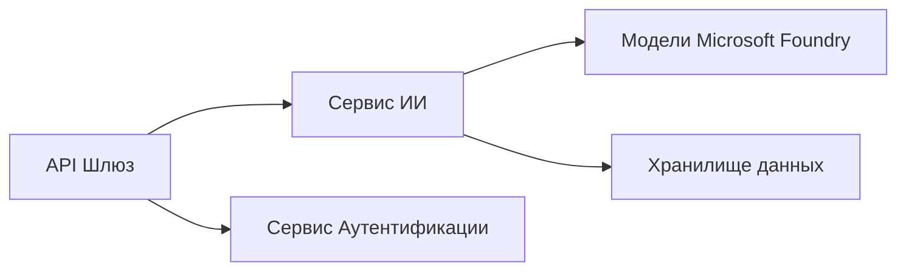
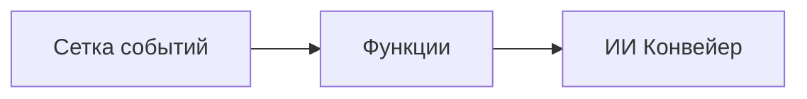

# Глава 8: Производственные и корпоративные шаблоны

**📚 Курс**: [AZD для начинающих](../../README.md) | **⏱️ Длительность**: 2-3 часа | **⭐ Сложность**: Продвинутый

---

## Обзор

В этой главе рассматриваются шаблоны развертывания, готовые для корпоративного использования, повышение безопасности, мониторинг и оптимизация затрат для производственных AI-нагрузок.

> Проверено на `azd 1.25.6` в июне 2026 года.

## Цели обучения

Выполнив эту главу, вы:
- Развернёте отказоустойчивые приложения с несколькими регионами
- Реализуете корпоративные шаблоны безопасности
- Настроите комплексный мониторинг
- Оптимизируете затраты в масштабе
- Настроите CI/CD пайплайны с AZD

---

## 📚 Уроки

| # | Урок | Описание | Время |
|---|--------|-------------|------|
| 1 | [Практики производственного AI](production-ai-practices.md) | Корпоративные шаблоны развертывания | 90 мин |

---

## 🚀 Контрольный список для производства

- [ ] Развертывание в нескольких регионах для отказоустойчивости
- [ ] Управляемая идентификация для аутентификации (без ключей)
- [ ] Application Insights для мониторинга
- [ ] Настроены бюджеты и оповещения по затратам
- [ ] Включено сканирование безопасности
- [ ] Интеграция CI/CD пайплайнов
- [ ] План аварийного восстановления

---

## 🏗️ Архитектурные шаблоны

### Шаблон 1: Микросервисы AI



### Шаблон 2: Событийно-ориентированный AI



---

## 🔐 Лучшие практики безопасности

```bicep
// Use managed identity
identity: {
  type: 'SystemAssigned'
}

// Private endpoints for AI services
properties: {
  publicNetworkAccess: 'Disabled'
  networkAcls: {
    defaultAction: 'Deny'
  }
}
```

---

## 💰 Оптимизация затрат

| Стратегия | Экономия |
|----------|---------|
| Масштабирование до нуля (Контейнерные приложения) | 60-80% |
| Использование потребительских уровней для разработки | 50-70% |
| Плановое масштабирование | 30-50% |
| Резервированная емкость | 20-40% |

```bash
# Установить уведомления о бюджете
az consumption budget create \
  --budget-name "AI-Budget" \
  --amount 500 \
  --category Cost \
  --time-grain Monthly
```

---

## 📊 Настройка мониторинга

```bash
# Поток журналов
azd monitor --logs

# Проверьте Application Insights
azd monitor --overview

# Просмотр метрик
az monitor metrics list --resource <resource-id>
```

---

## 🔗 Навигация

| Направление | Глава |
|-----------|---------|
| **Предыдущая** | [Глава 7: Решение проблем](../chapter-07-troubleshooting/README.md) |
| **Завершение курса** | [Главная страница курса](../../README.md) |

---

## 📖 Связанные ресурсы

- [Руководство по AI-агентам](../chapter-02-ai-development/agents.md)
- [Application Insights](../chapter-06-pre-deployment/application-insights.md)
- [Мультиагентные решения](../chapter-05-multi-agent/README.md)
- [Пример микросервисов](../../examples/microservices/README.md)

---

<!-- CO-OP TRANSLATOR DISCLAIMER START -->
**Отказ от ответственности**:
Этот документ был переведен с использованием сервиса машинного перевода [Co-op Translator](https://github.com/Azure/co-op-translator). Несмотря на наши усилия по обеспечению точности, имейте в виду, что автоматический перевод может содержать ошибки или неточности. Оригинальный документ на его исходном языке следует считать авторитетным источником. Для получения критически важной информации рекомендуется обратиться к профессиональному человеческому переводу. Мы не несем ответственности за любые недоразумения или неправильные толкования, возникшие в результате использования этого перевода.
<!-- CO-OP TRANSLATOR DISCLAIMER END -->