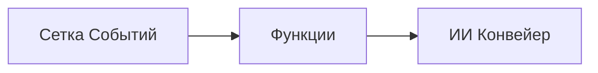

# Глава 8: Производственные и корпоративные шаблоны

**📚 Курс**: [AZD для начинающих](../../README.md) | **⏱️ Продолжительность**: 2-3 часа | **⭐ Сложность**: Продвинутый

---

## Обзор

В этой главе рассматриваются шаблоны развертывания, готовые для корпоративного использования, усиление безопасности, мониторинг и оптимизация затрат для производственных рабочих нагрузок ИИ.

## Цели обучения

После изучения этой главы вы сможете:
- Развертывать отказоустойчивые приложения в нескольких регионах
- Реализовывать корпоративные шаблоны безопасности
- Настраивать комплексный мониторинг
- Оптимизировать затраты в масштабе
- Настраивать CI/CD каналы с помощью AZD

---

## 📚 Уроки

| # | Урок | Описание | Время |
|---|--------|-------------|------|
| 1 | [Производственные практики ИИ](production-ai-practices.md) | Корпоративные шаблоны развертывания | 90 мин |

---

## 🚀 Контрольный список для производства

- [ ] Развертывание в нескольких регионах для отказоустойчивости
- [ ] Управляемая идентификация для аутентификации (без ключей)
- [ ] Application Insights для мониторинга
- [ ] Настроены бюджеты и оповещения по затратам
- [ ] Включено сканирование безопасности
- [ ] Интеграция с CI/CD каналом
- [ ] План аварийного восстановления

---

## 🏗️ Архитектурные шаблоны

### Шаблон 1: Микросервисы ИИ


### Шаблон 2: Событийно-ориентированный ИИ


---

## 🔐 Лучшие практики безопасности

```bicep
// Use managed identity
identity: {
  type: 'SystemAssigned'
}

// Private endpoints for AI services
properties: {
  publicNetworkAccess: 'Disabled'
  networkAcls: {
    defaultAction: 'Deny'
  }
}
```

---

## 💰 Оптимизация затрат

| Стратегия | Экономия |
|----------|---------|
| Масштабирование до нуля (Container Apps) | 60-80% |
| Использование потребительских уровней для разработки | 50-70% |
| Плановое масштабирование | 30-50% |
| Зарезервированная емкость | 20-40% |

```bash
# Установить оповещения о бюджете
az consumption budget create \
  --budget-name "AI-Budget" \
  --amount 500 \
  --category Cost \
  --time-grain Monthly
```

---

## 📊 Настройка мониторинга

```bash
# Потоковый вывод логов
azd monitor --logs

# Проверить Application Insights
azd monitor

# Просмотр метрик
az monitor metrics list --resource <resource-id>
```

---

## 🔗 Навигация

| Направление | Глава |
|-----------|---------|
| **Предыдущая** | [Глава 7: Устранение неполадок](../chapter-07-troubleshooting/README.md) |
| **Курс завершен** | [Главная курсa](../../README.md) |

---

## 📖 Связанные ресурсы

- [Руководство по агентам ИИ](../chapter-02-ai-development/agents.md)
- [Application Insights](../chapter-06-pre-deployment/application-insights.md)
- [Решения с несколькими агентами](../chapter-05-multi-agent/README.md)
- [Пример микросервисов](../../examples/microservices/README.md)

---

<!-- CO-OP TRANSLATOR DISCLAIMER START -->
**Отказ от ответственности**:  
Данный документ был переведен с помощью сервиса автоматического перевода [Co-op Translator](https://github.com/Azure/co-op-translator). Несмотря на наши усилия обеспечить точность, просим учитывать, что автоматический перевод может содержать ошибки или неточности. Оригинальный документ на родном языке следует считать авторитетным источником. Для критически важной информации рекомендуется обратиться к профессиональному переводу, выполненному человеком. Мы не несем ответственности за любые недоразумения или неправильные толкования, возникшие в результате использования данного перевода.
<!-- CO-OP TRANSLATOR DISCLAIMER END -->