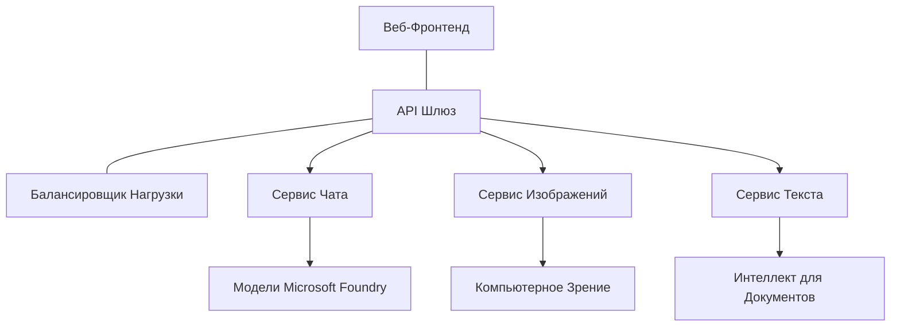

# Лучшие практики для производственных AI-нагрузок с AZD

**Навигация по главам:**
- **📚 Главная курса**: [AZD для начинающих](../../README.md)
- **📖 Текущая глава**: Глава 8 - Производственные и корпоративные паттерны
- **⬅️ Предыдущая глава**: [Глава 7: Устранение неполадок](../chapter-07-troubleshooting/debugging.md)
- **⬅️ Также связано**: [AI Workshop Lab](ai-workshop-lab.md)
- **🎯 Завершение курса**: [AZD для начинающих](../../README.md)

## Обзор

Это руководство предоставляет комплексные лучшие практики для развертывания производственных AI-нагрузок с использованием Azure Developer CLI (AZD). Основываясь на отзывах сообщества Microsoft Foundry Discord и реальных внедрениях у клиентов, эти рекомендации решают самые распространённые проблемы в производственных AI-системах.

## Основные решаемые задачи

По результатам опроса нашего сообщества, вот топ проблем, с которыми сталкиваются разработчики:

- **45%** испытывают трудности с многосервисными AI-развёртываниями  
- **38%** сталкиваются с проблемами управления учётными данными и секретами  
- **35%** находят сложным обеспечение готовности к производству и масштабирование  
- **32%** нуждаются в лучших стратегиях оптимизации затрат  
- **29%** требуют улучшенного мониторинга и устранения неполадок  

## Паттерны архитектуры для производственного AI

### Паттерн 1: Архитектура микросервисов для AI

**Когда использовать**: сложные AI-приложения с множеством возможностей


**Реализация в AZD**:

```yaml
# azure.yaml
name: enterprise-ai-platform
services:
  web:
    project: ./web
    host: staticwebapp
  api-gateway:
    project: ./api-gateway
    host: containerapp
  chat-service:
    project: ./services/chat
    host: containerapp
  vision-service:
    project: ./services/vision
    host: containerapp
  text-service:
    project: ./services/text
    host: containerapp
```

### Паттерн 2: Событийно-ориентированная AI-обработка

**Когда использовать**: пакетная обработка, анализ документов, асинхронные рабочие процессы

```bicep
// Event Hub for AI processing pipeline
resource eventHub 'Microsoft.EventHub/namespaces@2023-01-01-preview' = {
  name: eventHubNamespaceName
  location: location
  sku: {
    name: 'Standard'
    tier: 'Standard'
    capacity: 1
  }
}

// Service Bus for reliable message processing
resource serviceBus 'Microsoft.ServiceBus/namespaces@2022-10-01-preview' = {
  name: serviceBusNamespaceName
  location: location
  sku: {
    name: 'Premium'
    tier: 'Premium'
    capacity: 1
  }
}

// Function App for processing
resource functionApp 'Microsoft.Web/sites@2023-01-01' = {
  name: functionAppName
  location: location
  kind: 'functionapp,linux'
  properties: {
    siteConfig: {
      appSettings: [
        {
          name: 'FUNCTIONS_EXTENSION_VERSION'
          value: '~4'
        }
        {
          name: 'AZURE_OPENAI_ENDPOINT'
          value: '@Microsoft.KeyVault(VaultName=${keyVault.name};SecretName=openai-endpoint)'
        }
      ]
    }
  }
}
```

## Оценка состояния AI-агентов

Когда традиционное веб-приложение ломается, симптомы знакомы: страница не загружается, API возвращает ошибку или развёртывание неудачно. AI-приложения могут ломаться теми же способами — но также могут работать с нарушениями, не давая явных сообщений об ошибках.

Этот раздел помогает вам построить ментальную модель мониторинга AI-нагрузок, чтобы вы знали, куда смотреть, если что-то идёт не так.

### Чем состояние агента отличается от состояния традиционного приложения

Традиционное приложение либо работает, либо нет. AI-агент может казаться работоспособным, но выдавать плохие результаты. Рассматривайте состояние агента в два слоя:

| Слой | Что отслеживать | Куда смотреть |
|-------|-----------------|---------------|
| **Состояние инфраструктуры** | Запущена ли служба? Развёрнуты ли ресурсы? Доступны ли конечные точки? | `azd monitor`, здоровье ресурсов в Azure Portal, логи контейнеров/приложения |
| **Состояние поведения** | Корректно ли реагирует агент? Быстры ли ответы? Правильно ли вызывается модель? | трассы Application Insights, метрики задержек вызовов модели, логи качества ответов |

Состояние инфраструктуры знакомо — оно одинаково для любого azd-приложения. Состояние поведения — новый слой, который добавляют AI-нагрузки.

### Куда смотреть, когда AI-приложения ведут себя неожиданно

Если ваше AI-приложение не даёт ожидаемых результатов, вот концептуальный чеклист:

1. **Начните с основ.** Запущено ли приложение? Имеет ли доступ к зависимостям? Проверьте `azd monitor` и здоровье ресурсов так же, как для любого приложения.
2. **Проверьте подключение к модели.** Ваше приложение успешно вызывает AI-модель? Ошибки или тайм-ауты вызовов модели — самая частая причина проблем в AI-приложениях, они отразятся в логах приложения.
3. **Посмотрите, что получила модель.** Ответы AI зависят от входных данных (промпта и любого извлечённого контекста). Если результат неверен, обычно проблема во входных данных. Убедитесь, что приложение отправляет модели правильные данные.
4. **Проследите задержку ответов.** Вызовы модели AI медленнее обычных API. Если приложение тормозит, проверьте, не увеличилось ли время отклика модели — это может указывать на ограничение по пропускной способности, ёмкости или региональные задержки.
5. **Обратите внимание на сигналы по затратам.** Неожиданные всплески в использовании токенов или API-вызовов могут означать зацикливание, неправильно настроенный промпт или чрезмерные повторные попытки.

Не нужно сразу мастерить инструменты наблюдения. Главное — понимать, что AI-приложения имеют дополнительный слой поведения для мониторинга, а встроенный мониторинг azd (`azd monitor`) даёт стартовую точку для проверки обоих уровней.

---

## Лучшие практики безопасности

### 1. Модель безопасности с нулевым доверием

**Стратегия внедрения**:
- Нет межсервисного взаимодействия без аутентификации  
- Все API-вызовы используют управляемые идентичности  
- Сетевая изоляция с помощью приватных конечных точек  
- Контроль доступа по принципу наименьших привилегий  

```bicep
// Managed Identity for each service
resource chatServiceIdentity 'Microsoft.ManagedIdentity/userAssignedIdentities@2023-01-31' = {
  name: 'chat-service-identity'
  location: location
}

// Role assignments with minimal permissions
resource openAIUserRole 'Microsoft.Authorization/roleAssignments@2022-04-01' = {
  scope: openAIAccount
  name: guid(openAIAccount.id, chatServiceIdentity.id, openAIUserRoleDefinitionId)
  properties: {
    roleDefinitionId: subscriptionResourceId('Microsoft.Authorization/roleDefinitions', '5e0bd9bd-7b93-4f28-af87-19fc36ad61bd')
    principalId: chatServiceIdentity.properties.principalId
    principalType: 'ServicePrincipal'
  }
}
```

### 2. Безопасное управление секретами

**Паттерн интеграции с Key Vault**:

```bicep
// Key Vault with proper access policies
resource keyVault 'Microsoft.KeyVault/vaults@2023-02-01' = {
  name: keyVaultName
  location: location
  properties: {
    tenantId: tenant().tenantId
    sku: {
      family: 'A'
      name: 'premium'  // Use premium for production
    }
    enableRbacAuthorization: true  // Use RBAC instead of access policies
    enablePurgeProtection: true    // Prevent accidental deletion
    enableSoftDelete: true
    softDeleteRetentionInDays: 90
  }
}

// Store all AI service credentials
resource openAIKeySecret 'Microsoft.KeyVault/vaults/secrets@2023-02-01' = {
  parent: keyVault
  name: 'openai-api-key'
  properties: {
    value: openAIAccount.listKeys().key1
    attributes: {
      enabled: true
    }
  }
}
```

### 3. Сетевая безопасность

**Настройка приватных конечных точек**:

```bicep
// Virtual Network for AI services
resource virtualNetwork 'Microsoft.Network/virtualNetworks@2023-04-01' = {
  name: vnetName
  location: location
  properties: {
    addressSpace: {
      addressPrefixes: ['10.0.0.0/16']
    }
    subnets: [
      {
        name: 'ai-services-subnet'
        properties: {
          addressPrefix: '10.0.1.0/24'
          privateEndpointNetworkPolicies: 'Disabled'
        }
      }
      {
        name: 'app-services-subnet'
        properties: {
          addressPrefix: '10.0.2.0/24'
          delegations: [
            {
              name: 'Microsoft.Web/serverFarms'
              properties: {
                serviceName: 'Microsoft.Web/serverFarms'
              }
            }
          ]
        }
      }
    ]
  }
}

// Private endpoints for all AI services
resource openAIPrivateEndpoint 'Microsoft.Network/privateEndpoints@2023-04-01' = {
  name: '${openAIAccountName}-pe'
  location: location
  properties: {
    subnet: {
      id: virtualNetwork.properties.subnets[0].id
    }
    privateLinkServiceConnections: [
      {
        name: 'openai-connection'
        properties: {
          privateLinkServiceId: openAIAccount.id
          groupIds: ['account']
        }
      }
    ]
  }
}
```

## Производительность и масштабирование

### 1. Стратегии авто-масштабирования

**Автоматическое масштабирование в Container Apps**:

```bicep
resource containerApp 'Microsoft.App/containerApps@2023-05-01' = {
  name: containerAppName
  location: location
  properties: {
    configuration: {
      ingress: {
        external: true
        targetPort: 8000
        transport: 'http'
      }
    }
    template: {
      scale: {
        minReplicas: 2  // Always have 2 instances minimum
        maxReplicas: 50 // Scale up to 50 for high load
        rules: [
          {
            name: 'http-scaling'
            http: {
              metadata: {
                concurrentRequests: '20'  // Scale when >20 concurrent requests
              }
            }
          }
          {
            name: 'cpu-scaling'
            custom: {
              type: 'cpu'
              metadata: {
                type: 'Utilization'
                value: '70'  // Scale when CPU >70%
              }
            }
          }
        ]
      }
    }
  }
}
```

### 2. Стратегии кэширования

**Кэш Redis для AI-ответов**:

```bicep
// Redis Premium for production workloads
resource redisCache 'Microsoft.Cache/redis@2023-04-01' = {
  name: redisCacheName
  location: location
  properties: {
    sku: {
      name: 'Premium'
      family: 'P'
      capacity: 1
    }
    enableNonSslPort: false
    minimumTlsVersion: '1.2'
    redisConfiguration: {
      'maxmemory-policy': 'allkeys-lru'
    }
    // Enable clustering for high availability
    redisVersion: '6.0'
    shardCount: 2
  }
}

// Cache configuration in application
var cacheConnectionString = '${redisCache.properties.hostName}:6380,password=${redisCache.listKeys().primaryKey},ssl=True,abortConnect=False'
```

### 3. Балансировка нагрузки и управление трафиком

**Application Gateway с WAF**:

```bicep
// Application Gateway with Web Application Firewall
resource applicationGateway 'Microsoft.Network/applicationGateways@2023-04-01' = {
  name: appGatewayName
  location: location
  properties: {
    sku: {
      name: 'WAF_v2'
      tier: 'WAF_v2'
      capacity: 2
    }
    webApplicationFirewallConfiguration: {
      enabled: true
      firewallMode: 'Prevention'
      ruleSetType: 'OWASP'
      ruleSetVersion: '3.2'
    }
    // Backend pools for AI services
    backendAddressPools: [
      {
        name: 'ai-services-pool'
        properties: {
          backendAddresses: [
            {
              fqdn: '${containerApp.properties.configuration.ingress.fqdn}'
            }
          ]
        }
      }
    ]
  }
}
```

## 💰 Оптимизация затрат

### 1. Подбор размеров ресурсов

**Конфигурации для различных сред**:

```bash
# Среда разработки
azd env new development
azd env set AZURE_OPENAI_SKU "S0"
azd env set AZURE_OPENAI_CAPACITY 10
azd env set AZURE_SEARCH_SKU "basic"
azd env set CONTAINER_CPU 0.5
azd env set CONTAINER_MEMORY 1.0

# Производственная среда
azd env new production
azd env set AZURE_OPENAI_SKU "S0"
azd env set AZURE_OPENAI_CAPACITY 100
azd env set AZURE_SEARCH_SKU "standard"
azd env set CONTAINER_CPU 2.0
azd env set CONTAINER_MEMORY 4.0
```

### 2. Мониторинг затрат и бюджеты

```bicep
// Cost management and budgets
resource budget 'Microsoft.Consumption/budgets@2023-05-01' = {
  name: 'ai-workload-budget'
  properties: {
    timePeriod: {
      startDate: '2024-01-01'
      endDate: '2024-12-31'
    }
    timeGrain: 'Monthly'
    amount: 2000  // $2000 monthly budget
    category: 'Cost'
    notifications: {
      warning: {
        enabled: true
        operator: 'GreaterThan'
        threshold: 80
        contactEmails: [
          'finance@company.com'
          'engineering@company.com'
        ]
        contactRoles: [
          'Owner'
          'Contributor'
        ]
      }
      critical: {
        enabled: true
        operator: 'GreaterThan'
        threshold: 95
        contactEmails: [
          'cto@company.com'
        ]
      }
    }
  }
}
```

### 3. Оптимизация использования токенов

**Управление затратами OpenAI**:

```typescript
// Оптимизация токенов на уровне приложения
class TokenOptimizer {
  private readonly maxTokens = 4000;
  private readonly reserveTokens = 500;
  
  optimizePrompt(userInput: string, context: string): string {
    const availableTokens = this.maxTokens - this.reserveTokens;
    const estimatedTokens = this.estimateTokens(userInput + context);
    
    if (estimatedTokens > availableTokens) {
      // Урезать контекст, а не ввод пользователя
      context = this.truncateContext(context, availableTokens - this.estimateTokens(userInput));
    }
    
    return `${context}\n\nUser: ${userInput}`;
  }
  
  private estimateTokens(text: string): number {
    // Приблизительная оценка: 1 токен ≈ 4 символа
    return Math.ceil(text.length / 4);
  }
}
```

## Мониторинг и наблюдаемость

### 1. Комплексные Application Insights

```bicep
// Application Insights with advanced features
resource applicationInsights 'Microsoft.Insights/components@2020-02-02' = {
  name: applicationInsightsName
  location: location
  kind: 'web'
  properties: {
    Application_Type: 'web'
    WorkspaceResourceId: logAnalyticsWorkspace.id
    SamplingPercentage: 100  // Full sampling for AI apps
    DisableIpMasking: false  // Enable for security
  }
}

// Custom metrics for AI operations
resource aiMetricAlerts 'Microsoft.Insights/metricAlerts@2018-03-01' = {
  name: 'ai-high-error-rate'
  location: 'global'
  properties: {
    description: 'Alert when AI service error rate is high'
    severity: 2
    enabled: true
    scopes: [
      applicationInsights.id
    ]
    evaluationFrequency: 'PT1M'
    windowSize: 'PT5M'
    criteria: {
      'odata.type': 'Microsoft.Azure.Monitor.SingleResourceMultipleMetricCriteria'
      allOf: [
        {
          name: 'high-error-rate'
          metricName: 'requests/failed'
          operator: 'GreaterThan'
          threshold: 10
          timeAggregation: 'Count'
        }
      ]
    }
  }
}
```

### 2. Мониторинг, специфичный для AI

**Пользовательские панели для AI-метрик**:

```json
// Dashboard configuration for AI workloads
{
  "dashboard": {
    "name": "AI Application Monitoring",
    "tiles": [
      {
        "name": "OpenAI Request Volume",
        "query": "requests | where name contains 'openai' | summarize count() by bin(timestamp, 5m)"
      },
      {
        "name": "AI Response Latency",
        "query": "requests | where name contains 'openai' | summarize avg(duration) by bin(timestamp, 5m)"
      },
      {
        "name": "Token Usage",
        "query": "customMetrics | where name == 'openai_tokens_used' | summarize sum(value) by bin(timestamp, 1h)"
      },
      {
        "name": "Cost per Hour",
        "query": "customMetrics | where name == 'openai_cost' | summarize sum(value) by bin(timestamp, 1h)"
      }
    ]
  }
}
```

### 3. Проверки здоровья и мониторинг времени работы

```bicep
// Application Insights availability tests
resource availabilityTest 'Microsoft.Insights/webtests@2022-06-15' = {
  name: 'ai-app-availability-test'
  location: location
  tags: {
    'hidden-link:${applicationInsights.id}': 'Resource'
  }
  properties: {
    SyntheticMonitorId: 'ai-app-availability-test'
    Name: 'AI Application Availability Test'
    Description: 'Tests AI application endpoints'
    Enabled: true
    Frequency: 300  // 5 minutes
    Timeout: 120    // 2 minutes
    Kind: 'ping'
    Locations: [
      {
        Id: 'us-east-2-azr'
      }
      {
        Id: 'us-west-2-azr'
      }
    ]
    Configuration: {
      WebTest: '''
        <WebTest Name="AI Health Check" 
                 Id="8d2de8d2-a2b0-4c2e-9a0d-8f9c9a0b8c8d" 
                 Enabled="True" 
                 CssProjectStructure="" 
                 CssIteration="" 
                 Timeout="120" 
                 WorkItemIds="" 
                 xmlns="http://microsoft.com/schemas/VisualStudio/TeamTest/2010" 
                 Description="" 
                 CredentialUserName="" 
                 CredentialPassword="" 
                 PreAuthenticate="True" 
                 Proxy="default" 
                 StopOnError="False" 
                 RecordedResultFile="" 
                 ResultsLocale="">
          <Items>
            <Request Method="GET" 
                     Guid="a5f10126-e4cd-570d-961c-cea43999a200" 
                     Version="1.1" 
                     Url="${webApp.properties.defaultHostName}/health" 
                     ThinkTime="0" 
                     Timeout="120" 
                     ParseDependentRequests="True" 
                     FollowRedirects="True" 
                     RecordResult="True" 
                     Cache="False" 
                     ResponseTimeGoal="0" 
                     Encoding="utf-8" 
                     ExpectedHttpStatusCode="200" 
                     ExpectedResponseUrl="" 
                     ReportingName="" 
                     IgnoreHttpStatusCode="False" />
          </Items>
        </WebTest>
      '''
    }
  }
}
```

## Восстановление после сбоев и высокая доступность

### 1. Развёртывание в нескольких регионах

```yaml
# azure.yaml - Multi-region configuration
name: ai-app-multiregion
services:
  api-primary:
    project: ./api
    host: containerapp
    env:
      - AZURE_REGION=eastus
  api-secondary:
    project: ./api
    host: containerapp
    env:
      - AZURE_REGION=westus2
```

```bicep
// Traffic Manager for global load balancing
resource trafficManager 'Microsoft.Network/trafficManagerProfiles@2022-04-01' = {
  name: trafficManagerProfileName
  location: 'global'
  properties: {
    profileStatus: 'Enabled'
    trafficRoutingMethod: 'Priority'
    dnsConfig: {
      relativeName: trafficManagerProfileName
      ttl: 30
    }
    monitorConfig: {
      protocol: 'HTTPS'
      port: 443
      path: '/health'
      intervalInSeconds: 30
      toleratedNumberOfFailures: 3
      timeoutInSeconds: 10
    }
    endpoints: [
      {
        name: 'primary-endpoint'
        type: 'Microsoft.Network/trafficManagerProfiles/azureEndpoints'
        properties: {
          targetResourceId: primaryAppService.id
          endpointStatus: 'Enabled'
          priority: 1
        }
      }
      {
        name: 'secondary-endpoint'
        type: 'Microsoft.Network/trafficManagerProfiles/azureEndpoints'
        properties: {
          targetResourceId: secondaryAppService.id
          endpointStatus: 'Enabled'
          priority: 2
        }
      }
    ]
  }
}
```

### 2. Резервное копирование и восстановление данных

```bicep
// Backup configuration for critical data
resource backupVault 'Microsoft.DataProtection/backupVaults@2023-05-01' = {
  name: backupVaultName
  location: location
  identity: {
    type: 'SystemAssigned'
  }
  properties: {
    storageSettings: [
      {
        datastoreType: 'VaultStore'
        type: 'LocallyRedundant'
      }
    ]
  }
}

// Backup policy for AI models and data
resource backupPolicy 'Microsoft.DataProtection/backupVaults/backupPolicies@2023-05-01' = {
  parent: backupVault
  name: 'ai-data-backup-policy'
  properties: {
    policyRules: [
      {
        backupParameters: {
          backupType: 'Full'
          objectType: 'AzureBackupParams'
        }
        trigger: {
          schedule: {
            repeatingTimeIntervals: [
              'R/2024-01-01T02:00:00+00:00/P1D'  // Daily at 2 AM
            ]
          }
          objectType: 'ScheduleBasedTriggerContext'
        }
        dataStore: {
          datastoreType: 'VaultStore'
          objectType: 'DataStoreInfoBase'
        }
        name: 'BackupDaily'
        objectType: 'AzureBackupRule'
      }
    ]
  }
}
```

## Интеграция DevOps и CI/CD

### 1. Рабочий процесс GitHub Actions

```yaml
# .github/workflows/deploy-ai-app.yml
name: Deploy AI Application

on:
  push:
    branches: [main]
  pull_request:
    branches: [main]

jobs:
  test:
    runs-on: ubuntu-latest
    steps:
      - uses: actions/checkout@v4
      
      - name: Setup Python
        uses: actions/setup-python@v4
        with:
          python-version: '3.11'
          
      - name: Install dependencies
        run: |
          pip install -r requirements.txt
          pip install pytest
          
      - name: Run tests
        run: pytest tests/
        
      - name: AI Safety Tests
        run: |
          python scripts/test_ai_safety.py
          python scripts/validate_prompts.py

  deploy-staging:
    needs: test
    if: github.event_name == 'pull_request'
    runs-on: ubuntu-latest
    steps:
      - uses: actions/checkout@v4
      
      - name: Setup AZD
        uses: Azure/setup-azd@v1.0.0
        
      - name: Login to Azure
        uses: azure/login@v1
        with:
          creds: ${{ secrets.AZURE_CREDENTIALS }}
          
      - name: Deploy to Staging
        run: |
          azd env select staging
          azd deploy

  deploy-production:
    needs: test
    if: github.ref == 'refs/heads/main'
    runs-on: ubuntu-latest
    steps:
      - uses: actions/checkout@v4
      
      - name: Setup AZD
        uses: Azure/setup-azd@v1.0.0
        
      - name: Login to Azure
        uses: azure/login@v1
        with:
          creds: ${{ secrets.AZURE_CREDENTIALS }}
          
      - name: Deploy to Production
        run: |
          azd env select production
          azd deploy
          
      - name: Run Production Health Checks
        run: |
          python scripts/health_check.py --env production
```

### 2. Валидация инфраструктуры

```bash
# scripts/validate_infrastructure.sh
#!/bin/bash

echo "Validating AI infrastructure deployment..."

# Проверить, что все необходимые сервисы запущены
services=("openai" "search" "storage" "keyvault")
for service in "${services[@]}"; do
    echo "Checking $service..."
    if ! az resource list --resource-type "Microsoft.CognitiveServices/accounts" --query "[?contains(name, '$service')]" -o tsv; then
        echo "ERROR: $service not found"
        exit 1
    fi
done

# Проверить развертывания моделей OpenAI
echo "Validating OpenAI model deployments..."
models=$(az cognitiveservices account deployment list --name $AZURE_OPENAI_NAME --resource-group $AZURE_RESOURCE_GROUP --query "[].name" -o tsv)
if [[ ! $models == *"gpt-35-turbo"* ]]; then
    echo "ERROR: Required model gpt-35-turbo not deployed"
    exit 1
fi

# Проверить соединение с AI-сервисом
echo "Testing AI service connectivity..."
python scripts/test_connectivity.py

echo "Infrastructure validation completed successfully!"
```

## Чеклист готовности к производству

### Безопасность ✅
- [ ] Все сервисы используют управляемые идентичности  
- [ ] Секреты хранятся в Key Vault  
- [ ] Настроены приватные конечные точки  
- [ ] Внедрены сетевые группы безопасности  
- [ ] RBAC с минимальными привилегиями  
- [ ] WAF включён на публичных конечных точках  

### Производительность ✅
- [ ] Настроено авто-масштабирование  
- [ ] Внедрено кэширование  
- [ ] Настроена балансировка нагрузки  
- [ ] CDN для статического контента  
- [ ] Пул соединений к базе данных  
- [ ] Оптимизация использования токенов  

### Мониторинг ✅
- [ ] Сконфигурирован Application Insights  
- [ ] Определены пользовательские метрики  
- [ ] Настроены правила оповещений  
- [ ] Созданы панели мониторинга  
- [ ] Внедрены проверки здоровья  
- [ ] Установлены политики хранения логов  

### Надёжность ✅
- [ ] Развёртывание в нескольких регионах  
- [ ] План резервного копирования и восстановления  
- [ ] Внедрены «автоматы размыкания» (circuit breakers)  
- [ ] Конфигурация политик повторных попыток  
- [ ] Плавное деградирование  
- [ ] Конечные точки для проверок здоровья  

### Управление затратами ✅
- [ ] Настроены оповещения по бюджету  
- [ ] Подбор размеров ресурсов  
- [ ] Применение скидок на разработку/тестирование  
- [ ] Приобретены резервированные инстансы  
- [ ] Панель мониторинга затрат  
- [ ] Регулярные обзоры затрат  

### Комплаенс ✅
- [ ] Выполнение требований к локализации данных  
- [ ] Включено аудитирование логов  
- [ ] Применены политики соответствия  
- [ ] Внедрены базовые стандарты безопасности  
- [ ] Регулярные оценки безопасности  
- [ ] План реагирования на инциденты  

## Бенчмарки производительности

### Типичные производственные метрики

| Метрика | Цель | Мониторинг |
|---------|-------|------------|
| **Время отклика** | < 2 секунд | Application Insights |
| **Доступность** | 99.9% | Мониторинг времени работы |
| **Доля ошибок** | < 0.1% | Логи приложения |
| **Использование токенов** | < $500/месяц | Управление затратами |
| **Одновременные пользователи** | 1000+ | Нагрузочное тестирование |
| **Время восстановления** | < 1 час | Тесты восстановления после сбоев |

### Нагрузочное тестирование

```bash
# Скрипт нагрузочного тестирования для AI-приложений
python scripts/load_test.py \
  --endpoint https://your-ai-app.azurewebsites.net \
  --concurrent-users 100 \
  --duration 300 \
  --ramp-up 60
```

## 🤝 Лучшие практики сообщества

На основе отзывов сообщества Microsoft Foundry Discord:

### Главные рекомендации от сообщества:

1. **Начинайте с малого, масштабируйтесь постепенно**: стартуйте с базовых SKU и увеличивайте по мере реального использования  
2. **Мониторьте всё**: настройте комплексный мониторинг с первого дня  
3. **Автоматизируйте безопасность**: применяйте инфраструктуру как код для консистентной безопасности  
4. **Тщательно тестируйте**: включайте AI-специфические тесты в ваш pipeline  
5. **Планируйте затраты**: отслеживайте использование токенов и заранее задавайте оповещения по бюджету  

### Распространённые ошибки, которых стоит избегать:

- ❌ Жёстко прописывать API-ключи в коде  
- ❌ Не настраивать адекватный мониторинг  
- ❌ Игнорировать оптимизацию затрат  
- ❌ Не тестировать сценарии отказа  
- ❌ Развёртывать без проверок здоровья  

## Команды и расширения AZD AI CLI

AZD включает растущий набор команд и расширений, специфичных для AI, которые упрощают производственные AI-воркфлоу. Эти инструменты создают мост между локальной разработкой и производственным развёртыванием AI-нагрузок.

### Расширения AZD для AI

AZD использует систему расширений для добавления AI-функциональности. Устанавливайте и управляйте расширениями через:

```bash
# Вывести список всех доступных расширений (включая ИИ)
azd extension list

# Установить расширение для агентов Foundry
azd extension install azure.ai.agents

# Установить расширение для тонкой настройки
azd extension install azure.ai.finetune

# Установить расширение для пользовательских моделей
azd extension install azure.ai.models

# Обновить все установленные расширения
azd extension upgrade --all
```

**Доступные AI-расширения:**

| Расширение | Назначение | Статус |
|------------|------------|--------|
| `azure.ai.agents` | Управление сервисом Foundry Agent | Предварительный просмотр |
| `azure.ai.finetune` | Тонкая настройка моделей Foundry | Предварительный просмотр |
| `azure.ai.models` | Пользовательские модели Foundry | Предварительный просмотр |
| `azure.coding-agent` | Конфигурация coding agent | Доступно |

### Инициализация проектов агентов командой `azd ai agent init`

Команда `azd ai agent init` создает шаблон проекта AI-агента, готового к производству и интегрированного с Microsoft Foundry Agent Service:

```bash
# Инициализировать новый проект агента из манифеста агента
azd ai agent init -m <manifest-path-or-uri>

# Инициализировать и выбрать конкретный проект Foundry
azd ai agent init -m agent-manifest.yaml --project-id <foundry-project-id>

# Инициализировать с использованием пользовательской директории исходного кода
azd ai agent init -m agent-manifest.yaml --src ./agents/my-agent

# Выбрать Container Apps в качестве хоста
azd ai agent init -m agent-manifest.yaml --host containerapp
```

**Основные флаги:**

| Флаг | Описание |
|------|----------|
| `-m, --manifest` | Путь или URI к манифесту агента для добавления в проект |
| `-p, --project-id` | Существующий Project ID Microsoft Foundry для вашей среды azd |
| `-s, --src` | Каталог для загрузки определения агента (по умолчанию `src/<agent-id>`) |
| `--host` | Переопределить стандартный хост (например, `containerapp`) |
| `-e, --environment` | Среда azd для использования |

**Совет для продакшена**: используйте `--project-id`, чтобы связать проект напрямую с существующим Microsoft Foundry, сохраняя ваш код агента и облачные ресурсы связанными с самого начала.

### Протокол контекста модели (MCP) с `azd mcp`

AZD поддерживает встроенный MCP сервер (альфа-версия), который позволяет AI-агентам и инструментам взаимодействовать с вашими Azure ресурсами через стандартизованный протокол:

```bash
# Запустите MCP сервер для вашего проекта
azd mcp start

# Управляйте согласием на использование инструментов для операций MCP
azd mcp consent
```

MCP сервер открывает контекст вашего проекта azd — среды, сервисы и ресурсы Azure — для AI-инструментов разработки. Это позволяет:

- **AI-помощь при развёртывании**: агенты могут опрашивать состояние проекта и запускать развертывания  
- **Обнаружение ресурсов**: AI-инструменты узнают, какие Azure ресурсы использует проект  
- **Управление средами**: агенты могут переключаться между dev/staging/production  

### Генерация инфраструктуры с `azd infra generate`

Для производственных AI-нагрузок можно генерировать и настраивать инфраструктуру как код вместо автоматического provisioning:

```bash
# Генерировать файлы Bicep/Terraform из определения вашего проекта
azd infra generate
```

Это записывает IaC на диск, чтобы вы могли:
- Проверять и аудитировать инфраструктуру перед развертыванием  
- Добавлять пользовательские политики безопасности (сетевые правила, приватные конечные точки)  
- Интегрироваться с процессами ревью IaC  
- Версионировать изменения инфраструктуры отдельно от кода приложения  

### Хуки жизненного цикла продакшена

AZD хуки позволяют внедрять кастомную логику на каждом этапе жизненного цикла развертывания — это критично для AI-процессов в продакшене:

```yaml
# azure.yaml - Production hooks example
name: ai-production-app
hooks:
  preprovision:
    shell: sh
    run: scripts/validate-quotas.sh    # Check AI model quota before provisioning
  postprovision:
    shell: sh
    run: scripts/configure-networking.sh  # Set up private endpoints
  predeploy:
    shell: sh
    run: scripts/run-ai-safety-tests.sh  # Run prompt safety checks
  postdeploy:
    shell: sh
    run: scripts/smoke-test.sh           # Verify agent responses post-deploy
services:
  agent-api:
    project: ./src/agent
    host: containerapp
    hooks:
      predeploy:
        shell: sh
        run: scripts/validate-model-access.sh  # Per-service hook
```

```bash
# Запустить конкретный хук вручную во время разработки
azd hooks run predeploy
```

**Рекомендуемые хуки для AI-нагрузок в продакшене:**

| Хук | Сценарий применения |
|------|--------------------|
| `preprovision` | Проверка квот подписки для мощности AI модели |
| `postprovision` | Конфигурация приватных конечных точек, развёртывание весов модели |
| `predeploy` | Запуск тестов безопасности AI, проверка шаблонов промптов |
| `postdeploy` | Smoke-тест ответов агента, проверка подключения к модели |

### Конфигурация CI/CD пайплайна

Используйте `azd pipeline config` для подключения проекта к GitHub Actions или Azure Pipelines с безопасной аутентификацией в Azure:

```bash
# Настроить CI/CD конвейер (интерактивно)
azd pipeline config

# Настроить с использованием определённого провайдера
azd pipeline config --provider github
```

Эта команда:
- Создаёт сервисный принципал с минимальными привилегиями  
- Настраивает федеративные учётные данные (без сохранённых секретов)  
- Генерирует или обновляет файл описания пайплайна  
- Устанавливает необходимые переменные среды в вашей CI/CD системе  

**Производственный workflow с конфигурацией пайплайна:**

```bash
# 1. Настройте производственную среду
azd env new production
azd env set AZURE_OPENAI_CAPACITY 100

# 2. Настройте конвейер
azd pipeline config --provider github

# 3. Конвейер выполняет azd deploy при каждом пуше в main
```

### Добавление компонентов с `azd add`

Пошаговое добавление Azure-сервисов в существующий проект:

```bash
# Добавить новый компонент сервиса интерактивно
azd add
```

Это особенно полезно для расширения производственных AI-приложений — например, чтобы добавить сервис векторного поиска, новую конечную точку агента или компонент мониторинга в уже развернутую систему.

## Дополнительные ресурсы
- **Azure Well-Architected Framework**: [Руководство по рабочим нагрузкам ИИ](https://learn.microsoft.com/azure/well-architected/ai/)
- **Microsoft Foundry Documentation**: [Официальная документация](https://learn.microsoft.com/azure/ai-studio/)
- **Community Templates**: [Образцы Azure](https://github.com/Azure-Samples)
- **Discord Community**: [Канал #Azure](https://discord.gg/microsoft-azure)
- **Agent Skills for Azure**: [microsoft/github-copilot-for-azure на skills.sh](https://skills.sh/microsoft/github-copilot-for-azure) - 37 открытых навыков агентов для Azure AI, Foundry, развертывания, оптимизации затрат и диагностики. Установите в вашем редакторе:
  ```bash
  npx skills add microsoft/github-copilot-for-azure
  ```

---

**Навигация по главам:**
- **📚 Главная курса**: [AZD для начинающих](../../README.md)
- **📖 Текущая глава**: Глава 8 — Производственные и корпоративные шаблоны
- **⬅️ Предыдущая глава**: [Глава 7: Устранение неполадок](../chapter-07-troubleshooting/debugging.md)
- **⬅️ Также см.**: [Лаборатория AI Workshop](ai-workshop-lab.md)
- **� Курс завершён**: [AZD для начинающих](../../README.md)

**Помните**: Производственные рабочие нагрузки ИИ требуют тщательного планирования, мониторинга и постоянной оптимизации. Начинайте с этих шаблонов и адаптируйте их под ваши конкретные требования.

---

<!-- CO-OP TRANSLATOR DISCLAIMER START -->
**Отказ от ответственности**:  
Этот документ был переведен с использованием сервиса машинного перевода [Co-op Translator](https://github.com/Azure/co-op-translator). Несмотря на наши усилия по обеспечению точности, просим учитывать, что автоматический перевод может содержать ошибки или неточности. Оригинальный документ на его родном языке следует считать авторитетным источником. Для получения важной информации рекомендуется обратиться к профессиональному переводчику. Мы не несем ответственности за любые недоразумения или неверные толкования, возникшие при использовании данного перевода.
<!-- CO-OP TRANSLATOR DISCLAIMER END -->