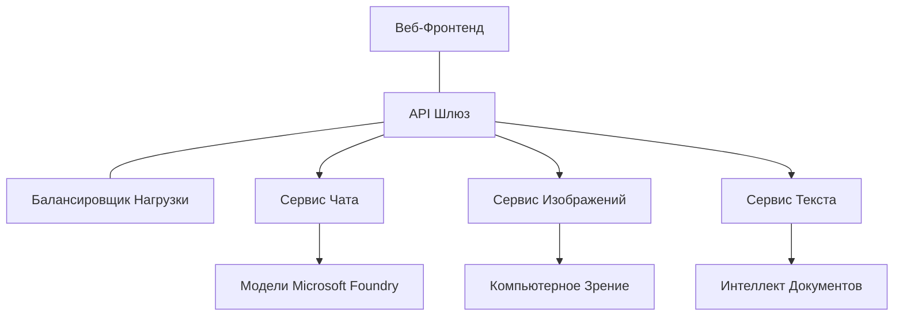

# Лучшие практики работы AI в продакшене с AZD

**Навигация по главам:**
- **📚 Главная курса**: [AZD Для начинающих](../../README.md)
- **📖 Текущая глава**: Глава 8 - Продакшен и корпоративные шаблоны
- **⬅️ Предыдущая глава**: [Глава 7: Отладка](../chapter-07-troubleshooting/debugging.md)
- **⬅️ Также связанная**: [AI Workshop Lab](ai-workshop-lab.md)
- **🎯 Курс завершён**: [AZD Для начинающих](../../README.md)

## Обзор

Это руководство предлагает комплексные лучшие практики для развертывания готовых к продакшену AI нагрузок с помощью Azure Developer CLI (AZD). Основываясь на отзывах сообщества Microsoft Foundry Discord и реальных развертываниях клиентов, эти практики решают наиболее распространённые проблемы в производственных AI системах.

## Основные решаемые задачи

Согласно результатам опроса нашего сообщества, главные сложности для разработчиков таковы:

- **45%** испытывают трудности с мультисервисными AI развертываниями
- **38%** имеют проблемы с управлением учётными данными и секретами  
- **35%** находят сложным обеспечение готовности к продакшену и масштабирование
- **32%** нуждаются в лучших стратегиях оптимизации затрат
- **29%** требуют улучшенного мониторинга и устранения неполадок

## Архитектурные шаблоны для производственного AI

### Шаблон 1: Микросервисная AI архитектура

**Когда использовать**: Сложные AI-приложения с множеством возможностей



**Реализация в AZD**:

```yaml
# azure.yaml
name: enterprise-ai-platform
services:
  web:
    project: ./web
    host: staticwebapp
  api-gateway:
    project: ./api-gateway
    host: containerapp
  chat-service:
    project: ./services/chat
    host: containerapp
  vision-service:
    project: ./services/vision
    host: containerapp
  text-service:
    project: ./services/text
    host: containerapp
```

### Шаблон 2: Событийно-ориентированная AI обработка

**Когда использовать**: Пакетная обработка, анализ документов, асинхронные рабочие процессы

```bicep
// Event Hub for AI processing pipeline
resource eventHub 'Microsoft.EventHub/namespaces@2023-01-01-preview' = {
  name: eventHubNamespaceName
  location: location
  sku: {
    name: 'Standard'
    tier: 'Standard'
    capacity: 1
  }
}

// Service Bus for reliable message processing
resource serviceBus 'Microsoft.ServiceBus/namespaces@2022-10-01-preview' = {
  name: serviceBusNamespaceName
  location: location
  sku: {
    name: 'Premium'
    tier: 'Premium'
    capacity: 1
  }
}

// Function App for processing
resource functionApp 'Microsoft.Web/sites@2023-01-01' = {
  name: functionAppName
  location: location
  kind: 'functionapp,linux'
  properties: {
    siteConfig: {
      appSettings: [
        {
          name: 'FUNCTIONS_EXTENSION_VERSION'
          value: '~4'
        }
        {
          name: 'AZURE_OPENAI_ENDPOINT'
          value: '@Microsoft.KeyVault(VaultName=${keyVault.name};SecretName=openai-endpoint)'
        }
      ]
    }
  }
}
```

## Мысли о состоянии AI агентa

Когда традиционное веб-приложение ломается, симптомы привычны: страница не загружается, API возвращает ошибку или неудачно прошла публикация. AI-приложения могут ломаться такими же способами — но также могут работать с низкой точностью, не выдавая явных ошибок.

Этот раздел помогает выстроить ментальную модель мониторинга AI нагрузок, чтобы вы знали, куда смотреть, если что-то идёт не так.

### Чем состояние агента отличается от состояния традиционного приложения

Традиционное приложение либо работает, либо нет. AI агент может казаться работающим, но выдавать плохие результаты. Рассматривайте состояние агента в двух слоях:

| Слой | Что отслеживать | Где смотреть |
|-------|--------------|---------------|
| **Состояние инфраструктуры** | Запущена ли служба? Выделены ли ресурсы? Доступны ли конечные точки? | `azd monitor`, здоровье ресурсов в Azure Portal, логи контейнеров/приложений |
| **Состояние поведения** | Реагирует ли агент корректно? Насколько своевременны ответы? Правильно ли вызывается модель? | Трейсы Application Insights, метрики задержек вызовов модели, логи качества ответов |

Состояние инфраструктуры знакомо — оно такое же для любого azd приложения. Состояние поведения — это новый слой, который вводят AI нагрузки.

### Куда смотреть, если AI приложение ведёт себя неожиданно

Если ваше AI приложение не выдаёт ожидаемых результатов, вот концептуальный чеклист:

1. **Начните с основ.** Запущено ли приложение? Доступны ли его зависимости? Проверьте `azd monitor` и здоровье ресурсов, как для любого приложения.
2. **Проверьте соединение с моделью.** Приложение успешно вызывает AI модель? Неудачные или прерванные вызовы — самая частая причина проблем с AI приложениями и увидятся в логах.
3. **Посмотрите, что получила модель.** AI ответы зависят от входных данных (промпт и любой полученный контекст). Если вывод неправильный, обычно ошибка во входных данных. Проверьте, правильно ли приложение передаёт данные модели.
4. **Проверьте задержки ответов.** Вызовы AI модели медленнее обычных API. Если приложение кажется медленным, проверьте, не возросло ли время ответов модели — это может указывать на троттлинг, лимиты ёмкости или заторы на региональном уровне.
5. **Следите за сигналами затрат.** Неожиданные скачки использования токенов или вызовов API могут означать бесконечный цикл, неверный промпт или чрезмерные попытки повторов.

Не нужно сразу овладевать инструментами наблюдения. Главное — понимать, что AI приложения требуют дополнительного слоя поведения для мониторинга, и встроенный мониторинг azd (`azd monitor`) даёт отправную точку для расследования обоих слоёв.

---

## Лучшие практики безопасности

### 1. Модель безопасности с нулевым доверием (Zero-Trust)

**Стратегия реализации**:
- Нет коммуникации сервис-сервис без аутентификации
- Все API вызовы используют управляемые идентичности
- Сетевая изоляция с приватными конечными точками
- Контроль доступа по минимальным привилегиям

```bicep
// Managed Identity for each service
resource chatServiceIdentity 'Microsoft.ManagedIdentity/userAssignedIdentities@2023-01-31' = {
  name: 'chat-service-identity'
  location: location
}

// Role assignments with minimal permissions
resource openAIUserRole 'Microsoft.Authorization/roleAssignments@2022-04-01' = {
  scope: openAIAccount
  name: guid(openAIAccount.id, chatServiceIdentity.id, openAIUserRoleDefinitionId)
  properties: {
    roleDefinitionId: subscriptionResourceId('Microsoft.Authorization/roleDefinitions', '5e0bd9bd-7b93-4f28-af87-19fc36ad61bd')
    principalId: chatServiceIdentity.properties.principalId
    principalType: 'ServicePrincipal'
  }
}
```

### 2. Безопасное управление секретами

**Паттерн интеграции с Key Vault**:

```bicep
// Key Vault with proper access policies
resource keyVault 'Microsoft.KeyVault/vaults@2023-02-01' = {
  name: keyVaultName
  location: location
  properties: {
    tenantId: tenant().tenantId
    sku: {
      family: 'A'
      name: 'premium'  // Use premium for production
    }
    enableRbacAuthorization: true  // Use RBAC instead of access policies
    enablePurgeProtection: true    // Prevent accidental deletion
    enableSoftDelete: true
    softDeleteRetentionInDays: 90
  }
}

// Store all AI service credentials
resource openAIKeySecret 'Microsoft.KeyVault/vaults/secrets@2023-02-01' = {
  parent: keyVault
  name: 'openai-api-key'
  properties: {
    value: openAIAccount.listKeys().key1
    attributes: {
      enabled: true
    }
  }
}
```

### 3. Сетевая безопасность

**Конфигурация приватных конечных точек**:

```bicep
// Virtual Network for AI services
resource virtualNetwork 'Microsoft.Network/virtualNetworks@2023-04-01' = {
  name: vnetName
  location: location
  properties: {
    addressSpace: {
      addressPrefixes: ['10.0.0.0/16']
    }
    subnets: [
      {
        name: 'ai-services-subnet'
        properties: {
          addressPrefix: '10.0.1.0/24'
          privateEndpointNetworkPolicies: 'Disabled'
        }
      }
      {
        name: 'app-services-subnet'
        properties: {
          addressPrefix: '10.0.2.0/24'
          delegations: [
            {
              name: 'Microsoft.Web/serverFarms'
              properties: {
                serviceName: 'Microsoft.Web/serverFarms'
              }
            }
          ]
        }
      }
    ]
  }
}

// Private endpoints for all AI services
resource openAIPrivateEndpoint 'Microsoft.Network/privateEndpoints@2023-04-01' = {
  name: '${openAIAccountName}-pe'
  location: location
  properties: {
    subnet: {
      id: virtualNetwork.properties.subnets[0].id
    }
    privateLinkServiceConnections: [
      {
        name: 'openai-connection'
        properties: {
          privateLinkServiceId: openAIAccount.id
          groupIds: ['account']
        }
      }
    ]
  }
}
```

## Производительность и масштабирование

### 1. Стратегии авто-масштабирования

**Авто-масштабирование Container Apps**:

```bicep
resource containerApp 'Microsoft.App/containerApps@2023-05-01' = {
  name: containerAppName
  location: location
  properties: {
    configuration: {
      ingress: {
        external: true
        targetPort: 8000
        transport: 'http'
      }
    }
    template: {
      scale: {
        minReplicas: 2  // Always have 2 instances minimum
        maxReplicas: 50 // Scale up to 50 for high load
        rules: [
          {
            name: 'http-scaling'
            http: {
              metadata: {
                concurrentRequests: '20'  // Scale when >20 concurrent requests
              }
            }
          }
          {
            name: 'cpu-scaling'
            custom: {
              type: 'cpu'
              metadata: {
                type: 'Utilization'
                value: '70'  // Scale when CPU >70%
              }
            }
          }
        ]
      }
    }
  }
}
```

### 2. Стратегии кэширования

**Redis Cache для AI ответов**:

```bicep
// Redis Premium for production workloads
resource redisCache 'Microsoft.Cache/redis@2023-04-01' = {
  name: redisCacheName
  location: location
  properties: {
    sku: {
      name: 'Premium'
      family: 'P'
      capacity: 1
    }
    enableNonSslPort: false
    minimumTlsVersion: '1.2'
    redisConfiguration: {
      'maxmemory-policy': 'allkeys-lru'
    }
    // Enable clustering for high availability
    redisVersion: '6.0'
    shardCount: 2
  }
}

// Cache configuration in application
var cacheConnectionString = '${redisCache.properties.hostName}:6380,password=${redisCache.listKeys().primaryKey},ssl=True,abortConnect=False'
```

### 3. Балансировка нагрузки и управление трафиком

**Application Gateway с WAF**:

```bicep
// Application Gateway with Web Application Firewall
resource applicationGateway 'Microsoft.Network/applicationGateways@2023-04-01' = {
  name: appGatewayName
  location: location
  properties: {
    sku: {
      name: 'WAF_v2'
      tier: 'WAF_v2'
      capacity: 2
    }
    webApplicationFirewallConfiguration: {
      enabled: true
      firewallMode: 'Prevention'
      ruleSetType: 'OWASP'
      ruleSetVersion: '3.2'
    }
    // Backend pools for AI services
    backendAddressPools: [
      {
        name: 'ai-services-pool'
        properties: {
          backendAddresses: [
            {
              fqdn: '${containerApp.properties.configuration.ingress.fqdn}'
            }
          ]
        }
      }
    ]
  }
}
```

## 💰 Оптимизация затрат

### 1. Оптимальный размер ресурсов

**Конфигурации для разных сред**:

```bash
# Среда разработки
azd env new development
azd env set AZURE_OPENAI_SKU "S0"
azd env set AZURE_OPENAI_CAPACITY 10
azd env set AZURE_SEARCH_SKU "basic"
azd env set CONTAINER_CPU 0.5
azd env set CONTAINER_MEMORY 1.0

# Производственная среда
azd env new production
azd env set AZURE_OPENAI_SKU "S0"
azd env set AZURE_OPENAI_CAPACITY 100
azd env set AZURE_SEARCH_SKU "standard"
azd env set CONTAINER_CPU 2.0
azd env set CONTAINER_MEMORY 4.0
```

### 2. Мониторинг затрат и бюджеты

```bicep
// Cost management and budgets
resource budget 'Microsoft.Consumption/budgets@2023-05-01' = {
  name: 'ai-workload-budget'
  properties: {
    timePeriod: {
      startDate: '2024-01-01'
      endDate: '2024-12-31'
    }
    timeGrain: 'Monthly'
    amount: 2000  // $2000 monthly budget
    category: 'Cost'
    notifications: {
      warning: {
        enabled: true
        operator: 'GreaterThan'
        threshold: 80
        contactEmails: [
          'finance@company.com'
          'engineering@company.com'
        ]
        contactRoles: [
          'Owner'
          'Contributor'
        ]
      }
      critical: {
        enabled: true
        operator: 'GreaterThan'
        threshold: 95
        contactEmails: [
          'cto@company.com'
        ]
      }
    }
  }
}
```

### 3. Оптимизация использования токенов

**Управление затратами OpenAI**:

```typescript
// Оптимизация токенов на уровне приложения
class TokenOptimizer {
  private readonly maxTokens = 4000;
  private readonly reserveTokens = 500;
  
  optimizePrompt(userInput: string, context: string): string {
    const availableTokens = this.maxTokens - this.reserveTokens;
    const estimatedTokens = this.estimateTokens(userInput + context);
    
    if (estimatedTokens > availableTokens) {
      // Усекать контекст, а не ввод пользователя
      context = this.truncateContext(context, availableTokens - this.estimateTokens(userInput));
    }
    
    return `${context}\n\nUser: ${userInput}`;
  }
  
  private estimateTokens(text: string): number {
    // Приблизительная оценка: 1 токен ≈ 4 символа
    return Math.ceil(text.length / 4);
  }
}
```

## Мониторинг и наблюдаемость

### 1. Полный Application Insights

```bicep
// Application Insights with advanced features
resource applicationInsights 'Microsoft.Insights/components@2020-02-02' = {
  name: applicationInsightsName
  location: location
  kind: 'web'
  properties: {
    Application_Type: 'web'
    WorkspaceResourceId: logAnalyticsWorkspace.id
    SamplingPercentage: 100  // Full sampling for AI apps
    DisableIpMasking: false  // Enable for security
  }
}

// Custom metrics for AI operations
resource aiMetricAlerts 'Microsoft.Insights/metricAlerts@2018-03-01' = {
  name: 'ai-high-error-rate'
  location: 'global'
  properties: {
    description: 'Alert when AI service error rate is high'
    severity: 2
    enabled: true
    scopes: [
      applicationInsights.id
    ]
    evaluationFrequency: 'PT1M'
    windowSize: 'PT5M'
    criteria: {
      'odata.type': 'Microsoft.Azure.Monitor.SingleResourceMultipleMetricCriteria'
      allOf: [
        {
          name: 'high-error-rate'
          metricName: 'requests/failed'
          operator: 'GreaterThan'
          threshold: 10
          timeAggregation: 'Count'
        }
      ]
    }
  }
}
```

### 2. Специфический мониторинг AI

**Пользовательские дашборды для AI метрик**:

```json
// Dashboard configuration for AI workloads
{
  "dashboard": {
    "name": "AI Application Monitoring",
    "tiles": [
      {
        "name": "OpenAI Request Volume",
        "query": "requests | where name contains 'openai' | summarize count() by bin(timestamp, 5m)"
      },
      {
        "name": "AI Response Latency",
        "query": "requests | where name contains 'openai' | summarize avg(duration) by bin(timestamp, 5m)"
      },
      {
        "name": "Token Usage",
        "query": "customMetrics | where name == 'openai_tokens_used' | summarize sum(value) by bin(timestamp, 1h)"
      },
      {
        "name": "Cost per Hour",
        "query": "customMetrics | where name == 'openai_cost' | summarize sum(value) by bin(timestamp, 1h)"
      }
    ]
  }
}
```

### 3. Проверки состояния и мониторинг времени работы

```bicep
// Application Insights availability tests
resource availabilityTest 'Microsoft.Insights/webtests@2022-06-15' = {
  name: 'ai-app-availability-test'
  location: location
  tags: {
    'hidden-link:${applicationInsights.id}': 'Resource'
  }
  properties: {
    SyntheticMonitorId: 'ai-app-availability-test'
    Name: 'AI Application Availability Test'
    Description: 'Tests AI application endpoints'
    Enabled: true
    Frequency: 300  // 5 minutes
    Timeout: 120    // 2 minutes
    Kind: 'ping'
    Locations: [
      {
        Id: 'us-east-2-azr'
      }
      {
        Id: 'us-west-2-azr'
      }
    ]
    Configuration: {
      WebTest: '''
        <WebTest Name="AI Health Check" 
                 Id="8d2de8d2-a2b0-4c2e-9a0d-8f9c9a0b8c8d" 
                 Enabled="True" 
                 CssProjectStructure="" 
                 CssIteration="" 
                 Timeout="120" 
                 WorkItemIds="" 
                 xmlns="http://microsoft.com/schemas/VisualStudio/TeamTest/2010" 
                 Description="" 
                 CredentialUserName="" 
                 CredentialPassword="" 
                 PreAuthenticate="True" 
                 Proxy="default" 
                 StopOnError="False" 
                 RecordedResultFile="" 
                 ResultsLocale="">
          <Items>
            <Request Method="GET" 
                     Guid="a5f10126-e4cd-570d-961c-cea43999a200" 
                     Version="1.1" 
                     Url="${webApp.properties.defaultHostName}/health" 
                     ThinkTime="0" 
                     Timeout="120" 
                     ParseDependentRequests="True" 
                     FollowRedirects="True" 
                     RecordResult="True" 
                     Cache="False" 
                     ResponseTimeGoal="0" 
                     Encoding="utf-8" 
                     ExpectedHttpStatusCode="200" 
                     ExpectedResponseUrl="" 
                     ReportingName="" 
                     IgnoreHttpStatusCode="False" />
          </Items>
        </WebTest>
      '''
    }
  }
}
```

## Восстановление после аварий и высокая доступность

### 1. Мульти-региональное развертывание

```yaml
# azure.yaml - Multi-region configuration
name: ai-app-multiregion
services:
  api-primary:
    project: ./api
    host: containerapp
    env:
      - AZURE_REGION=eastus
  api-secondary:
    project: ./api
    host: containerapp
    env:
      - AZURE_REGION=westus2
```

```bicep
// Traffic Manager for global load balancing
resource trafficManager 'Microsoft.Network/trafficManagerProfiles@2022-04-01' = {
  name: trafficManagerProfileName
  location: 'global'
  properties: {
    profileStatus: 'Enabled'
    trafficRoutingMethod: 'Priority'
    dnsConfig: {
      relativeName: trafficManagerProfileName
      ttl: 30
    }
    monitorConfig: {
      protocol: 'HTTPS'
      port: 443
      path: '/health'
      intervalInSeconds: 30
      toleratedNumberOfFailures: 3
      timeoutInSeconds: 10
    }
    endpoints: [
      {
        name: 'primary-endpoint'
        type: 'Microsoft.Network/trafficManagerProfiles/azureEndpoints'
        properties: {
          targetResourceId: primaryAppService.id
          endpointStatus: 'Enabled'
          priority: 1
        }
      }
      {
        name: 'secondary-endpoint'
        type: 'Microsoft.Network/trafficManagerProfiles/azureEndpoints'
        properties: {
          targetResourceId: secondaryAppService.id
          endpointStatus: 'Enabled'
          priority: 2
        }
      }
    ]
  }
}
```

### 2. Резервное копирование и восстановление данных

```bicep
// Backup configuration for critical data
resource backupVault 'Microsoft.DataProtection/backupVaults@2023-05-01' = {
  name: backupVaultName
  location: location
  identity: {
    type: 'SystemAssigned'
  }
  properties: {
    storageSettings: [
      {
        datastoreType: 'VaultStore'
        type: 'LocallyRedundant'
      }
    ]
  }
}

// Backup policy for AI models and data
resource backupPolicy 'Microsoft.DataProtection/backupVaults/backupPolicies@2023-05-01' = {
  parent: backupVault
  name: 'ai-data-backup-policy'
  properties: {
    policyRules: [
      {
        backupParameters: {
          backupType: 'Full'
          objectType: 'AzureBackupParams'
        }
        trigger: {
          schedule: {
            repeatingTimeIntervals: [
              'R/2024-01-01T02:00:00+00:00/P1D'  // Daily at 2 AM
            ]
          }
          objectType: 'ScheduleBasedTriggerContext'
        }
        dataStore: {
          datastoreType: 'VaultStore'
          objectType: 'DataStoreInfoBase'
        }
        name: 'BackupDaily'
        objectType: 'AzureBackupRule'
      }
    ]
  }
}
```

## Интеграция DevOps и CI/CD

### 1. Workflow GitHub Actions

```yaml
# .github/workflows/deploy-ai-app.yml
name: Deploy AI Application

on:
  push:
    branches: [main]
  pull_request:
    branches: [main]

jobs:
  test:
    runs-on: ubuntu-latest
    steps:
      - uses: actions/checkout@v4
      
      - name: Setup Python
        uses: actions/setup-python@v4
        with:
          python-version: '3.11'
          
      - name: Install dependencies
        run: |
          pip install -r requirements.txt
          pip install pytest
          
      - name: Run tests
        run: pytest tests/
        
      - name: AI Safety Tests
        run: |
          python scripts/test_ai_safety.py
          python scripts/validate_prompts.py

  deploy-staging:
    needs: test
    if: github.event_name == 'pull_request'
    runs-on: ubuntu-latest
    steps:
      - uses: actions/checkout@v4
      
      - name: Setup AZD
        uses: Azure/setup-azd@v2
        
      - name: Login to Azure
        uses: azure/login@v1
        with:
          creds: ${{ secrets.AZURE_CREDENTIALS }}
          
      - name: Deploy to Staging
        run: |
          azd env select staging
          azd deploy

  deploy-production:
    needs: test
    if: github.ref == 'refs/heads/main'
    runs-on: ubuntu-latest
    steps:
      - uses: actions/checkout@v4
      
      - name: Setup AZD
        uses: Azure/setup-azd@v2
        
      - name: Login to Azure
        uses: azure/login@v1
        with:
          creds: ${{ secrets.AZURE_CREDENTIALS }}
          
      - name: Deploy to Production
        run: |
          azd env select production
          azd deploy
          
      - name: Run Production Health Checks
        run: |
          python scripts/health_check.py --env production
```

### 2. Валидация инфраструктуры

```bash
# scripts/validate_infrastructure.sh
#!/bin/bash

echo "Validating AI infrastructure deployment..."

# Проверьте, запущены ли все необходимые службы
services=("openai" "search" "storage" "keyvault")
for service in "${services[@]}"; do
    echo "Checking $service..."
    if ! az resource list --resource-type "Microsoft.CognitiveServices/accounts" --query "[?contains(name, '$service')]" -o tsv; then
        echo "ERROR: $service not found"
        exit 1
    fi
done

# Проверка развертывания моделей OpenAI
echo "Validating OpenAI model deployments..."
models=$(az cognitiveservices account deployment list --name $AZURE_OPENAI_NAME --resource-group $AZURE_RESOURCE_GROUP --query "[].name" -o tsv)
if [[ ! $models == *"gpt-4.1-mini"* ]]; then
  echo "ERROR: Required model gpt-4.1-mini not deployed"
    exit 1
fi

# Тест подключения к AI-службе
echo "Testing AI service connectivity..."
python scripts/test_connectivity.py

echo "Infrastructure validation completed successfully!"
```

## Чеклист готовности к продакшену

### Безопасность ✅
- [ ] Все сервисы используют управляемые идентичности
- [ ] Секреты хранятся в Key Vault
- [ ] Конфигурированы приватные конечные точки
- [ ] Внедрены сетевые группы безопасности
- [ ] RBAC с минимальными привилегиями
- [ ] WAF включён на публичных конечных точках

### Производительность ✅
- [ ] Настроено авто-масштабирование
- [ ] Внедрено кэширование
- [ ] Настроена балансировка нагрузки
- [ ] CDN для статического контента
- [ ] Пул подключений к базе данных
- [ ] Оптимизация использования токенов

### Мониторинг ✅
- [ ] Настроен Application Insights
- [ ] Определены пользовательские метрики
- [ ] Настроены правила оповещений
- [ ] Создан дашборд
- [ ] Реализованы проверки состояния
- [ ] Политики хранения логов

### Надежность ✅
- [ ] Развёртывание в нескольких регионах
- [ ] План резервного копирования и восстановления
- [ ] Реализованы circuit breakers
- [ ] Настроены политики повторных попыток
- [ ] Плавное снижение качества при ошибках
- [ ] Эндпоинты для проверки состояния

### Управление затратами ✅
- [ ] Настроены оповещения по бюджету
- [ ] Оптимальный размер ресурсов
- [ ] Применены скидки для разработки/тестирования
- [ ] Приобретены зарезервированные инстансы
- [ ] Дашборд мониторинга затрат
- [ ] Регулярные обзоры расходов

### Соответствие ✅
- [ ] Выполнены требования к размещению данных
- [ ] Включен аудит логирования
- [ ] Применены политики соответствия
- [ ] Внедрены базовые меры безопасности
- [ ] Регулярные проверки безопасности
- [ ] План реагирования на инциденты

## Производственные бенчмарки

### Типовые метрики продакшена

| Метрика | Цель | Мониторинг |
|--------|--------|------------|
| **Время отклика** | < 2 секунд | Application Insights |
| **Доступность** | 99.9% | Мониторинг времени работы |
| **Доля ошибок** | < 0.1% | Логи приложений |
| **Использование токенов** | < $500/месяц | Управление затратами |
| **Одновременные пользователи** | 1000+ | Нагрузочное тестирование |
| **Время восстановления** | < 1 часа | Тесты восстановления после аварий |

### Нагрузочное тестирование

```bash
# Скрипт нагрузочного тестирования для AI-приложений
python scripts/load_test.py \
  --endpoint https://your-ai-app.azurewebsites.net \
  --concurrent-users 100 \
  --duration 300 \
  --ramp-up 60
```

## 🤝 Лучшие практики сообщества

На основе отзывов сообщества Microsoft Foundry Discord:

### Главные рекомендации сообщества:

1. **Начинайте с малого, масштабируйтесь постепенно**: Запускайте с простых SKU и увеличивайте по мере фактического использования
2. **Отслеживайте всё**: Настройте полный мониторинг с первого дня
3. **Автоматизируйте безопасность**: Используйте инфраструктуру как код для единообразия безопасности
4. **Тщательно тестируйте**: Включайте AI-специфическое тестирование в пайплайн
5. **Планируйте расходы**: Ранний мониторинг использования токенов и настройка оповещений по бюджету

### Распространённые ошибки, которых стоит избегать:

- ❌ Встраивание API ключей напрямую в код
- ❌ Отсутствие правильного мониторинга
- ❌ Игнорирование оптимизации затрат
- ❌ Отсутствие тестирования сценариев сбоев
- ❌ Развёртывание без проверок состояния

## Команды AZD AI CLI и расширения

AZD содержит растущий набор команд и расширений специфичных для AI, упрощающих работу с AI нагрузками в продакшене. Эти инструменты сокращают разрыв между локальной разработкой и продакшен-развёртыванием AI.

### Расширения AZD для AI

AZD использует систему расширений для добавления возможностей, специфичных для AI. Устанавливайте и управляйте расширениями с помощью:

```bash
# Перечислить все доступные расширения (включая ИИ)
azd extension list

# Просмотреть детали установленных расширений
azd extension show azure.ai.agents

# Установить расширение агентов Foundry
azd extension install azure.ai.agents

# Установить расширение для тонкой настройки
azd extension install azure.ai.finetune

# Установить расширение пользовательских моделей
azd extension install azure.ai.models

# Обновить все установленные расширения
azd extension upgrade --all
```

**Доступные AI расширения:**

| Расширение | Назначение | Статус |
|-----------|---------|--------|
| `azure.ai.agents` | Управление Foundry агентами | Предварительный просмотр |
| `azure.ai.skills` | Переиспользуемые навыки агентов | Предварительный просмотр |
| `azure.ai.connections` | Foundry соединения (источники данных, инструменты) | Предварительный просмотр |
| `azure.ai.finetune` | Тонкая настройка моделей Foundry | Предварительный просмотр |
| `azure.ai.models` | Кастомные модели Foundry | Предварительный просмотр |
| `azure.coding-agent` | Конфигурация кодирующего агента | Доступно |

> Расширение `azure.ai.agents` развивается очень быстро. Этот курс проверен на версии `0.1.40-preview`. Выполните `azd extension upgrade --all`, чтобы получить последний набор команд, и `azd extension show azure.ai.agents` для проверки установленной версии.

**Что такое новые расширения `skills` и `connections`?**

Два расширения-превью появились вместе с инструментами агентов и полезно их понимать даже новичкам:

- **`azure.ai.skills`** — **Навык** — переиспользуемая способность (упакованный инструмент или поведение), которую можно присоединять к одному или нескольким агентам вместо переписывания каждого раза. Это как общий строительный блок: однажды определите навык "поиск по документации" или "поиск заказа" и используйте его в разных агентах. Это помогает поддерживать консистентность в мультиагентных системах (Глава 5) и избегает дублирования кода.
- **`azure.ai.connections`** — **Соединение** — управляемая ссылка из вашего Foundry проекта к внешнему ресурсу, который необходим агентам: источник данных (как Azure AI Search), конечная точка инструмента или другая служба. Соединения централизуют *где* и *как* агенты получают доступ к данным, поэтому учётные данные и конечные точки хранятся в одном контролируемом месте, а не разбросаны по коду.

Для первой публикации агентов эти расширения не обязательны — используйте только `azure.ai.agents`. Применяйте `skills` когда начинаете дублировать одни и те же инструменты между агентами, и `connections` когда несколько агентов используют один и тот же источник данных.

### Инициализация проектов агентов с `azd ai agent init`

Команда `azd ai agent init` создаёт каркас проекта AI агента, готового для продакшена и интегрированного с Microsoft Foundry Agent Service:

```bash
# Инициализировать новый проект агента из манифеста агента
azd ai agent init -m <manifest-path-or-uri>

# Инициализировать и нацелить конкретный проект Foundry
azd ai agent init -m agent-manifest.yaml --project-id <foundry-project-id>

# Инициализировать с пользовательским каталогом исходных файлов
azd ai agent init -m agent-manifest.yaml --src ./agents/my-agent

# Выбрать Container Apps в качестве хоста
azd ai agent init -m agent-manifest.yaml --host containerapp
```

**Ключевые опции:**

| Флаг | Описание |
|------|-------------|
| `-m, --manifest` | Путь или URI к манифесту агента для добавления в проект |
| `-p, --project-id` | Существующий Microsoft Foundry Project ID для вашего окружения azd |
| `-s, --src` | Папка для загрузки определения агента (по умолчанию `src/<agent-id>`) |
| `--host` | Переопределить стандартный хост (например, `containerapp`) |
| `-e, --environment` | Окружение azd для использования |

**Совет для продакшена**: Используйте `--project-id` для прямого подключения к существующему Foundry проекту, чтобы с самого начала связать код агента и облачные ресурсы.

### Управление жизненным циклом агента

Помимо `init`, расширение `azure.ai.agents` предоставляет команды для полного жизненного цикла хостинг-агента — тестирование, оценка, оптимизация и вывод из эксплуатации:

```bash
# Вызовите развернутого агента и просмотрите время ответа сервера
# (общая задержка и время до первого байта)
azd ai agent invoke

# Показать конфигурацию активной конечной точки перед изменением
azd ai agent endpoint show

# Создать набор данных для оценки агента
azd ai agent eval generate --dataset ./eval/dataset.jsonl

# Оптимизировать инструкции агента на основе ваших данных оценки
# (требуется optimization_model в проекте агента)
azd ai agent optimize

# Скачать развернутый исходный код агента на основе кода
# (с проверкой SHA-256)
azd ai agent code download

# Удалить размещенного агента и все его версии
# (--force завершает активные сессии)
azd ai agent delete --force
```

**Жизненный цикл вкратце:**

| Этап | Команда | Использование в продакшене |
|-------|---------|----------------|
| Тестирование | `azd ai agent invoke` | Проверка ответов и измерение задержек перед выпуском |
| Инспекция | `azd ai agent endpoint show` | Просмотр аутентификации/конфигурации эндпоинта; быстродействие на выявление изменений |
| Оценка | `azd ai agent eval generate` | Создание повторяемого набора для оценки на основе реальных трассировок |
| Улучшение | `azd ai agent optimize` | Настройка инструкций на основе измеренного качества |
| Восстановление | `azd ai agent code download` | Получение точного исходного кода для аудита/отката |
| Вывод из эксплуатации | `azd ai agent delete --force` | Чистое удаление агента и его версий |

> Это превью-команды и они могут измениться между релизами расширений. Запустите `azd ai agent --help`, чтобы увидеть точный список подкоманд в вашей версии.

### Протокол контекста модели (MCP) с `azd mcp`
AZD включает встроенную поддержку сервера MCP (Alpha), позволяющую агентам ИИ и инструментам взаимодействовать с вашими ресурсами Azure через стандартизованный протокол:

```bash
# Запустите MCP-сервер для вашего проекта
azd mcp start

# Проверьте текущие правила согласия Copilot для выполнения инструментов
azd copilot consent list
```

Сервер MCP предоставляет вашему проекту azd контекст — окружения, сервисы и ресурсы Azure — инструментам разработки с поддержкой ИИ. Это позволяет:

- **Развертывание с помощью ИИ**: Позвольте агентам кода запрашивать состояние вашего проекта и инициировать развертывания
- **Обнаружение ресурсов**: Инструменты ИИ могут обнаруживать, какие ресурсы Azure использует ваш проект
- **Управление окружениями**: Агенты могут переключаться между окружениями разработки, тестирования и производства

### Генерация инфраструктуры с помощью `azd infra generate`

Для рабочих нагрузок ИИ в продакшене вы можете генерировать и настраивать инфраструктуру как код вместо автоматического провижининга:

```bash
# Генерировать файлы Bicep/Terraform из определения вашего проекта
azd infra generate
```

Это записывает IaC на диск, чтобы вы могли:
- Проверить и провести аудит инфраструктуры перед развертыванием
- Добавить кастомные политики безопасности (сетевые правила, приватные конечные точки)
- Интегрироваться с существующими процессами проверки IaC
- Вести контроль версий изменений инфраструктуры отдельно от кода приложения

### Hooks жизненного цикла для продакшена

Hooks AZD позволяют внедрять кастомную логику на каждом этапе жизненного цикла развертывания — это критически важно для рабочих процессов ИИ в продакшене:

```yaml
# azure.yaml - Production hooks example
name: ai-production-app
hooks:
  preprovision:
    shell: sh
    run: scripts/validate-quotas.sh    # Check AI model quota before provisioning
  postprovision:
    shell: sh
    run: scripts/configure-networking.sh  # Set up private endpoints
  predeploy:
    shell: sh
    run: scripts/run-ai-safety-tests.sh  # Run prompt safety checks
  postdeploy:
    shell: sh
    run: scripts/smoke-test.sh           # Verify agent responses post-deploy
services:
  agent-api:
    project: ./src/agent
    host: containerapp
    hooks:
      predeploy:
        shell: sh
        run: scripts/validate-model-access.sh  # Per-service hook
```

```bash
# Запустите определённый хук вручную во время разработки
azd hooks run predeploy
```

**Рекомендуемые хуки для продакшен ИИ нагрузок:**

| Hook | Сценарий использования |
|------|------------------------|
| `preprovision` | Проверка квот подписки для ресурсов ИИ моделей |
| `postprovision` | Настройка приватных конечных точек, развертывание весов моделей |
| `predeploy` | Запуск тестов безопасности ИИ, проверка шаблонов подсказок |
| `postdeploy` | Тестирование ответов агентов, проверка подключения к моделям |

### Настройка CI/CD пайплайна

Используйте `azd pipeline config` для подключения проекта к GitHub Actions или Azure Pipelines с безопасной аутентификацией Azure:

```bash
# Настроить конвейер CI/CD (интерактивно)
azd pipeline config

# Настроить с конкретным провайдером
azd pipeline config --provider github
```

Эта команда:
- Создаёт сервисный принципал с минимально необходимыми правами
- Настраивает федеративные учётные данные (без хранения секретов)
- Генерирует или обновляет файл определения пайплайна
- Устанавливает необходимые переменные окружения в вашей CI/CD системе

#### Пошагово: ваш первый пайплайн в GitHub Actions

Вот полный переход от работающего проекта azd до автоматизированных развертываний при каждом пуше.

**1. Убедитесь, что проект есть на GitHub**

```bash
git init
git add .
git commit -m "Initial azd project"
gh repo create my-ai-app --private --source=. --push
```

**2. Запустите pipeline config**

```bash
azd pipeline config --provider github
```

azd интерактивно:
- Спросит, какую подписку Azure и окружение использовать
- Создаст регистрацию приложения Entra **и сервисный принципал** для пайплайна
- Настроит **федеративные учётные данные (OIDC)** — чтобы GitHub аутентифицировался в Azure с краткоживущими токенами и **секреты не хранились**
- Отправит необходимые **переменные** в ваш репозиторий GitHub (`AZURE_CLIENT_ID`, `AZURE_TENANT_ID`, `AZURE_SUBSCRIPTION_ID`, `AZURE_ENV_NAME`, `AZURE_LOCATION`)

**3. Понимание сгенерированного workflow**

azd добавляет `.github/workflows/azure-dev.yml`. Ключевые части выглядят так:

```yaml
# .github/workflows/azure-dev.yml
on:
  push:
    branches: [ main ]
  workflow_dispatch:        # lets you run it manually too

permissions:
  id-token: write           # required for OIDC federated login
  contents: read

jobs:
  build:
    runs-on: ubuntu-latest
    env:
      AZURE_CLIENT_ID: ${{ vars.AZURE_CLIENT_ID }}
      AZURE_TENANT_ID: ${{ vars.AZURE_TENANT_ID }}
      AZURE_SUBSCRIPTION_ID: ${{ vars.AZURE_SUBSCRIPTION_ID }}
      AZURE_ENV_NAME: ${{ vars.AZURE_ENV_NAME }}
      AZURE_LOCATION: ${{ vars.AZURE_LOCATION }}
    steps:
      - uses: actions/checkout@v4
      - name: Install azd
        uses: Azure/setup-azd@v2
      - name: Log in with OIDC
        run: azd auth login --client-id "$AZURE_CLIENT_ID" --federated-credential-provider "github" --tenant-id "$AZURE_TENANT_ID"
      - name: Provision infrastructure
        run: azd provision --no-prompt
      - name: Deploy application
        run: azd deploy --no-prompt
```

**4. Проверьте, что всё работает**

```bash
# Отправьте изменения, чтобы запустить конвейер
git commit -am "Trigger pipeline" --allow-empty
git push
```

Откройте вкладку **Actions** в вашем репозитории GitHub и следите, как workflow автоматически запускает `azd provision` и `azd deploy`.

> **Почему федеративные учетные данные важны:** старые пайплайны хранили клиентский секрет в GitHub. Федеративные учетные данные OIDC полностью исключают этот секрет — GitHub запрашивает краткоживущийся токен во время выполнения, что безопаснее и не требует ротации или утечки. Это то, что настраивает `azd pipeline config` по умолчанию.

> **Secrets и переменные:** нечувствительные идентификаторы (`AZURE_CLIENT_ID` и т.п.) идут в **переменные** репозитория. Если приложению действительно нужен секрет на этапе сборки, добавьте его как секрет GitHub и обращайтесь через `${{ secrets.NAME }}` — но предпочтительно использовать Key Vault + управляемую идентичность во время выполнения (см. [Глава 3](../chapter-03-configuration/authsecurity.md)).

**Продакшен рабочий процесс с pipeline config:**

```bash
# 1. Настройте производственную среду
azd env new production
azd env set AZURE_OPENAI_CAPACITY 100

# 2. Настройте конвейер
azd pipeline config --provider github

# 3. Конвейер выполняет azd deploy при каждом пуше в main
```

#### Пошагово: Azure DevOps Pipelines

Предпочитаете Azure DevOps вместо GitHub Actions? azd поддерживает его нативно с провайдером `azdo`. Процесс почти идентичен: azd генерирует файл пайплайна, создаёт сервисное подключение и настраивает аутентификацию.

**1. Убедитесь, что у вас есть проект Azure DevOps**

Вам нужна организация и проект на `https://dev.azure.com/<your-org>`. Сгенерируйте Personal Access Token (PAT) с правами **Build (Read & execute)**, **Code (Read & write)** и **Service Connections (Read, query & manage)** — azd запросит его у вас.

**2. Настройте пайплайн**

```bash
azd pipeline config --provider azdo
```

azd:
- Спросит организацию Azure DevOps и проект
- Создаст (или переиспользует) **сервисное подключение** к Azure через сервисный принципал
- Настроит **федерацию рабочей идентичности (OIDC)**, чтобы не хранить секреты
- Закоммитит определение пайплайна `azure-dev.yml` в репозиторий

**3. Просмотрите сгенерированный `azure-dev.yml`**

azd создаёт пайплайн, который провижинит и деплоит при каждом пуше в ветку `main`:

```yaml
# azure-dev.yml
trigger:
  - main

pool:
  vmImage: ubuntu-latest

steps:
  - task: setup-azd@1
    displayName: Install azd

  - script: azd provision --no-prompt
    displayName: Provision Infrastructure
    env:
      AZURE_SUBSCRIPTION_ID: $(AZURE_SUBSCRIPTION_ID)
      AZURE_ENV_NAME: $(AZURE_ENV_NAME)
      AZURE_LOCATION: $(AZURE_LOCATION)

  - script: azd deploy --no-prompt
    displayName: Deploy Application
    env:
      AZURE_SUBSCRIPTION_ID: $(AZURE_SUBSCRIPTION_ID)
      AZURE_ENV_NAME: $(AZURE_ENV_NAME)
      AZURE_LOCATION: $(AZURE_LOCATION)
```

**4. Откуда берутся переменные**

azd хранит значения окружения (`AZURE_ENV_NAME`, `AZURE_LOCATION`, `AZURE_SUBSCRIPTION_ID`) в виде **группы переменных** в Azure DevOps, чтобы пайплайн мог их читать. Вы можете просмотреть и редактировать их в **Pipelines → Library**.

> **Та же выгода OIDC, что и в GitHub:** провайдер `azdo` по умолчанию настраивает федеративную рабочую идентичность, чтобы в сервисном подключении не хранился клиентский секрет — Azure DevOps обменивается краткоживущим токеном во время выполнения. Используйте `--auth-type client-credentials` только если ваша организация ещё не может использовать OIDC.

**5. Запустите его**

```bash
git commit -am "Add Azure DevOps pipeline" --allow-empty
git push
```

Откройте **Pipelines** в Azure DevOps и наблюдайте, как выполняется `azd provision` и `azd deploy`.

### Добавление компонентов с помощью `azd add`

Пошагово добавляйте сервисы Azure в существующий проект:

```bash
# Добавить новый компонент сервиса интерактивно
azd add
```

Это особенно полезно при расширении продакшен ИИ приложений — например, добавление сервиса векторного поиска, нового агентного эндпоинта или компонента мониторинга в уже развернутую систему.

## Дополнительные ресурсы

- **Azure Well-Architected Framework**: [Рекомендации по ИИ нагрузкам](https://learn.microsoft.com/azure/well-architected/ai/)
- **Документация Microsoft Foundry**: [Официальные документы](https://learn.microsoft.com/azure/ai-studio/)
- **Шаблоны сообщества**: [Azure Samples](https://github.com/Azure-Samples)
- **Сообщество в Discord**: [#Azure канал](https://discord.gg/microsoft-azure)
- **Навыки агентов для Azure**: [microsoft/github-copilot-for-azure на skills.sh](https://skills.sh/microsoft/github-copilot-for-azure) — 37 навыков агентов для Azure AI, Foundry, деплоймента, оптимизации затрат и диагностики. Установите в редактор:
  ```bash
  npx skills add microsoft/github-copilot-for-azure
  ```

---

**Навигация по главам:**
- **📚 На главную курса**: [AZD для начинающих](../../README.md)
- **📖 Текущая глава**: Глава 8 – Паттерны продакшена и корпоративного использования
- **⬅️ Предыдущая глава**: [Глава 7: Устранение неполадок](../chapter-07-troubleshooting/debugging.md)
- **⬅️ Также по теме**: [Лабораторная работа по ИИ](ai-workshop-lab.md)
- **� Завершение курса**: [AZD для начинающих](../../README.md)

**Помните**: Рабочие нагрузки ИИ в продакшене требуют тщательного планирования, мониторинга и постоянной оптимизации. Начинайте с этих паттернов и адаптируйте их под ваши конкретные требования.

---

<!-- CO-OP TRANSLATOR DISCLAIMER START -->
**Отказ от ответственности**:
Этот документ был переведен с использованием сервиса машинного перевода [Co-op Translator](https://github.com/Azure/co-op-translator). Несмотря на наши усилия по обеспечению точности, имейте в виду, что автоматический перевод может содержать ошибки или неточности. Оригинальный документ на его исходном языке следует считать авторитетным источником. Для получения критически важной информации рекомендуется обратиться к профессиональному человеческому переводу. Мы не несем ответственности за любые недоразумения или неправильные толкования, возникшие в результате использования этого перевода.
<!-- CO-OP TRANSLATOR DISCLAIMER END -->