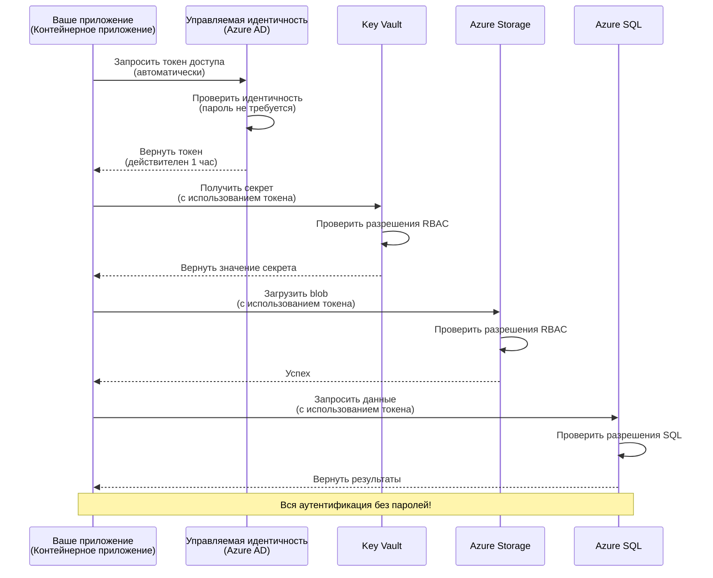
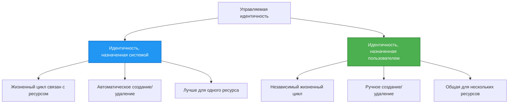

# Шаблоны аутентификации и управляемая идентичность

⏱️ **Оценочное время**: 45-60 минут | 💰 **Влияние на стоимость**: Бесплатно (без дополнительных затрат) | ⭐ **Сложность**: Средняя

**📚 Учебный путь:**
- ← Предыдущий: [Управление конфигурацией](configuration.md) - Управление переменными окружения и секретами
- 🎯 **Вы здесь**: Аутентификация и безопасность (управляемая идентичность, Key Vault, безопасные шаблоны)
- → Далее: [Первый проект](first-project.md) - Создание первого приложения AZD
- 🏠 [Главная курса](../../README.md)

---

## Чему вы научитесь

Завершив этот урок, вы:
- Поймете шаблоны аутентификации Azure (ключи, строки подключения, управляемая идентичность)
- Реализуете **управляемую идентичность** для аутентификации без паролей
- Защитите секреты с помощью интеграции **Azure Key Vault**
- Настроите **управление доступом на основе ролей (RBAC)** для развертываний AZD
- Примените лучшие практики безопасности в Container Apps и службах Azure
- Перейдете от аутентификации на основе ключей к аутентификации на основе идентичности

## Почему важна управляемая идентичность

### Проблема: Традиционная аутентификация

**До управляемой идентичности:**
```javascript
// ❌ РИСК БЕЗОПАСНОСТИ: Жестко заданные секреты в коде
const connectionString = "Server=mydb.database.windows.net;User=admin;Password=P@ssw0rd123";
const storageKey = "xK7mN9pQ2wR5tY8uI0oP3aS6dF1gH4jK...";
const cosmosKey = "C2x7B9n4M1p8Q5w3E6r0T2y5U8i1O4p7...";
```

**Проблемы:**
- 🔴 **Секреты в открытом доступе** в коде, файлах конфигурации, переменных окружения
- 🔴 **Сложность ротации учетных данных**, требующая изменений в коде и повторного развертывания
- 🔴 **Проблемы аудита** - кто, когда и что получил доступ
- 🔴 **Разрозненность** - секреты разбросаны по разным системам
- 🔴 **Риски несоответствия требованиям** - не проходят проверки безопасности

### Решение: Управляемая идентичность

**После управляемой идентичности:**
```javascript
// ✅ БЕЗОПАСНО: Нет секретов в коде
const credential = new DefaultAzureCredential();
const client = new BlobServiceClient(
  "https://mystorageaccount.blob.core.windows.net",
  credential  // Azure автоматически обрабатывает аутентификацию
);
```

**Преимущества:**
- ✅ **Отсутствие секретов** в коде или конфигурации
- ✅ **Автоматическая ротация** - Azure берет это на себя
- ✅ **Полный журнал аудита** в логах Azure AD
- ✅ **Централизованная безопасность** - управление через Azure Portal
- ✅ **Соответствие требованиям** - соответствует стандартам безопасности

**Аналогия**: Традиционная аутентификация похожа на использование множества физических ключей для разных дверей. Управляемая идентичность - это как пропуск, который автоматически предоставляет доступ в зависимости от вашей личности — без ключей, которые можно потерять, скопировать или ротации.

---

## Обзор архитектуры

### Поток аутентификации с управляемой идентичностью


### Типы управляемых идентичностей


| Функция | Системно назначенная | Пользовательски назначенная |
|---------|-----------------------|-----------------------------|
| **Жизненный цикл** | Привязан к ресурсу | Независимый |
| **Создание** | Автоматически с ресурсом | Ручное создание |
| **Удаление** | Удаляется с ресурсом | Сохраняется после удаления ресурса |
| **Общий доступ** | Только один ресурс | Несколько ресурсов |
| **Сценарий использования** | Простые сценарии | Сложные сценарии с несколькими ресурсами |
| **По умолчанию в AZD** | ✅ Рекомендуется | Опционально |

---

## Предварительные требования

### Необходимые инструменты

Вы должны уже установить их из предыдущих уроков:

```bash
# Проверить Azure Developer CLI
azd version
# ✅ Ожидается: azd версии 1.0.0 или выше

# Проверить Azure CLI
az --version
# ✅ Ожидается: azure-cli версии 2.50.0 или выше
```

### Требования Azure

- Активная подписка Azure
- Разрешения на:
  - Создание управляемых идентичностей
  - Назначение ролей RBAC
  - Создание ресурсов Key Vault
  - Развертывание Container Apps

### Необходимые знания

Вы должны завершить:
- [Руководство по установке](installation.md) - Настройка AZD
- [Основы AZD](azd-basics.md) - Основные концепции
- [Управление конфигурацией](configuration.md) - Переменные окружения

---

## Урок 1: Понимание шаблонов аутентификации

### Шаблон 1: Строки подключения (устаревший - избегать)

**Как это работает:**
```bash
# Строка подключения содержит учетные данные
STORAGE_CONNECTION_STRING="DefaultEndpointsProtocol=https;AccountName=myaccount;AccountKey=xK7mN9pQ2wR5..."
COSMOS_CONNECTION_STRING="AccountEndpoint=https://myaccount.documents.azure.com:443/;AccountKey=C2x7..."
SQL_CONNECTION_STRING="Server=myserver.database.windows.net;User=admin;Password=P@ssw0rd..."
```

**Проблемы:**
- ❌ Секреты видны в переменных окружения
- ❌ Логируются в системах развертывания
- ❌ Сложно ротация
- ❌ Нет журнала аудита доступа

**Когда использовать:** Только для локальной разработки, никогда в продакшене.

---

### Шаблон 2: Ссылки на Key Vault (лучше)

**Как это работает:**
```bicep
// Store secret in Key Vault
resource keyVault 'Microsoft.KeyVault/vaults@2023-02-01' = {
  name: 'mykv'
  properties: {
    enableRbacAuthorization: true
  }
}

// Reference in Container App
env: [
  {
    name: 'STORAGE_KEY'
    secretRef: 'storage-key'  // References Key Vault
  }
]
```

**Преимущества:**
- ✅ Секреты хранятся безопасно в Key Vault
- ✅ Централизованное управление секретами
- ✅ Ротация без изменений в коде

**Ограничения:**
- ⚠️ Все еще используются ключи/пароли
- ⚠️ Необходимо управлять доступом к Key Vault

**Когда использовать:** Переходный этап от строк подключения к управляемой идентичности.

---

### Шаблон 3: Управляемая идентичность (лучшая практика)

**Как это работает:**
```bicep
// Enable managed identity
resource containerApp 'Microsoft.App/containerApps@2023-05-01' = {
  name: 'myapp'
  identity: {
    type: 'SystemAssigned'  // Automatically creates identity
  }
}

// Grant permissions
resource roleAssignment 'Microsoft.Authorization/roleAssignments@2022-04-01' = {
  scope: storageAccount
  properties: {
    roleDefinitionId: storageBlobDataContributorRole
    principalId: containerApp.identity.principalId
  }
}
```

**Код приложения:**
```javascript
// Секреты не нужны!
const { DefaultAzureCredential } = require('@azure/identity');
const { BlobServiceClient } = require('@azure/storage-blob');

const credential = new DefaultAzureCredential();
const blobServiceClient = new BlobServiceClient(
  'https://mystorageaccount.blob.core.windows.net',
  credential
);
```

**Преимущества:**
- ✅ Отсутствие секретов в коде/конфигурации
- ✅ Автоматическая ротация учетных данных
- ✅ Полный журнал аудита
- ✅ Разрешения на основе RBAC
- ✅ Соответствие требованиям

**Когда использовать:** Всегда, для продакшн-приложений.

---

## Урок 2: Реализация управляемой идентичности с AZD

### Пошаговая реализация

Создадим безопасное Container App, использующее управляемую идентичность для доступа к Azure Storage и Key Vault.

### Структура проекта

```
secure-app/
├── azure.yaml                 # AZD configuration
├── infra/
│   ├── main.bicep            # Main infrastructure
│   ├── core/
│   │   ├── identity.bicep    # Managed identity setup
│   │   ├── keyvault.bicep    # Key Vault configuration
│   │   └── storage.bicep     # Storage with RBAC
│   └── app/
│       └── container-app.bicep
└── src/
    ├── app.js                # Application code
    ├── package.json
    └── Dockerfile
```

### 1. Настройка AZD (azure.yaml)

```yaml
name: secure-app
metadata:
  template: secure-app@1.0.0

services:
  api:
    project: ./src
    language: js
    host: containerapp

# Enable managed identity (AZD handles this automatically)
```

### 2. Инфраструктура: Включение управляемой идентичности

**Файл: `infra/main.bicep`**

```bicep
targetScope = 'subscription'

param environmentName string
param location string = 'eastus'

var tags = { 'azd-env-name': environmentName }

// Resource group
resource rg 'Microsoft.Resources/resourceGroups@2021-04-01' = {
  name: 'rg-${environmentName}'
  location: location
  tags: tags
}

// Storage Account
module storage './core/storage.bicep' = {
  name: 'storage'
  scope: rg
  params: {
    name: 'st${uniqueString(rg.id)}'
    location: location
    tags: tags
  }
}

// Key Vault
module keyVault './core/keyvault.bicep' = {
  name: 'keyvault'
  scope: rg
  params: {
    name: 'kv-${uniqueString(rg.id)}'
    location: location
    tags: tags
  }
}

// Container App with Managed Identity
module containerApp './app/container-app.bicep' = {
  name: 'container-app'
  scope: rg
  params: {
    name: 'ca-${environmentName}'
    location: location
    tags: tags
    storageAccountName: storage.outputs.name
    keyVaultName: keyVault.outputs.name
  }
}

// Grant Container App access to Storage
module storageRoleAssignment './core/role-assignment.bicep' = {
  name: 'storage-role'
  scope: rg
  params: {
    principalId: containerApp.outputs.identityPrincipalId
    roleDefinitionId: 'ba92f5b4-2d11-453d-a403-e96b0029c9fe'  // Storage Blob Data Contributor
    targetResourceId: storage.outputs.id
  }
}

// Grant Container App access to Key Vault
module kvRoleAssignment './core/role-assignment.bicep' = {
  name: 'kv-role'
  scope: rg
  params: {
    principalId: containerApp.outputs.identityPrincipalId
    roleDefinitionId: '4633458b-17de-408a-b874-0445c86b69e6'  // Key Vault Secrets User
    targetResourceId: keyVault.outputs.id
  }
}

// Outputs
output AZURE_STORAGE_ACCOUNT_NAME string = storage.outputs.name
output AZURE_KEY_VAULT_NAME string = keyVault.outputs.name
output APP_URL string = containerApp.outputs.url
```

### 3. Container App с системно назначенной идентичностью

**Файл: `infra/app/container-app.bicep`**

```bicep
param name string
param location string
param tags object = {}
param storageAccountName string
param keyVaultName string

resource containerApp 'Microsoft.App/containerApps@2023-05-01' = {
  name: name
  location: location
  tags: tags
  identity: {
    type: 'SystemAssigned'  // 🔑 Enable managed identity
  }
  properties: {
    configuration: {
      ingress: {
        external: true
        targetPort: 3000
      }
    }
    template: {
      containers: [
        {
          name: 'api'
          image: 'myregistry.azurecr.io/api:latest'
          resources: {
            cpu: json('0.5')
            memory: '1Gi'
          }
          env: [
            {
              name: 'AZURE_STORAGE_ACCOUNT_NAME'
              value: storageAccountName
            }
            {
              name: 'AZURE_KEY_VAULT_NAME'
              value: keyVaultName
            }
            // 🔑 No secrets - managed identity handles authentication!
          ]
        }
      ]
    }
  }
}

// Output the identity for RBAC assignments
output identityPrincipalId string = containerApp.identity.principalId
output id string = containerApp.id
output url string = 'https://${containerApp.properties.configuration.ingress.fqdn}'
```

### 4. Модуль назначения ролей RBAC

**Файл: `infra/core/role-assignment.bicep`**

```bicep
param principalId string
param roleDefinitionId string  // Azure built-in role ID
param targetResourceId string

resource roleAssignment 'Microsoft.Authorization/roleAssignments@2022-04-01' = {
  name: guid(principalId, roleDefinitionId, targetResourceId)
  scope: resourceId('Microsoft.Resources/resourceGroups', resourceGroup().name)
  properties: {
    roleDefinitionId: subscriptionResourceId('Microsoft.Authorization/roleDefinitions', roleDefinitionId)
    principalId: principalId
    principalType: 'ServicePrincipal'
  }
}

output id string = roleAssignment.id
```

### 5. Код приложения с управляемой идентичностью

**Файл: `src/app.js`**

```javascript
const express = require('express');
const { DefaultAzureCredential } = require('@azure/identity');
const { BlobServiceClient } = require('@azure/storage-blob');
const { SecretClient } = require('@azure/keyvault-secrets');

const app = express();
const PORT = process.env.PORT || 3000;

// 🔑 Инициализация учетных данных (работает автоматически с управляемой идентичностью)
const credential = new DefaultAzureCredential();

// Настройка хранилища Azure
const storageAccountName = process.env.AZURE_STORAGE_ACCOUNT_NAME;
const blobServiceClient = new BlobServiceClient(
  `https://${storageAccountName}.blob.core.windows.net`,
  credential  // Ключи не нужны!
);

// Настройка Key Vault
const keyVaultName = process.env.AZURE_KEY_VAULT_NAME;
const secretClient = new SecretClient(
  `https://${keyVaultName}.vault.azure.net`,
  credential  // Ключи не нужны!
);

// Проверка состояния
app.get('/health', (req, res) => {
  res.json({ status: 'healthy', authentication: 'managed-identity' });
});

// Загрузка файла в хранилище блобов
app.post('/upload', async (req, res) => {
  try {
    const containerClient = blobServiceClient.getContainerClient('uploads');
    await containerClient.createIfNotExists();
    
    const blobName = `file-${Date.now()}.txt`;
    const blockBlobClient = containerClient.getBlockBlobClient(blobName);
    
    await blockBlobClient.upload('Hello from managed identity!', 30);
    
    res.json({
      success: true,
      blobName: blobName,
      message: 'File uploaded using managed identity!'
    });
  } catch (error) {
    console.error('Upload error:', error);
    res.status(500).json({ error: error.message });
  }
});

// Получение секрета из Key Vault
app.get('/secret/:name', async (req, res) => {
  try {
    const secretName = req.params.name;
    const secret = await secretClient.getSecret(secretName);
    
    res.json({
      name: secretName,
      value: secret.value,
      message: 'Secret retrieved using managed identity!'
    });
  } catch (error) {
    console.error('Secret error:', error);
    res.status(500).json({ error: error.message });
  }
});

// Список контейнеров блобов (демонстрирует доступ на чтение)
app.get('/containers', async (req, res) => {
  try {
    const containers = [];
    for await (const container of blobServiceClient.listContainers()) {
      containers.push(container.name);
    }
    
    res.json({
      containers: containers,
      count: containers.length,
      message: 'Containers listed using managed identity!'
    });
  } catch (error) {
    console.error('List error:', error);
    res.status(500).json({ error: error.message });
  }
});

app.listen(PORT, () => {
  console.log(`Secure API listening on port ${PORT}`);
  console.log('Authentication: Managed Identity (passwordless)');
});
```

**Файл: `src/package.json`**

```json
{
  "name": "secure-app",
  "version": "1.0.0",
  "dependencies": {
    "express": "^4.18.2",
    "@azure/identity": "^4.0.0",
    "@azure/storage-blob": "^12.17.0",
    "@azure/keyvault-secrets": "^4.7.0"
  },
  "scripts": {
    "start": "node app.js"
  }
}
```

### 6. Развертывание и тестирование

```bash
# Инициализировать среду AZD
azd init

# Развернуть инфраструктуру и приложение
azd up

# Получить URL приложения
APP_URL=$(azd env get-values | grep APP_URL | cut -d '=' -f2 | tr -d '"')

# Проверить проверку состояния
curl $APP_URL/health
```

**✅ Ожидаемый результат:**
```json
{
  "status": "healthy",
  "authentication": "managed-identity"
}
```

**Тест загрузки блоба:**
```bash
curl -X POST $APP_URL/upload
```

**✅ Ожидаемый результат:**
```json
{
  "success": true,
  "blobName": "file-1700404800000.txt",
  "message": "File uploaded using managed identity!"
}
```

**Тест списка контейнеров:**
```bash
curl $APP_URL/containers
```

**✅ Ожидаемый результат:**
```json
{
  "containers": ["uploads"],
  "count": 1,
  "message": "Containers listed using managed identity!"
}
```

---

## Основные роли RBAC в Azure

### Встроенные идентификаторы ролей для управляемой идентичности

| Сервис | Название роли | Идентификатор роли | Разрешения |
|--------|---------------|--------------------|------------|
| **Storage** | Storage Blob Data Reader | `2a2b9908-6b94-4a3d-8e5a-a7d8f8cc8a12` | Чтение блобов и контейнеров |
| **Storage** | Storage Blob Data Contributor | `ba92f5b4-2d11-453d-a403-e96b0029c9fe` | Чтение, запись, удаление блобов |
| **Storage** | Storage Queue Data Contributor | `974c5e8b-45b9-4653-ba55-5f855dd0fb88` | Чтение, запись, удаление сообщений очереди |
| **Key Vault** | Key Vault Secrets User | `4633458b-17de-408a-b874-0445c86b69e6` | Чтение секретов |
| **Key Vault** | Key Vault Secrets Officer | `b86a8fe4-44ce-4948-aee5-eccb2c155cd7` | Чтение, запись, удаление секретов |
| **Cosmos DB** | Cosmos DB Built-in Data Reader | `00000000-0000-0000-0000-000000000001` | Чтение данных Cosmos DB |
| **Cosmos DB** | Cosmos DB Built-in Data Contributor | `00000000-0000-0000-0000-000000000002` | Чтение, запись данных Cosmos DB |
| **SQL Database** | SQL DB Contributor | `9b7fa17d-e63e-47b0-bb0a-15c516ac86ec` | Управление базами данных SQL |
| **Service Bus** | Azure Service Bus Data Owner | `090c5cfd-751d-490a-894a-3ce6f1109419` | Отправка, получение, управление сообщениями |

### Как найти идентификаторы ролей

```bash
# Перечислить все встроенные роли
az role definition list --query "[].{Name:roleName, ID:name}" --output table

# Искать конкретную роль
az role definition list --query "[?contains(roleName, 'Storage Blob')].{Name:roleName, ID:name}" --output table

# Получить детали роли
az role definition list --name "Storage Blob Data Contributor"
```

---

## Практические упражнения

### Упражнение 1: Включение управляемой идентичности для существующего приложения ⭐⭐ (Средний уровень)

**Цель**: Добавить управляемую идентичность к существующему развертыванию Container App

**Сценарий**: У вас есть Container App, использующий строки подключения. Переведите его на управляемую идентичность.

**Начальная точка**: Container App с такой конфигурацией:

```bicep
// ❌ Current: Using connection string
env: [
  {
    name: 'STORAGE_CONNECTION_STRING'
    secretRef: 'storage-connection'
  }
]
```

**Шаги**:

1. **Включите управляемую идентичность в Bicep:**

```bicep
resource containerApp 'Microsoft.App/containerApps@2023-05-01' = {
  name: 'myapp'
  identity: {
    type: 'SystemAssigned'  // Add this
  }
  // ... rest of configuration
}
```

2. **Предоставьте доступ к Storage:**

```bicep
// Get storage account reference
resource storageAccount 'Microsoft.Storage/storageAccounts@2023-01-01' existing = {
  name: storageAccountName
}

// Assign role
resource roleAssignment 'Microsoft.Authorization/roleAssignments@2022-04-01' = {
  name: guid(containerApp.id, 'ba92f5b4-2d11-453d-a403-e96b0029c9fe', storageAccount.id)
  scope: storageAccount
  properties: {
    roleDefinitionId: subscriptionResourceId('Microsoft.Authorization/roleDefinitions', 'ba92f5b4-2d11-453d-a403-e96b0029c9fe')
    principalId: containerApp.identity.principalId
    principalType: 'ServicePrincipal'
  }
}
```

3. **Обновите код приложения:**

**До (строка подключения):**
```javascript
const { BlobServiceClient } = require('@azure/storage-blob');

const blobServiceClient = BlobServiceClient.fromConnectionString(
  process.env.STORAGE_CONNECTION_STRING
);
```

**После (управляемая идентичность):**
```javascript
const { DefaultAzureCredential } = require('@azure/identity');
const { BlobServiceClient } = require('@azure/storage-blob');

const credential = new DefaultAzureCredential();
const blobServiceClient = new BlobServiceClient(
  `https://${process.env.STORAGE_ACCOUNT_NAME}.blob.core.windows.net`,
  credential
);
```

4. **Обновите переменные окружения:**

```bicep
env: [
  {
    name: 'STORAGE_ACCOUNT_NAME'
    value: storageAccountName  // Just the name, no secrets!
  }
  // Remove STORAGE_CONNECTION_STRING
]
```

5. **Разверните и протестируйте:**

```bash
# Переразвернуть
azd up

# Проверить, что это все еще работает
curl https://myapp.azurecontainerapps.io/upload
```

**✅ Критерии успеха:**
- ✅ Приложение развертывается без ошибок
- ✅ Операции с хранилищем работают (загрузка, список, скачивание)
- ✅ В переменных окружения нет строк подключения
- ✅ Идентичность видна в Azure Portal на вкладке "Идентичность"

**Проверка:**

```bash
# Проверить, включена ли управляемая идентичность
az containerapp show \
  --name myapp \
  --resource-group rg-myapp \
  --query "identity.type"
# ✅ Ожидается: "SystemAssigned"

# Проверить назначение роли
az role assignment list \
  --assignee $(az containerapp show --name myapp --resource-group rg-myapp --query "identity.principalId" -o tsv) \
  --scope /subscriptions/{sub-id}/resourceGroups/rg-myapp/providers/Microsoft.Storage/storageAccounts/mystorageaccount
# ✅ Ожидается: отображается роль "Storage Blob Data Contributor"
```

**Время**: 20-30 минут

---

### Упражнение 2: Доступ к нескольким сервисам с пользовательски назначенной идентичностью ⭐⭐⭐ (Продвинутый уровень)

**Цель**: Создать пользовательски назначенную идентичность, используемую несколькими Container Apps

**Сценарий**: У вас есть 3 микросервиса, которым всем нужен доступ к одному и тому же Storage и Key Vault.

**Шаги**:

1. **Создайте пользовательски назначенную идентичность:**

**Файл: `infra/core/identity.bicep`**

```bicep
param name string
param location string
param tags object = {}

resource userAssignedIdentity 'Microsoft.ManagedIdentity/userAssignedIdentities@2023-01-31' = {
  name: name
  location: location
  tags: tags
}

output id string = userAssignedIdentity.id
output principalId string = userAssignedIdentity.properties.principalId
output clientId string = userAssignedIdentity.properties.clientId
```

2. **Назначьте роли пользовательски назначенной идентичности:**

```bicep
// In main.bicep
module userIdentity './core/identity.bicep' = {
  name: 'user-identity'
  scope: rg
  params: {
    name: 'id-${environmentName}'
    location: location
    tags: tags
  }
}

// Grant Storage access
resource storageRoleAssignment 'Microsoft.Authorization/roleAssignments@2022-04-01' = {
  name: guid(userIdentity.outputs.principalId, 'storage-contributor')
  scope: storageAccount
  properties: {
    roleDefinitionId: subscriptionResourceId('Microsoft.Authorization/roleDefinitions', 'ba92f5b4-2d11-453d-a403-e96b0029c9fe')
    principalId: userIdentity.outputs.principalId
    principalType: 'ServicePrincipal'
  }
}

// Grant Key Vault access
resource kvRoleAssignment 'Microsoft.Authorization/roleAssignments@2022-04-01' = {
  name: guid(userIdentity.outputs.principalId, 'kv-secrets-user')
  scope: keyVault
  properties: {
    roleDefinitionId: subscriptionResourceId('Microsoft.Authorization/roleDefinitions', '4633458b-17de-408a-b874-0445c86b69e6')
    principalId: userIdentity.outputs.principalId
    principalType: 'ServicePrincipal'
  }
}
```

3. **Назначьте идентичность нескольким Container Apps:**

```bicep
resource apiGateway 'Microsoft.App/containerApps@2023-05-01' = {
  name: 'api-gateway'
  identity: {
    type: 'UserAssigned'
    userAssignedIdentities: {
      '${userIdentity.outputs.id}': {}
    }
  }
  // ... rest of config
}

resource productService 'Microsoft.App/containerApps@2023-05-01' = {
  name: 'product-service'
  identity: {
    type: 'UserAssigned'
    userAssignedIdentities: {
      '${userIdentity.outputs.id}': {}
    }
  }
  // ... rest of config
}

resource orderService 'Microsoft.App/containerApps@2023-05-01' = {
  name: 'order-service'
  identity: {
    type: 'UserAssigned'
    userAssignedIdentities: {
      '${userIdentity.outputs.id}': {}
    }
  }
  // ... rest of config
}
```

4. **Код приложения (все сервисы используют один и тот же шаблон):**

```javascript
const { DefaultAzureCredential, ManagedIdentityCredential } = require('@azure/identity');

// Для назначенной пользователем идентичности укажите идентификатор клиента
const credential = new ManagedIdentityCredential(
  process.env.AZURE_CLIENT_ID  // Идентификатор клиента назначенной пользователем идентичности
);

// Или используйте DefaultAzureCredential (автоматическое обнаружение)
const credential = new DefaultAzureCredential();

const blobServiceClient = new BlobServiceClient(
  `https://${process.env.STORAGE_ACCOUNT_NAME}.blob.core.windows.net`,
  credential
);
```

5. **Разверните и проверьте:**

```bash
azd up

# Проверьте, что все сервисы могут получить доступ к хранилищу
curl https://api-gateway.azurecontainerapps.io/upload
curl https://product-service.azurecontainerapps.io/upload
curl https://order-service.azurecontainerapps.io/upload
```

**✅ Критерии успеха:**
- ✅ Одна идентичность используется тремя сервисами
- ✅ Все сервисы могут получить доступ к Storage и Key Vault
- ✅ Идентичность сохраняется, если удалить один из сервисов
- ✅ Централизованное управление разрешениями

**Преимущества пользовательски назначенной идентичности:**
- Единая идентичность для управления
- Единообразные разрешения для всех сервисов
- Сохраняется при удалении сервиса
- Лучше для сложных архитектур

**Время**: 30-40 минут

---

### Упражнение 3: Реализация ротации секретов в Key Vault ⭐⭐⭐ (Продвинутый уровень)

**Цель**: Хранить API-ключи сторонних сервисов в Key Vault и получать их с помощью управляемой идентичности

**Сценарий**: Вашему приложению нужно вызывать внешний API (OpenAI, Stripe, SendGrid), требующий API-ключей.

**Шаги**:

1. **Создайте Key Vault с RBAC:**

**Файл: `infra/core/keyvault.bicep`**

```bicep
param name string
param location string
param tags object = {}

resource keyVault 'Microsoft.KeyVault/vaults@2023-02-01' = {
  name: name
  location: location
  tags: tags
  properties: {
    enableRbacAuthorization: true  // Use RBAC instead of access policies
    sku: {
      family: 'A'
      name: 'standard'
    }
    tenantId: subscription().tenantId
    enableSoftDelete: true
    softDeleteRetentionInDays: 90
  }
}

// Allow Container App to read secrets
output id string = keyVault.id
output name string = keyVault.name
output uri string = keyVault.properties.vaultUri
```

2. **Сохраните секреты в Key Vault:**

```bash
# Получить имя Key Vault
KV_NAME=$(azd env get-values | grep AZURE_KEY_VAULT_NAME | cut -d '=' -f2 | tr -d '"')

# Сохранить ключи API сторонних сервисов
az keyvault secret set \
  --vault-name $KV_NAME \
  --name "OpenAI-ApiKey" \
  --value "sk-proj-xxxxxxxxxxxxx"

az keyvault secret set \
  --vault-name $KV_NAME \
  --name "Stripe-ApiKey" \
  --value "sk_live_xxxxxxxxxxxxx"

az keyvault secret set \
  --vault-name $KV_NAME \
  --name "SendGrid-ApiKey" \
  --value "SG.xxxxxxxxxxxxx"
```

3. **Код приложения для получения секретов:**

**Файл: `src/config.js`**

```javascript
const { DefaultAzureCredential } = require('@azure/identity');
const { SecretClient } = require('@azure/keyvault-secrets');

class Config {
  constructor() {
    this.credential = new DefaultAzureCredential();
    this.secretClient = new SecretClient(
      `https://${process.env.AZURE_KEY_VAULT_NAME}.vault.azure.net`,
      this.credential
    );
    this.cache = {};
  }

  async getSecret(secretName) {
    // Сначала проверьте кэш
    if (this.cache[secretName]) {
      return this.cache[secretName];
    }

    try {
      const secret = await this.secretClient.getSecret(secretName);
      this.cache[secretName] = secret.value;
      console.log(`✅ Retrieved secret: ${secretName}`);
      return secret.value;
    } catch (error) {
      console.error(`❌ Failed to get secret ${secretName}:`, error.message);
      throw error;
    }
  }

  async getOpenAIKey() {
    return this.getSecret('OpenAI-ApiKey');
  }

  async getStripeKey() {
    return this.getSecret('Stripe-ApiKey');
  }

  async getSendGridKey() {
    return this.getSecret('SendGrid-ApiKey');
  }
}

module.exports = new Config();
```

4. **Используйте секреты в приложении:**

**Файл: `src/app.js`**

```javascript
const express = require('express');
const config = require('./config');
const { OpenAI } = require('openai');

const app = express();

// Инициализировать OpenAI с ключом из Key Vault
let openaiClient;

async function initializeServices() {
  const openaiKey = await config.getOpenAIKey();
  openaiClient = new OpenAI({ apiKey: openaiKey });
  console.log('✅ Services initialized with secrets from Key Vault');
}

// Вызвать при запуске
initializeServices().catch(console.error);

app.post('/chat', async (req, res) => {
  try {
    const completion = await openaiClient.chat.completions.create({
      model: 'gpt-4',
      messages: [{ role: 'user', content: 'Hello!' }]
    });
    
    res.json({
      response: completion.choices[0].message.content,
      authentication: 'Key from Key Vault via Managed Identity'
    });
  } catch (error) {
    res.status(500).json({ error: error.message });
  }
});

app.listen(3000, () => {
  console.log('Secure API with Key Vault integration running');
});
```

5. **Разверните и протестируйте:**

```bash
azd up

# Проверить, что API-ключи работают
curl -X POST https://myapp.azurecontainerapps.io/chat \
  -H "Content-Type: application/json" \
  -d '{"message":"Hello AI"}'
```

**✅ Критерии успеха:**
- ✅ Нет API-ключей в коде или переменных окружения
- ✅ Приложение получает ключи из Key Vault
- ✅ Сторонние API работают корректно
- ✅ Можно ротацию ключей без изменений в коде

**Ротация секрета:**

```bash
# Обновить секрет в Key Vault
az keyvault secret set \
  --vault-name $KV_NAME \
  --name "OpenAI-ApiKey" \
  --value "sk-proj-NEW_KEY_HERE"

# Перезапустить приложение, чтобы использовать новый ключ
az containerapp revision restart \
  --name myapp \
  --resource-group rg-myapp
```

**Время**: 25-35 минут

---

## Контроль знаний

### 1. Шаблоны аутентификации ✓

Проверьте свои знания:

- [ ] **В1**: Какие три основных шаблона аутентификации? 
  - **О**: Строки подключения (устаревший), ссылки на Key Vault (переходный), управляемая идентичность (лучший)

- [ ] **В2**: Почему управляемая идентичность лучше строк подключения?
  - **О**: Нет секретов в коде, автоматическая ротация, полный журнал аудита, разрешения RBAC

- [ ] **В3**: Когда использовать пользовательски назначенную идентичность вместо системно назначенной?
  - **О**: Когда идентичность используется несколькими ресурсами или ее жизненный цикл независим от ресурса

**Практическая проверка:**
```bash
# Проверьте, какой тип идентичности использует ваше приложение
az containerapp show \
  --name myapp \
  --resource-group rg-myapp \
  --query "identity.type"

# Перечислите все назначения ролей для идентичности
az role assignment list \
  --assignee $(az containerapp show --name myapp --resource-group rg-myapp --query "identity.principalId" -o tsv)
```

---

### 2. RBAC и разрешения ✓

Проверьте свои знания:

- [ ] **В1**: Какой идентификатор роли для "Storage Blob Data Contributor"?
  - **О**: `ba92f5b4-2d11-453d-a403-e96b0029c9fe`

- [ ] **В2**: Какие разрешения предоставляет "Key Vault Secrets User"?
  - **О**: Только чтение секретов (нельзя создавать, обновлять или удалять)

- [ ] **В3**: Как предоставить Container App доступ к Azure SQL?
  - **О**: Назначить роль "SQL DB Contributor" или настроить аутентификацию Azure AD для SQL

**Практическая проверка:**
```bash
# Найти конкретную роль
az role definition list --name "Storage Blob Data Contributor"

# Проверить, какие роли назначены вашей личности
PRINCIPAL_ID=$(az containerapp show --name myapp --resource-group rg-myapp --query "identity.principalId" -o tsv)
az role assignment list --assignee $PRINCIPAL_ID --output table
```

---

### 3. Интеграция с Key Vault ✓

Проверьте свои знания:
- [ ] **Вопрос 1**: Как включить RBAC для Key Vault вместо политик доступа?
  - **Ответ**: Установите `enableRbacAuthorization: true` в Bicep

- [ ] **Вопрос 2**: Какая библиотека Azure SDK обрабатывает аутентификацию с помощью управляемой идентичности?
  - **Ответ**: `@azure/identity` с классом `DefaultAzureCredential`

- [ ] **Вопрос 3**: Как долго секреты Key Vault остаются в кэше?
  - **Ответ**: Зависит от приложения; реализуйте собственную стратегию кэширования

**Практическая проверка:**
```bash
# Тест доступа к Key Vault
az keyvault secret show \
  --vault-name $KV_NAME \
  --name "OpenAI-ApiKey" \
  --query "value"

# Проверить, включен ли RBAC
az keyvault show \
  --name $KV_NAME \
  --query "properties.enableRbacAuthorization"
# ✅ Ожидается: true
```

---

## Лучшие практики безопасности

### ✅ РЕКОМЕНДУЕТСЯ:

1. **Всегда используйте управляемую идентичность в продакшене**
   ```bicep
   identity: {
     type: 'SystemAssigned'
   }
   ```

2. **Используйте роли RBAC с минимальными привилегиями**
   - Используйте роли "Reader", если это возможно
   - Избегайте ролей "Owner" или "Contributor", если это не необходимо

3. **Храните ключи сторонних сервисов в Key Vault**
   ```javascript
   const apiKey = await secretClient.getSecret('ThirdPartyApiKey');
   ```

4. **Включите аудит логов**
   ```bicep
   diagnosticSettings: {
     logs: [{ category: 'AuditEvent', enabled: true }]
   }
   ```

5. **Используйте разные идентичности для разработки, тестирования и продакшена**
   ```bash
   azd env new dev
   azd env new staging
   azd env new prod
   ```

6. **Регулярно обновляйте секреты**
   - Устанавливайте сроки действия для секретов Key Vault
   - Автоматизируйте обновление с помощью Azure Functions

### ❌ НЕ РЕКОМЕНДУЕТСЯ:

1. **Никогда не хардкодьте секреты**
   ```javascript
   // ❌ ПЛОХО
   const apiKey = "sk-proj-xxxxxxxxxxxxx";
   ```

2. **Не используйте строки подключения в продакшене**
   ```javascript
   // ❌ ПЛОХО
   BlobServiceClient.fromConnectionString(process.env.STORAGE_CONNECTION_STRING)
   ```

3. **Не предоставляйте избыточные разрешения**
   ```bicep
   // ❌ BAD - too much access
   roleDefinitionId: 'Owner'
   
   // ✅ GOOD - least privilege
   roleDefinitionId: 'Storage Blob Data Reader'
   ```

4. **Не записывайте секреты в логи**
   ```javascript
   // ❌ ПЛОХО
   console.log('API Key:', apiKey);
   
   // ✅ ХОРОШО
   console.log('API Key retrieved successfully');
   ```

5. **Не используйте одни и те же идентичности для разных сред**
   ```bicep
   // ❌ BAD - same identity for dev and prod
   // ✅ GOOD - separate identities per environment
   ```

---

## Руководство по устранению неполадок

### Проблема: "Unauthorized" при доступе к Azure Storage

**Симптомы:**
```
Error: Unauthorized (403)
AuthorizationPermissionMismatch: This request is not authorized to perform this operation
```

**Диагностика:**

```bash
# Проверить, включена ли управляемая идентичность
az containerapp show \
  --name myapp \
  --resource-group rg-myapp \
  --query "identity.type"
# ✅ Ожидается: "SystemAssigned" или "UserAssigned"

# Проверить назначения ролей
PRINCIPAL_ID=$(az containerapp show --name myapp --resource-group rg-myapp --query "identity.principalId" -o tsv)
az role assignment list --assignee $PRINCIPAL_ID

# Ожидается: Должна быть роль "Storage Blob Data Contributor" или аналогичная
```

**Решения:**

1. **Назначьте правильную роль RBAC:**
```bash
STORAGE_ID=$(az storage account show --name mystorageaccount --resource-group rg-myapp --query "id" -o tsv)
az role assignment create \
  --assignee $PRINCIPAL_ID \
  --role "Storage Blob Data Contributor" \
  --scope $STORAGE_ID
```

2. **Подождите, пока изменения распространятся (может занять 5-10 минут):**
```bash
# Проверить статус назначения роли
az role assignment list --assignee $PRINCIPAL_ID --scope $STORAGE_ID
```

3. **Убедитесь, что приложение использует правильные учетные данные:**
```javascript
// Убедитесь, что вы используете DefaultAzureCredential
const credential = new DefaultAzureCredential();
```

---

### Проблема: Доступ к Key Vault запрещен

**Симптомы:**
```
Error: Forbidden (403)
The user, group or application does not have secrets get permission
```

**Диагностика:**

```bash
# Проверить, включен ли RBAC для Key Vault
az keyvault show \
  --name $KV_NAME \
  --query "properties.enableRbacAuthorization"
# ✅ Ожидается: true

# Проверить назначения ролей
az role assignment list \
  --assignee $PRINCIPAL_ID \
  --scope /subscriptions/{sub-id}/resourceGroups/rg-myapp/providers/Microsoft.KeyVault/vaults/$KV_NAME
```

**Решения:**

1. **Включите RBAC для Key Vault:**
```bash
az keyvault update \
  --name $KV_NAME \
  --enable-rbac-authorization true
```

2. **Назначьте роль Key Vault Secrets User:**
```bash
KV_ID=$(az keyvault show --name $KV_NAME --query "id" -o tsv)
az role assignment create \
  --assignee $PRINCIPAL_ID \
  --role "Key Vault Secrets User" \
  --scope $KV_ID
```

---

### Проблема: DefaultAzureCredential не работает локально

**Симптомы:**
```
Error: DefaultAzureCredential failed to retrieve a token
CredentialUnavailableError: No credential available
```

**Диагностика:**

```bash
# Проверьте, вошли ли вы в систему
az account show

# Проверьте аутентификацию Azure CLI
az ad signed-in-user show
```

**Решения:**

1. **Войдите в Azure CLI:**
```bash
az login
```

2. **Установите подписку Azure:**
```bash
az account set --subscription "Your Subscription Name"
```

3. **Для локальной разработки используйте переменные окружения:**
```bash
export AZURE_TENANT_ID="your-tenant-id"
export AZURE_CLIENT_ID="your-client-id"
export AZURE_CLIENT_SECRET="your-client-secret"
```

4. **Или используйте другие учетные данные локально:**
```javascript
const { DefaultAzureCredential, AzureCliCredential } = require('@azure/identity');

// Используйте AzureCliCredential для локальной разработки
const credential = process.env.NODE_ENV === 'production' 
  ? new DefaultAzureCredential()
  : new AzureCliCredential();
```

---

### Проблема: Назначение роли занимает слишком много времени для распространения

**Симптомы:**
- Роль успешно назначена
- Все еще возникают ошибки 403
- Доступ работает с перебоями (иногда работает, иногда нет)

**Объяснение:**
Изменения RBAC в Azure могут занимать 5-10 минут для глобального распространения.

**Решение:**

```bash
# Подождите и повторите попытку
echo "Waiting for RBAC propagation..."
sleep 300  # Подождите 5 минут

# Проверьте доступ
curl https://myapp.azurecontainerapps.io/upload

# Если все еще не работает, перезапустите приложение
az containerapp revision restart \
  --name myapp \
  --resource-group rg-myapp
```

---

## Финансовые аспекты

### Затраты на управляемую идентичность

| Ресурс | Стоимость |
|--------|-----------|
| **Управляемая идентичность** | 🆓 **БЕСПЛАТНО** - Без оплаты |
| **Назначения ролей RBAC** | 🆓 **БЕСПЛАТНО** - Без оплаты |
| **Запросы токенов Azure AD** | 🆓 **БЕСПЛАТНО** - Включено |
| **Операции Key Vault** | $0.03 за 10,000 операций |
| **Хранение в Key Vault** | $0.024 за секрет в месяц |

**Управляемая идентичность экономит деньги за счет:**
- ✅ Исключения операций Key Vault для аутентификации между сервисами
- ✅ Снижения числа инцидентов безопасности (отсутствие утечек учетных данных)
- ✅ Уменьшения операционных затрат (нет необходимости в ручной ротации)

**Пример сравнения затрат (в месяц):**

| Сценарий | Строки подключения | Управляемая идентичность | Экономия |
|----------|--------------------|--------------------------|----------|
| Маленькое приложение (1M запросов) | ~$50 (Key Vault + операции) | ~$0 | $50/месяц |
| Среднее приложение (10M запросов) | ~$200 | ~$0 | $200/месяц |
| Большое приложение (100M запросов) | ~$1,500 | ~$0 | $1,500/месяц |

---

## Узнать больше

### Официальная документация
- [Управляемая идентичность Azure](https://learn.microsoft.com/entra/identity/managed-identities-azure-resources/overview)
- [RBAC в Azure](https://learn.microsoft.com/azure/role-based-access-control/overview)
- [Azure Key Vault](https://learn.microsoft.com/azure/key-vault/general/overview)
- [DefaultAzureCredential](https://learn.microsoft.com/dotnet/api/azure.identity.defaultazurecredential)

### Документация SDK
- [@azure/identity (Node.js)](https://www.npmjs.com/package/@azure/identity)
- [Azure.Identity (C#)](https://www.nuget.org/packages/Azure.Identity/)
- [azure-identity (Python)](https://pypi.org/project/azure-identity/)

### Следующие шаги в этом курсе
- ← Предыдущий: [Управление конфигурацией](configuration.md)
- → Следующий: [Первый проект](first-project.md)
- 🏠 [Главная страница курса](../../README.md)

### Связанные примеры
- [Пример Azure OpenAI Chat](../../../../examples/azure-openai-chat) - Использует управляемую идентичность для Azure OpenAI
- [Пример микросервисов](../../../../examples/microservices) - Шаблоны аутентификации для нескольких сервисов

---

## Резюме

**Вы узнали:**
- ✅ Три шаблона аутентификации (строки подключения, Key Vault, управляемая идентичность)
- ✅ Как включить и настроить управляемую идентичность в AZD
- ✅ Назначение ролей RBAC для сервисов Azure
- ✅ Интеграцию Key Vault для сторонних секретов
- ✅ Разницу между назначаемыми пользователем и системными идентичностями
- ✅ Лучшие практики безопасности и устранение неполадок

**Основные выводы:**
1. **Всегда используйте управляемую идентичность в продакшене** - Без секретов, автоматическая ротация
2. **Используйте роли RBAC с минимальными привилегиями** - Предоставляйте только необходимые разрешения
3. **Храните ключи сторонних сервисов в Key Vault** - Централизованное управление секретами
4. **Разделяйте идентичности для каждой среды** - Изоляция разработки, тестирования и продакшена
5. **Включите аудит логов** - Отслеживайте, кто и что использовал

**Следующие шаги:**
1. Выполните практические упражнения выше
2. Перенесите существующее приложение с использования строк подключения на управляемую идентичность
3. Создайте свой первый проект AZD с учетом безопасности с первого дня: [Первый проект](first-project.md)

---

<!-- CO-OP TRANSLATOR DISCLAIMER START -->
**Отказ от ответственности**:  
Этот документ был переведен с использованием сервиса автоматического перевода [Co-op Translator](https://github.com/Azure/co-op-translator). Несмотря на наши усилия обеспечить точность, автоматические переводы могут содержать ошибки или неточности. Оригинальный документ на его родном языке следует считать авторитетным источником. Для получения критически важной информации рекомендуется профессиональный перевод человеком. Мы не несем ответственности за любые недоразумения или неправильные интерпретации, возникающие в результате использования данного перевода.
<!-- CO-OP TRANSLATOR DISCLAIMER END -->