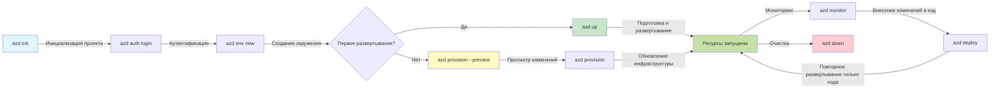
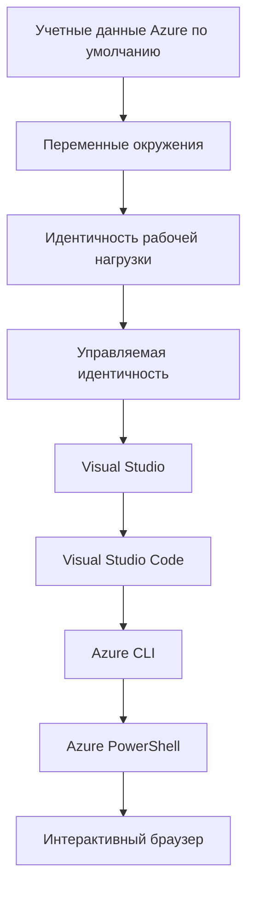

<!--
CO_OP_TRANSLATOR_METADATA:
{
  "original_hash": "e855e899d2705754fe85b04190edd0f0",
  "translation_date": "2025-11-20T06:33:08+00:00",
  "source_file": "docs/getting-started/azd-basics.md",
  "language_code": "ru"
}
-->
# Основы AZD - Понимание Azure Developer CLI

# Основы AZD - Основные концепции и принципы

**Навигация по главам:**
- **📚 Домашняя страница курса**: [AZD для начинающих](../../README.md)
- **📖 Текущая глава**: Глава 1 - Основы и быстрый старт
- **⬅️ Предыдущая**: [Обзор курса](../../README.md#-chapter-1-foundation--quick-start)
- **➡️ Следующая**: [Установка и настройка](installation.md)
- **🚀 Следующая глава**: [Глава 2: Разработка с приоритетом AI](../microsoft-foundry/microsoft-foundry-integration.md)

## Введение

Этот урок познакомит вас с Azure Developer CLI (azd), мощным инструментом командной строки, который ускоряет переход от локальной разработки к развертыванию в Azure. Вы узнаете основные концепции, ключевые функции и поймете, как azd упрощает развертывание облачных приложений.

## Цели обучения

К концу урока вы:
- Поймете, что такое Azure Developer CLI и его основное назначение
- Изучите основные концепции шаблонов, окружений и сервисов
- Ознакомитесь с ключевыми функциями, включая разработку на основе шаблонов и инфраструктуру как код
- Поймете структуру проекта azd и рабочий процесс
- Будете готовы установить и настроить azd для своей среды разработки

## Результаты обучения

После завершения урока вы сможете:
- Объяснить роль azd в современных рабочих процессах облачной разработки
- Определить компоненты структуры проекта azd
- Описать, как шаблоны, окружения и сервисы работают вместе
- Понять преимущества инфраструктуры как кода с azd
- Распознать различные команды azd и их назначение

## Что такое Azure Developer CLI (azd)?

Azure Developer CLI (azd) — это инструмент командной строки, разработанный для ускорения перехода от локальной разработки к развертыванию в Azure. Он упрощает процесс создания, развертывания и управления облачными приложениями в Azure.

### 🎯 Зачем использовать AZD? Сравнение с реальным миром

Сравним развертывание простого веб-приложения с базой данных:

#### ❌ БЕЗ AZD: Ручное развертывание в Azure (30+ минут)

```bash
# Шаг 1: Создать группу ресурсов
az group create --name myapp-rg --location eastus

# Шаг 2: Создать план App Service
az appservice plan create --name myapp-plan \
  --resource-group myapp-rg \
  --sku B1 --is-linux

# Шаг 3: Создать веб-приложение
az webapp create --name myapp-web-unique123 \
  --resource-group myapp-rg \
  --plan myapp-plan \
  --runtime "NODE:18-lts"

# Шаг 4: Создать учетную запись Cosmos DB (10-15 минут)
az cosmosdb create --name myapp-cosmos-unique123 \
  --resource-group myapp-rg \
  --kind MongoDB

# Шаг 5: Создать базу данных
az cosmosdb mongodb database create \
  --account-name myapp-cosmos-unique123 \
  --resource-group myapp-rg \
  --name tododb

# Шаг 6: Создать коллекцию
az cosmosdb mongodb collection create \
  --account-name myapp-cosmos-unique123 \
  --resource-group myapp-rg \
  --database-name tododb \
  --name todos

# Шаг 7: Получить строку подключения
CONN_STR=$(az cosmosdb keys list \
  --name myapp-cosmos-unique123 \
  --resource-group myapp-rg \
  --type connection-strings \
  --query "connectionStrings[0].connectionString" -o tsv)

# Шаг 8: Настроить параметры приложения
az webapp config appsettings set \
  --name myapp-web-unique123 \
  --resource-group myapp-rg \
  --settings MONGODB_URI="$CONN_STR"

# Шаг 9: Включить ведение логов
az webapp log config --name myapp-web-unique123 \
  --resource-group myapp-rg \
  --application-logging filesystem \
  --detailed-error-messages true

# Шаг 10: Настроить Application Insights
az monitor app-insights component create \
  --app myapp-insights \
  --location eastus \
  --resource-group myapp-rg

# Шаг 11: Связать App Insights с веб-приложением
INSTRUMENTATION_KEY=$(az monitor app-insights component show \
  --app myapp-insights \
  --resource-group myapp-rg \
  --query "instrumentationKey" -o tsv)

az webapp config appsettings set \
  --name myapp-web-unique123 \
  --resource-group myapp-rg \
  --settings APPINSIGHTS_INSTRUMENTATIONKEY="$INSTRUMENTATION_KEY"

# Шаг 12: Собрать приложение локально
npm install
npm run build

# Шаг 13: Создать пакет для развертывания
zip -r app.zip . -x "*.git*" "node_modules/*"

# Шаг 14: Развернуть приложение
az webapp deployment source config-zip \
  --resource-group myapp-rg \
  --name myapp-web-unique123 \
  --src app.zip

# Шаг 15: Ждать и молиться, чтобы заработало 🙏
# (Автоматической проверки нет, требуется ручное тестирование)
```

**Проблемы:**
- ❌ 15+ команд, которые нужно запомнить и выполнить в правильном порядке
- ❌ 30-45 минут ручной работы
- ❌ Легко допустить ошибки (опечатки, неверные параметры)
- ❌ Строки подключения остаются в истории терминала
- ❌ Нет автоматического отката в случае сбоя
- ❌ Трудно воспроизвести для членов команды
- ❌ Каждый раз процесс отличается (не воспроизводим)

#### ✅ С AZD: Автоматизированное развертывание (5 команд, 10-15 минут)

```bash
# Шаг 1: Инициализация из шаблона
azd init --template todo-nodejs-mongo

# Шаг 2: Аутентификация
azd auth login

# Шаг 3: Создание окружения
azd env new dev

# Шаг 4: Предварительный просмотр изменений (необязательно, но рекомендуется)
azd provision --preview

# Шаг 5: Развернуть все
azd up

# ✨ Готово! Все развернуто, настроено и мониторится
```

**Преимущества:**
- ✅ **5 команд** вместо 15+ ручных шагов
- ✅ **10-15 минут** общего времени (в основном ожидание Azure)
- ✅ **Ноль ошибок** — автоматизировано и протестировано
- ✅ **Секреты управляются безопасно** через Key Vault
- ✅ **Автоматический откат** в случае сбоя
- ✅ **Полностью воспроизводимо** — одинаковый результат каждый раз
- ✅ **Готово для команды** — любой может развернуть с помощью тех же команд
- ✅ **Инфраструктура как код** — шаблоны Bicep под контролем версий
- ✅ **Встроенный мониторинг** — Application Insights настроен автоматически

### 📊 Снижение времени и ошибок

| Метрика | Ручное развертывание | Развертывание с AZD | Улучшение |
|:-------|:---------------------|:--------------------|:----------|
| **Команды** | 15+ | 5 | На 67% меньше |
| **Время** | 30-45 мин | 10-15 мин | На 60% быстрее |
| **Ошибки** | ~40% | <5% | Снижение на 88% |
| **Согласованность** | Низкая (ручная) | 100% (автоматизированная) | Идеально |
| **Обучение команды** | 2-4 часа | 30 минут | На 75% быстрее |
| **Время отката** | 30+ мин (ручной) | 2 мин (автоматизированный) | На 93% быстрее |

## Основные концепции

### Шаблоны
Шаблоны — это основа azd. Они содержат:
- **Код приложения** — исходный код и зависимости
- **Определения инфраструктуры** — ресурсы Azure, определенные в Bicep или Terraform
- **Файлы конфигурации** — настройки и переменные окружения
- **Скрипты развертывания** — автоматизированные рабочие процессы развертывания

### Окружения
Окружения представляют собой различные цели развертывания:
- **Разработка** — для тестирования и разработки
- **Стадия** — пред-производственная среда
- **Производство** — рабочая производственная среда

Каждое окружение имеет свои:
- Группу ресурсов Azure
- Настройки конфигурации
- Состояние развертывания

### Сервисы
Сервисы — это строительные блоки вашего приложения:
- **Фронтенд** — веб-приложения, SPA
- **Бэкенд** — API, микросервисы
- **База данных** — решения для хранения данных
- **Хранилище** — файловое и блочное хранилище

## Ключевые функции

### 1. Разработка на основе шаблонов
```bash
# Просмотреть доступные шаблоны
azd template list

# Инициализировать из шаблона
azd init --template <template-name>
```

### 2. Инфраструктура как код
- **Bicep** — специализированный язык Azure
- **Terraform** — инструмент для мультиоблачной инфраструктуры
- **ARM Templates** — шаблоны Azure Resource Manager

### 3. Интегрированные рабочие процессы
```bash
# Завершить рабочий процесс развертывания
azd up            # Подготовка + Развертывание, это автоматизировано для первоначальной настройки

# 🧪 НОВОЕ: Предварительный просмотр изменений инфраструктуры перед развертыванием (БЕЗОПАСНО)
azd provision --preview    # Смоделировать развертывание инфраструктуры без внесения изменений

azd provision     # Создать ресурсы Azure, если вы обновляете инфраструктуру, используйте это
azd deploy        # Развернуть код приложения или повторно развернуть код приложения после обновления
azd down          # Очистить ресурсы
```

#### 🛡️ Безопасное планирование инфраструктуры с помощью Preview
Команда `azd provision --preview` — это революция для безопасного развертывания:
- **Анализ без выполнения** — показывает, что будет создано, изменено или удалено
- **Нулевой риск** — никаких реальных изменений в вашей среде Azure
- **Командное сотрудничество** — делитесь результатами предварительного просмотра перед развертыванием
- **Оценка стоимости** — понимание затрат на ресурсы до их создания

```bash
# Пример рабочего процесса предварительного просмотра
azd provision --preview           # Посмотрите, что изменится
# Проверьте результат, обсудите с командой
azd provision                     # Вносите изменения с уверенностью
```

### 📊 Визуализация: Рабочий процесс разработки с AZD


**Объяснение рабочего процесса:**
1. **Init** — Начало с шаблона или нового проекта
2. **Auth** — Аутентификация в Azure
3. **Environment** — Создание изолированной среды развертывания
4. **Preview** — 🆕 Всегда предварительно просматривайте изменения инфраструктуры (безопасная практика)
5. **Provision** — Создание/обновление ресурсов Azure
6. **Deploy** — Развертывание кода приложения
7. **Monitor** — Наблюдение за производительностью приложения
8. **Iterate** — Внесение изменений и повторное развертывание кода
9. **Cleanup** — Удаление ресурсов после завершения работы

### 4. Управление окружениями
```bash
# Создавать и управлять средами
azd env new <environment-name>
azd env select <environment-name>
azd env list
```

## 📁 Структура проекта

Типичная структура проекта azd:
```
my-app/
├── .azd/                    # azd configuration
│   └── config.json
├── .azure/                  # Azure deployment artifacts
├── .devcontainer/          # Development container config
├── .github/workflows/      # GitHub Actions
├── .vscode/               # VS Code settings
├── infra/                 # Infrastructure code
│   ├── main.bicep        # Main infrastructure template
│   ├── main.parameters.json
│   └── modules/          # Reusable modules
├── src/                  # Application source code
│   ├── api/             # Backend services
│   └── web/             # Frontend application
├── azure.yaml           # azd project configuration
└── README.md
```

## 🔧 Файлы конфигурации

### azure.yaml
Основной файл конфигурации проекта:
```yaml
name: my-awesome-app
metadata:
  template: my-template@1.0.0

services:
  web:
    project: ./src/web
    language: js
    host: appservice
  api:
    project: ./src/api
    language: js
    host: appservice

hooks:
  preprovision:
    shell: pwsh
    run: echo "Preparing to provision..."
```

### .azure/config.json
Конфигурация, специфичная для окружения:
```json
{
  "version": 1,
  "defaultEnvironment": "dev",
  "environments": {
    "dev": {
      "subscriptionId": "your-subscription-id",
      "location": "eastus"
    }
  }
}
```

## 🎪 Общие рабочие процессы с практическими упражнениями

> **💡 Совет по обучению:** Следуйте этим упражнениям по порядку, чтобы постепенно развивать свои навыки работы с AZD.

### 🎯 Упражнение 1: Инициализация первого проекта

**Цель:** Создать проект AZD и изучить его структуру

**Шаги:**
```bash
# Используйте проверенный шаблон
azd init --template todo-nodejs-mongo

# Изучите созданные файлы
ls -la  # Просмотрите все файлы, включая скрытые

# Созданы ключевые файлы:
# - azure.yaml (основная конфигурация)
# - infra/ (код инфраструктуры)
# - src/ (код приложения)
```

**✅ Успех:** У вас есть директории azure.yaml, infra/ и src/

---

### 🎯 Упражнение 2: Развертывание в Azure

**Цель:** Завершить полный процесс развертывания

**Шаги:**
```bash
# 1. Аутентификация
az login && azd auth login

# 2. Создать окружение
azd env new dev
azd env set AZURE_LOCATION eastus

# 3. Просмотреть изменения (РЕКОМЕНДУЕТСЯ)
azd provision --preview

# 4. Развернуть всё
azd up

# 5. Проверить развертывание
azd show    # Просмотреть URL вашего приложения
```

**Ожидаемое время:** 10-15 минут  
**✅ Успех:** URL приложения открывается в браузере

---

### 🎯 Упражнение 3: Несколько окружений

**Цель:** Развернуть в dev и staging

**Шаги:**
```bash
# Уже есть dev, создайте staging
azd env new staging
azd env set AZURE_LOCATION westus2
azd up

# Переключайтесь между ними
azd env list
azd env select dev
```

**✅ Успех:** Две отдельные группы ресурсов в Azure Portal

---

### 🛡️ Чистый лист: `azd down --force --purge`

Когда нужно полностью сбросить:

```bash
azd down --force --purge
```

**Что делает:**
- `--force`: Без подтверждающих запросов
- `--purge`: Удаляет все локальные состояния и ресурсы Azure

**Используйте, когда:**
- Развертывание завершилось с ошибкой
- Переключение проектов
- Нужен свежий старт

---

## 🎪 Ссылка на оригинальный рабочий процесс

### Начало нового проекта
```bash
# Метод 1: Использовать существующий шаблон
azd init --template todo-nodejs-mongo

# Метод 2: Начать с нуля
azd init

# Метод 3: Использовать текущую директорию
azd init .
```

### Цикл разработки
```bash
# Настройте среду разработки
azd auth login
azd env new dev
azd env select dev

# Разверните все
azd up

# Внесите изменения и повторно разверните
azd deploy

# Очистите после завершения
azd down --force --purge # команда в Azure Developer CLI является **жестким сбросом** для вашей среды — особенно полезна при устранении неполадок с неудачными развертываниями, очистке осиротевших ресурсов или подготовке к новому развертыванию.
```

## Понимание `azd down --force --purge`
Команда `azd down --force --purge` — это мощный способ полностью удалить вашу среду azd и все связанные ресурсы. Вот разбор того, что делает каждый флаг:
```
--force
```
- Пропускает запросы на подтверждение.
- Полезно для автоматизации или скриптов, где ручной ввод невозможен.
- Обеспечивает выполнение удаления без прерываний, даже если CLI обнаруживает несоответствия.

```
--purge
```
Удаляет **все связанные метаданные**, включая:
Состояние окружения
Локальную папку `.azure`
Кэшированную информацию о развертывании
Предотвращает "запоминание" предыдущих развертываний azd, что может вызвать проблемы, такие как несоответствие групп ресурсов или устаревшие ссылки на реестры.

### Зачем использовать оба?
Когда вы столкнулись с проблемами при `azd up` из-за оставшегося состояния или частичных развертываний, эта комбинация обеспечивает **чистый лист**.

Особенно полезно после ручного удаления ресурсов в Azure Portal или при переключении шаблонов, окружений или соглашений о наименовании групп ресурсов.

### Управление несколькими окружениями
```bash
# Создать промежуточную среду
azd env new staging
azd env select staging
azd up

# Переключиться обратно на разработку
azd env select dev

# Сравнить среды
azd env list
```

## 🔐 Аутентификация и учетные данные

Понимание аутентификации важно для успешного развертывания с azd. Azure использует несколько методов аутентификации, и azd использует ту же цепочку учетных данных, что и другие инструменты Azure.

### Аутентификация через Azure CLI (`az login`)

Перед использованием azd необходимо пройти аутентификацию в Azure. Наиболее распространенный метод — использование Azure CLI:

```bash
# Интерактивный вход (открывает браузер)
az login

# Вход с указанием конкретного арендатора
az login --tenant <tenant-id>

# Вход с использованием служебного принципала
az login --service-principal -u <app-id> -p <password> --tenant <tenant-id>

# Проверить текущий статус входа
az account show

# Список доступных подписок
az account list --output table

# Установить подписку по умолчанию
az account set --subscription <subscription-id>
```

### Поток аутентификации
1. **Интерактивный вход**: Открывает ваш браузер для аутентификации
2. **Код устройства**: Для сред без доступа к браузеру
3. **Сервисный принципал**: Для автоматизации и сценариев CI/CD
4. **Управляемая идентичность**: Для приложений, размещенных в Azure

### Цепочка DefaultAzureCredential

`DefaultAzureCredential` — это тип учетных данных, который упрощает процесс аутентификации, автоматически пробуя несколько источников учетных данных в определенном порядке:

#### Порядок цепочки учетных данных

#### 1. Переменные окружения
```bash
# Установить переменные окружения для служебного принципала
export AZURE_CLIENT_ID="<app-id>"
export AZURE_CLIENT_SECRET="<password>"
export AZURE_TENANT_ID="<tenant-id>"
```

#### 2. Workload Identity (Kubernetes/GitHub Actions)
Используется автоматически в:
- Azure Kubernetes Service (AKS) с Workload Identity
- GitHub Actions с федерацией OIDC
- Других сценариях федеративной идентичности

#### 3. Управляемая идентичность
Для ресурсов Azure, таких как:
- Виртуальные машины
- App Service
- Azure Functions
- Container Instances

```bash
# Проверить, выполняется ли на ресурсе Azure с управляемой идентичностью
az account show --query "user.type" --output tsv
# Возвращает: "servicePrincipal", если используется управляемая идентичность
```

#### 4. Интеграция с инструментами разработчика
- **Visual Studio**: Автоматически использует учетную запись, с которой выполнен вход
- **VS Code**: Использует учетные данные расширения Azure Account
- **Azure CLI**: Использует учетные данные `az login` (наиболее распространено для локальной разработки)

### Настройка аутентификации AZD

```bash
# Метод 1: Используйте Azure CLI (Рекомендуется для разработки)
az login
azd auth login  # Использует существующие учетные данные Azure CLI

# Метод 2: Прямая аутентификация azd
azd auth login --use-device-code  # Для безголовых сред

# Метод 3: Проверка статуса аутентификации
azd auth login --check-status

# Метод 4: Выход и повторная аутентификация
azd auth logout
azd auth login
```

### Лучшие практики аутентификации

#### Для локальной разработки
```bash
# 1. Войти с помощью Azure CLI
az login

# 2. Проверить правильную подписку
az account show
az account set --subscription "Your Subscription Name"

# 3. Использовать azd с существующими учетными данными
azd auth login
```

#### Для конвейеров CI/CD
```yaml
# GitHub Actions example
- name: Azure Login
  uses: azure/login@v1
  with:
    creds: ${{ secrets.AZURE_CREDENTIALS }}

- name: Deploy with azd
  run: |
    azd auth login --client-id ${{ secrets.AZURE_CLIENT_ID }} \
                    --client-secret ${{ secrets.AZURE_CLIENT_SECRET }} \
                    --tenant-id ${{ secrets.AZURE_TENANT_ID }}
    azd up --no-prompt
```

#### Для производственных сред
- Используйте **управляемую идентичность** при запуске на ресурсах Azure
- Используйте **сервисный принципал** для сценариев автоматизации
- Избегайте хранения учетных данных в коде или файлах конфигурации
- Используйте **Azure Key Vault** для конфиденциальной конфигурации

### Распространенные проблемы с аутентификацией и их решения

#### Проблема: "Подписка не найдена"
```bash
# Решение: Установить подписку по умолчанию
az account list --output table
az account set --subscription "<subscription-id>"
azd env set AZURE_SUBSCRIPTION_ID "<subscription-id>"
```

#### Проблема: "Недостаточно прав"
```bash
# Решение: Проверить и назначить необходимые роли
az role assignment list --assignee $(az account show --query user.name --output tsv)

# Общие необходимые роли:
# - Участник (для управления ресурсами)
# - Администратор доступа пользователей (для назначения ролей)
```

#### Проблема: "Токен истек"
```bash
# Решение: повторная аутентификация
az logout
az login
azd auth logout
azd auth login
```

### Аутентификация в различных сценариях

#### Локальная разработка
```bash
# Счет личного развития
az login
azd auth login
```

#### Командная разработка
```bash
# Используйте конкретного арендатора для организации
az login --tenant contoso.onmicrosoft.com
azd auth login
```

#### Мультиарендные сценарии
```bash
# Переключение между арендаторами
az login --tenant tenant1.onmicrosoft.com
# Развернуть для арендатора 1
azd up

az login --tenant tenant2.onmicrosoft.com  
# Развернуть для арендатора 2
azd up
```

### Соображения безопасности

1. **Хранение учетных данных**: Никогда не храните учетные данные в исходном коде
2. **Ограничение области**: Используйте принцип минимальных привилегий для сервисных принципалов
3. **Ротация токенов**: Регулярно обновляйте секреты сервисных принципалов
4. **Аудит**: Отслеживайте действия аутентификации и развертывания
5. **Сетевое обеспечение**: Используйте частные конечные точки, когда это возможно

### Устранение неполадок аутентификации

```bash
# Отладка проблем аутентификации
azd auth login --check-status
az account show
az account get-access-token

# Общие команды диагностики
whoami                          # Текущий контекст пользователя
az ad signed-in-user show      # Детали пользователя Azure AD
az group list                  # Тестирование доступа к ресурсу
```

## Понимание `azd down --force --purge`

### Обнаружение
```bash
azd template list              # Просмотр шаблонов
azd template show <template>   # Детали шаблона
azd init --help               # Опции инициализации
```

### Управление проектами
```bash
azd show                     # Обзор проекта
azd env show                 # Текущая среда
azd config list             # Настройки конфигурации
```

### Мониторинг
```bash
azd monitor                  # Откройте портал Azure
azd pipeline config          # Настройте CI/CD
azd logs                     # Просмотрите журналы приложения
```

## Лучшие практики

### 1. Используйте значимые имена
```bash
# Хорошо
azd env new production-east
azd init --template web-app-secure

# Избегать
azd env new env1
azd init --template template1
```

### 2. Используйте шаблоны
- Начинайте с существующих шаблонов
- Настраивайте под свои нужды
- Создавайте повторно используемые шаблоны для своей организации

### 3. Изоляция окружений
- Используйте отдельные окружения для разработки/стадии/производства
- Никогда не развертывайте напрямую в производство с локальной машины
- Используйте конвейеры CI/CD для производственных развертываний

### 4. Управление конфигурацией
- Используйте переменные окружения для конфиденциальных данных
- Храните конфигурацию под контролем версий
- Документируйте настройки, специфичные для окружений

## Прогресс обучения

### Начинающий (1-2 недели)
1. Установите azd и выполните аутентификацию
2. Разверните простой шаблон
3. Поймите структуру проекта
4. Изучите основные команды (up, down, deploy)

### Средний уровень (3-4 недели)
1. Настройте шаблоны
2. Управляйте несколькими окружениями
3. Поймите инфраструктуру как код
4. Настройте конвейеры CI/CD

### Продвинутый уровень (5+ недель)
1. Создавайте собственные шаблоны
2. Продвинутые инфраструктурные паттерны
3. Развертывания в нескольких регионах
4. Конфигурации корпоративного уровня

## Следующие шаги

**📖 Продолжайте изучение главы 1:**
- [Установка и настройка](installation.md) - Установите и настройте azd
- [Ваш первый проект](first-project.md) - Практическое руководство
- [Руководство по настройке](configuration.md) - Расширенные параметры конфигурации

**🎯 Готовы к следующей главе?**
- [Глава 2: Разработка с приоритетом на ИИ](../microsoft-foundry/microsoft-foundry-integration.md) - Начните создавать приложения с ИИ

## Дополнительные ресурсы

- [Обзор Azure Developer CLI](https://learn.microsoft.com/en-us/azure/developer/azure-developer-cli/)
- [Галерея шаблонов](https://azure.github.io/awesome-azd/)
- [Примеры от сообщества](https://github.com/Azure-Samples)

---

## 🙋 Часто задаваемые вопросы

### Общие вопросы

**В: В чем разница между AZD и Azure CLI?**

О: Azure CLI (`az`) используется для управления отдельными ресурсами Azure. AZD (`azd`) предназначен для управления целыми приложениями:

```bash
# Azure CLI - Управление ресурсами низкого уровня
az webapp create --name myapp --resource-group rg
az sql server create --name myserver --resource-group rg
# ...требуется гораздо больше команд

# AZD - Управление на уровне приложений
azd up  # Развёртывает всё приложение со всеми ресурсами
```

**Представьте это так:**
- `az` = Работа с отдельными кирпичиками Lego
- `azd` = Работа с полными наборами Lego

---

**В: Нужно ли знать Bicep или Terraform для использования AZD?**

О: Нет! Начните с шаблонов:
```bash
# Используйте существующий шаблон - знания IaC не требуются
azd init --template todo-nodejs-mongo
azd up
```

Вы можете изучить Bicep позже для настройки инфраструктуры. Шаблоны предоставляют рабочие примеры для обучения.

---

**В: Сколько стоит использование шаблонов AZD?**

О: Стоимость зависит от шаблона. Большинство шаблонов для разработки стоят $50-150 в месяц:

```bash
# Предварительный просмотр затрат перед развертыванием
azd provision --preview

# Всегда очищайте, когда не используете
azd down --force --purge  # Удаляет все ресурсы
```

**Совет:** Используйте бесплатные тарифы, если они доступны:
- App Service: Тариф F1 (бесплатный)
- Azure OpenAI: 50,000 токенов/месяц бесплатно
- Cosmos DB: Бесплатный тариф 1000 RU/s

---

**В: Могу ли я использовать AZD с существующими ресурсами Azure?**

О: Да, но проще начать с нуля. AZD лучше всего работает, когда управляет полным жизненным циклом. Для существующих ресурсов:

```bash
# Вариант 1: Импортировать существующие ресурсы (продвинутый)
azd init
# Затем измените infra/, чтобы ссылаться на существующие ресурсы

# Вариант 2: Начать с нуля (рекомендуется)
azd init --template matching-your-stack
azd up  # Создает новую среду
```

---

**В: Как мне поделиться проектом с коллегами?**

О: Зафиксируйте проект AZD в Git (но НЕ папку .azure):

```bash
# Уже в .gitignore по умолчанию
.azure/        # Содержит секреты и данные окружения
*.env          # Переменные окружения

# Участники команды тогда:
git clone <your-repo>
azd auth login
azd env new <their-name>-dev
azd up
```

Все получат идентичную инфраструктуру из одних и тех же шаблонов.

---

### Вопросы по устранению неполадок

**В: "azd up" завершился с ошибкой. Что делать?**

О: Проверьте ошибку, исправьте ее и повторите попытку:

```bash
# Просмотреть подробные журналы
azd show

# Общие исправления:

# 1. Если квота превышена:
azd env set AZURE_LOCATION "westus2"  # Попробуйте другой регион

# 2. Если конфликт имени ресурса:
azd down --force --purge  # Очистите все
azd up  # Повторите попытку

# 3. Если срок действия авторизации истек:
az login
azd auth login
azd up
```

**Наиболее частая проблема:** Выбрана неправильная подписка Azure
```bash
az account list --output table
az account set --subscription "<correct-subscription>"
```

---

**В: Как развернуть только изменения в коде без переподготовки инфраструктуры?**

О: Используйте `azd deploy` вместо `azd up`:

```bash
azd up          # Первый раз: подготовка + развертывание (медленно)

# Внесите изменения в код...

azd deploy      # Последующие разы: только развертывание (быстро)
```

Сравнение скорости:
- `azd up`: 10-15 минут (подготавливает инфраструктуру)
- `azd deploy`: 2-5 минут (только код)

---

**В: Могу ли я настроить шаблоны инфраструктуры?**

О: Да! Измените файлы Bicep в папке `infra/`:

```bash
# После azd init
cd infra/
code main.bicep  # Редактировать в VS Code

# Просмотреть изменения
azd provision --preview

# Применить изменения
azd provision
```

**Совет:** Начните с малого - измените сначала SKUs:
```bicep
// infra/main.bicep
sku: {
  name: 'B1'  // Change to 'P1V2' for production
}
```

---

**В: Как удалить все, что создал AZD?**

О: Одна команда удаляет все ресурсы:

```bash
azd down --force --purge

# Это удаляет:
# - Все ресурсы Azure
# - Группу ресурсов
# - Состояние локальной среды
# - Кэшированные данные развертывания
```

**Всегда выполняйте это, если:**
- Завершили тестирование шаблона
- Переключаетесь на другой проект
- Хотите начать с нуля

**Экономия:** Удаление неиспользуемых ресурсов = $0 затрат

---

**В: Что делать, если я случайно удалил ресурсы в Azure Portal?**

О: Состояние AZD может выйти из синхронизации. Подход "чистого листа":

```bash
# 1. Удалить локальное состояние
azd down --force --purge

# 2. Начать с чистого листа
azd up

# Альтернатива: Позволить AZD обнаружить и исправить
azd provision  # Создаст недостающие ресурсы
```

---

### Продвинутые вопросы

**В: Могу ли я использовать AZD в CI/CD пайплайнах?**

О: Да! Пример для GitHub Actions:

```yaml
# .github/workflows/deploy.yml
name: Deploy with AZD

on:
  push:
    branches: [main]

jobs:
  deploy:
    runs-on: ubuntu-latest
    steps:
      - uses: actions/checkout@v2
      
      - name: Install azd
        run: curl -fsSL https://aka.ms/install-azd.sh | bash
      
      - name: Azure Login
        run: |
          azd auth login \
            --client-id ${{ secrets.AZURE_CLIENT_ID }} \
            --client-secret ${{ secrets.AZURE_CLIENT_SECRET }} \
            --tenant-id ${{ secrets.AZURE_TENANT_ID }}
      
      - name: Deploy
        run: azd up --no-prompt
```

---

**В: Как работать с секретами и конфиденциальными данными?**

О: AZD автоматически интегрируется с Azure Key Vault:

```bash
# Секреты хранятся в Key Vault, а не в коде
azd env set DATABASE_PASSWORD "$(openssl rand -base64 32)"

# AZD автоматически:
# 1. Создает Key Vault
# 2. Сохраняет секрет
# 3. Предоставляет приложению доступ через управляемую идентичность
# 4. Внедряет во время выполнения
```

**Никогда не фиксируйте:**
- Папку `.azure/` (содержит данные окружения)
- Файлы `.env` (локальные секреты)
- Строки подключения

---

**В: Могу ли я развернуть приложение в нескольких регионах?**

О: Да, создайте окружение для каждого региона:

```bash
# Восточная среда США
azd env new prod-eastus
azd env set AZURE_LOCATION eastus
azd up

# Западная среда Европы
azd env new prod-westeurope
azd env set AZURE_LOCATION westeurope
azd up

# Каждая среда независима
azd env list
```

Для настоящих много-региональных приложений настройте шаблоны Bicep для одновременного развертывания в нескольких регионах.

---

**В: Где я могу получить помощь, если застрял?**

1. **Документация AZD:** https://learn.microsoft.com/azure/developer/azure-developer-cli/
2. **GitHub Issues:** https://github.com/Azure/azure-dev/issues
3. **Discord:** [Azure Discord](https://discord.gg/microsoft-azure) - канал #azure-developer-cli
4. **Stack Overflow:** Тег `azure-developer-cli`
5. **Этот курс:** [Руководство по устранению неполадок](../troubleshooting/common-issues.md)

**Совет:** Перед тем как задавать вопрос, выполните:
```bash
azd show       # Показывает текущее состояние
azd version    # Показывает вашу версию
```
Включите эту информацию в ваш вопрос для более быстрого ответа.

---

## 🎓 Что дальше?

Теперь вы понимаете основы AZD. Выберите свой путь:

### 🎯 Для начинающих:
1. **Далее:** [Установка и настройка](installation.md) - Установите AZD на вашем устройстве
2. **Затем:** [Ваш первый проект](first-project.md) - Разверните свое первое приложение
3. **Практика:** Выполните все 3 упражнения в этом уроке

### 🚀 Для разработчиков ИИ:
1. **Перейти к:** [Глава 2: Разработка с приоритетом на ИИ](../microsoft-foundry/microsoft-foundry-integration.md)
2. **Развернуть:** Начните с `azd init --template get-started-with-ai-chat`
3. **Изучить:** Создавайте, пока развертываете

### 🏗️ Для опытных разработчиков:
1. **Изучите:** [Руководство по настройке](configuration.md) - Расширенные настройки
2. **Исследуйте:** [Инфраструктура как код](../deployment/provisioning.md) - Углубленное изучение Bicep
3. **Создайте:** Создайте собственные шаблоны для вашего стека

---

**Навигация по главам:**
- **📚 Главная страница курса**: [AZD для начинающих](../../README.md)
- **📖 Текущая глава**: Глава 1 - Основы и быстрое начало  
- **⬅️ Предыдущая**: [Обзор курса](../../README.md#-chapter-1-foundation--quick-start)
- **➡️ Следующая**: [Установка и настройка](installation.md)
- **🚀 Следующая глава**: [Глава 2: Разработка с приоритетом на ИИ](../microsoft-foundry/microsoft-foundry-integration.md)

---

<!-- CO-OP TRANSLATOR DISCLAIMER START -->
**Отказ от ответственности**:  
Этот документ был переведен с использованием сервиса автоматического перевода [Co-op Translator](https://github.com/Azure/co-op-translator). Несмотря на наши усилия обеспечить точность, автоматические переводы могут содержать ошибки или неточности. Оригинальный документ на его родном языке следует считать авторитетным источником. Для получения критически важной информации рекомендуется профессиональный перевод человеком. Мы не несем ответственности за любые недоразумения или неправильные интерпретации, возникающие в результате использования данного перевода.
<!-- CO-OP TRANSLATOR DISCLAIMER END -->