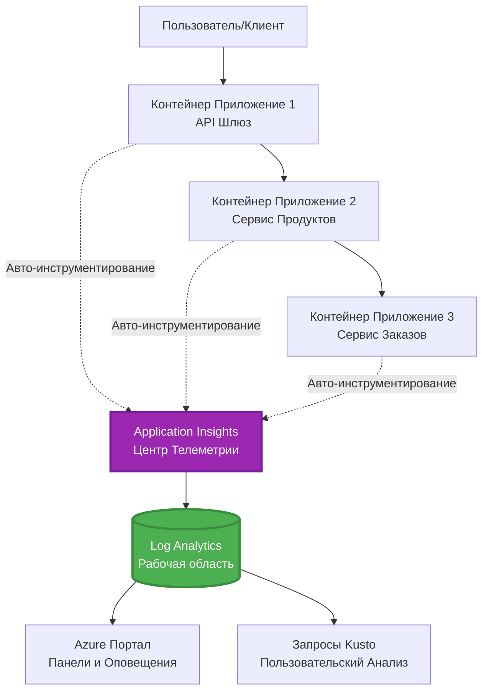
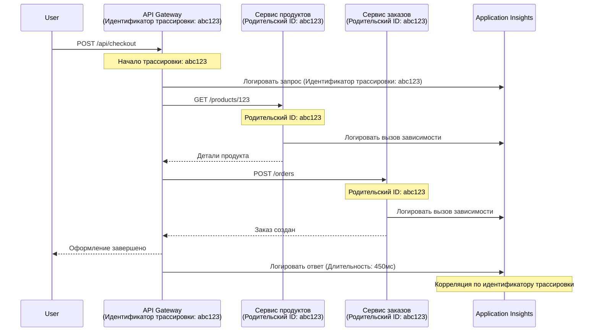

<!--
CO_OP_TRANSLATOR_METADATA:
{
  "original_hash": "e5aa37cdb6378c09099500ac31600b8c",
  "translation_date": "2025-11-20T10:39:31+00:00",
  "source_file": "docs/pre-deployment/application-insights.md",
  "language_code": "ru"
}
-->
# Интеграция Application Insights с AZD

⏱️ **Оценочное время**: 40-50 минут | 💰 **Стоимость**: ~$5-15/месяц | ⭐ **Сложность**: Средняя

**📚 Учебный путь:**
- ← Предыдущий: [Проверки перед запуском](preflight-checks.md) - Проверка перед развертыванием
- 🎯 **Вы здесь**: Интеграция Application Insights (мониторинг, телеметрия, отладка)
- → Следующий: [Руководство по развертыванию](../deployment/deployment-guide.md) - Развертывание в Azure
- 🏠 [Главная страница курса](../../README.md)

---

## Чему вы научитесь

После завершения урока вы сможете:
- Автоматически интегрировать **Application Insights** в проекты AZD
- Настроить **распределённое трассирование** для микросервисов
- Реализовать **пользовательскую телеметрию** (метрики, события, зависимости)
- Настроить **живые метрики** для мониторинга в реальном времени
- Создавать **оповещения и панели мониторинга** из развертываний AZD
- Отлаживать проблемы в продакшене с помощью **запросов телеметрии**
- Оптимизировать **расходы и стратегии выборки**
- Мониторить **AI/LLM приложения** (токены, задержки, расходы)

## Почему важна интеграция Application Insights с AZD

### Проблема: Наблюдаемость в продакшене

**Без Application Insights:**
```
❌ No visibility into production behavior
❌ Manual log aggregation across services
❌ Reactive debugging (wait for customer complaints)
❌ No performance metrics
❌ Cannot trace requests across services
❌ Unknown failure rates and bottlenecks
```

**С Application Insights + AZD:**
```
✅ Automatic telemetry collection
✅ Centralized logs from all services
✅ Proactive issue detection
✅ End-to-end request tracing
✅ Performance metrics and insights
✅ Real-time dashboards
✅ AZD provisions everything automatically
```

**Аналогия**: Application Insights — это как "черный ящик" самолета + приборная панель для вашего приложения. Вы видите всё, что происходит в реальном времени, и можете воспроизвести любой инцидент.

---

## Обзор архитектуры

### Application Insights в архитектуре AZD


### Что мониторится автоматически

| Тип телеметрии | Что фиксируется | Применение |
|----------------|------------------|------------|
| **Запросы** | HTTP-запросы, коды статуса, длительность | Мониторинг производительности API |
| **Зависимости** | Внешние вызовы (БД, API, хранилище) | Выявление узких мест |
| **Исключения** | Необработанные ошибки со стеком вызовов | Отладка сбоев |
| **Пользовательские события** | Бизнес-события (регистрация, покупка) | Аналитика и воронки |
| **Метрики** | Счетчики производительности, пользовательские метрики | Планирование емкости |
| **Трассировки** | Сообщения журнала с уровнем важности | Отладка и аудит |
| **Доступность** | Тесты времени отклика и доступности | Мониторинг SLA |

---

## Предварительные требования

### Необходимые инструменты

```bash
# Проверить Azure Developer CLI
azd version
# ✅ Ожидается: azd версии 1.0.0 или выше

# Проверить Azure CLI
az --version
# ✅ Ожидается: azure-cli версии 2.50.0 или выше
```

### Требования к Azure

- Активная подписка Azure
- Разрешения на создание:
  - Ресурсов Application Insights
  - Рабочих областей Log Analytics
  - Контейнерных приложений
  - Групп ресурсов

### Требования к знаниям

Вы должны завершить:
- [Основы AZD](../getting-started/azd-basics.md) - Основные концепции AZD
- [Конфигурация](../getting-started/configuration.md) - Настройка окружения
- [Первый проект](../getting-started/first-project.md) - Базовое развертывание

---

## Урок 1: Автоматическое подключение Application Insights с AZD

### Как AZD создает Application Insights

AZD автоматически создает и настраивает Application Insights при развертывании. Давайте посмотрим, как это работает.

### Структура проекта

```
monitored-app/
├── azure.yaml                     # AZD configuration
├── infra/
│   ├── main.bicep                # Main infrastructure
│   ├── core/
│   │   └── monitoring.bicep      # Application Insights + Log Analytics
│   └── app/
│       └── api.bicep             # Container App with monitoring
└── src/
    ├── app.py                    # Application with telemetry
    ├── requirements.txt
    └── Dockerfile
```

---

### Шаг 1: Настройка AZD (azure.yaml)

**Файл: `azure.yaml`**

```yaml
name: monitored-app
metadata:
  template: monitored-app@1.0.0

services:
  api:
    project: ./src
    language: python
    host: containerapp

# AZD automatically provisions monitoring!
```

**И всё!** AZD создаст Application Insights по умолчанию. Дополнительная настройка для базового мониторинга не требуется.

---

### Шаг 2: Инфраструктура мониторинга (Bicep)

**Файл: `infra/core/monitoring.bicep`**

```bicep
param logAnalyticsName string
param applicationInsightsName string
param location string = resourceGroup().location
param tags object = {}

// Log Analytics Workspace (required for Application Insights)
resource logAnalytics 'Microsoft.OperationalInsights/workspaces@2022-10-01' = {
  name: logAnalyticsName
  location: location
  tags: tags
  properties: {
    sku: {
      name: 'PerGB2018'  // Pay-as-you-go pricing
    }
    retentionInDays: 30  // Keep logs for 30 days
    features: {
      enableLogAccessUsingOnlyResourcePermissions: true
    }
  }
}

// Application Insights
resource applicationInsights 'Microsoft.Insights/components@2020-02-02' = {
  name: applicationInsightsName
  location: location
  tags: tags
  kind: 'web'
  properties: {
    Application_Type: 'web'
    WorkspaceResourceId: logAnalytics.id
    IngestionMode: 'LogAnalytics'
    publicNetworkAccessForIngestion: 'Enabled'
    publicNetworkAccessForQuery: 'Enabled'
  }
}

// Outputs for Container Apps
output logAnalyticsWorkspaceId string = logAnalytics.id
output logAnalyticsWorkspaceName string = logAnalytics.name
output applicationInsightsConnectionString string = applicationInsights.properties.ConnectionString
output applicationInsightsInstrumentationKey string = applicationInsights.properties.InstrumentationKey
output applicationInsightsName string = applicationInsights.name
```

---

### Шаг 3: Подключение контейнерного приложения к Application Insights

**Файл: `infra/app/api.bicep`**

```bicep
param name string
param location string
param tags object = {}
param containerAppsEnvironmentName string
param applicationInsightsConnectionString string

resource containerApp 'Microsoft.App/containerApps@2023-05-01' = {
  name: name
  location: location
  tags: tags
  properties: {
    configuration: {
      ingress: {
        external: true
        targetPort: 8000
      }
      secrets: [
        {
          name: 'appinsights-connection-string'
          value: applicationInsightsConnectionString
        }
      ]
    }
    template: {
      containers: [
        {
          name: 'api'
          image: 'myregistry.azurecr.io/api:latest'
          resources: {
            cpu: json('0.5')
            memory: '1Gi'
          }
          env: [
            {
              name: 'APPLICATIONINSIGHTS_CONNECTION_STRING'
              secretRef: 'appinsights-connection-string'
            }
            {
              name: 'APPLICATIONINSIGHTS_ENABLED'
              value: 'true'
            }
          ]
        }
      ]
    }
  }
}

output uri string = 'https://${containerApp.properties.configuration.ingress.fqdn}'
```

---

### Шаг 4: Код приложения с телеметрией

**Файл: `src/app.py`**

```python
from flask import Flask, request, jsonify
from opencensus.ext.azure.log_exporter import AzureLogHandler
from opencensus.ext.azure.trace_exporter import AzureExporter
from opencensus.ext.flask.flask_middleware import FlaskMiddleware
from opencensus.trace.samplers import ProbabilitySampler
import logging
import os

app = Flask(__name__)

# Получить строку подключения Application Insights
connection_string = os.environ.get('APPLICATIONINSIGHTS_CONNECTION_STRING')

if connection_string:
    # Настроить распределенное трассирование
    middleware = FlaskMiddleware(
        app,
        exporter=AzureExporter(connection_string=connection_string),
        sampler=ProbabilitySampler(rate=1.0)  # 100% выборка для разработки
    )
    
    # Настроить логирование
    logger = logging.getLogger(__name__)
    logger.addHandler(AzureLogHandler(connection_string=connection_string))
    logger.setLevel(logging.INFO)
    
    print("✅ Application Insights enabled")
else:
    logger = logging.getLogger(__name__)
    logger.setLevel(logging.INFO)
    print("⚠️ Application Insights not configured")

@app.route('/health')
def health():
    logger.info('Health check endpoint called')
    return jsonify({'status': 'healthy', 'monitoring': 'enabled'})

@app.route('/api/products')
def get_products():
    logger.info('Fetching products')
    
    # Симулировать вызов базы данных (автоматически отслеживается как зависимость)
    products = [
        {'id': 1, 'name': 'Laptop', 'price': 999.99},
        {'id': 2, 'name': 'Mouse', 'price': 29.99},
        {'id': 3, 'name': 'Keyboard', 'price': 79.99}
    ]
    
    logger.info(f'Returned {len(products)} products')
    return jsonify(products)

@app.route('/api/error-test')
def error_test():
    """Test error tracking"""
    logger.error('Testing error tracking')
    try:
        raise ValueError('This is a test exception')
    except Exception as e:
        logger.exception('Exception occurred in error-test endpoint')
        return jsonify({'error': str(e)}), 500

@app.route('/api/slow')
def slow_endpoint():
    """Test performance tracking"""
    import time
    logger.info('Slow endpoint called')
    time.sleep(3)  # Симулировать медленную операцию
    logger.warning('Endpoint took 3 seconds to respond')
    return jsonify({'message': 'Slow operation completed'})

if __name__ == '__main__':
    app.run(host='0.0.0.0', port=8000)
```

**Файл: `src/requirements.txt`**

```txt
Flask==3.0.0
opencensus-ext-azure==1.1.13
opencensus-ext-flask==0.8.1
gunicorn==21.2.0
```

---

### Шаг 5: Развертывание и проверка

```bash
# Инициализировать AZD
azd init

# Развернуть (автоматически предоставляет Application Insights)
azd up

# Получить URL приложения
APP_URL=$(azd env get-values | grep API_URL | cut -d '=' -f2 | tr -d '"')

# Сгенерировать телеметрию
curl $APP_URL/health
curl $APP_URL/api/products
curl $APP_URL/api/error-test
curl $APP_URL/api/slow
```

**✅ Ожидаемый результат:**
```json
{
  "status": "healthy",
  "monitoring": "enabled"
}
```

---

### Шаг 6: Просмотр телеметрии в Azure Portal

```bash
# Получить данные Application Insights
azd env get-values | grep APPLICATIONINSIGHTS

# Открыть в Azure Portal
az monitor app-insights component show \
  --app $(azd env get-values | grep APPLICATIONINSIGHTS_NAME | cut -d '=' -f2 | tr -d '"') \
  --resource-group $(azd env get-values | grep AZURE_RESOURCE_GROUP | cut -d '=' -f2 | tr -d '"') \
  --query "appId" -o tsv
```

**Перейдите в Azure Portal → Application Insights → Transaction Search**

Вы должны увидеть:
- ✅ HTTP-запросы с кодами статуса
- ✅ Длительность запросов (3+ секунды для `/api/slow`)
- ✅ Детали исключений из `/api/error-test`
- ✅ Пользовательские сообщения журнала

---

## Урок 2: Пользовательская телеметрия и события

### Отслеживание бизнес-событий

Добавим пользовательскую телеметрию для критически важных бизнес-событий.

**Файл: `src/telemetry.py`**

```python
from opencensus.ext.azure import metrics_exporter
from opencensus.stats import aggregation as aggregation_module
from opencensus.stats import measure as measure_module
from opencensus.stats import stats as stats_module
from opencensus.stats import view as view_module
from opencensus.tags import tag_map as tag_map_module
from opencensus.ext.azure.log_exporter import AzureLogHandler
from opencensus.ext.azure.trace_exporter import AzureExporter
from opencensus.trace import tracer as tracer_module
import logging
import os

class TelemetryClient:
    """Custom telemetry client for Application Insights"""
    
    def __init__(self, connection_string=None):
        self.connection_string = connection_string or os.environ.get('APPLICATIONINSIGHTS_CONNECTION_STRING')
        
        if not self.connection_string:
            print("⚠️ Application Insights connection string not found")
            return
        
        # Настройка логгера
        self.logger = logging.getLogger(__name__)
        self.logger.addHandler(AzureLogHandler(connection_string=self.connection_string))
        self.logger.setLevel(logging.INFO)
        
        # Настройка экспортера метрик
        self.stats = stats_module.stats
        self.view_manager = self.stats.view_manager
        self.stats_recorder = self.stats.stats_recorder
        
        exporter = metrics_exporter.new_metrics_exporter(
            connection_string=self.connection_string
        )
        self.view_manager.register_exporter(exporter)
        
        # Настройка трассировщика
        self.tracer = tracer_module.Tracer(
            exporter=AzureExporter(connection_string=self.connection_string)
        )
        
        print("✅ Custom telemetry client initialized")
    
    def track_event(self, event_name: str, properties: dict = None):
        """Track custom business event"""
        properties = properties or {}
        self.logger.info(
            f"CustomEvent: {event_name}",
            extra={
                'custom_dimensions': {
                    'event_name': event_name,
                    **properties
                }
            }
        )
    
    def track_metric(self, metric_name: str, value: float, properties: dict = None):
        """Track custom metric"""
        properties = properties or {}
        self.logger.info(
            f"CustomMetric: {metric_name} = {value}",
            extra={
                'custom_dimensions': {
                    'metric_name': metric_name,
                    'value': value,
                    **properties
                }
            }
        )
    
    def track_dependency(self, name: str, dependency_type: str, duration: float, success: bool):
        """Track external dependency call"""
        with self.tracer.span(name=name) as span:
            span.add_attribute('dependency.type', dependency_type)
            span.add_attribute('duration', duration)
            span.add_attribute('success', success)

# Глобальный клиент телеметрии
telemetry = TelemetryClient()
```

### Обновление приложения с пользовательскими событиями

**Файл: `src/app.py` (дополненный)**

```python
from flask import Flask, request, jsonify
from telemetry import telemetry
import time
import random

app = Flask(__name__)

@app.route('/api/purchase', methods=['POST'])
def purchase():
    """Track purchase event with custom telemetry"""
    data = request.json
    product_id = data.get('product_id')
    quantity = data.get('quantity', 1)
    price = data.get('price', 0)
    
    # Отслеживать бизнес-событие
    telemetry.track_event('Purchase', {
        'product_id': product_id,
        'quantity': quantity,
        'total_amount': price * quantity,
        'user_id': request.headers.get('X-User-Id', 'anonymous')
    })
    
    # Отслеживать метрику дохода
    telemetry.track_metric('Revenue', price * quantity, {
        'product_id': product_id,
        'currency': 'USD'
    })
    
    return jsonify({
        'order_id': f'ORD-{random.randint(1000, 9999)}',
        'status': 'confirmed',
        'total': price * quantity
    })

@app.route('/api/search')
def search():
    """Track search queries"""
    query = request.args.get('q', '')
    
    start_time = time.time()
    
    # Симулировать поиск (был бы реальный запрос к базе данных)
    results = [{'id': 1, 'name': f'Result for {query}'}]
    
    duration = (time.time() - start_time) * 1000  # Конвертировать в миллисекунды
    
    # Отслеживать событие поиска
    telemetry.track_event('Search', {
        'query': query,
        'results_count': len(results),
        'duration_ms': duration
    })
    
    # Отслеживать метрику производительности поиска
    telemetry.track_metric('SearchDuration', duration, {
        'query_length': len(query)
    })
    
    return jsonify({'results': results, 'count': len(results)})

@app.route('/api/external-call')
def external_call():
    """Track external API dependency"""
    import requests
    
    start_time = time.time()
    success = True
    
    try:
        # Симулировать вызов внешнего API
        response = requests.get('https://api.example.com/data', timeout=5)
        result = response.json()
    except Exception as e:
        success = False
        result = {'error': str(e)}
    
    duration = (time.time() - start_time) * 1000
    
    # Отслеживать зависимость
    telemetry.track_dependency(
        name='ExternalAPI',
        dependency_type='HTTP',
        duration=duration,
        success=success
    )
    
    return jsonify(result)

if __name__ == '__main__':
    app.run(host='0.0.0.0', port=8000)
```

### Тестирование пользовательской телеметрии

```bash
# Отслеживать событие покупки
curl -X POST $APP_URL/api/purchase \
  -H "Content-Type: application/json" \
  -H "X-User-Id: user123" \
  -d '{"product_id": 1, "quantity": 2, "price": 29.99}'

# Отслеживать событие поиска
curl "$APP_URL/api/search?q=laptop"

# Отслеживать внешнюю зависимость
curl $APP_URL/api/external-call
```

**Просмотр в Azure Portal:**

Перейдите в Application Insights → Logs и выполните:

```kusto
// View purchase events
traces
| where customDimensions.event_name == "Purchase"
| project 
    timestamp,
    product_id = tostring(customDimensions.product_id),
    total_amount = todouble(customDimensions.total_amount),
    user_id = tostring(customDimensions.user_id)
| order by timestamp desc

// View revenue metrics
traces
| where customDimensions.metric_name == "Revenue"
| summarize TotalRevenue = sum(todouble(customDimensions.value)) by bin(timestamp, 1h)
| render timechart

// View search performance
traces
| where customDimensions.event_name == "Search"
| summarize 
    AvgDuration = avg(todouble(customDimensions.duration_ms)),
    SearchCount = count()
  by bin(timestamp, 5m)
| render timechart
```

---

## Урок 3: Распределённое трассирование для микросервисов

### Включение трассировки между сервисами

Для микросервисов Application Insights автоматически связывает запросы между сервисами.

**Файл: `infra/main.bicep`**

```bicep
targetScope = 'subscription'

param environmentName string
param location string = 'eastus'

var tags = { 'azd-env-name': environmentName }

resource rg 'Microsoft.Resources/resourceGroups@2021-04-01' = {
  name: 'rg-${environmentName}'
  location: location
  tags: tags
}

// Monitoring (shared by all services)
module monitoring './core/monitoring.bicep' = {
  name: 'monitoring'
  scope: rg
  params: {
    logAnalyticsName: 'log-${environmentName}'
    applicationInsightsName: 'appi-${environmentName}'
    location: location
    tags: tags
  }
}

// API Gateway
module apiGateway './app/api-gateway.bicep' = {
  name: 'api-gateway'
  scope: rg
  params: {
    name: 'ca-gateway-${environmentName}'
    location: location
    tags: union(tags, { 'azd-service-name': 'gateway' })
    applicationInsightsConnectionString: monitoring.outputs.applicationInsightsConnectionString
  }
}

// Product Service
module productService './app/product-service.bicep' = {
  name: 'product-service'
  scope: rg
  params: {
    name: 'ca-products-${environmentName}'
    location: location
    tags: union(tags, { 'azd-service-name': 'products' })
    applicationInsightsConnectionString: monitoring.outputs.applicationInsightsConnectionString
  }
}

// Order Service
module orderService './app/order-service.bicep' = {
  name: 'order-service'
  scope: rg
  params: {
    name: 'ca-orders-${environmentName}'
    location: location
    tags: union(tags, { 'azd-service-name': 'orders' })
    applicationInsightsConnectionString: monitoring.outputs.applicationInsightsConnectionString
  }
}

output APPLICATIONINSIGHTS_CONNECTION_STRING string = monitoring.outputs.applicationInsightsConnectionString
output GATEWAY_URL string = apiGateway.outputs.uri
```

### Просмотр транзакции от начала до конца


**Запрос трассировки от начала до конца:**

```kusto
// Find complete request flow
let traceId = "abc123...";  // Get from response header
dependencies
| union requests
| where operation_Id == traceId
| project 
    timestamp,
    type = itemType,
    name,
    duration,
    success,
    cloud_RoleName
| order by timestamp asc
```

---

## Урок 4: Живые метрики и мониторинг в реальном времени

### Включение потока живых метрик

Live Metrics предоставляет телеметрию в реальном времени с задержкой менее 1 секунды.

**Доступ к Live Metrics:**

```bash
# Получить ресурс Application Insights
APPI_NAME=$(azd env get-values | grep APPLICATIONINSIGHTS_NAME | cut -d '=' -f2 | tr -d '"')

# Получить группу ресурсов
RG_NAME=$(azd env get-values | grep AZURE_RESOURCE_GROUP | cut -d '=' -f2 | tr -d '"')

echo "Navigate to: Azure Portal → Resource Groups → $RG_NAME → $APPI_NAME → Live Metrics"
```

**Что вы видите в реальном времени:**
- ✅ Скорость входящих запросов (запросов/сек)
- ✅ Исходящие вызовы зависимостей
- ✅ Количество исключений
- ✅ Использование CPU и памяти
- ✅ Количество активных серверов
- ✅ Пример телеметрии

### Генерация нагрузки для тестирования

```bash
# Генерируйте нагрузку, чтобы увидеть живые метрики
for i in {1..100}; do
  curl $APP_URL/api/products &
  curl $APP_URL/api/search?q=test$i &
done

# Просматривайте живые метрики в Azure Portal
# Вы должны увидеть всплеск скорости запросов
```

---

## Практические упражнения

### Упражнение 1: Настройка оповещений ⭐⭐ (Средний уровень)

**Цель**: Создать оповещения для высокого уровня ошибок и медленных ответов.

**Шаги:**

1. **Создание оповещения для уровня ошибок:**

```bash
# Получить идентификатор ресурса Application Insights
APPI_ID=$(az monitor app-insights component show \
  --app $APPI_NAME \
  --resource-group $RG_NAME \
  --query "id" -o tsv)

# Создать метрику оповещения для неудачных запросов
az monitor metrics alert create \
  --name "High-Error-Rate" \
  --resource-group $RG_NAME \
  --scopes $APPI_ID \
  --condition "count requests/failed > 10" \
  --window-size 5m \
  --evaluation-frequency 1m \
  --description "Alert when error rate exceeds 10 per 5 minutes"
```

2. **Создание оповещения для медленных ответов:**

```bash
az monitor metrics alert create \
  --name "Slow-Responses" \
  --resource-group $RG_NAME \
  --scopes $APPI_ID \
  --condition "avg requests/duration > 3000" \
  --window-size 5m \
  --evaluation-frequency 1m \
  --description "Alert when average response time exceeds 3 seconds"
```

3. **Создание оповещения через Bicep (предпочтительно для AZD):**

**Файл: `infra/core/alerts.bicep`**

```bicep
param applicationInsightsId string
param actionGroupId string = ''
param location string = resourceGroup().location

// High error rate alert
resource errorRateAlert 'Microsoft.Insights/metricAlerts@2018-03-01' = {
  name: 'high-error-rate'
  location: 'global'
  properties: {
    description: 'Alert when error rate exceeds threshold'
    severity: 2
    enabled: true
    scopes: [
      applicationInsightsId
    ]
    evaluationFrequency: 'PT1M'
    windowSize: 'PT5M'
    criteria: {
      'odata.type': 'Microsoft.Azure.Monitor.SingleResourceMultipleMetricCriteria'
      allOf: [
        {
          name: 'Error rate'
          metricName: 'requests/failed'
          operator: 'GreaterThan'
          threshold: 10
          timeAggregation: 'Count'
        }
      ]
    }
    actions: actionGroupId != '' ? [
      {
        actionGroupId: actionGroupId
      }
    ] : []
  }
}

// Slow response alert
resource slowResponseAlert 'Microsoft.Insights/metricAlerts@2018-03-01' = {
  name: 'slow-responses'
  location: 'global'
  properties: {
    description: 'Alert when response time is too high'
    severity: 3
    enabled: true
    scopes: [
      applicationInsightsId
    ]
    evaluationFrequency: 'PT1M'
    windowSize: 'PT5M'
    criteria: {
      'odata.type': 'Microsoft.Azure.Monitor.SingleResourceMultipleMetricCriteria'
      allOf: [
        {
          name: 'Response duration'
          metricName: 'requests/duration'
          operator: 'GreaterThan'
          threshold: 3000
          timeAggregation: 'Average'
        }
      ]
    }
  }
}

output errorAlertId string = errorRateAlert.id
output slowResponseAlertId string = slowResponseAlert.id
```

4. **Тестирование оповещений:**

```bash
# Генерировать ошибки
for i in {1..20}; do
  curl $APP_URL/api/error-test
done

# Генерировать медленные ответы
for i in {1..10}; do
  curl $APP_URL/api/slow
done

# Проверить статус оповещения (подождите 5-10 минут)
az monitor metrics alert list \
  --resource-group $RG_NAME \
  --query "[].{Name:name, Enabled:enabled, State:properties.enabled}" \
  --output table
```

**✅ Критерии успеха:**
- ✅ Оповещения успешно созданы
- ✅ Оповещения срабатывают при превышении порогов
- ✅ История оповещений доступна в Azure Portal
- ✅ Интеграция с развертыванием AZD

**Время**: 20-25 минут

---

### Упражнение 2: Создание пользовательской панели мониторинга ⭐⭐ (Средний уровень)

**Цель**: Создать панель мониторинга с ключевыми метриками приложения.

**Шаги:**

1. **Создание панели через Azure Portal:**

Перейдите: Azure Portal → Dashboards → New Dashboard

2. **Добавление плиток с ключевыми метриками:**

- Количество запросов (за последние 24 часа)
- Среднее время ответа
- Уровень ошибок
- Топ-5 самых медленных операций
- Географическое распределение пользователей

3. **Создание панели через Bicep:**

**Файл: `infra/core/dashboard.bicep`**

```bicep
param dashboardName string
param applicationInsightsId string
param location string = resourceGroup().location

resource dashboard 'Microsoft.Portal/dashboards@2020-09-01-preview' = {
  name: dashboardName
  location: location
  properties: {
    lenses: [
      {
        order: 0
        parts: [
          // Request count
          {
            position: { x: 0, y: 0, rowSpan: 4, colSpan: 6 }
            metadata: {
              type: 'Extension/Microsoft_OperationsManagementSuite_Workspace/PartType/LogsDashboardPart'
              inputs: [
                {
                  name: 'resourceId'
                  value: applicationInsightsId
                }
                {
                  name: 'query'
                  value: '''
                    requests
                    | summarize RequestCount = count() by bin(timestamp, 1h)
                    | render timechart
                  '''
                }
              ]
            }
          }
          // Error rate
          {
            position: { x: 6, y: 0, rowSpan: 4, colSpan: 6 }
            metadata: {
              type: 'Extension/Microsoft_OperationsManagementSuite_Workspace/PartType/LogsDashboardPart'
              inputs: [
                {
                  name: 'resourceId'
                  value: applicationInsightsId
                }
                {
                  name: 'query'
                  value: '''
                    requests
                    | summarize 
                        Total = count(),
                        Failed = countif(success == false)
                    | extend ErrorRate = (Failed * 100.0) / Total
                    | project ErrorRate
                  '''
                }
              ]
            }
          }
        ]
      }
    ]
  }
}

output dashboardId string = dashboard.id
```

4. **Развертывание панели:**

```bash
# Добавить в main.bicep
module dashboard './core/dashboard.bicep' = {
  name: 'dashboard'
  scope: rg
  params: {
    dashboardName: 'dashboard-${environmentName}'
    applicationInsightsId: monitoring.outputs.applicationInsightsId
    location: location
  }
}

# Развернуть
azd up
```

**✅ Критерии успеха:**
- ✅ Панель отображает ключевые метрики
- ✅ Можно закрепить на главной странице Azure Portal
- ✅ Обновляется в реальном времени
- ✅ Разворачивается через AZD

**Время**: 25-30 минут

---

### Упражнение 3: Мониторинг AI/LLM приложений ⭐⭐⭐ (Продвинутый уровень)

**Цель**: Отслеживать использование Azure OpenAI (токены, расходы, задержки).

**Шаги:**

1. **Создание обертки для мониторинга AI:**

**Файл: `src/ai_telemetry.py`**

```python
from telemetry import telemetry
from openai import AzureOpenAI
import time

class MonitoredAzureOpenAI:
    """Azure OpenAI client with automatic telemetry"""
    
    def __init__(self, api_key, endpoint, api_version="2024-02-01"):
        self.client = AzureOpenAI(
            api_key=api_key,
            api_version=api_version,
            azure_endpoint=endpoint
        )
    
    def chat_completion(self, model: str, messages: list, **kwargs):
        """Track chat completion with telemetry"""
        start_time = time.time()
        
        try:
            # Вызов Azure OpenAI
            response = self.client.chat.completions.create(
                model=model,
                messages=messages,
                **kwargs
            )
            
            duration = (time.time() - start_time) * 1000  # мс
            
            # Извлечь использование
            usage = response.usage
            prompt_tokens = usage.prompt_tokens
            completion_tokens = usage.completion_tokens
            total_tokens = usage.total_tokens
            
            # Рассчитать стоимость (цены GPT-4)
            prompt_cost = (prompt_tokens / 1000) * 0.03  # $0.03 за 1K токенов
            completion_cost = (completion_tokens / 1000) * 0.06  # $0.06 за 1K токенов
            total_cost = prompt_cost + completion_cost
            
            # Отслеживать пользовательское событие
            telemetry.track_event('OpenAI_Request', {
                'model': model,
                'prompt_tokens': prompt_tokens,
                'completion_tokens': completion_tokens,
                'total_tokens': total_tokens,
                'duration_ms': duration,
                'cost_usd': total_cost,
                'success': True
            })
            
            # Отслеживать метрики
            telemetry.track_metric('OpenAI_Tokens', total_tokens, {
                'model': model,
                'type': 'total'
            })
            
            telemetry.track_metric('OpenAI_Cost', total_cost, {
                'model': model,
                'currency': 'USD'
            })
            
            telemetry.track_metric('OpenAI_Duration', duration, {
                'model': model
            })
            
            return response
            
        except Exception as e:
            duration = (time.time() - start_time) * 1000
            
            telemetry.track_event('OpenAI_Request', {
                'model': model,
                'duration_ms': duration,
                'success': False,
                'error': str(e)
            })
            
            raise
```

2. **Использование клиента с мониторингом:**

```python
from flask import Flask, request, jsonify
from ai_telemetry import MonitoredAzureOpenAI
import os

app = Flask(__name__)

# Инициализировать отслеживаемый клиент OpenAI
openai_client = MonitoredAzureOpenAI(
    api_key=os.environ['AZURE_OPENAI_API_KEY'],
    endpoint=os.environ['AZURE_OPENAI_ENDPOINT']
)

@app.route('/api/chat', methods=['POST'])
def chat():
    data = request.json
    user_message = data.get('message')
    
    # Вызов с автоматическим мониторингом
    response = openai_client.chat_completion(
        model='gpt-4',
        messages=[
            {'role': 'user', 'content': user_message}
        ]
    )
    
    return jsonify({
        'response': response.choices[0].message.content,
        'tokens': response.usage.total_tokens
    })
```

3. **Запрос метрик AI:**

```kusto
// Total AI spend over time
traces
| where customDimensions.event_name == "OpenAI_Request"
| where customDimensions.success == "True"
| summarize TotalCost = sum(todouble(customDimensions.cost_usd)) by bin(timestamp, 1h)
| render timechart

// Token usage by model
traces
| where customDimensions.event_name == "OpenAI_Request"
| summarize 
    TotalTokens = sum(toint(customDimensions.total_tokens)),
    RequestCount = count()
  by Model = tostring(customDimensions.model)

// Average latency
traces
| where customDimensions.event_name == "OpenAI_Request"
| summarize AvgDuration = avg(todouble(customDimensions.duration_ms))
| project AvgDurationSeconds = AvgDuration / 1000

// Cost per request
traces
| where customDimensions.event_name == "OpenAI_Request"
| extend Cost = todouble(customDimensions.cost_usd)
| summarize 
    TotalCost = sum(Cost),
    RequestCount = count(),
    AvgCostPerRequest = avg(Cost)
```

**✅ Критерии успеха:**
- ✅ Каждый вызов OpenAI отслеживается автоматически
- ✅ Видно использование токенов и расходы
- ✅ Мониторится задержка
- ✅ Можно настроить оповещения по бюджету

**Время**: 35-45 минут

---

## Оптимизация затрат

### Стратегии выборки

Контролируйте расходы, используя выборку телеметрии:

```python
from opencensus.trace.samplers import ProbabilitySampler

# Разработка: 100% выборка
sampler = ProbabilitySampler(rate=1.0)

# Производство: 10% выборка (сократить расходы на 90%)
sampler = ProbabilitySampler(rate=0.1)

# Адаптивная выборка (автоматически регулируется)
from opencensus.trace.samplers import AdaptiveSampler
sampler = AdaptiveSampler()
```

**В Bicep:**

```bicep
resource applicationInsights 'Microsoft.Insights/components@2020-02-02' = {
  name: applicationInsightsName
  properties: {
    SamplingPercentage: 10  // 10% sampling
  }
}
```

### Срок хранения данных

```bicep
resource logAnalytics 'Microsoft.OperationalInsights/workspaces@2022-10-01' = {
  name: logAnalyticsName
  properties: {
    retentionInDays: 30  // Minimum (cheapest)
    // Options: 30, 31, 60, 90, 120, 180, 270, 365, 550, 730
  }
}
```

### Оценка ежемесячных затрат

| Объем данных | Срок хранения | Ежемесячная стоимость |
|--------------|---------------|-----------------------|
| 1 ГБ/месяц | 30 дней | ~$2-5 |
| 5 ГБ/месяц | 30 дней | ~$10-15 |
| 10 ГБ/месяц | 90 дней | ~$25-40 |
| 50 ГБ/месяц | 90 дней | ~$100-150 |

**Бесплатный уровень**: 5 ГБ/месяц включено

---

## Контрольные вопросы

### 1. Базовая интеграция ✓

Проверьте свои знания:

- [ ] **В1**: Как AZD создает Application Insights?
  - **О**: Автоматически через шаблоны Bicep в `infra/core/monitoring.bicep`

- [ ] **В2**: Какой переменной окружения включается Application Insights?
  - **О**: `APPLICATIONINSIGHTS_CONNECTION_STRING`

- [ ] **В3**: Какие три основных типа телеметрии?
  - **О**: Запросы (HTTP вызовы), Зависимости (внешние вызовы), Исключения (ошибки)

**Практическая проверка:**
```bash
# Проверить, настроен ли Application Insights
azd env get-values | grep APPLICATIONINSIGHTS

# Убедиться, что телеметрия передается
az monitor app-insights metrics show \
  --app $APPI_NAME \
  --resource-group $RG_NAME \
  --metric "requests/count"
```

---

### 2. Пользовательская телеметрия ✓

Проверьте свои знания:

- [ ] **В1**: Как отслеживать пользовательские бизнес-события?
  - **О**: Использовать логгер с `custom_dimensions` или `TelemetryClient.track_event()`

- [ ] **В2**: В чем разница между событиями и метриками?
  - **О**: События — это дискретные случаи, метрики — числовые измерения

- [ ] **В3**: Как связать телеметрию между сервисами?
  - **О**: Application Insights автоматически использует `operation_Id` для связи

**Практическая проверка:**
```kusto
// Verify custom events
traces
| where customDimensions.event_name != ""
| summarize count() by tostring(customDimensions.event_name)
```

---

### 3. Мониторинг в продакшене ✓

Проверьте свои знания:

- [ ] **В1**: Что такое выборка и зачем она нужна?
  - **О**: Выборка уменьшает объем данных (и расходы), фиксируя только процент телеметрии

- [ ] **В2**: Как настроить оповещения?
  - **О**: Использовать метрики оповещений в Bicep или Azure Portal на основе метрик Application Insights

- [ ] **В3**: В чем разница между Log Analytics и Application Insights?
  - **О**: Application Insights хранит данные в рабочей области Log Analytics; App Insights предоставляет специфические для приложения представления

**Практическая проверка:**
```bash
# Проверьте конфигурацию выборки
az monitor app-insights component show \
  --app $APPI_NAME \
  --resource-group $RG_NAME \
  --query "properties.SamplingPercentage"
```

---

## Лучшие практики

### ✅ ДЕЛАЙТЕ:

1. **Используйте идентификаторы корреляции**
   ```python
   logger.info('Processing order', extra={
       'custom_dimensions': {
           'order_id': order_id,
           'user_id': user_id
       }
   })
   ```

2. **Настраивайте оповещения для критических метрик**
   ```bicep
   // Error rate, slow responses, availability
   ```

3. **Используйте структурированные журналы**
   ```python
   # ✅ ХОРОШО: Структурированный
   logger.info('User signup', extra={'custom_dimensions': {'user_id': 123}})
   
   # ❌ ПЛОХО: Неструктурированный
   logger.info(f'User 123 signed up')
   ```

4. **Мониторьте зависимости**
   ```python
   # Автоматически отслеживать вызовы базы данных, HTTP-запросы и т.д.
   ```

5. **Используйте живые метрики во время развертываний**

### ❌ НЕ ДЕЛАЙТЕ:

1. **Не записывайте конфиденциальные данные**
   ```python
   # ❌ ПЛОХО
   logger.info(f'Login: {username}:{password}')
   
   # ✅ ХОРОШО
   logger.info('Login attempt', extra={'custom_dimensions': {'username': username}})
   ```

2. **Не используйте 100% выборку в продакшене**
   ```python
   # ❌ Дорого
   sampler = ProbabilitySampler(rate=1.0)
   
   # ✅ Экономично
   sampler = ProbabilitySampler(rate=0.1)
   ```

3. **Не игнорируйте очереди dead letter**

4. **Не забывайте устанавливать лимиты хранения данных**

---

## Устранение неполадок

### Проблема: Телеметрия не отображается

**Диагностика:**
```bash
# Проверьте, установлен ли строка подключения
azd env get-values | grep APPLICATIONINSIGHTS

# Проверьте журналы приложения
azd logs api --tail 50
```

**Решение:**
```bash
# Проверьте строку подключения в приложении контейнера
az containerapp show \
  --name $APP_NAME \
  --resource-group $RG_NAME \
  --query "properties.template.containers[0].env" \
  | grep -i applicationinsights
```

---

### Проблема: Высокие расходы

**Диагностика:**
```bash
# Проверить загрузку данных
az monitor app-insights metrics show \
  --app $APPI_NAME \
  --resource-group $RG_NAME \
  --metric "availabilityResults/count"
```

**Решение:**
- Уменьшите уровень выборки
- Сократите срок хранения данных
- Уберите подробные журналы

---

## Узнать больше

### Официальная документация
- [Обзор Application Insights](https://learn.microsoft.com/azure/azure-monitor/app/app-insights-overview)
- [Application Insights для Python](https://learn.microsoft.com/azure/azure-monitor/app/opencensus-python)
- [Язык запросов Kusto](https://learn.microsoft.com/azure/data-explorer/kusto/query/)
- [Мониторинг с AZD](https://learn.microsoft.com/azure/developer/azure-developer-cli/monitor-your-app)

### Следующие шаги в этом курсе
- ← Предыдущий: [Проверки перед запуском](preflight-checks.md)
- → Следующий: [Руководство по развертыванию](../deployment/deployment-guide.md)
- 🏠 [Главная страница курса](../../README.md)

### Связанные примеры
- [Пример Azure OpenAI](../../../../examples/azure-openai-chat) - Телеметрия AI
- [Пример микросервисов](../../../../examples/microservices) - Распределённое трассирование

---

## Резюме

**Вы узнали:**
- ✅ Автоматическое создание Application Insights с AZD
- ✅ Пользовательская телеметрия (события, метрики, зависимости)
- ✅ Распределённое трассирование между микросервисами
- ✅ Живые метрики и мониторинг в реальном времени
- ✅ Оповещения и панели мониторинга
- ✅ Мониторинг приложений AI/LLM
- ✅ Стратегии оптимизации затрат

**Основные выводы:**
1. **AZD автоматически настраивает мониторинг** - Не требуется ручная настройка
2. **Используйте структурированное логирование** - Упрощает выполнение запросов
3. **Отслеживайте бизнес-события** - А не только технические метрики
4. **Контролируйте расходы на AI** - Отслеживайте токены и затраты
5. **Настраивайте оповещения** - Действуйте проактивно, а не реактивно
6. **Оптимизируйте затраты** - Используйте выборку и ограничения на хранение

**Следующие шаги:**
1. Выполните практические упражнения
2. Добавьте Application Insights в свои проекты AZD
3. Создайте пользовательские панели для вашей команды
4. Ознакомьтесь с [Руководством по развертыванию](../deployment/deployment-guide.md)

---

<!-- CO-OP TRANSLATOR DISCLAIMER START -->
**Отказ от ответственности**:  
Этот документ был переведен с использованием сервиса автоматического перевода [Co-op Translator](https://github.com/Azure/co-op-translator). Несмотря на наши усилия обеспечить точность, автоматические переводы могут содержать ошибки или неточности. Оригинальный документ на его родном языке следует считать авторитетным источником. Для получения критически важной информации рекомендуется профессиональный перевод человеком. Мы не несем ответственности за любые недоразумения или неправильные интерпретации, возникающие в результате использования данного перевода.
<!-- CO-OP TRANSLATOR DISCLAIMER END -->